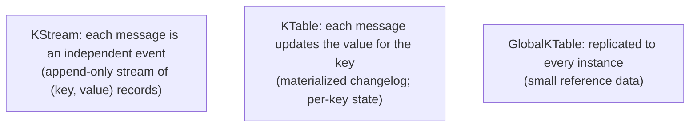

# Kafka Streams

Kafka Streams is **a Java library for stream processing on top of Kafka**. Not a separate cluster; not a Kafka feature — a library you embed in your Spring application that reads from Kafka topics, transforms / aggregates / joins, writes back to Kafka topics. Stateful operations (counts, windows, joins) maintain local **state stores** (RocksDB) backed by Kafka changelog topics for fault tolerance. If you've used Spark Streaming or Flink, Kafka Streams sits in the same neighborhood — but with much less operational overhead (no separate cluster) and tighter Kafka integration (uses partition assignment + offsets natively).

A senior engineer reaches for Kafka Streams when (a) the input is Kafka; (b) transformations are stateful (aggregations, joins, windowing); (c) the work doesn't justify a full Flink cluster. For simpler "consume → transform → produce", a Spring Kafka listener is enough. For complex multi-topic joins, time windows, or interactive queries against state, Streams fits.

This topic covers: the KStream / KTable / GlobalKTable abstractions; the DSL; the lower-level Processor API; stateful operations; windowing (tumbling, hopping, session, sliding); joins (stream-stream, stream-table, table-table); state stores (RocksDB) and changelog topics; interactive queries; Spring Cloud Stream Kafka Streams binder; Kafka Streams vs Flink.

> [!NOTE]
> Prerequisites: [Kafka fundamentals (T04)](./T04-apache-kafka-fundamentals.md), [Kafka deep (T05)](./T05-kafka-deep-partitions-consumer-groups-offsets.md).

## KStream vs KTable



- **KStream**: every record is an event. Click stream, sensor readings, log lines.
- **KTable**: every record is an update to a key's value. User profile changes, current price per symbol.
- **GlobalKTable**: KTable replicated to every Kafka Streams instance. For small reference data joined by every record.

The duality: a KTable is just a KStream with the convention "value is the latest state per key". `KStream.toTable()` and `KTable.toStream()` convert.

## The DSL — A Tour

```java
StreamsBuilder builder = new StreamsBuilder();

KStream<String, Order> orders = builder.stream("orders.placed");
KTable<String, Customer> customers = builder.table("customers");

// stateless ops
KStream<String, Order> bigOrders = orders.filter((k, o) -> o.total() > 100);
KStream<String, EnrichedOrder> enriched = bigOrders
    .map((k, o) -> KeyValue.pair(o.customerId(), o));   // re-key

// stream-table join
KStream<String, EnrichedOrder> joined = enriched
    .join(customers, (order, customer) -> new EnrichedOrder(order, customer));

// stateful aggregation
KTable<String, Long> orderCounts = orders
    .groupByKey()
    .count(Materialized.as("order-counts-store"));

// write back
joined.to("orders.enriched");

Topology topology = builder.build();
KafkaStreams streams = new KafkaStreams(topology, props);
streams.start();
```

The topology is a graph of operations; each input topic is a source; each `to()` a sink. Kafka Streams handles consumer assignment, state, threading.

## Stateful Operations

Group by key, then aggregate:

```java
KTable<String, Long> dailyOrderCount = orders
    .groupByKey()
    .windowedBy(TimeWindows.of(Duration.ofDays(1)))
    .count();
```

The `count()` is stateful — needs to remember running counts per key per window. Stored in a **RocksDB state store**.

For fault tolerance, every state store has a **changelog topic** in Kafka: every state change is also published. On restart / rebalance, state is rebuilt from the changelog.

## Windowing

Aggregations over time windows:

| Window | Use |
|--------|-----|
| **Tumbling** | non-overlapping fixed intervals (every 5 min) |
| **Hopping** | overlapping fixed intervals (5 min size, 1 min step) |
| **Session** | inactivity-based (close when no events for X) |
| **Sliding** | event-time-based with retention |

```java
// tumbling: 5-min windows, no overlap
.windowedBy(TimeWindows.of(Duration.ofMinutes(5)))

// hopping: 5-min size, advance by 1 min (overlapping)
.windowedBy(TimeWindows.of(Duration.ofMinutes(5)).advanceBy(Duration.ofMinutes(1)))

// session: close when 10 minutes of inactivity
.windowedBy(SessionWindows.with(Duration.ofMinutes(10)))
```

Result is a `KTable<Windowed<K>, V>` keyed by (window, key).

## Joins

### Stream-Table Join

```java
KStream<String, Order> orders = ...;       // events
KTable<String, Customer> customers = ...;  // state

orders.join(customers, (o, c) -> new OrderWithCustomer(o, c));
```

Order arrives; look up customer in KTable; enrich. Common pattern.

### Stream-Stream Join (windowed)

```java
KStream<String, Order> orders = ...;
KStream<String, Payment> payments = ...;

orders.join(payments,
    (o, p) -> new OrderWithPayment(o, p),
    JoinWindows.of(Duration.ofMinutes(5)));
```

Matches orders to payments within a 5-minute window. Both sides are streams; need a window because both are unbounded.

### Table-Table Join

```java
customers.join(addresses, (c, a) -> new CustomerWithAddress(c, a));
```

KTable joins are continuously-updated views.

## Interactive Queries

Local state stores can be queried directly:

```java
ReadOnlyKeyValueStore<String, Long> store =
    streams.store(StoreQueryParameters.fromNameAndType(
        "order-counts-store", QueryableStoreTypes.keyValueStore()));

Long count = store.get("customer-42");
```

Expose via REST:

```java
@GetMapping("/api/stats/{customerId}/orders")
public OrderCount get(@PathVariable String customerId) {
    Long count = store.get(customerId);
    return new OrderCount(customerId, count);
}
```

For distributed state (the store is local to this instance), use `KafkaStreams.metadataForKey` to find which instance holds the key and HTTP-route the request.

## Repartitioning

Many operations require records with the same key to land on the same partition (for stateful work). If you re-key, Kafka Streams writes to an internal repartition topic and re-consumes:

```java
KStream<String, Order> byCustomer = orders.selectKey((k, v) -> v.customerId());
// implicit repartition topic created
KTable<String, Long> counts = byCustomer.groupByKey().count();
```

Repartition topics are auto-managed but visible (named with internal prefix). They double write/read overhead; minimize re-keys.

## Spring Cloud Stream Kafka Streams Binder

```xml
<dependency>
    <groupId>org.springframework.cloud</groupId>
    <artifactId>spring-cloud-stream-binder-kafka-streams</artifactId>
</dependency>
```

```java
@Bean
public Function<KStream<String, Order>, KStream<String, EnrichedOrder>> enrich() {
    return orders -> orders
        .filter((k, o) -> o.total() > 100)
        .mapValues(o -> enrich(o));
}
```

```yaml
spring:
  cloud:
    stream:
      function:
        definition: enrich
      kafka:
        streams:
          binder:
            application-id: orders-streams-app
        bindings:
          enrich-in-0:
            destination: orders.placed
          enrich-out-0:
            destination: orders.enriched
```

Function-based binding; clean Spring integration; auto-configures the topology.

## Kafka Streams vs Flink

| Aspect | Kafka Streams | Flink |
|--------|:-------------:|:-----:|
| Deployment | embed in Spring app | separate cluster |
| Inputs | Kafka only | Kafka, Kinesis, files, sockets, DBs |
| State | RocksDB + Kafka | RocksDB / heap |
| Exactly-once | yes (Kafka transactions) | yes |
| Operational complexity | low | medium-high |
| Use case scale | medium | up to extreme |
| Windowing flexibility | good | excellent |
| ML integration | limited | extensive |

**Pick Kafka Streams when**: input is Kafka; team owns the service; moderate complexity.
**Pick Flink when**: multi-source; complex CEP; heavy windowing; team has stream-processing experience.

For most Spring teams in 2026: **Kafka Streams**. T11 covers Flink briefly.

## Common Pitfalls

> [!WARNING]
> **Over-repartitioning.** Each repartition doubles I/O. Plan key strategy.

> [!WARNING]
> **State store growth unbounded.** Apply windowing or session timeouts.

> [!WARNING]
> **No exception handler on stream.** Crashes consumer; group rebalances. Configure `DeserializationExceptionHandler`.

> [!WARNING]
> **Restart-rebuild from changelog is slow.** State stores in 100s of GB take minutes to rebuild. Use standby replicas.

> [!WARNING]
> **Interactive queries to non-local key.** Need to route to owner. Use metadata API.

> [!WARNING]
> **Side effects (HTTP calls) inside map().** Slow + un-replayable. Use Kafka Connect sink or async.

> [!WARNING]
> **Windowing without retention.** Old windows persist forever.

> [!WARNING]
> **Choosing Kafka Streams for non-Kafka inputs.** Wrong tool.

## Deeper Dive — End-to-End Spring Boot Kafka Streams

### Complete Topology — Real-Time Order Analytics

```java
@Configuration
@EnableKafkaStreams
public class OrderAnalyticsTopology {

    @Bean
    public KStream<String, Order> orderStream(StreamsBuilder builder) {
        // Input stream from "orders" topic
        KStream<String, Order> orders = builder.stream("orders",
            Consumed.with(Serdes.String(), JsonSerde.of(Order.class)));

        // Branch 1: high-value orders → priority topic
        orders
            .filter((key, order) -> order.amount().compareTo(BigDecimal.valueOf(1000)) > 0)
            .to("high-value-orders", Produced.with(Serdes.String(), JsonSerde.of(Order.class)));

        // Branch 2: per-customer aggregation (KTable)
        KTable<String, CustomerStats> customerStats = orders
            .selectKey((key, order) -> order.customerId())
            .groupByKey(Grouped.with(Serdes.String(), JsonSerde.of(Order.class)))
            .aggregate(
                CustomerStats::empty,
                (customerId, order, stats) -> stats.addOrder(order),
                Materialized.<String, CustomerStats, KeyValueStore<Bytes, byte[]>>
                    as("customer-stats-store")
                    .withKeySerde(Serdes.String())
                    .withValueSerde(JsonSerde.of(CustomerStats.class))
            );

        // Branch 3: 5-minute tumbling window aggregation
        orders
            .groupBy((key, order) -> order.category(),
                     Grouped.with(Serdes.String(), JsonSerde.of(Order.class)))
            .windowedBy(TimeWindows.ofSizeAndGrace(
                Duration.ofMinutes(5), Duration.ofMinutes(1)))
            .aggregate(
                CategoryStats::empty,
                (category, order, stats) -> stats.add(order),
                Materialized.<String, CategoryStats, WindowStore<Bytes, byte[]>>
                    as("category-stats-windowed")
                    .withRetention(Duration.ofHours(24))
            )
            .toStream()
            .map((wk, stats) -> new KeyValue<>(
                wk.key() + ":" + wk.window().startTime(),
                stats))
            .to("category-analytics", Produced.with(Serdes.String(), JsonSerde.of(CategoryStats.class)));

        return orders;
    }

    @Bean
    public KafkaStreamsConfiguration kStreamsConfig() {
        Map<String, Object> props = new HashMap<>();
        props.put(StreamsConfig.APPLICATION_ID_CONFIG, "order-analytics");
        props.put(StreamsConfig.BOOTSTRAP_SERVERS_CONFIG, "kafka:9092");

        // Reliability
        props.put(StreamsConfig.PROCESSING_GUARANTEE_CONFIG, EXACTLY_ONCE_V2);
        props.put(StreamsConfig.REPLICATION_FACTOR_CONFIG, 3);

        // Performance
        props.put(StreamsConfig.NUM_STREAM_THREADS_CONFIG, 4);   // 4 worker threads
        props.put(StreamsConfig.CACHE_MAX_BYTES_BUFFERING_CONFIG, 16 * 1024 * 1024); // 16 MB cache

        // Recovery
        props.put(StreamsConfig.NUM_STANDBY_REPLICAS_CONFIG, 1);   // hot standby per partition
        props.put(StreamsConfig.STATE_DIR_CONFIG, "/var/lib/kafka-streams");

        return new KafkaStreamsConfiguration(props);
    }
}
```

### Stream-Table Join — Enrich Orders with Customer Data

```java
@Bean
public KStream<String, EnrichedOrder> enrichmentTopology(StreamsBuilder builder) {
    // Customer data as GlobalKTable (replicated to all instances)
    GlobalKTable<String, Customer> customers = builder.globalTable("customers",
        Consumed.with(Serdes.String(), JsonSerde.of(Customer.class)),
        Materialized.as("customers-global-store"));

    KStream<String, Order> orders = builder.stream("orders",
        Consumed.with(Serdes.String(), JsonSerde.of(Order.class)));

    // Stream-GlobalKTable join — no co-partitioning needed
    return orders.join(
        customers,
        (orderId, order) -> order.customerId(),         // key extractor for join
        (order, customer) -> new EnrichedOrder(order, customer)
    );
}
```

**Why GlobalKTable**: Customer data is small (millions, not billions) and read-heavy. Replicate full table to every instance → join requires no network call.

### Stream-Stream Join — Click Followed by Purchase Within 30 Min

```java
KStream<String, Click> clicks = builder.stream("clicks");
KStream<String, Purchase> purchases = builder.stream("purchases");

KStream<String, AttributedPurchase> attributed = clicks.join(
    purchases,
    (click, purchase) -> new AttributedPurchase(click.productId(), purchase),
    JoinWindows.ofTimeDifferenceAndGrace(Duration.ofMinutes(30), Duration.ofMinutes(5)),
    StreamJoined.with(Serdes.String(), JsonSerde.of(Click.class), JsonSerde.of(Purchase.class))
);

attributed.to("purchase-attribution");
```

## Deeper Dive — State Store Recovery and Standby Replicas

### How State Stores Recover

```
NORMAL OPERATION:
  - Stream task processes records
  - State changes written to:
    a) Local RocksDB instance
    b) Changelog topic on Kafka (replicated)

CRASH RECOVERY:
  - Task reassigned to another instance
  - That instance reads changelog topic FROM BEGINNING
  - Rebuilds local RocksDB state
  - Resumes processing from last committed offset
  - DURATION: 30s - 30min depending on state size

WITH STANDBY REPLICAS (num.standby.replicas=1):
  - Standby instance maintains live copy of state
  - Reads changelog topic continuously (kept in sync)
  - On primary failure: standby promoted INSTANTLY
  - DURATION: 0s (already warm)
  - COST: 2× state storage
```

### Monitoring State Store Health

```java
@Component
public class StateStoreHealthIndicator implements HealthIndicator {
    private final StreamsBuilderFactoryBean streamsBuilder;

    @Override
    public Health health() {
        KafkaStreams streams = streamsBuilder.getKafkaStreams();
        if (streams == null) return Health.down().withDetail("reason", "Not started").build();

        State state = streams.state();
        if (state != State.RUNNING) {
            return Health.down().withDetail("state", state.name()).build();
        }

        // Check assignment
        Set<ThreadMetadata> threads = streams.metadataForLocalThreads();
        long activeTasks = threads.stream()
            .mapToLong(t -> t.activeTasks().size()).sum();

        return Health.up()
            .withDetail("state", state.name())
            .withDetail("active-tasks", activeTasks)
            .build();
    }
}
```

## Deeper Dive — Interactive Queries (REST API over State)

```java
@RestController
public class StateQueryController {
    private final StreamsBuilderFactoryBean factory;

    @GetMapping("/api/customer/{customerId}/stats")
    public CustomerStats getCustomerStats(@PathVariable String customerId) {
        KafkaStreams streams = factory.getKafkaStreams();

        // Find which instance owns this customer's partition
        KeyQueryMetadata metadata = streams.queryMetadataForKey(
            "customer-stats-store",
            customerId,
            Serdes.String().serializer()
        );

        if (metadata == null) {
            return CustomerStats.empty();   // not yet partitioned
        }

        HostInfo activeHost = metadata.activeHost();
        if (activeHost.equals(thisHostInfo())) {
            // Local query
            ReadOnlyKeyValueStore<String, CustomerStats> store = streams.store(
                StoreQueryParameters.fromNameAndType(
                    "customer-stats-store",
                    QueryableStoreTypes.keyValueStore()
                )
            );
            CustomerStats stats = store.get(customerId);
            return stats != null ? stats : CustomerStats.empty();
        } else {
            // Forward to remote instance
            return forwardToRemote(activeHost, customerId);
        }
    }

    private CustomerStats forwardToRemote(HostInfo host, String customerId) {
        return restTemplate.getForObject(
            "http://" + host.host() + ":" + host.port() + "/api/customer/" + customerId + "/stats",
            CustomerStats.class
        );
    }
}
```

**Pattern**: each instance owns its partition's state; queries route to the right instance via metadata.

## Deeper Dive — Common Topologies

### Pattern 1: Event Sourcing Projection

```java
// Build current state projection from event stream
KStream<String, AccountEvent> events = builder.stream("account-events");

KTable<String, AccountState> accountState = events
    .groupByKey()
    .aggregate(
        AccountState::initial,
        (accountId, event, state) -> state.apply(event),
        Materialized.as("account-state-store")
    );

// Now query current state via interactive queries
```

### Pattern 2: Real-Time Counters

```java
KStream<String, PageView> views = builder.stream("page-views");

KTable<Windowed<String>, Long> viewCounts = views
    .groupBy((key, view) -> view.pageUrl())
    .windowedBy(TimeWindows.ofSizeWithNoGrace(Duration.ofMinutes(1)))
    .count();

viewCounts.toStream()
    .foreach((wk, count) -> metrics.recordPageViews(wk.key(), count));
```

### Pattern 3: Fraud Detection Pipeline

```java
KStream<String, Transaction> txns = builder.stream("transactions");

// Compute rolling statistics per user
KTable<String, UserStats> userStats = txns
    .groupBy((k, txn) -> txn.userId())
    .aggregate(
        UserStats::empty,
        (userId, txn, stats) -> stats.addTransaction(txn),
        Materialized.as("user-stats")
    );

// Join transactions with their user stats; flag anomalies
txns
    .selectKey((k, txn) -> txn.userId())
    .join(userStats, (txn, stats) -> new TxnWithStats(txn, stats))
    .filter((userId, t) -> t.stats().isAnomalous(t.txn()))
    .to("flagged-transactions");
```

### Pattern 4: Stream-Stream Inner Join (Common: Click → Conversion Attribution)

```java
KStream<String, AdImpression> impressions = builder.stream("ad-impressions");
KStream<String, Click> clicks = builder.stream("clicks");

KStream<String, Attribution> attributions = impressions.join(
    clicks,
    (impression, click) -> new Attribution(impression, click),
    JoinWindows.ofTimeDifferenceAndGrace(Duration.ofHours(1), Duration.ofMinutes(5)),
    StreamJoined.with(Serdes.String(), JsonSerde.of(AdImpression.class), JsonSerde.of(Click.class))
);

attributions.to("attribution-events");
```

## Deeper Dive — Exactly-Once Processing (EOS)

```
TRADITIONAL CONSUME-PROCESS-PRODUCE has TWO consistency issues:
  1. Process completed but offset commit failed → re-process on restart
  2. Produce succeeded but commit failed → duplicate output

KAFKA TRANSACTIONS solve this:
  - Producer marked transactional
  - Consumer reads only committed messages
  - Offset commits happen WITHIN the producer transaction

KAFKA STREAMS abstracts this:
  - Set processing.guarantee=exactly_once_v2 (since Kafka 2.5+)
  - Streams handles transactional producer/consumer internally
  - Trade-off: ~10-15% throughput hit
  - Recommended for: financial, idempotency-critical pipelines
```

```java
props.put(StreamsConfig.PROCESSING_GUARANTEE_CONFIG, StreamsConfig.EXACTLY_ONCE_V2);
```

## Deeper Dive — Kafka Streams vs Flink (Detailed Decision)

| Aspect | Kafka Streams | Flink |
|---|---|---|
| **Deployment** | Embedded library | Cluster (JobManager + TaskManagers) |
| **Input/Output** | Kafka only | Kafka + many connectors (JDBC, S3, Kinesis) |
| **Windowing** | Tumbling, hopping, session, sliding | All + custom + side outputs |
| **State** | RocksDB local | RocksDB + State Backends + Savepoints |
| **EOS** | Yes (within Kafka) | Yes (across all connectors) |
| **Throughput** | Per-instance (1-100K msg/sec/thread) | Distributed cluster (millions+) |
| **Latency** | Sub-second | Sub-second |
| **Learning curve** | Low (Kafka + DSL) | Moderate to high |
| **Operational complexity** | Low | Moderate to high |
| **Cost** | Free | Free OSS but needs cluster |
| **Use for** | Microservice-scale streaming | Heavy analytics, multi-source ETL |

**Decision shortcut**:
- Inputs are all Kafka, small-to-medium scale → Kafka Streams
- Need diverse inputs/outputs, complex windowing, savepoints → Flink
- Want managed → AWS Kinesis Analytics, Confluent Cloud Streams, Google Dataflow

## Deeper Dive — Spring Cloud Stream Functional Style

```java
@SpringBootApplication
public class OrderApp {
    public static void main(String[] args) { SpringApplication.run(OrderApp.class, args); }

    @Bean
    public Function<KStream<String, Order>, KStream<String, EnrichedOrder>> enrichOrders() {
        return orders -> orders
            .filter((k, order) -> order.amount().signum() > 0)
            .mapValues(order -> new EnrichedOrder(order, lookupCustomer(order.customerId())));
    }
}
```

```yaml
spring:
  cloud:
    stream:
      bindings:
        enrichOrders-in-0.destination: orders
        enrichOrders-out-0.destination: enriched-orders
      kafka:
        streams:
          binder:
            applicationId: order-app
            brokers: kafka:9092
            configuration:
              processing.guarantee: exactly_once_v2
              num.standby.replicas: 1
```

Spring Cloud Stream binds the function name to input/output topics; no manual StreamsBuilder needed.

## Deeper Dive — Production Operational Checklist

```
BEFORE DEPLOYING TO PRODUCTION:
  ☐ NUM_STANDBY_REPLICAS_CONFIG = 1 (or 2 for critical)
  ☐ REPLICATION_FACTOR_CONFIG = 3
  ☐ PROCESSING_GUARANTEE_CONFIG set appropriately
  ☐ STATE_DIR_CONFIG on durable volume (not /tmp!)
  ☐ Metrics exposed via JMX → Prometheus
  ☐ Alert on:
    - State stores in RESTORING longer than expected (initial startup is OK)
    - Process latency p99 > target
    - Consumer lag growing on input topics
    - Rebalance frequency > expected
    - JVM heap / GC pressure

ON DEPLOY:
  ☐ Rolling restart with rebalance.protocol=cooperative
  ☐ Verify state stores fully restored before serving queries
  ☐ Smoke-test interactive queries

ON-CALL RUNBOOK CONSIDERATIONS:
  ☐ How to scale up: increase NUM_STREAM_THREADS or add instances
  ☐ How to reset offsets: kafka-streams-application-reset.sh
  ☐ How to debug a stuck topology: jstack + thread dump
  ☐ How to roll back if state was corrupted: redeploy with reset + standby promotion
```

## Practice

1. Build a topology: filter + map + write to output topic. Run with embedded Kafka.
2. Add stateful count by key with materialized store. Verify state in RocksDB.
3. Stream-table join: enrich orders with customer data.
4. Add tumbling window aggregation; verify per-window counts.
5. Expose interactive query via REST; query state directly.
6. Wire Spring Cloud Stream Kafka Streams binder; declare functions.
7. Simulate restart; observe state rebuild from changelog.
8. Compare same workload Kafka Streams vs Flink (if available).

## Recap

You should now be able to:

- Distinguish KStream (events), KTable (state), GlobalKTable (replicated).
- Build topologies with the DSL: filter, map, join, aggregate, window.
- Apply stateful operations with RocksDB state stores + changelog topics.
- Choose windowing: tumbling, hopping, session, sliding.
- Implement stream-table, stream-stream (windowed), and table-table joins.
- Expose interactive queries against local state stores.
- Use Spring Cloud Stream binder for function-style topologies.
- Choose Kafka Streams vs Flink based on inputs and team capability.
- Avoid the canonical pitfalls: over-repartitioning, unbounded state, side effects in map, slow restart with no standbys.

## Next

Continue to [Event-driven architecture](./T07-event-driven-architecture.md) for the architectural pattern of services communicating through events — choreography, event sourcing, CQRS, and the design discipline.
