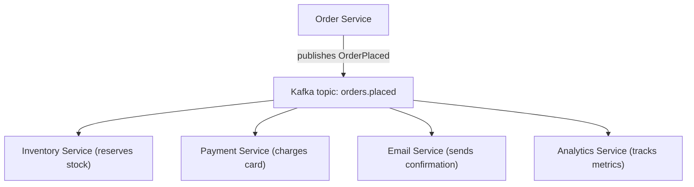
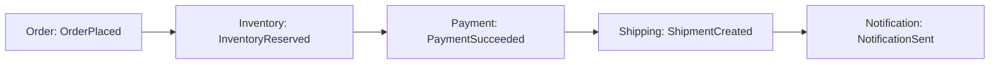
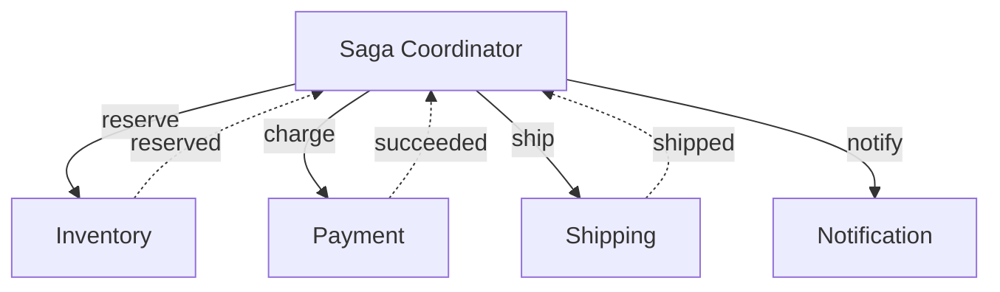
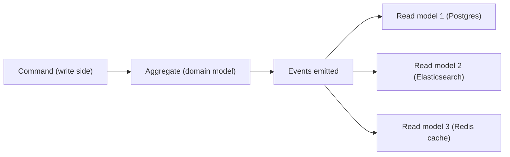
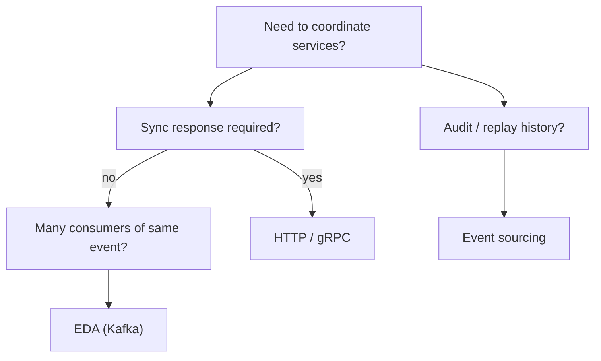

# Event-driven architecture

In **event-driven architecture (EDA)**, services communicate primarily through **events** — immutable facts about something that happened — rather than direct commands. A service publishes "OrderPlaced"; whoever cares (inventory, payment, email, analytics) consumes independently. This contrasts with **command-driven** (request-response, RPC, HTTP): A explicitly tells B "do this and respond". EDA fundamentally **decouples** services: producers don't know about consumers; consumers don't know about producers; both depend only on the event schema.

EDA enables: **loose coupling**, **independent scaling**, **resilience** (consumer down doesn't kill producer), **fan-out** to many consumers (analytics, search, notifications, ML), **event sourcing** (events as the system of record), **CQRS** (write side emits events; read side projects from them). The complexity costs: **eventual consistency**, **harder debugging** (no clear request trace), **schema versioning**, and the **two principal flavors** of cross-service coordination — choreography (pure event-react) vs orchestration (saga coordinator).

A senior engineer designs EDA deliberately, knowing it's not free. **Domain events** are first-class; service boundaries align with event ownership; **eventual consistency** is acknowledged; the coordination model (choreography vs orchestration) is chosen per business workflow.

This topic covers: commands vs events; the EDA pattern; choreography vs orchestration (sagas); event sourcing; CQRS; event schemas and versioning; domain events vs integration events; how Kafka enables EDA; the operational reality.

> [!NOTE]
> Prerequisites: [Kafka fundamentals (T04)](./T04-apache-kafka-fundamentals.md), [Outbox / Kafka in Spring (L4/C01/T22)](../C01-spring-framework/T22-spring-for-kafka-amqp.md).

## Commands vs Events

| Aspect | Command | Event |
|--------|---------|-------|
| Tense | imperative ("PlaceOrder") | past tense ("OrderPlaced") |
| Direction | targeted at specific service | broadcast to anyone interested |
| Owner | sender knows recipient | producer doesn't know consumers |
| Mutability | request for change | immutable fact |
| Failure semantics | needs response | fire-and-forget |
| Cardinality | one-to-one | one-to-many possible |

Both have places. **Modern systems use both**: commands for direct service-to-service work (HTTP, gRPC); events for cross-cutting and downstream effects.

## EDA Pattern



`OrderPlaced` is published once; four services consume independently. Order service doesn't know about analytics; analytics doesn't know about email.

Adding a new consumer (e.g., a tax-reporting service) requires zero changes to producer. **This is the EDA win.**

## Choreography Vs Orchestration

For multi-step workflows ("place order → reserve inventory → charge payment → ship → notify"), two patterns:

### Choreography

Each service reacts to events; emits new events; no central coordinator.



Each step is independent. Failures handled via compensating events (PaymentFailed → InventoryReleased).

Pros: maximum decoupling; services own their part.
Cons: hard to trace; failure recovery complex; emergent behavior.

### Orchestration (Saga Pattern)

A central **saga coordinator** orchestrates the workflow — sends commands, waits for replies, retries, compensates on failure.



Pros: explicit workflow; easy to debug; clear failure handling.
Cons: coordinator is a coupling point; potential bottleneck.

For complex workflows with many steps and clear failure paths, orchestration usually wins. For simple "fan-out and forget" patterns, choreography is lighter.

Frameworks: **Axon**, **Eventuate**, custom Spring State Machine.

## Event Sourcing

Instead of storing the current state, store **the sequence of events** that led to it. Current state is derived by replaying events.

```
Account.created(id=42, balance=0)
Account.deposited(id=42, amount=100)
Account.deposited(id=42, amount=50)
Account.withdrawn(id=42, amount=30)
→ derived state: balance=120
```

Benefits:

- **Audit log built in**: every change recorded.
- **Time travel**: state at any past point.
- **New views easy**: rebuild from events for new read models.
- **Easier reasoning** about what happened.

Costs:

- **Read complexity**: current state requires aggregation; **snapshots** mitigate.
- **Event schema evolution**: old events still in store; migrations needed.
- **Tooling immaturity** (compared to CRUD).

For most apps, **traditional CRUD with audit log + Debezium-style CDC**, is enough. Event sourcing is the right answer for **financial / regulated / domain-rich systems**.

## CQRS

**Command-Query Responsibility Segregation**: separate write model (commands) from read model (queries).



Write side: receives commands; emits events.
Read side: subscribes to events; builds optimized views (each for its query pattern).

Often combined with event sourcing but independent. CQRS-without-event-sourcing: command handler writes to DB; CDC streams events; read views derived.

Use when: read patterns very different from write; multiple read models needed.

## Domain Events vs Integration Events

- **Domain event**: internal to a bounded context. "Order.itemAdded". Used by the aggregate itself.
- **Integration event**: published to other services. "OrderPlaced". Crosses bounded contexts.

Domain events tend to be more granular and frequent; integration events are coarser and business-meaningful. **Don't expose internal domain events to other services** — they'll couple to your internals.

## Event Schema

Events are **contracts**. Versioning matters more than for queues:

- Use Avro / Protobuf + Schema Registry for compatibility checks.
- Event names + fields should be business-meaningful, not implementation-driven.
- Once consumed by another service, events are **forever-public API**.

Schema evolution rules:

- **Backward compatible**: old consumers can read new events.
- **Forward compatible**: new consumers can read old events.
- **Add fields with defaults** (safe); **never rename or repurpose fields**.

## When EDA Is Right



EDA is *not* a default. Use when fan-out, decoupling, or replay genuinely pay.

## Operational Reality

EDA brings ops concerns:

- **Schema drift**: old producers emit fields new consumers don't expect.
- **Eventual consistency**: read-after-write gap.
- **Trace gaps**: causation across events hard to follow without correlation IDs.
- **DLQ for poison messages**: T10.
- **Event replay**: rebuild read model from history; takes hours for big streams.
- **Schema registry as critical dependency**.

Wire OpenTelemetry tracing across event publish + consume so traces follow events.

## Spring Implementation

For Spring teams, Kafka + Spring Boot + outbox is the standard:

```java
@Transactional
public Order place(OrderRequest req) {
    Order o = repo.save(new Order(req));
    outbox.save(new OutboxEvent("orders.placed", o.id(), serialize(new OrderPlaced(o))));
    return o;
}

// Debezium reads outbox → Kafka topic → consumers
```

Application emits events via outbox (T09); Debezium / CDC publishes; consumers handle independently.

## Common Pitfalls

> [!WARNING]
> **EDA for everything.** Not all interactions are events. Use commands where appropriate.

> [!WARNING]
> **No schema management.** JSON drift breaks consumers; Schema Registry + Avro / Protobuf.

> [!WARNING]
> **Domain events leaking as integration events.** Coupling to internals.

> [!WARNING]
> **No event versioning.** Breaking changes propagate.

> [!WARNING]
> **No DLQ.** Failed events accumulate; processing blocked.

> [!WARNING]
> **Saga without compensation logic.** Partial workflows leave inconsistent state.

> [!WARNING]
> **Event sourcing for simple CRUD.** Over-engineering.

> [!WARNING]
> **No correlation IDs.** Can't trace across services.

## Practice

1. Design events for an order workflow: OrderPlaced, InventoryReserved, PaymentSucceeded, etc.
2. Implement choreography in 3 services via Kafka + Spring.
3. Add an orchestrator service that drives the workflow; compare to choreography.
4. Implement event sourcing for a small aggregate (Account); replay to current state.
5. Build a CQRS pair: command-side writes to Postgres + emits events; query-side projects to Elasticsearch.
6. Evolve an event schema; verify backward/forward compatibility via Schema Registry.
7. Trace events end-to-end with OpenTelemetry correlation IDs.
8. Audit your service: which interactions are commands vs events? Should any flip?

## Recap

You should now be able to:

- Distinguish commands (request-response) from events (immutable facts).
- Apply EDA: producer publishes once; many consumers subscribe.
- Choose choreography (decentralized) vs orchestration (saga coordinator).
- Apply event sourcing for audit-heavy / domain-rich systems.
- Apply CQRS to separate write commands from read projections.
- Distinguish domain events (internal) from integration events (cross-context).
- Manage event schema via Avro/Protobuf + Schema Registry + compatibility rules.
- Implement with Spring + Kafka + outbox pattern.
- Plan operations: tracing, DLQ, replay, versioning.
- Avoid the canonical pitfalls: EDA for everything, leaking domain events, no schema management, no DLQ.

## Next

Continue to [Async processing patterns](./T08-async-processing-patterns.md) for patterns of async work — task queues, scheduled jobs, fire-and-forget, request-reply over messaging.
