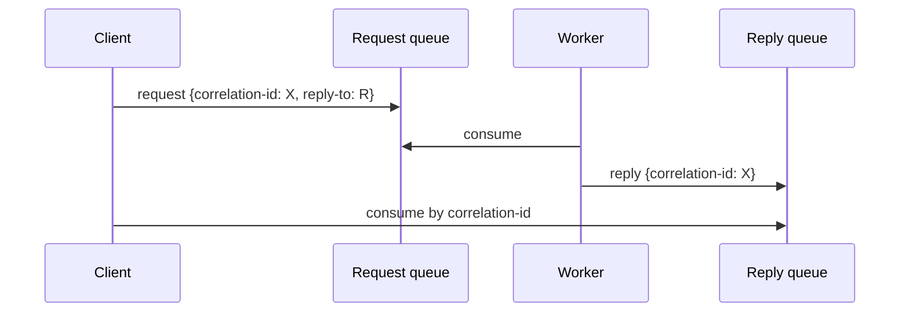

# Async processing patterns

"Async processing" covers a family of patterns where work happens *not on the request thread*: the API accepts; queues the work; returns immediately; a worker processes later. Used for: **slow operations** (sending email; PDF generation; image transcoding); **bursty work** that doesn't fit synchronous SLA; **scheduled jobs** (nightly reports); **long workflows** (multi-step processing); **fan-out** (one request triggers many downstream tasks).

A senior engineer picks the right pattern: **`@Async` + thread pool** for simple in-process offload; **scheduled jobs** (`@Scheduled` / Quartz) for cron-style; **task queues** (RabbitMQ / SQS) for distributed work; **Kafka consumer groups** for event-driven workers; **streaming** (Kafka Streams / Flink) for continuous transformations. Each has operational characteristics — durability, ordering, retries, scaling.

This topic covers: Spring `@Async`; `CompletableFuture` orchestration; `@Scheduled` and Quartz for cron jobs; RabbitMQ as task queue (the "Celery / Sidekiq" Java pattern); Kafka consumer groups as worker pools; request-reply over messaging; the decision matrix.

> [!NOTE]
> Prerequisites: [Messaging concepts (T01)](./T01-messaging-concepts-queues-topics-pub-sub.md), [RabbitMQ (T03)](./T03-rabbitmq-amqp.md), [Kafka (T04)](./T04-apache-kafka-fundamentals.md).

## In-Process: `@Async`

For "fire off work; don't block the caller":

```java
@Configuration
@EnableAsync
public class AsyncConfig {

    @Bean public Executor taskExecutor() {
        return new ThreadPoolTaskExecutorBuilder()
            .corePoolSize(8)
            .maxPoolSize(16)
            .queueCapacity(100)
            .threadNamePrefix("async-")
            .build();
    }
}

@Service
public class EmailService {

    @Async
    public CompletableFuture<Void> send(String to, String body) {
        // ... slow SMTP
        return CompletableFuture.completedFuture(null);
    }
}
```

`@Async`-annotated method returns immediately; runs on the executor; caller gets `void` or `CompletableFuture<T>` for result.

**Caveats**:

- Same JVM only; in-process queue.
- Crashes lose queued work.
- No persistence.
- Self-invocation bypasses proxy (T05 of C01).

Right for: short non-critical work; UX latency masking. Not right for important durable work — use a real queue.

### `CompletableFuture` Orchestration

For parallel work in one method:

```java
public OrderDetail getDetail(long id) {
    CompletableFuture<User> user = userClient.getAsync(id);
    CompletableFuture<List<Order>> orders = orderClient.recentForUserAsync(id);
    CompletableFuture<Inventory> inv = inventoryClient.getAsync(id);

    return CompletableFuture.allOf(user, orders, inv)
        .thenApply(_ -> new OrderDetail(user.join(), orders.join(), inv.join()))
        .join();
}
```

Three async calls run in parallel; combined when all done. Comparable to Reactor's `Mono.zip`. With virtual threads (Java 21+), use `StructuredTaskScope` for cleaner syntax (T07 of C06).

## Scheduled Jobs

### `@Scheduled`

```java
@Configuration
@EnableScheduling
public class SchedulingConfig { }

@Service
public class NightlyReports {

    @Scheduled(cron = "0 0 2 * * *")   // 2 AM daily
    public void runDailyReport() { ... }

    @Scheduled(fixedDelay = 60_000)
    public void poll() { ... }

    @Scheduled(fixedRate = 5000)
    public void emitMetrics() { ... }
}
```

Runs on a single Spring thread by default. Single-instance only — if you scale horizontally, multiple instances all run the job!

### Multi-Instance Scheduling

Three approaches:

- **ShedLock**: distributed lock (Redis / DB) ensures only one instance runs the job.
- **Quartz cluster**: shared DB; one node elected.
- **Kubernetes CronJob**: schedule outside the app; spin up a pod.

```java
@SchedulerLock(name = "nightlyReports", lockAtMostFor = "10m")
@Scheduled(cron = "0 0 2 * * *")
public void run() { ... }
```

### Quartz

For complex scheduling (persistent triggers, misfire policies, clustering):

```xml
<dependency>
    <groupId>org.springframework.boot</groupId>
    <artifactId>spring-boot-starter-quartz</artifactId>
</dependency>
```

```yaml
spring:
  quartz:
    job-store-type: jdbc
    properties:
      org.quartz.jobStore.isClustered: true
```

Quartz persists triggers in DB; cluster-aware; misfire handling. Heavier than `@Scheduled` but production-grade.

## Task Queue: RabbitMQ Pattern

For distributed work — multiple workers, durable queue:

```java
@RestController
public class PdfController {
    private final RabbitTemplate rabbit;

    @PostMapping("/api/pdf")
    public ResponseEntity<JobAccepted> generate(@RequestBody PdfRequest req) {
        String jobId = UUID.randomUUID().toString();
        rabbit.convertAndSend("pdf.jobs", new PdfJob(jobId, req));
        return ResponseEntity.accepted()
            .body(new JobAccepted(jobId, "/api/pdf/" + jobId + "/status"));
    }
}

@Component
public class PdfWorker {

    @RabbitListener(queues = "pdf.jobs", concurrency = "4-8")
    public void process(PdfJob job) {
        byte[] pdf = renderPdf(job.request());
        storeResult(job.jobId(), pdf);
    }
}
```

API returns 202 (Accepted) with a polling URL. Workers pick up; process; store result. Classic task-queue pattern.

Right for: image/video processing, report generation, email/SMS dispatch, bulk imports.

## Worker Pattern: Kafka Consumer Groups

For event-driven work (T05):

```java
@KafkaListener(topics = "events", concurrency = "8", groupId = "event-processor")
public void process(Event e) { ... }
```

8 consumers in the group; partition assignment distributes work; horizontally scalable; durable (replay possible).

When to pick Kafka vs RabbitMQ as task queue:

- **RabbitMQ**: classic task queue; no replay; per-message ack semantics; pricing.
- **Kafka**: event-driven; replay; high throughput; consumer offsets.

For simple "run this task" — RabbitMQ. For "react to this event" — Kafka.

## Request-Reply Over Messaging

Sometimes the producer needs a result. Pattern:



```java
ReceivedOrder reply = (ReceivedOrder) rabbit.convertSendAndReceive(
    "rpc.exchange", "process", order);
```

Spring AMQP handles correlation; auto-creates reply queue.

Often **simpler to use gRPC / HTTP for sync calls** — request-reply over messaging adds complexity without real benefit unless the messaging infrastructure exists.

## JobRunr — Simpler Java Alternative

```xml
<dependency>
    <groupId>org.jobrunr</groupId>
    <artifactId>jobrunr-spring-boot-3-starter</artifactId>
</dependency>
```

```java
BackgroundJob.enqueue(() -> emailService.send(to, body));   // fire-and-forget
BackgroundJob.schedule(Instant.now().plus(Duration.ofMinutes(30)),
    () -> reportService.generateAndEmail(userId));
```

Database-backed; persistence; dashboard UI; retries. The "Sidekiq" of Java. Right for moderate workloads where you don't want a full queue infrastructure.

## Pattern Decision Matrix

| Workload | Pick |
|----------|------|
| Short fire-and-forget; non-critical | `@Async` |
| Parallel work in one method | `CompletableFuture` / `StructuredTaskScope` |
| Cron-style scheduled, single instance | `@Scheduled` |
| Scheduled, multi-instance | `@Scheduled` + ShedLock or Quartz cluster |
| Long-running, persistent jobs with UI | JobRunr or Quartz |
| Distributed task queue (PDF, email) | RabbitMQ |
| Event-driven workers | Kafka consumer group |
| Long workflow with steps | Saga orchestration (T07) |
| Sub-second batch ingestion | Kafka + Streams |
| Need response (sync) | gRPC / HTTP, not messaging |

## Common Pitfalls

> [!WARNING]
> **`@Async` for important durable work.** Lost on JVM crash. Use queue.

> [!WARNING]
> **`@Scheduled` on N instances without locking.** Job runs N times.

> [!WARNING]
> **Slow async work blocking the executor pool.** Saturate; new tasks queue then reject.

> [!WARNING]
> **Self-invocation of `@Async`.** Proxy not in path. Same as `@Transactional` trap.

> [!WARNING]
> **Request-reply over messaging when sync HTTP would do.** Overkill.

> [!WARNING]
> **Long polling in `@Scheduled(fixedDelay)` blocking other jobs.** Single thread; one job blocks all.

> [!WARNING]
> **No idempotency on workers.** Retries double-process.

> [!WARNING]
> **No backpressure on producer.** Queue grows to OOM.

## Practice

1. Wire `@Async` with a custom thread pool. Send 100 emails async; observe pool behavior.
2. Use `CompletableFuture` to parallelize 3 calls; compare wall-time vs sequential.
3. Add `@Scheduled` cron job; verify works in single instance.
4. Scale to 3 instances; observe job runs 3×. Add ShedLock; verify runs once.
5. Build a RabbitMQ task queue for PDF generation; submit via API; consume on workers.
6. Build the same as Kafka consumer group; compare ergonomics.
7. Implement request-reply over RabbitMQ; compare to gRPC.
8. Set up JobRunr; queue 1000 jobs; observe dashboard.

## Recap

You should now be able to:

- Pick the right async pattern: `@Async` (in-process), `@Scheduled` (cron), RabbitMQ (task queue), Kafka (event-driven), JobRunr / Quartz (persistent jobs).
- Use `CompletableFuture` for parallel work; consider `StructuredTaskScope` in JDK 21+.
- Configure thread pools with bounded queues; size by workload.
- Apply ShedLock or Quartz cluster for multi-instance scheduled jobs.
- Build durable task queues with RabbitMQ + Spring AMQP.
- Implement worker pools with Kafka consumer groups.
- Reach for request-reply over messaging only when sync HTTP doesn't fit.
- Avoid the canonical pitfalls: durable work via `@Async`, scheduled-without-lock, self-invocation, non-idempotent retries.

## Next

Continue to [Outbox pattern & exactly-once](./T09-outbox-pattern-and-exactly-once.md) for the canonical pattern of atomic DB write + message publish — and the route to effective exactly-once across heterogeneous systems.
