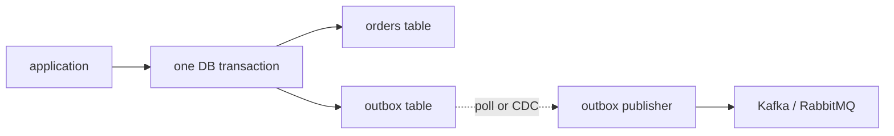
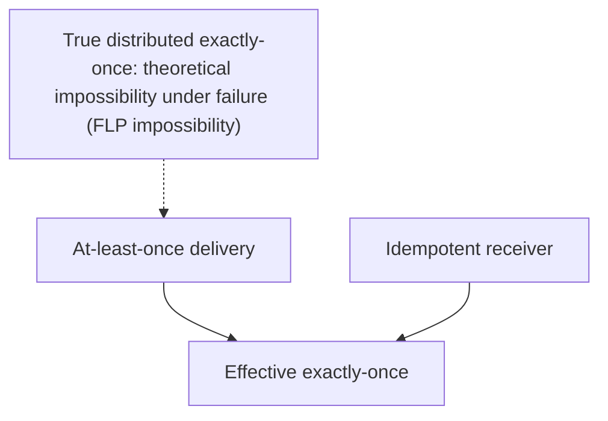

# Outbox pattern & exactly-once

T22 of C01 introduced the outbox; T06 of C03 covered Debezium; T07 of C07 framed EDA. **This topic** consolidates the patterns that solve the central distributed-systems problem: **atomic DB write + message publish**. The naive approach (write to DB; then publish to broker) is the **dual-write problem**: two writes that can fail independently; data diverges. **Transactional outbox** + **CDC** is the canonical, robust answer. Combined with **idempotent receivers**, it gives **effectively exactly-once** semantics — distributed systems' holy grail.

A senior engineer ships outbox + idempotent receivers as the default for any cross-service event published in response to a DB transaction. Without it, you have eventual-loss or eventual-duplicate problems that surface randomly under failure.

This topic covers: the dual-write problem deeply; outbox pattern variants (poller-based vs CDC-based); Debezium + EventRouter SMT for clean event topology; Kafka transactions for consume-process-produce exactly-once; idempotent receivers with deduplication; the limits of "exactly-once" (effectively-exactly-once is achievable; true distributed exactly-once is not); Spring implementation pattern.

> [!NOTE]
> Prerequisites: [Spring for Kafka (L4/C01/T22)](../C01-spring-framework/T22-spring-for-kafka-amqp.md), [Debezium CDC (L4/C03/T06)](../C03-databases-advanced/T06-change-data-capture-debezium.md), [EDA (T07)](./T07-event-driven-architecture.md).

## The Dual-Write Problem

```mermaid
sequenceDiagram
  participant App
  participant DB
  participant Broker
  App->>DB: write order
  Note over App: success
  App->>Broker: publish OrderPlaced
  Note over Broker: ❌ broker down or network blip
  Note over App,Broker: DB has order; no event published<br/>downstream services never know
```

The two writes can fail independently:

- DB succeeds; broker fails → event lost.
- DB fails; broker succeeds → ghost event for non-existent state.
- Both succeed but service crashes between → unknown.

XA transactions across DB + broker exist but are slow, brittle, and rarely supported by modern brokers (Kafka has them but with constraints).

## The Outbox Pattern

Write the event to an **outbox table** in the **same DB transaction** as the domain change. A separate process publishes from the outbox to the broker.



The DB transaction atomically writes both rows. If anything fails, both roll back. If both commit, the event is durably staged in the outbox; the publisher *will eventually* deliver it.

## Outbox Schema

```sql
CREATE TABLE outbox (
    id UUID PRIMARY KEY,
    aggregate_type VARCHAR(80) NOT NULL,    -- "Order"
    aggregate_id VARCHAR(80) NOT NULL,       -- "42"
    event_type VARCHAR(80) NOT NULL,         -- "OrderPlaced"
    payload JSONB NOT NULL,
    created_at TIMESTAMPTZ DEFAULT NOW(),
    published_at TIMESTAMPTZ                -- null until published
);
CREATE INDEX idx_outbox_unpublished ON outbox(created_at) WHERE published_at IS NULL;
```

The application writes; the publisher updates `published_at`.

## Application Code

```java
@Service
@Transactional
public class OrderService {

    private final OrderRepository orders;
    private final OutboxRepository outbox;
    private final ObjectMapper json;

    public Order place(PlaceOrderRequest req) {
        Order o = orders.save(new Order(req));

        var payload = json.valueToTree(new OrderPlaced(o.id(), o.customerId(), o.total()));
        outbox.save(new OutboxEntry(
            UUID.randomUUID(),
            "Order",
            o.id().toString(),
            "OrderPlaced",
            payload.toString()
        ));
        return o;
    }
}
```

Both writes in one Spring transaction. Atomicity guaranteed.

## Publisher: Two Approaches

### Polling Publisher

A scheduled job reads unpublished outbox rows, publishes, marks them.

```java
@Component
public class OutboxPoller {

    @Scheduled(fixedDelay = 500)
    @Transactional
    public void publish() {
        List<OutboxEntry> batch = outboxRepo.findUnpublishedTop(100);
        for (OutboxEntry e : batch) {
            kafkaTemplate.send(topicFor(e.eventType()), e.aggregateId(), e.payload());
            outboxRepo.markPublished(e.id());
        }
    }
}
```

Pros: simple; no extra infrastructure.
Cons: polling latency (500 ms above); needs cluster-aware locking for HA.

### Debezium CDC Publisher

Debezium reads the outbox table's WAL (T06 of C03); publishes to Kafka. With the **EventRouter SMT**, the routing target is derived from the row's `aggregate_type`:

```yaml
"transforms": "outbox",
"transforms.outbox.type": "io.debezium.transforms.outbox.EventRouter",
"transforms.outbox.table.field.event.type": "event_type",
"transforms.outbox.route.topic.replacement": "${routedByValue}.events"
```

Now `OrderPlaced` events go to `Order.events`; `PaymentSucceeded` to `Payment.events`.

Pros: low latency (~seconds); reliable; production-grade.
Cons: extra infrastructure (Debezium + Kafka Connect).

For serious production: Debezium. For small services: polling.

## Pruning

The outbox grows. Either:

- **Delete after publish** (the simplest): publisher deletes immediately after publish.
- **Mark and prune later**: keeps audit; nightly cleanup.

```sql
DELETE FROM outbox WHERE published_at < NOW() - INTERVAL '7 days';
```

Keep some history for debugging; not forever.

## Why Outbox Is At-Least-Once

The publisher can crash between sending to broker and marking published. Restart re-sends. **Duplicates are guaranteed possible.**

The receiving side must be **idempotent**.

## Idempotent Receivers — Deduplication

```java
@Component
public class OrderPlacedHandler {

    private final ProcessedEventRepository processed;

    @Transactional
    @KafkaListener(topics = "Order.events")
    public void on(OrderPlaced event, @Header(KafkaHeaders.RECEIVED_KEY) String key) {
        if (processed.exists(event.eventId())) {
            return;   // dedup
        }
        processed.save(new ProcessedEvent(event.eventId(), Instant.now()));

        // business logic
        emailService.send(event.customerId(), confirmationFor(event));
    }
}
```

`processed_events` table tracks every event id we've consumed. Re-delivery = no-op.

For business logic that's naturally idempotent (e.g., `findOrCreate`), explicit dedup may not be needed. But the discipline is: **assume duplicates can arrive; handle gracefully**.

## Kafka Transactions — Exactly-Once Within Kafka

For consume-process-produce *within Kafka*, exactly-once is achievable:

```yaml
spring:
  kafka:
    producer:
      transaction-id-prefix: tx-orders-
      enable.idempotence: true
    consumer:
      isolation.level: read_committed
```

```java
@Transactional("kafkaTransactionManager")
@KafkaListener(topics = "orders.placed")
public void process(OrderPlaced event) {
    EnrichedOrder enriched = enrich(event);
    template.send("orders.enriched", enriched.id(), enriched);
    // consumer offset commit + outbound message in one Kafka tx
}
```

Within Kafka: read message → process → write message + commit consumer offset all atomically. Downstream consumers (with `read_committed`) see only committed messages.

This is **true exactly-once within Kafka's universe**. Cross-system exactly-once is impossible without idempotent receivers.

## The Effective Exactly-Once Pattern

For most cross-system needs:

**At-least-once delivery + idempotent receiver = effectively exactly-once.**

The producer (outbox + CDC) guarantees no loss. The consumer (dedup by event id) guarantees no duplicate effect. Net: each event has exactly-one observable effect.

This is the **standard industry pattern**. Don't chase true distributed exactly-once; do at-least-once-plus-idempotent.

## The Limits



Strict exactly-once delivery across systems would require atomic commitment across them (2PC); impossible during arbitrary failure modes. The Lamport / Lynch impossibility results formalize this.

Effective exactly-once is achievable and sufficient.

## Worked Example — Order + Payment

```java
@Service
@Transactional
public class OrderService {
    public Order place(PlaceOrderRequest req) {
        Order o = orderRepo.save(new Order(req));
        outboxRepo.save(OutboxEntry.of("Order", o.id().toString(), "OrderPlaced",
            new OrderPlaced(o.id(), o.customerId(), o.total())));
        return o;
    }
}

// Debezium publishes outbox → Kafka topic Order.events

@Component
public class PaymentService {

    private final ProcessedEventRepository processed;
    private final OrderRepository orders;
    private final OutboxRepository outbox;

    @Transactional
    @KafkaListener(topics = "Order.events")
    public void on(OrderPlaced event) {
        if (processed.exists(event.eventId())) return;
        processed.save(new ProcessedEvent(event.eventId(), Instant.now()));

        // 1. Charge card
        ChargeResult result = paymentGateway.charge(event.customerId(), event.total());

        // 2. Update order status
        orders.findById(event.orderId()).orElseThrow()
            .markPaid(result.transactionId());

        // 3. Emit downstream event via outbox
        outbox.save(OutboxEntry.of("Payment", event.orderId().toString(), "PaymentSucceeded",
            new PaymentSucceeded(event.orderId(), result.transactionId(), Instant.now())));
    }
}
```

Atomic: payment + status + outbox all in one transaction. Dedup ensures retry safety. Net: order placed → payment processed exactly once; PaymentSucceeded event fires effectively-exactly-once.

## Common Pitfalls

> [!WARNING]
> **No outbox; write-then-publish.** Dual-write problem; eventually loses or duplicates.

> [!WARNING]
> **Outbox without idempotent consumer.** Replays + retries double-process.

> [!WARNING]
> **Polling publisher without HA.** N instances all polling; multiple publishes.

> [!WARNING]
> **No pruning.** Outbox grows forever.

> [!WARNING]
> **Believing "exactly-once" is automatic.** Configure transactional producer + read_committed + idempotent receiver carefully.

> [!WARNING]
> **Kafka transactions across DB + Kafka.** Not supported; use outbox.

> [!WARNING]
> **Event id reused.** Dedup breaks.

> [!WARNING]
> **Producer crash + half-published batch.** Some messages out; some not. Mark published per-row, not per-batch.

## Practice

1. Build outbox table; service writes both rows; verify atomicity on rollback.
2. Add polling publisher; verify events reach Kafka.
3. Add ShedLock so only one pod polls.
4. Configure Debezium + EventRouter SMT; verify events without app-side publishing.
5. Add `processed_events` table to consumer; verify dedup on replay.
6. Try Kafka transactions for consume-process-produce; verify offsets + sends atomic.
7. Compare outbox-poller vs Debezium latency.
8. Audit your services: which event publishes are dual-write-prone? Convert.

## Recap

You should now be able to:

- Recognize the dual-write problem; explain why naive write-then-publish fails.
- Apply transactional outbox: domain change + outbox row in one DB transaction.
- Choose publisher: polling for simple; Debezium + EventRouter SMT for production.
- Prune outbox to prevent unbounded growth.
- Implement idempotent receivers with event-id dedup table.
- Use Kafka transactions for true exactly-once within Kafka (consume-process-produce).
- Architect cross-system effective exactly-once via at-least-once + idempotent receiver.
- Avoid the canonical pitfalls: no outbox, no dedup, polling without HA, no pruning, dual-resource transactions.

## Next

Continue to [Dead-letter queues & retries](./T10-dead-letter-queues-and-retries.md) for the patterns that handle failures gracefully — DLQ, retry topics, exponential backoff, and the operational discipline of dealing with poison messages.
