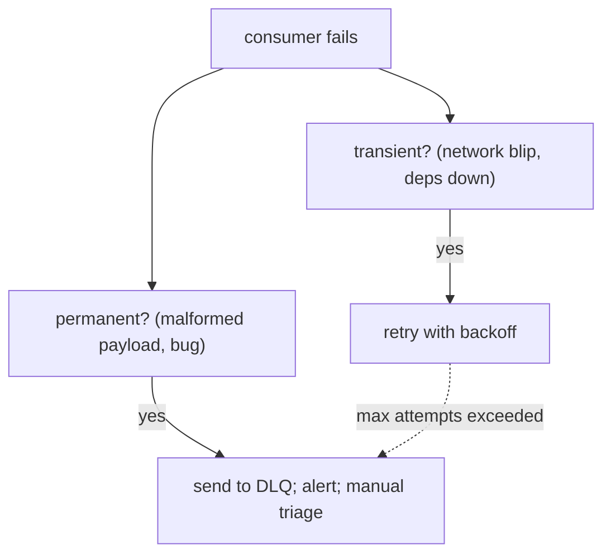
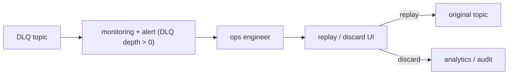

# Dead-letter queues & retries

Messages fail. A consumer can't process a message because: a downstream service is down (transient); the message is malformed (permanent); a bug in code; a missing dependency. Without a strategy, the consumer either crashes-and-loops on the same message (blocking the queue) or silently drops it (data loss). The **dead-letter queue (DLQ)** pattern handles this: failed messages move to a parking-lot queue after configured retries; operations team reviews and replays or discards. Combined with **retry topics** (Kafka) or **DLX** (RabbitMQ), modern messaging stacks make this nearly turnkey.

A senior engineer treats DLQ as **mandatory infrastructure**: every consumer that handles important messages must have a DLQ wired up, monitoring on DLQ depth, alerts when something lands there, and a runbook for triage and replay. Without DLQ, production messaging is one bad message away from disaster.

This topic covers: failure types (transient vs permanent); retry strategies (immediate, fixed-delay, exponential backoff); RabbitMQ DLX pattern; Kafka retry topics (the modern Spring Kafka pattern); Spring AMQP / Spring Kafka error handler integration; the parking-lot variation; ops practices (alert + replay UI).

> [!NOTE]
> Prerequisites: [RabbitMQ (T03)](./T03-rabbitmq-amqp.md), [Kafka (T04–T05)](./T04-apache-kafka-fundamentals.md), [Outbox (T09)](./T09-outbox-pattern-and-exactly-once.md).

## Failure Types



- **Transient**: caller down; DB blip; rate limit hit. Retry will succeed.
- **Permanent**: payload invalid; bug in code; missing schema. Retry will keep failing.

Wrong classification:

- Retry permanent → wastes attempts; eventually still DLQ.
- DLQ transient → false alarm; legitimate work parked.

Both are acceptable; bias toward retry for ambiguous failures.

## Retry Strategies

| Strategy | Use |
|----------|-----|
| **Immediate retry** | very transient (CPU blip) |
| **Fixed delay (1s, 1s, 1s)** | rate-limit-aware |
| **Exponential backoff (1s, 2s, 4s, 8s)** | most realistic |
| **Exponential + jitter** | avoid thundering herd |
| **Capped exponential** | bound max delay |

The default modern choice: **exponential backoff with jitter, capped at ~30s, max 5-10 attempts → DLQ**.

## RabbitMQ DLX

Configure a queue's dead-letter exchange:

```java
@Bean Queue ordersQueue() {
    return QueueBuilder.durable("orders")
        .withArgument("x-dead-letter-exchange", "orders.dlx")
        .withArgument("x-delivery-limit", 5)            // quorum queue feature
        .build();
}

@Bean DirectExchange dlx() { return new DirectExchange("orders.dlx"); }
@Bean Queue dlq() { return QueueBuilder.durable("orders.dlq").build(); }
@Bean Binding dlqBinding(DirectExchange dlx, Queue dlq) {
    return BindingBuilder.bind(dlq).to(dlx).with("");
}
```

After 5 failed deliveries (`x-delivery-limit` on quorum queues), the message goes to DLX → DLQ.

For classic queues: nack with `requeue=false` sends to DLX:

```java
channel.basicNack(tag, false, false);   // → DLX
```

## Spring AMQP Retry + DLQ

```java
@Configuration
public class RetryConfig {

    @Bean
    public RetryOperationsInterceptor retryInterceptor() {
        return RetryInterceptorBuilder.stateless()
            .maxAttempts(5)
            .backOffOptions(1_000, 2.0, 10_000)   // initial, multiplier, max
            .recoverer(new RejectAndDontRequeueRecoverer())   // → DLX after retries exhausted
            .build();
    }

    @Bean
    public SimpleRabbitListenerContainerFactory rabbitListenerContainerFactory(
            ConnectionFactory cf, RetryOperationsInterceptor retry) {
        SimpleRabbitListenerContainerFactory f = new SimpleRabbitListenerContainerFactory();
        f.setConnectionFactory(cf);
        f.setAdviceChain(retry);
        f.setDefaultRequeueRejected(false);
        return f;
    }
}
```

In-process retry; on exhaustion, message goes to DLX.

## Kafka Retry Topics

Naive Kafka retry: catch exception in listener; let it propagate; consumer reads same message on next poll (offset not committed). Issue: the partition is **blocked** until the bad message resolves.

The modern Spring Kafka pattern: **`@RetryableTopic`**.

```java
@RetryableTopic(
    attempts = "5",
    backoff = @Backoff(delay = 1_000, multiplier = 2.0),
    dltStrategy = DltStrategy.FAIL_ON_ERROR,
    autoCreateTopics = "true")
@KafkaListener(topics = "orders.placed")
public void handle(OrderPlaced event) {
    orderService.process(event);
}

@DltHandler
public void handleDlt(OrderPlaced event, @Header(KafkaHeaders.EXCEPTION_MESSAGE) String reason) {
    log.error("DLT: {} due to {}", event, reason);
    alertService.notify(event);
}
```

Spring creates topics:

- `orders.placed-retry-0` (1s delay)
- `orders.placed-retry-1` (2s delay)
- `orders.placed-retry-2` (4s delay)
- ...
- `orders.placed-dlt` (final dead-letter topic)

```mermaid
flowchart LR
  T["orders.placed"]
  R0["orders.placed-retry-0 (1s)"]
  R1["orders.placed-retry-1 (2s)"]
  R2["orders.placed-retry-2 (4s)"]
  DLT["orders.placed-dlt"]
  T -->|"first attempt"| H["handler"]
  H -->|"fail"| R0 --> H1["retry handler"]
  H1 -->|"fail"| R1 --> H2["retry handler"]
  H2 -->|"fail"| R2 --> H3["retry handler"]
  H3 -->|"fail"| DLT
```



Original partition never blocked; retries happen on separate topics with delays.

## DefaultErrorHandler (Older Pattern)

Spring Kafka pre-`@RetryableTopic`:

```java
@Bean
public DefaultErrorHandler errorHandler(KafkaTemplate<?, ?> template) {
    var recoverer = new DeadLetterPublishingRecoverer(template,
        (record, ex) -> new TopicPartition(record.topic() + ".DLT", record.partition()));
    var handler = new DefaultErrorHandler(recoverer, new ExponentialBackOff(1000, 2.0));
    handler.addNotRetryableExceptions(MalformedEventException.class);
    return handler;
}
```

Retries inline on the same partition. Simpler but **blocks the partition** during retries. Use `@RetryableTopic` for production.

## Non-Retryable Exceptions

Some failures should skip retry and go directly to DLQ:

```java
@RetryableTopic(
    attempts = "5",
    backoff = @Backoff(delay = 1000, multiplier = 2.0),
    exclude = {MalformedEventException.class, InvalidSchemaException.class})
```

Permanent failures → straight to DLT; transient → retry.

## Parking Lot

A DLQ should not be silently accumulating. **Parking-lot pattern**:



Build a small admin UI:

- View DLQ contents.
- Inspect headers / error details.
- Replay (re-publish to original topic).
- Discard (mark as resolved; audit).

For Kafka, the DLT topic is regular Kafka; a Spring controller backed by `KafkaConsumer` does this.

## Operational Discipline

- **Monitor DLQ depth** as a critical metric. Alert at threshold > 0 (or 10).
- **Capture failure context**: original headers, exception trace, processing timestamp.
- **Periodic review**: weekly DLQ triage; categorize failures; fix root cause.
- **Runbook**: who handles; how to replay; how to discard.

Without these, DLQ becomes "where messages disappear quietly".

## Idempotent Receivers — Required For Retry

Every retry requires **idempotency** (T09):

```java
@KafkaListener(topics = "orders.placed")
public void handle(OrderPlaced event) {
    if (processed.exists(event.eventId())) return;
    processed.save(...);
    business();
}
```

Without dedup, retry doubles the effect (double charge, double email).

## DLQ For RabbitMQ Vs Kafka — Comparison

| Aspect | RabbitMQ DLX | Kafka Retry Topics |
|--------|:------------:|:------------------:|
| Setup | exchange + queue + bindings | `@RetryableTopic` annotation |
| Retry delay | TTL + DLX trick (or quorum delivery-limit) | per-topic delay |
| Blocks partition? | no (per-message) | no (separate retry topics) |
| Replay | re-publish from DLQ | re-publish from DLT |
| Visibility | per-queue depth | topic offset / lag |

Both are mature. Pick by broker.

## Common Pitfalls

> [!WARNING]
> **No DLQ configured.** Failures loop forever or vanish.

> [!WARNING]
> **DLQ not monitored.** Messages accumulate silently; data loss invisible.

> [!WARNING]
> **`DefaultErrorHandler` in Kafka without retry topics.** Partition blocked during retry; head-of-line latency.

> [!WARNING]
> **All exceptions retried equally.** Permanent failures waste cycles.

> [!WARNING]
> **No idempotency.** Retry doubles effects.

> [!WARNING]
> **No replay UI / runbook.** DLQ stays unprocessed; humans give up.

> [!WARNING]
> **Auto-replay everything.** Buggy messages loop in retry → DLQ → retry → DLQ.

> [!WARNING]
> **Forgetting to include failure metadata.** Triage impossible.

## Practice

1. Wire RabbitMQ DLX + DLQ; nack a message; verify it lands.
2. Implement `@RetryableTopic` in Spring Kafka; verify retry topics created.
3. Add non-retryable exception; verify direct to DLT.
4. Build a simple DLQ inspection / replay endpoint.
5. Wire Prometheus metrics on DLQ depth; alert at > 0.
6. Simulate transient failure (dependency down); observe retry + eventual success.
7. Simulate permanent failure (malformed payload); observe DLT after retries.
8. Audit your services: which consumers lack DLQ? Add them.

## Recap

You should now be able to:

- Distinguish transient (retry) from permanent (DLQ) failures.
- Apply exponential backoff with jitter; cap attempts; max delay.
- Configure RabbitMQ DLX + DLQ; nack with requeue=false; use quorum queue `x-delivery-limit`.
- Use Spring Kafka `@RetryableTopic` for partition-friendly retries with delay topics.
- Use `DefaultErrorHandler` + `DeadLetterPublishingRecoverer` for inline retries.
- Skip retries for non-retryable exceptions via `exclude` or `addNotRetryableExceptions`.
- Build parking-lot ops: monitor DLQ depth, alerts, replay UI, runbook.
- Combine retry with idempotent receiver to avoid duplicate effects.
- Avoid the canonical pitfalls: no DLQ, unmonitored DLQ, blocking-partition retry, equal-retry-for-all-errors, no replay path.

## Next

Continue to [Stream processing (Flink, intro)](./T11-stream-processing-flink-intro.md) for the final C07 topic — Apache Flink as the heavier-duty stream-processing engine and when to reach for it vs Kafka Streams.
