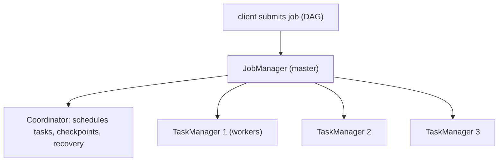

# Stream processing (Flink, intro)

Apache Flink is the **heavy-duty stream-processing engine** for the JVM ecosystem. Where Kafka Streams (T06) embeds in a single Java app, Flink runs as a **separate cluster** (JobManager + TaskManagers) consuming from many sources (Kafka, Kinesis, files, sockets, DBs), processing with complex windowing / CEP / SQL, writing to many sinks. Used by Uber, Netflix, Alibaba, ING, and many others for **real-time analytics, fraud detection, alerting, monitoring**. Adopted heavily at petabyte scale.

A senior engineer doesn't reach for Flink lightly: it's a separate cluster to operate, with its own programming model and idioms. **Most Spring teams should use Kafka Streams** unless the workload genuinely demands Flink's superpowers — multi-source ingestion, complex event-time windowing, SQL queries over streams, or extreme scale.

This is an intro topic — Flink deserves its own book. Here we cover: the architecture (JobManager + TaskManagers); the programming model (DataStream API + Table API + SQL); event time vs processing time + watermarks; windowing; exactly-once via checkpoints + savepoints; the Flink-vs-Kafka-Streams decision; brief Spring integration notes; Kubernetes Flink Operator.

> [!NOTE]
> Prerequisites: [Kafka Streams (T06)](./T06-kafka-streams.md), distributed systems fundamentals.

## Architecture



- **JobManager**: coordinator. Schedules tasks across TaskManagers. Manages checkpoints.
- **TaskManager**: worker. Runs operator tasks. Holds state.
- **Slot**: unit of parallelism within a TaskManager.
- **Job**: a Flink program. A DAG of operators.

Deployed on Kubernetes (via the Flink Operator), YARN, standalone, or Flink Cloud.

## The Programming Model

Three levels of API:

### DataStream API (Java/Scala)

```java
StreamExecutionEnvironment env = StreamExecutionEnvironment.getExecutionEnvironment();

DataStream<Order> orders = env.fromSource(
    KafkaSource.<Order>builder()
        .setBootstrapServers("kafka:9092")
        .setTopics("orders")
        .setValueOnlyDeserializer(new JsonDeserializer<>(Order.class))
        .build(),
    WatermarkStrategy.<Order>forBoundedOutOfOrderness(Duration.ofSeconds(5))
        .withTimestampAssigner((o, ts) -> o.eventTime().toEpochMilli()),
    "orders-source");

DataStream<Alert> alerts = orders
    .filter(o -> o.total() > 1000)
    .keyBy(Order::customerId)
    .window(TumblingEventTimeWindows.of(Duration.ofMinutes(5)))
    .process(new FraudDetector());

alerts.sinkTo(KafkaSink.builder()
    .setBootstrapServers("kafka:9092")
    .setRecordSerializer(...)
    .build());

env.execute("Fraud Detection");
```

Java-level operators; explicit; flexible.

### Table API

Relational API; declarative:

```java
TableEnvironment tEnv = TableEnvironment.create(settings);

tEnv.executeSql("""
    CREATE TABLE orders (
        order_id BIGINT, customer_id BIGINT, total DOUBLE, event_time TIMESTAMP(3),
        WATERMARK FOR event_time AS event_time - INTERVAL '5' SECOND
    ) WITH (
        'connector' = 'kafka', 'topic' = 'orders', ...
    )""");

tEnv.executeSql("""
    SELECT customer_id, COUNT(*) AS order_count, SUM(total) AS total_revenue
    FROM orders
    GROUP BY TUMBLE(event_time, INTERVAL '5' MINUTES), customer_id
    """).print();
```

Works against tables; SQL-friendly.

### Flink SQL

Pure SQL on streams; submit via SQL Client or REST. Powerful for analytics teams.

## Event Time vs Processing Time

**Event time**: time the event occurred (e.g., a sensor reading at 10:00:00).
**Processing time**: time the event arrived at Flink (e.g., 10:00:03).

For correctness, **event time** is usually right — late events still go into the window they belong to.

**Watermarks** tell Flink "no more events with timestamp ≤ T will arrive". This triggers window completion.

```java
WatermarkStrategy.<Order>forBoundedOutOfOrderness(Duration.ofSeconds(5))
```

"Assume max 5s out-of-order; emit watermarks 5s behind max-seen-timestamp."

Late events (after watermark) can go to **side outputs** for separate handling.

## Windowing

Same options as Kafka Streams + more:

- **Tumbling** event-time windows.
- **Hopping (Sliding)** windows.
- **Session** windows.
- **Global** windows (custom trigger).
- **Count** windows (based on element count).

```java
stream
    .keyBy(...)
    .window(SlidingEventTimeWindows.of(Duration.ofMinutes(10), Duration.ofMinutes(1)))
    .reduce((a, b) -> ...);
```

## Exactly-Once Via Checkpoints

Flink takes periodic **checkpoints**: snapshot of all operator state + source offsets (Kafka, etc.). Async; consistent across operators via Chandy-Lamport.

On failure: restore from latest checkpoint; reread from saved offsets. End-to-end exactly-once with **two-phase commit sinks** (Kafka).

**Savepoints**: manually-triggered checkpoints. Used for upgrades, code changes, rescaling — restore from savepoint into new job version.

## CEP — Complex Event Processing

Flink's CEP library detects patterns over event streams:

```java
Pattern<Login, Login> attackPattern = Pattern.<Login>begin("first")
    .where(SimpleCondition.of(l -> l.failed()))
    .times(3).within(Duration.ofSeconds(30));

CEP.pattern(loginStream.keyBy(Login::userId), attackPattern)
   .process(new SecurityAlertHandler());
```

"3 failed logins by same user within 30s = potential attack." Beyond simple aggregations; multi-step temporal patterns.

## Stateful Functions

Flink Stateful Functions: deploy actor-like stateful entities as Flink jobs. Less common; specialized.

## Kubernetes Flink Operator

```yaml
apiVersion: flink.apache.org/v1beta1
kind: FlinkDeployment
metadata:
  name: orders-streams
spec:
  image: flink:1.18
  jobManager:
    replicas: 1
    resource: { memory: 2g, cpu: 1 }
  taskManager:
    replicas: 3
    resource: { memory: 4g, cpu: 2 }
  job:
    jarURI: s3://my-bucket/jobs/orders-streams.jar
    state: running
```

The Flink Operator manages JobManager / TaskManagers, scales, redeploys with savepoint restore. Production-grade pattern.

## Flink vs Kafka Streams

| Aspect | Flink | Kafka Streams |
|--------|:-----:|:-------------:|
| Deployment | separate cluster | embedded library |
| Input sources | Kafka + many | Kafka only |
| State | RocksDB / heap | RocksDB + Kafka changelog |
| Windowing | richest | good |
| CEP | first-class | limited |
| Exactly-once | yes (checkpoint + 2PC) | yes (Kafka transactions) |
| SQL | first-class | KSQL (separate) |
| Scale | extreme | substantial |
| Operational complexity | medium-high | low |
| Ecosystem maturity | wide | growing |

Pick Flink when:

- Multi-source ingestion.
- Complex windowing or CEP.
- SQL queries over streams as a feature.
- Extreme scale or throughput.
- Need savepoints for stateful upgrades.

Pick Kafka Streams when:

- Input is Kafka.
- Embedded library fits the org.
- Moderate scale.
- Spring team owns the service.

## Spring Integration

Less direct than Kafka Streams. Some projects use:

- **Spring Boot + embedded Flink mini-cluster** for tests.
- **Submitting Flink jobs from a Spring service** via REST API (Flink's `JobManager` exposes REST).

Most teams treat Flink as a separate platform; not "in" Spring.

## Common Pitfalls

> [!WARNING]
> **Adopting Flink for simple workloads.** Operational overhead unjustified.

> [!WARNING]
> **No checkpoints / savepoints.** No recovery from failure; no in-place upgrades.

> [!WARNING]
> **Mixing event time and processing time without clarity.** Late events lost or double-counted.

> [!WARNING]
> **Watermarks tuned wrong.** Too-loose tolerance = late results; too-tight = lose events.

> [!WARNING]
> **State growth unbounded.** Apply TTL / retention.

> [!WARNING]
> **Single-master JobManager without HA.** SPOF. Use HA mode.

> [!WARNING]
> **Code changes break savepoint compatibility.** Avoid backward-incompatible operator changes.

## Practice

1. Run Flink locally (Docker). Submit a simple WordCount job.
2. Convert a Kafka Streams topology to Flink DataStream API. Compare.
3. Try Flink SQL on the same problem; observe ergonomics.
4. Add event-time windowing with watermarks; observe late event handling.
5. Implement a CEP pattern (e.g., login attack detection).
6. Take a savepoint; upgrade job; restore from savepoint.
7. Deploy via Flink Kubernetes Operator.
8. Decide: which of your services would justify Flink over Kafka Streams?

## Recap

You should now be able to:

- Explain Flink architecture: JobManager + TaskManagers + slots.
- Use DataStream API for explicit operators; Table API / SQL for declarative.
- Distinguish event time from processing time; configure watermarks.
- Apply windowing: tumbling, sliding, session, global, count.
- Achieve exactly-once via checkpoints + savepoints + 2PC sinks.
- Use CEP for multi-step pattern detection.
- Choose Flink for multi-source / complex windowing / CEP / SQL / extreme scale.
- Stay with Kafka Streams for Kafka-only / moderate scale / embedded library.
- Deploy Flink on Kubernetes via the Flink Operator.
- Avoid the canonical pitfalls: over-adoption, no checkpoints, watermark mis-tuning, unbounded state.

## Next

C07 is complete (11 of 11 topics). Continue to [C08 Security](../C08-security/) for the deep security section — authentication, authorization, OAuth2/OIDC/JWT in depth, password hashing, OWASP Top 10, encryption, TLS, secrets, supply chain, and zero trust.
