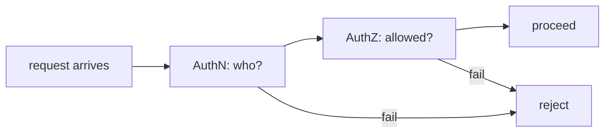
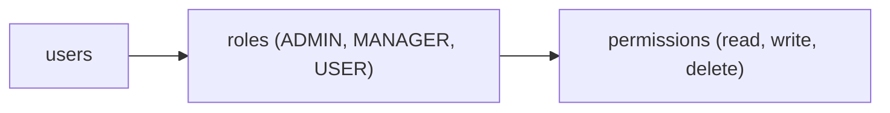
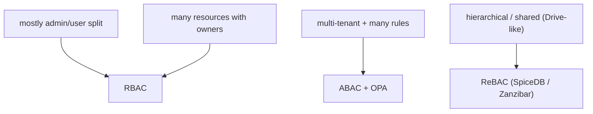

# Authentication vs authorization

Every secured backend answers two questions per request: **who are you?** (authentication, AuthN) and **what are you allowed to do?** (authorization, AuthZ). These are routinely conflated — "auth" is ambiguous; OAuth is technically authorization but commonly used for authentication; "the user is authenticated as admin" mixes both. A senior engineer keeps them strictly separate because they're solved differently, evolve differently, and fail differently.

C08 is L4's security section: 16 topics from foundations (this) through password storage, OAuth2/OIDC/JWT in depth, OWASP Top 10, encryption, TLS, secrets, security headers, API best practices, supply-chain security, and zero trust. This opening topic establishes the vocabulary cleanly.

We cover: the distinction; identity, principals, claims, credentials; authentication factors (something you know / have / are); MFA; the standard authorization models (ACL, RBAC, ABAC, PBAC); how Spring Security maps to each; the SSO pattern; the OAuth confusion; the audit / accountability third pillar.

> [!NOTE]
> Prerequisites: HTTP fundamentals; basic Spring Security context (L4/C01/T14).

## The Distinction



**AuthN** establishes identity: I am Alice. Evidence-based — username + password, certificate, biometric.

**AuthZ** evaluates permission: Alice may DELETE this resource. Policy-based — roles, attributes, ownership.

You can be authenticated and not authorized (logged in but not allowed to do something). You're never authorized without being authenticated (anonymous access is a *form* of authentication with the "anonymous" principal).

## Vocabulary

- **Identity**: who someone is (Alice).
- **Principal**: representation of identity in the system (`Authentication.principal`).
- **Claims**: statements about the principal (role: admin; email: alice@x.io; tenant: 42).
- **Credentials**: evidence (password; private key; biometric).
- **Subject**: the entity being authenticated (user, service, device).

In Spring Security:

```java
SecurityContextHolder.getContext().getAuthentication();
// returns Authentication { principal, credentials, authorities }
```

`authorities` are the claims (roles / scopes). `principal` is the user (often a `UserDetails`). `credentials` is usually wiped after auth.

## Authentication Factors

- **Knowledge**: something you know (password, PIN).
- **Possession**: something you have (phone with TOTP, hardware key).
- **Inherence**: something you are (fingerprint, face).
- **Location / behavior**: where / how (less common).

**MFA (Multi-Factor Authentication)** combines ≥ 2 factors. **2FA** specifically two. SMS-based 2FA is weaker than TOTP / push notifications / hardware keys (SIM swap attacks); for high-stakes auth, use passkeys / WebAuthn / hardware-backed keys.

## Authorization Models

### Access Control List (ACL)

Per-resource list of who can access:

```
file: /docs/secret.pdf
  alice: read, write
  bob: read
```

Granular; hard to maintain at scale.

### Role-Based Access Control (RBAC)



Users assigned roles; roles bundle permissions. Standard for most apps.

```java
@PreAuthorize("hasRole('ADMIN')")
public void deleteUser(long id) { ... }
```

### Attribute-Based Access Control (ABAC)

Permission depends on attributes of subject, resource, environment:

```
allow if subject.department == resource.department
       AND time within business hours
       AND resource.classification ≤ subject.clearance
```

Fine-grained; complex to author and audit. Used in regulated / finance.

### Policy-Based Access Control (PBAC) / OPA

Externalized policy engine evaluates decisions:

```
package authz
allow {
    input.user.role == "admin"
    input.action == "read"
}
```

[Open Policy Agent (OPA)](https://www.openpolicyagent.org/) is the canonical. Policies in Rego language; same policy across services.

### Relationship-Based Access Control (ReBAC)

Permission based on relationships (Google Zanzibar pattern):

```
alice OWNER document-42
document-42 PARENT folder-7
folder-7 VIEWER bob   →  bob can VIEW document-42
```

Used for graph-shaped permissions (Google Drive, GitHub). Tools: SpiceDB, AuthZed.

## Choosing The Model



Default: **RBAC**. Add ABAC / ReBAC where genuinely needed.

## Spring Security Integration

T14 / T16 of C01 covered. Briefly:

- AuthN: `AuthenticationManager` + `AuthenticationProvider` + `UserDetailsService`.
- AuthZ: `AuthorizationManager` + `@PreAuthorize` + URL-based rules.

```java
@PreAuthorize("hasRole('ADMIN')")                               // RBAC
@PreAuthorize("hasPermission(#docId, 'Document', 'READ')")      // PermissionEvaluator (ABAC-ish)
@PreAuthorize("#order.customerId == authentication.name")       // attribute-based
```

For PBAC / OPA integration: Spring Security can call OPA via REST per request; cache decisions.

## Single Sign-On (SSO)

User authenticates once with an IdP; all SP (service provider) apps trust the IdP's token. Standards:

- **SAML 2.0**: enterprise; XML; legacy but ubiquitous.
- **OIDC** (OpenID Connect): modern; JWT/JSON; built on OAuth2.
- **OAuth2** alone is *not* SSO — it's authorization; OIDC adds identity.

Modern apps: OIDC. SAML for enterprise integration.

## The OAuth Confusion

OAuth2 (RFC 6749) is **authorization**: "let this client act on my behalf with these scopes." But many systems use the access token as proof of identity ("user is Alice because they hold a valid token signed by IdP"). **OIDC** (built on OAuth2) explicitly adds **ID tokens** for authentication.

Practically: use OIDC for SSO; OAuth2 for delegated access. Most identity providers (Auth0, Okta, Keycloak, Google) implement both.

## Accountability — The Third Pillar

Beyond AuthN + AuthZ: **what did the principal actually do?** Audit logs.

For regulated systems (PCI, HIPAA, SOX), audit is mandatory. Wire structured audit logging:

```java
@Component
public class AuditAspect {
    @AfterReturning(value = "@annotation(Audit)", returning = "result")
    public void audit(JoinPoint jp, Object result) {
        auditLog.write(...);
    }
}
```

T16 of C02 covered Envers for entity audit; broader system audit goes to a separate audit log (sometimes Kafka topic).

## Defense in Depth

Multiple layers:

- **Edge (CDN, WAF)**: DDoS, rate limit.
- **API gateway**: AuthN at the boundary.
- **Service**: AuthZ checks per endpoint.
- **Domain**: business-rule checks (only owner can edit).
- **Data**: row-level security in DB.

A bug in one layer doesn't compromise; later layers catch.

## Just-In-Time Access (JIT)

Standing access (always-on roles) is dangerous. JIT grants temporary elevated access on request, expires automatically. Tools: Teleport, AWS IAM with break-glass, custom workflows. Reduces blast radius of stolen credentials.

## Common Pitfalls

> [!WARNING]
> **Conflating AuthN and AuthZ in code or vocabulary.** Bugs follow.

> [!WARNING]
> **Hardcoded roles per controller without abstraction.** Scaling breaks.

> [!WARNING]
> **SMS as MFA.** SIM swap. Use TOTP or WebAuthn.

> [!WARNING]
> **OAuth2 access token = identity.** Use OIDC ID token for AuthN.

> [!WARNING]
> **No audit log on sensitive ops.** Compliance failure.

> [!WARNING]
> **AuthN at edge only.** Internal services trust headers blindly; lateral movement risk.

> [!WARNING]
> **Roles cached aggressively.** Revocation slow.

> [!WARNING]
> **Permission checks only at controller.** Direct service calls bypass.

## Practice

1. List your service's permission rules. Categorize as RBAC, ABAC, or ReBAC.
2. Identify any blurring of AuthN and AuthZ in the codebase.
3. Add MFA via TOTP. Compare with WebAuthn.
4. Sketch an OPA policy for a real rule. Compare to in-code SpEL.
5. Audit log: which sensitive operations should log? Add aspects.
6. Decide IdP integration: SAML, OIDC, or both.
7. JIT access for admin role: prototype.
8. Defense-in-depth review: where do checks exist? Where missing?

## Recap

You should now be able to:

- Distinguish AuthN (identity) from AuthZ (permission).
- Use vocabulary precisely: identity, principal, claims, credentials, subject.
- Apply authentication factors and pick MFA mechanism deliberately (TOTP / WebAuthn over SMS).
- Choose authorization model: RBAC default; ABAC for complex; ReBAC for hierarchical shared.
- Use OIDC for SSO; OAuth2 for delegated authorization; keep them distinct.
- Add audit log for accountability.
- Apply defense in depth across edge / gateway / service / domain / data.
- Adopt JIT access for elevated privileges.
- Avoid the canonical pitfalls: AuthN ↔ AuthZ confusion, SMS MFA, no audit, edge-only checks.

## Next

Continue to [Sessions vs tokens](./T02-sessions-vs-tokens.md) for the decision between server-side sessions and stateless tokens — the trade-offs, the OAuth2 BFF pattern, and when each is right.
