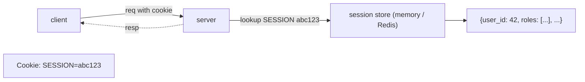
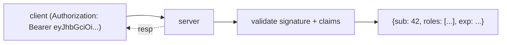
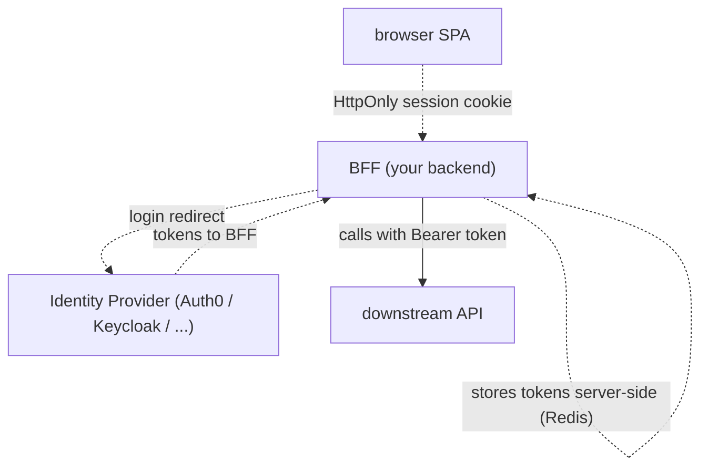

# Sessions vs tokens

After authentication succeeds, the system needs to **remember** the user across subsequent requests. Two fundamentally different approaches: **server-side sessions** (the server keeps state; client holds an opaque session id, typically in a cookie) and **stateless tokens** (the server keeps no per-user state; client presents a signed token like JWT containing the claims). The choice has architectural, security, and operational consequences — revocation, scalability, mobile-friendliness, cross-domain, XSS exposure all differ. The modern answer for browser apps with backend services: **OAuth2 BFF pattern** (token from IdP held server-side; HttpOnly cookie to browser) — combining the security of cookies with the standards of OAuth2.

T23 of C01 introduced Spring Session for externalized sessions; T14–T16 of C01 covered Spring Security including OAuth2/OIDC/JWT. **This topic** is the architectural decision: when to use each, and what hybrid patterns dominate 2026.

We cover: server-side sessions (in-memory, Redis-backed); stateless tokens (JWT, opaque); revocation differences; cookies (HttpOnly, Secure, SameSite); refresh token rotation; the BFF pattern; mobile vs browser; microservices and the propagation problem.

> [!NOTE]
> Prerequisites: [AuthN vs AuthZ (T01)](./T01-authentication-vs-authorization.md), [Spring Security (L4/C01/T14)](../C01-spring-framework/T14-spring-security-authentication-and-authorization.md), [Spring Session (L4/C01/T23)](../C01-spring-framework/T23-spring-session.md), [OAuth2/OIDC (L4/C01/T15)](../C01-spring-framework/T15-oauth2-openid-connect-jwt-with-spring-security.md).

## Server-Side Sessions



Session id is opaque; server-side store holds the actual data. Lookup per request.

**Pros**: trivial revocation (delete the session); minimal client-side state; HttpOnly cookies defeat XSS-based theft.

**Cons**: requires shared session store (Redis or DB) for multi-instance; per-request store lookup (~1 ms).

## Stateless Tokens (JWT)



Token carries claims; server verifies signature; no store lookup.

**Pros**: stateless; no per-request store lookup; works across domains; mobile-friendly.

**Cons**: **revocation is hard** (token valid until `exp`); leaked token = compromise until expiry; client-side storage (localStorage = XSS-readable).

## Revocation Comparison

| Need | Session | Token |
|------|:-------:|:-----:|
| Immediate logout | trivial (delete row) | hard (need allowlist/denylist) |
| Role change reflected | next request | next refresh (or denylist) |
| Compromised credentials | trivial | need full denylist |

For short access tokens (5-15 min) + refresh tokens, revocation gap is bounded. For long-lived tokens, dangerous.

## Cookie Attributes

For session cookies (and properly-implemented token cookies):

```http
Set-Cookie: SESSION=abc; HttpOnly; Secure; SameSite=Lax; Path=/; Max-Age=1800
```

- **HttpOnly**: JS can't read; defeats XSS-based theft.
- **Secure**: only over HTTPS.
- **SameSite=Lax**: cross-site navigation OK; cross-site form POST blocked (CSRF defense).
- **SameSite=Strict**: most restrictive; breaks SSO redirects.
- **SameSite=None + Secure**: needed for cross-domain; less secure.

**Always**: HttpOnly + Secure + SameSite. Never `SameSite=None` without `Secure`.

## OAuth2 BFF Pattern

The 2026 winning architecture for browser apps:



Tokens (access + refresh) **never reach the browser**. BFF holds them server-side in a session (Redis). Browser holds only HttpOnly session cookie. XSS can't steal tokens; CSRF requires SameSite-compliant request; tokens are short-lived; revocation is server-side.

Spring Security supports this directly:

```java
@Bean
public SecurityFilterChain bff(HttpSecurity http) throws Exception {
    return http
        .authorizeHttpRequests(auth -> auth.anyRequest().authenticated())
        .oauth2Login(Customizer.withDefaults())
        .build();
}
```

BFF handles OAuth2 dance; stores tokens; proxies to downstream APIs.

## Refresh Token Rotation

A long-lived refresh token is dangerous if stolen. Modern IdPs (Auth0, Keycloak, Okta) implement **refresh token rotation**:

1. Client uses RT-1 to get a new access token.
2. IdP issues RT-2; invalidates RT-1.
3. If RT-1 is presented again, IdP detects compromise; revokes the whole token family.

Spring's OAuth2 client doesn't rotate by default; configure the IdP and refresh strategy explicitly.

## Sliding vs Absolute Timeout

- **Sliding**: session extends on each activity; idle for X = expired.
- **Absolute**: hard expiry from creation; X hours then done regardless.

Modern: **both**. Sliding for UX (don't kick active users); absolute for security (force re-auth every 12-24h).

```yaml
server:
  servlet:
    session:
      timeout: 30m
```

This is sliding. For absolute, app-level enforcement or short-lived tokens with refresh.

## Mobile vs Browser

| Aspect | Browser | Mobile |
|--------|:-------:|:------:|
| Cookie support | excellent | poor |
| HttpOnly | mandatory | N/A |
| Storage | localStorage (avoid) or cookie | Keychain / Keystore |
| Token in header | possible | natural |
| Best | cookie session or BFF | bearer token with refresh |

Mobile apps almost always use bearer tokens with secure local storage. Browser apps use cookies or BFF.

## Microservices

When service A authenticates a user via session, can service B trust A's session? No — B can't read A's cookie.

Patterns:

- **API gateway translates**: gateway validates session; injects user info as header `X-User-Id`. Internal services trust gateway. Requires *no direct access* to internal services from outside.
- **JWT propagation**: gateway issues internal JWT with user claims; services validate.
- **mTLS + claims**: zero-trust style; each service validates token.

The session-vs-token boundary effectively re-emerges per service hop.

## Hybrid Patterns

Real apps often mix:

- **Edge session** + **internal JWT**: BFF holds session; calls services with short-lived service JWT.
- **Web session** + **API token**: same backend; different mechanisms per surface.
- **OIDC ID token** for AuthN + **opaque session ref** for revocation.

Pick deliberately; document.

## Common Pitfalls

> [!WARNING]
> **JWT in localStorage.** XSS reads it. Use HttpOnly cookie or BFF.

> [!WARNING]
> **Long-lived access tokens.** Revocation impossible; keep < 15 min.

> [!WARNING]
> **No refresh token rotation.** Stolen refresh = lifetime access.

> [!WARNING]
> **Session in memory on multi-instance.** Affinity needed or session lost on instance fail. Use Redis.

> [!WARNING]
> **No SameSite.** CSRF risk.

> [!WARNING]
> **Mobile + cookie session.** Poor fit; use bearer token + Keychain.

> [!WARNING]
> **Token propagation without TLS / mTLS internally.** Lateral movement risk.

> [!WARNING]
> **No absolute timeout.** Single token / session valid forever.

## Practice

1. Profile a session-based app under load; measure Redis lookups.
2. Implement OAuth2 BFF in Spring. Verify tokens never reach browser dev tools.
3. Test SameSite=Lax behavior: cross-site navigation, form POST, fetch.
4. Implement absolute + sliding timeout combination.
5. Try mobile bearer token vs browser cookie; compare ergonomics.
6. Audit microservice trust: which services blindly trust headers?
7. Implement refresh token rotation; test compromise detection.
8. Decision for your service: session, token, or BFF? Justify.

## Recap

You should now be able to:

- Distinguish server-side sessions (state on server) from stateless tokens (state in token).
- Use cookies with HttpOnly + Secure + SameSite for browser auth.
- Apply OAuth2 BFF for browser apps: HttpOnly session cookie; tokens server-side.
- Use bearer tokens with Keychain/Keystore for mobile.
- Plan revocation: trivial for sessions; via short expiry + refresh rotation for tokens.
- Apply sliding + absolute timeout for UX + security.
- Handle microservice trust via gateway translation or JWT propagation.
- Avoid the canonical pitfalls: localStorage tokens, long expiry, no rotation, no SameSite, header trust without mTLS.

## Next

Continue to [OAuth2 & OpenID Connect](./T03-oauth2-and-openid-connect.md) for the deeper treatment of the flows, scopes, claims, and the security model — building on L4/C01/T15.
