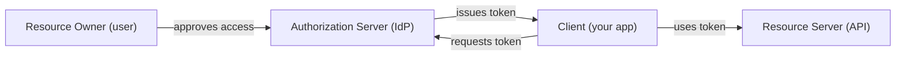

# OAuth2 & OpenID Connect

L4/C01/T15 introduced OAuth2/OIDC/JWT with Spring Security. **This topic** goes deeper into the protocols themselves — independent of Spring. Why? Because OAuth2 is a *protocol*, not a library, and understanding the protocol distinguishes engineers who debug it from engineers who only follow examples. We cover: the four standard flows (Authorization Code w/ PKCE, Client Credentials, Refresh, Device Code); when to use each; OIDC's ID token vs OAuth2's access token; the discovery document; modern hardening (PAR, JAR, DPoP, mTLS-bound tokens); the OAuth 2.1 draft consolidation; security gotchas.

A senior engineer needs this depth to: integrate non-standard IdPs correctly; debug failed token validations; configure security headers on tokens; choose between bearer tokens and DPoP for sensitive APIs; explain to security review *why* the architecture is safe.

> [!NOTE]
> Prerequisites: [Sessions vs tokens (T02)](./T02-sessions-vs-tokens.md), [Spring Security OAuth2 (L4/C01/T15)](../C01-spring-framework/T15-oauth2-openid-connect-jwt-with-spring-security.md).

## The Roles



- **Resource Owner**: the user.
- **Client**: requests resources on the user's behalf.
- **Authorization Server (AS)**: issues tokens (Keycloak, Okta, Auth0).
- **Resource Server (RS)**: hosts the protected resources (your API).

Sometimes AS and RS are the same; often separate.

## The Four Flows

### Authorization Code + PKCE (most common)

For users via browser:

```mermaid
sequenceDiagram
  participant U as User (browser)
  participant C as Client (web/mobile app)
  participant AS as Auth Server
  participant RS as Resource Server
  C->>C: generate code_verifier; code_challenge=SHA256(verifier)
  U->>AS: /authorize?...&code_challenge=...
  AS->>U: login + consent UI
  U->>AS: credentials
  AS->>U: redirect with code
  U->>C: code
  C->>AS: POST /token (code + code_verifier)
  AS->>AS: verify SHA256(verifier) == challenge
  AS->>C: access_token, refresh_token, id_token
  C->>RS: API call with Bearer access_token
```

PKCE (RFC 7636) prevents code interception attacks. **Mandatory since OAuth 2.1** even for confidential clients.

### Client Credentials (service-to-service)

For machine-to-machine, no user:

```http
POST /token
client_id=service-a&client_secret=...&grant_type=client_credentials&scope=read:orders
```

AS verifies credentials; issues access token. Service A calls service B with token; B validates.

### Refresh Token

Trade refresh token for fresh access token (no user interaction):

```http
POST /token
refresh_token=...&grant_type=refresh_token
```

Refresh tokens are long-lived; access tokens short. Rotate refresh on use (modern best practice).

### Device Code (no browser on device)

For TVs, CLIs, IoT:

```mermaid
sequenceDiagram
  participant D as Device
  participant U as User (phone)
  participant AS as Auth Server
  D->>AS: POST /device_authorization
  AS->>D: device_code, user_code, verification_uri
  D->>D: show "go to verification_uri; enter 'WXYZ'"
  U->>AS: visits URL; enters code; logs in
  D->>AS: poll /token with device_code
  AS->>D: access_token (when user approved)
```

Used by Apple TV, GitHub CLI, AWS CLI.

## Deprecated Flows

- **Implicit**: returned token in URL fragment. Phishing/leakage risk. **Removed in OAuth 2.1**.
- **Resource Owner Password Credentials**: client gets username + password directly. Defeats SSO; trusts client too much. Deprecated.

Don't use either. Always Authorization Code + PKCE for users.

## Discovery Document

Every modern OAuth/OIDC IdP publishes:

```
GET https://issuer.example.com/.well-known/openid-configuration

{
  "issuer": "https://issuer.example.com",
  "authorization_endpoint": "https://issuer/authorize",
  "token_endpoint": "https://issuer/token",
  "userinfo_endpoint": "https://issuer/userinfo",
  "jwks_uri": "https://issuer/jwks.json",
  "scopes_supported": ["openid", "profile", "email", ...],
  "response_types_supported": ["code", ...],
  "grant_types_supported": ["authorization_code", "refresh_token", ...],
  "id_token_signing_alg_values_supported": ["RS256", "ES256", ...]
}
```

Clients fetch this at startup; cache; refresh per `expires`. Spring Security uses it automatically when `issuer-uri` is configured.

## Scopes

`scope=read:orders write:orders openid profile email`

- Client requests scopes; user consents; AS embeds in token.
- Resource server checks scope per endpoint.

Standard scopes:

- `openid` — request ID token (OIDC).
- `profile`, `email`, `address`, `phone` — OIDC standard claims.
- `offline_access` — issue refresh token.
- Custom — `read:orders`, `write:invoices`.

Design scopes as per-API operations or coarse roles. Don't over-explode.

## OIDC: ID Token vs Access Token

| Token | Purpose | Audience | Format |
|-------|---------|----------|--------|
| **Access token** | API access (OAuth2) | resource server | opaque or JWT |
| **ID token** | identity assertion (OIDC) | client | always JWT |
| **Refresh token** | renew access tokens | AS only | opaque |

ID token claims:

```json
{
  "iss": "https://issuer.example.com",
  "sub": "user_42",
  "aud": "spa-client-id",
  "exp": 1717770000,
  "iat": 1717766400,
  "nonce": "random",
  "email": "alice@example.com",
  "name": "Alice"
}
```

`aud` is the **client ID** (not the API). Don't validate as access token at the RS — that's a common misconception. ID token is for the **client** to know who logged in.

## Modern Hardening

### PAR (Pushed Authorization Request, RFC 9126)

Instead of putting auth request params in URL (leakable), push them to AS first:

```http
POST /par
client_id=...&response_type=code&...
→ request_uri=urn:ietf:params:oauth:request_uri:abc
```

Then redirect to `/authorize?request_uri=abc`. URL stays short; params stay private.

### JAR (JWT-Secured Authorization Request, RFC 9101)

Auth request signed as JWT. Tamper-evident. Combined with PAR for high-stakes (banking, healthcare).

### DPoP (Demonstrating Proof of Possession, RFC 9449)

Access token bound to a client-held key. Each API call signs a proof:

```http
Authorization: DPoP eyJ...   ← access token
DPoP: eyJ...                  ← proof signed with client's private key
```

Resource server validates proof + token. Stolen token alone is unusable. Replaces bearer tokens for sensitive APIs.

### mTLS-Bound Tokens (RFC 8705)

Access token's `cnf` claim binds to client's TLS cert. RS verifies token + cert. Similar protection to DPoP; harder client setup.

## OAuth 2.1 (Draft)

Consolidates best practices into one spec:

- Implicit flow **removed**.
- ROPC flow **removed**.
- PKCE **mandatory** for all clients (even confidential).
- Refresh token **rotation recommended**.
- Bearer tokens in URI **forbidden**.

Most IdPs already comply.

## Token Validation At Resource Server

For JWT access tokens:

1. Fetch JWKS (`jwks_uri`) for signing keys.
2. Parse token header → find `kid`; locate matching JWK.
3. Verify signature with public key.
4. Validate `iss`, `aud`, `exp`, `nbf`, `iat`.
5. Check `scope` against required.

L4/C01/T15 covered Spring's automatic handling. Manual implementation occasionally needed for non-standard IdPs.

## Common Pitfalls

> [!WARNING]
> **Validating ID token at resource server.** ID token is for the *client*; AS doesn't expect RS to validate. Use access token.

> [!WARNING]
> **Implicit flow** (returning token in fragment). Removed; don't use.

> [!WARNING]
> **ROPC flow.** Client sees password. Deprecated.

> [!WARNING]
> **No PKCE.** Code interception risk. Always PKCE.

> [!WARNING]
> **No refresh token rotation.** Stolen RT = lifetime access.

> [!WARNING]
> **Long access token TTL.** Revocation impossible. < 15 min.

> [!WARNING]
> **No `aud` validation.** Token for other service accepted.

> [!WARNING]
> **No `iss` validation.** Tokens from rogue IdP accepted.

> [!WARNING]
> **Wildcard `redirect_uri`.** Phishing. Exact-match.

> [!WARNING]
> **Bearer token + browser localStorage.** Use BFF.

## Practice

1. Configure Spring as OAuth2 client to Auth0 or Keycloak. Trace the flow.
2. Issue tokens via Authorization Code + PKCE; inspect ID token vs access token in https://jwt.io.
3. Implement Client Credentials for service-to-service.
4. Try refresh token rotation; verify old RT rejected after rotation.
5. Configure DPoP for a sensitive endpoint.
6. Set up PAR; verify URL stays short.
7. Audit your OAuth setup against OAuth 2.1 requirements.
8. Validate access tokens at RS; reject mismatched aud/iss.

## Recap

You should now be able to:

- Identify OAuth2 roles: resource owner, client, authorization server, resource server.
- Apply the four standard flows: Authorization Code + PKCE (users), Client Credentials (services), Refresh, Device Code.
- Use OIDC's ID token for client-side identity; access token for API authorization.
- Configure clients from discovery document; cache JWKS for token validation.
- Adopt OAuth 2.1: PKCE always; no implicit; no ROPC; rotate refresh.
- Harden with PAR, JAR, DPoP, mTLS-bound tokens for high-stakes APIs.
- Validate tokens correctly: signature, iss, aud, exp, scope.
- Avoid the canonical pitfalls: ID token at RS, no PKCE, no rotation, long expiry, wildcard redirect, bearer in localStorage.

## Next

Continue to [JWT (structure, validation, pitfalls)](./T04-jwt-structure-validation-pitfalls.md) for the deep treatment of JSON Web Tokens — the format, claims, algorithms, and the CVE-history of mistakes.
