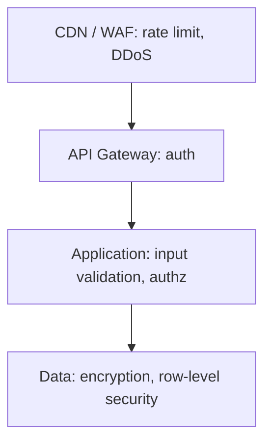

# OWASP Top 10

The **OWASP Top 10** is the industry's canonical list of web application security risks, updated every 3-4 years (current: 2021; 2025 in draft). Memorize it. It's the checklist every security review walks through; the threat model every senior engineer carries; the basis for compliance frameworks (PCI DSS, SOC 2). A subset is mandatory for all apps; some are context-specific.

This topic covers each of the 10 categories with **Spring-aware mitigations**. Subsequent C08 topics dive deep into the most impactful: SQL injection (T07), XSS+CSRF (T08), CORS (T09), encryption (T10), TLS (T11), secrets (T12), security headers (T13).

> [!NOTE]
> Prerequisites: T01-T05. Familiarity with Spring Security.

## The List (2021)

| # | Risk | Spring mitigation |
|---|------|-------------------|
| 1 | Broken Access Control | Spring Security + method-level (T16 of C01) |
| 2 | Cryptographic Failures | use modern algorithms (T10) |
| 3 | Injection | parameterized queries (T07), input validation (T11 of C01) |
| 4 | Insecure Design | threat modeling; secure SDLC |
| 5 | Security Misconfiguration | secure defaults; least privilege (T13) |
| 6 | Vulnerable & Outdated Components | dependency management (T15) |
| 7 | Identification & Authentication Failures | Spring Security; password storage (T05) |
| 8 | Software & Data Integrity Failures | signing; supply chain (T15) |
| 9 | Security Logging & Monitoring Failures | structured audit logs |
| 10 | Server-Side Request Forgery (SSRF) | URL allowlist; metadata IMDSv2 |

## A01 — Broken Access Control

The #1 risk. Examples:

- URL manipulation: `/api/orders/42` → user accesses someone else's order.
- Missing `@PreAuthorize` on a service method.
- IDOR (Insecure Direct Object Reference): foreign-key parameters not validated against owner.

Mitigations:

- **Deny by default**: `anyRequest().authenticated()`.
- **Method-level checks**: `@PreAuthorize("#order.customerId == authentication.name")`.
- **Test**: every endpoint with non-owner principal.

```java
@PreAuthorize("@orderPermissions.canView(authentication, #id)")
public Order get(long id) { ... }
```

## A02 — Cryptographic Failures

(Renamed from "Sensitive Data Exposure".)

- Storing passwords as SHA-1 / MD5.
- Sending tokens over HTTP.
- Hard-coded secrets in source.
- Wrong cipher modes (ECB; CBC without HMAC).

Mitigations:

- Argon2 / bcrypt for passwords (T05).
- TLS 1.3 everywhere (T11).
- Secrets in env / Vault / Secret Manager (T12).
- Use AEAD ciphers (AES-GCM, ChaCha20-Poly1305).

## A03 — Injection

SQL, NoSQL, command, LDAP, ORM injection.

- `"SELECT * FROM users WHERE name = '" + name + "'"` — classic.
- Cassandra / Mongo similar.
- Operating system command injection: `Runtime.exec("cmd " + userInput)`.

Mitigations:

- **Parameterized queries / prepared statements**: JPA uses them; native queries via `setParameter`.
- **Input validation**: Bean Validation.
- **Escape** when not parameterizable (rare).
- T07 dedicated treatment.

## A04 — Insecure Design

Architectural issues before code:

- Missing rate limit on password reset → enumeration.
- Workflow allowing partial state.
- Trusting client-side checks only.

Mitigations:

- **Threat modeling**: STRIDE / attack trees during design.
- **Secure SDLC**: security review for design changes.
- Defense in depth at architectural level.

## A05 — Security Misconfiguration

- Default credentials.
- Verbose error pages.
- Unnecessary services running.
- Excessive permissions on cloud resources.
- Stack traces in responses.

Mitigations:

- **Secure defaults**: Spring Boot's defaults are mostly safe; verify.
- **Disable verbose errors in prod**: `server.error.include-stacktrace=never`.
- **CI configuration scans**: tools like `kube-bench`, `Checkov`.
- **Least-privilege IAM**.

## A06 — Vulnerable & Outdated Components

Dependencies with known CVEs.

- Old Log4j (Log4Shell, CVE-2021-44228).
- Outdated Jackson (deserialization gadgets).
- Vulnerable Tomcat / Jetty version.

Mitigations:

- **Dependency scanning**: OWASP Dependency-Check, Snyk, GitHub Dependabot, Trivy.
- **Update regularly**: monthly cadence; immediate for critical CVEs.
- **SBOM**: Software Bill of Materials for visibility.
- T15 dedicated treatment.

## A07 — Identification & Authentication Failures

(Renamed from "Broken Authentication".)

- Brute-force allowed.
- Weak password requirements.
- Sessions never expiring.
- Plaintext password recovery.

Mitigations:

- Spring Security defaults.
- MFA where appropriate.
- Rate limit login.
- Strong password / passkey policy.
- Session timeout (T02).

## A08 — Software & Data Integrity Failures

Trusting unverified code/data:

- Unsigned downloads of dependencies / containers.
- CI/CD pipelines without signed commits.
- Auto-update mechanisms without verification.
- Insecure deserialization (Java `ObjectInputStream` from untrusted source).

Mitigations:

- **Sign artifacts**: Sigstore / Cosign for containers.
- **Verify in CD**.
- **Avoid `ObjectInputStream` on untrusted data**.
- **Lock dependency versions**.

## A09 — Security Logging & Monitoring Failures

- Logging absent or insufficient.
- Logs not centralized.
- No alerts on suspicious patterns.

Mitigations:

- **Structured logging**: trace IDs, user IDs, action types.
- **Centralize**: ELK, Splunk, Datadog.
- **Alert** on failed logins, privilege escalations, anomalies.
- **Retention** per compliance.

## A10 — Server-Side Request Forgery (SSRF)

App fetches a URL the attacker controls; reaches internal services:

```java
@PostMapping("/api/import")
public String fetch(@RequestParam String url) {
    return restClient.get().uri(url).retrieve().body(String.class);  // ❌ SSRF
}
```

Attacker: `url=http://169.254.169.254/latest/meta-data/iam/security-credentials/...` (AWS IMDS).

Mitigations:

- **URL allowlist**: only public-domain external URLs.
- **Block internal IPs**: 127.0.0.1, 10.0.0.0/8, 169.254.169.254, etc.
- **IMDSv2 on AWS**: requires token header; defeats simple SSRF.
- **Network segmentation**: app can't reach metadata service.

## 2025 Draft Changes

Possible new entries (in draft):

- Software supply chain (elevated from A08).
- Prompt injection in LLM-integrated apps (new category).

Stay current on OWASP updates.

## Defense In Depth



Multiple controls; one fails, others catch.

## Spring Security Defaults

Spring Boot defaults are mostly safe:

- CSRF enabled for session-cookie apps.
- Secure cookie flags via `server.servlet.session.cookie.*`.
- Strong password encoder.
- Common security headers.

Don't blindly disable defaults. Disable only with clear understanding.

## Common Pitfalls (Across All)

> [!WARNING]
> **Assuming framework handles security automatically.** Defaults help; doesn't replace review.

> [!WARNING]
> **No threat model.** Reactive fixes only.

> [!WARNING]
> **Single security control assumed sufficient.** No defense in depth.

> [!WARNING]
> **No dependency monitoring.** CVEs land; you don't know.

> [!WARNING]
> **Logs sample passwords / tokens.** Leakage.

## Practice

1. Run OWASP Dependency-Check on your project; remediate findings.
2. Threat-model an endpoint: data flow, trust boundaries, attacks.
3. Audit your code for IDOR vulnerabilities.
4. Verify all queries parameterized; find native-SQL concatenations.
5. Disable Spring Security defaults intentionally; observe what breaks.
6. Add SSRF protection on a URL-fetching endpoint.
7. Test SSRF defenses: try to reach 169.254.169.254.
8. Wire structured logging + central log; set up failed-login alert.

## Recap

You should now be able to:

- Recite OWASP Top 10 (2021) and the 2025 draft changes.
- Map each to Spring-aware mitigations.
- Apply defense in depth at edge / gateway / app / data layers.
- Use dependency scanning to catch vulnerable components.
- Threat-model designs before implementing.
- Avoid the canonical pitfalls: trusting defaults blindly, no monitoring, no SSRF defense, no IDOR check.

## Next

Continue to [SQL injection](./T07-sql-injection.md) for the deep treatment of injection prevention — parameterized queries, ORM safety, edge cases, and the patterns when you must build dynamic SQL.
