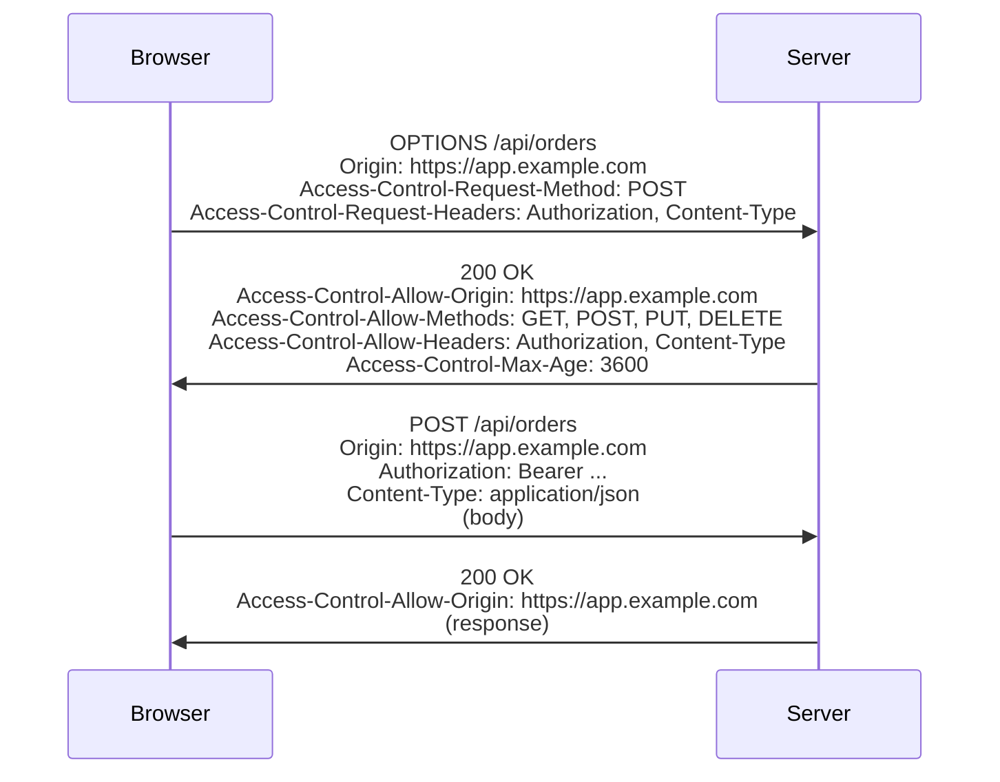

# CORS & cross-origin requests

By default the browser **same-origin policy (SOP)** blocks `fetch()` / `XHR` from `app.example.com` to `api.example.com` (different subdomains = different origins). **CORS (Cross-Origin Resource Sharing)** is the protocol by which servers explicitly opt-in to allow specific cross-origin clients. For typical Spring backends serving an SPA on a different origin, CORS configuration is mandatory; misconfigured CORS is a frequent production bug and a security risk.

This topic covers: same-origin policy; simple vs preflighted requests; the headers (Origin, Access-Control-*); credentials handling; Spring's CORS configuration; common mistakes (wildcard with credentials, overly permissive, inconsistency with Spring Security).

> [!NOTE]
> Prerequisites: [XSS & CSRF (T08)](./T08-xss-and-csrf.md), Spring MVC / Spring Security.

## Same-Origin Policy

Origin = (protocol, host, port). Different on any → different origin.

| URL A | URL B | Same origin? |
|-------|-------|:------------:|
| https://app.com | https://app.com | yes |
| https://app.com | https://api.app.com | no (subdomain) |
| https://app.com | http://app.com | no (protocol) |
| https://app.com:443 | https://app.com:8443 | no (port) |

Browser blocks JS reading responses from cross-origin endpoints (with exceptions like ``, `<script>` GETs without script reads).

## Simple Requests

A "simple" CORS request meets:

- Method: GET, HEAD, POST.
- Headers: only CORS-safe (Accept, Accept-Language, Content-Language, Content-Type with specific values).
- Content-Type: only `application/x-www-form-urlencoded`, `multipart/form-data`, or `text/plain`.

For simple requests: browser sends the request directly; server replies with `Access-Control-Allow-Origin: ...` (or not). If allowed, browser exposes response to JS.

## Preflight Requests

Non-simple requests trigger a preflight:



`Access-Control-Max-Age` caches the preflight response — avoids preflight per request (defaults to seconds; typical 3600).

## Credentials

By default, cross-origin requests **don't send cookies / Authorization**. To include:

- Client: `fetch(url, { credentials: 'include' })`.
- Server: `Access-Control-Allow-Credentials: true`.

**Wildcard origins forbidden with credentials**:

```http
Access-Control-Allow-Origin: *
Access-Control-Allow-Credentials: true       ← REJECTED by browser
```

Must specify exact origin:

```http
Access-Control-Allow-Origin: https://app.example.com
Access-Control-Allow-Credentials: true
Vary: Origin                                  ← needed for CDN caching correctness
```

## Spring CORS Configuration

### Global

```java
@Configuration
public class CorsConfig implements WebMvcConfigurer {
    @Override
    public void addCorsMappings(CorsRegistry registry) {
        registry.addMapping("/api/**")
            .allowedOrigins("https://app.example.com")
            .allowedMethods("GET", "POST", "PUT", "DELETE", "OPTIONS")
            .allowedHeaders("Authorization", "Content-Type")
            .allowCredentials(true)
            .maxAge(3600);
    }
}
```

### Per-Controller

```java
@CrossOrigin(origins = "https://app.example.com", maxAge = 3600)
@RestController
public class OrderController { ... }
```

### Spring Security Integration

When Spring Security is in the filter chain, CORS must be configured there too — Spring Security runs first; rejects preflight if not configured:

```java
@Bean
public SecurityFilterChain filter(HttpSecurity http) throws Exception {
    return http
        .cors(Customizer.withDefaults())   // uses CorsConfigurationSource bean
        .authorizeHttpRequests(auth -> auth.anyRequest().authenticated())
        .build();
}

@Bean
public CorsConfigurationSource corsConfigurationSource() {
    CorsConfiguration cfg = new CorsConfiguration();
    cfg.setAllowedOrigins(List.of("https://app.example.com"));
    cfg.setAllowedMethods(List.of("GET", "POST", "PUT", "DELETE", "OPTIONS"));
    cfg.setAllowedHeaders(List.of("Authorization", "Content-Type"));
    cfg.setAllowCredentials(true);
    cfg.setMaxAge(3600L);

    UrlBasedCorsConfigurationSource src = new UrlBasedCorsConfigurationSource();
    src.registerCorsConfiguration("/api/**", cfg);
    return src;
}
```

Without `.cors()`, Spring Security blocks preflight OPTIONS requests (no auth) → 401.

## Common Patterns

### Multi-Origin (Dev + Staging + Prod)

```java
cfg.setAllowedOriginPatterns(List.of(
    "https://app.example.com",
    "https://staging.example.com",
    "http://localhost:3000"      // dev
));
```

Use `allowedOriginPatterns` (since Spring 5.3) — supports wildcards with credentials (vs `allowedOrigins` which forbids).

### Public API (No Credentials)

```java
cfg.setAllowedOrigins(List.of("*"));
cfg.setAllowCredentials(false);
```

Public APIs that don't need cookies.

## Vary Header

When CORS depends on `Origin`, response should `Vary: Origin` so caches (browser, CDN) don't serve wrong responses.

Spring's CORS support adds this automatically; manual configs should too.

## When CORS Doesn't Apply

- Server-to-server requests: no browser, no CORS.
- Same-origin requests: no CORS needed.
- Older `<form>` POSTs: not subject to CORS (they're CSRF risk; see T08).

CORS is purely browser-side enforcement.

## Common Pitfalls

> [!WARNING]
> **Wildcard origin with credentials.** Browser rejects.

> [!WARNING]
> **Allowing `*` for headers + credentials.** Same problem.

> [!WARNING]
> **CORS not configured in Spring Security.** Preflight returns 401.

> [!WARNING]
> **`@CrossOrigin` on controller + global config.** Conflicts; controller wins.

> [!WARNING]
> **Forgot Vary header.** CDN serves wrong response.

> [!WARNING]
> **Trusting CORS as security.** CORS is **opt-in for browsers**; servers must still authenticate every request.

> [!WARNING]
> **Allow-Origin reflecting any Origin header.** Origin: `evil.com` → response has Access-Control-Allow-Origin: evil.com → bypass. Always allowlist.

> [!WARNING]
> **Preflight not cached.** Every request preflights. Set Max-Age.

> [!WARNING]
> **Mixing Spring Security CORS and WebMvcConfigurer CORS.** Two configs; one wins; confusion.

## Practice

1. Build SPA + Spring API on different ports; verify CORS error; fix.
2. Add Authorization header; verify preflight; observe `Access-Control-Request-Headers`.
3. Enable credentials; verify cookies sent; verify wildcard rejection.
4. Set Max-Age; observe preflight cached.
5. Add Spring Security; observe preflight blocked without cors() in chain; fix.
6. Test multi-origin with patterns; verify dev / staging / prod all work.
7. Try reflecting Origin header (dangerous pattern); explain the vulnerability.
8. Audit existing CORS config for your service.

## Recap

You should now be able to:

- Explain the same-origin policy and its limits.
- Distinguish simple vs preflighted CORS requests; understand OPTIONS preflight.
- Configure `Access-Control-Allow-Origin`, `-Credentials`, `-Methods`, `-Headers`, `-Max-Age`.
- Handle credentials: never wildcard with credentials; always exact origin.
- Configure Spring's CORS via WebMvcConfigurer or `CorsConfigurationSource` + Spring Security `.cors()`.
- Use `allowedOriginPatterns` for multi-origin with credentials.
- Add `Vary: Origin` for cache correctness.
- Recognize CORS is opt-in, not security; always authenticate.
- Avoid the canonical pitfalls: wildcard+credentials, no Security CORS chain, reflected origin, no Max-Age, conflicting global+per-controller.

## Next

Continue to [Encryption (symmetric/asymmetric, hashing)](./T10-encryption-symmetric-asymmetric-hashing.md) for the deep treatment of cryptographic primitives.
