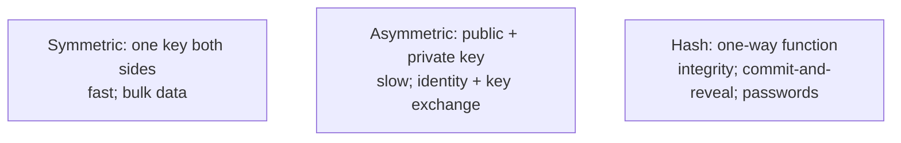

# Encryption (symmetric/asymmetric, hashing)

Cryptography is the foundation of all security. **Symmetric encryption** (one shared key) protects bulk data. **Asymmetric encryption** (public/private key pair) enables identity proofs and key exchange. **Hashing** (one-way function) supports integrity checks, password storage, and signatures. **Key derivation functions** stretch passwords or secrets into encryption keys.

A senior engineer doesn't implement crypto algorithms — they use battle-tested libraries (Java Cryptography Architecture, BouncyCastle for missing algorithms) with correct modes (AEAD like AES-GCM) and proper key management. The dominant mistakes — ECB mode, reusing IVs, custom protocols, raw RSA — are well-documented and avoidable.

This topic provides the conceptual map: when to use each primitive, the modern algorithm choices (2026), the Java APIs, and the absolute rules. Use cases: encrypting fields at rest; signing JWTs (T04); TLS (T11); secrets management (T12).

> [!NOTE]
> Prerequisites: basic algebra; binary representations. Familiarity with Java standard library.

## The Three Primitives



Real systems combine: TLS uses asymmetric to exchange a symmetric key; then symmetric for bulk traffic.

## Symmetric Encryption

### AES (Advanced Encryption Standard)

The dominant block cipher. Block size 128 bits; key sizes 128, 192, 256.

**Modes** (how blocks are chained):

| Mode | Use | Why |
|------|-----|-----|
| **GCM** | **default** | AEAD: confidentiality + integrity |
| **ChaCha20-Poly1305** | mobile / no-AES-NI | AEAD; software-fast |
| **CBC** | legacy | needs separate MAC |
| **CTR** | streams | needs separate MAC |
| **ECB** | **NEVER** | identical plaintext → identical ciphertext |

**Always use AEAD**: AES-GCM or ChaCha20-Poly1305. They encrypt + authenticate in one step.

### AES-GCM Example

```java
SecretKey key = KeyGenerator.getInstance("AES").generateKey();    // 256-bit
Cipher cipher = Cipher.getInstance("AES/GCM/NoPadding");
byte[] iv = new byte[12];
SecureRandom.getInstanceStrong().nextBytes(iv);
GCMParameterSpec spec = new GCMParameterSpec(128, iv);   // 128-bit auth tag
cipher.init(Cipher.ENCRYPT_MODE, key, spec);
byte[] ciphertext = cipher.doFinal(plaintext);
// Send (iv, ciphertext) to receiver
```

### Critical Rules

- **Never reuse IV with same key**. GCM IV reuse = catastrophic compromise (key leaks).
- **Use SecureRandom** for IV / keys.
- **Don't roll your own**.

## Asymmetric Encryption

### RSA

Older. Encryption (small data only) + signing. Use **RSA-OAEP** (padding); never raw RSA.

Key sizes: 2048 minimum; 3072 preferred; 4096 if paranoid.

```java
KeyPairGenerator kpg = KeyPairGenerator.getInstance("RSA");
kpg.initialize(3072);
KeyPair kp = kpg.generateKeyPair();

Cipher c = Cipher.getInstance("RSA/ECB/OAEPWithSHA-256AndMGF1Padding");
c.init(Cipher.ENCRYPT_MODE, kp.getPublic());
byte[] ciphertext = c.doFinal(smallPlaintext);
```

RSA encryption is slow and limited to short messages. In practice, **hybrid encryption**: RSA encrypts an AES key; AES encrypts the data.

### Elliptic Curve (ECDH / ECDSA / EdDSA)

Smaller keys, faster, same security:

- **ECDH**: key exchange (Diffie-Hellman over elliptic curves).
- **ECDSA**: signing (P-256, P-384, P-521).
- **EdDSA / Ed25519**: modern signature scheme; the recommended default.

```java
KeyPairGenerator kpg = KeyPairGenerator.getInstance("Ed25519");
KeyPair kp = kpg.generateKeyPair();

Signature sig = Signature.getInstance("Ed25519");
sig.initSign(kp.getPrivate());
sig.update(message);
byte[] signature = sig.sign();
```

Java 15+ supports Ed25519 natively.

### Signing Modern Pick

**Ed25519** for new code. **ECDSA-P256** for compatibility (e.g., webhook signatures).

## Hashing

### Cryptographic Hashes

| Algorithm | Status |
|-----------|--------|
| **SHA-256, SHA-512** | safe; default |
| **SHA-3** | safe; alternative |
| **BLAKE2 / BLAKE3** | safe; fast |
| **SHA-1** | broken (collisions) |
| **MD5** | broken |

Use SHA-256 for general hashing (integrity checks, commitments). **Not for passwords** — too fast (T05).

```java
MessageDigest md = MessageDigest.getInstance("SHA-256");
byte[] hash = md.digest(data);
```

### HMAC

Keyed hash for message authentication:

```java
Mac mac = Mac.getInstance("HmacSHA256");
mac.init(new SecretKeySpec(key, "HmacSHA256"));
byte[] tag = mac.doFinal(message);
```

Used in webhook signatures, JWT HS256, API request signing.

### HKDF

Key derivation from input keying material:

```java
// Derive AES key from shared secret
// Using BouncyCastle or custom HKDF
```

Spreads entropy across many keys from one shared secret.

## Java Cryptography Architecture (JCA)

Java's standard crypto API:

- `Cipher` — encryption/decryption.
- `Signature` — signing/verification.
- `MessageDigest` — hashing.
- `Mac` — HMAC.
- `KeyGenerator` / `KeyPairGenerator` — key generation.
- `SecureRandom` — cryptographic RNG.

For algorithms not in JDK (e.g., Argon2, ChaCha20-Poly1305 in older JDKs):

```xml
<dependency>
    <groupId>org.bouncycastle</groupId>
    <artifactId>bcprov-jdk18on</artifactId>
</dependency>
```

```java
Security.addProvider(new BouncyCastleProvider());
```

## Key Management

The **hardest part** of crypto isn't the algorithm — it's **key management**.

- **Generate**: `SecureRandom`; sufficient entropy.
- **Store**: HSM, KMS, Vault — never alongside data.
- **Rotate**: periodically; emergency on suspicion.
- **Destroy**: when retired; zeroize memory.

Managed KMS (AWS KMS, GCP KMS, Azure Key Vault, HashiCorp Vault) handle most of this. Use them.

```java
// AWS SDK example: encrypt via KMS without exposing key
EncryptResult result = kmsClient.encrypt(EncryptRequest.builder()
    .keyId("alias/my-app")
    .plaintext(SdkBytes.fromByteArray(plaintext))
    .build());
```

## Field-Level Encryption (Data at Rest)

Common need: encrypt PII columns:

- **Application-side**: app encrypts before storing; decrypts on read. App holds key.
- **DB-side**: TDE (Transparent Data Encryption). DB encrypts files; transparent to app.
- **KMS-managed**: app calls KMS per encrypt/decrypt; key never in app memory.

For high-security, **envelope encryption**: KMS-encrypted data key; data key encrypts data; both stored together. Decrypt: KMS unwraps data key; data key decrypts data.

## Absolute Rules

1. **Don't roll your own**. Use mature libraries.
2. **Use AEAD** (AES-GCM, ChaCha20-Poly1305) for encryption.
3. **Don't reuse IV/nonce** with same key.
4. **Use `SecureRandom`**, not `Random`.
5. **Use named curves** (P-256 / Ed25519), not "custom".
6. **Modern modes only** — no ECB, no MD5, no SHA-1.
7. **Key management is the hard part** — use KMS / HSM.
8. **Hybrid encryption** for large data with public-key crypto.

## Common Pitfalls

> [!WARNING]
> **ECB mode.** Plaintext patterns visible.

> [!WARNING]
> **IV reuse with AES-GCM.** Catastrophic.

> [!WARNING]
> **Raw RSA (no padding).** Breakable.

> [!WARNING]
> **`Random` instead of `SecureRandom`.** Predictable.

> [!WARNING]
> **Hardcoded keys in source.** Forever leaked once committed.

> [!WARNING]
> **MD5 / SHA-1 anywhere.** Broken.

> [!WARNING]
> **Custom protocols.** Don't.

> [!WARNING]
> **Encryption without authentication.** Tampering undetected.

> [!WARNING]
> **Key in same DB as data.** Both leak together.

## Practice

1. Encrypt + decrypt with AES-GCM; verify same plaintext.
2. Reuse IV intentionally; understand catastrophic risk.
3. Sign + verify with Ed25519.
4. Use HMAC for webhook signatures (T09 of C05).
5. Try BouncyCastle for Argon2 hashing.
6. Compare RSA-OAEP vs hybrid (RSA wraps AES key) for 1 MB payload.
7. Implement KMS-based envelope encryption.
8. Audit codebase: any custom crypto? Replace with library.

## Recap

You should now be able to:

- Distinguish symmetric (AES-GCM, ChaCha20-Poly1305), asymmetric (RSA-OAEP, ECDH/ECDSA, Ed25519), and hashing (SHA-256, HMAC, HKDF).
- Use AEAD modes (GCM, ChaCha20-Poly1305) for confidentiality + integrity.
- Use Ed25519 for modern signatures; ECDSA-P256 for compatibility; RSA-3072 for legacy.
- Apply hybrid encryption (RSA wraps AES key) for large data.
- Use Java JCA + BouncyCastle for missing algorithms.
- Manage keys via KMS / HSM; use envelope encryption.
- Avoid the canonical pitfalls: ECB, IV reuse, raw RSA, weak hashes, hardcoded keys, custom crypto.

## Next

Continue to [TLS in practice](./T11-tls-in-practice.md) for the operational reality of TLS — versions, ciphers, certificates, mTLS, Spring TLS configuration.
