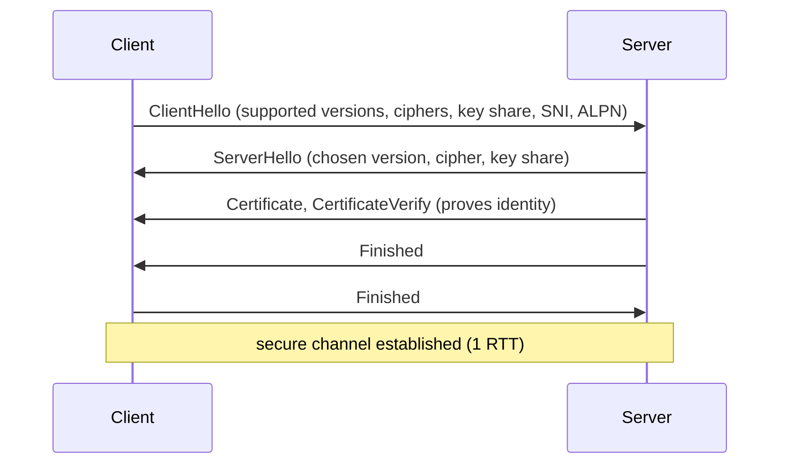
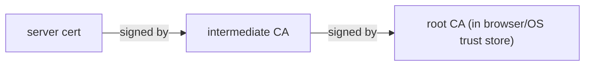
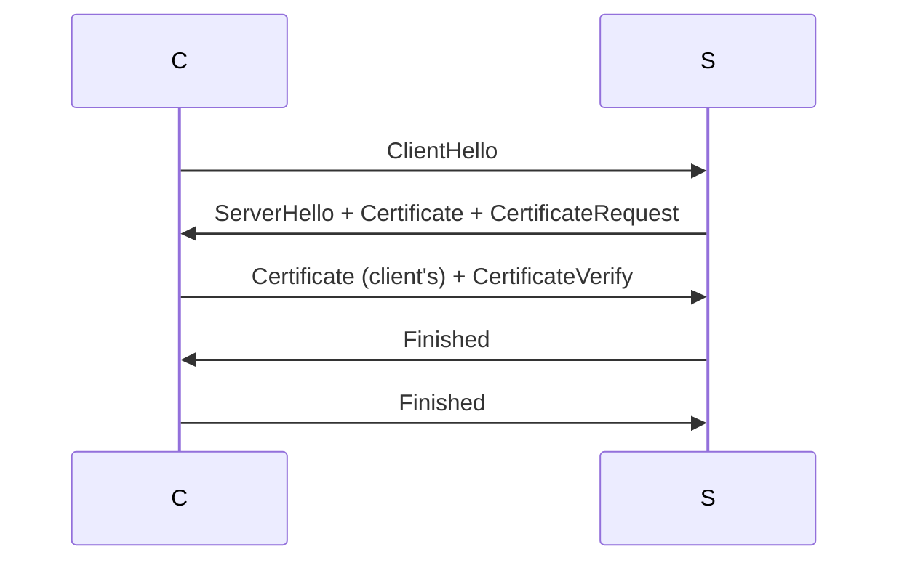
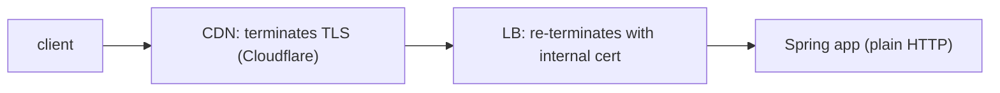

# TLS in practice

TLS (Transport Layer Security) is **the encryption layer** between HTTP and TCP. Every modern service speaks TLS — for external traffic by default; increasingly for internal too (mTLS, zero trust). TLS 1.3 (2018) simplified and hardened the protocol; TLS 1.2 (2008) remains for compatibility. SSL (1995-1999) is **deprecated**; never enable.

A senior engineer running production TLS understands: which versions and ciphers to allow; how certificates work (X.509, chains, SANs); when to use mTLS; how to integrate Let's Encrypt; how Java handles certs (keystores). The encryption math is in T10; **this topic** is operational.

> [!NOTE]
> Prerequisites: [Encryption (T10)](./T10-encryption-symmetric-asymmetric-hashing.md), networking basics.

## TLS Versions

| Version | Year | Status |
|---------|-----|--------|
| **TLS 1.3** | 2018 | **default** |
| **TLS 1.2** | 2008 | acceptable |
| TLS 1.1 | 2006 | **disable** |
| TLS 1.0 | 1999 | **disable** |
| SSL 3.0 | 1996 | **disable** |
| SSL 2.0 | 1995 | **disable** |

**Configure for TLS 1.3 + TLS 1.2 only.**

```yaml
server:
  ssl:
    enabled-protocols: TLSv1.3,TLSv1.2
```

## The Handshake

TLS 1.3 handshake (simplified):



TLS 1.3 also supports **0-RTT** (resumed sessions) — application data with the first packet.

## Certificates

A certificate is a signed statement: "this public key belongs to `api.example.com`, signed by CA X."

### Components

- **Subject**: identifies the cert holder.
- **Subject Alternative Names (SANs)**: additional hostnames the cert covers (`api.example.com`, `*.api.example.com`).
- **Issuer**: the CA that signed.
- **Validity**: not-before, not-after dates.
- **Public key**: the holder's public key.
- **Signature**: CA's signature over the cert.

### Chain Of Trust



Browser walks the chain to a trusted root. Server should send the full chain (server + intermediate); clients have the root pre-installed.

### Let's Encrypt

Free, automated CA via **ACME** protocol. Issues 90-day certs; auto-renewal via tools like Certbot, lego, cert-manager (Kubernetes).

For Spring Boot:

- **Behind reverse proxy** (nginx, Caddy, Traefik): proxy terminates TLS; Spring sees plain HTTP. Most common.
- **Embedded in Spring** (less common): use Spring Boot Auto SSL with Let's Encrypt integration.

In Kubernetes: cert-manager + Let's Encrypt issuer handles everything.

## Cipher Suites

A cipher suite specifies algorithms for key exchange, signature, encryption, MAC. For TLS 1.3:

```
TLS_AES_256_GCM_SHA384
TLS_CHACHA20_POLY1305_SHA256
TLS_AES_128_GCM_SHA256
```

All TLS 1.3 ciphers are AEAD and PFS — strong by default.

For TLS 1.2 (when must use):

```
ECDHE-RSA-AES256-GCM-SHA384
ECDHE-ECDSA-AES256-GCM-SHA384
ECDHE-RSA-CHACHA20-POLY1305
```

ECDHE = ephemeral key exchange = Perfect Forward Secrecy (PFS): session keys not derivable from long-term private key. Critical.

**Disable**:
- RC4 (broken).
- 3DES (deprecated).
- Anything CBC without HMAC-SHA-256+.
- Anything not PFS (static RSA key exchange).

## SNI And ALPN

**Server Name Indication (SNI)**: in ClientHello, client says which hostname it wants. Server picks the right cert. Allows multiple HTTPS sites on one IP.

**Application-Layer Protocol Negotiation (ALPN)**: in ClientHello, client lists supported protocols (`h2`, `http/1.1`, `h3`). Server picks. Lets HTTP/2 work over TLS.

## HSTS

`Strict-Transport-Security` header tells browsers "always use HTTPS for this domain":

```http
Strict-Transport-Security: max-age=31536000; includeSubDomains; preload
```

- 1 year max-age.
- `includeSubDomains` — applies to subdomains.
- `preload` — submit to HSTS preload list (hardcoded in browsers).

Mandatory for production. Once preloaded, very hard to undo — be sure.

## OCSP Stapling

Certificate revocation check: client asks "is this cert still valid?". OCSP (Online Certificate Status Protocol) answers. **OCSP stapling**: server fetches the OCSP response and includes it in TLS handshake — saves client round-trip.

```yaml
# nginx config (for behind-proxy setups)
ssl_stapling on;
ssl_stapling_verify on;
```

## Mutual TLS (mTLS)

Standard TLS authenticates server to client. **mTLS** also authenticates client to server via cert.

Used for:

- **Service-to-service**: every service has its own cert; mutual auth.
- **Zero-trust networks**: identity-based, not IP-based.
- **High-assurance APIs**: bank-grade.



In Kubernetes, **service mesh** (Istio, Linkerd) provisions mTLS automatically.

## Java Keystores

Java stores certs/keys in **keystores**: `.jks` (legacy) or `.p12` (PKCS#12, recommended).

Generate keypair:

```bash
keytool -genkeypair -alias myapp \
    -keyalg EC -keysize 256 \
    -keystore keystore.p12 -storetype PKCS12 \
    -storepass changeit -keypass changeit \
    -dname "CN=api.example.com"
```

```yaml
server:
  ssl:
    enabled: true
    key-store: classpath:keystore.p12
    key-store-password: ${KEYSTORE_PASS}
    key-store-type: PKCS12
    key-alias: myapp
```

For mTLS server-side:

```yaml
server:
  ssl:
    trust-store: classpath:truststore.p12
    trust-store-password: ${TRUSTSTORE_PASS}
    client-auth: need        # require client cert
```

## Certificate Pinning

Client embeds expected cert hash; rejects others. Defeats CA compromise. Used in mobile apps (Android Network Security Config, iOS App Transport Security).

```kotlin
val cert = "sha256/abc..."
OkHttpClient.Builder()
    .certificatePinner(CertificatePinner.Builder()
        .add("api.example.com", "sha256/abc...")
        .build())
    .build()
```

Costly to rotate certs (must update app). Use for high-stakes.

## TLS Termination Patterns



Three TLS connections: client↔CDN, CDN↔LB, LB↔App (or mTLS internal). Internal mTLS is the modern norm.

## Common Pitfalls

> [!WARNING]
> **TLS 1.0/1.1/SSL enabled.** Vulnerabilities. Disable.

> [!WARNING]
> **Self-signed certs in production.** Untrusted. Use Let's Encrypt or proper CA.

> [!WARNING]
> **No HSTS.** Browser allows HTTP first; downgrade risk.

> [!WARNING]
> **Expired certs.** Service down. Automate renewal.

> [!WARNING]
> **Non-PFS ciphers.** Past traffic decryptable on key compromise.

> [!WARNING]
> **mTLS without cert rotation plan.** Eventually expires; downtime.

> [!WARNING]
> **Certificate pinning without backup.** Rotate stuck; users locked out.

> [!WARNING]
> **JKS keystore on new code.** Use PKCS12.

> [!WARNING]
> **TLS terminated at edge only, plaintext internal.** "TLS-everywhere" includes internal.

## Practice

1. Set up Let's Encrypt + cert-manager in Kubernetes; verify renewal.
2. Run `nmap --script ssl-enum-ciphers -p 443 yoursite.com` to see ciphers.
3. Set up Spring HTTPS with PKCS12 keystore.
4. Configure mTLS between two Spring services.
5. Enable HSTS; verify behavior in browser dev tools.
6. Test cert chain: ensure full chain served.
7. Try TLS 1.3 0-RTT for resumed sessions.
8. Audit your TLS config against Mozilla's SSL configurator.

## Recap

You should now be able to:

- Configure TLS 1.3 + TLS 1.2 only; disable older.
- Generate / configure certs; use Let's Encrypt + ACME for renewal automation.
- Understand cert chain; serve intermediate + leaf.
- Pick PFS cipher suites (ECDHE-based for TLS 1.2).
- Use SNI for multi-host; ALPN for HTTP/2.
- Implement HSTS with preload for browser-side enforcement.
- Configure OCSP stapling for revocation checks.
- Deploy mTLS for service-to-service auth.
- Manage Java keystores (PKCS12); configure Spring `server.ssl.*`.
- Apply certificate pinning for mobile.
- Plan TLS termination: edge + internal mTLS.
- Avoid the canonical pitfalls: old TLS, self-signed in prod, no HSTS, expired certs, non-PFS, pinning without backup.

## Next

Continue to [Secrets management](./T12-secrets-management.md) for the operational discipline of secrets — Vault, KMS, env vars, rotation.
