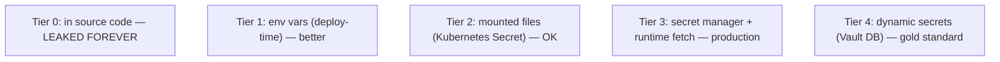

# Secrets management

Every service has secrets: DB passwords, API keys, signing keys, encryption keys, OAuth client secrets. **How you manage them is the difference between a robust system and a public S3 bucket of credentials.** The basic rule: secrets in **source code = leaked forever**. Secrets in **env vars = better, still risky**. Secrets in **secret manager (Vault, KMS) + just-in-time fetching + rotation = production-grade**.

A senior engineer chooses the right tier: small services use env vars + GitOps-managed encrypted secrets (Sealed Secrets, SOPS); medium services use cloud KMS / Secret Manager; large or regulated systems use Vault with dynamic secrets and audit trails.

This topic covers: the tiers; common services (Vault, AWS Secrets Manager, GCP Secret Manager, Azure Key Vault); Kubernetes Secrets (and their reputation); GitOps patterns (Sealed Secrets, SOPS); Spring Cloud Vault integration; dynamic secrets and rotation; secret scanning in CI; the breach response.

> [!NOTE]
> Prerequisites: [Encryption (T10)](./T10-encryption-symmetric-asymmetric-hashing.md), Kubernetes / cloud basics.

## The Tiers



Adopt Tier 3 minimum for production.

## Why Not Source Code

Once committed:

- Forever in git history.
- Public on GitHub if repo public.
- Scanners (TruffleHog, gitleaks) find them.
- Even private repos: any team member with access has the secret.

**Even after deletion**: git history retains. Rotate immediately if leaked.

## Why Not Just Env Vars

Env vars improve over source but:

- Visible in `/proc/PID/environ` to any process on the host.
- Logged accidentally (`env | grep ...`).
- Stored somewhere (Kubernetes Secret, CI/CD config) — that becomes the new secret.

OK for small services; not for production at scale.

## Kubernetes Secrets

Kubernetes Secret is base64-encoded etcd entry. Mounted as env vars or files into pods.

```yaml
apiVersion: v1
kind: Secret
metadata:
  name: db-creds
type: Opaque
data:
  password: c2VjcmV0
```

Caveats:

- Base64 ≠ encrypted. `kubectl get secret -o yaml` shows them.
- Stored in etcd; access controlled by RBAC.
- Etcd at rest is plain unless you enable encryption-at-rest.

Best practice: **encryption at rest enabled** + **RBAC** + **prefer external secret manager**.

## HashiCorp Vault

The gold standard for self-hosted secret management:

- **Static secrets**: store + retrieve.
- **Dynamic secrets**: Vault generates on demand (e.g., DB user with TTL).
- **PKI engine**: issue certs.
- **Transit engine**: encryption-as-a-service.
- **Auth methods**: AppRole, Kubernetes, AWS IAM, OIDC.
- **Audit log**: every access recorded.

Spring Cloud Vault integration:

```yaml
spring:
  config:
    import:
      - "vault://"
  cloud:
    vault:
      authentication: kubernetes
      kubernetes:
        role: my-app
      uri: https://vault.internal:8200
      kv:
        backend: secret
        application-name: my-app
```

Vault server-authenticates the pod (via k8s service account); fetches secrets; injects into Environment.

## Cloud Secret Managers

- **AWS Secrets Manager**: managed; rotation built-in for RDS, Redshift.
- **GCP Secret Manager**: lightweight; pay-per-access.
- **Azure Key Vault**: integrated with Azure AD.

```yaml
# Spring Boot 3 + spring-cloud-aws-starter-secrets-manager
spring:
  config:
    import:
      - "aws-secretsmanager:/my-app/prod"
```

## Sealed Secrets (Kubernetes GitOps)

Encrypt secrets so they're safe to commit to git:

```bash
kubeseal < secret.yaml > sealed-secret.yaml
git commit sealed-secret.yaml   # safe: encrypted
```

Sealed Secrets controller in cluster decrypts to plain Secret. Key never leaves cluster.

## SOPS

[Mozilla SOPS](https://github.com/getsops/sops): encrypt files (yaml, json, env) using KMS keys.

```bash
sops encrypt config.yaml
# now config.yaml has encrypted values; safe to commit
```

Decrypts at deploy time. Works for any tool, not just Kubernetes.

## Dynamic Secrets

Vault's DB engine: instead of storing DB password, Vault creates a fresh user per request with TTL.

```
GET /v1/database/creds/orders-app
→ { username: "v-app-h7s2", password: "...", lease_id: "...", lease_duration: 3600 }
```

App uses for 1 hour; Vault auto-revokes. Leak ≠ persistent risk.

Best fit: rotating DB credentials, AWS IAM credentials, SSH keys.

## Spring Integration Tier

```yaml
spring:
  config:
    import:
      - "optional:vault://"
      - "optional:configtree:/etc/secrets/"
      - "optional:aws-secretsmanager:/my-app/"
```

`spring.config.import` supports many secret sources. `configtree:/etc/secrets/` reads files mounted from Kubernetes Secret / Vault Agent injector.

## Secret Rotation

Static secrets become liabilities over time. Rotate:

- **DB passwords**: monthly minimum; weekly for high-stakes.
- **API keys**: per provider policy.
- **Signing keys**: yearly (or on suspicion).
- **TLS certs**: 90 days (Let's Encrypt) or 1 year (longer-lived).

Manual rotation breaks things. Use:

- Vault dynamic secrets (auto-rotation).
- AWS Secrets Manager scheduled rotation.
- Automated rotation scripts triggered by Vault leases.

## Secret Scanning In CI

Tools detect leaked secrets in commits:

- **GitHub Secret Scanning** (free for public repos).
- **TruffleHog**.
- **gitleaks**.
- **detect-secrets** (Yelp).

```yaml
# pre-commit hook
- repo: https://github.com/Yelp/detect-secrets
  hooks:
    - id: detect-secrets
```

Block commits with potential secrets.

## Breach Response

Leaked secret → assume compromised:

1. **Rotate immediately**. Invalidate the old.
2. **Audit usage**: who accessed?
3. **Investigate**: how leaked? Fix root cause.
4. **Notify** per policy.
5. **Document** in incident log.

Speed matters. Hours from leak to attacker exploitation.

## The Bootstrap Problem

Secrets to access the secret manager — turtles all the way down:

- **Cloud auth**: AWS IAM Instance Profile, GCP Workload Identity. Identity from infra.
- **Kubernetes auth**: pod's service account token.
- **AppRole**: machine-account with role-id + secret-id (Vault).

Vault Agent / external-secrets operator handles the bootstrap.

## Anti-Patterns

> [!WARNING]
> **Secrets in source code.** Forever leaked. Use scanners.

> [!WARNING]
> **`.env` committed to git.** Same.

> [!WARNING]
> **Secrets in Docker image.** Layers persist.

> [!WARNING]
> **CI/CD logs printing secrets.** Mask or redact.

> [!WARNING]
> **Hardcoded fallback secrets.** "If env not set, use this default" — leaked.

> [!WARNING]
> **Secret rotation manual.** Forgotten.

> [!WARNING]
> **Kubernetes Secret + no etcd encryption.** Plain at rest.

> [!WARNING]
> **Sealed Secrets backed up without backing up master key.** Lost forever.

> [!WARNING]
> **Same secret across environments.** Dev leak compromises prod.

## Practice

1. Add secret scanning to CI; commit a fake secret; verify caught.
2. Set up Vault locally; store + retrieve a secret.
3. Use Spring Cloud Vault with k8s auth in dev cluster.
4. Try dynamic DB credentials via Vault.
5. Encrypt a config file with SOPS; verify it's safe to commit.
6. Use Sealed Secrets in a k8s GitOps workflow.
7. Audit your service: any hardcoded fallback secrets?
8. Plan rotation policy for each secret type.

## Recap

You should now be able to:

- Tier secrets: source code (NO), env vars (basic), mounted files (OK), secret manager (production), dynamic secrets (gold standard).
- Use HashiCorp Vault for static + dynamic secrets with audit trail.
- Use cloud secret managers (AWS / GCP / Azure) when on those clouds.
- Use Kubernetes Secrets with encryption-at-rest + RBAC; prefer external secret manager.
- Apply GitOps patterns: Sealed Secrets, SOPS for git-committable encrypted secrets.
- Integrate with Spring via `spring.config.import` (vault://, configtree://, aws-secretsmanager://).
- Rotate secrets: dynamic where possible; scheduled for static.
- Run secret scanning in CI.
- Plan breach response: rotate + audit + fix root cause.
- Solve bootstrap via cloud/k8s identity.
- Avoid the canonical pitfalls: secrets in source, in Docker, logged in CI, hardcoded fallbacks, manual rotation, plain etcd.

## Next

Continue to [Security headers](./T13-security-headers.md) for the browser-protection HTTP headers — CSP, HSTS, X-Frame-Options, and friends.
