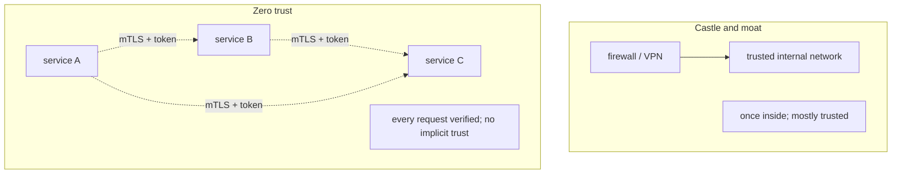
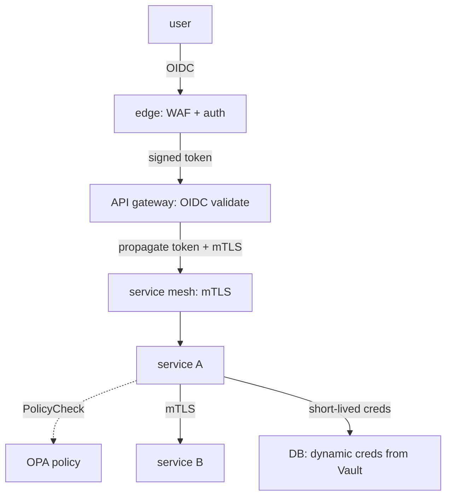

# Security architecture & zero trust (intro)

Traditional network security relied on the **castle-and-moat** model: trusted internal network; external boundary defended (firewall, DMZ); once inside, mostly trusted. The model broke as cloud, mobile, remote work, and microservices made "inside" meaningless. Google's BeyondCorp (2014) and the NIST SP 800-207 (2020) codified the alternative: **zero trust**. *Never trust, always verify*. Every request — internal or external — is authenticated, authorized, and encrypted; identity is the perimeter.

A senior engineer can articulate the architectural implications: every service speaks mTLS (T11) to every other; every API call carries an identity token; authorization happens at every hop; secrets are short-lived; policies are centralized; logs flow everywhere. The cost is operational complexity; the benefit is **lateral movement becomes nearly impossible** when one service is compromised.

This is the closing topic of C08. We sketch the principles, the implementation patterns (service mesh, SPIFFE/SPIRE workload identity, policy engines), and what a zero-trust Spring service looks like in practice.

> [!NOTE]
> Prerequisites: [AuthN vs AuthZ (T01)](./T01-authentication-vs-authorization.md), [TLS / mTLS (T11)](./T11-tls-in-practice.md), [Spring Cloud (L4/C01/T18)](../C01-spring-framework/T18-spring-cloud-config-gateway-eureka-openfeign.md), Kubernetes basics.

## The Principles

NIST SP 800-207 zero-trust tenets (paraphrased):

1. All data sources and services are resources.
2. Communication is secured regardless of network location.
3. Access is granted per-session.
4. Access is dynamic; policy-evaluated per request.
5. Integrity and security posture monitored.
6. Authentication and authorization on every request.
7. Information collected; used to improve posture.

The headline: **identity, not network location, is the security boundary**.

## Castle-and-Moat Vs Zero Trust



## Implementation Patterns

### Service Mesh (Istio, Linkerd, Cilium)

Sidecar (or eBPF) proxy intercepts every inbound/outbound connection. Provides:

- **mTLS automatically**: certificates rotated; identity exchanged.
- **Policy enforcement**: who can call who.
- **Observability**: every call traced.
- **Retries / timeouts / circuit breakers**: at mesh layer.

```yaml
# Istio AuthorizationPolicy
apiVersion: security.istio.io/v1beta1
kind: AuthorizationPolicy
spec:
  selector: { matchLabels: { app: orders } }
  rules:
    - from:
        - source: { principals: ["cluster.local/ns/payments/sa/payments-svc"] }
      to:
        - operation: { methods: ["GET", "POST"] }
```

Application code unaware; mesh enforces.

### SPIFFE / SPIRE

**SPIFFE** (Secure Production Identity Framework For Everyone) is a standard for workload identity. **SPIRE** is the reference implementation.

Each workload has a **SPIFFE ID**: `spiffe://example.com/ns/orders/sa/orders-app`. SPIRE issues short-lived X.509 SVIDs (verifiable identity documents) representing this identity. Services authenticate via SVID.

Vendor-neutral; Istio uses SPIFFE internally.

### Policy Engines (OPA, Cedar)

Authorization at scale: a service queries a policy engine per request.

```rego
# OPA policy
package authz
default allow = false
allow {
    input.subject.role == "admin"
}
allow {
    input.action == "read"
    input.subject.id == input.resource.owner
}
```

Service calls OPA: `is action X by subject Y on resource Z allowed?`. Same policy across services.

### Short-Lived Credentials

- DB passwords rotated dynamically via Vault.
- Cloud IAM roles assumed per request.
- API keys with short TTL + refresh.

Leaked credentials have minutes of value, not lifetime.

## What A Zero-Trust Spring Service Looks Like



- Edge authenticates user.
- Gateway validates OIDC token.
- mTLS between every service.
- Each service checks authorization (via OPA or local logic) per request.
- DB credentials from Vault, short-lived.
- Everything logged.

## Migration Path

You don't switch to zero trust overnight. Incremental:

1. **mTLS** between services (service mesh).
2. **Identity propagation**: JWT through call chain.
3. **Per-service AuthZ**: not just gateway.
4. **Dynamic secrets**: Vault.
5. **Policy engine**: centralize.
6. **Audit + monitor everywhere**.

Each step reduces blast radius.

## Limits

Zero trust is not magic:

- **Operational complexity** rises (more moving parts).
- **Latency**: per-request policy check, mTLS handshake (mitigated by session resumption).
- **Cost**: service mesh + Vault + policy engine all consume resources.
- **Skill required**: not every team can operate.

For small teams / small systems: incremental adoption; mesh for mTLS first.

## Secure-By-Design Principles

Even before adopting zero trust fully:

- **Least privilege everywhere**: minimum perms.
- **Defense in depth**: multiple controls.
- **Fail closed**: deny by default.
- **Separation of duties**: no single account does everything.
- **Auditability**: every change logged.
- **Threat model** at design time.

These predate zero trust; zero trust operationalizes them.

## Common Pitfalls

> [!WARNING]
> **"Zero trust" as marketing.** Without identity propagation + AuthZ per service, it's still castle-and-moat.

> [!WARNING]
> **mTLS without identity-aware AuthZ.** mTLS proves identity; doesn't restrict actions.

> [!WARNING]
> **Long-lived secrets.** Defeats zero-trust premise.

> [!WARNING]
> **Policy engine bottleneck.** Latency-sensitive paths suffer. Cache or move to local.

> [!WARNING]
> **Adopting all at once.** Operational meltdown.

> [!WARNING]
> **Single point of failure: identity provider.** If down, nothing works. Plan HA.

> [!WARNING]
> **Logging insufficient.** Detection blind spots.

> [!WARNING]
> **Skipping monitoring.** Zero trust without observation isn't trust at all.

## Practice

1. Map your current security: edge auth, internal auth?
2. Deploy a service mesh (Istio / Linkerd) in dev cluster; observe mTLS.
3. Propagate identity through 3 services; verify per-hop AuthZ.
4. Build OPA policy; integrate one Spring service.
5. Replace static DB password with Vault dynamic secret.
6. Audit IAM permissions; reduce to least-privilege.
7. Threat-model a new feature with STRIDE.
8. Plan migration: which step first for your stack?

## Recap

You should now be able to:

- Articulate zero-trust principles: never trust, always verify; identity is the perimeter.
- Distinguish castle-and-moat (trust internal) from zero trust (verify every request).
- Apply implementation patterns: service mesh for mTLS, SPIFFE/SPIRE for workload identity, OPA for policy, Vault for dynamic secrets.
- Sketch a zero-trust Spring service: edge + gateway + mesh + per-service AuthZ + Vault.
- Migrate incrementally: mesh → identity propagation → per-service AuthZ → dynamic secrets → policy engine.
- Apply secure-by-design: least privilege, defense in depth, fail closed, audit everywhere.
- Recognize operational cost; size adoption to team capability.
- Avoid the canonical pitfalls: marketing-only zero trust, mTLS without AuthZ, long-lived secrets, all-at-once adoption.

## Next

C08 is complete (16 of 16 topics). Continue to [C09 Testing — Advanced](../C09-testing-advanced/) for integration testing, test slices, Testcontainers, BDD, contract testing, mutation testing, load testing, and the test pyramid strategy.
