# Modern Authentication: OAuth 2.1, FIDO2, WebAuthn & Passkeys

[OAuth2 & OIDC (T03)](./T03-oauth2-and-openid-connect.md) answers *"how does a client get a token to act on a user's behalf, and how does a federated identity provider assert who logged in."* It is a **delegation and federation** protocol. It deliberately says almost nothing about *how the user actually proves they are who they claim to be* at the authorization server's login page — that is the **credential layer**, and for thirty years that layer was a password.

This topic covers the modern credential layer: **FIDO2 / WebAuthn / passkeys** — passwordless, *phishing-resistant* authentication built on public-key cryptography — and how it composes with the OAuth 2.1 flows from T03. A senior engineer must be able to explain the WebAuthn registration and authentication ceremonies byte for byte, say *exactly why* a passkey cannot be phished (where a password, an OTP, and even a push notification can), describe where the private key physically lives and why it never leaves the device, and wire all of it into a Spring application that also speaks OIDC. This is the single most important authentication shift of the decade: the major platforms (Apple, Google, Microsoft) now ship passkeys by default.

> [!NOTE]
> Prerequisites: [AuthN vs AuthZ (T01)](./T01-authentication-vs-authorization.md), [Sessions vs tokens (T02)](./T02-sessions-vs-tokens.md), [OAuth2 & OIDC (T03)](./T03-oauth2-and-openid-connect.md), [Password storage (T05)](./T05-password-storage-bcrypt-argon2.md). This topic assumes you know what a hash, an HMAC, and asymmetric (public/private key) cryptography are — see [Encryption (T10)](./T10-encryption-symmetric-asymmetric-hashing.md).

## The Mental Model: Secret Handshake vs Signet Ring

Before any bytes, hold three analogies in your head — they will make every protocol detail below feel inevitable rather than arbitrary.

- **A password is a secret handshake that anyone who overhears can copy.** You perform the handshake at the castle gate to prove you belong. But a handshake is just a *sequence anyone can reproduce*: if a spy watches you do it once — at the real gate, or at a fake gate set up down the road — they can walk up to the real castle and do the exact same handshake. The "secret" is reusable and it travels, so copying it is the whole attack. SMS codes, TOTP codes, and push approvals are all variations of a handshake: a short reproducible token you perform in front of whoever is asking.
- **A passkey is a tamper-proof signet ring whose private die never leaves your hand.** Instead of performing a copyable sequence, you press your ring into hot wax over a *message the castle wrote for you this morning*. Anyone can look at the resulting seal and confirm it matches the ring's public pattern (which the castle has on file), but nobody can forge a new seal without the physical die — and the die is welded inside the ring and never comes out. Even if a thief photographs a hundred of your seals, they cannot press a new one.
- **Origin binding is a stamp that only works on letters addressed to the real castle.** Now imagine the ring is enchanted: it refuses to seal any letter unless the address on the envelope reads *the real castle's name*. A con artist who sets up a fake castle ("evil-castle") and asks you to seal a letter gets nothing — the ring simply won't press, and even if it did, the seal would carry "evil-castle" baked into it, which the real castle's gatekeeper would reject on sight. This single property is what makes passkeys *phishing-resistant* rather than merely strong.

Keep these three pictures alongside the diagrams. "The secret leaves your hand and is copyable" is the disease; "a non-exportable die that only stamps the right address" is the cure.

## The Authentication Ladder

"Modern auth" is really a journey up a ladder of phishing resistance. The decisive property is the rightmost column: can an attacker who tricks the user into the wrong place still capture a reusable credential?

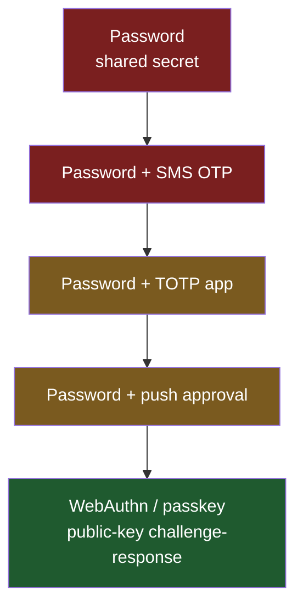

| Factor | Secret leaves device? | Phishable? | Server breach exposes login secret? | Replayable? |
|---|---|---|---|---|
| Password | Yes (sent every login) | **Yes** | Yes (hash crackable) | Yes |
| SMS OTP | Yes | **Yes** (relay) + SIM-swap | No | Within window |
| TOTP (authenticator app) | Code does; seed is shared | **Yes** (relay) | **Yes** (seed stored server-side) | Within 30 s |
| Push approval | Approval relays | **Yes** (MFA-fatigue / relay) | No | No |
| **WebAuthn / passkey** | **Never** (private key non-exportable) | **No** (origin-bound) | **No** (only public key stored) | **No** (per-challenge signature) |

Everything below "WebAuthn" shares one fatal trait: **a shared secret travels to the relying party**, so a convincing fake page can collect it and replay it. WebAuthn breaks that by never transmitting a secret at all.

In the signet-ring picture, every rung below WebAuthn is "perform a handshake the spy can copy"; only the top rung is "press a ring whose die you cannot extract onto a letter only the real castle can read." The ladder is not about *length* of the secret (a 20-character password is still a copyable handshake) — it is about whether a *reproducible secret leaves your hand at all*.

> [!IMPORTANT]
> **In Practice — why a "stronger password policy" never climbs this ladder.** A common security-review mistake is to respond to a phishing incident by mandating longer passwords, mandatory rotation, and a TOTP app. None of that changes the rightmost column: the user can still be tricked into performing the handshake (password + code) at a fake gate, and a real-time relay forwards both to the real site within seconds. The only structural fix is to remove the reproducible secret — i.e. move to the top rung. Treat "we added MFA" as progress on *bulk credential stuffing*, not on *targeted phishing*.

## Why Passwords (and OTPs) Fail

A password is a **symmetric shared secret**: the user knows it, the server stores a verifier of it, and the secret crosses the network on every login. That creates a wide attack surface.

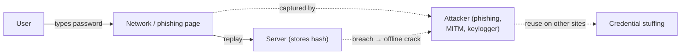

- **Phishing** — a look-alike page captures the secret; the user freely hands it over. OTPs don't fix this: a real-time relay (Evilginx-style) proxies both the password *and* the OTP to the real site.
- **Server-side breach** — even bcrypt/Argon2 hashes ([T05](./T05-password-storage-bcrypt-argon2.md)) can be cracked offline for weak passwords; TOTP seeds are stored in plaintext-equivalent form and are *fully* exposed.
- **Reuse / credential stuffing** — one breach feeds attacks everywhere the user reused the password.

The root cause is structural: *there is a reusable secret, and it has to leave the device.* Fix that and the whole class of attacks evaporates.

### A Real Phishing Attempt, Step by Step (Evilginx-Style Relay)

To feel *why* OTPs don't help, walk through a concrete attack that security teams see weekly. The tooling here (Evilginx, Modlishka, and their many clones) is a **reverse-proxy phishing kit**: it sits between the victim and the real site and transparently forwards every byte, so the victim sees a perfect copy of the real login — real branding, real error messages, even the real OTP prompt — because it *is* the real site, just relayed.

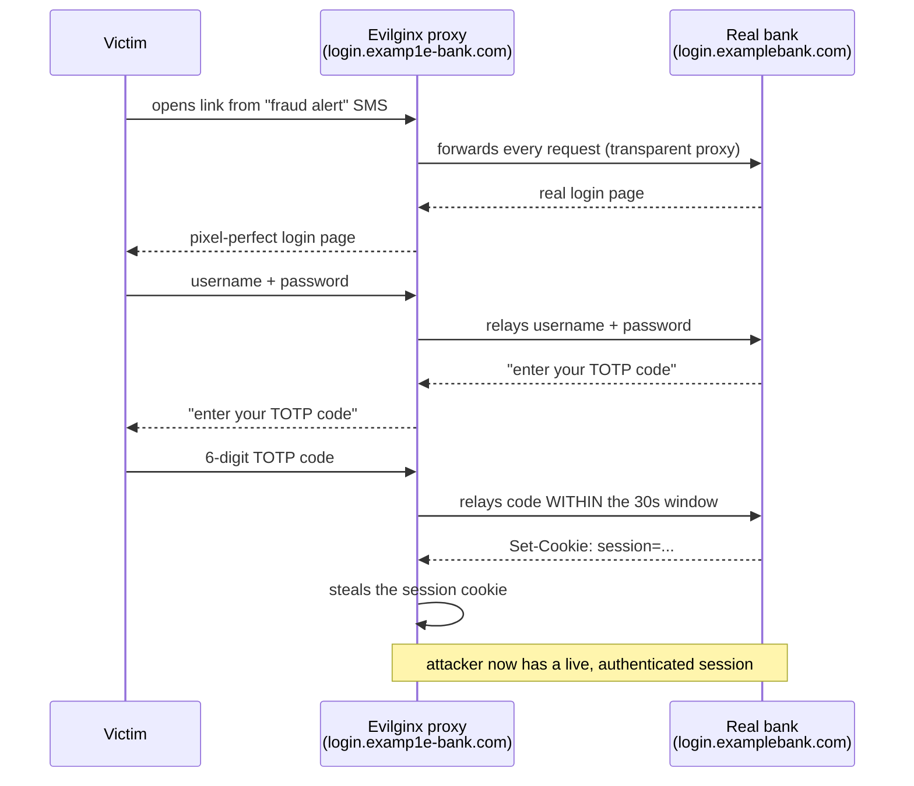

The victim did everything "right": real-looking page, padlock in the address bar (the proxy has a valid TLS cert for its look-alike domain), correct password, correct TOTP code from their authenticator app. The OTP added *zero* protection because it is a context-free handshake — the user cannot tell that they are performing it in front of a relay rather than the real gate. The stolen artifact is the **session cookie**, which is itself a bearer token ([Sessions vs tokens (T02)](./T02-sessions-vs-tokens.md)); once relayed, the attacker rides the authenticated session.

Now replay the *same attack* against a passkey: the genuine credential is scoped to `login.examplebank.com`, so on `login.examp1e-bank.com` the browser offers **nothing** to relay; and even if the attacker somehow coerced a signature, the `origin` baked into the signed bytes reads the look-alike domain and the server rejects it. The relay that defeated password+TOTP has no secret to forward. We make this mechanical in [Why This Cannot Be Phished](#why-this-cannot-be-phished); the point here is that the *exact* attack that beats OTP is structurally dead against a passkey.

> [!WARNING]
> **In Practice — "we have MFA, so we're safe from phishing" is false.** Several high-profile 2022–2024 breaches (Twilio, Cloudflare's *attempted* breach, Reddit, Uber-adjacent incidents) began with exactly this AiTM relay against password+OTP or push. Cloudflare's accounts survived for one reason: a subset of staff used **hardware security keys** (origin-bound WebAuthn), and those logins simply could not be relayed. The lesson the industry took away — and the reason passkeys are now a board-level topic — is that *only origin-bound factors stop real-time relays.*

## The Core Idea: Asymmetric Challenge-Response

WebAuthn replaces the shared secret with an **asymmetric key pair**. The private key is generated on the user's device and *never leaves it*. The server stores only the **public** key. Authentication is a signature over a fresh, server-issued random **challenge** — proving possession of the private key without revealing it, and unreplayable because the challenge is one-time.

```mermaid
sequenceDiagram
  participant S as Server (Relying Party)
  participant D as User's device (holds private key)
  Note over S: registration: device sent PUBLIC key once
  S->>D: challenge = 32 random bytes (one-time)
  D->>D: sign(challenge ‖ context) with PRIVATE key<br/>(inside secure hardware)
  D->>S: signature (+ which credential)
  S->>S: verify(signature, stored PUBLIC key, challenge)
  Note over S: no secret ever transmitted; signature unreplayable
```

This is the same public-key idea as TLS client certificates or SSH keys — but with three additions that make it usable by ordinary people and resistant to phishing: it is built into browsers (**WebAuthn**), the key is bound to **hardware** the user already owns, and every signature is **bound to the origin** of the site requesting it.

Mapping back to the analogy: the "challenge = 32 random bytes" is *the letter the castle wrote this morning* — a fresh, unpredictable message. Pressing your ring into wax over today's letter proves you hold the die *right now*; yesterday's seal is worthless because it sealed yesterday's letter. That freshness is why a captured signature cannot be replayed: it only ever validated against one specific, already-spent challenge.

## FIDO2 Architecture: WebAuthn + CTAP

**FIDO2** is an umbrella for two specs that work together:

- **WebAuthn** (W3C) — the JavaScript/browser API (`navigator.credentials`) a website (the *relying party*) calls.
- **CTAP2** (Client to Authenticator Protocol, FIDO Alliance) — how the browser talks to an external *authenticator* (a USB/NFC/Bluetooth security key, or your phone acting as one over "hybrid"/caBLE).

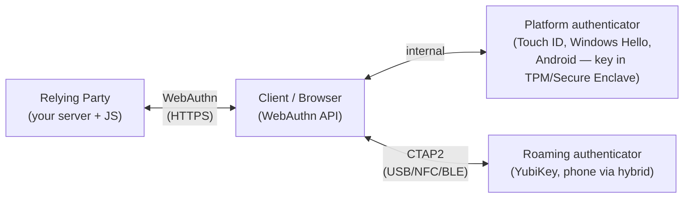

Two authenticator kinds:

- **Platform authenticator** — built into the device (Apple Secure Enclave, Android StrongBox/TEE, Windows Hello + TPM). Unlocked by biometric or device PIN.
- **Roaming (cross-platform) authenticator** — a separate device (YubiKey, or another phone over Bluetooth hybrid transport) you can carry between machines.

In both cases the **private key lives inside a secure element** — a separate hardware security module (Secure Enclave / TPM / TEE / the security key's own chip). The main CPU never sees the private key; it asks the secure element to *sign*, and only the signature comes back. That is the hardware-level reason the key cannot be exfiltrated by malware running on the OS.

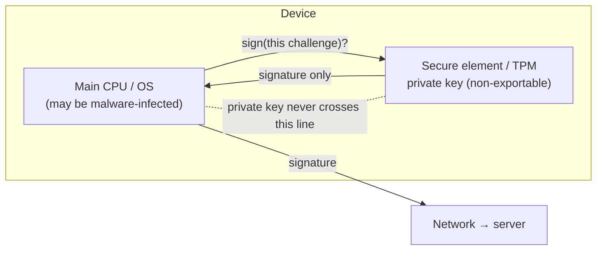

### The Real Ecosystem: What Hardware Are People Actually Using?

Abstractions like "platform authenticator" become concrete the moment you name the products your users already carry. By 2026 the install base is enormous because the platforms ship this by default:

- **Apple** — Touch ID / Face ID back a passkey whose private key sits in the **Secure Enclave**; the credential syncs through **iCloud Keychain** (end-to-end encrypted). Since iOS 16 / macOS Ventura, "Sign in with a passkey" is offered automatically when a site supports it.
- **Google / Android** — fingerprint or screen-lock unlocks a passkey stored in **Android's keystore (StrongBox/TEE)**; it syncs via **Google Password Manager** tied to the Google account. Chrome surfaces passkeys across Android, ChromeOS, and desktop.
- **Microsoft / Windows** — **Windows Hello** (face, fingerprint, or PIN) backs a passkey rooted in the **TPM**; Microsoft now lets consumer accounts go fully passwordless and creates passkeys by default for new accounts.
- **Roaming hardware keys** — **YubiKey** (Yubico), **Google Titan**, **Feitian**, and Solo/Nitrokey are standalone CTAP2 authenticators. The private key never leaves the key's own secure chip; there is no sync, which is exactly the property regulated environments want.
- **Phone-as-authenticator (hybrid / caBLE)** — you can log in on a *laptop you've never set up* by scanning a QR code with your phone. The laptop's browser and your phone do a Bluetooth-proximity handshake (caBLE / "hybrid transport"), the phone's passkey signs, and the result flows back. Bluetooth proximity is deliberate: it proves the phone is physically near the laptop, defeating remote QR-relay tricks.

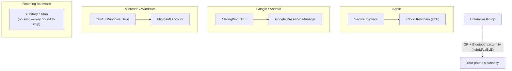

> [!NOTE]
> **In Practice — the "scan the QR with your phone" login is hybrid transport.** When a coworker borrows a kiosk or a fresh VM and sees "Use a passkey from a nearby device," that is caBLE/hybrid. It creates **no** passkey on the borrowed machine (nothing to clean up afterward) — the phone signs and the laptop just relays the assertion. This is the single most underrated UX win of passkeys: secure login on a device you don't trust and won't keep, with no password typed and nothing left behind.

## The Registration Ceremony (Attestation)

Registration creates a new credential: the authenticator generates a key pair scoped to this site, keeps the private key, and returns the public key plus a credential ID. Optionally it includes an **attestation** statement proving what kind of authenticator it is.

```mermaid
sequenceDiagram
  participant JS as Browser JS
  participant S as Server (RP)
  participant Auth as Authenticator (secure element)
  S->>JS: PublicKeyCredentialCreationOptions<br/>{challenge, rp, user, pubKeyCredParams, ...}
  JS->>Auth: navigator.credentials.create({publicKey})
  Auth->>Auth: verify user (biometric/PIN)<br/>generate keypair in secure element
  Auth->>JS: {credentialId, publicKey, attestationObject, clientDataJSON}
  JS->>S: send attestation response
  S->>S: verify challenge, origin, attestation;<br/>store {credentialId, publicKey, signCount, aaguid}
```

The server hands the browser a `PublicKeyCredentialCreationOptions` object. The two security-critical fields are the random `challenge` and the relying-party id (`rp.id`, a domain such as `example.com`):

```java
// Server builds creation options (conceptual; Spring Security / webauthn4j fill the details)
var options = PublicKeyCredentialCreationOptions.builder()
    .challenge(secureRandom32Bytes())          // one-time, stored in session
    .rp(new RpEntity("example.com", "Example")) // credential will be SCOPED to this domain
    .user(new UserEntity(userHandle, "alice", "Alice"))
    .pubKeyCredParams(List.of(ES256, RS256))    // acceptable signature algorithms (COSE)
    .authenticatorSelection(residentKey(REQUIRED), userVerification(REQUIRED))
    .attestation(NONE)                          // NONE for consumer; DIRECT for high-assurance
    .build();
```

### What the Browser Returns: `clientDataJSON` + `authenticatorData`

Two structures travel back, and you must understand their bytes because verification is byte-level.

**`clientDataJSON`** — exactly what the browser saw, as UTF-8 JSON. The `origin` and `challenge` here are the heart of phishing resistance:

```json
{
  "type": "webauthn.create",
  "challenge": "p7p2...base64url(the 32 random bytes)...",
  "origin": "https://example.com",
  "crossOrigin": false
}
```

**`authenticatorData`** — a compact binary structure the authenticator signs over. Its byte layout:

```text
Offset  Len  Field
------  ---  --------------------------------------------------
0       32   rpIdHash      = SHA-256("example.com")
32       1   flags         bit0 UP (user present)
                            bit2 UV (user verified, e.g. biometric)
                            bit3 BE (backup eligible — a syncable passkey)
                            bit4 BS (backup state — currently synced)
                            bit6 AT (attested credential data present)
                            bit7 ED (extension data present)
33       4   signCount     big-endian counter (clone detection)
37     var   attestedCredentialData (registration only):
              aaguid[16] | credIdLen[2] | credentialId | COSE public key
...    var   extensions (optional, CBOR)
```

The server stores, per credential: the **credential ID**, the **COSE public key**, the **sign count**, the **AAGUID** (authenticator model), and the backup flags. The private key is never seen.

### End-to-End Worked Example: Alice Registers a Passkey

Let's make the ceremony tangible — what *Alice the human* sees, alongside *what bytes move*. Alice has an account at `shop.example.com` (she still has a password from last year) and the app is now offering passkeys.

1. **What Alice sees.** Logged in via her old password, she lands on Security settings and clicks **"Set up a passkey for faster, safer sign-in."** A browser sheet slides up: *"Save a passkey for shop.example.com?"* with a Touch ID prompt. She rests her finger on the sensor. Done — the whole thing took under three seconds, she never typed anything, and the page now shows "Passkey added — MacBook (Touch ID)."
2. **What bytes moved (request).** The server generated 32 random bytes as `challenge`, stored them in Alice's session, and sent `PublicKeyCredentialCreationOptions` with `rp.id = "example.com"`, `user.id = <Alice's opaque userHandle>`, `pubKeyCredParams = [ES256]`, `authenticatorSelection = { residentKey: required, userVerification: required }`, `attestation = none`.
3. **What the secure element did.** On the fingerprint match (which *unlocks* but is never sent anywhere), the Secure Enclave generated a brand-new P-256 key pair *scoped to `example.com`*. The private key stayed inside the Enclave. It assembled `authenticatorData` (rpIdHash = SHA-256("example.com"), flags with UP=1 UV=1 BE=1 BS=1 AT=1, signCount, and the attested credential data containing the new credential ID and the **public** key in COSE form).
4. **What bytes moved (response).** The browser sent back `{ credentialId, attestationObject (CBOR: authData + "none" attestation), clientDataJSON }`. The `clientDataJSON` read `{"type":"webauthn.create","challenge":"<the 32 bytes, base64url>","origin":"https://shop.example.com","crossOrigin":false}`.
5. **What the server verified and stored.** It checked the returned `challenge` equals what it issued, `origin` is the expected `https://shop.example.com`, `rpIdHash == SHA-256("example.com")`, and (since attestation is `none`) it skipped manufacturer verification. It then persisted one row: `{ user_handle, credential_id, public_key (COSE), sign_count, aaguid, transports=[internal,hybrid], backup_eligible=true, backup_state=true }`. **No secret about Alice was stored** — only a public key. A breach of this table leaks nothing usable for login.

The decisive subtlety: Alice's *fingerprint* unlocked the Enclave locally; it was never transmitted and the server has no idea what her finger looks like. The only thing that crossed the network is a public key and a one-time-verified attestation — there is nothing here for a future attacker to steal.

> [!NOTE]
> **In Practice — biometrics stay on the device.** A frequent stakeholder fear is "are we now storing customers' fingerprints/faces?" No. The biometric is a *local unlock gesture* for the secure element, exactly like the PIN on a chip-and-PIN card unlocks the card locally. Your server never sees, stores, or transmits biometric data. This is often the single sentence that unblocks a passkey rollout in a privacy review.

## The Authentication Ceremony (Assertion)

Login reuses the stored public key. The server issues a fresh challenge; the authenticator signs; the server verifies.

```mermaid
sequenceDiagram
  participant JS as Browser JS
  participant S as Server (RP)
  participant Auth as Authenticator
  S->>JS: PublicKeyCredentialRequestOptions {challenge, rpId, allowCredentials?}
  JS->>Auth: navigator.credentials.get({publicKey})
  Auth->>Auth: verify user; signCount++<br/>sign(authenticatorData ‖ SHA256(clientDataJSON))
  Auth->>JS: {credentialId, authenticatorData, signature, userHandle}
  JS->>S: send assertion
  S->>S: lookup public key by credentialId; verify signature;<br/>check challenge, origin, rpIdHash, UP/UV, signCount
```

The exact message the private key signs is the concatenation of the raw `authenticatorData` and the SHA-256 of `clientDataJSON`:

```text
signedBytes = authenticatorData ‖ SHA-256(clientDataJSON)
signature   = ECDSA_or_RSA_sign(privateKey, signedBytes)
```

Server-side verification (every step is mandatory — skipping any one reopens an attack):

1. Look up the stored public key by `credentialId`.
2. Parse `clientDataJSON`: `type == "webauthn.get"`, `challenge` equals the one issued (one-time), **`origin` equals your expected origin**.
3. `authenticatorData.rpIdHash == SHA-256(yourRpId)`.
4. Flags: `UP` set; `UV` set if you required user verification.
5. Verify `signature` over `authenticatorData ‖ SHA-256(clientDataJSON)` with the stored public key.
6. `signCount` strictly greater than the stored value (when non-zero) — else suspect a clone.

### End-to-End Worked Example: Alice Logs In (Usernameless)

The next morning Alice opens `shop.example.com` on the same MacBook. Here is the human view stitched to the byte view, and notice she never types a username.

1. **What Alice sees.** The login page shows a single **"Sign in"** button (no username field needed). She clicks it; a browser sheet says *"Sign in to shop.example.com as Alice?"* with Touch ID. She touches the sensor. She's in. Two seconds, zero typing.
2. **What bytes moved (request).** The server made a *fresh* 32-byte `challenge`, stored it in the pre-login session, and sent `PublicKeyCredentialRequestOptions { challenge, rpId: "example.com", userVerification: "required" }` with **no `allowCredentials`** (because the passkey is discoverable, the platform already knows which credential matches this site and user).
3. **What the secure element did.** The browser called `navigator.credentials.get`. The Enclave found the credential scoped to `example.com`, Alice's fingerprint unlocked it, it incremented `signCount`, built fresh `authenticatorData` (UP=1, UV=1), and signed `authenticatorData ‖ SHA-256(clientDataJSON)` with the private key — inside the Enclave.
4. **What bytes moved (response).** `{ credentialId, authenticatorData, signature, userHandle }`. The `clientDataJSON` read `{"type":"webauthn.get","challenge":"<this morning's 32 bytes>","origin":"https://shop.example.com","crossOrigin":false}`.
5. **What the server verified.** It used `userHandle` → Alice's account, looked up the stored public key by `credentialId`, confirmed `type=="webauthn.get"`, the `challenge` matched the one just issued (then invalidated it so it can never be reused), `origin == "https://shop.example.com"`, `rpIdHash == SHA-256("example.com")`, UP and UV set, the signature verified against the stored public key, and `signCount` advanced. All pass → it minted Alice's authenticated session.

Compare this login to the Evilginx walkthrough above. There is **no shared secret in flight** — the only thing the network carried is a signature over a one-time challenge with `origin` welded into the signed bytes. Capture the whole exchange off the wire and you can do nothing with it: the challenge is spent, and the signature validates only for `shop.example.com`.

## Why This Cannot Be Phished

The phishing resistance is *not* a heuristic — it is enforced by two mechanical facts working together.

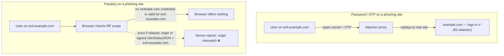

1. **Scope binding (browser side).** A credential is registered to an `rp.id` (e.g. `example.com`). The browser will only use it when the page's origin is that domain or a subdomain. On `evil-example.com` the genuine credential is simply *not offered* — there is nothing for the user to hand over.
2. **Origin binding (server side).** Even if an attacker could coax a signature, the `origin` is captured in `clientDataJSON` and **included in the signed bytes**. A relayed assertion carries `origin: "https://evil-example.com"`, and the server's origin check (step 2 above) rejects it. There is no shared secret to steal and no signature that validates for the wrong site.

> [!IMPORTANT]
> This is the whole game. Passwords, TOTP, SMS, and push all fail because a human can be tricked into relaying a secret to the wrong place. WebAuthn removes the human's ability to make that mistake: the credential is cryptographically bound to the real origin, and the binding is enforced by the browser and re-checked by the server.

This is precisely the enchanted-ring property from the opening: the ring won't press a letter unless the envelope is addressed to the real castle, and the seal it makes carries that address baked in. The con artist's fake castle gets an empty hand (the browser offers nothing) and, even if it forged the request, a seal stamped "evil-example.com" that the real gatekeeper throws out.

## Passkeys: Discoverable + (Often) Synced Credentials

"**Passkey**" is the consumer-facing name for a WebAuthn credential that is **discoverable** (a.k.a. *resident key*) — the authenticator stores enough state to identify the user, so login needs **no username** ("usernameless"). Most platform passkeys are additionally **synced** across the user's devices by the OS provider (iCloud Keychain, Google Password Manager, Windows/Microsoft account).

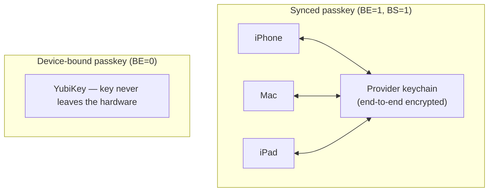

| Property | Synced passkey | Device-bound passkey (e.g. security key) |
|---|---|---|
| Lives on | Provider's E2E-encrypted keychain | A single hardware authenticator |
| Lost-device recovery | Restores from cloud (high usability) | Gone — must pre-register a backup key |
| Trust model | Trust the sync provider's account security | No third party; strongest assurance |
| `BE`/`BS` flags | 1 / 1 | 0 / 0 |
| Best for | Consumers, broad rollout | High-assurance / enterprise / regulated |

The trade-off is **recoverability vs. escrow**: synced passkeys solve the "I lost my phone" problem that doomed earlier hardware-only schemes, at the cost of trusting the provider's account recovery. For most consumer apps that trade is worth it; for high-assurance use you require device-bound keys (and read the `BE` flag to enforce it).

### "I Lost My Phone": The Recovery Flow That Actually Works

The number-one historical objection to hardware authentication was "what happens when I lose the device?" Synced passkeys answer it. Here is the real flow for a consumer who drops their iPhone in a lake:

```mermaid
sequenceDiagram
  participant Alice as Alice
  participant New as New iPhone
  participant iCloud as iCloud Keychain (E2E)
  participant Shop as shop.example.com
  Alice->>New: sign in to Apple ID (+ device passcode / trusted-device 2FA)
  New->>iCloud: request keychain restore
  iCloud-->>New: re-provision E2E-encrypted passkeys
  Note over New,iCloud: private keys decrypt ONLY inside the new Secure Enclave
  Alice->>Shop: click "Sign in"
  Shop-->>Alice: passkey prompt — works immediately
  Note over Alice,Shop: shop.example.com did NOTHING; recovery was at the OS layer
```

What makes this safe rather than a backdoor: the passkeys are end-to-end encrypted in iCloud Keychain, and they only decrypt inside a Secure Enclave that Alice unlocked by proving control of her Apple ID (which itself is gated by device passcode and trusted-device prompts). The relying party (`shop.example.com`) is *not involved in recovery at all* — Alice just shows up with a working passkey again. This is the magic that earlier "register a YubiKey" schemes lacked: lose the one key and you were locked out; lose your phone and a synced passkey simply reappears on the replacement.

The flip side — and the senior-engineer caveat — is that you have now **delegated recovery to the sync provider's account security**. If Alice's Apple/Google/Microsoft account is itself compromised, her synced passkeys travel with it. That is usually a *better* posture than your own emailed-magic-link recovery (the providers invest enormously in account security and themselves use phishing-resistant factors), but it is a real trust dependency you should name in a threat model.

> [!IMPORTANT]
> **In Practice — design recovery as a first-class feature, not an afterthought.** For a consumer app, lean on synced passkeys so the OS provider handles "lost device" for you, and additionally let users register **multiple** passkeys (phone + laptop + a YubiKey in a drawer) so losing one provider account isn't fatal. For an app that *cannot* rely on synced passkeys (device-bound only), you **must** force registration of a backup authenticator at enrollment — "one is none." See the recovery design later in [Common Pitfalls](#common-pitfalls) and in the Practice section.

## Use-Case Decision Guide: Consumer vs Enterprise vs Hybrid

There is no single "right" passkey configuration — the correct knobs depend on who you are protecting and against what. Three archetypes cover most real deployments.

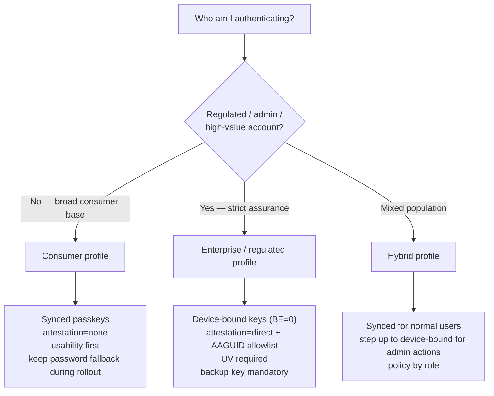

**Consumer profile (usability-first).** A large e-commerce site or retail bank rolling out to millions of non-technical users. Optimize for completion rate: allow **synced passkeys**, request `attestation: none`, require user verification (so it counts as MFA-grade), and accept whatever authenticator the user has. The goal is to get the *median* user off passwords; do not gate on hardware brands. Keep a password fallback *temporarily* (see sunset plan below).

**Enterprise / regulated profile (assurance-first).** Admins, finance operators, healthcare, government, anyone under PCI-DSS / NIST 800-63 AAL3 / FIDO certification mandates. Require **device-bound** authenticators (read `BE=0`), turn on **`attestation: direct`** and verify the **AAGUID against an allowlist** of approved models (e.g. only FIPS-validated YubiKeys), require UV, and *mandate a registered backup key* at enrollment. Here you are deliberately trading usability for non-repudiation and no-third-party-escrow.

**Hybrid profile.** One product serving both populations — e.g. a SaaS where end users are consumers but tenant admins hold the keys to the kingdom. Use synced passkeys for everyday login, and **step up** to a device-bound key check (or a fresh high-assurance assertion) before privileged actions: changing billing, exporting all data, managing other users. Encode the policy by role, not globally.

| Dimension | Consumer | Enterprise / regulated | Hybrid |
|---|---|---|---|
| Passkey type | Synced (BE=1) allowed | Device-bound (BE=0) required | Synced default, device-bound for admin |
| Attestation | `none` | `direct` + AAGUID allowlist | `none` for users, `direct` for admins |
| User verification | Required (MFA-grade) | Required | Required |
| Recovery | Lean on OS provider sync | Mandatory backup hardware key | Mixed by role |
| Password fallback | Temporary, with sunset plan | Often none from day one | Per-role |
| Primary goal | Adoption / completion rate | Non-repudiation, no escrow | Right-sized assurance per action |

> [!INTERVIEW]
> Expect: *"A bank asks you to roll out passkeys to retail customers AND to its internal wire-transfer operators. Same config?"* No — and saying so is the point. Retail: **synced** passkeys, `attestation:none`, usability-first, temporary password fallback. Operators: **device-bound** keys, `attestation:direct` with an AAGUID allowlist, mandatory backup key, *no* password fallback, plus **step-up** before each transfer using `amr`/`acr`. The interviewer is checking whether you can read the threat model from the population rather than applying one recipe everywhere.

## Real Rollout Stories

Patterns generalize better when you've seen them play out. These are representative of how real organizations have shipped passkeys.

### A Consumer App Rolls Out Passkeys Alongside Passwords, Then Retires the Password

A large e-commerce/bank-style consumer app almost never flips from passwords to passkeys overnight — it runs a staged migration:

1. **Offer (opt-in).** After a successful password login, prompt: *"Make sign-in faster and safer — add a passkey?"* One Touch ID / fingerprint tap registers it. Crucially, the password still works; the passkey is purely additive. Adoption is measured, not forced.
2. **Auto-upgrade at login.** For users who logged in with a password on a passkey-capable device, *silently* offer to create one ("conditional UI" / autofill can even surface existing passkeys in the username field). This is where the bulk of adoption happens.
3. **Prefer passkey.** Once a user has a passkey, default the login screen to it (the "Sign in" button triggers passkey first; "use password instead" is a smaller link). New-account signup offers passkey *first*.
4. **Down-rank then gate the password.** As passkey coverage crosses a threshold (say 70–80% of MAU), start requiring step-up for risky actions when only a password was used, then disable password creation for new accounts.
5. **Sunset.** Email the long-tail password-only users, walk them through adding a passkey (or a fallback like email-link *enrollment*, not login), and finally **remove password login**. The account still has recovery paths, but the *phishable front door is gone*.

The throughline: passkeys ship **alongside** passwords for usability and to de-risk the migration, but the project is not "done" until the password is *retired*, because a phishable side door negates the phishing-resistant front door.

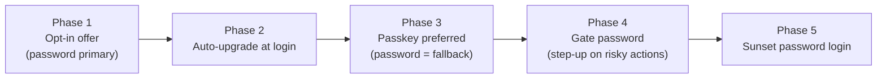

### An Enterprise Deploys Device-Bound YubiKeys for Admins (Phishing-Resistant MFA Mandate)

A company that has been burned by an AiTM phishing incident (or is required by a customer/insurer/regulator) issues a **phishing-resistant MFA mandate** for privileged staff:

- Every admin and engineer with production access is issued **two** FIDO2 hardware keys (one to carry, one stored as the mandated backup — "one is none").
- The IdP is configured to require `attestation: direct`, verify the **AAGUID** against the allowlist of the exact YubiKey models procured, require **UV**, and reject synced credentials (`BE` must be 0) for these roles.
- SSO is enforced so the keys gate *everything* (admin console, VPN, cloud provider, code-signing), and legacy app passwords / IMAP-style bypasses are killed because they would be a phishable side door.
- Onboarding registers both keys before access is granted; offboarding revokes the credential rows.

The result is the Cloudflare lesson operationalized: even a perfect AiTM relay against these admins fails, because there is no relayable secret and the origin check rejects look-alike domains. Synced passkeys are deliberately *excluded* here — the org does not want admin credentials escrowed in any employee's personal Apple/Google account.

### A Synced-Passkey Provider Restores "I Lost My Phone"

Walked through above in the recovery flow: a consumer who loses their phone signs into a new device with their Apple/Google/Microsoft account, the E2E-encrypted keychain re-provisions their passkeys into the new secure element, and `shop.example.com` works again with **zero** help-desk interaction and **no** weaker fallback factor introduced. This is the single biggest reason consumer passkey rollouts succeed where 2010s-era hardware-key projects stalled.

### A Real Phishing Attempt Defeated

The Evilginx walkthrough above *is* the defeated-attack story: a relay that cleanly harvests password + TOTP and steals the session cookie gets **nothing** against a passkey, because the credential is never offered on the look-alike domain and any forced signature carries the wrong `origin`. When you present passkeys to leadership, this side-by-side — "same attacker, same victim, same kit: succeeds against MFA, fails against passkey" — is the most persuasive slide you have.

## Attestation: Proving What the Authenticator Is

During registration the authenticator can include an **attestation statement** — a signature (often chaining to a manufacturer certificate) that proves the credential was generated by a genuine authenticator of a particular model (identified by its **AAGUID**). Formats include `packed`, `tpm`, `android-key`, `apple`, `fido-u2f`, and `none`.

- **Consumer apps:** request `attestation: none`. You don't care which brand of secure hardware Alice used, and demanding attestation hurts privacy (it can correlate users) and breaks some authenticators.
- **Enterprise / regulated:** request `direct` (or *enterprise attestation*) and verify the AAGUID against an allowlist of approved models — e.g. "only FIPS-certified YubiKeys."

> [!NOTE]
> Attestation answers *"what kind of authenticator made this key,"* not *"who is the user."* Most deployments safely ignore it. Turning it on is a deliberate, high-assurance choice with a privacy cost.

In the analogy, attestation is the *hallmark stamped on the ring's metal* certifying which royal foundry cast it. A consumer castle does not care which foundry made your ring — only that the seal matches. A military fortress demands the hallmark and checks it against a list of approved foundries before it will even register your ring.

## Server Data Model & Spring Integration

What the relying party persists per credential:

| Column | Purpose |
|---|---|
| `user_handle` | Opaque, stable per-user id (not the email — privacy) |
| `credential_id` | Looked up at assertion time (the `allowCredentials` / discovered id) |
| `public_key` | COSE-encoded public key used to verify signatures |
| `sign_count` | Last seen counter; clone detection |
| `aaguid` | Authenticator model (for attestation / policy) |
| `transports`, `backup_eligible`, `backup_state` | UX hints and policy (device-bound vs synced) |

Spring Security has first-class passkey support (the `webAuthn` DSL, backed by the **webauthn4j** library); you implement repositories for users and credentials and the framework drives both ceremonies:

```java
@Bean
SecurityFilterChain security(HttpSecurity http) throws Exception {
    http
        .formLogin(withDefaults())            // password fallback during rollout
        .webAuthn(webAuthn -> webAuthn
            .rpName("Example")
            .rpId("example.com")              // MUST match your registrable domain
            .allowedOrigins("https://example.com"));
    return http.build();
}

// You provide where users & their public-key credentials are stored:
// PublicKeyCredentialUserEntityRepository  +  UserCredentialRepository
```

The framework generates the creation/request options (with a fresh server-side challenge), exposes the registration/login endpoints, and performs the byte-level verification above so you don't hand-roll the COSE/CBOR parsing — but you must still configure `rpId` and `allowedOrigins` correctly, because *those* are what make the origin check meaningful.

> [!TIP]
> **In Practice — the policy you can't express in the DSL, you express on the stored row.** "Admins must use device-bound keys" isn't a `webAuthn(...)` setting — it's logic you run *after* a successful assertion: read the `backup_eligible` (`BE`) and `aaguid` columns you persisted, and reject (or step-up) if an admin's credential is synced or its AAGUID is off the allowlist. Keep those columns even in a consumer app; the day you add an admin tier or a compliance requirement, the data you need is already there rather than requiring re-enrollment.

## How It Composes With OAuth 2.1 / OIDC

WebAuthn is the **authentication** at the identity provider; OAuth/OIDC ([T03](./T03-oauth2-and-openid-connect.md)) is the **token issuance and federation** that happens *after*. They are layers, not competitors.

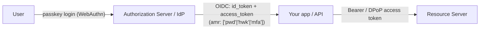

- The user authenticates to the IdP **with a passkey** instead of a password.
- The IdP then runs the **Authorization Code + PKCE** flow from T03 and mints the ID/access tokens.
- The ID token's `amr` (authentication methods references) and `acr` claims can record *how* the user authenticated (e.g. `hwk` = hardware key), letting your API enforce **step-up authentication** — require a fresh passkey assertion before a high-value action even if a session already exists.

OAuth 2.1's relevant posture (full detail in T03): PKCE mandatory, implicit and ROPC flows removed, no bearer tokens in URLs. None of that authenticates the *human* — that is exactly the gap passkeys fill at the front door.

> [!IMPORTANT]
> **In Practice — step-up before money movement.** A real fintech pattern: a customer has a valid session (they logged in with a passkey an hour ago), and now they initiate a large transfer. The session token's `amr`/`acr` says *how* and *when* they authenticated. The money-movement endpoint checks "was a phishing-resistant factor used *recently enough*?" and, if not, triggers a **fresh passkey assertion** (a new challenge, signed now) before committing. This is how you get the convenience of a long session for browsing plus the assurance of a hardware-backed signature exactly at the dangerous moment — without ever falling back to a phishable factor.

## Where TOTP Still Fits (and Its Limits)

Until passkeys are universal, **TOTP** (RFC 6238) remains the common second factor, so know its mechanism. A shared secret seed `K` and the current time produce a 6-digit code:

```text
T    = floor((unixTime - T0) / 30)          # 30-second time step
code = Truncate( HMAC-SHA1(K, T) ) mod 10^6 # dynamic-offset 31-bit truncation
```

Both sides compute the same code from the same seed and clock (±1 step for drift). It needs no network at verification time — which is its charm — but it is **not phishing-resistant** (the code can be relayed in real time) and the **seed is stored server-side**, so a breach exposes it. Treat TOTP as a transitional MFA, not an endpoint. SMS OTP is weaker still (SIM-swap, SS7 interception) and should be avoided where assurance matters.

> [!NOTE]
> **In Practice — TOTP is a perfectly good *bridge*, just never the destination.** A pragmatic rollout often keeps TOTP available for users on devices that can't yet do passkeys (older Android, locked-down corporate machines), while steering everyone capable toward passkeys. The trap is treating "we shipped TOTP MFA" as the finish line. Frame it explicitly as transitional, with a date to revisit, so it doesn't quietly become permanent — the same way the password fallback must have a sunset plan.

## Common Pitfalls

> [!WARNING]
> **Account recovery is the new password.** If "lost my passkey" falls back to an emailed magic link or SMS code, attackers phish *that* instead. Recovery must be as strong as the primary factor (a second registered passkey / hardware key), or it becomes the weakest link.

> [!WARNING]
> **Leaving a password fallback enabled forever.** A phishing-resistant front door with a phishable side door is only as strong as the side door. Plan to *retire* password login after passkey adoption, not run both indefinitely.

> [!WARNING]
> **Not verifying `origin` and `challenge` server-side.** These two checks *are* the phishing resistance. A library that parses the signature but skips origin/challenge verification is dangerously broken.

> [!WARNING]
> **Wrong `rpId`.** Set it to your registrable domain (`example.com`), not a single host (`app.example.com`) you might move, and never a domain you don't control. A mismatched `rpId` either breaks login or, worse, scopes credentials too broadly.

> [!WARNING]
> **Enforcing `signCount` on synced passkeys.** Synced/passkey authenticators often report `signCount = 0` always (no per-use counter). Treat 0 as "counter unsupported" — don't lock the user out. Only enforce strictly-increasing counts when the value is non-zero.

> [!WARNING]
> **Demanding attestation for consumer flows.** It harms privacy, can break legitimate authenticators, and you rarely need it. Use `attestation: none` unless you have a concrete high-assurance requirement.

### A Concrete Recovery Design That Doesn't Reintroduce a Phishable Factor

Because "recovery is the new password" is the pitfall that sinks otherwise-sound rollouts, here is a worked design you can adapt. The rule that drives every choice: **no step in the recovery path may be a context-free secret a user can be tricked into relaying.**

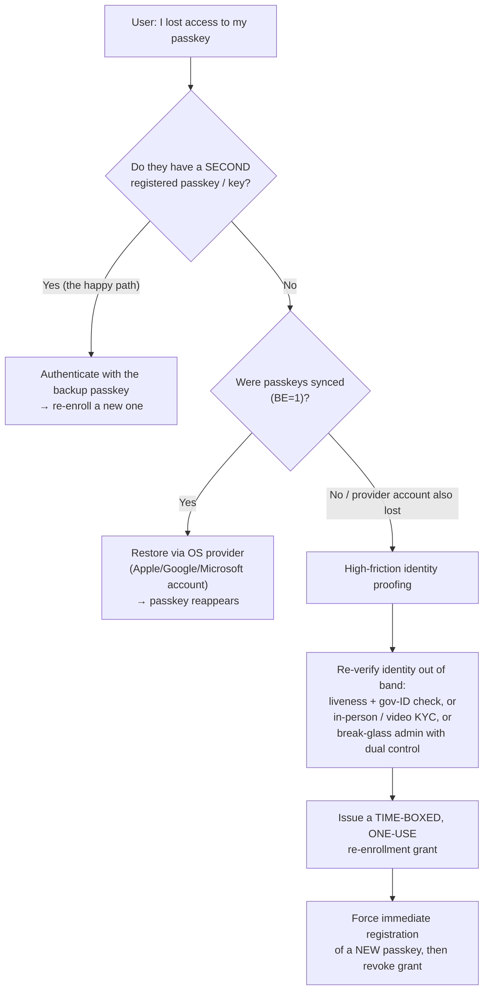

Design principles, in priority order:

1. **Prefer a second registered authenticator.** The cleanest recovery is *no special recovery*: require users to register at least two passkeys (or a passkey + a hardware key in a drawer) up front. Losing one means authenticating with the other and re-enrolling — still 100% phishing-resistant.
2. **Lean on provider sync for consumers.** If passkeys are synced (`BE=1`), "lost device" is solved by the OS provider's own (phishing-resistant) account recovery, and your app does nothing.
3. **If you must have a last-resort path, make it high-friction identity proofing, not a code.** Acceptable: liveness + government-ID verification, in-person/video KYC, or a **break-glass** admin override under **dual control** (two operators, audited). *Not* acceptable: an emailed magic link, an SMS code, or "answer your security questions" — each is a phishable side door that throws away everything the passkey bought you.
4. **Whatever the last-resort path produces, it is a one-use, short-lived, audited grant to *re-enroll a new passkey*** — never a standing alternative login. The moment a new passkey is registered, revoke the grant. This keeps the account passwordless on the other side of recovery.

The test for any recovery design: *if an attacker fully controls the user's email and phone number, can they still take over the account?* For a magic-link/SMS fallback the answer is yes — which is exactly why it fails. For the design above, controlling email and phone gets the attacker nothing, because the path requires either a second cryptographic credential or strong out-of-band identity proofing.

> [!INTERVIEW]
> A staff favorite: *"Why is a passkey phishing-resistant when an authenticator-app OTP is not?"* The answer must hit both halves: (1) the credential is **scoped to an origin**, so the browser won't even surface it on a look-alike domain; and (2) the **origin is inside the bytes the private key signs**, so a relayed assertion fails the server's origin check — whereas a TOTP code is a context-free secret a user can be tricked into relaying in real time. Strong follow-up: *"Where does the private key live, and how does that survive OS malware?"* → in the secure element/TPM; the OS can only request a signature, never read the key. And: *"How does this relate to OAuth?"* → WebAuthn authenticates the user at the IdP; OIDC then issues tokens — different layers.

## Practice

1. **Trace the bytes.** For one passkey login, write out what `clientDataJSON` contains and the exact byte sequence the private key signs (`authenticatorData ‖ SHA-256(clientDataJSON)`). Mark which field gives phishing resistance and why.
2. **Build it.** Add Spring Security's `webAuthn` DSL to a demo app; register a passkey with your laptop's platform authenticator and log in usernameless. Confirm via the browser dev tools that no secret is sent on login.
3. **Break a relay.** Explain step by step what happens if an attacker proxies your WebAuthn login through `evil-example.com`: which check fails first (browser scope) and which fails second (server origin), and why a password+TOTP setup would *not* stop the same relay.
4. **Recovery design.** Design an account-recovery flow for a passkey-only app that does **not** reintroduce a phishable factor. Justify each step.
5. **Synced vs bound.** Inspect the `BE`/`BS` flags from a synced platform passkey vs a YubiKey. Write the policy logic that would *require* device-bound keys for an admin role.
6. **Step-up.** Using the `amr`/`acr` claims from [T03](./T03-oauth2-and-openid-connect.md), sketch how you'd force a fresh passkey assertion before a money-movement endpoint even when a valid session exists.
7. **TOTP mechanism.** Implement TOTP verification (HMAC-SHA1 over the 30-second step) and then list, concretely, the two reasons it is weaker than a passkey.
8. **Map the analogy.** For each of password, SMS OTP, TOTP, and passkey, write one sentence mapping it to the "secret handshake vs signet ring" picture, then state which property of the signet ring each weaker factor lacks (non-exportable die? freshness of the letter? address-bound stamp?).
9. **Stage a rollout.** For a consumer app with 5M monthly users currently on password + optional TOTP, write the five-phase plan to introduce passkeys alongside passwords and *retire* the password. For each phase, state the success metric that lets you advance to the next.
10. **Two profiles, one product.** You run a SaaS where end users are consumers but tenant admins control billing and data export. Specify the passkey policy for each role: synced vs device-bound, attestation, recovery, password fallback, and which admin actions trigger step-up. Justify each difference from the threat model.
11. **Defeat the Evilginx kit.** Given the Evilginx relay sequence in this topic, annotate precisely where a passkey login diverges from the password+TOTP login such that the attacker ends up with nothing — and identify the one artifact (the session cookie) the OTP attack stole that the passkey attack cannot reach.

## Recap

You should now be able to:

- Place authentication methods on the **phishing-resistance ladder** and explain why everything below WebAuthn shares a reusable, transmittable secret.
- Use the **secret-handshake vs signet-ring** model to explain, without bytes, why passwords/OTPs are copyable and origin-bound passkeys are not.
- Describe the **asymmetric challenge-response** core: private key never leaves the device, server stores only the public key, each login is a signature over a one-time challenge.
- Decompose **FIDO2** into WebAuthn (browser API) + CTAP2 (authenticator protocol), and distinguish platform vs roaming authenticators.
- Name the **real ecosystem** — Touch ID/Face ID + iCloud Keychain, Android keystore + Google Password Manager, Windows Hello + TPM, YubiKey/Titan roaming keys, and phone-as-authenticator via hybrid/caBLE.
- Walk both ceremonies — **registration/attestation** and **authentication/assertion** — including the `clientDataJSON` and `authenticatorData` byte layouts and the exact `authenticatorData ‖ SHA-256(clientDataJSON)` signed message.
- Narrate an **end-to-end register and login** (what the user sees and what bytes move) and explain why a captured exchange is useless to an attacker.
- Explain how a real **Evilginx-style relay** beats password+TOTP and steals the session cookie, and why the identical attack yields nothing against a passkey.
- Explain **why a passkey cannot be phished** via the two mechanisms: browser-side RP scope binding and server-side origin verification of signed bytes.
- Explain **where the private key physically lives** (secure element/TPM/TEE) and why OS-level malware still cannot exfiltrate it.
- Distinguish **synced vs device-bound passkeys** (the `BE`/`BS` flags) and the recoverability-vs-escrow trade-off; decide when to require attestation.
- Choose the right **profile** — consumer (synced, usability-first), enterprise/regulated (device-bound, attestation, mandatory backup), or hybrid (step-up by role).
- Stage a **rollout alongside passwords** and design a **sunset plan**, plus a **recovery flow** (and a last-resort identity-proofing path) that never reintroduces a phishable factor.
- Wire WebAuthn into **Spring Security** and explain how it **composes with OAuth 2.1/OIDC** (authentication at the IdP → token issuance → step-up via `amr`/`acr`).
- Recall the pitfalls: weak recovery, lingering password fallback, skipped origin/challenge checks, wrong `rpId`, mis-enforced `signCount`, and needless attestation.

## Next

The final genuinely-new Phase 3 topic is **container security** — distroless and Wolfi base images, image signing with Sigstore/cosign, and runtime hardening (non-root, read-only filesystem, dropped capabilities) — which operationalizes the least-privilege and minimal-attack-surface defenses that contained the RCEs in [JVM-specific CVEs (T17)](./T17-jvm-specific-cves-log4shell-spring4shell.md). See also [Secrets management (T12)](./T12-secrets-management.md) for protecting the keys and tokens these flows rely on, and [Security architecture & zero trust (T16)](./T16-security-architecture-and-zero-trust-intro.md) for where strong workload and user identity meet.
