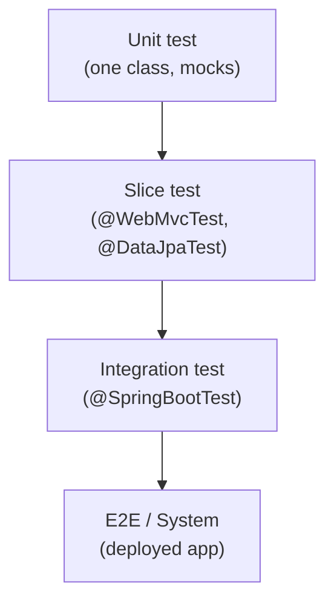

# Integration testing

An *integration test* exercises multiple components together — typically a controller plus its service plus its repository plus a real database — to verify that wired-up behavior is correct. Where a unit test isolates one class (mocking everything else), an integration test trades speed for honesty: it catches the bugs that hide in the seams between layers (wrong column names, wrong SQL dialect, wrong Spring bean wiring, wrong JSON serialization). A mature backend has both — unit tests for logic, integration tests for wiring — and senior engineers know which to write when.

This topic covers Spring's integration test machinery (`@SpringBootTest`, `MockMvc`, `WebTestClient`, `TestRestTemplate`), transactional rollback, the H2/Testcontainers trade-off, and the senior decisions about scope: full app vs slice, in-memory vs real DB, mocked third parties vs WireMock.

> [!NOTE]
> Prerequisites: basic JUnit 5 and Spring Boot familiarity. For DB integration with real Postgres/MySQL, see [Testcontainers (L4/C09/T03)](./T03-testcontainers.md).

## What "Integration" Means — Definitions Vary

The term is overloaded. Three common definitions:

1. **Narrow** (Martin Fowler's "Subcutaneous test"): exercises everything in your process but stubs the network boundary.
2. **Broad** (commonly meant in Java/Spring): wires up multiple internal classes — controller + service + repository — and tests their interaction.
3. **System / End-to-End**: hits a deployed service over HTTP; may include multiple services.

For most Java teams, "integration test" = #2 with definitions blurring into #1 (Testcontainers running a real Postgres locally).



## The Test Pyramid Reminder

Mike Cohn (2009):
- **Many** unit tests (fast, focused).
- **Some** integration tests (slower, more honest).
- **Few** E2E tests (slowest, most brittle).

The pyramid is contested (the "test trophy" by Kent C. Dodds argues for more integration), but the rough proportions hold: integration tests should not dominate your suite.

## `@SpringBootTest` — Full Context

The heavy-hammer annotation. Boots the entire Spring context.

```java
@SpringBootTest
@AutoConfigureMockMvc
class CheckoutFlowTest {

    @Autowired MockMvc mockMvc;
    @Autowired OrderRepository orderRepo;

    @Test
    void completeCheckoutPersistsOrder() throws Exception {
        mockMvc.perform(post("/api/checkout")
                .contentType(MediaType.APPLICATION_JSON)
                .content("""
                    {
                      "items": [{"sku": "ABC-123", "qty": 1}],
                      "userId": "user-42"
                    }
                    """))
            .andExpect(status().isOk())
            .andExpect(jsonPath("$.receiptId").exists())
            .andExpect(jsonPath("$.total").value(49.99));

        assertThat(orderRepo.findByUserId("user-42")).hasSize(1);
    }
}
```

The test boots Spring, exercises the HTTP controller, runs business logic through service, persists via JPA, and asserts on the DB. End-to-end through your app — but in-process (no real HTTP socket).

## `webEnvironment` Modes

`@SpringBootTest` accepts a `webEnvironment` argument:

| Mode | Behavior |
|------|----------|
| `MOCK` (default) | No HTTP server. Use `MockMvc`. Fastest. |
| `RANDOM_PORT` | Real HTTP server on a random port. Use `TestRestTemplate`/`WebTestClient`. |
| `DEFINED_PORT` | Real HTTP server on configured port. |
| `NONE` | Non-web context. |

For controller logic: `MOCK` + `MockMvc`. For real socket behavior (filters, gzip, async): `RANDOM_PORT`.

```java
@SpringBootTest(webEnvironment = WebEnvironment.RANDOM_PORT)
class CheckoutFlowRealHttpTest {

    @LocalServerPort int port;
    @Autowired TestRestTemplate restTemplate;

    @Test
    void healthCheck() {
        var response = restTemplate.getForEntity(
            "http://localhost:" + port + "/actuator/health", String.class);
        assertThat(response.getStatusCode()).isEqualTo(HttpStatus.OK);
    }
}
```

## `MockMvc` — Controller Without Network

`MockMvc` simulates HTTP requests against the dispatcher, no socket. Fast, fluent, expressive.

```java
mockMvc.perform(get("/api/orders/{id}", "order-1")
        .header("Authorization", "Bearer ...")
        .accept(MediaType.APPLICATION_JSON))
    .andExpect(status().isOk())
    .andExpect(content().contentTypeCompatibleWith(MediaType.APPLICATION_JSON))
    .andExpect(jsonPath("$.id").value("order-1"))
    .andExpect(jsonPath("$.items[*].sku")
        .value(containsInAnyOrder("ABC", "DEF")));
```

`MockMvc` runs the actual filter chain, controller mappings, validation, exception handlers — everything except the HTTP socket. For most controller tests, this is what you want.

## `WebTestClient` — Reactive, Also Works For MVC

Reactor-based fluent client. Works for both reactive (WebFlux) and traditional MVC apps:

```java
@SpringBootTest(webEnvironment = WebEnvironment.RANDOM_PORT)
@AutoConfigureWebTestClient
class OrdersWebClientTest {

    @Autowired WebTestClient webClient;

    @Test
    void getOrder() {
        webClient.get().uri("/api/orders/{id}", "order-1")
            .exchange()
            .expectStatus().isOk()
            .expectBody()
            .jsonPath("$.id").isEqualTo("order-1");
    }
}
```

## REST-assured For BDD Style

Some teams prefer REST-assured's Given/When/Then syntax:

```java
given()
    .port(port)
    .contentType(ContentType.JSON)
    .body("""{"items": [{"sku": "ABC"}]}""")
.when()
    .post("/api/checkout")
.then()
    .statusCode(200)
    .body("receiptId", notNullValue())
    .body("total", equalTo(49.99f));
```

## Transactional Tests — The `@Transactional` Trick

Spring's `@Transactional` on a test method wraps it in a transaction and *rolls back* at the end:

```java
@SpringBootTest
@Transactional
class OrderRepositoryTest {

    @Autowired OrderRepository repo;

    @Test
    void saveAndFind() {
        Order o = new Order("user-1", 49.99);
        repo.save(o);
        assertThat(repo.findByUserId("user-1")).hasSize(1);
        // At end: rollback. DB is clean.
    }
}
```

Pros: test isolation without manual cleanup.

Cons & subtleties:
- **Hides commit bugs**: code that depends on the transaction actually committing (e.g., `@TransactionalEventListener(phase = AFTER_COMMIT)`) is silently broken.
- **Multi-thread weirdness**: code spawning new threads doesn't see the test's transaction.
- **Tests using `@Async` won't see the data**: separate thread = separate transaction.

For tests that need real commits, use explicit cleanup (`@Sql("/cleanup.sql")`) or `@TestExecutionListeners`.

## `@Sql` For Fixtures

Run SQL before/after tests:

```java
@SpringBootTest
@Sql(scripts = "/test-data.sql", executionPhase = BEFORE_TEST_METHOD)
@Sql(scripts = "/cleanup.sql", executionPhase = AFTER_TEST_METHOD)
class OrderQueryTest {
    @Autowired OrderRepository repo;

    @Test
    void findPaid() {
        assertThat(repo.findByStatus("PAID")).hasSize(3);
    }
}
```

Cleaner than building all fixtures in Java when many rows are needed.

## The H2 Problem

A common pattern: use H2 (in-memory) for integration tests because Postgres is "too slow to start".

Problems:
- **Dialect divergence**: H2's `BOOLEAN`, JSON support, sequences differ subtly from Postgres.
- **PostgreSQL-only features fail**: JSONB, `LATERAL`, window functions, custom types.
- **Migration scripts diverge**: H2 needs different DDL than Postgres.
- **Production differs from test**: bug in Postgres-only path slips through.

The senior answer in 2026: use **Testcontainers** (see T03). Real Postgres in Docker, started once per test suite. ~1-3s startup, same dialect as prod.

For very fast iteration during dev, H2 may still be acceptable; but the CI suite should run against the real DB.

## Mocking The Outside World

Your integration test should NOT call real third parties (payment APIs, SMS providers). Stub them:

### `@MockBean` — Mock A Bean

```java
@SpringBootTest
class CheckoutWithMockedPaymentTest {

    @MockBean PaymentClient paymentClient;
    @Autowired MockMvc mockMvc;

    @Test
    void checkout() throws Exception {
        when(paymentClient.charge(any())).thenReturn(new ChargeResult("ch_123", "SUCCESS"));

        mockMvc.perform(post("/api/checkout").content("..."))
            .andExpect(status().isOk());

        verify(paymentClient).charge(any());
    }
}
```

`@MockBean` replaces the real bean in the context with a Mockito mock. Use sparingly — too many `@MockBean`s and you're back to unit testing.

### WireMock — Stub HTTP Servers

For HTTP integrations, run a real fake server:

```java
@SpringBootTest
@AutoConfigureWireMock(port = 0)
class CheckoutWithWireMockTest {

    @Value("${wiremock.server.port}") int wireMockPort;
    @Autowired MockMvc mockMvc;

    @Test
    void checkout() throws Exception {
        stubFor(post(urlEqualTo("/api/payments"))
            .willReturn(okJson("""
                {"chargeId": "ch_123", "status": "SUCCESS"}
                """)));

        mockMvc.perform(post("/api/checkout").content("..."))
            .andExpect(status().isOk());

        verify(postRequestedFor(urlEqualTo("/api/payments")));
    }
}
```

WireMock catches contract bugs (you'd notice if your client sends `payment_id` but server expects `paymentId`).

## Test Slices vs Full Context — Performance

`@SpringBootTest` boots the *entire* context. Expensive (5-30 seconds per fresh boot). Spring caches contexts across tests with the same config; reuse is fast.

For faster tests where you only need one layer, use slice annotations (covered in T02):
- `@WebMvcTest` — controllers only.
- `@DataJpaTest` — JPA only.
- `@JsonTest` — JSON serializers only.
- `@RestClientTest` — `RestTemplate`/`RestClient` only.

Rule: use the smallest slice that exercises what you need.

## ContextConfiguration & Test Property Sources

Override config per test:

```java
@SpringBootTest(properties = {
    "feature.new-checkout=true",
    "spring.datasource.url=jdbc:h2:mem:testdb"
})
class WithOverriddenPropsTest { ... }
```

Or activate test profiles:

```java
@SpringBootTest
@ActiveProfiles("test")
class WithTestProfileTest { ... }
```

Then `application-test.yml` provides overrides.

## Random Data Generators

Avoid hand-built fixtures. Use:
- **Instancio** (modern, type-safe).
- **EasyRandom**.
- **JavaFaker** (names, addresses).

```java
Person p = Instancio.of(Person.class)
    .set(field(Person::age), 25)
    .create();
```

Generated fixtures highlight your code's robustness to varied inputs.

## Anti-Patterns

> [!WARNING]
> **`@SpringBootTest` for every test.** Slow CI, slow feedback. Use slices.

> [!WARNING]
> **Tests that depend on order.** Each test must be independent.

> [!WARNING]
> **Tests that share state.** Static fields, file systems, `System.setProperty`.

> [!WARNING]
> **H2 in CI, Postgres in prod.** Surprises in production.

> [!WARNING]
> **Calling real third parties.** Brittle, slow, costs money.

> [!WARNING]
> **Asserting on log messages.** Coupled to format. Use Logback `ListAppender` if you must.

> [!WARNING]
> **Sleep-based waits.** `Thread.sleep(2000)` is flaky. Use Awaitility.

> [!WARNING]
> **Mocking everything in `@SpringBootTest`.** Defeats the purpose. Use unit tests instead.

> [!WARNING]
> **Tests sharing one DB instance with seed data.** Cleanup hell. Use `@Transactional` rollback or Testcontainers per-class.

## Common Misconceptions

> [!WARNING]
> **"Integration tests replace unit tests."** They complement. Unit tests catch logic bugs cheaply.

> [!WARNING]
> **"Integration tests prove the system works."** They prove this assembly works. E2E required for the rest.

> [!WARNING]
> **"`@Transactional` always rolls back."** Not in tests using `@Commit` or where `@Transactional` is missing.

> [!WARNING]
> **"H2 is fine if migrations work."** Subtle dialect differences slip through.

> [!WARNING]
> **"MockMvc tests are unit tests."** No — they boot the whole web layer.

## Practice

1. **First `@SpringBootTest`**: write one that boots context and asserts `/actuator/health`.
2. **`MockMvc` controller test**: POST to an endpoint; assert JSON response.
3. **`@Transactional` rollback**: insert via repository; verify DB clean at next test.
4. **`@Sql` fixtures**: load 100 rows of seed data via SQL.
5. **`@MockBean` external service**: mock payment client; verify it was called.
6. **WireMock**: stub a downstream HTTP service; verify request body.
7. **`WebTestClient`**: rewrite a `MockMvc` test using `WebTestClient`.
8. **`RANDOM_PORT` real HTTP**: hit your app on a real socket.
9. **Profile-driven config**: configure different beans for test profile.
10. **Awaitility**: replace a `Thread.sleep` with `await().untilAsserted(...)`.

## Recap

You should now be able to:

- Distinguish unit, slice, integration, and E2E tests.
- Use `@SpringBootTest` with appropriate web environment.
- Drive controllers via `MockMvc`, `WebTestClient`, REST-assured.
- Apply transactional rollback for test isolation.
- Use `@Sql` for fixture data.
- Stub external services with `@MockBean` and WireMock.
- Configure profiles and properties per test.
- Avoid the H2 trap by using real DBs (preview of T03).

## Next

Continue to [Spring Boot test slices](./T02-spring-boot-test-slices.md) — narrower test annotations (`@WebMvcTest`, `@DataJpaTest`, etc.) that exercise one layer without booting the whole context.
