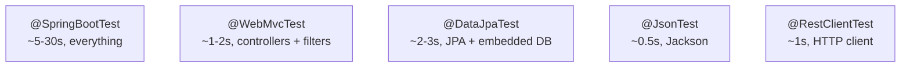

# Spring Boot test slices

A *test slice* is Spring Boot's mechanism for booting a *partial* application context — just enough to exercise one layer — instead of the entire app. `@WebMvcTest` boots controllers without JPA. `@DataJpaTest` boots JPA + DB without controllers. `@JsonTest` boots only Jackson. Each slice is dramatically faster than `@SpringBootTest` (often 5-10x), composes cleanly with `@MockBean` for collaborators, and produces a much smaller failure surface when something breaks. Senior engineers reach for the smallest possible slice that exercises the behavior under test.

This topic covers the built-in slices, when each fits, the slice-internal auto-configuration model, context caching, and the patterns for testing each layer in isolation.

> [!NOTE]
> Prerequisites: [Integration testing (L4/C09/T01)](./T01-integration-testing.md).

## Why Slices Exist

`@SpringBootTest` boots everything. For a real app with 200 beans, that takes 5-30 seconds per fresh context. Spring caches contexts across tests with identical config, so subsequent tests are fast — but any property change forks a new cached context.

A 1000-test suite with 10 unique configurations: 10 boots × 10 seconds = 100s of overhead just for context. With slices, you trade that for faster, more focused tests.



## `@WebMvcTest` — Controller Slice

Loads: dispatcher servlet, controllers (configurable), filter chain, `@ControllerAdvice`, `WebMvcConfigurer`, Jackson, validation.

Does NOT load: services, repositories, security (unless added), `@Component` beans not on web layer.

```java
@WebMvcTest(controllers = OrderController.class)
class OrderControllerTest {

    @Autowired MockMvc mockMvc;
    @MockBean OrderService orderService;   // collaborator must be mocked

    @Test
    void getOrder() throws Exception {
        when(orderService.findById("order-1"))
            .thenReturn(new Order("order-1", "user-1", 99.99));

        mockMvc.perform(get("/api/orders/{id}", "order-1"))
            .andExpect(status().isOk())
            .andExpect(jsonPath("$.id").value("order-1"));
    }

    @Test
    void notFound() throws Exception {
        when(orderService.findById("missing")).thenThrow(new OrderNotFoundException());

        mockMvc.perform(get("/api/orders/{id}", "missing"))
            .andExpect(status().isNotFound());
    }
}
```

Why this is good:
- ~1-2s to boot.
- Tests only HTTP/JSON/validation concerns.
- Service mocked: changes to service don't break this test.

### `@WebMvcTest` With Security

If your controller has Spring Security, you must include security config or disable it:

```java
@WebMvcTest(OrderController.class)
@Import(SecurityConfig.class)        // brings in your SecurityFilterChain
class SecuredOrderControllerTest {

    @Autowired MockMvc mockMvc;
    @MockBean OrderService orderService;

    @Test
    @WithMockUser(roles = "USER")
    void getOrder() throws Exception {
        mockMvc.perform(get("/api/orders/order-1"))
            .andExpect(status().isOk());
    }

    @Test
    void unauthenticated() throws Exception {
        mockMvc.perform(get("/api/orders/order-1"))
            .andExpect(status().isUnauthorized());
    }
}
```

## `@DataJpaTest` — JPA Slice

Loads: `EntityManager`, JPA repositories, `DataSource` (embedded by default), Hibernate, `TransactionManager`.

Does NOT load: web layer, services, full Spring context.

```java
@DataJpaTest
class OrderRepositoryTest {

    @Autowired TestEntityManager em;
    @Autowired OrderRepository repo;

    @Test
    void findByUserId() {
        em.persistAndFlush(new Order("user-1", "PENDING"));
        em.persistAndFlush(new Order("user-1", "PAID"));
        em.persistAndFlush(new Order("user-2", "PENDING"));

        var orders = repo.findByUserId("user-1");

        assertThat(orders).hasSize(2);
    }
}
```

`TestEntityManager` is a test-friendly wrapper around `EntityManager` (persist, flush, clear).

Each test method is transactional with rollback by default. `@DataJpaTest` adds `@Transactional` implicitly.

### `@DataJpaTest` With Real Database

By default `@DataJpaTest` uses an embedded DB (H2). To use a real one:

```java
@DataJpaTest
@AutoConfigureTestDatabase(replace = Replace.NONE)
@Testcontainers
class OrderRepositoryPostgresTest {

    @Container
    static PostgreSQLContainer<?> postgres = new PostgreSQLContainer<>("postgres:16")
        .withDatabaseName("test");

    @DynamicPropertySource
    static void props(DynamicPropertyRegistry r) {
        r.add("spring.datasource.url", postgres::getJdbcUrl);
        r.add("spring.datasource.username", postgres::getUsername);
        r.add("spring.datasource.password", postgres::getPassword);
    }

    @Autowired OrderRepository repo;
    // ... test using real Postgres
}
```

## `@JsonTest` — Serializer Slice

Tests JSON serialization without booting the web layer:

```java
@JsonTest
class OrderJsonTest {

    @Autowired JacksonTester<Order> json;

    @Test
    void serialize() throws Exception {
        Order o = new Order("order-1", "user-1", 99.99);
        var content = json.write(o);

        assertThat(content).hasJsonPathStringValue("$.id");
        assertThat(content).extractingJsonPathStringValue("$.id").isEqualTo("order-1");
        assertThat(content).hasJsonPathNumberValue("$.amount");
    }

    @Test
    void deserialize() throws Exception {
        String content = """
            {"id":"order-1","userId":"user-1","amount":99.99}
            """;
        Order o = json.parse(content).getObject();

        assertThat(o.getId()).isEqualTo("order-1");
        assertThat(o.getAmount()).isEqualTo(99.99);
    }
}
```

Useful for verifying custom serializers, `@JsonIgnore`, field name mapping.

## `@RestClientTest` — HTTP Client Slice

Tests `RestTemplate`/`RestClient` clients with `MockRestServiceServer`:

```java
@RestClientTest(PaymentClient.class)
class PaymentClientTest {

    @Autowired PaymentClient client;
    @Autowired MockRestServiceServer server;

    @Test
    void charge() {
        server.expect(requestTo("/api/payments"))
            .andExpect(method(HttpMethod.POST))
            .andExpect(content().json("""
                {"amount": 99.99, "currency": "USD"}
                """))
            .andRespond(withSuccess("""
                {"chargeId": "ch_123", "status": "SUCCESS"}
                """, MediaType.APPLICATION_JSON));

        ChargeResult result = client.charge(new ChargeRequest(99.99, "USD"));

        assertThat(result.getChargeId()).isEqualTo("ch_123");
    }
}
```

`MockRestServiceServer` intercepts HTTP calls without a real socket — lightning fast.

## `@DataMongoTest`, `@DataRedisTest`, `@DataJdbcTest`, `@JooqTest`

Equivalent slices for other persistence layers:
- `@DataMongoTest`: MongoDB.
- `@DataRedisTest`: Redis.
- `@DataJdbcTest`: Spring Data JDBC.
- `@JooqTest`: jOOQ.

Each loads the minimum for its layer.

## `@WebFluxTest` — Reactive Controller

The WebFlux equivalent of `@WebMvcTest`:

```java
@WebFluxTest(OrderController.class)
class OrderControllerWebFluxTest {

    @Autowired WebTestClient webClient;
    @MockBean OrderService orderService;

    @Test
    void getOrder() {
        when(orderService.findById("order-1"))
            .thenReturn(Mono.just(new Order("order-1", "user-1", 99.99)));

        webClient.get().uri("/api/orders/order-1")
            .exchange()
            .expectStatus().isOk()
            .expectBody()
            .jsonPath("$.id").isEqualTo("order-1");
    }
}
```

## `@GraphQlTest`

For GraphQL controllers (Spring for GraphQL):

```java
@GraphQlTest(OrderController.class)
class OrderGraphQlTest {

    @Autowired GraphQlTester graphQl;
    @MockBean OrderService orderService;

    @Test
    void getOrder() {
        when(orderService.findById("order-1"))
            .thenReturn(new Order("order-1", "user-1", 99.99));

        graphQl.document("""
                { order(id: "order-1") { id amount } }
                """)
            .execute()
            .path("order.id").entity(String.class).isEqualTo("order-1")
            .path("order.amount").entity(Double.class).isEqualTo(99.99);
    }
}
```

## `@AutoConfigureMockMvc` — Add MockMvc To `@SpringBootTest`

Sometimes you want `@SpringBootTest`'s full context but with `MockMvc`:

```java
@SpringBootTest
@AutoConfigureMockMvc
class FullStackTest {

    @Autowired MockMvc mockMvc;
    @Autowired OrderRepository repo;

    @Test
    void createOrderEndToEnd() throws Exception {
        mockMvc.perform(post("/api/orders").content("..."))
            .andExpect(status().isCreated());
        assertThat(repo.findAll()).hasSize(1);
    }
}
```

## Context Caching — The Hidden Speed-Up

Spring caches the application context across test classes if the configuration is identical. Subsequent tests using the same config reuse the cached context (instant).

Things that fork a new cached context:
- Different `@SpringBootTest`/`@WebMvcTest` annotations.
- Different `properties = {}`.
- Different `@ActiveProfiles`.
- Different `@TestPropertySource`.
- Different `@MockBean`/`@SpyBean` (post-processors).
- Different `@ContextConfiguration` classes.
- Different `@DirtiesContext`.

Try to make 80% of your tests share the same config so they share one cached context.

## `@DirtiesContext` — When You Must Reset

If a test pollutes static state, mark it:

```java
@SpringBootTest
@DirtiesContext(classMode = ClassMode.AFTER_CLASS)
class DirtyingTest { ... }
```

The context is discarded after the test class — and the next test pays the boot cost. Use sparingly.

## Custom Slices

You can build your own:

```java
@Target(ElementType.TYPE)
@Retention(RetentionPolicy.RUNTIME)
@BootstrapWith(SpringBootTestContextBootstrapper.class)
@ExtendWith(SpringExtension.class)
@OverrideAutoConfiguration(enabled = false)
@TypeExcludeFilters(MyServiceTypeExcludeFilter.class)
@AutoConfigureCache
@ImportAutoConfiguration
public @interface MyServiceTest { }
```

For most teams, this is overkill — stick with built-in slices.

## Performance Comparison

A real Spring Boot 3 app, JDK 21, M3 Mac:

| Annotation | Cold boot | Warm reuse |
|------------|-----------|------------|
| `@SpringBootTest` | ~8s | ~50ms |
| `@WebMvcTest(One.class)` | ~2s | ~30ms |
| `@DataJpaTest` (H2) | ~3s | ~50ms |
| `@JsonTest` | ~0.5s | ~20ms |

Cold boots dominate CI time. Standardize slice usage to cluster tests around few cached contexts.

## When `@SpringBootTest` Is The Right Choice

- End-to-end test of a request flow including DB.
- Smoke test: app starts at all.
- Configuration test: verify a `@ConfigurationProperties` binds correctly.
- Tests that explicitly need cross-layer wiring.

Otherwise reach for the slice.

## Anti-Patterns

> [!WARNING]
> **`@SpringBootTest` for unit-level concerns.** Slow context boot wasted.

> [!WARNING]
> **`@MockBean` everywhere in `@WebMvcTest`.** That's just unit testing with extra steps. Use plain Mockito.

> [!WARNING]
> **Forgetting `@Import(SecurityConfig.class)` in `@WebMvcTest`.** Security config is missing → all endpoints look open.

> [!WARNING]
> **Different properties across tests for no reason.** Forks the cached context.

> [!WARNING]
> **`@DirtiesContext` as a band-aid.** Find what's polluting state instead.

> [!WARNING]
> **Mixing slices in one test.** Doesn't compose. Pick one.

> [!WARNING]
> **Hand-rolling fixture creation in every `@DataJpaTest`.** Use `@Sql` or a fixture builder.

> [!WARNING]
> **`@DataJpaTest` always means H2.** Use Testcontainers for fidelity.

## Common Misconceptions

> [!WARNING]
> **"`@WebMvcTest` boots the whole context."** It loads only the web layer.

> [!WARNING]
> **"Slices are faster because they have fewer beans."** Partly — but the big win is context caching across many tests.

> [!WARNING]
> **"`@DataJpaTest` runs against the production DB."** It uses an embedded DB unless overridden.

> [!WARNING]
> **"`@JsonTest` tests REST behavior."** It tests serializers. REST is `@WebMvcTest`.

> [!WARNING]
> **"`@MockBean` is the only mocking option."** Plain Mockito with `@Mock` works in any test class.

## Practice

1. **`@WebMvcTest`**: write a controller test with `@MockBean` for the service.
2. **`@WebMvcTest` + Security**: include security config; test authenticated and unauthenticated paths.
3. **`@DataJpaTest`**: test a custom repository method using `TestEntityManager`.
4. **`@DataJpaTest` + Testcontainers**: switch to real Postgres.
5. **`@JsonTest`**: verify a custom Jackson serializer.
6. **`@RestClientTest`**: stub an HTTP API with `MockRestServiceServer`.
7. **`@WebFluxTest`**: test a reactive controller with `WebTestClient`.
8. **Performance measurement**: compare `@SpringBootTest` vs `@WebMvcTest` for the same test.
9. **Cached context count**: measure how many distinct contexts your suite creates.

## Recap

You should now be able to:

- Choose the right slice annotation for the test concern.
- Use `@WebMvcTest`, `@DataJpaTest`, `@JsonTest`, `@RestClientTest`, `@WebFluxTest`.
- Stub collaborators with `@MockBean`.
- Standardize config to maximize context caching.
- Wire real DBs into `@DataJpaTest` via Testcontainers.
- Use `@AutoConfigureMockMvc` with `@SpringBootTest` when needed.
- Avoid context-pollution anti-patterns.

## Next

Continue to [Testcontainers](./T03-testcontainers.md) — running real Postgres, Kafka, Redis, etc., in Docker for high-fidelity integration tests.
