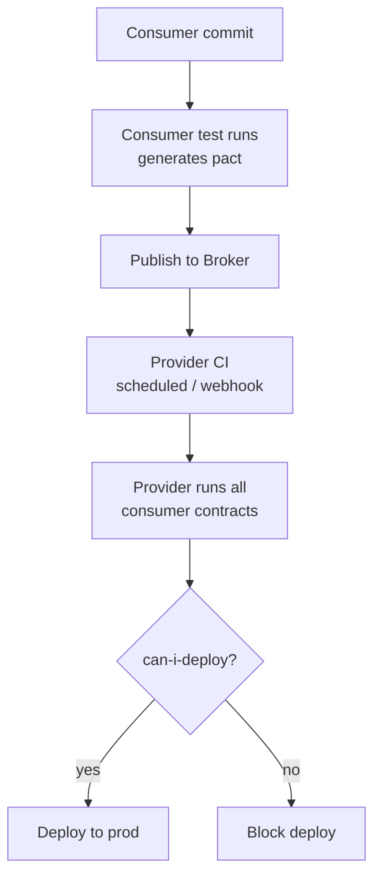

# Contract testing (Spring Cloud Contract, Pact)

In a monolith, the compiler catches API breaks. In microservices, service A's deployment can silently break service B because their APIs are two separate codebases — and end-to-end tests across both are too slow, too brittle, and require a deployed environment to run. *Contract testing* solves this: each consumer of an API writes a *contract* declaring what it expects; the provider runs the contract against its current code; if the contract breaks, the build fails *before* deployment. Contracts replace expensive E2E coverage for inter-service behavior.

This topic covers the consumer-driven contract pattern (Pact, by Mary Poppendieck and the realestate.com.au team), the producer-driven alternative (Spring Cloud Contract), the Pact Broker for "can I deploy?" gates, and the trade-offs between approaches.

> [!NOTE]
> Prerequisites: [Integration testing (L4/C09/T01)](./T01-integration-testing.md).

## Why Contracts

Consider services A → B → C. A change to B's response format breaks A, but C doesn't notice until much later.

Options:
1. **End-to-end tests**: deploy all three; test from outside. Slow, flaky, requires shared env.
2. **Manual coordination**: changelog discipline. Error-prone.
3. **API versioning**: add v2, deprecate v1. Heavy.
4. **Contract testing**: each consumer declares what it expects; provider tests against all contracts in CI.


If a provider PR breaks a contract → build fails before merge. Consumers don't have to deploy.

## Two Schools — Consumer-Driven vs Producer-Driven

### Consumer-Driven (Pact)

Consumers write tests using a mock provider. The mocks generate JSON contracts. Provider verifies against those contracts.

Workflow:
1. Consumer team writes test with `MockProvider`.
2. Test passes → `pact.json` generated.
3. Push contract to Pact Broker.
4. Provider CI pulls contracts, runs them against current provider code.
5. If provider response differs → CI fails.

### Producer-Driven (Spring Cloud Contract)

Provider writes contracts in Groovy/YAML. Provider verifies its impl matches. Stubs are generated from the contract for consumer tests.

Workflow:
1. Provider writes `contracts/getOrder.yml`.
2. Provider CI generates tests; verifies impl matches contract.
3. Stubs published to artifact repo.
4. Consumer pulls stubs; tests against them.

Each style has fans. Pact is more popular in 2026.

## Pact Example — Consumer Side

```xml
<dependency>
  <groupId>au.com.dius.pact.consumer</groupId>
  <artifactId>junit5</artifactId>
  <version>4.6.14</version>
  <scope>test</scope>
</dependency>
```

```java
@ExtendWith(PactConsumerTestExt.class)
@PactTestFor(providerName = "OrderService", port = "8989")
class CheckoutServiceConsumerPactTest {

    @Pact(consumer = "CheckoutService")
    public RequestResponsePact getOrderPact(PactDslWithProvider builder) {
        return builder
            .given("order order-1 exists")
            .uponReceiving("GET /api/orders/order-1")
                .path("/api/orders/order-1")
                .method("GET")
            .willRespondWith()
                .status(200)
                .headers(Map.of("Content-Type", "application/json"))
                .body(new PactDslJsonBody()
                    .stringType("id", "order-1")
                    .stringType("userId", "user-1")
                    .decimalType("total", 99.99))
            .toPact();
    }

    @Test
    @PactTestFor(pactMethod = "getOrderPact")
    void getsOrder(MockServer mockServer) {
        OrderClient client = new OrderClient(mockServer.getUrl());

        Order o = client.getOrder("order-1");

        assertThat(o.getId()).isEqualTo("order-1");
        assertThat(o.getUserId()).isEqualTo("user-1");
    }
}
```

When this test passes:
- A `target/pacts/CheckoutService-OrderService.json` file is created.
- It declares: "If I send `GET /api/orders/order-1`, I expect 200 with these fields."

Publish to Pact Broker:
```bash
mvn pact:publish
```

## Pact Example — Provider Verification

```xml
<dependency>
  <groupId>au.com.dius.pact.provider</groupId>
  <artifactId>junit5spring</artifactId>
  <version>4.6.14</version>
  <scope>test</scope>
</dependency>
```

```java
@Provider("OrderService")
@PactBroker(url = "https://pact-broker.example.com")
@SpringBootTest(webEnvironment = WebEnvironment.RANDOM_PORT)
class OrderServiceProviderPactTest {

    @LocalServerPort int port;

    @BeforeEach
    void setUp(PactVerificationContext context) {
        context.setTarget(new HttpTestTarget("localhost", port));
    }

    @TestTemplate
    @ExtendWith(PactVerificationInvocationContextProvider.class)
    void verifyPact(PactVerificationContext context) {
        context.verifyInteraction();
    }

    @State("order order-1 exists")
    public void orderExists() {
        orderRepo.save(new Order("order-1", "user-1", 99.99));
    }
}
```

For each pact contract the provider has:
- The `@State` matches the consumer's `.given(...)`.
- The framework hits the running app's HTTP endpoint.
- It compares the actual response against the contract's expectation.

If a field is missing, type mismatched, or status code differs → test fails.

## Pact Matchers — Type vs Exact

By default Pact does exact match. Often you want type-match (any string in this field is OK):

```java
.body(new PactDslJsonBody()
    .stringType("id", "order-1")       // accept any string; "order-1" is example
    .stringMatcher("status", "PENDING|PAID", "PENDING")  // regex
    .timestamp("createdAt")            // valid ISO timestamp
    .eachLike("items", new PactDslJsonBody()
        .stringType("sku")
        .integerType("qty")))
```

Type matching keeps contracts robust against value changes (provider increments order IDs every day).

## Pact Broker — The Coordinator

The broker stores contracts and verification results. Provides:
- **Contract storage**.
- **Verification history**.
- **`can-i-deploy`**: "If I deploy provider v1.5, will any consumer break?"
- **Versioning**: tag versions (prod, staging).
- **Webhooks**: trigger provider CI when new contract published.

Self-host or use PactFlow (SaaS).

`can-i-deploy` workflow:
```bash
pact-broker can-i-deploy \
    --pacticipant OrderService \
    --version 1.5.0 \
    --to-environment production
# Exits 0 if all consumer contracts pass.
```

This is the killer feature. Before deploy, ask the broker: am I compatible with everything currently in prod?

## Spring Cloud Contract Example

Producer side:

```groovy
// contracts/getOrder.groovy
Contract.make {
    description "Get order by ID"
    request {
        method 'GET'
        url '/api/orders/order-1'
    }
    response {
        status 200
        headers {
            contentType applicationJson()
        }
        body([
            id: "order-1",
            userId: "user-1",
            total: 99.99
        ])
        bodyMatchers {
            jsonPath('$.id', byType())
            jsonPath('$.total', byRegex('[0-9]+\\.[0-9]{2}'))
        }
    }
}
```

Spring Cloud Contract maven plugin generates a test:

```java
// auto-generated
@Test
public void validate_getOrder() throws Exception {
    MockMvcRequestSpecification request = given();
    ResponseOptions response = given().spec(request)
        .when().get("/api/orders/order-1");
    assertThat(response.statusCode()).isEqualTo(200);
    // ... full assertion against contract
}
```

Publish stubs:
```xml
<plugin>
  <groupId>org.springframework.cloud</groupId>
  <artifactId>spring-cloud-contract-maven-plugin</artifactId>
  <extensions>true</extensions>
</plugin>
```

Consumer side, use the stubs:

```java
@SpringBootTest
@AutoConfigureStubRunner(
    ids = "com.example:order-service:+:stubs:8090",
    stubsMode = StubRunnerProperties.StubsMode.LOCAL)
class CheckoutServiceConsumerTest {

    @Autowired CheckoutService checkout;

    @Test
    void getsOrder() {
        // Stub runner started a fake provider on 8090.
        // CheckoutService configured to use it.
        Order o = checkout.fetchOrderFor("user-1");
        assertThat(o.getId()).isEqualTo("order-1");
    }
}
```

## Pact vs Spring Cloud Contract

| Aspect | Pact | Spring Cloud Contract |
|--------|------|----------------------|
| Direction | Consumer → Provider | Provider-defined |
| Language | Polyglot | JVM-centric |
| DSL | JSON | Groovy/YAML |
| Broker | Pact Broker | Artifact repo |
| `can-i-deploy` | First-class | DIY |
| Community | Huge | Smaller |
| Native to Spring | No | Yes |

**Pick Pact when**: polyglot teams (Node, Go, Python consumers/providers).
**Pick Spring Cloud Contract when**: all Spring; want stub generation; want minimal dependencies.

## What Contracts Don't Cover

Contracts test the *shape* of requests/responses. They don't test:
- Performance.
- End-to-end user flows.
- Business rules.
- Authentication/authorization (well, often).

You still need integration tests for those. Contracts replace expensive E2E for API compatibility specifically.

## Versioning Strategy With Contracts

Two approaches:

### Backward Compatibility (recommended)

Never break existing contracts. Add fields, never remove. Old consumers continue to work.

### Versioned Endpoints (heavier)

`/api/v1/orders`, `/api/v2/orders`. Each version has its own contract.

Most teams stick with backward compatibility + contract testing as the gate.

## Real-World Workflow



## Anti-Patterns

> [!WARNING]
> **Contracts as Schema docs.** Contracts test behavior, not just schema. Use OpenAPI for docs.

> [!WARNING]
> **Exact value matching everywhere.** Brittle. Use type matchers.

> [!WARNING]
> **Contracts without `can-i-deploy`.** Half the benefit gone.

> [!WARNING]
> **No `@State` in provider tests.** Tests fail because data isn't there.

> [!WARNING]
> **Contracts for every internal call.** Use for cross-team APIs.

> [!WARNING]
> **Consumers and providers in same repo.** Then internal refactors; no contract needed.

> [!WARNING]
> **Contracts replacing all integration tests.** Different concerns.

> [!WARNING]
> **Manual broker maintenance.** Automate publish/verify in CI.

## Common Misconceptions

> [!WARNING]
> **"Contracts are E2E tests."** They're targeted at API shape. Faster, cheaper.

> [!WARNING]
> **"Pact is for REST only."** Pact supports messaging contracts too.

> [!WARNING]
> **"Pact and OpenAPI are competitors."** Different roles: Pact is behavior; OpenAPI is schema/docs.

> [!WARNING]
> **"Spring Cloud Contract is dead."** It's maintained, just less hyped.

> [!WARNING]
> **"Contracts slow CI down."** A few seconds added; saves hours of E2E debugging.

## Practice

1. **First Pact**: write a consumer test that generates a pact file.
2. **Provider verification**: run the pact against a Spring Boot provider.
3. **Type matchers**: use them to handle dynamic values.
4. **Pact Broker**: self-host Pact Broker via Docker; publish a pact.
5. **`can-i-deploy`**: configure broker; run the check.
6. **Spring Cloud Contract**: write a Groovy contract; auto-generate tests.
7. **Stub runner**: consume Spring Cloud Contract stubs from a Maven artifact.
8. **Messaging contract**: write a Pact for a Kafka message.
9. **Compare**: same API in Pact and SCC — which fits your team?

## Recap

You should now be able to:

- Explain why contract testing replaces some E2E.
- Write consumer-driven contracts with Pact.
- Run provider verification with `@State`.
- Use Pact Broker and `can-i-deploy`.
- Write producer-driven contracts with Spring Cloud Contract.
- Choose between Pact and SCC for your team.
- Avoid contract anti-patterns.

## Next

Continue to [Mutation testing (PIT)](./T06-mutation-testing-pit.md) — measuring the quality of your tests by mutating code and seeing if tests catch the bugs.
