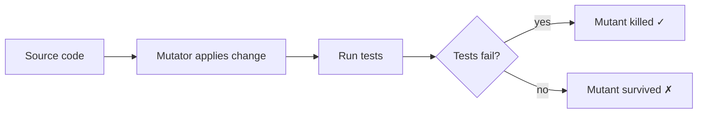

# Mutation testing (PIT)

Code coverage — the percentage of lines or branches your tests execute — is a *necessary* but *insufficient* measure of test quality. You can have 100% coverage with tests that assert nothing (`@Test void runs() { service.doStuff(); }`). Mutation testing closes that gap by *deliberately introducing bugs* (mutants) into your code and checking whether your tests detect them. If a mutant survives — code is broken, tests still pass — your tests are weak. The dominant tool in Java is PIT (PITest), by Henry Coles since 2010; it's fast enough to run on every CI build and produces an actionable "mutation score" that's a far better proxy for test quality than line coverage.

This topic covers what mutation testing is, how PIT works, the standard mutators, integration into Maven/Gradle/CI, performance optimization (incremental analysis), the equivalent-mutant problem, and how to interpret and act on mutation reports.

> [!NOTE]
> Prerequisites: basic JUnit + code coverage familiarity.

## The Problem With Coverage

```java
public class Discount {
    public int apply(int price) {
        if (price > 100) {
            return price - 10;
        }
        return price;
    }
}
```

Test:
```java
@Test
void appliesDiscount() {
    new Discount().apply(150);   // executes both branches via two test methods
    new Discount().apply(50);
}
```

100% line coverage. No assertions. If `price - 10` became `price + 10`, tests still pass.

This is not a strawman — real codebases have these.

Mutation testing surfaces this.

## How Mutation Testing Works

1. Run all tests; ensure green.
2. For each statement in production code:
   - Apply a "mutation" (replace `>` with `>=`, replace `+` with `-`, etc.).
   - Re-run tests targeting that class.
   - If any test fails → mutant *killed* (good).
   - If all pass → mutant *survived* (bad — tests didn't notice the bug).
3. Compute mutation score = killed / total.



A mutation score of 80%+ generally signals strong tests. 60-80% is OK. < 60% is weak.

## PIT Setup

```xml
<plugin>
  <groupId>org.pitest</groupId>
  <artifactId>pitest-maven</artifactId>
  <version>1.17.0</version>
  <configuration>
    <targetClasses>
      <param>com.example.*</param>
    </targetClasses>
    <targetTests>
      <param>com.example.*</param>
    </targetTests>
    <mutators>
      <mutator>STRONGER</mutator>
    </mutators>
    <outputFormats>
      <param>HTML</param>
      <param>XML</param>
    </outputFormats>
  </configuration>
  <dependencies>
    <dependency>
      <groupId>org.pitest</groupId>
      <artifactId>pitest-junit5-plugin</artifactId>
      <version>1.2.1</version>
    </dependency>
  </dependencies>
</plugin>
```

Run:
```bash
mvn org.pitest:pitest-maven:mutationCoverage
```

Output:
- `target/pit-reports/index.html`: per-class breakdown.
- Mutation score percentage.
- Killed/survived mutants with location.

## Standard Mutators

PIT's `STRONGER` group includes:

| Mutator | Example mutation |
|---------|------------------|
| `CONDITIONALS_BOUNDARY` | `>` → `>=` |
| `INCREMENTS` | `i++` → `i--` |
| `INVERT_NEGS` | `-x` → `+x` |
| `MATH` | `a + b` → `a - b` |
| `NEGATE_CONDITIONALS` | `==` → `!=` |
| `RETURN_VALS` | `return x` → `return 0` |
| `VOID_METHOD_CALLS` | remove call |
| `EMPTY_RETURNS` | `return list` → `return Collections.emptyList()` |
| `FALSE_RETURNS` | `return true` → `return false` |
| `TRUE_RETURNS` | `return false` → `return true` |
| `NULL_RETURNS` | `return obj` → `return null` |
| `PRIMITIVE_RETURNS` | `return 1` → `return 0` |

The `STRONGER` group is recommended. Avoid `ALL` (slow + many equivalent mutants).

## Sample Report

```
Mutators
====================================================================
> org.pitest.mutationtest.engine.gregor.mutators.CONDITIONALS_BOUNDARY
>> Generated 4 Killed 4 (100%)

Lines covered:                  78/85 (91%)
Mutations covered:              42/56 (75%)
```

Each surviving mutant shows file + line + the mutation made.

## Investigating Surviving Mutants

For each surviving mutant, ask:
1. **Is the mutation observable?** If yes, missing test.
2. **Is the mutation equivalent?** Behaviorally identical → not a real survivor.

Example survivor:
```java
public int sum(List<Integer> xs) {
    int total = 0;
    for (int x : xs) total += x;
    return total;
}
```

Mutator removes the `total += x` (VOID_METHOD_CALL on `+=`). Test only checks `sum(emptyList())` returns 0 — passes either way. Add `sum([1,2,3]) == 6` and you kill the mutant.

## Equivalent Mutants — The Annoying Problem

Sometimes a mutation produces semantically identical code. The classic:

```java
if (i == 0) {
    return early();
}
```

Mutator: `i == 0` → `i != 0`. If the rest of the function returns the same value, the mutant is *equivalent* — no test can distinguish it.

PIT mitigates with sane mutator selection. You may have 1-5% equivalent mutants that you can't kill. Document and ignore.

Tools like [DESCARTES](https://github.com/STAMP-project/pitest-descartes) use *extreme mutation testing* — replace whole methods with `return 0` / `return null` — to reduce equivalent mutant noise.

## Performance — Incremental Analysis

PIT can take minutes on large codebases. Optimizations:

### `incremental` Mode

```xml
<configuration>
  <withHistory>true</withHistory>
  <historyOutputFile>target/pit-history</historyOutputFile>
</configuration>
```

Only re-analyzes changed code + transitively dependent tests. Re-run is 10x faster.

### Class Filtering

```xml
<targetClasses>
  <param>com.example.business.*</param>
</targetClasses>
<excludedClasses>
  <param>com.example.generated.*</param>
</excludedClasses>
```

Don't mutate auto-generated code, configs, DTOs.

### Threading

```xml
<threads>8</threads>
```

PIT parallelizes by class.

## CI Integration

```yaml
# .github/workflows/mutation.yml
name: Mutation
on:
  schedule:
  - cron: '0 4 * * 1'   # Mondays
  workflow_dispatch:

jobs:
  pit:
    runs-on: ubuntu-latest
    steps:
    - uses: actions/checkout@v4
    - uses: actions/setup-java@v4
      with:
        distribution: temurin
        java-version: 21
    - run: ./mvnw test pitest:mutationCoverage
    - uses: actions/upload-artifact@v4
      with:
        name: pit-report
        path: target/pit-reports/
```

PIT on every PR is too slow for most codebases. Schedule weekly + run on demand.

For PR gates, use `pitest-github-action` or check the threshold:

```xml
<mutationThreshold>75</mutationThreshold>
<coverageThreshold>85</coverageThreshold>
```

If thresholds aren't met, build fails.

## What Mutation Testing Reveals

Common patterns surfaced:

1. **Missing assertions**: tests run code but don't check results.
2. **Mocked too much**: testing mocks, not behavior.
3. **Branch not tested**: only happy path.
4. **Off-by-one bugs uncovered**: `>=` vs `>`.
5. **Unused return values**: nothing depends on the return.

The act of writing tests that kill mutants is teaching the team to assert more deeply.

## When NOT To Use Mutation Testing

- **Generated code**: mutants meaningless.
- **DTOs / data classes**: getters/setters; not much to test.
- **Config files**: not source code.
- **UI code**: harder to verify.

Focus on business logic, algorithms, state machines.

## Alternative: Stryker, Major

Stryker (originally JavaScript; Stryker4j experimental) and Major (academic) are alternatives. PIT is the practical Java choice in 2026.

## Real-World Adoption

Spotify, Trivago, ThoughtWorks publicly use PIT. Typical workflow:
- Mutation score tracked over time.
- New code must maintain mutation score.
- Regular reviews of survivors.

## Anti-Patterns

> [!WARNING]
> **Chasing 100% mutation score.** Diminishing returns. 75-85% is typical excellent.

> [!WARNING]
> **Treating all survivors as failures.** Some are equivalent.

> [!WARNING]
> **Running PIT on every commit.** Too slow. Schedule.

> [!WARNING]
> **Mutating generated code.** Wasted effort.

> [!WARNING]
> **No history file.** Full re-runs each time.

> [!WARNING]
> **Hand-written tests just to kill mutants.** Tests should reflect requirements, not artificial mutants.

> [!WARNING]
> **No threshold gates.** Score quietly degrades over time.

## Common Misconceptions

> [!WARNING]
> **"Coverage and mutation score are the same."** Coverage measures execution; mutation measures detection.

> [!WARNING]
> **"100% mutation score = perfect tests."** Equivalent mutants and semantic edge cases.

> [!WARNING]
> **"Mutation testing is too slow for real projects."** With incremental mode and good filtering, manageable.

> [!WARNING]
> **"PIT replaces other testing tools."** It complements unit tests; doesn't write them.

> [!WARNING]
> **"Slow tests are the only reason for low mutation scores."** Often it's missing assertions, not slow tests.

## Practice

1. **First PIT run**: add PIT to a Spring Boot project. Run; review HTML report.
2. **Kill a surviving mutant**: improve one test to kill a survivor.
3. **Equivalent mutant**: find an equivalent mutant; document why.
4. **Incremental mode**: enable history; measure re-run speedup.
5. **CI integration**: schedule PIT in GitHub Actions weekly.
6. **Thresholds**: set `mutationThreshold=70%`. Verify build fails when violated.
7. **Filter classes**: exclude generated/DTO packages.
8. **Mutation score over time**: graph score weekly.
9. **Compare**: a class with high coverage but low mutation score — what's missing?

## Recap

You should now be able to:

- Explain why coverage alone is insufficient.
- Run PIT in Maven/Gradle.
- Interpret mutation reports.
- Distinguish killed, survived, and equivalent mutants.
- Configure incremental analysis for speed.
- Set up CI integration.
- Identify and fix weak tests using mutation feedback.

## Next

Continue to [Load & performance testing (JMeter, Gatling)](./T07-load-and-performance-testing-jmeter-gatling.md) — testing the non-functional dimension: latency, throughput, scaling under load.
