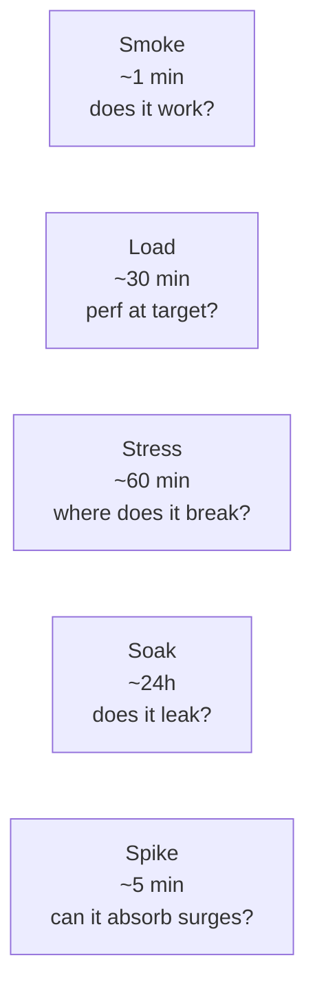

# Load & performance testing (JMeter, Gatling)

Functional tests answer "does it work?". Load and performance tests answer "does it work at the scale and speed users actually demand?" — questions that no unit test will surface and that production will eventually answer in painful ways if you don't. The dominant tools for the JVM ecosystem are Apache JMeter (1998, GUI-driven, still ubiquitous), Gatling (2012, Scala/Java DSL, async-IO, code-as-config), and k6 (2017, Go-based, JavaScript scripting, increasingly popular). Senior engineers know how to design realistic load scenarios, what metrics to capture, how to interpret percentile distributions, and how to translate results into capacity-planning decisions.

This topic covers test types (load, stress, soak, spike), JMeter's plan structure, Gatling's DSL, k6 briefly, metrics (RPS, latency percentiles, error rate), the testing environment trap (load testing the wrong env), and how performance tests integrate into CI without slowing every build.

> [!NOTE]
> Prerequisites: basic HTTP and Spring Boot familiarity.

## Categories Of Performance Tests

| Type | Goal | Duration | Pattern |
|------|------|----------|---------|
| **Load** | Verify perf at expected load | 10-60 min | Steady RPS at target |
| **Stress** | Find breaking point | 30-60 min | Ramp up until failure |
| **Soak** | Detect memory leaks, resource exhaustion | 4-24 hours | Steady load over time |
| **Spike** | Test response to sudden surge | 5-30 min | 0 → high → 0 |
| **Smoke** | Quick perf sanity | 1-5 min | Light load |

Each answers a different question. Mature teams run all.



## Key Metrics

For each test, capture:

- **Throughput** (RPS, TPS): requests/sec sustained.
- **Latency percentiles**: p50, p95, p99, p99.9 (always percentiles, never average).
- **Error rate**: % of requests failing (5xx, timeouts).
- **Concurrency**: simultaneous users / connections.
- **System metrics**: CPU, memory, GC, DB connections, queue depth.

Coupling load test results with system metrics shows *why* perf is what it is.

## JMeter

Apache JMeter is the OSS veteran. GUI for plan design, headless for CI runs.

### Plan Structure

```
Test Plan
└── Thread Group (users, ramp-up, loops)
    ├── HTTP Request Defaults (host, port)
    ├── HTTP Header Manager (auth, content-type)
    ├── HTTP Request 1: GET /api/users
    ├── HTTP Request 2: POST /api/orders
    ├── Listeners (Aggregate Report, Summary)
    └── Assertions (status 200, response time < 500ms)
```

A *Thread Group* simulates N concurrent users.

### Sample JMX (Headless XML)

```xml
<jmeterTestPlan>
  <hashTree>
    <TestPlan testname="Checkout Load">
      <hashTree>
        <ThreadGroup>
          <stringProp name="ThreadGroup.num_threads">100</stringProp>
          <stringProp name="ThreadGroup.ramp_time">30</stringProp>
          <stringProp name="ThreadGroup.duration">600</stringProp>
        </ThreadGroup>
        <HTTPSamplerProxy>
          <stringProp name="HTTPSampler.path">/api/checkout</stringProp>
          <stringProp name="HTTPSampler.method">POST</stringProp>
        </HTTPSamplerProxy>
      </hashTree>
    </TestPlan>
  </hashTree>
</jmeterTestPlan>
```

### Headless Run

```bash
jmeter -n -t checkout.jmx -l results.jtl -e -o report-html/
```

`-n` non-GUI, `-t` plan, `-l` results CSV, `-e -o` generate HTML report.

## Gatling

Gatling (2012, started by Stéphane Landelle) is Scala/Java-based, async IO, lower overhead than JMeter. Code-as-config approach: tests are version-controlled Java/Kotlin/Scala.

### Java DSL

```java
import io.gatling.javaapi.core.*;
import io.gatling.javaapi.http.*;
import static io.gatling.javaapi.core.CoreDsl.*;
import static io.gatling.javaapi.http.HttpDsl.*;

public class CheckoutSimulation extends Simulation {

    HttpProtocolBuilder httpProtocol = http
        .baseUrl("https://api.example.com")
        .acceptHeader("application/json")
        .userAgentHeader("Gatling/Test");

    ScenarioBuilder scn = scenario("Checkout")
        .exec(http("Login")
            .post("/api/login")
            .body(StringBody("""
                {"username": "test", "password": "test"}
                """))
            .check(status().is(200))
            .check(jsonPath("$.token").saveAs("token")))
        .exec(http("Add to cart")
            .post("/api/cart")
            .header("Authorization", "Bearer #{token}")
            .body(StringBody("""
                {"sku": "ABC-123", "qty": 1}
                """))
            .check(status().is(200)))
        .exec(http("Checkout")
            .post("/api/checkout")
            .header("Authorization", "Bearer #{token}")
            .check(status().is(200))
            .check(responseTimeInMillis().lt(500)));

    {
        setUp(
            scn.injectOpen(
                rampUsersPerSec(1).to(100).during(60),
                constantUsersPerSec(100).during(600),
                rampUsersPerSec(100).to(0).during(60)
            )
        ).protocols(httpProtocol)
         .assertions(
            global().responseTime().percentile3().lt(500),
            global().successfulRequests().percent().gt(99.0)
         );
    }
}
```

This:
- Ramps 0 → 100 RPS over 1 minute.
- Holds 100 RPS for 10 minutes.
- Ramps 100 → 0 over 1 minute.
- Asserts p95 < 500ms and success > 99%.

### Maven Plugin

```xml
<plugin>
  <groupId>io.gatling</groupId>
  <artifactId>gatling-maven-plugin</artifactId>
  <version>4.10.2</version>
</plugin>
```

```bash
mvn gatling:test -Dgatling.simulationClass=CheckoutSimulation
```

Output: HTML report with charts (throughput, latency, errors over time).

### Why Gatling Often Wins

- **Async IO**: handles 10k+ concurrent virtual users on a single JVM.
- **Code-as-config**: PR review, refactoring, DRY.
- **Better reports**: time-series graphs.
- **DSL is expressive**: scenarios feel like specs.

JMeter's strength: maturity, GUI for non-coders, huge plugin ecosystem.

## k6 — A Word

k6 (2017, Grafana Labs) is Go-based, JavaScript scripting:

```javascript
import http from 'k6/http';
import { check } from 'k6';

export const options = {
  vus: 100,
  duration: '10m',
  thresholds: {
    http_req_duration: ['p(95)<500'],
    http_req_failed: ['rate<0.01'],
  },
};

export default function () {
  const res = http.post('https://api.example.com/api/checkout',
    JSON.stringify({sku: 'ABC-123'}),
    {headers: {'Content-Type': 'application/json'}}
  );
  check(res, {'status is 200': r => r.status === 200});
}
```

Very low per-VU overhead. Cloud companion (k6 Cloud / Grafana Cloud k6) for distributed load. Increasingly popular alongside Gatling.

## The Environment Trap

Load testing the wrong environment produces garbage results. Common mistakes:

- Testing against staging with 1/10th the prod resources.
- Testing without the prod-equivalent DB size.
- Testing with localhost caching that prod doesn't have.
- Testing without realistic data (1k rows instead of 1M).
- Testing without the CDN/load balancer in front.

The senior practice: **performance-equivalent environment** for load tests. Typically a dedicated "perf" env scaled to prod.

## Test Data Considerations

Test data should mirror prod scale:
- Same row counts (1M+ where prod has 1M).
- Same key distributions (some hot, some cold).
- Same content size (long descriptions, not "Lorem ipsum").

Use prod snapshots (anonymized) where legal, synthetic data otherwise.

## Distributed Load Generation

One test machine can saturate. For higher load:

- **JMeter**: distributed mode with master + slaves.
- **Gatling FrontLine** / Gatling Enterprise: distributed runs.
- **k6 Cloud**: managed.
- **AWS Distributed Load Testing**: CloudFormation template.

## Interpreting Results

A latency histogram:

```
p50:   45ms
p95:  120ms
p99:  480ms
p99.9: 2100ms
max:  5200ms
```

What this tells you:
- Most users see fast responses.
- 1% see > 480ms.
- 0.1% see > 2s (probably a GC pause or thread starvation).
- Max 5.2s — at scale, that affects real users.

If the SLO is "p99 < 500ms", you're just within budget. Watch closely.

The **average** is meaningless: `(45*0.5 + 120*0.4 + 480*0.09 + 2100*0.009 + 5200*0.001) ≈ 130ms`. Sounds great. But 1% of users have 500ms+ — that's your problem.

## Correlating With System Metrics

During the load test, capture:
- CPU on app, DB.
- JVM heap, GC pause time.
- Thread count, blocked threads.
- DB connection pool usage.
- DB slow queries.
- Network throughput.

If p99 latency rises with CPU at 95%: CPU-bound. Scale horizontally.
If p99 rises with stable CPU but high DB latency: DB is the bottleneck.
If GC pauses correlate with latency spikes: tune GC or heap.

## CI Integration

Performance tests are slow. Don't run on every PR. Patterns:

- **Smoke** on every PR: 1-minute light load. Catches catastrophic regressions.
- **Full load** nightly or weekly.
- **Manual trigger** for big changes.

```yaml
- name: Performance smoke
  run: mvn gatling:test -Dgatling.simulationClass=SmokeSimulation
```

Set thresholds; fail build if exceeded.

## Profiling After Load Test

Load tests show *that* perf is bad. Profilers show *why*.

Tools:
- **async-profiler**: low-overhead JVM profiler.
- **JFR (Java Flight Recorder)**: built-in.
- **JProfiler / YourKit**: commercial, rich UIs.
- **Flame graphs**: visualize hot paths.

Run profiler during load test → identify hot methods → optimize.

## Anti-Patterns

> [!WARNING]
> **Testing localhost.** No real network, no real load.

> [!WARNING]
> **Average instead of percentiles.** Hides tail latency.

> [!WARNING]
> **Single user load test.** Concurrency reveals issues averages can't.

> [!WARNING]
> **No warm-up.** JIT compilation needs time. First 30s of results are misleading.

> [!WARNING]
> **No baseline.** Without prior data, you can't tell if perf regressed.

> [!WARNING]
> **Testing the wrong env.** Results don't generalize.

> [!WARNING]
> **No system metrics during load.** Only see symptoms, not causes.

> [!WARNING]
> **Synthetic data 1000x smaller than prod.** Cache hits artificially high.

> [!WARNING]
> **Spike tests without ramp-down.** Cleanup matters.

## Common Misconceptions

> [!WARNING]
> **"Load test = stress test."** Different goals.

> [!WARNING]
> **"More users = more load."** Closed model. Open model (target RPS) is more accurate.

> [!WARNING]
> **"JMeter is dead."** Still widely used.

> [!WARNING]
> **"Gatling is only for Scala teams."** Java DSL since v3.7.

> [!WARNING]
> **"100% throughput is the goal."** Goal is meeting SLOs at expected load with headroom.

## Practice

1. **Smoke test**: 1-min Gatling test against a Spring Boot endpoint.
2. **Ramp test**: ramp 0 → 100 RPS over 5 min; observe at what RPS errors start.
3. **Soak test**: 4 hours at moderate load. Watch heap for leaks.
4. **Spike test**: sudden 10x surge.
5. **Distributed run**: Gatling on two boxes.
6. **JMeter**: convert one Gatling scenario to JMeter for comparison.
7. **Percentile interpretation**: capture p50/p95/p99/p99.9; explain to a PM.
8. **Profiler**: run async-profiler during load test; identify hot method.
9. **CI smoke**: configure 1-min smoke in PR pipeline.

## Recap

You should now be able to:

- Distinguish load, stress, soak, spike, smoke tests.
- Write Gatling scenarios in Java DSL.
- Use JMeter for ad-hoc or legacy needs.
- Interpret percentile latency distributions.
- Correlate load test results with system metrics.
- Avoid environment and data anti-patterns.
- Profile after load test to find root causes.
- Integrate perf tests into CI sensibly.

## Next

Continue to [The test pyramid & testing strategy](./T08-the-test-pyramid-and-testing-strategy.md) — synthesizing every testing tool in this chapter into a coherent strategy.
