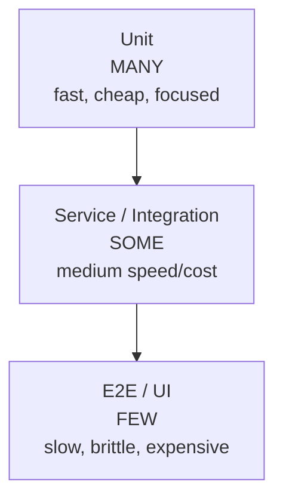
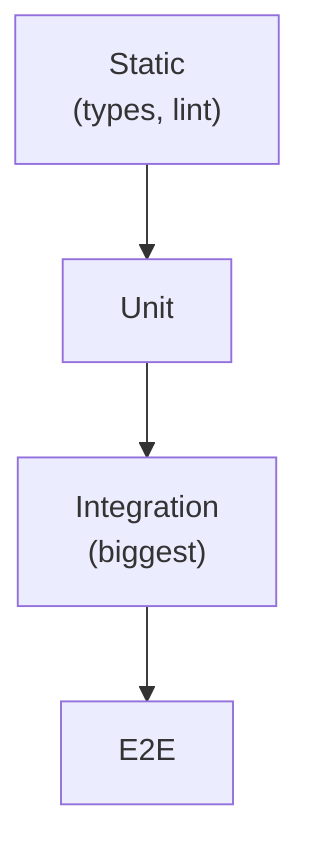
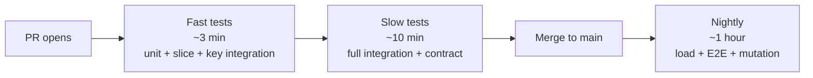

# The test pyramid & testing strategy

The *test pyramid* — coined by Mike Cohn in "Succeeding with Agile" (2009) — is the most influential mental model for structuring a test suite: many cheap fast unit tests at the base, fewer integration tests in the middle, very few slow brittle end-to-end tests at the top. It's the answer to "how much of each kind?" and underpins how mature teams budget time, structure CI, and decide what gets tested where. Yet it's also widely misapplied, mocked, and revised — Kent C. Dodds proposes a "testing trophy" with integration as the dominant layer, Spotify uses "honeycomb" instead, and the original pyramid was about *speed and cost*, not just count. Senior engineers don't memorize a shape; they understand the trade-offs and choose intentionally.

This topic synthesizes every tool in C09 — JUnit, slices, Testcontainers, BDD, contracts, mutation, load — into a coherent strategy. It covers the pyramid, its critiques, the trade-off framework (cost vs confidence vs speed), how to balance flaky tests, CI pipeline structure, and how senior engineers make the strategic test-vs-don't-test calls.

> [!NOTE]
> Prerequisites: all of C09 topics 1-7. This is the synthesis.

## The Original Pyramid (Cohn, 2009)



The proportions are rough — perhaps 70/20/10 — but the principle is firm:

- **Unit tests** dominate. Fast (ms each), focused on one unit, run constantly.
- **Service / integration tests** are fewer. Slower (seconds each), check wiring.
- **E2E** are minimal. Slowest (tens of seconds to minutes), most brittle, but only they prove the whole system works.

Why this shape:
- **Feedback speed**: developers want answers in seconds, not minutes.
- **Cost**: 1000 unit tests take minutes; 1000 E2E tests take hours.
- **Flakiness**: E2E tests are inherently more flaky (network, timing, env).
- **Isolation**: when a unit test fails, you know where; when E2E fails, you investigate.

## Martin Fowler's Refinement

Fowler (2018, "The Practical Test Pyramid") added nuance:
- **The terminology varies wildly** — "unit", "integration", "service", "E2E" mean different things in different shops.
- **Each team should define their own bands** by speed and isolation.
- **The shape matters more than the names**: keep the slow flaky tests few, the fast focused tests many.

## Kent C. Dodds' "Testing Trophy"

In the frontend world (2018), Dodds argued integration tests should *dominate*:



His argument: with React + JSDOM, "integration" is fast and gives high confidence; pure unit tests of components miss the user-perceived behavior.

For backend Java with Testcontainers, the argument is weaker — JPA integration tests are slow. The pyramid still applies to backend.

## Spotify Honeycomb

Spotify's variant (Andre Schaffer, 2018): "implementation detail tests are bad; integrated tests are good; integrated tests in process boundary are necessary".

```
        ___________
       / Integrated \
      /_____________\
     | Integration  |
      \_____________/
       \  Unit     /
        \_________/
```

This reflects microservices reality: the integration *between* services matters as much as the integration *within* a service.

## A 2026 Senior View

The shape isn't the point. The trade-offs are:

| Test type | Speed | Confidence | Brittleness | Cost |
|-----------|-------|------------|-------------|------|
| Static (types, lint) | instant | low | very low | low |
| Unit | ms | medium (logic) | low | low |
| Slice (@WebMvcTest, etc.) | ms-s | medium (one layer wiring) | low | low |
| Integration (@SpringBootTest + Testcontainers) | s-min | high (within-service) | medium | medium |
| Contract (Pact) | s | high (between services) | low | medium |
| Component (one deployable + mocks downstream) | s-min | high | medium | medium |
| E2E (full system) | min | very high | high | high |
| Load / soak | min-h | non-functional | medium | high |

Strategy: *use each type for what it's best at*.

## The Decision Tree

When writing a test, ask:

1. **What does this test verify?** A function's logic → unit. Wiring → integration. A contract → contract test. Customer journey → E2E.
2. **What's the cost of a regression?** High (payment) → more coverage. Low (UI tweak) → less.
3. **What's the feedback latency budget?** Dev workflow → seconds. PR check → minutes. Release gate → minutes.
4. **What's the simplest test that gives confidence?** Don't over-test.

## Concrete Strategy For A Spring Boot Microservice

A typical Spring Boot service test breakdown:

| Category | Tool | Count | When |
|----------|------|-------|------|
| Unit | JUnit + Mockito | 500-2000 | Every commit |
| `@WebMvcTest` | JUnit + Spring | 50-200 | Every commit |
| `@DataJpaTest` (H2 or TC) | JUnit + Spring | 30-100 | Every commit |
| `@SpringBootTest` + Testcontainers | JUnit + Spring + TC | 10-50 | Every commit |
| Contract (Pact) | Pact JVM | 5-30 per consumer | Every commit, broker on push |
| E2E | RestAssured / Cucumber | 5-20 | Pre-release |
| Load | Gatling | 1-10 | Nightly/weekly |
| Mutation | PIT | full | Weekly |

Total: ~2k-3k tests run in < 10 minutes. Load and mutation off-cycle.

## CI Pipeline Structure



Fast tier blocks PR merge. Slow tier blocks merge but runs in parallel or after fast. Nightly runs comprehensive checks.

## Flakiness — The Killer

A *flaky* test sometimes passes, sometimes fails, with no code change. Causes:
- Time-based assertions.
- Concurrency.
- Network calls.
- Shared state.
- Test order dependency.

Flaky tests are *worse* than no tests:
- Engineers ignore failures ("it's flaky").
- Real failures get masked.
- Re-running becomes the fix.

Discipline:
- **Quarantine**: flaky test goes in `@DisabledIfEnvironmentVariable`. Fix or delete.
- **Track flake rate**: aim < 0.5%.
- **No new tests added if flake rate exceeds threshold**.

Tools: GitHub's auto-retry, Buildkite flaky test detection.

## What NOT To Test

Wasted tests:
- **Getters/setters** without logic.
- **Framework internals** (don't test that `@Autowired` works).
- **Trivial DTO mapping** that's auto-generated.
- **Library code you don't own**.
- **Speculative future requirements** ("might need this").

Better to delete a useless test than maintain it.

## When To Skip Tests Altogether

Some code is genuinely throw-away:
- Spike work that won't ship.
- Migration scripts run once.
- Glue scripts.

Document why and move on.

## The "Test Maintenance Tax"

Every test has lifetime cost:
- Initial write.
- Re-running every CI.
- Updates when code changes.
- Debugging when it fails.

A test that fires once is rarely worth it. Aim for high signal per test.

## Senior Trade-Off Examples

### "Should I write a unit test or an integration test?"

If the logic is non-trivial and can be exercised in isolation → unit. If it requires multiple components or persistence → integration.

For Spring services: most business logic is unit-testable; controller flows want `@WebMvcTest`; repository queries want `@DataJpaTest` + Testcontainers.

### "Should I add an E2E test for this feature?"

Only if:
- It's a critical user journey.
- No other test type catches the failure mode.
- The team is willing to maintain it forever.

Otherwise, multiple contract tests + integration tests cover the same risk cheaper.

### "Should we use Cucumber?"

If non-engineers will read scenarios: yes. If only engineers: probably plain JUnit with descriptive names.

### "How much coverage is enough?"

There's no magic number. 70-80% line coverage is typical. Pair with mutation testing for quality signal. Don't chase 100% — last 10% has diminishing returns.

## Test Strategy Document

Mature teams maintain a `TESTING.md`:

```markdown
# Testing Strategy

## Philosophy
Pyramid. Many unit, few integration, very few E2E.

## Per Test Type

### Unit
- JUnit 5 + Mockito.
- For pure logic.
- < 100ms each.

### Integration
- @SpringBootTest + Testcontainers (Postgres).
- For DB queries, full request flow.
- < 30s each.

### Contract
- Pact JVM.
- For inter-service APIs.

### E2E
- Cucumber + REST-assured.
- Critical user journeys only.
- < 5min total.

## Coverage Targets
- 80% line coverage.
- 70% mutation score.
- < 0.5% flake rate.

## CI
- PR: fast + slow tier, < 10 min.
- Nightly: load + E2E + mutation.

## Flaky Tests
Quarantined immediately. Fixed within 1 week or deleted.
```

This document is the team's contract with itself.

## Anti-Patterns

> [!WARNING]
> **Inverted pyramid.** Few unit, many E2E. Slow, flaky.

> [!WARNING]
> **Ice cream cone.** Mostly manual + E2E + few unit. Worse.

> [!WARNING]
> **Tests as documentation only.** Never run, never updated.

> [!WARNING]
> **No flake tracking.** Quality erodes silently.

> [!WARNING]
> **One tool for everything.** Cucumber for unit tests. Awkward.

> [!WARNING]
> **No load tests.** Surprises in prod.

> [!WARNING]
> **No mutation testing.** Coverage lies.

> [!WARNING]
> **Tests that depend on each other.** Order-dependent suite.

> [!WARNING]
> **No CI tiering.** Slow tests block dev velocity.

## Common Misconceptions

> [!WARNING]
> **"The pyramid is dogma."** It's a heuristic. Adapt.

> [!WARNING]
> **"100% coverage = good tests."** Mutation testing disagrees.

> [!WARNING]
> **"E2E is the most important."** They catch fewest bugs per minute.

> [!WARNING]
> **"Skip integration; unit + E2E enough."** Wiring bugs hide in the middle.

> [!WARNING]
> **"Flaky tests will fix themselves."** They get worse.

## Practice

1. **Audit your suite**: count tests by type. What's the shape?
2. **Identify duplication**: which tests overlap?
3. **Flake rate**: measure last week's flake rate.
4. **CI tiering**: split into fast/slow tiers.
5. **Strategy doc**: write `TESTING.md` for your team.
6. **Pyramid for a feature**: design tests for a new feature; explain pyramid choices.
7. **Contract migration**: move one E2E test to contract testing.
8. **Mutation score**: run PIT; compare to coverage.
9. **Load smoke**: add a 1-min Gatling smoke to PR pipeline.

## Recap

You should now be able to:

- Describe the test pyramid and its variants.
- Choose the right test type for each concern.
- Structure a tiered CI pipeline.
- Manage flakiness aggressively.
- Author a team testing strategy.
- Avoid the common anti-patterns of test-suite design.

## C09 Closing

This concludes Chapter 9 — Testing — Advanced. The eight topics span:

1. Integration testing.
2. Spring Boot test slices.
3. Testcontainers.
4. Behavior-Driven Development (Cucumber).
5. Contract testing (Pact, Spring Cloud Contract).
6. Mutation testing (PIT).
7. Load & performance testing (JMeter, Gatling).
8. The test pyramid & strategy.

Together they give you the full repertoire — from the smallest JUnit test to multi-hour soak tests — and the strategic frame for using each. Combine with C10 (DevOps, Cloud & Observability) and you have the full picture of how Java backends are tested, shipped, observed, and operated in 2026.

The next chapter dives into [Tools & Environment (L4/C11)](../C11-tools-and-environment/README.md) — the build tools, IDEs, and supporting infrastructure that surround every Java project.
