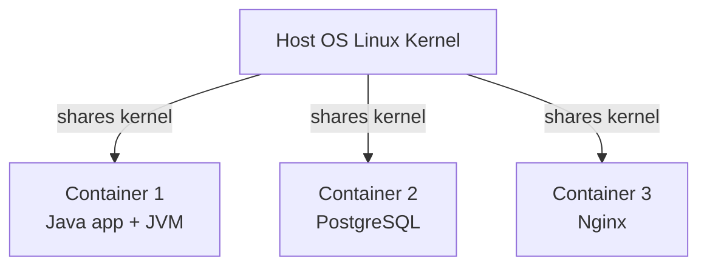
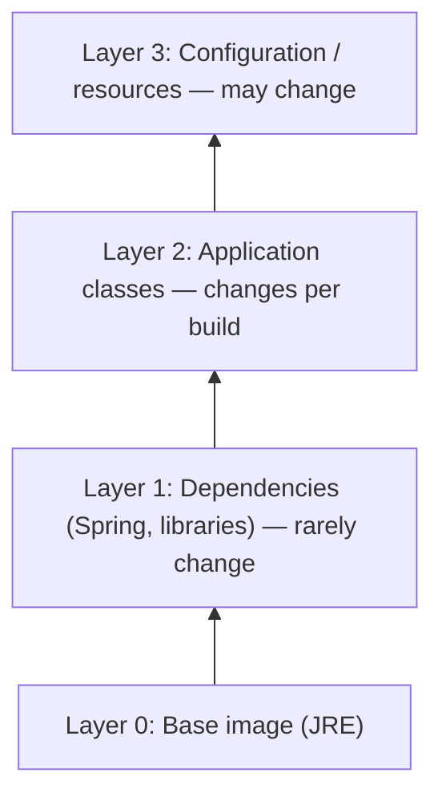

# Docker & containerization for Java

A container is a **standardized package** that bundles an application and its dependencies into a single, portable artifact. For Java services, that means the JVM, your fat JAR, and any required system libraries packaged so they run identically on a developer's laptop, a CI server, a staging cluster, and production. Containers solved the "works on my machine" problem that plagued the 2000s deployment story — JAR + sysadmin-tuned JVM + OS-specific shell scripts — and became the operational substrate of modern Java backends.

This topic covers the **mechanics** of containerization (Linux namespaces, cgroups, layered filesystems, OCI specifications), the specific issues of **running a JVM in a container** (heap sizing, CPU detection, container-aware ergonomics), and the **tools** for building Java containers (Docker, Jib, Cloud Native Buildpacks). A senior Java engineer in 2026 needs to know not just `docker build` but *why* containers behave the way they do and *how* to debug a JVM that's misbehaving inside one.

> [!NOTE]
> Prerequisites: command-line / Linux basics. Java packaging (fat JAR via Spring Boot, Gradle, or Maven shade).

## Why Containers — The 2013 Inflection

Before Docker (2013), Java deployments meant one of:
- **Application servers** (WebLogic, WebSphere, JBoss) — heavyweight, vendor-specific, slow to start.
- **Fat JARs deployed via SSH scripts** — works but unreproducible across environments.
- **VMs** — reproducible but heavy (gigabytes per image, minutes to boot).

**Docker's specific contribution**: a *standardized format* for packaging applications plus a *thin runtime layer* using existing Linux kernel features (namespaces, cgroups). The result: VM-like isolation at near-bare-metal performance and megabytes-per-image size.

For Java specifically, containers gave you:
1. **Reproducible JVM versions**: pin OpenJDK 21.0.2 exactly.
2. **Portable deployments**: the same image runs on any Linux machine.
3. **Fast startup**: seconds, not minutes.
4. **Density**: dozens of services per host instead of one VM.

By 2017, containers dominated new Java deployments. By 2023, even legacy enterprise applications had migrated.

## What A Container Actually Is

A container is **not a virtual machine**. It uses the host kernel directly. The "isolation" comes from Linux kernel features:



The mechanisms:

- **Namespaces** (Linux 2.6.24+, 2008): provide isolated views of system resources.
  - **PID namespace**: container sees only its own processes.
  - **Network namespace**: own network interfaces, IP, ports.
  - **Mount namespace**: own filesystem view.
  - **UTS namespace**: own hostname.
  - **User namespace**: container root maps to host non-root.
  - **IPC namespace**: own inter-process communication.

- **cgroups** (Linux 2.6.24+, 2008): limit and account for resource usage.
  - **CPU cgroup**: limit CPU time.
  - **Memory cgroup**: limit RAM.
  - **Block I/O cgroup**: limit disk throughput.
  - **PIDs cgroup**: limit process count.

- **Union filesystems** (OverlayFS, AUFS): layered images for efficient storage.

A container is the *combination* of all these — a process running in isolated namespaces with cgroup limits, using a layered filesystem.

## The OCI Specifications

By 2015, the container ecosystem fragmented (Docker, rkt, LXC). The **Open Container Initiative (OCI)** standardized:

- **OCI Image Specification**: how images are structured.
- **OCI Runtime Specification**: how containers are executed.
- **OCI Distribution Specification**: how images are distributed.

Modern container tools (containerd, CRI-O, Podman) all implement OCI. Docker is now *one* implementation among many. Your Java application image, built with Docker, runs on Podman, Kubernetes (using containerd), or anywhere OCI-compliant.

## The Layered Image Model

Container images are built as **layers**:

```dockerfile
FROM eclipse-temurin:21-jre-jammy    # base layer: OS + JRE
COPY app.jar /app/app.jar              # layer: your JAR
ENTRYPOINT ["java", "-jar", "/app/app.jar"]
```

Each instruction creates a **new layer**. Layers are immutable and content-addressed (SHA256). Benefits:
- **Caching**: unchanged layers are reused across builds.
- **Storage efficiency**: layers are shared across images.
- **Faster pulls**: only changed layers transfer.

The pull/push model: when you `docker pull`, only the layers you don't have are downloaded.

## The JVM-In-Container Problem (Pre-Java 10)

A specific Java-in-container problem persisted from 2014 to ~2018:

**The JVM didn't know it was in a container.** It detected host resources (e.g., 64 CPUs, 128GB RAM on a beefy host) and sized itself accordingly — even when the container's cgroup limit was 2 CPUs and 4GB RAM.

Symptoms:
- **OutOfMemoryError**: JVM allocated more memory than the cgroup allowed; cgroup killed the container.
- **Excessive thread counts**: `Runtime.getRuntime().availableProcessors()` returned host CPU count, leading to oversized thread pools.
- **GC instability**: garbage collector tuned for host, not for container.

The fix (incremental):
- **JDK 8u131** (2017): experimental cgroup awareness via `-XX:+UseCGroupMemoryLimitForHeap`.
- **JDK 10** (2018): container-awareness on by default (`UseContainerSupport`).
- **JDK 11+**: full container awareness for memory and CPU.

**Modern (2024)**: With JDK 17+ (the L4 target), JVM detects cgroup limits correctly. But you can still misconfigure it. Specific patterns:

```dockerfile
# OK in modern JDK: JVM detects container CPU/memory
FROM eclipse-temurin:21-jre-jammy
COPY app.jar /app/app.jar
ENTRYPOINT ["java", "-jar", "/app/app.jar"]
```

```dockerfile
# Better: explicit ratio + flags for clarity
FROM eclipse-temurin:21-jre-jammy
COPY app.jar /app/app.jar
ENTRYPOINT ["java", \
            "-XX:MaxRAMPercentage=75", \
            "-jar", "/app/app.jar"]
```

`MaxRAMPercentage=75` tells the JVM to use 75% of the cgroup memory limit for heap — leaving 25% for the JVM's own overhead (metaspace, code cache, thread stacks, direct buffers).

## Base Image Selection

The base image choice affects size, security, and compatibility.

| Base Image | Size | Notes |
|------------|------|-------|
| `eclipse-temurin:21-jdk` | ~350MB | Full JDK; needed for tools. Avoid for production. |
| `eclipse-temurin:21-jre-jammy` | ~250MB | JRE only; standard Ubuntu/Debian base. |
| `eclipse-temurin:21-jre-alpine` | ~180MB | Alpine Linux; musl libc — may break some libs. |
| `gcr.io/distroless/java21` | ~150MB | Google distroless; minimal; no shell. |
| `eclipse-temurin:21-jre-noble` | ~250MB | Ubuntu 24.04 Noble base. |

**Recommendations (2024)**:
- **Default**: `eclipse-temurin:21-jre-jammy` (Ubuntu LTS, JRE only).
- **Security-conscious**: `distroless/java21` (no shell, smaller attack surface).
- **Avoid**: Alpine for production Java — musl libc has subtle differences from glibc that can cause obscure bugs.
- **Avoid**: Oracle JDK in production unless you have a license.

## Multi-Architecture Builds (ARM64)

Apple Silicon Macs (M1+, 2020) and AWS Graviton (ARM64-based) have made multi-architecture builds essential. A Java image typically needs both `linux/amd64` and `linux/arm64`.

```bash
# Build for both architectures
docker buildx build \
  --platform linux/amd64,linux/arm64 \
  -t myapp:latest \
  --push .
```

Eclipse Temurin and most major base images ship multi-arch manifests. Your image inherits multi-arch support if you don't add arch-specific binaries.

**Specific gotcha**: native libraries (Netty epoll, BoringSSL, snappy) often ship per-architecture binaries. Test on both architectures.

## Image Build Tools For Java

Three primary approaches:

### Docker (Dockerfile)

The traditional approach. Maximum flexibility, manual layer optimization:

```dockerfile
# Multi-stage build
FROM eclipse-temurin:21-jdk AS builder
WORKDIR /app
COPY . .
RUN ./gradlew bootJar

FROM eclipse-temurin:21-jre-jammy
COPY --from=builder /app/build/libs/*.jar /app/app.jar
EXPOSE 8080
ENTRYPOINT ["java", "-jar", "/app/app.jar"]
```

Pros: explicit, well-understood.
Cons: every team writes Dockerfiles differently; layer optimization is manual.

### Jib (Google)

A Maven/Gradle plugin that builds images without Dockerfile or Docker daemon:

```xml
<plugin>
  <groupId>com.google.cloud.tools</groupId>
  <artifactId>jib-maven-plugin</artifactId>
  <version>3.4.0</version>
  <configuration>
    <to>
      <image>gcr.io/myproject/myapp</image>
    </to>
  </configuration>
</plugin>
```

```bash
mvn compile jib:build
```

Pros: optimal layer splitting (dependencies + classes + resources as separate layers), no Docker daemon required.
Cons: less flexible than Dockerfile, Google-managed.

### Spring Boot Built-in (Cloud Native Buildpacks)

Spring Boot 2.3+ includes built-in image building via Cloud Native Buildpacks (Paketo):

```bash
./gradlew bootBuildImage
```

Or with Maven:
```bash
mvn spring-boot:build-image
```

Pros: zero configuration, auto-detects best base image, includes JVM tuning.
Cons: less control, slower than Jib.

**The senior choice**: Jib for serious production use (best layer caching, fastest builds), Buildpacks for prototypes (easiest), Dockerfile for unusual requirements.

## Container Layers For Java

Optimal layer structure for a Spring Boot app:



When you change your application code, only Layer 2 is rebuilt and re-pushed. Layer 1 (which is by far the largest, often hundreds of MB) is cached.

Spring Boot 2.3+ supports this via "layered JARs":

```bash
java -Djarmode=layertools -jar app.jar extract
```

Resulting structure:
- `dependencies/`: third-party libraries.
- `spring-boot-loader/`: Spring Boot's loader.
- `snapshot-dependencies/`: snapshot deps.
- `application/`: your classes.

Reference Dockerfile using layered JARs:

```dockerfile
FROM eclipse-temurin:21-jdk AS builder
WORKDIR /app
COPY *.jar app.jar
RUN java -Djarmode=layertools -jar app.jar extract

FROM eclipse-temurin:21-jre-jammy
WORKDIR /app
COPY --from=builder /app/dependencies/ ./
COPY --from=builder /app/spring-boot-loader/ ./
COPY --from=builder /app/snapshot-dependencies/ ./
COPY --from=builder /app/application/ ./
ENTRYPOINT ["java", "org.springframework.boot.loader.launch.JarLauncher"]
```

## Container Networking Basics

Each container gets:
- **Loopback interface** (`lo`).
- **Container-network interface** connected to a bridge.
- **Allocated IP** (default: 172.17.x.x range).

When you `docker run -p 8080:8080`, Docker:
1. Allocates a host port (8080).
2. Sets up iptables rules to forward host:8080 to container:8080.
3. Forwards traffic.

**For Java**: `-p 8080:8080` is host:container. Your Java app inside the container listens on 8080; clients hit the host's 8080.

In Kubernetes (covered in T03), this is more complex — services, ingresses, network policies.

## Storage And Volumes

Container filesystems are **ephemeral** — changes are lost when the container stops. For persistent data:

```bash
# Bind mount (development): host path → container path
docker run -v /host/data:/app/data myapp

# Named volume (production): managed by Docker
docker run -v mydata:/app/data myapp
```

**For Java**: usually you don't need persistent storage in containers. State lives in databases (separate containers or managed services).

## Common Java Container Anti-Patterns

> [!WARNING]
> **Using JDK image in production.** The JDK includes compilers and dev tools (~350MB). Use JRE for production (~250MB).

> [!WARNING]
> **Running as root.** Default for many images. Use `USER` directive to drop privileges.
> ```dockerfile
> RUN useradd -m -s /bin/bash appuser
> USER appuser
> ```

> [!WARNING]
> **Not setting heap explicitly.** Modern JDK detects cgroup limits, but `-XX:MaxRAMPercentage=75` is more predictable.

> [!WARNING]
> **Forgetting `-XshowSettings:vm`.** Use during testing to see what the JVM detects.

> [!WARNING]
> **Latest tag in production.** `eclipse-temurin:21` is stable; `eclipse-temurin:latest` shifts unpredictably.

> [!WARNING]
> **Building dev and prod images differently.** Use multi-stage builds; the prod image should be tested in the same shape as it deploys.

## Common Misconceptions

> [!WARNING]
> **"Containers are lightweight VMs."** They share the kernel. Different isolation model.

> [!WARNING]
> **"Container = security boundary."** Limited isolation. A kernel exploit affects all containers.

> [!WARNING]
> **"Docker = containers."** Docker is one runtime. OCI standardizes the format.

> [!WARNING]
> **"Smaller image = better."** Sometimes true; sometimes the cost of a more complex base image (Alpine) outweighs the size savings (debugging difficulty).

## Practice

1. **Write a Dockerfile** for a Spring Boot app using `eclipse-temurin:21-jre-jammy`. Measure the image size.
2. **Convert to multi-stage build**: separate build and runtime stages. Compare image size.
3. **Use Jib**: build the same app via `mvn compile jib:build`. Compare layer count.
4. **Inspect layers**: `docker history myapp:latest`. Identify the largest layer.
5. **Test container memory**: run with `-m 512m` and observe JVM behavior. Use `-XshowSettings:vm` to see detected limits.
6. **Run as non-root**: add `USER` directive. Verify `id` inside the container.
7. **Multi-arch build**: use `docker buildx` to build for amd64 and arm64. Push and pull.
8. **Distroless build**: convert your image to `gcr.io/distroless/java21`. Verify it works.
9. **Layered JAR**: use Spring Boot's layered JAR feature. Verify layer count.
10. **Benchmark startup**: time `java -jar` from the container start.

## Recap

You should now be able to:

- Explain what a container is (namespaces + cgroups + layered filesystem).
- Understand the JVM-in-container problem and how modern JDK fixes it.
- Choose appropriate base images (jre-jammy default; distroless for security).
- Build Java container images with Docker, Jib, or Spring Boot Buildpacks.
- Optimize image layers for cache reuse via Spring Boot layered JARs.
- Avoid common Java container anti-patterns (root user, JDK image, latest tag).
- Build multi-arch images for amd64 and arm64.

## Next

Continue to [Dockerfile best practices for Java apps](./T02-dockerfile-best-practices-for-java-apps.md) — the specific Dockerfile patterns and anti-patterns for Spring Boot services in production.
