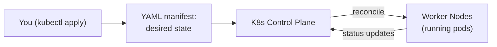
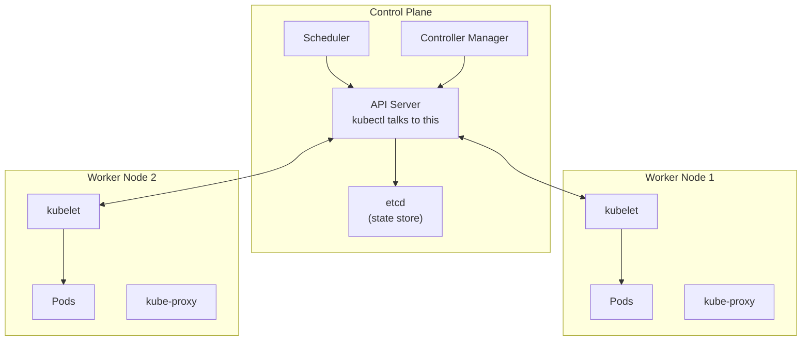

# Kubernetes basics

Kubernetes (often written K8s) is the **container orchestrator** that took over the industry between 2015 and 2020. If your Java service runs in production at a company larger than ~50 engineers, it's very likely running on Kubernetes — at AWS via EKS, at Google via GKE, at Azure via AKS, or on-premises via vanilla K8s, OpenShift, or Rancher. Understanding Kubernetes basics is now a baseline requirement for senior Java backend engineers, even if the platform team manages the cluster.

This topic covers what Kubernetes *is* (a declarative system for running containers), the core objects (Pods, Deployments, Services, ConfigMaps, Secrets, Ingress), the control plane components, and the specific patterns for running Spring Boot applications on K8s. Deep Kubernetes operations (scheduling, networking internals, custom controllers) are senior-platform-engineer territory; this topic is the working knowledge a senior application engineer needs.

> [!NOTE]
> Prerequisites: [Docker basics (L4/C10/T01)](./T01-docker-and-containerization-for-java.md). YAML literacy (Kubernetes is YAML-heavy).

## Why Kubernetes Won — The 2015 To 2020 Story

Before Kubernetes, multiple container orchestrators competed:
- **Docker Swarm** (2014): simple, integrated with Docker.
- **Apache Mesos** (2009) + **Marathon** (2014): powerful, complex.
- **Kubernetes** (2014, open-sourced by Google).
- **AWS ECS** (2014): AWS-specific.
- **HashiCorp Nomad** (2015): simpler alternative.

Kubernetes won because:
1. **Google's Borg heritage**: K8s is the open-source descendant of Borg, Google's internal orchestrator since 2003. Battle-tested concepts.
2. **CNCF foundation**: donated to the Cloud Native Computing Foundation in 2015, ensuring vendor-neutral governance.
3. **Ecosystem**: every cloud provider built managed K8s; every CI/CD tool integrated.
4. **Network effects**: the more popular, the more skilled engineers and tools, the more adoption.

By 2020, K8s was the de facto standard. By 2024, alternatives are niche (Nomad still exists; Mesos is end-of-life).

## What Kubernetes Is

Kubernetes is a **declarative orchestration system**. You declare *what* state you want (e.g., "3 replicas of my Spring Boot app, exposed on port 8080"); K8s makes the cluster match.



The control loop:
1. You apply a manifest (the desired state).
2. K8s control plane stores it in etcd.
3. Controllers continuously compare desired state to actual state.
4. When they diverge, controllers take action (start pods, restart failures, etc.).

This **reconciliation pattern** is the heart of K8s. Everything else is consequences of this design.

## Core Objects

### Pod

The smallest deployable unit. Usually one container per pod; sometimes multiple (sidecar pattern).

```yaml
apiVersion: v1
kind: Pod
metadata:
  name: myapp-pod
spec:
  containers:
  - name: myapp
    image: myregistry/myapp:1.2.3
    ports:
    - containerPort: 8080
```

Pods are **ephemeral**. They can be killed, restarted, rescheduled to other nodes. Don't manage Pods directly; use Deployments.

### Deployment

Manages a set of identical Pods (a "ReplicaSet"). Provides rolling updates, rollback, scaling.

```yaml
apiVersion: apps/v1
kind: Deployment
metadata:
  name: myapp
spec:
  replicas: 3
  selector:
    matchLabels:
      app: myapp
  template:
    metadata:
      labels:
        app: myapp
    spec:
      containers:
      - name: myapp
        image: myregistry/myapp:1.2.3
        ports:
        - containerPort: 8080
        resources:
          requests:
            memory: "512Mi"
            cpu: "500m"
          limits:
            memory: "1Gi"
            cpu: "1000m"
```

Critical: **resource requests vs limits**.
- **Requests**: minimum resources guaranteed.
- **Limits**: maximum resources allowed.
- **CPU limit**: throttling when hit.
- **Memory limit**: OOMKilled when hit.

For Java, set limits high enough to accommodate the JVM (heap + overhead). MaxRAMPercentage of 75% is reasonable.

### Service

Stable network endpoint for a set of Pods. Pods are ephemeral; Services aren't.

```yaml
apiVersion: v1
kind: Service
metadata:
  name: myapp-service
spec:
  selector:
    app: myapp
  ports:
  - port: 80
    targetPort: 8080
  type: ClusterIP
```

Service types:
- **ClusterIP** (default): accessible only within the cluster.
- **NodePort**: exposed on each node's IP at a static port.
- **LoadBalancer**: provisions a cloud load balancer.
- **ExternalName**: alias for an external DNS name.

For internal microservice communication, use ClusterIP. For external access, use LoadBalancer or Ingress.

### Ingress

HTTP routing layer. Routes external traffic to internal Services.

```yaml
apiVersion: networking.k8s.io/v1
kind: Ingress
metadata:
  name: myapp-ingress
spec:
  rules:
  - host: api.example.com
    http:
      paths:
      - path: /myapp
        pathType: Prefix
        backend:
          service:
            name: myapp-service
            port:
              number: 80
```

Requires an Ingress controller (nginx-ingress, AWS ALB Controller, Traefik). Without a controller, Ingress objects do nothing.

### ConfigMap

Configuration data injected into containers.

```yaml
apiVersion: v1
kind: ConfigMap
metadata:
  name: myapp-config
data:
  application.properties: |
    spring.datasource.url=jdbc:postgresql://db:5432/mydb
    server.port=8080
  log-level: INFO
```

Mount as a file or environment variable:

```yaml
spec:
  containers:
  - name: myapp
    image: myapp:1.2.3
    envFrom:
    - configMapRef:
        name: myapp-config
    volumeMounts:
    - name: config
      mountPath: /config
  volumes:
  - name: config
    configMap:
      name: myapp-config
```

### Secret

Like ConfigMap but for sensitive data. Base64-encoded by default (not encrypted!). Use external secret managers (Vault, AWS Secrets Manager) for real security.

```yaml
apiVersion: v1
kind: Secret
metadata:
  name: myapp-secrets
type: Opaque
data:
  db-password: cGFzc3dvcmQxMjM=  # base64
```

Mount the same way as ConfigMap.

### Namespace

Virtual cluster division. Group resources logically.

```yaml
apiVersion: v1
kind: Namespace
metadata:
  name: production
```

Common pattern: `dev`, `staging`, `production` namespaces in the same cluster.

## The Control Plane

Components that manage the cluster:



- **API Server**: the entry point. All operations go through here.
- **etcd**: distributed key-value store. The cluster's source of truth.
- **Scheduler**: decides which node runs each pod.
- **Controller Manager**: runs control loops (Deployment controller, ReplicaSet controller, etc.).
- **kubelet**: agent on each node; runs pods, reports status.
- **kube-proxy**: network proxy on each node; implements Services.

In managed K8s (EKS, GKE, AKS), the control plane is hidden. You don't manage it.

## kubectl — The CLI

Daily operations:

```bash
# Cluster info
kubectl cluster-info
kubectl get nodes

# Pods
kubectl get pods
kubectl get pods -n production
kubectl describe pod myapp-abc123
kubectl logs myapp-abc123
kubectl logs -f myapp-abc123      # follow
kubectl logs myapp-abc123 --previous   # previous container

# Deployments
kubectl get deployments
kubectl scale deployment myapp --replicas=5
kubectl rollout status deployment/myapp
kubectl rollout undo deployment/myapp

# Apply YAML
kubectl apply -f myapp.yaml
kubectl delete -f myapp.yaml

# Debug
kubectl exec -it myapp-abc123 -- /bin/sh
kubectl port-forward pod/myapp-abc123 8080:8080
kubectl top pod myapp-abc123        # resource usage

# Quick edit
kubectl edit deployment myapp
```

## Spring Boot On Kubernetes — Production Pattern

A complete deployment for a Spring Boot service:

```yaml
apiVersion: apps/v1
kind: Deployment
metadata:
  name: orders-api
  namespace: production
  labels:
    app: orders-api
    version: 1.2.3
spec:
  replicas: 3
  selector:
    matchLabels:
      app: orders-api
  strategy:
    type: RollingUpdate
    rollingUpdate:
      maxUnavailable: 1
      maxSurge: 1
  template:
    metadata:
      labels:
        app: orders-api
        version: 1.2.3
    spec:
      containers:
      - name: orders-api
        image: registry.example.com/orders-api:1.2.3
        imagePullPolicy: IfNotPresent
        ports:
        - name: http
          containerPort: 8080
        env:
        - name: SPRING_PROFILES_ACTIVE
          value: "production"
        envFrom:
        - configMapRef:
            name: orders-api-config
        - secretRef:
            name: orders-api-secrets
        resources:
          requests:
            memory: "768Mi"
            cpu: "500m"
          limits:
            memory: "1Gi"
            cpu: "1000m"
        livenessProbe:
          httpGet:
            path: /actuator/health/liveness
            port: http
          initialDelaySeconds: 30
          periodSeconds: 10
          failureThreshold: 3
        readinessProbe:
          httpGet:
            path: /actuator/health/readiness
            port: http
          initialDelaySeconds: 10
          periodSeconds: 5
          failureThreshold: 3
        lifecycle:
          preStop:
            exec:
              command: ["/bin/sh", "-c", "sleep 10"]
---
apiVersion: v1
kind: Service
metadata:
  name: orders-api
  namespace: production
spec:
  selector:
    app: orders-api
  ports:
  - port: 80
    targetPort: 8080
  type: ClusterIP
```

Notes:
- **Liveness probe**: K8s kills the pod if this fails. Use `/actuator/health/liveness` (Spring Boot 2.3+).
- **Readiness probe**: K8s removes the pod from Service endpoints if this fails. Use `/actuator/health/readiness`.
- **preStop hook**: 10-second delay before sending SIGTERM, allowing in-flight requests to complete.
- **maxUnavailable=1, maxSurge=1**: rolling update with one extra pod and one fewer pod allowed during deploy.

## ConfigMap Vs Secret For Spring Boot

Recommended:
- Application properties → ConfigMap.
- Database passwords, API keys → Secret (sourced from Vault/AWS Secrets Manager via External Secrets Operator).

For Spring Boot:
```yaml
envFrom:
- configMapRef:
    name: myapp-config
- secretRef:
    name: myapp-secrets
```

Spring Boot picks up environment variables matching property names (with case conversion). `SPRING_DATASOURCE_URL=...` becomes `spring.datasource.url=...`.

## Helm — The Package Manager

Plain YAML is verbose. **Helm** templates it:

```yaml
# values.yaml
replicaCount: 3
image:
  repository: myapp
  tag: 1.2.3
resources:
  requests:
    memory: "768Mi"
    cpu: "500m"
```

```yaml
# templates/deployment.yaml
apiVersion: apps/v1
kind: Deployment
spec:
  replicas: {{ .Values.replicaCount }}
  template:
    spec:
      containers:
      - image: "{{ .Values.image.repository }}:{{ .Values.image.tag }}"
        resources:
          {{- toYaml .Values.resources | nindent 10 }}
```

Install/upgrade:
```bash
helm install myapp ./mychart
helm upgrade myapp ./mychart --set image.tag=1.2.4
```

Helm is dominant for distributing third-party software (Postgres, Redis, monitoring stacks). For internal apps, plain YAML or Kustomize is common.

## Kustomize — The Plain-YAML Alternative

Kustomize (built into kubectl since 1.14) lets you compose YAML without templating:

```yaml
# base/kustomization.yaml
resources:
- deployment.yaml
- service.yaml

# overlays/production/kustomization.yaml
bases:
- ../../base
patchesStrategicMerge:
- production-replicas.yaml
namespace: production
```

```bash
kubectl apply -k overlays/production/
```

Pros: no templating, plain YAML.
Cons: less flexible than Helm.

Most teams use one or the other. Some use both (Helm for third-party, Kustomize for internal).

## Common Java-On-K8s Anti-Patterns

> [!WARNING]
> **Java heap larger than container memory limit.** OOMKilled by kubelet. Use `MaxRAMPercentage=75`.

> [!WARNING]
> **CPU limits below 1 CPU.** JVM thread counts may be wrong; throttling severely affects GC.

> [!WARNING]
> **Liveness probe pointing to `/actuator/health` (the deep one).** May fail during heavy load even when app is alive. Use `/actuator/health/liveness` for shallow check.

> [!WARNING]
> **No preStop hook.** SIGTERM arrives during in-flight requests; ungraceful shutdown.

> [!WARNING]
> **Same image for dev and prod with environment-specific config baked in.** Defeats portability.

> [!WARNING]
> **Latest image tag.** Cannot reproduce deployments.

> [!WARNING]
> **`imagePullPolicy: Always`.** Slow; pulls on every restart even if image is local. Use `IfNotPresent`.

> [!WARNING]
> **No resource requests.** K8s can't schedule efficiently; noisy neighbor problems.

> [!WARNING]
> **Putting secrets in ConfigMap.** Bad. Use Secret (or better: external secret manager).

## Common Misconceptions

> [!WARNING]
> **"Kubernetes is for microservices only."** No. K8s also runs monoliths fine. The complexity overhead is the question.

> [!WARNING]
> **"Pods are like VMs."** No. Pods are ephemeral. Don't store state in pod filesystems.

> [!WARNING]
> **"Services are load balancers."** Partially. They're L4 round-robin. Real L7 routing is via Ingress.

> [!WARNING]
> **"Kubernetes will autoscale my app for free."** It can, with HorizontalPodAutoscaler. But auto-scaling requires app readiness, metrics, and tuning.

> [!WARNING]
> **"Helm is required."** No. Plain YAML or Kustomize work fine for many apps.

## Practice

1. **Local cluster**: install Docker Desktop or Minikube. Verify with `kubectl get nodes`.
2. **Deploy Spring Boot app**: write Deployment, Service, ConfigMap YAMLs. Apply.
3. **Scale**: `kubectl scale deployment myapp --replicas=5`. Observe.
4. **Rolling update**: change image tag. Apply. Watch rollout via `kubectl rollout status`.
5. **Probes**: configure liveness and readiness probes pointing to Spring Boot Actuator.
6. **ConfigMap injection**: inject Spring properties via ConfigMap. Verify via `/actuator/env`.
7. **Secret injection**: inject DB password via Secret. Verify it's available.
8. **Port-forward**: `kubectl port-forward svc/myapp 8080:80`. Hit it from localhost.
9. **Debug a crashing pod**: deliberately misconfigure. Use `kubectl describe`, `kubectl logs --previous`.
10. **Resource limits**: set very low memory limits. Observe OOMKilled.

## Recap

You should now be able to:

- Explain what Kubernetes is (declarative orchestration) and why it won.
- Identify core objects: Pod, Deployment, Service, Ingress, ConfigMap, Secret, Namespace.
- Use kubectl for daily operations: apply, get, describe, logs, exec, port-forward.
- Write production-quality Deployment YAML for Spring Boot.
- Configure liveness and readiness probes correctly.
- Use ConfigMap and Secret for configuration injection.
- Set resource requests and limits.
- Choose between Helm and Kustomize for templating.
- Avoid common Java-on-K8s anti-patterns.

## Next

Continue to [CI/CD concepts](./T04-ci-cd-concepts.md) — the principles of continuous integration and continuous delivery that turn your container builds into production deployments.
