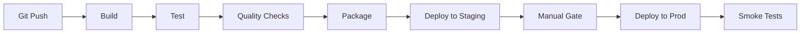
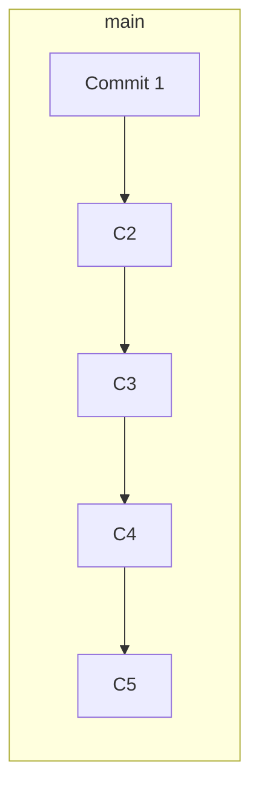
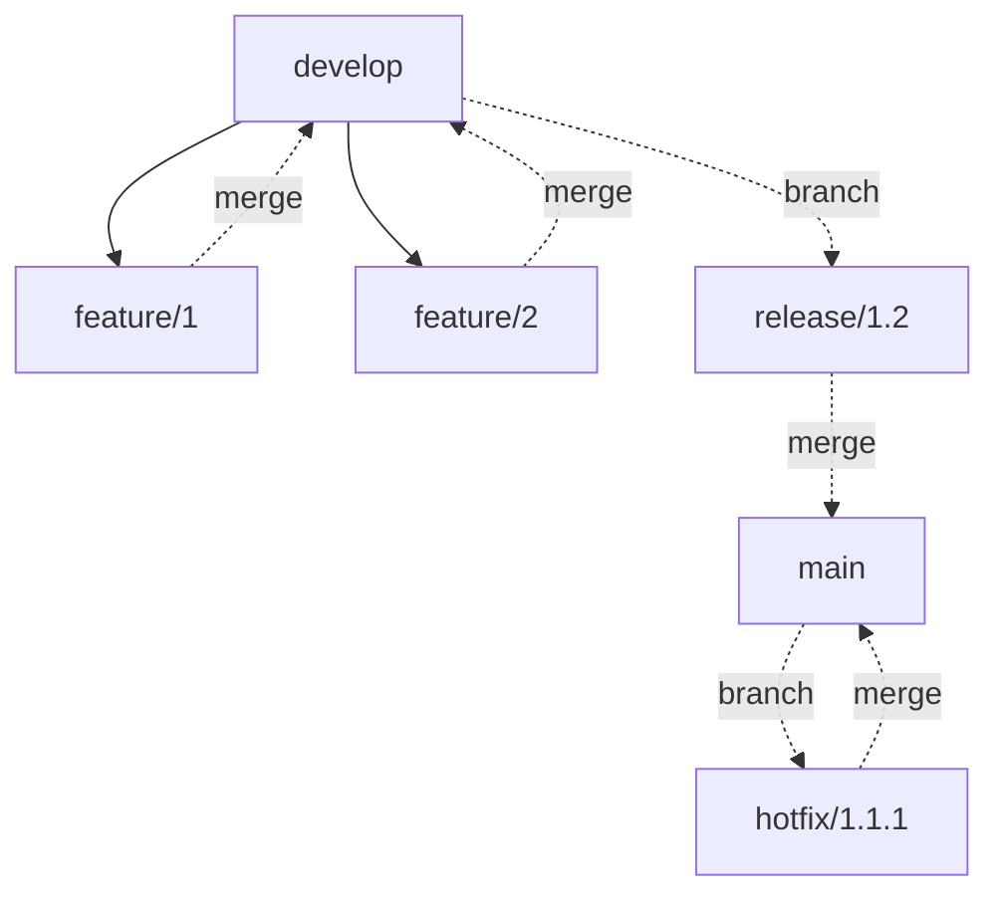

# CI/CD concepts

CI/CD — **Continuous Integration** and **Continuous Delivery/Deployment** — is the discipline of *automating* the path from a code commit to running production code. A well-functioning CI/CD pipeline takes a Java engineer's `git push` and, within minutes, has built the application, run tests, packaged a container image, and deployed it to staging — sometimes to production directly. Without CI/CD, software releases are manual, error-prone, and infrequent; with it, teams ship dozens of times per day with high confidence.

This topic covers the *concepts*: what CI vs CD means precisely, the philosophy behind each, the pipeline stages, the metrics that measure CI/CD effectiveness (DORA), the branching strategies (trunk-based vs Gitflow), and the trade-offs. Specific tools (GitHub Actions, Jenkins, GitLab CI) are covered in T05.

> [!NOTE]
> Prerequisites: Git basics. Build tools (Maven, Gradle).

## CI Vs CD — The Distinctions

Three related concepts often conflated:

### Continuous Integration (CI)

**Continuous Integration** = engineers merge their work to a shared mainline *frequently* (multiple times per day), with each merge triggering an *automated build and test*.

The original definition (Martin Fowler, 2006): "Continuous Integration is a software development practice where members of a team integrate their work frequently, usually each person integrates at least daily — leading to multiple integrations per day. Each integration is verified by an automated build (including test) to detect integration errors as quickly as possible."

Key practices:
- **Single source repository**.
- **Automated build**.
- **Self-testing build** (unit tests run automatically).
- **Daily commits to mainline**.
- **Every commit triggers a build**.
- **Fast builds** (under 10 minutes ideally).
- **Test in clone of production**.
- **Anyone can see build status**.

The benefit: integration problems are caught hourly, not weekly. Refactoring is safer. Releases are smaller.

### Continuous Delivery (CD)

**Continuous Delivery** = the codebase is *always* in a deployable state. Releases require a *push of a button* but not always automated to production.

Continuous Delivery extends CI by:
- Automating the path through testing environments (staging, pre-prod).
- Producing deployable artifacts on every commit.
- Making release decisions human-triggered but mechanically simple.

The benefit: when the business needs to release, you can — within minutes — not days of preparation.

### Continuous Deployment

**Continuous Deployment** = every change that passes automated tests is automatically deployed to production. No human approval gate.

This is the most aggressive form. Used by:
- Netflix.
- GitHub (mostly).
- Facebook (with extensive testing).
- Many startups.

Not used by:
- Highly regulated industries (banking, healthcare).
- Systems with extreme failure costs (medical devices, aerospace).

The senior insight: **Continuous Delivery is the goal for most teams**; Continuous Deployment is a more aggressive variant suitable for some teams.

## The Pipeline Stages

A typical CI/CD pipeline for Java:



Each stage:

### Build

```bash
./gradlew compileJava
# or
mvn compile
```

Compiles source code. Catches syntax errors, missing dependencies.

Typical time: 30 seconds to 5 minutes for Java projects.

### Test

Multiple test phases:

1. **Unit tests**: fast, isolated.
   ```bash
   ./gradlew test
   ```
2. **Integration tests**: slower, with dependencies.
   ```bash
   ./gradlew integrationTest
   ```
3. **End-to-end tests**: slowest, real environments.

Tests should be:
- **Fast** (parallelizable).
- **Reliable** (no flaky tests).
- **Independent** (no shared state).

Time budget: < 10 minutes for unit + integration. E2E may be longer.

### Quality Checks

- **Static analysis** (SpotBugs, PMD, Checkstyle): code smell detection.
- **Security scanning** (Snyk, Dependabot, OWASP Dependency-Check): CVE detection.
- **Code coverage** (JaCoCo): test coverage.
- **License compliance**: track dependency licenses.

Quality gates fail the build on critical issues.

### Package

For Java: build JAR/WAR and Docker image.

```bash
./gradlew bootJar
docker build -t myapp:${GIT_SHA} .
```

The image is tagged with git commit SHA (for traceability) and possibly other tags (branch name, version).

### Push To Registry

```bash
docker push registry.example.com/myapp:${GIT_SHA}
```

The image lives in a container registry (Docker Hub, ECR, GCR, ACR, Harbor).

### Deploy To Staging

```bash
kubectl set image deployment/myapp myapp=registry.example.com/myapp:${GIT_SHA} -n staging
```

Or via Helm:
```bash
helm upgrade myapp ./mychart --set image.tag=${GIT_SHA} -n staging
```

### Verify Staging

- Smoke tests.
- Integration tests against staging.
- Manual verification (sometimes).

### Production Gate

For Continuous Delivery: a human approves the deployment.

For Continuous Deployment: automated (if all prior stages passed).

### Deploy To Production

Same mechanism as staging deploy.

### Post-Deploy Verification

- Smoke tests.
- Monitor metrics for anomalies.
- Automated rollback if metrics regress.

## Branching Strategies

The branching strategy affects CI/CD significantly.

### Trunk-Based Development

All engineers commit to a single mainline branch (`main` or `trunk`). Feature flags hide incomplete work.



Pros:
- **Continuous integration**: no merge surprises.
- **Fast iteration**: small changes ship quickly.
- **Required for true CD**.

Cons:
- **Discipline required**: don't commit broken code.
- **Feature flags essential**: hide incomplete work.

Used by: Google, Facebook, most modern tech companies.

### Gitflow

Long-lived feature branches, release branches, hotfix branches.



Pros:
- **Clear structure**.
- **Isolated work**.

Cons:
- **Merge hell**: long-lived branches diverge.
- **Slow integration**: bugs found late.
- **Incompatible with true CI**.

Largely deprecated for new projects. Originally proposed by Vincent Driessen in 2010; Driessen himself updated in 2020 saying it's not the right answer for most modern projects.

### GitHub Flow

A middle ground:
- `main` is always deployable.
- Feature branches are short-lived (hours to days).
- Merge to main via pull request.

Most common modern pattern for application teams.

## DORA Metrics

The **DevOps Research and Assessment** (DORA) team at Google identified four metrics that predict high-performing engineering organizations:

| Metric | Elite | High | Medium | Low |
|--------|-------|------|--------|-----|
| **Deployment Frequency** | On demand (multiple/day) | Weekly to monthly | Monthly to 6 months | Less than 6 months |
| **Lead Time for Changes** | < 1 hour | 1 day to 1 week | 1 week to 1 month | 1 month to 6 months |
| **MTTR** (Mean Time to Restore) | < 1 hour | < 1 day | < 1 week | > 6 months |
| **Change Failure Rate** | 0-15% | 16-30% | 16-30% | 16-30% |

Sources: DORA's *State of DevOps Report*, annual since 2014.

**Elite performers** deploy multiple times per day with < 1 hour lead time and < 15% failure rate. Most companies are nowhere near this; the gap is bridged by investing in CI/CD.

## CI/CD Anti-Patterns

> [!WARNING]
> **Manual deployments to production.** No matter how careful, manual deploys have higher error rates than automated ones.

> [!WARNING]
> **Long-running feature branches.** Merge hell, late bug discovery.

> [!WARNING]
> **Flaky tests.** Teams stop trusting them. Quarantine and fix.

> [!WARNING]
> **Builds that take 30+ minutes.** Engineers context-switch; quality drops.

> [!WARNING]
> **Building only on the main branch.** PRs should also build and test.

> [!WARNING]
> **No automated rollback.** Manual rollback during incidents is slow.

> [!WARNING]
> **Different artifacts for different environments.** Deploy the same artifact everywhere; only config differs.

> [!WARNING]
> **Environment-specific builds.** Same artifact, different config.

> [!WARNING]
> **No artifact storage.** Rebuilding instead of pulling slows things down.

> [!WARNING]
> **Skipping tests "just this once".** Teams find that bypass becomes habit.

## Common Misconceptions

> [!WARNING]
> **"CI/CD requires Kubernetes."** No. CI/CD predates K8s. You can CI/CD a JAR to any deployment target.

> [!WARNING]
> **"Continuous deployment is too risky."** Done right (with feature flags, canary, monitoring), CD is *less* risky than infrequent manual deploys.

> [!WARNING]
> **"We can add CI/CD later."** Retrofitting is much harder than building it in from the start.

> [!WARNING]
> **"More tests = better CI."** Test quality matters more than quantity. Slow flaky tests damage CI.

> [!WARNING]
> **"CI/CD eliminates the need for QA."** It shifts QA to earlier stages and automation, not eliminates.

## The Pipeline-As-Code Movement

Modern CI/CD uses *code* to define pipelines, not GUI configuration:

```yaml
# GitHub Actions
name: CI/CD
on: push
jobs:
  build:
    runs-on: ubuntu-latest
    steps:
    - uses: actions/checkout@v4
    - uses: actions/setup-java@v4
      with:
        java-version: 21
    - run: ./gradlew build
```

Benefits:
- **Versioned**: pipeline changes are tracked in git.
- **Reviewed**: PR review covers pipeline changes.
- **Reproducible**: same pipeline runs everywhere.

Tools: GitHub Actions (YAML), GitLab CI (YAML), Jenkins (Jenkinsfile/Groovy), CircleCI (YAML).

## CI/CD Maturity Levels

A rough maturity model:

| Level | Practice |
|-------|----------|
| 0 | Manual deploys, no automation. |
| 1 | Automated builds, manual tests, manual deploys. |
| 2 | Automated builds + tests, manual deploys. |
| 3 | Automated through staging, manual to prod. |
| 4 | Automated through prod with manual gate. |
| 5 | Fully automated (Continuous Deployment). |

Most enterprise Java teams are at level 3-4. Tech-forward companies at level 5.

## Practice

1. **Identify your current level**: where on the maturity model is your team?
2. **Measure DORA metrics**: track deployment frequency, lead time, MTTR, change failure rate.
3. **Set up a basic pipeline**: GitHub Actions for a Java project. Build, test, push image.
4. **Add quality gates**: integrate SpotBugs and security scanning.
5. **Trunk-based experiment**: try a week of trunk-based development on a small project.
6. **Pipeline-as-code**: convert any GUI-configured pipeline to YAML.
7. **Test reliability**: identify and fix the flakiest test.
8. **Lead time tracking**: measure time from commit to production for ten recent changes.

## Recap

You should now be able to:

- Distinguish Continuous Integration, Continuous Delivery, Continuous Deployment precisely.
- List the stages of a typical CI/CD pipeline.
- Compare branching strategies (trunk-based, Gitflow, GitHub Flow).
- Apply DORA metrics to evaluate CI/CD maturity.
- Recognize CI/CD anti-patterns.
- Understand the pipeline-as-code movement.

## Next

Continue to [CI/CD tools (GitHub Actions, Jenkins, GitLab CI)](./T05-ci-cd-tools-github-actions-jenkins-gitlab-ci.md) — the specific tools that implement CI/CD pipelines for Java projects.
