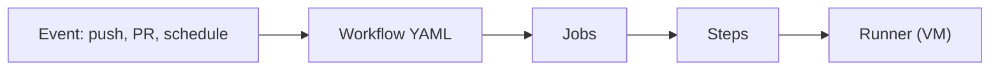
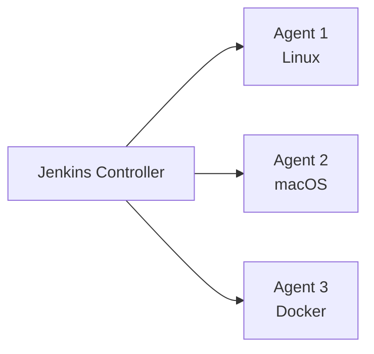
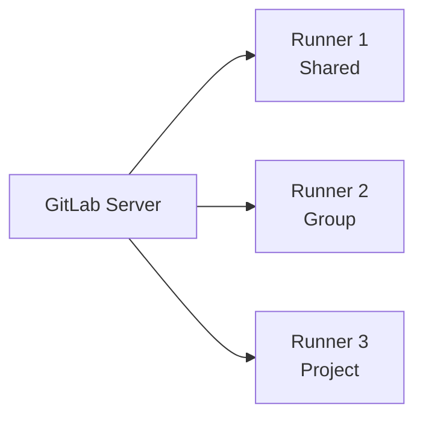
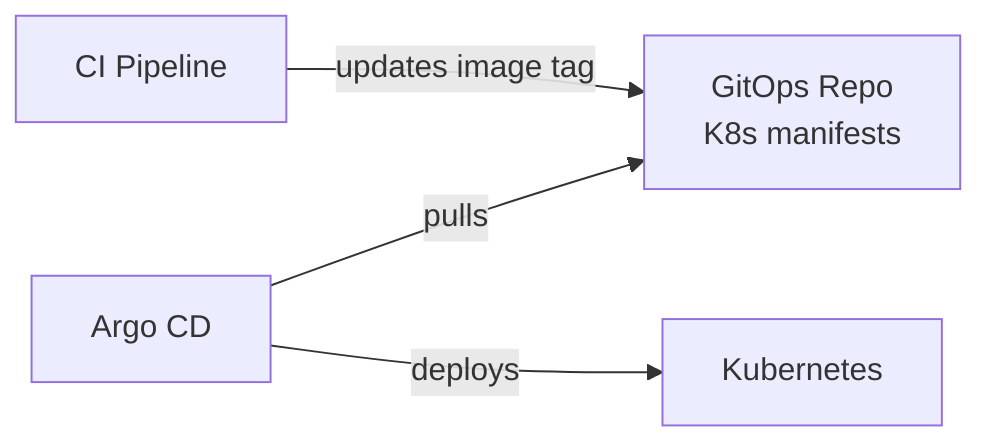

# CI/CD tools (GitHub Actions, Jenkins, GitLab CI)

The CI/CD tool landscape consolidated significantly in the 2020s. Where the 2010s had Jenkins, Bamboo, TeamCity, CircleCI, Travis CI, AppVeyor, Drone, and many others, by 2024 three dominate: **GitHub Actions** (the SaaS leader), **Jenkins** (the legacy enterprise standard), and **GitLab CI** (the integrated alternative). Plus newer entrants like Tekton, Argo Workflows, and Buildkite for specific use cases.

This topic covers the three major tools — how they work, their strengths, and example Java pipelines. The senior judgment: tool choice depends less on technical capability (all do CI/CD competently) and more on existing infrastructure (GitHub-hosted? GitLab-hosted?), team skills (Jenkins requires Groovy familiarity), and operational preferences (managed SaaS vs self-hosted).

> [!NOTE]
> Prerequisites: [CI/CD concepts (L4/C10/T04)](./T04-ci-cd-concepts.md). Git fluency.

## The 2024 CI/CD Landscape

A quick map:

| Tool | Type | Origin | Sweet Spot |
|------|------|--------|------------|
| **GitHub Actions** | SaaS, integrated | 2019 | GitHub-hosted projects |
| **GitLab CI** | SaaS or self-hosted, integrated | 2012 | GitLab-hosted projects |
| **Jenkins** | Self-hosted | 2011 (Hudson 2005) | Legacy enterprise, complex pipelines |
| **CircleCI** | SaaS | 2011 | Modern SaaS alternative to GitHub Actions |
| **Argo CD** | Self-hosted | 2017 | GitOps for Kubernetes |
| **Tekton** | Kubernetes-native | 2019 | Cloud-native pipelines |
| **Buildkite** | Hybrid (SaaS control, self-hosted agents) | 2014 | High-scale, complex matrix builds |
| **Drone** | Self-hosted | 2014 | Container-native |

Market share (2024 estimates):
- GitHub Actions: ~50%+ of new projects.
- Jenkins: ~25%, mostly legacy.
- GitLab CI: ~15%.
- Others: ~10%.

## GitHub Actions

The dominant SaaS CI/CD in 2024. Comes free with GitHub repositories.

### Architecture



- **Workflow**: a YAML file in `.github/workflows/`.
- **Jobs**: groups of steps; can run in parallel.
- **Steps**: individual commands or actions.
- **Runners**: VMs that execute jobs. GitHub-hosted or self-hosted.
- **Actions**: reusable units (like functions) — `actions/checkout`, `actions/setup-java`.

### Java Build Example

```yaml
# .github/workflows/ci.yml
name: CI

on:
  push:
    branches: [main]
  pull_request:
    branches: [main]

jobs:
  build:
    runs-on: ubuntu-latest
    steps:
    - uses: actions/checkout@v4
    
    - name: Set up JDK
      uses: actions/setup-java@v4
      with:
        java-version: '21'
        distribution: 'temurin'
        cache: 'gradle'
    
    - name: Validate Gradle wrapper
      uses: gradle/wrapper-validation-action@v2
    
    - name: Build
      run: ./gradlew build --no-daemon
    
    - name: Run tests
      run: ./gradlew test --no-daemon
    
    - name: Upload test results
      uses: actions/upload-artifact@v4
      if: always()
      with:
        name: test-results
        path: build/reports/tests/
```

### Production Deploy Example

```yaml
name: Deploy

on:
  push:
    tags:
    - 'v*'

jobs:
  build-image:
    runs-on: ubuntu-latest
    steps:
    - uses: actions/checkout@v4
    
    - name: Login to Docker Hub
      uses: docker/login-action@v3
      with:
        username: ${{ secrets.DOCKER_USERNAME }}
        password: ${{ secrets.DOCKER_PASSWORD }}
    
    - name: Set up Buildx
      uses: docker/setup-buildx-action@v3
    
    - name: Build and push
      uses: docker/build-push-action@v5
      with:
        context: .
        platforms: linux/amd64,linux/arm64
        push: true
        tags: |
          myorg/myapp:${{ github.ref_name }}
          myorg/myapp:latest
        cache-from: type=gha
        cache-to: type=gha,mode=max
  
  deploy:
    needs: build-image
    runs-on: ubuntu-latest
    environment: production
    steps:
    - uses: actions/checkout@v4
    
    - name: Configure kubectl
      run: |
        echo "${{ secrets.KUBECONFIG }}" > kubeconfig
        export KUBECONFIG=$(pwd)/kubeconfig
    
    - name: Deploy
      run: |
        kubectl set image deployment/myapp myapp=myorg/myapp:${{ github.ref_name }} -n production
        kubectl rollout status deployment/myapp -n production --timeout=5m
```

### Strengths

- **Integrated**: native to GitHub; PRs, issues, releases all wired in.
- **Marketplace**: thousands of pre-built actions.
- **Matrix builds**: easy to test multiple Java versions, OS combinations.
- **Free for open source**.
- **Reasonable for private**: 2000 free minutes/month for free tier.

### Weaknesses

- **Vendor lock-in**: workflows aren't portable to other CI.
- **Cost at scale**: build minutes add up for large teams.
- **Limited debugging**: hard to SSH into failing runners.

## Jenkins

The legacy enterprise CI/CD standard. Open-source, self-hosted, very flexible.

### Architecture



- **Controller**: the central server. Schedules jobs, stores state.
- **Agents**: workers that execute jobs.
- **Plugins**: ~1800 plugins for everything (Java, Docker, Kubernetes, AWS, etc.).
- **Pipeline**: defined in Jenkinsfile (Groovy DSL).

### Declarative Pipeline Example

```groovy
// Jenkinsfile
pipeline {
    agent {
        docker {
            image 'eclipse-temurin:21-jdk'
        }
    }
    
    options {
        timeout(time: 30, unit: 'MINUTES')
        timestamps()
    }
    
    stages {
        stage('Checkout') {
            steps {
                checkout scm
            }
        }
        
        stage('Build') {
            steps {
                sh './gradlew build --no-daemon'
            }
        }
        
        stage('Test') {
            steps {
                sh './gradlew test --no-daemon'
            }
            post {
                always {
                    junit '**/build/test-results/test/*.xml'
                }
            }
        }
        
        stage('Quality') {
            parallel {
                stage('SpotBugs') {
                    steps {
                        sh './gradlew spotbugsMain'
                    }
                }
                stage('Coverage') {
                    steps {
                        sh './gradlew jacocoTestReport'
                    }
                }
            }
        }
        
        stage('Package') {
            steps {
                sh './gradlew bootJar'
                sh 'docker build -t myapp:${BUILD_NUMBER} .'
            }
        }
        
        stage('Deploy') {
            when {
                branch 'main'
            }
            steps {
                sh 'kubectl set image deployment/myapp myapp=myapp:${BUILD_NUMBER}'
            }
        }
    }
    
    post {
        failure {
            mail to: 'team@example.com',
                 subject: "Build ${BUILD_NUMBER} failed",
                 body: "See ${BUILD_URL}"
        }
    }
}
```

### Strengths

- **Flexibility**: anything is possible (sometimes for worse).
- **Plugin ecosystem**: ~1800 plugins.
- **Self-hosted**: no vendor lock-in.
- **Free**.
- **Mature**: 15+ years of production use.

### Weaknesses

- **Operational burden**: you run it; upgrades, plugin compatibility, security.
- **Groovy required**: Jenkinsfile is Groovy DSL.
- **Plugin hell**: outdated, conflicting, abandoned plugins.
- **UI dated**: not great UX.
- **Security history**: Jenkins has had many CVEs.

Modern recommendation: don't choose Jenkins for new projects unless you have specific Jenkins expertise.

## GitLab CI

Integrated CI/CD within GitLab. Available as SaaS (gitlab.com) or self-hosted.

### Architecture



Similar to GitHub Actions but with deeper Git integration.

### Java Pipeline Example

```yaml
# .gitlab-ci.yml
image: eclipse-temurin:21-jdk

stages:
- build
- test
- quality
- package
- deploy

cache:
  paths:
  - .gradle/

variables:
  GRADLE_OPTS: "-Dorg.gradle.daemon=false"

build:
  stage: build
  script:
  - ./gradlew compileJava

test:
  stage: test
  script:
  - ./gradlew test
  artifacts:
    when: always
    reports:
      junit: build/test-results/test/*.xml

quality:
  stage: quality
  parallel:
    matrix:
    - TASK: [spotbugsMain, checkstyleMain, jacocoTestReport]
  script:
  - ./gradlew $TASK

package:
  stage: package
  image: docker:latest
  services:
  - docker:dind
  before_script:
  - docker login -u $CI_REGISTRY_USER -p $CI_REGISTRY_PASSWORD $CI_REGISTRY
  script:
  - docker build -t $CI_REGISTRY_IMAGE:$CI_COMMIT_SHA .
  - docker push $CI_REGISTRY_IMAGE:$CI_COMMIT_SHA
  only:
  - main
  - tags

deploy_staging:
  stage: deploy
  image: bitnami/kubectl:latest
  script:
  - kubectl set image deployment/myapp myapp=$CI_REGISTRY_IMAGE:$CI_COMMIT_SHA -n staging
  only:
  - main
  environment:
    name: staging
    url: https://staging.example.com

deploy_production:
  stage: deploy
  image: bitnami/kubectl:latest
  script:
  - kubectl set image deployment/myapp myapp=$CI_REGISTRY_IMAGE:$CI_COMMIT_SHA -n production
  when: manual
  only:
  - tags
  environment:
    name: production
    url: https://api.example.com
```

### Strengths

- **Integrated**: like GitHub Actions but for GitLab.
- **Container registry built-in**.
- **Free for many tiers**.
- **Self-hosted option**.

### Weaknesses

- **GitLab-tied**: workflows don't port to other tools.
- **Less popular ecosystem**: fewer pre-built integrations.

## Comparison Matrix

| Feature | GitHub Actions | Jenkins | GitLab CI |
|---------|----------------|---------|-----------|
| Hosting | SaaS (or self-hosted runners) | Self-hosted | SaaS or self-hosted |
| Pipeline language | YAML | Groovy (Jenkinsfile) | YAML |
| Ecosystem | Huge (marketplace) | Huge (plugins) | Smaller |
| Cost | Free for OSS, usage-based | Free, you pay for infra | Free tier, usage-based |
| Learning curve | Easy | Steep | Easy |
| Best for | GitHub-hosted projects | Legacy enterprise | GitLab-hosted projects |
| Container support | Excellent | Good (via plugins) | Excellent |
| Kubernetes integration | Excellent | Good | Excellent |
| Self-service for devs | Easy | Hard | Easy |

## Specific Java Patterns

### Gradle Build Cache

Gradle has incremental build support. Configure CI to use the cache:

```yaml
# GitHub Actions
- uses: actions/setup-java@v4
  with:
    java-version: '21'
    distribution: 'temurin'
    cache: 'gradle'    # caches ~/.gradle and project's build directory
```

This dramatically reduces build time on incremental commits.

### Maven Dependency Caching

```yaml
- uses: actions/setup-java@v4
  with:
    java-version: '21'
    distribution: 'temurin'
    cache: 'maven'    # caches ~/.m2/repository
```

### Test Reporting

Java tests output JUnit XML. CI tools parse it for nice UI:

```yaml
# GitHub Actions
- name: Test
  run: ./gradlew test
- name: Test Results
  uses: dorny/test-reporter@v1
  if: always()
  with:
    name: Java Tests
    path: '**/build/test-results/test/*.xml'
    reporter: java-junit
```

### Docker Layer Caching

```yaml
# GitHub Actions
- name: Build and push
  uses: docker/build-push-action@v5
  with:
    context: .
    push: true
    tags: myapp:${{ github.sha }}
    cache-from: type=gha     # GitHub Actions cache
    cache-to: type=gha,mode=max
```

## Anti-Patterns

> [!WARNING]
> **No caching of Maven/Gradle dependencies.** Every build re-downloads. 5-10x slower.

> [!WARNING]
> **Building Docker images on the CI runner without BuildKit cache.** Slow rebuilds.

> [!WARNING]
> **Storing secrets in pipeline YAML.** Use secret management.

> [!WARNING]
> **Building Java directly on runner without Docker.** Inconsistent environments. Use a Java Docker image.

> [!WARNING]
> **No parallelization.** Tests, quality checks, and security scans should run in parallel.

> [!WARNING]
> **Building from scratch every commit.** Use incremental builds.

> [!WARNING]
> **No timeout.** Jobs can hang forever.

> [!WARNING]
> **No notifications on failure.** Engineers don't know to fix it.

## The GitOps Pattern

For Kubernetes deployments, GitOps is becoming standard:



The CI pipeline doesn't deploy directly. It updates a Git repo containing Kubernetes manifests. Argo CD watches the repo and reconciles the cluster.

Benefits:
- **Auditable**: every deployment is a Git commit.
- **Reversible**: revert the commit to roll back.
- **Declarative**: cluster state always matches Git.

Tools: **Argo CD**, **Flux CD**, **Spinnaker**.

## Practice

1. **Convert a Jenkins pipeline to GitHub Actions** (or vice versa).
2. **Cache dependencies**: set up Gradle or Maven caching. Measure speedup.
3. **Matrix build**: build against Java 17 and 21.
4. **Docker build with cache**: use BuildKit cache-from/cache-to.
5. **Parallel jobs**: split tests, quality checks, packaging.
6. **Environment-based deploys**: dev / staging / prod stages.
7. **Manual approval gate**: require human approval for production.
8. **Self-hosted runner**: configure a GitHub Actions self-hosted runner.
9. **GitOps**: set up Argo CD pointing to a manifests repo.

## Recap

You should now be able to:

- Compare GitHub Actions, Jenkins, and GitLab CI.
- Write a Java CI/CD pipeline in any of the three.
- Configure dependency caching for Gradle/Maven.
- Use Docker layer caching for fast image builds.
- Implement matrix builds for multi-version testing.
- Apply the GitOps pattern with Argo CD.
- Avoid common CI/CD anti-patterns.

## Next

Continue to [Deployment strategies (blue-green, canary, rolling)](./T06-deployment-strategies-blue-green-canary-rolling.md) — the patterns for safely shipping code to production once your pipeline can build and push artifacts.
