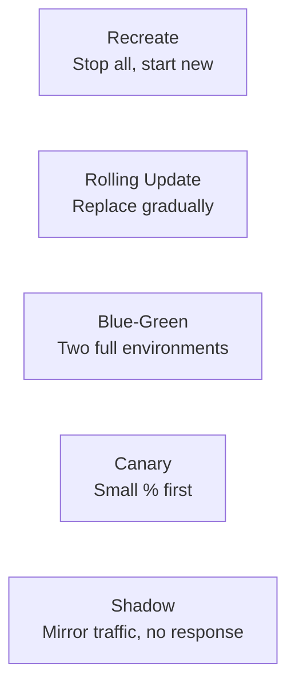
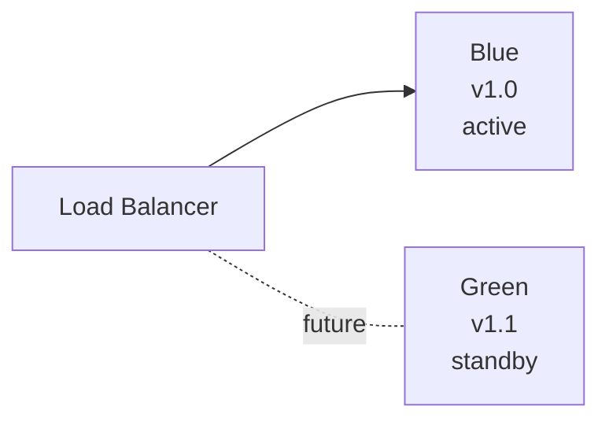
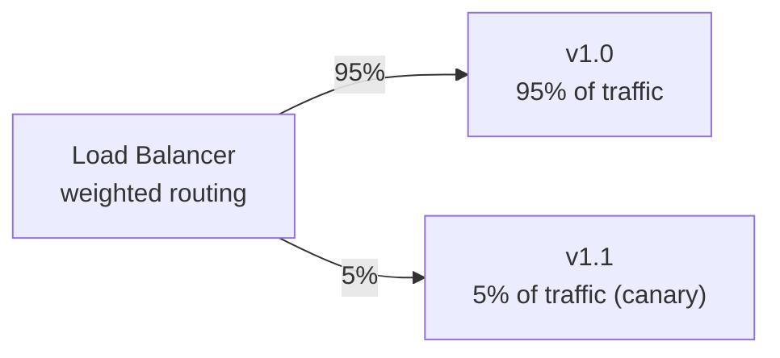

# Deployment strategies (blue-green, canary, rolling)

A *deployment strategy* is the pattern by which a new version of your service replaces the old one in production. The choice — between blue-green, rolling, canary, recreate, or shadow — determines how risky each release is, how fast you can ship, and how quickly you can roll back if something goes wrong. The 1990s pattern (stop everything, deploy, hope for the best) is dead; the 2020s pattern is *progressive delivery* — releasing to small fractions of traffic first, monitoring, then expanding.

This topic covers the canonical strategies, Kubernetes implementations, the trade-offs each makes, and the tools (Argo Rollouts, Flagger) that automate progressive delivery.

> [!NOTE]
> Prerequisites: [Kubernetes basics (L4/C10/T03)](./T03-kubernetes-basics.md). [CI/CD concepts (L4/C10/T04)](./T04-ci-cd-concepts.md).

## The Five Canonical Strategies



### Recreate

The simplest. Stop all old pods; start all new pods.

```yaml
strategy:
  type: Recreate
```

**Pros**:
- Simple.
- No version skew (old and new never coexist).

**Cons**:
- Downtime during the swap.
- No instant rollback (have to recreate again).

**Use when**:
- Database schema migrations that can't tolerate version skew.
- Development environments.
- Acceptable scheduled downtime windows.

### Rolling Update

Gradually replace old pods with new ones. Kubernetes default.

```yaml
strategy:
  type: RollingUpdate
  rollingUpdate:
    maxUnavailable: 1
    maxSurge: 1
```

- `maxUnavailable`: maximum pods that can be unavailable during update.
- `maxSurge`: maximum pods that can be created above desired count.

**Process**:
1. Create a new pod (now N+1 pods).
2. Wait for it to be ready.
3. Terminate an old pod (now N pods).
4. Repeat.

**Pros**:
- No downtime.
- Resource-efficient.
- Built-in K8s.

**Cons**:
- Old and new versions coexist during deploy.
- Slower than recreate.
- Rollback requires another rolling update.

**Use when**:
- Stateless services with backward-compatible changes.
- Most Spring Boot APIs.

### Blue-Green

Two complete environments: blue (current production) and green (new version). Switch traffic instantly.



**Process**:
1. Green environment is deployed with new version.
2. Test green.
3. Switch load balancer to point at green.
4. Blue is now standby (for rollback).

**Pros**:
- Instant rollback (switch LB back).
- Zero-downtime cutover.
- New version fully tested before traffic.

**Cons**:
- Requires 2× resources during deploy.
- Database migration coordination tricky.

**Use when**:
- Need instant rollback.
- Have budget for 2× resources.
- Stateless services.

### Canary

Release to a *small fraction* of traffic first. Monitor. If healthy, increase fraction. Eventually 100%.



**Process**:
1. Deploy v1.1 to a small set of pods.
2. Route 5% of traffic to v1.1.
3. Monitor error rates, latency.
4. If healthy: increase to 25%, 50%, 100%.
5. If unhealthy: roll back to 0%.

**Pros**:
- Lowest risk per deploy.
- Real production traffic validates.
- Quick rollback.

**Cons**:
- Complex traffic routing.
- Requires careful monitoring.
- Version skew during deploy.

**Use when**:
- High-stakes services.
- Major changes with uncertain behavior.
- Have observability infrastructure.

### Shadow (Mirror)

Send a *copy* of traffic to v1.1 but ignore the response. Compare metrics.

**Process**:
1. Deploy v1.1.
2. Mirror production traffic to v1.1.
3. Compare v1.0 and v1.1 responses, latency, errors.
4. When confident, switch traffic.

**Pros**:
- Zero customer impact during testing.
- Tests under real traffic patterns.

**Cons**:
- 2× backend load.
- Side effects (writes!) must be handled (don't duplicate database writes).
- Complex to implement.

**Use when**:
- Major refactoring with uncertain behavior.
- Testing performance changes.

## Kubernetes Implementation Patterns

### Rolling Update (Built-in)

```yaml
apiVersion: apps/v1
kind: Deployment
metadata:
  name: myapp
spec:
  replicas: 5
  strategy:
    type: RollingUpdate
    rollingUpdate:
      maxUnavailable: 1
      maxSurge: 1
  template:
    spec:
      containers:
      - name: myapp
        image: myapp:1.1
        readinessProbe:
          httpGet:
            path: /actuator/health/readiness
            port: 8080
          periodSeconds: 5
```

Update via:
```bash
kubectl set image deployment/myapp myapp=myapp:1.1
kubectl rollout status deployment/myapp
kubectl rollout undo deployment/myapp   # if needed
```

### Blue-Green (Manual)

Two Deployments, one Service, switch selector:

```yaml
# Blue deployment
apiVersion: apps/v1
kind: Deployment
metadata:
  name: myapp-blue
spec:
  selector:
    matchLabels:
      app: myapp
      version: blue
  template:
    metadata:
      labels:
        app: myapp
        version: blue
    spec:
      containers:
      - name: myapp
        image: myapp:1.0
---
# Green deployment
apiVersion: apps/v1
kind: Deployment
metadata:
  name: myapp-green
spec:
  selector:
    matchLabels:
      app: myapp
      version: green
  template:
    metadata:
      labels:
        app: myapp
        version: green
    spec:
      containers:
      - name: myapp
        image: myapp:1.1
---
# Service points to blue
apiVersion: v1
kind: Service
metadata:
  name: myapp
spec:
  selector:
    app: myapp
    version: blue        # change to green to cut over
  ports:
  - port: 80
    targetPort: 8080
```

Switch:
```bash
kubectl patch service myapp -p '{"spec":{"selector":{"version":"green"}}}'
```

### Canary (With Two Deployments)

Deploy a few canary pods alongside main:

```yaml
# Main deployment (95%)
apiVersion: apps/v1
kind: Deployment
metadata:
  name: myapp-stable
spec:
  replicas: 19
  selector:
    matchLabels:
      app: myapp
  template:
    metadata:
      labels:
        app: myapp
        track: stable
    spec:
      containers:
      - name: myapp
        image: myapp:1.0
---
# Canary deployment (5%)
apiVersion: apps/v1
kind: Deployment
metadata:
  name: myapp-canary
spec:
  replicas: 1     # 1/20 = 5%
  selector:
    matchLabels:
      app: myapp
  template:
    metadata:
      labels:
        app: myapp
        track: canary
    spec:
      containers:
      - name: myapp
        image: myapp:1.1
---
apiVersion: v1
kind: Service
metadata:
  name: myapp
spec:
  selector:
    app: myapp       # selects both stable and canary
  ports:
  - port: 80
    targetPort: 8080
```

Service load-balances across all pods; 1/20 of traffic hits the canary.

This crude form lacks weighted routing precision. For real canary, use a service mesh (Istio, Linkerd) or Argo Rollouts.

## Argo Rollouts — Progressive Delivery

Argo Rollouts is a Kubernetes controller that adds canary and blue-green to K8s natively.

```yaml
apiVersion: argoproj.io/v1alpha1
kind: Rollout
metadata:
  name: myapp
spec:
  replicas: 5
  selector:
    matchLabels:
      app: myapp
  template:
    spec:
      containers:
      - name: myapp
        image: myapp:1.1
  strategy:
    canary:
      steps:
      - setWeight: 20
      - pause: {duration: 5m}
      - setWeight: 40
      - pause: {duration: 5m}
      - setWeight: 60
      - pause: {duration: 5m}
      - setWeight: 80
      - pause: {duration: 5m}
      # Then 100%
```

This deploys with 20%, waits 5 minutes, monitors, then 40%, etc.

With analysis templates:

```yaml
strategy:
  canary:
    canaryService: myapp-canary
    stableService: myapp-stable
    trafficRouting:
      istio:
        virtualService:
          name: myapp-vs
    steps:
    - setWeight: 10
    - pause: {duration: 5m}
    - analysis:
        templates:
        - templateName: success-rate
        args:
        - name: service-name
          value: myapp-canary
    - setWeight: 30
    # ...
```

`AnalysisTemplate` queries Prometheus for error rate; if too high, rollback automatically.

## Flagger — Similar But Different

Flagger (Flux ecosystem) does similar progressive delivery with service meshes (Istio, Linkerd, AppMesh) or ingress controllers (NGINX, Gloo).

```yaml
apiVersion: flagger.app/v1beta1
kind: Canary
metadata:
  name: myapp
spec:
  targetRef:
    apiVersion: apps/v1
    kind: Deployment
    name: myapp
  service:
    port: 80
    targetPort: 8080
  analysis:
    interval: 1m
    threshold: 5
    maxWeight: 50
    stepWeight: 10
    metrics:
    - name: request-success-rate
      thresholdRange:
        min: 99
      interval: 1m
    - name: request-duration
      thresholdRange:
        max: 500
      interval: 1m
```

## Database Migrations And Deployment

The hardest part of deployment is often database changes. Strategies:

### Expand-Contract (Forward-Compatible Changes)

For breaking schema changes:

1. **Expand**: add new schema. Old code uses old schema; new code can use either.
2. **Migrate**: new code only uses new schema.
3. **Contract**: remove old schema.

This requires *multiple deployments*, one per phase. But avoids downtime.

### Backward-Compatible Migrations

Only deploy backward-compatible schema changes (add column, never remove). Rolling/canary deploys work fine.

### Migration Tool Choice

For Java:
- **Flyway**: SQL-based migrations. Most popular.
- **Liquibase**: XML/YAML migrations. More features.

Both run migrations on app startup or as a separate step.

## Anti-Patterns

> [!WARNING]
> **Big-bang deploys.** No gradual rollout, no monitoring during deploy. Hope-driven deployment.

> [!WARNING]
> **No rollback plan.** When something fails, panic, not procedure.

> [!WARNING]
> **Canary without monitoring.** Canary deploys are useful only if you watch for problems.

> [!WARNING]
> **Breaking schema changes with rolling updates.** Old code can't use new schema; deploy fails.

> [!WARNING]
> **No health check tuning.** Rolling update marks new pods ready too early; broken pods receive traffic.

> [!WARNING]
> **Manual deploys to production.** Inconsistent, error-prone.

> [!WARNING]
> **Different deploy strategies per environment.** Inconsistency between staging and prod hides issues.

## Common Misconceptions

> [!WARNING]
> **"Blue-green is always safer."** Not for stateful services or with database changes.

> [!WARNING]
> **"Canary requires service mesh."** Service mesh helps but not required. Replica-ratio canary works fine.

> [!WARNING]
> **"Rolling update is automatic and safe."** Only if readiness probes are configured correctly.

> [!WARNING]
> **"Deploy strategy doesn't affect application code."** It does. Code must be backward-compatible during version skew.

> [!WARNING]
> **"More canary steps = safer."** Trade-off with deploy time. Find your sweet spot.

## The Senior Decision Framework

When deploying, ask:

1. **Are old and new versions compatible?** (Database schema, API contracts.)
2. **What's the rollback time tolerance?** (Seconds, minutes?)
3. **How much real-traffic testing do we need?** (None → recreate; lots → canary.)
4. **What's the budget?** (2× resources for blue-green?)
5. **What's the failure cost?** (High → canary; low → rolling.)

The answer depends on each release. Most teams default to rolling update; reserve canary for risky changes; blue-green for cases needing instant rollback.

## Practice

1. **Rolling update**: deploy a Spring Boot app. Update the image. Watch the rollout.
2. **Canary via two deployments**: set up 95/5 split. Verify traffic distribution.
3. **Blue-green via service selector switch**: prepare both environments. Cut over. Roll back.
4. **Argo Rollouts**: install Argo Rollouts. Create a Rollout with progressive canary.
5. **Database expand-contract**: implement a breaking column rename via three deploys.
6. **Failed canary rollback**: deliberately deploy a broken version as canary. Trigger automatic rollback.
7. **Compare strategies**: time how long each strategy takes for a full deploy of 20 pods.
8. **Shadow traffic**: use Istio to mirror production traffic to a new version. Compare.

## Recap

You should now be able to:

- Distinguish recreate, rolling, blue-green, canary, and shadow deployment strategies.
- Implement rolling update in plain Kubernetes.
- Implement blue-green via Service selector swap.
- Implement canary via replica ratios (simple) or Argo Rollouts (sophisticated).
- Use Argo Rollouts or Flagger for progressive delivery with automated analysis.
- Coordinate database migrations with deploys (expand-contract).
- Choose deployment strategy based on risk, rollback tolerance, and resource budget.

## Next

Continue to [Cloud basics for Java devs (AWS/GCP/Azure)](./T07-cloud-basics-for-java-devs-aws-gcp-azure.md) — the major cloud platforms where your containerized Java services typically run.
