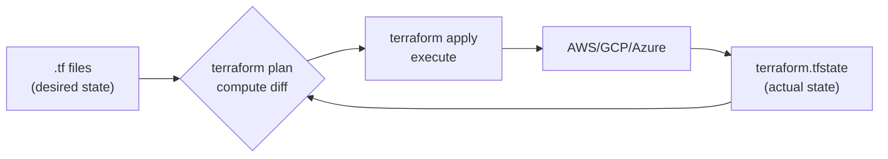

# Infrastructure as Code (Terraform, intro)

*Infrastructure as Code* (IaC) means writing your cloud infrastructure — VMs, networks, databases, IAM policies, K8s clusters — as text files committed to git, then applied by a tool that reconciles real-world state to match. The alternative — ClickOps, where someone navigates the AWS console and presses buttons — is unreproducible, error-prone, and untraceable. By 2026, IaC is non-negotiable for production cloud infrastructure.

Terraform (now OpenTofu, since HashiCorp's BSL relicense in 2023) is the dominant IaC tool. This topic covers its core model — providers, resources, state, plan/apply — plus the surrounding patterns (modules, workspaces, remote state) and contrasts with CloudFormation and Pulumi.

> [!NOTE]
> Prerequisites: [Cloud basics (L4/C10/T07)](./T07-cloud-basics-for-java-devs-aws-gcp-azure.md).

## Why IaC

Before IaC, infrastructure was created by:
- **ClickOps**: someone in AWS console pressing buttons.
- **Shell scripts**: imperative, brittle.
- **Configuration management** (Chef, Puppet, Ansible): better, but focused on *configuring* existing servers, not provisioning them.

Problems:
- **Not reproducible**: production and staging diverge.
- **No history**: who created what, when, why?
- **No code review**: changes happen without review.
- **Drift**: real state diverges from intended state.
- **Manual disasters**: typo creates orphaned $10k/month resources.

IaC solves these:
- **Reproducible**: same code creates the same infrastructure.
- **Versioned**: git history shows every change.
- **Reviewable**: PRs for infrastructure.
- **Idempotent**: applying twice yields the same result.

## The Major IaC Tools

| Tool | Language | Cloud Support | Notes |
|------|----------|---------------|-------|
| **Terraform / OpenTofu** | HCL | Multi-cloud | Most popular. OpenTofu is open-source fork. |
| **AWS CloudFormation** | YAML/JSON | AWS only | First-party AWS. |
| **AWS CDK** | TypeScript/Python/Java | AWS only | Generates CloudFormation. |
| **Pulumi** | TS/Python/Go/C#/Java | Multi-cloud | Uses real programming languages. |
| **Ansible** | YAML | Multi-cloud | Config mgmt > IaC. |
| **Crossplane** | YAML/K8s | Multi-cloud | K8s-native. |

This topic focuses on **Terraform** (and by extension OpenTofu, which has the same syntax).

## Terraform — The Model

Terraform's mental model:

1. **Providers**: plugins that know how to talk to APIs (AWS, GCP, K8s, GitHub, etc.).
2. **Resources**: things you want to exist (EC2 instance, S3 bucket).
3. **State**: a JSON file recording what Terraform has created.
4. **Plan**: diff between desired (code) and actual (state).
5. **Apply**: execute the plan.



## A Minimal Terraform Example

```hcl
# main.tf

terraform {
  required_providers {
    aws = {
      source  = "hashicorp/aws"
      version = "~> 5.0"
    }
  }
  required_version = ">= 1.5"
}

provider "aws" {
  region = "us-west-2"
}

resource "aws_s3_bucket" "app_uploads" {
  bucket = "my-app-uploads-2026"
  tags = {
    Environment = "production"
    ManagedBy   = "terraform"
  }
}

resource "aws_s3_bucket_versioning" "app_uploads" {
  bucket = aws_s3_bucket.app_uploads.id
  versioning_configuration {
    status = "Enabled"
  }
}
```

Workflow:
```bash
terraform init      # download providers
terraform plan      # show what will change
terraform apply     # apply changes
terraform destroy   # remove all resources
```

## HCL — The Configuration Language

Terraform uses HashiCorp Configuration Language (HCL), a declarative config language.

Key constructs:

### Variables

```hcl
variable "region" {
  type        = string
  default     = "us-west-2"
  description = "AWS region"
}

variable "instance_count" {
  type    = number
  default = 3
}

variable "allowed_cidr_blocks" {
  type    = list(string)
  default = ["10.0.0.0/16"]
}
```

Use:
```hcl
provider "aws" {
  region = var.region
}
```

### Outputs

```hcl
output "bucket_arn" {
  value       = aws_s3_bucket.app_uploads.arn
  description = "ARN of the uploads bucket"
}
```

### Data Sources

Reference existing resources Terraform doesn't manage:

```hcl
data "aws_vpc" "default" {
  default = true
}

resource "aws_security_group" "app" {
  vpc_id = data.aws_vpc.default.id
  # ...
}
```

### Locals

Computed values:

```hcl
locals {
  common_tags = {
    Environment = var.environment
    Project     = "myapp"
    ManagedBy   = "terraform"
  }
}

resource "aws_s3_bucket" "app_uploads" {
  bucket = "myapp-uploads-${var.environment}"
  tags   = local.common_tags
}
```

### Resources With References

```hcl
resource "aws_vpc" "main" {
  cidr_block = "10.0.0.0/16"
}

resource "aws_subnet" "public" {
  vpc_id     = aws_vpc.main.id    # reference
  cidr_block = "10.0.1.0/24"
}
```

Terraform automatically figures out dependencies (subnet needs VPC first).

## Real-World Example: EKS Cluster

```hcl
module "vpc" {
  source  = "terraform-aws-modules/vpc/aws"
  version = "~> 5.0"

  name = "myapp-vpc"
  cidr = "10.0.0.0/16"

  azs             = ["us-west-2a", "us-west-2b", "us-west-2c"]
  private_subnets = ["10.0.1.0/24", "10.0.2.0/24", "10.0.3.0/24"]
  public_subnets  = ["10.0.101.0/24", "10.0.102.0/24", "10.0.103.0/24"]

  enable_nat_gateway = true
  single_nat_gateway = true

  tags = local.common_tags
}

module "eks" {
  source  = "terraform-aws-modules/eks/aws"
  version = "~> 19.0"

  cluster_name    = "myapp-cluster"
  cluster_version = "1.28"

  vpc_id     = module.vpc.vpc_id
  subnet_ids = module.vpc.private_subnets

  eks_managed_node_groups = {
    main = {
      desired_size = 3
      min_size     = 2
      max_size     = 5

      instance_types = ["t3.medium"]
    }
  }

  tags = local.common_tags
}

resource "aws_rds_cluster" "main" {
  cluster_identifier = "myapp-db"
  engine             = "aurora-postgresql"
  engine_version     = "15.4"
  database_name      = "myapp"
  master_username    = "appuser"
  master_password    = var.db_password   # sensitive var
  
  vpc_security_group_ids = [aws_security_group.db.id]
  db_subnet_group_name   = aws_db_subnet_group.main.name
  
  storage_encrypted = true
  skip_final_snapshot = false

  tags = local.common_tags
}
```

A single `terraform apply` provisions VPC, EKS, RDS — a complete production environment.

## State

Terraform stores state in `terraform.tfstate`. Locally, that's a file. In teams, you use *remote state*.

```hcl
terraform {
  backend "s3" {
    bucket         = "my-terraform-state"
    key            = "production/terraform.tfstate"
    region         = "us-west-2"
    dynamodb_table = "terraform-locks"   # state locking
    encrypt        = true
  }
}
```

Important:
- **State is sensitive**: contains plaintext secrets, IPs, etc. Encrypt and access-control.
- **State locking**: prevents concurrent applies (DynamoDB).
- **State per environment**: production state ≠ staging state. Use `terraform workspace` or separate directories.

## Modules

Reusable groupings:

```hcl
# modules/spring-boot-service/main.tf
variable "name" { type = string }
variable "image" { type = string }
variable "replicas" { type = number; default = 3 }

resource "kubernetes_deployment" "app" {
  metadata { name = var.name }
  spec {
    replicas = var.replicas
    selector { match_labels = { app = var.name } }
    template {
      metadata { labels = { app = var.name } }
      spec {
        container {
          name  = var.name
          image = var.image
          # ...
        }
      }
    }
  }
}
```

Use:
```hcl
module "user_service" {
  source   = "./modules/spring-boot-service"
  name     = "user-service"
  image    = "myapp/user-service:1.2.3"
  replicas = 5
}

module "order_service" {
  source   = "./modules/spring-boot-service"
  name     = "order-service"
  image    = "myapp/order-service:1.4.1"
  replicas = 3
}
```

Modules can come from:
- Local directories.
- Git repositories.
- Terraform Registry (e.g., `terraform-aws-modules/vpc/aws`).

## Plan And Apply

```bash
terraform plan -out=tfplan
# Shows: Plan: 5 to add, 2 to change, 1 to destroy.

terraform apply tfplan
# Executes the plan exactly.
```

The `-out=tfplan` ensures *exactly* what was planned is applied (no concurrent changes).

Sample plan output:
```
# aws_s3_bucket.app_uploads will be created
+ resource "aws_s3_bucket" "app_uploads" {
    + arn                         = (known after apply)
    + bucket                      = "myapp-uploads-prod"
    + tags                        = {
        + "Environment" = "production"
        + "ManagedBy"   = "terraform"
      }
  }

Plan: 1 to add, 0 to change, 0 to destroy.
```

## Drift

*Drift* = real state diverged from Terraform state. Causes:
- Someone manually changed something in the console.
- An auto-scaling event changed something.
- An external system changed something.

Detect with `terraform plan` — it will show unexpected diffs.

Handle:
- **Revert**: `terraform apply` to restore intended state.
- **Adopt**: import into Terraform.
- **Ignore**: use `ignore_changes` lifecycle rule.

```hcl
resource "aws_instance" "app" {
  # ...
  lifecycle {
    ignore_changes = [tags]   # tags changed externally; ignore
  }
}
```

## Terraform vs CloudFormation vs Pulumi

| Aspect | Terraform | CloudFormation | Pulumi |
|--------|-----------|----------------|--------|
| Language | HCL | YAML/JSON | Real languages |
| Multi-cloud | Yes | AWS only | Yes |
| State | Terraform state | CloudFormation stack | Terraform state |
| Maturity | Most | High | Medium |
| Learning curve | Medium | Medium | Lower (if you know the language) |
| Modules | Strong | Nested stacks | Functions/classes |

Pulumi is interesting for engineers who prefer programming languages. Terraform is the industry default.

## OpenTofu

In 2023, HashiCorp relicensed Terraform from MPL to BSL. The community forked it as OpenTofu (Linux Foundation). Syntax-compatible. Most prefer OpenTofu for new projects in 2026. The code patterns in this topic apply to both.

## CI/CD For Terraform

```yaml
# .github/workflows/terraform.yml
name: Terraform
on: [pull_request, push]
jobs:
  terraform:
    runs-on: ubuntu-latest
    steps:
    - uses: actions/checkout@v4
    - uses: hashicorp/setup-terraform@v3
    - run: terraform init
    - run: terraform fmt -check
    - run: terraform validate
    - run: terraform plan -out=tfplan
    - run: terraform apply -auto-approve tfplan
      if: github.ref == 'refs/heads/main'
```

PR comments show the plan output for review.

## Tools In The Ecosystem

- **terraform-docs**: auto-generate module documentation.
- **tflint**: linter.
- **tfsec / Checkov**: security scanning.
- **Atlantis**: PR-based Terraform workflow.
- **Terraform Cloud / Spacelift**: managed Terraform.
- **Terragrunt**: wrapper for DRY Terraform.

## Anti-Patterns

> [!WARNING]
> **Manual cloud console changes.** Always apply via Terraform.

> [!WARNING]
> **No remote state.** Local state breaks team workflows.

> [!WARNING]
> **No state locking.** Concurrent applies corrupt state.

> [!WARNING]
> **Secrets in .tf files.** Use variables sourced from secret managers.

> [!WARNING]
> **Monolithic state.** One state file for everything is risky. Split per environment, per major component.

> [!WARNING]
> **No `terraform plan` before apply.** Surprises in production.

> [!WARNING]
> **Skipping `terraform init` after provider updates.** Failed applies.

> [!WARNING]
> **Unversioned modules.** Module changes break consumers unexpectedly.

> [!WARNING]
> **No tagging strategy.** Costs are unattributable.

## Common Misconceptions

> [!WARNING]
> **"Terraform is just declarative."** It has implicit ordering via references, but you can use `depends_on` for explicit dependencies.

> [!WARNING]
> **"State can be regenerated."** No. State is the source of truth for what Terraform has created. Lose it, lose track of resources.

> [!WARNING]
> **"Modules should be small."** They should be cohesive. Too small = too much boilerplate; too large = inflexible.

> [!WARNING]
> **"Workspaces are for environments."** Officially they're for any state isolation. For environments, separate directories are often cleaner.

> [!WARNING]
> **"Terraform manages everything."** It manages what you've put in code. Manual changes drift; you must reconcile.

## Practice

1. **First Terraform**: install Terraform/OpenTofu. Create an S3 bucket. Destroy it.
2. **Multi-resource**: create VPC + subnet + EC2 instance with security group.
3. **Variables and outputs**: parameterize an existing config.
4. **Modules**: extract a reusable VPC module. Use it twice (prod/staging).
5. **Remote state**: configure S3 backend with DynamoDB locking.
6. **Drift detection**: change something in the console. Run `terraform plan`. See the drift.
7. **Import**: import an existing manually-created resource into Terraform.
8. **CI pipeline**: set up GitHub Actions to plan on PR and apply on merge.
9. **Module from registry**: use `terraform-aws-modules/vpc/aws` to create a VPC.
10. **Migrate Terraform → OpenTofu**: switch CLI; verify same plan output.

## Recap

You should now be able to:

- Explain why IaC beats ClickOps.
- Write Terraform configs with providers, resources, variables, outputs.
- Use modules to organize and reuse Terraform code.
- Manage state (remote backends, locking, environments).
- Distinguish Terraform, CloudFormation, and Pulumi.
- Detect and handle drift.
- Integrate Terraform into CI/CD.
- Avoid common IaC anti-patterns.

## Next

Continue to [Configuration and secrets management](./T09-configuration-and-secrets-management.md) — how to manage application configuration (12-factor) and secrets (Vault, Secrets Manager, sealed-secrets) safely across environments.
