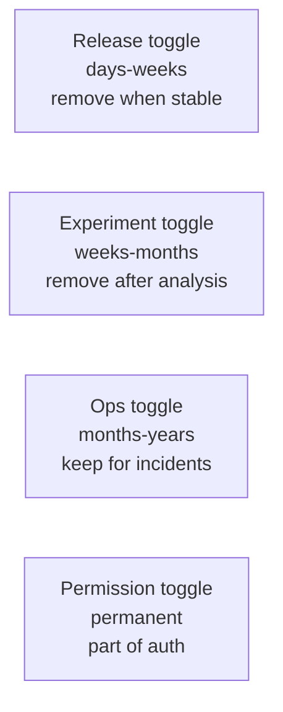

# Feature flags

A *feature flag* (or *toggle*) is a conditional in code that turns a feature on or off at runtime, controlled by configuration outside the code itself. The pattern decouples *deploy* (code in production) from *release* (users seeing the behavior), which is the foundation of safe continuous delivery, percentage rollouts, A/B testing, and instant kill switches. Properly used, feature flags are how senior engineers ship risky changes to large user bases without all-or-nothing risk.

This topic covers the categories of flags (release, ops, experiment, permission), the mechanics (server-side vs client-side), the platforms (LaunchDarkly, Unleash, Flagsmith), OpenFeature standardization, and the operational discipline required to keep flags from becoming permanent technical debt.

> [!NOTE]
> Prerequisites: [Deployment strategies (L4/C10/T06)](./T06-deployment-strategies-blue-green-canary-rolling.md).

## Why Feature Flags

Without flags, deploy = release:
- New code ships → all users see new behavior immediately.
- Bug? Roll back the whole deploy. Slow, risky.
- Big-bang releases. Marketing must wait for deploy.

With flags:
- New code ships → flag is off → users see old behavior.
- Enable flag for 1% → monitor → 10% → 100%.
- Kill switch: disable flag instantly without redeploy.
- Marketing can flip flags on at a precise time.
- A/B test variants.

This decoupling is the *deploy-release distinction* — central to modern progressive delivery.

## Categories Of Flags (Pete Hodgson Taxonomy)

From Pete Hodgson's influential 2017 article "Feature Toggles":

1. **Release toggles**: hide in-progress features from users. Short-lived (weeks).
2. **Experiment toggles**: A/B test variants. Medium-lived (weeks-months).
3. **Ops toggles**: kill switches for expensive operations. Long-lived (months-years).
4. **Permission toggles**: per-user features (paid plans, beta access). Permanent.

Each has a different lifecycle and management strategy.



## Simplest Flag — Spring Boot Config Property

```java
@Service
public class CheckoutService {
    @Value("${features.new-checkout.enabled:false}")
    private boolean newCheckoutEnabled;
    
    public Receipt checkout(Cart cart) {
        if (newCheckoutEnabled) {
            return newCheckoutFlow(cart);
        }
        return oldCheckoutFlow(cart);
    }
}
```

```yaml
features:
  new-checkout:
    enabled: false
```

Pros: dead simple, no dependencies.
Cons: change requires restart. No per-user targeting.

## Better — Refresh-Capable Config

With Spring Cloud Config and `@RefreshScope`:

```java
@Service
@RefreshScope
public class CheckoutService {
    @Value("${features.new-checkout.enabled:false}")
    private boolean newCheckoutEnabled;
    // ...
}
```

A POST to `/actuator/refresh` re-reads config. Still binary on/off, but no restart.

## Real Feature Flag Platforms

Production systems use dedicated platforms:

| Platform | Open Source | Notes |
|----------|-------------|-------|
| **LaunchDarkly** | No | Most popular SaaS. Mature targeting. |
| **Unleash** | Yes | OSS leader. Self-host or SaaS. |
| **Flagsmith** | Yes | OSS alternative. Edge-friendly. |
| **Split.io** | No | A/B testing focus. |
| **AWS AppConfig** | No | AWS-native. |
| **Optimizely** | No | Experimentation platform. |
| **OpenFeature** | Yes (spec) | Vendor-neutral SDK standard. |

### LaunchDarkly Example

```java
LDClient client = new LDClient(SDK_KEY);

LDContext user = LDContext.builder("user-123")
    .set("email", "alice@example.com")
    .set("plan", "premium")
    .set("country", "US")
    .build();

if (client.boolVariation("new-checkout", user, false)) {
    return newCheckoutFlow(cart);
}
return oldCheckoutFlow(cart);
```

Rules in LaunchDarkly UI:
- "Serve `true` to users in country=US"
- "Serve `true` to 5% of users"
- "Serve `true` to users with plan=premium"

Changes propagate instantly via streaming or SSE.

### Unleash Example

```java
UnleashConfig config = UnleashConfig.builder()
    .appName("myapp")
    .instanceId("instance-1")
    .unleashAPI("https://unleash.example.com/api")
    .apiKey(API_KEY)
    .build();

Unleash unleash = new DefaultUnleash(config);

if (unleash.isEnabled("new-checkout", UnleashContext.builder()
        .userId("user-123")
        .build())) {
    return newCheckoutFlow(cart);
}
```

## OpenFeature

OpenFeature (CNCF) is a vendor-neutral SDK spec, so you can swap providers without changing code:

```java
import dev.openfeature.sdk.*;

OpenFeatureAPI.getInstance().setProvider(new LaunchDarklyProvider(SDK_KEY));

Client client = OpenFeatureAPI.getInstance().getClient();

EvaluationContext context = new MutableContext("user-123")
    .add("plan", "premium");

boolean enabled = client.getBooleanValue("new-checkout", false, context);
```

Tomorrow swap to Unleash by setting a different provider; code unchanged. This is genuinely useful for avoiding vendor lock-in.

## Targeting Rules

Real flags support sophisticated targeting:

- **By user attribute**: `email ends with @internal.com`.
- **By segment**: "premium users", "beta testers".
- **By percentage**: 5%, 25%, etc.
- **By geo**: "US users only".
- **By time**: "after 2026-07-01".
- **Combined**: "10% of premium US users".

## Percentage Rollouts (Bucketing)

To roll out to a percentage, the flag platform hashes the user ID:

```java
int bucket = Math.abs(("new-checkout:" + userId).hashCode()) % 100;
if (bucket < 5) {
    // user is in the 5%
}
```

The same user always falls into the same bucket — consistent experience.

A real platform handles this with proper hashing (MurmurHash, etc.) for uniform distribution.

## Kill Switches

For critical features that can fail in production:

```java
public Order processOrder(Order order) {
    if (flagClient.boolVariation("expensive-validation-enabled", context, true)) {
        runExpensiveValidation(order);
    }
    // proceed
}
```

If `runExpensiveValidation` overloads, flip the flag off. No deploy needed.

Common kill switches:
- Expensive ML inference.
- Third-party API calls.
- Specific endpoint enabled.
- Cache disabled (for debugging).

## A/B Testing

Flags drive experiments:

```java
String variant = client.getStringValue("checkout-button-color", "blue", context);
// Returns "blue", "green", or "red" based on bucket assignment.

button.setColor(variant);
```

Track conversion per variant. Statistical significance after enough samples. Pick a winner.

Tools: LaunchDarkly Experimentation, Optimizely, Statsig.

## Cleaning Up Flags — The Hard Part

The dirty secret: most teams accumulate flags. The codebase becomes:

```java
if (flag1) {
    if (flag2) {
        if (!flag3 || flag4) {
            // ?
        }
    }
}
```

Disasters waiting to happen. The Knight Capital trading bug ($440M loss in 2012) was partly caused by a stale flag turning on dead code.

Discipline:
- **Expiration**: every release flag gets a "remove by" date.
- **Audits**: monthly review of all flags.
- **Removal**: when a flag is 100% on for a week, delete it.
- **Lifecycle tracking**: flags have owners.

LaunchDarkly and Unleash both have features to highlight stale flags.

## Spring Boot Integration Patterns

Wrap flag access for testability:

```java
@Component
public class FeatureFlags {
    @Autowired
    private Client openFeatureClient;
    
    public boolean isEnabled(String flag, String userId) {
        EvaluationContext context = new MutableContext(userId);
        return openFeatureClient.getBooleanValue(flag, false, context);
    }
}

@Service
public class CheckoutService {
    @Autowired
    private FeatureFlags flags;
    
    public Receipt checkout(Cart cart, String userId) {
        if (flags.isEnabled("new-checkout", userId)) {
            return newCheckoutFlow(cart);
        }
        return oldCheckoutFlow(cart);
    }
}
```

In tests, mock `FeatureFlags`. Don't call real provider.

## Performance Considerations

- **Local cache**: SDKs cache flag rules locally. Evaluations are nanoseconds.
- **Network on startup**: SDK fetches rules; can be slow if cold.
- **Failure mode**: on platform outage, SDK uses cached/default values.
- **Default value matters**: pick the safe default (usually `false` for new code).

## Flag Hygiene

Senior practices:

1. **Document the flag's purpose** in code:
```java
// FLAG: new-checkout
// Owner: alice@example.com
// Purpose: gradual rollout of redesigned checkout
// Remove by: 2026-09-01
```

2. **One flag per feature**, not many flags for sub-decisions.

3. **Avoid nested flags**: A inside B inside C is incomprehensible.

4. **Keep flag eval at the top of methods**, not buried.

5. **Test both states**: unit tests for flag=true and flag=false.

## Anti-Patterns

> [!WARNING]
> **Permanent "temporary" flags.** The most common rot. Every release flag should be removable within 90 days.

> [!WARNING]
> **Many small flags for one feature.** Use one flag with multiple variants.

> [!WARNING]
> **Flag eval in hot loops.** Cache the result.

> [!WARNING]
> **Coupling flags to business logic.** Flag check should be at decision points, not throughout code.

> [!WARNING]
> **No default value.** Platform outage = behavior is undefined.

> [!WARNING]
> **No testing of off-state.** Old code path bit-rots.

> [!WARNING]
> **Flag changes without monitoring.** "We turned it on; what happened?"

> [!WARNING]
> **Different flag states per region.** Hides bugs.

## Common Misconceptions

> [!WARNING]
> **"Flags add risk."** Stale ones do. Active well-managed ones reduce risk.

> [!WARNING]
> **"Flags are for marketing teams."** Engineers benefit most (kill switches, progressive rollout).

> [!WARNING]
> **"Flag platforms are expensive."** Compared to one rollback disaster, they're free.

> [!WARNING]
> **"You can just use config files."** For binary toggles, sure. For per-user targeting and instant change, no.

> [!WARNING]
> **"OpenFeature is replacing platforms."** It's a spec; platforms still differ in features (analytics, targeting).

## Practice

1. **Spring config flag**: implement a boolean toggle via `application.yml`.
2. **Refresh-capable flag**: use `@RefreshScope` to change without restart.
3. **Unleash setup**: self-host Unleash. Create a flag. Read from Java.
4. **LaunchDarkly free tier**: sign up. Create flag. Read from Java.
5. **OpenFeature**: write code against OpenFeature SDK. Swap providers.
6. **Percentage rollout**: implement bucketing. Verify 10% of users get the new path.
7. **Kill switch**: add a flag wrapping an expensive call. Test toggling.
8. **A/B test**: implement two checkout button colors. Track click rate per variant.
9. **Flag cleanup**: identify stale flags in a codebase. Remove three.

## Recap

You should now be able to:

- Distinguish release, experiment, ops, and permission flags.
- Implement simple Spring Boot flags via config.
- Use real flag platforms (LaunchDarkly, Unleash, Flagsmith).
- Adopt OpenFeature for vendor neutrality.
- Configure percentage rollouts and targeting rules.
- Use flags as kill switches.
- Run A/B tests via flags.
- Maintain flag hygiene (cleanup, ownership, expiration).

## Next

Continue to [Logging (SLF4J, Logback, Log4j2, ELK)](./T11-logging-slf4j-logback-log4j2-elk.md) — the foundation of observability in Java backends.
