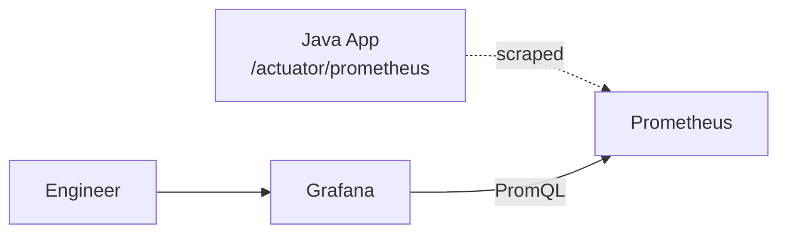

# Metrics (Micrometer, Prometheus, Grafana)

Metrics are numeric measurements over time — request rate, error count, latency, queue depth, JVM heap. Where logs answer "what happened in this one event?", metrics answer "what's the rate / total / distribution across all events?" The modern Java stack — Micrometer (vendor-neutral instrumentation), Prometheus (scrape-based collection), Grafana (visualization) — is so dominant in 2026 that knowing it is table stakes for senior Java backend engineers.

This topic covers the metric primitives (counter, gauge, histogram), how to instrument Spring Boot via Micrometer, Prometheus's pull model and PromQL, Grafana dashboards, the RED and Golden Signals frameworks, and the bridge to SLO management.

> [!NOTE]
> Prerequisites: basic Spring Boot familiarity.

## Why Metrics

Logs scale linearly with traffic. Metrics scale logarithmically (more data = same number of buckets). For aggregate questions ("what's our p99 latency?", "what's our error rate?"), metrics are *much* cheaper and faster than scanning logs.

The complementary roles:
- **Logs**: discrete events, full context, expensive at scale.
- **Metrics**: aggregated numbers, cheap, lossy.
- **Traces**: per-request flow across services.

Together: the "three pillars of observability".

## Metric Types

### Counter

Monotonically increasing value. Example: total HTTP requests.

```java
Counter requests = Counter.builder("http.requests.total")
    .description("Total HTTP requests")
    .tag("method", "GET")
    .tag("endpoint", "/api/users")
    .register(meterRegistry);

requests.increment();
```

Always counts up. To compute rate: `rate(requests[1m])` in PromQL.

### Gauge

Current value (can go up or down). Example: current connection count, heap usage.

```java
AtomicInteger activeConnections = new AtomicInteger();
Gauge.builder("db.connections.active", activeConnections, AtomicInteger::get)
    .description("Active DB connections")
    .register(meterRegistry);

activeConnections.incrementAndGet();
// ...
activeConnections.decrementAndGet();
```

### Timer / Histogram

Distribution of values, typically duration. Counts, sums, percentiles.

```java
Timer requestTimer = Timer.builder("http.request.duration")
    .description("HTTP request duration")
    .tag("endpoint", "/api/users")
    .publishPercentiles(0.5, 0.95, 0.99)
    .publishPercentileHistogram()
    .register(meterRegistry);

requestTimer.record(() -> {
    // ... handle request
});
```

A histogram buckets values: count per bucket (0-10ms, 10-100ms, etc.). Percentiles computed across buckets.

### Summary

Like histogram but pre-computes percentiles. Less flexible (no aggregation across instances).

Most teams use histograms (Prometheus-friendly).

## Micrometer — The Instrumentation API

Micrometer is "SLF4J for metrics" — vendor-neutral, multiple backend support.

```java
import io.micrometer.core.instrument.*;

@Service
public class CheckoutService {
    private final Counter checkoutCounter;
    private final Timer checkoutTimer;
    
    public CheckoutService(MeterRegistry registry) {
        this.checkoutCounter = Counter.builder("checkouts.total")
            .tag("type", "online")
            .register(registry);
        this.checkoutTimer = Timer.builder("checkouts.duration")
            .publishPercentileHistogram()
            .register(registry);
    }
    
    public Receipt checkout(Cart cart) {
        return checkoutTimer.record(() -> {
            Receipt receipt = doCheckout(cart);
            checkoutCounter.increment();
            return receipt;
        });
    }
}
```

Spring Boot auto-configures Micrometer; just inject `MeterRegistry`.

## Spring Boot Actuator + Prometheus

Add dependencies:
```xml
<dependency>
  <groupId>org.springframework.boot</groupId>
  <artifactId>spring-boot-starter-actuator</artifactId>
</dependency>
<dependency>
  <groupId>io.micrometer</groupId>
  <artifactId>micrometer-registry-prometheus</artifactId>
</dependency>
```

Configure:
```yaml
management:
  endpoints:
    web:
      exposure:
        include: health, info, metrics, prometheus
  metrics:
    distribution:
      percentiles-histogram:
        http.server.requests: true
      slo:
        http.server.requests: 50ms, 100ms, 500ms
```

Now `/actuator/prometheus` exposes metrics in Prometheus format:

```
# HELP http_server_requests_seconds Duration of HTTP server request handling
# TYPE http_server_requests_seconds histogram
http_server_requests_seconds_bucket{method="GET",uri="/api/users",le="0.05"} 1234
http_server_requests_seconds_bucket{method="GET",uri="/api/users",le="0.1"} 1567
http_server_requests_seconds_count{method="GET",uri="/api/users"} 2000
http_server_requests_seconds_sum{method="GET",uri="/api/users"} 89.234
```

Spring Boot automatically instruments:
- HTTP requests (`http.server.requests`).
- JVM (heap, GC, threads).
- Tomcat/Jetty/Undertow stats.
- DB connection pool (HikariCP).
- Kafka, RabbitMQ if used.
- Logback events.

## Prometheus — The Scraper

Prometheus runs as a separate service. It *scrapes* `/actuator/prometheus` periodically (default 15s).

```yaml
# prometheus.yml
scrape_configs:
- job_name: 'myapp'
  metrics_path: '/actuator/prometheus'
  static_configs:
  - targets: ['myapp:8080']
```

In Kubernetes with the Prometheus operator:
```yaml
apiVersion: monitoring.coreos.com/v1
kind: ServiceMonitor
metadata:
  name: myapp
spec:
  selector:
    matchLabels:
      app: myapp
  endpoints:
  - port: web
    path: /actuator/prometheus
    interval: 15s
```

Prometheus stores time-series data. Query with PromQL.

## PromQL Basics

```promql
# Current request rate
rate(http_server_requests_seconds_count[5m])

# Error rate
sum(rate(http_server_requests_seconds_count{status=~"5.."}[5m])) /
sum(rate(http_server_requests_seconds_count[5m]))

# p99 latency
histogram_quantile(0.99, 
  sum by (le, uri) (rate(http_server_requests_seconds_bucket[5m]))
)

# JVM heap usage %
jvm_memory_used_bytes{area="heap"} / jvm_memory_max_bytes{area="heap"} * 100

# Most-called endpoints
topk(10, sum by (uri) (rate(http_server_requests_seconds_count[5m])))
```

## The Pull Model

Prometheus *pulls* metrics from targets. The advantages:
- **Centralized config**: Prometheus knows what to scrape.
- **Health visibility**: scrape failure = target down.
- **Simpler clients**: just expose an endpoint.

The challenges:
- **Short-lived jobs** (CronJobs, batch): scraper might miss. Use Pushgateway.
- **Firewall complexity**: Prometheus must reach targets.

For most Spring Boot services, pull works perfectly.

## Grafana — Visualization

Grafana queries Prometheus and renders dashboards.



A typical Spring Boot dashboard shows:
- Request rate by endpoint.
- Error rate (%).
- p50, p95, p99 latency.
- JVM heap usage.
- GC pause time.
- Active threads.
- DB connection pool usage.

JVM dashboards: search Grafana.com for "Spring Boot" or "JVM" dashboards.

## The RED Method

For request-driven services, monitor:
- **R**ate: requests per second.
- **E**rrors: errors per second.
- **D**uration: latency distribution.

For a Spring Boot service, these are all in `http.server.requests`.

## The USE Method

For resources (machines, disks, networks):
- **U**tilization: % busy.
- **S**aturation: queue depth, beyond capacity.
- **E**rrors: failure count.

Useful for infrastructure metrics (CPU, memory, disk I/O).

## The Four Golden Signals (Google SRE)

- **Latency**: time to serve a request (split success vs error).
- **Traffic**: how much demand?
- **Errors**: rate of failed requests.
- **Saturation**: how full the service is.

A super-set of RED, emphasizing saturation. Google's classic.

## Histograms And Percentiles

Why histograms over averages? Averages hide tail latency.

```
Request times: [10ms, 10ms, 10ms, 10ms, 5000ms]
Average: 1008ms (looks bad)
p50:     10ms (looks fine)
p99:     5000ms (caught the tail!)
```

Always look at percentiles, not averages.

Prometheus histograms work with `histogram_quantile`:
```promql
histogram_quantile(0.99, sum by (le) (rate(http_server_requests_seconds_bucket[5m])))
```

## Custom Metrics

Domain-specific metrics. Example: orders per minute, payment success rate.

```java
@Service
public class OrderService {
    private final Counter ordersPlaced;
    private final Counter ordersFailed;
    private final DistributionSummary orderValue;
    
    public OrderService(MeterRegistry registry) {
        this.ordersPlaced = Counter.builder("business.orders.placed")
            .description("Orders successfully placed")
            .register(registry);
        this.ordersFailed = Counter.builder("business.orders.failed")
            .description("Orders that failed")
            .register(registry);
        this.orderValue = DistributionSummary.builder("business.order.value")
            .description("Order value in USD")
            .baseUnit("usd")
            .register(registry);
    }
    
    public Order placeOrder(Cart cart) {
        try {
            Order order = create(cart);
            ordersPlaced.increment();
            orderValue.record(order.getTotal());
            return order;
        } catch (Exception e) {
            ordersFailed.increment();
            throw e;
        }
    }
}
```

## High-Cardinality Tags

> [!WARNING]
> **Don't tag with high-cardinality values** (user IDs, request IDs, URLs with IDs).

Each unique tag combination creates a time series. With user IDs, you get one series per user → millions. Prometheus OOMs.

Bad:
```java
Counter.builder("requests").tag("user", userId).register(registry).increment();
```

Good:
```java
Counter.builder("requests").tag("endpoint", "/users").register(registry).increment();
```

Aggregate by endpoint, not user.

## Alertmanager

Prometheus's alert system:

```yaml
groups:
- name: myapp
  rules:
  - alert: HighErrorRate
    expr: |
      sum(rate(http_server_requests_seconds_count{status=~"5.."}[5m])) /
      sum(rate(http_server_requests_seconds_count[5m])) > 0.01
    for: 5m
    labels:
      severity: critical
    annotations:
      summary: "Error rate above 1%"
```

Fires alerts to PagerDuty, Slack, email. Covered in T15.

## Anti-Patterns

> [!WARNING]
> **High-cardinality tags.** OOMs Prometheus.

> [!WARNING]
> **Counter that goes down.** Use gauge.

> [!WARNING]
> **Averages over distributions.** Always percentiles.

> [!WARNING]
> **No metric naming convention.** Inconsistency makes dashboards fragile.

> [!WARNING]
> **Logging instead of counting.** "Order placed" log per order is expensive. Counter is cheap.

> [!WARNING]
> **Scrape interval too short.** 15s is default. Sub-second is wasteful.

> [!WARNING]
> **Dashboards no one looks at.** Add only when actively used.

> [!WARNING]
> **No SLO tracking.** Metrics without context don't drive decisions.

## Common Misconceptions

> [!WARNING]
> **"Metrics replace logs."** They don't. Metrics tell you something is wrong; logs explain why.

> [!WARNING]
> **"Prometheus is push-based."** It's pull. Pushgateway exists for special cases.

> [!WARNING]
> **"Tags are free."** Cardinality costs memory.

> [!WARNING]
> **"Percentiles can be averaged."** No. `avg(p99 across pods)` is wrong; aggregate histograms instead.

> [!WARNING]
> **"More dashboards = more observable."** Often noise. Curate ruthlessly.

## Practice

1. **Spring Boot + Prometheus**: add Micrometer + Prometheus registry. View `/actuator/prometheus`.
2. **Local Prometheus**: run Prometheus via Docker, scrape your app.
3. **Local Grafana**: run Grafana via Docker. Connect Prometheus. Build a dashboard.
4. **Custom counter**: add a business metric for some action.
5. **Custom timer**: time a critical method.
6. **PromQL practice**: write queries for rate, error %, p99 latency.
7. **Alerting**: configure an alert for high error rate. Trigger it.
8. **Cardinality test**: tag with random UUIDs; observe Prometheus memory growth.
9. **JVM dashboard**: import a community JVM dashboard. Customize.

## Recap

You should now be able to:

- Distinguish counter, gauge, timer, distribution summary.
- Instrument Spring Boot with Micrometer.
- Scrape metrics with Prometheus.
- Write PromQL queries (rate, percentile, error %).
- Build Grafana dashboards.
- Apply RED, USE, and Golden Signals frameworks.
- Avoid high-cardinality and other anti-patterns.
- Bridge from metrics to alerting and SLOs.

## Next

Continue to [Distributed tracing (OpenTelemetry, Jaeger, Zipkin)](./T13-distributed-tracing-opentelemetry-jaeger-zipkin.md) — the third pillar of observability, showing per-request flow across services.
