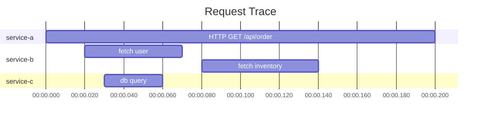
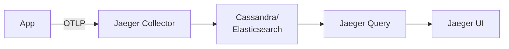
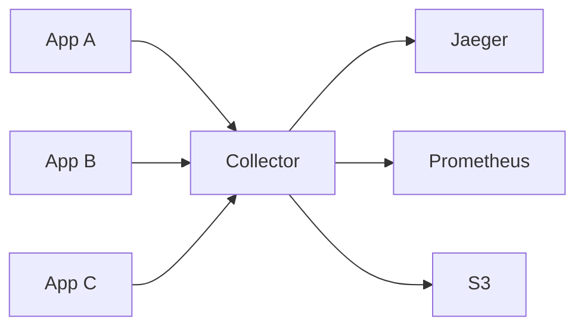

# Distributed tracing (OpenTelemetry, Jaeger, Zipkin)

In a monolith, a stack trace tells you the full story. In microservices, a single user request fans out across 5, 20, or 100 services — and any one of them can be the bottleneck. Distributed tracing is how you see that fan-out: each service emits *spans* tagged with a shared *trace ID*, and a tracing backend (Jaeger, Tempo, Datadog) reconstructs the per-request flow as a waterfall diagram. Without it, debugging distributed systems is guesswork.

This topic covers the conceptual model from Google's 2010 Dapper paper, the OpenTelemetry standard that now unifies tracing/metrics/logs, W3C Trace Context propagation, Jaeger/Zipkin/Tempo as backends, and how to instrument Spring Boot apps in 2026.

> [!NOTE]
> Prerequisites: [Metrics (L4/C10/T12)](./T12-metrics-micrometer-prometheus-grafana.md). Basic understanding of microservices.

## The Problem

Service A calls B calls C calls D. User complains the request is slow. Where's the bottleneck?

Logs alone can't tell you — they're per-service. You'd grep each service's logs for the same request, manually assemble. With 20+ services, infeasible.

Distributed tracing automates this. Each service emits a *span* (a timed operation) with metadata. All spans for one user request share a *trace ID*. The tracing system reconstructs the call graph.

## Origins — Google Dapper

Google's "Dapper, a Large-Scale Distributed Systems Tracing Infrastructure" paper (2010, by Benjamin Sigelman et al.) defined the model.

Key ideas:
- **Trace**: one logical request.
- **Span**: one operation within a trace.
- **Parent/child relations**: spans form a tree.
- **Context propagation**: trace ID passes between services.
- **Sampling**: only a fraction traced (Google sampled 0.001%).

Twitter built Zipkin (2012) on these ideas. Uber built Jaeger (2015). Eventually OpenTelemetry (2019) unified them.

## Spans And Traces

A *span* represents one operation:
- Name (e.g., `GET /users/{id}`).
- Start and end timestamps.
- Tags (e.g., `http.status_code=200`).
- Parent span ID (or root).
- Trace ID (shared across all spans in this trace).



The trace shows: service-a took 200ms; service-b fetched user (50ms) and inventory (60ms); within fetch user, service-c queried DB for 30ms.

## OpenTelemetry — The Standard

Before OTel: every vendor had its own SDK (Jaeger, Zipkin, Datadog, New Relic). Vendor lock-in.

**OpenTelemetry** (2019, merger of OpenCensus + OpenTracing) is the CNCF standard:
- One SDK per language.
- Multiple exporters (Jaeger, Zipkin, OTLP, Prometheus, etc.).
- Covers traces, metrics, and logs.

By 2026, OpenTelemetry is the only sane choice for new Java services.

## W3C Trace Context — Propagation

How does the trace ID move from service A to service B? Via HTTP headers.

W3C Trace Context (2020):
- `traceparent`: `00-{trace-id}-{span-id}-{flags}` (W3C standard).
- `tracestate`: vendor-specific extensions.

Example:
```
traceparent: 00-4bf92f3577b34da6a3ce929d0e0e4736-00f067aa0ba902b7-01
```

- `00`: version.
- `4bf92f...`: trace ID (32 hex chars = 128 bits).
- `00f067...`: parent span ID (16 hex chars = 64 bits).
- `01`: flags (01 = sampled).

Service A creates the trace, sends `traceparent` header. Service B reads it, creates a child span with same trace ID, propagates further.

## Spring Boot + OpenTelemetry

Two integration approaches:

### Auto-Instrumentation (Java Agent)

Attach the OTel Java agent at JVM startup:
```bash
java -javaagent:opentelemetry-javaagent.jar \
     -Dotel.service.name=myapp \
     -Dotel.exporter.otlp.endpoint=http://collector:4317 \
     -jar app.jar
```

Auto-instruments: HTTP clients/servers, JDBC, Kafka, Redis, gRPC, JMS, and more. Zero code changes.

### Spring Boot + Micrometer Tracing

Spring Boot 3 / Spring Framework 6 use Micrometer Tracing (replacement for Spring Cloud Sleuth):

```xml
<dependency>
  <groupId>org.springframework.boot</groupId>
  <artifactId>spring-boot-starter-actuator</artifactId>
</dependency>
<dependency>
  <groupId>io.micrometer</groupId>
  <artifactId>micrometer-tracing-bridge-otel</artifactId>
</dependency>
<dependency>
  <groupId>io.opentelemetry</groupId>
  <artifactId>opentelemetry-exporter-otlp</artifactId>
</dependency>
```

```yaml
management:
  tracing:
    sampling:
      probability: 1.0  # 100% for dev; lower for prod
otel:
  exporter:
    otlp:
      endpoint: http://collector:4317
```

Spring Boot auto-instruments HTTP, JDBC, RestTemplate, WebClient, Kafka, etc.

Trace IDs auto-populate into MDC, so logs include them:
```
2026-06-08 10:00:00 INFO [trace_id=4bf92f...] [span_id=00f067...] Processing order
```

Now you can correlate logs with traces.

## Custom Spans

Add app-specific spans:

```java
import io.micrometer.tracing.Tracer;

@Service
public class CheckoutService {
    @Autowired
    private Tracer tracer;
    
    public Receipt checkout(Cart cart) {
        var span = tracer.nextSpan().name("checkout").start();
        try (var ws = tracer.withSpan(span)) {
            span.tag("cart.size", String.valueOf(cart.size()));
            span.tag("cart.total", String.valueOf(cart.total()));
            
            Receipt receipt = doCheckout(cart);
            span.tag("receipt.id", receipt.getId());
            return receipt;
        } catch (Exception e) {
            span.error(e);
            throw e;
        } finally {
            span.end();
        }
    }
}
```

Or use OTel directly:

```java
import io.opentelemetry.api.trace.*;

Tracer tracer = openTelemetry.getTracer("checkout-service");
Span span = tracer.spanBuilder("processOrder")
    .setAttribute("orderId", order.getId())
    .startSpan();

try (Scope scope = span.makeCurrent()) {
    // ... do work
    span.setStatus(StatusCode.OK);
} catch (Exception e) {
    span.recordException(e);
    span.setStatus(StatusCode.ERROR);
    throw e;
} finally {
    span.end();
}
```

## Backends — Jaeger, Zipkin, Tempo

### Jaeger

Uber's tracer, CNCF graduated. Most popular self-hosted.



UI shows traces, waterfall view, span details, comparison.

### Zipkin

Twitter's tracer, simpler than Jaeger. Smaller footprint.

### Grafana Tempo

Grafana's tracing backend. Stores in object storage (S3). Cheap at scale. Integrates with Grafana directly.

### Cloud Vendors

- **AWS X-Ray**: AWS-native.
- **Google Cloud Trace**.
- **Datadog APM**: SaaS, very popular.
- **New Relic**: SaaS APM.

All accept OTLP. Use OpenTelemetry, swap backends as needed.

## OTel Collector

A separate process (or sidecar) that receives spans, processes, and exports.



Why use a collector:
- **Decouple apps from backends**: change backend without redeploying apps.
- **Batching**: efficient export.
- **Sampling**: head-based or tail-based.
- **Enrichment**: add common attributes.
- **Routing**: send different data to different backends.

```yaml
# otel-collector-config.yaml
receivers:
  otlp:
    protocols:
      grpc:
      http:
processors:
  batch:
  resource:
    attributes:
    - key: cluster
      value: prod-us-west-2
      action: upsert
exporters:
  jaeger:
    endpoint: jaeger-collector:14250
  prometheus:
    endpoint: 0.0.0.0:9090
service:
  pipelines:
    traces:
      receivers: [otlp]
      processors: [batch, resource]
      exporters: [jaeger]
```

## Sampling

Tracing every request is expensive. Sample a fraction.

### Head-Based Sampling

Decide at trace start: keep or drop.

```yaml
management:
  tracing:
    sampling:
      probability: 0.1   # 10%
```

Pros: simple, predictable cost.
Cons: errors may not be sampled.

### Tail-Based Sampling

Buffer all spans; decide after the trace completes.

Rules:
- Keep all error traces.
- Keep all traces > 1s.
- Sample 1% of fast successes.

Requires OTel Collector with tail-sampling processor:

```yaml
processors:
  tail_sampling:
    policies:
    - name: errors
      type: status_code
      status_code: {status_codes: [ERROR]}
    - name: slow
      type: latency
      latency: {threshold_ms: 1000}
    - name: random
      type: probabilistic
      probabilistic: {sampling_percentage: 1}
```

## Trace + Logs + Metrics — Together

In 2026, the three pillars are unified via OpenTelemetry. Best practice:

- **Logs include trace_id** (via MDC).
- **Metrics include exemplar trace_id** for slow requests.
- **Traces include log lines** as span events.

From Grafana, click a slow metric data point → jump to one of the slow traces → see the spans → click a span → see logs for that trace ID. Seamless.

## Baggage — Propagating Application Context

Sometimes you want to propagate context (e.g., user ID, feature flag) across services without modifying every API:

```java
Baggage.fromContext(Context.current())
    .toBuilder()
    .put("user.id", userId)
    .build();
```

Baggage flows in W3C `baggage` header. Available downstream:

```java
String userId = Baggage.fromContext(Context.current()).getEntryValue("user.id");
```

Use sparingly — baggage bloats every HTTP request.

## Performance Cost

Auto-instrumentation: ~5-10% CPU overhead. Acceptable for most workloads.

Optimizations:
- Lower sampling rate.
- Disable hot instrumentations you don't need.
- Use async exporters (default).

## Production Checklist

For a Spring Boot service:
- [ ] OTel auto-instrumentation enabled.
- [ ] OTLP exporter pointed at collector.
- [ ] Sampling configured (1-10% typical).
- [ ] Custom spans for key business operations.
- [ ] Trace IDs in logs (via MDC).
- [ ] DB calls instrumented (auto).
- [ ] HTTP clients instrumented (auto).
- [ ] Kafka producers/consumers instrumented (auto).
- [ ] Trace context propagated to external systems where possible.

## Anti-Patterns

> [!WARNING]
> **Instrumenting only success paths.** Errors are when traces are most valuable.

> [!WARNING]
> **Excessive custom spans.** One per major operation, not per line.

> [!WARNING]
> **Forgetting span.end().** Resource leak; span never reported.

> [!WARNING]
> **High-cardinality span names.** `GET /users/123` — use `GET /users/{id}` template.

> [!WARNING]
> **Sampling at 100% in production.** Expensive.

> [!WARNING]
> **No propagation to async work.** Spans don't follow new threads automatically.

> [!WARNING]
> **Vendor-specific SDK in 2026.** Use OTel.

> [!WARNING]
> **Putting secrets in span tags.** Tags are visible in tracing UI.

## Common Misconceptions

> [!WARNING]
> **"Tracing replaces metrics and logs."** It doesn't. All three are needed.

> [!WARNING]
> **"Tracing slows down apps significantly."** Modest overhead with proper sampling.

> [!WARNING]
> **"You need to manually propagate trace context."** Auto-instrumentation handles most cases.

> [!WARNING]
> **"OpenTelemetry is just a SDK."** It's a specification + SDKs + Collector + semantic conventions.

> [!WARNING]
> **"Sampling makes tracing useless."** Tail sampling on errors keeps the important traces.

## Practice

1. **Spring Boot + OTel agent**: attach the agent. Verify traces emitted.
2. **Jaeger locally**: run Jaeger via docker-compose. Send traces to it.
3. **Custom span**: add a custom span around a method.
4. **Trace propagation**: build A → B → C chain. Verify single trace shows all 3.
5. **Trace + logs**: ensure logs include trace_id. Query in Kibana.
6. **Sampling**: set 10%. Verify ~10% of requests appear in Jaeger.
7. **Tail sampling**: configure OTel Collector to keep all error traces.
8. **OTel Collector**: deploy collector. Route to Jaeger and Prometheus.
9. **Baggage**: propagate user ID via baggage; access in downstream service.

## Recap

You should now be able to:

- Explain Dapper's tracing model.
- Use OpenTelemetry for vendor-neutral instrumentation.
- Auto-instrument Spring Boot apps.
- Create custom spans for business operations.
- Propagate trace context via W3C Trace Context.
- Run Jaeger, Zipkin, or Tempo as a backend.
- Deploy and configure OTel Collector.
- Choose head- or tail-based sampling.
- Correlate traces, logs, metrics.

## Next

Continue to [Health checks and readiness/liveness probes](./T14-health-checks-and-readiness-liveness-probes.md) — the K8s-specific patterns for app health visibility and self-healing.
