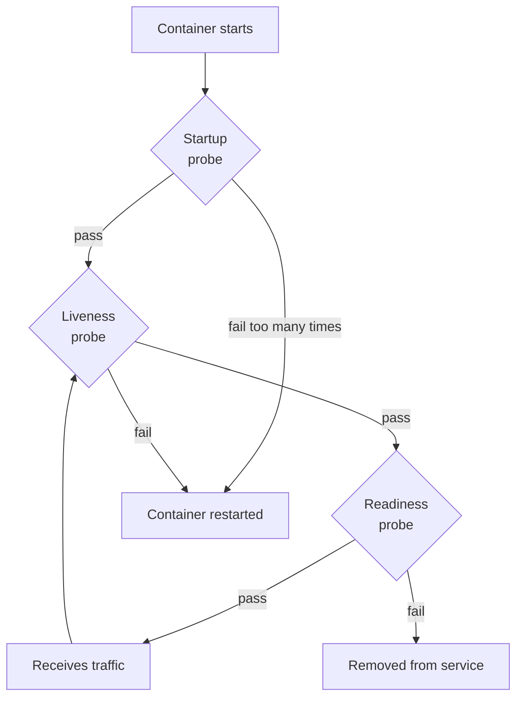

# Health checks and readiness/liveness probes

A health check is the simplest contract between your application and its orchestrator: "Am I alive? Am I ready to serve?" In Kubernetes, the answer drives critical behaviors — should the pod receive traffic, should it be restarted, should it be evicted. Get health checks right and the system self-heals; get them wrong and you get the worst-case combination of *no self-healing* (broken pods receive traffic) plus *false-positive restarts* (healthy pods cycle endlessly under load).

This topic covers liveness vs readiness vs startup probes, Spring Boot Actuator's `/actuator/health/liveness` and `/actuator/health/readiness`, graceful shutdown coordination (SIGTERM → preStop → terminationGracePeriod), and the senior trade-offs (deep vs shallow checks, dependency cascades, slow-start handling).

> [!NOTE]
> Prerequisites: [Kubernetes basics (L4/C10/T03)](./T03-kubernetes-basics.md). Spring Boot Actuator familiarity.

## The Three Probe Types

Kubernetes has three probe types for each container:



### Liveness Probe — "Am I alive?"

Kubernetes asks: "Is this container alive?" If no → restart.

```yaml
livenessProbe:
  httpGet:
    path: /actuator/health/liveness
    port: 8080
  initialDelaySeconds: 30
  periodSeconds: 10
  failureThreshold: 3
```

After 3 consecutive failures (with 10s period), K8s restarts the container.

Use when: app can deadlock, OOM, hang. Common for services with thread pools that can exhaust.

### Readiness Probe — "Can I serve traffic?"

Kubernetes asks: "Should I send this pod traffic?" If no → remove from Service endpoints.

```yaml
readinessProbe:
  httpGet:
    path: /actuator/health/readiness
    port: 8080
  initialDelaySeconds: 10
  periodSeconds: 5
  failureThreshold: 3
```

A readiness failure does NOT restart the pod. It just stops sending traffic until it recovers.

Use when: app temporarily can't serve (warming caches, slow DB, downstream failure).

### Startup Probe — "Am I done starting?"

For slow-starting apps (Spring Boot + heavy classpath = 30-60s).

```yaml
startupProbe:
  httpGet:
    path: /actuator/health/readiness
    port: 8080
  initialDelaySeconds: 10
  periodSeconds: 5
  failureThreshold: 30   # 30 * 5s = 150s max startup
```

Liveness/readiness don't fire until startup probe passes. Avoids killing slow-starters.

## The Distinction Matters

Mixing them up is a common bug.

**Bad: liveness probe checks DB**:
```yaml
livenessProbe:
  httpGet:
    path: /health-with-db  # checks DB
```

When DB has a brief outage:
- Liveness fails → pod restarts.
- New pod starts → DB still down → liveness fails again → restarts.
- All pods cycle.
- Even after DB recovers, pods restart over and over.

**Good: liveness checks only "Am I alive?"**:
```yaml
livenessProbe:
  httpGet:
    path: /actuator/health/liveness
```

`/liveness` checks app-internal health (can the app run?). Not DB.

`/readiness` can check DB — if DB is down, stop traffic. When DB recovers, traffic resumes.

The senior principle:
- **Liveness**: app-internal failure that only restart fixes.
- **Readiness**: temporary inability to serve (recoverable).

## Spring Boot Actuator Probes

Spring Boot 2.3+ has built-in liveness/readiness:

```yaml
management:
  endpoint:
    health:
      probes:
        enabled: true
      show-details: when-authorized
  health:
    livenessstate:
      enabled: true
    readinessstate:
      enabled: true
```

Endpoints:
- `/actuator/health/liveness`: liveness state (LIVE/BROKEN).
- `/actuator/health/readiness`: readiness state (ACCEPTING_TRAFFIC/REFUSING_TRAFFIC).

By default:
- Liveness: just app running.
- Readiness: app started AND health indicators (DB, cache) up.

## Customizing Health Indicators

Spring Boot auto-discovers `HealthIndicator` beans. Default ones: `DataSourceHealthIndicator`, `RedisHealthIndicator`, etc.

Group indicators for readiness vs liveness:

```yaml
management:
  endpoint:
    health:
      group:
        liveness:
          include: livenessState
        readiness:
          include: readinessState, db, redis
```

Now readiness fails if DB or Redis fails. Liveness only cares about app state.

Custom indicator:
```java
@Component
public class CustomReadinessHealth implements HealthIndicator {
    @Override
    public Health health() {
        if (cachesWarm()) {
            return Health.up().build();
        }
        return Health.down().withDetail("reason", "caches still warming").build();
    }
}
```

## Graceful Shutdown

When K8s deletes a pod:

1. Pod gets SIGTERM.
2. preStop hook runs (optional).
3. App should: stop accepting new requests, finish in-flight requests.
4. After `terminationGracePeriodSeconds` (default 30s), K8s sends SIGKILL.

```yaml
spec:
  terminationGracePeriodSeconds: 60
  containers:
  - name: myapp
    lifecycle:
      preStop:
        exec:
          command: ["sh", "-c", "sleep 10"]  # let LB notice readiness=false
```

Spring Boot 2.3+ supports graceful shutdown:

```yaml
server:
  shutdown: graceful
spring:
  lifecycle:
    timeout-per-shutdown-phase: 30s
```

Flow:
1. SIGTERM arrives.
2. Spring Boot stops accepting new requests.
3. Existing requests complete (up to 30s).
4. Spring closes resources (DB pool, etc.).
5. JVM exits.

## The PreStop / Readiness Coordination Problem

There's a subtle race: when K8s starts terminating a pod, the kubelet sends SIGTERM AND the pod is removed from Service endpoints. But endpoint removal propagates *eventually*; for a few seconds, traffic still arrives.

Solution: in preStop, mark readiness=false, sleep a few seconds, then let normal shutdown proceed.

```yaml
lifecycle:
  preStop:
    exec:
      command:
      - sh
      - -c
      - |
        # Mark not-ready so traffic drains
        curl -X POST http://localhost:8080/actuator/health/readiness/refuse || true
        sleep 10
```

Or simpler: rely on iptables propagation delay + connection reuse. But the explicit sleep is safer.

## Probe Pitfalls

### Cascade failures from deep checks

Don't have your health check call all downstream services. One downstream failure cascades:

```
ServiceA.health → ServiceB.health → ServiceC.health → DB
```

If DB is slow, ServiceA's health check is slow. K8s thinks ServiceA is unhealthy. Restarts. New pod's health check is slow. Restart cycle.

Fix: shallow health checks. Service's own health, not downstream.

### Probe period too aggressive

Liveness every 1s + 3 failures = 3s tolerance. Brief GC pause kills the pod.

Fix: periodSeconds 10-30, failureThreshold 3-5.

### initialDelaySeconds too short

Spring Boot takes 30s to start. Liveness probe starts at 10s. Probe fails. Pod restarts before fully starting.

Fix: startup probe (or generous initialDelaySeconds + failureThreshold).

### Sharing probes for liveness + readiness

If readiness path also checks DB, and liveness uses the same path, DB outage = pod restart cycle.

Fix: separate paths/groups.

## HTTP vs TCP vs Exec Probes

Three probe types:

**HTTP**: GET to a URL, status 200-399 = healthy.
```yaml
httpGet:
  path: /healthz
  port: 8080
```

**TCP**: open TCP connection on port. Success = healthy.
```yaml
tcpSocket:
  port: 8080
```

**Exec**: run a command inside the container. Exit 0 = healthy.
```yaml
exec:
  command:
  - cat
  - /tmp/healthy
```

For Spring Boot, HTTP probe to `/actuator/health/*` is canonical.

## Probe Authentication

Probe endpoints shouldn't require auth (kubelet calls them anonymously). Configure Spring Security to permit them:

```java
@Bean
public SecurityFilterChain probeFilterChain(HttpSecurity http) throws Exception {
    return http
        .securityMatcher("/actuator/health/**")
        .authorizeHttpRequests(auth -> auth.anyRequest().permitAll())
        .build();
}
```

But: ensure these endpoints don't leak sensitive data. Use `show-details: when-authorized`.

## Example: Production-Quality Probes

```yaml
apiVersion: apps/v1
kind: Deployment
metadata:
  name: myapp
spec:
  template:
    spec:
      terminationGracePeriodSeconds: 60
      containers:
      - name: myapp
        image: myapp:1.2
        ports:
        - containerPort: 8080
          name: web
        startupProbe:
          httpGet:
            path: /actuator/health/readiness
            port: 8080
          initialDelaySeconds: 10
          periodSeconds: 5
          failureThreshold: 30   # up to 150s for startup
        livenessProbe:
          httpGet:
            path: /actuator/health/liveness
            port: 8080
          periodSeconds: 10
          failureThreshold: 3
          timeoutSeconds: 5
        readinessProbe:
          httpGet:
            path: /actuator/health/readiness
            port: 8080
          periodSeconds: 5
          failureThreshold: 3
          timeoutSeconds: 5
        lifecycle:
          preStop:
            exec:
              command: ["sh", "-c", "sleep 10"]
```

```yaml
# application.yml
management:
  endpoint:
    health:
      probes:
        enabled: true
      group:
        readiness:
          include: readinessState, db
        liveness:
          include: livenessState

server:
  shutdown: graceful
spring:
  lifecycle:
    timeout-per-shutdown-phase: 45s
```

## Signal Handling — PID 1 Problem

Spring Boot must handle SIGTERM. If Java is PID 1 in the container (no init system), it ignores signals unless explicitly handled.

Spring Boot 2.3+ handles SIGTERM properly. But: shell wrapper scripts can break this:

```dockerfile
# BAD
ENTRYPOINT ["sh", "-c", "java -jar app.jar"]
# sh receives SIGTERM, doesn't forward to java.
```

```dockerfile
# GOOD
ENTRYPOINT ["java", "-jar", "/app.jar"]
# Java is PID 1, receives signal directly.

# OR with tini for proper init
ENTRYPOINT ["tini", "--", "java", "-jar", "/app.jar"]
```

## Anti-Patterns

> [!WARNING]
> **Deep health checks.** Cascade failures.

> [!WARNING]
> **Same path for liveness/readiness.** DB outage triggers restart loop.

> [!WARNING]
> **No startup probe for slow apps.** Restarts before fully started.

> [!WARNING]
> **Probe timeout too tight.** GC pauses cause false negatives.

> [!WARNING]
> **No preStop hook.** Traffic arrives after pod starts shutting down.

> [!WARNING]
> **No graceful shutdown.** In-flight requests fail.

> [!WARNING]
> **Probe behind shell wrapper.** Signals don't propagate.

> [!WARNING]
> **Probe endpoint requires auth.** kubelet can't authenticate.

> [!WARNING]
> **Logging full health details.** Sensitive info exposed.

## Common Misconceptions

> [!WARNING]
> **"Liveness probe checks if the app works."** No — it checks if the app needs restart. Readiness checks if it can serve.

> [!WARNING]
> **"More probes = better."** Excess noise. Just liveness + readiness (+ startup if slow).

> [!WARNING]
> **"Probes are free."** They add a small load.

> [!WARNING]
> **"Spring Boot's default is fine."** It usually is, but tune for your DB latency.

> [!WARNING]
> **"Restarts are bad."** Sometimes restart is the right answer (deadlock). Liveness exists for this.

## Practice

1. **Spring Boot probes**: enable `/actuator/health/liveness` and `/readiness`.
2. **Deploy with probes**: configure liveness/readiness in a K8s Deployment.
3. **Slow startup**: simulate 60s startup. Add startup probe. Observe.
4. **Failing readiness**: make readiness fail briefly. Watch pod stay running but lose traffic.
5. **Failing liveness**: make liveness fail. Watch pod restart.
6. **Graceful shutdown**: enable `server.shutdown=graceful`. Send long requests during deploy. Verify completion.
7. **preStop coordination**: add preStop sleep 10. Verify zero-error rolling update.
8. **Custom health indicator**: write one that flips DOWN when a feature flag is set.
9. **Cascade test**: configure deep liveness. Take DB down. Watch restart cycle. Fix.

## Recap

You should now be able to:

- Distinguish liveness, readiness, and startup probes.
- Configure Spring Boot's `/actuator/health/liveness` and `/readiness`.
- Avoid cascade-restart anti-patterns.
- Implement graceful shutdown with preStop and terminationGracePeriod.
- Handle SIGTERM properly (avoid shell wrappers).
- Tune probe periods and thresholds.
- Write custom HealthIndicator beans.

## Next

Continue to [Monitoring and alerting](./T15-monitoring-and-alerting.md) — how metrics, traces, and logs combine to alert on real problems without page fatigue.
