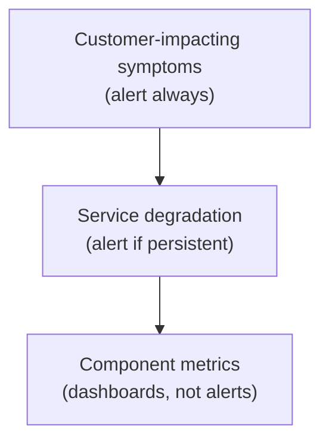

# Monitoring and alerting

Monitoring is the practice of continuously asking "is the system healthy?". Alerting is the practice of waking a human up when the answer is no. These sound simple — and at one or two services they are — but at scale they become one of the hardest engineering problems: too few alerts means real incidents go undetected; too many means humans tune them out (alert fatigue) and miss the real one. The senior craft is calibrating alerts so they fire on customer-impacting symptoms, not on internal anomalies that don't matter.

This topic covers the modern monitoring stack (Prometheus + Alertmanager + PagerDuty), what to alert on (the Golden Signals; SLO burn-rate alerts), how to avoid alert fatigue, and the runbook + on-call discipline that turns alerts into resolutions.

> [!NOTE]
> Prerequisites: [Metrics (L4/C10/T12)](./T12-metrics-micrometer-prometheus-grafana.md).

## Monitoring vs Observability

These terms get conflated. Useful distinction:

- **Monitoring** = checking against *known questions*. "Is error rate > 1%?".
- **Observability** = ability to ask *new questions* of the system. "Why did this one user see a 503 yesterday?".

Monitoring is a subset of observability. Metrics + logs + traces give you both.

## The Alerting Pyramid



- **Symptoms**: "Users see 5xx". Page someone.
- **Causes**: "Disk is full on node X". Maybe page (if symptom isn't fired).
- **Predictors**: "CPU > 80%". Dashboard, not alert (could be fine).

Page on what hurts users. Investigate causes with traces and logs.

## SLI, SLO, SLA — The Reliability Vocabulary

From Google's SRE practice:

- **SLI** (Service Level Indicator): a metric. "% of requests served < 200ms".
- **SLO** (Service Level Objective): an internal target. "99.9% of requests < 200ms over 30 days".
- **SLA** (Service Level Agreement): a contractual promise. "99.5% uptime or refund".

SLOs drive alerts: alert when you're burning your error budget too fast.

## Error Budgets

If SLO is 99.9% over 30 days, you can afford 43 minutes of downtime per month — your *error budget*.

If you've consumed 10% of the budget in 3 days, you'll exhaust it in 30 days. Healthy pace.

If you've consumed 50% in 3 days, you're burning too fast. Alert.

This *burn-rate alerting* is more useful than absolute thresholds because it accounts for sustained vs spike issues.

## Burn-Rate Alerts (Google SRE)

Calculate how fast you're burning:

```
burn_rate = (error_rate / (1 - SLO)) 
```

If SLO = 99.9% (allow 0.1% errors) and current error rate is 1%, burn rate = 10x.

Alert rules:
- **Fast burn**: 14.4x burn for 5 minutes → page immediately (would burn full budget in 2 hours).
- **Slow burn**: 1x burn for 1 hour → ticket (steady degradation).

```yaml
# Alertmanager rules
groups:
- name: slo-burn-rate
  rules:
  - alert: HighErrorBudgetBurn
    expr: |
      (
        sum(rate(http_server_requests_seconds_count{status=~"5.."}[5m])) /
        sum(rate(http_server_requests_seconds_count[5m]))
      ) > 0.0144   # 14.4x burn over 0.001 budget
    for: 5m
    labels:
      severity: page
    annotations:
      summary: "Fast error budget burn"
      runbook: "https://wiki/runbooks/high-errors"
```

## The Four Golden Signals — Alert Material

From Google SRE:

| Signal | Alert Condition |
|--------|-----------------|
| **Latency** | p99 > target for 5 min |
| **Traffic** | Volume drops > 50% from baseline |
| **Errors** | Error rate > 1% |
| **Saturation** | CPU > 90%, mem > 90%, queues full |

Alert on the symptom (errors), not the cause (CPU at 95% might just mean efficient).

## Alertmanager — The Router

Prometheus generates alerts; Alertmanager dispatches them.

```yaml
# alertmanager.yml
route:
  group_by: ['alertname', 'cluster']
  group_wait: 30s
  group_interval: 5m
  repeat_interval: 4h
  receiver: 'default'
  routes:
  - match:
      severity: page
    receiver: pagerduty
  - match:
      severity: warning
    receiver: slack

receivers:
- name: 'default'
  email_configs:
  - to: 'oncall@example.com'

- name: 'pagerduty'
  pagerduty_configs:
  - service_key: 'YOUR_KEY'

- name: 'slack'
  slack_configs:
  - api_url: 'https://hooks.slack.com/...'
    channel: '#alerts'
```

Features:
- **Grouping**: similar alerts batched.
- **Inhibition**: if cluster-down fires, don't fire individual node alerts.
- **Silences**: temporarily suppress (e.g., during maintenance).

## PagerDuty / Opsgenie

Paging services for on-call:
- **Escalation**: page primary; if no ack, page secondary.
- **Schedules**: 24/7 rotations.
- **Incidents**: track resolution, post-mortems.

Integration: Prometheus → Alertmanager → PagerDuty → SMS/phone/app.

## What to Alert On

For a Spring Boot service, typical alerts:

| Alert | Condition | Severity |
|-------|-----------|----------|
| **High error rate** | 5xx > 1% for 5m | page |
| **High latency** | p99 > 1s for 10m | page |
| **Traffic drop** | RPM < 50% of last week | page |
| **Pod restart loop** | restart count > 3 in 15m | warning |
| **Heap usage high** | > 90% for 15m | warning |
| **DB connection pool exhausted** | active = max for 5m | warning |
| **Disk fill** | > 85% for 10m | warning |
| **SSL cert expiring** | < 14 days | ticket |

Each alert needs:
- **Symptom-driven**: user pain, not internal.
- **Actionable**: there's a response.
- **Linked to runbook**: how to respond.

## Avoiding Alert Fatigue

Engineers who get 50 pages a week stop responding to them. Discipline:

1. **Alert reviews**: weekly look at all alerts. Are they useful?
2. **Auto-resolve flaky alerts**: tighten conditions.
3. **Inhibition**: don't page for downstream effects.
4. **Aggregation**: 100 errors → 1 alert.
5. **Tier appropriately**: not everything is page-worthy.
6. **Track noise**: ratio of pages that lead to action.

A good team gets < 5 actionable pages per week per on-caller.

## Runbooks

Every alert links to a runbook:

```markdown
# High Error Rate Alert

## Symptoms
5xx rate > 1% for 5 minutes.

## Likely Causes
1. Database overload.
2. Downstream service failure.
3. Bad deploy.

## Investigation
1. Check Grafana: which endpoints have errors?
2. Check Jaeger: are there error traces?
3. Check recent deploys.

## Mitigation
1. If recent deploy: roll back.
2. If DB: check connections, slow queries.
3. If downstream: enable circuit breaker.

## Escalation
After 30 minutes, page tech lead.
```

Live document. Updated after every incident.

## On-Call Practices

Healthy on-call:
- **Compensated**: extra pay, time off after busy week.
- **Manageable load**: < 5 pages/week.
- **Owned by team**: not a dedicated SRE-only role.
- **Post-incident reviews**: blameless analyses.
- **Runbooks for every alert**.
- **Handoff documents**: what's been ongoing.

Unhealthy on-call:
- 24/7 pager attached.
- 50+ pages/week.
- Same engineers always on-call.
- "We've been firefighting this for months."
- Burnout, attrition.

## Dashboards

Dashboards complement alerts. Not "alerts in a graph", but exploration tools.

Service dashboard:
- RED metrics for HTTP endpoints.
- JVM heap, GC.
- Pod count, restart count.
- DB connection pool, query latency.
- Cache hit rate.
- Custom business metrics.

Cluster dashboard:
- Node CPU, memory, disk.
- Network throughput.
- Pod density per node.

Alerts wake you up; dashboards help you decide what to do.

## Synthetic Monitoring

Don't only wait for users to hit problems. Generate synthetic traffic:

```yaml
# Pingdom / UptimeRobot / Datadog Synthetics config
- name: "Login endpoint"
  url: "https://api.example.com/login"
  method: POST
  body: '{"username": "synthetic", "password": "..."}'
  expect:
    status: 200
    response_time: "<500ms"
  schedule: every 1m
```

Detects outages before real users do. Good for critical user flows.

## Anomaly Detection

For some metrics, fixed thresholds don't work. Traffic varies by time of day.

Use anomaly detection:
- **Holt-Winters forecasting**: predicted traffic; alert on deviation.
- **Machine learning** (Datadog, New Relic).
- **STL decomposition**.

Caveat: harder to tune; more false positives than fixed thresholds.

## Anti-Patterns

> [!WARNING]
> **Alerting on CPU > 80%.** CPU at 95% with no user impact = fine. Alert on user-facing symptoms.

> [!WARNING]
> **No runbook.** Page in middle of night with no actionable info.

> [!WARNING]
> **Same alert at multiple severities.** Confuses responders.

> [!WARNING]
> **No escalation policy.** Primary on-call drowns; nobody notices.

> [!WARNING]
> **Alerting only on errors > 0.** One-off blips fire pages.

> [!WARNING]
> **Email-only alerts.** Lost in inbox.

> [!WARNING]
> **No silences for maintenance.** Get paged during planned work.

> [!WARNING]
> **Alerts that never fire.** Are they configured wrong? Or are they working?

> [!WARNING]
> **Alerts that fire constantly.** Tune or remove.

> [!WARNING]
> **No on-call rotation.** One engineer always carries the pager.

## Common Misconceptions

> [!WARNING]
> **"Monitor everything."** Alert on what matters. Dashboards on the rest.

> [!WARNING]
> **"Page on warning."** Warnings = ticket. Pages = "wake up".

> [!WARNING]
> **"SLAs and SLOs are the same."** SLA is contractual; SLO is internal.

> [!WARNING]
> **"Burn rate is too complex."** It's the most accurate alerting model.

> [!WARNING]
> **"Tools fix alerting problems."** Discipline does. Tools enable.

## Practice

1. **Prometheus + Alertmanager**: configure both. Define a rule. Trigger it.
2. **Burn-rate alert**: implement the Google SRE burn-rate formula.
3. **Alertmanager routing**: route warnings to Slack, pages to PagerDuty.
4. **Runbook**: write one for an existing alert.
5. **Alert review**: list every alert in your system. Is each actionable?
6. **Synthetic check**: configure synthetic monitoring for one endpoint.
7. **SLO definition**: define an SLO for one service. Compute the error budget.
8. **PagerDuty integration**: integrate Alertmanager → PagerDuty test.
9. **Inhibition**: configure: when "cluster-down" fires, suppress individual node alerts.

## Recap

You should now be able to:

- Distinguish monitoring from observability.
- Define SLIs, SLOs, error budgets.
- Implement burn-rate alerts.
- Configure Alertmanager and route to PagerDuty/Slack.
- Avoid alert fatigue through hygiene and discipline.
- Write runbooks linked from alerts.
- Run a healthy on-call rotation.
- Use synthetic monitoring for critical paths.

## Next

Continue to [SRE concepts (error budgets, toil)](./T16-sre-concepts-error-budgets-toil.md) — Google's Site Reliability Engineering practice that formalizes the principles behind everything in this chapter.
