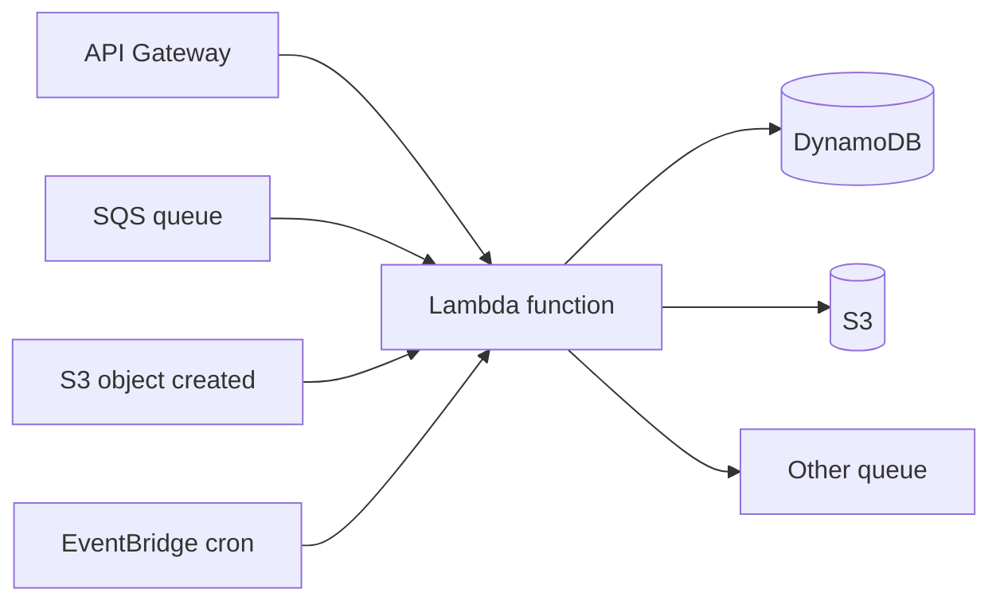
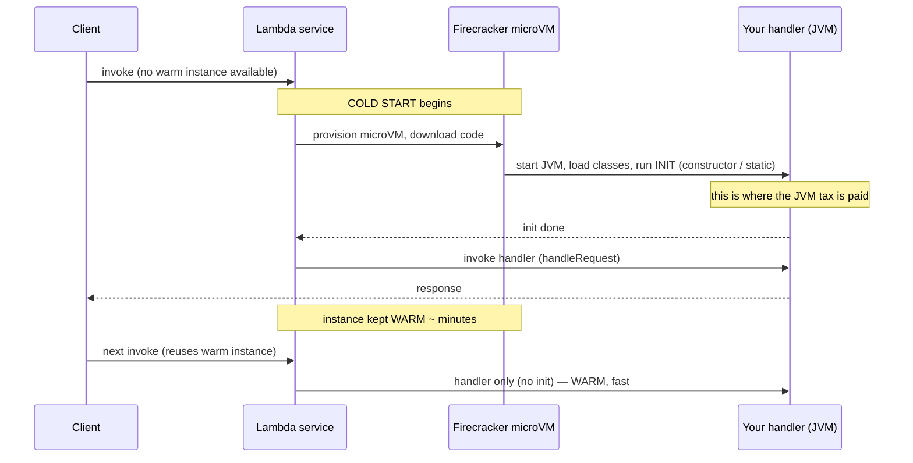
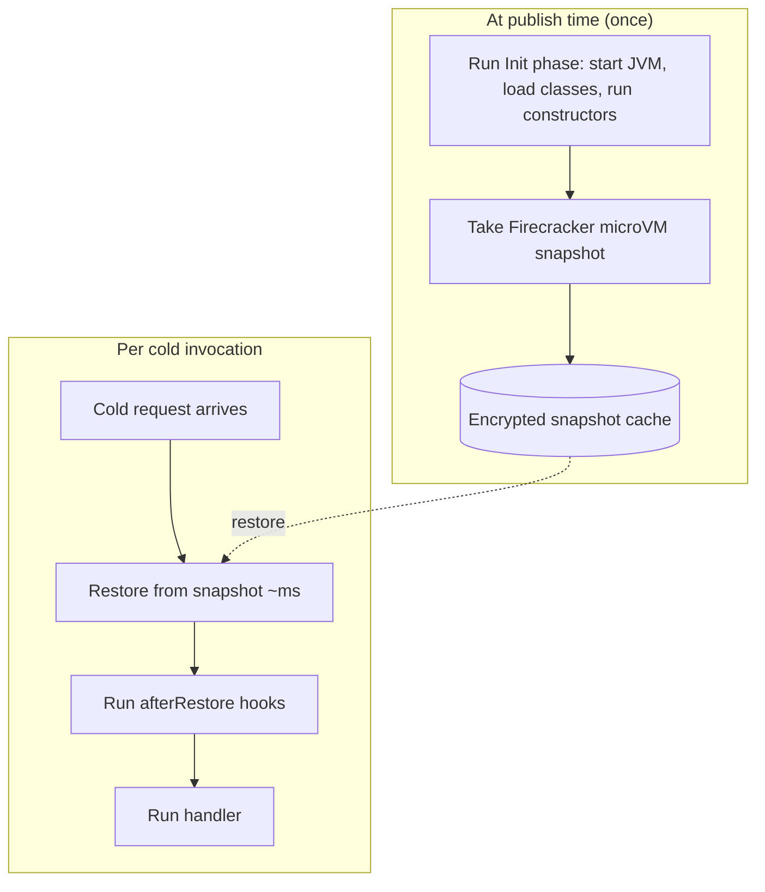

# Serverless Java: AWS Lambda, SnapStart & Cold Starts

**Serverless** does not mean "no servers." It means *you* never provision, patch, or right-size a server — the cloud provider runs your code on demand, scales it from zero to thousands of concurrent copies in seconds, and bills you per request (down to the millisecond) instead of per running hour. The dominant flavor is **Function as a Service (FaaS)**: you ship a single function, the platform wires it to an event source, and it runs only when an event arrives. AWS Lambda (launched 2014) is the archetype; Google Cloud Functions, Azure Functions, and Cloudflare Workers are the major peers.

For Java engineers, serverless has always come with an asterisk. The JVM is a *long-running* runtime — it pays a heavy startup tax (class loading, bytecode verification, JIT warmup) on the bet that the process lives for hours and amortizes that cost across millions of requests. FaaS inverts that bet: a function instance might handle one request and die. That mismatch produced the infamous **Java cold start**, and for years it made teams reach for Node.js or Python on Lambda even when their backend was Java. This topic explains the model, the cold-start problem in JVM-level detail, and the three modern fixes a senior engineer needs to reason about in 2026 — **SnapStart**, **GraalVM native image**, and **provisioned concurrency** — plus when *not* to go serverless at all.

> [!NOTE]
> Prerequisites: [Docker & containerization for Java (L4/C10/T01)](./T01-docker-and-containerization-for-java.md), [Cloud basics for Java devs (L4/C10/T07)](./T07-cloud-basics-for-java-devs-aws-gcp-azure.md), and ideally [AOT & GraalVM native image (L3/C02/T05)](../../L3-advanced-jvm/C02-jvm-internals-and-performance/T05-aot-and-graalvm-native-image.md).

## What Serverless / FaaS Actually Is

Strip away the marketing and serverless rests on three concrete properties:

- **Scale to zero.** When no requests arrive, *nothing runs* and you pay *nothing* (beyond storage). A traditional container or VM costs money 24/7 even at 3 a.m. with zero traffic.
- **Per-request, sub-second billing.** Lambda bills for the milliseconds your function actually executes, multiplied by the memory you allocate (GB-seconds), plus a small per-invocation fee. No idle cost.
- **No server management.** No OS patching, no capacity planning, no autoscaling-group tuning. The platform owns the fleet; you own a function.

The price of those properties is **loss of control**: you cannot keep state in memory between invocations (reliably), you get a hard execution-time ceiling (Lambda caps at 15 minutes), and — the crux of this topic — you inherit a *startup latency* every time the platform has to create a fresh instance.

### The Event-Driven Model

A Lambda function does nothing on its own. It is wired to an **event source**, and the shape of the event source drives the architecture:

- **API Gateway / Lambda Function URLs** — synchronous HTTP. A user is waiting; **latency matters most here**, which is exactly where Java cold starts hurt.
- **SQS / SNS / EventBridge** — asynchronous messages and events. The platform invokes your function per message (or per batch). A few hundred ms of cold start is usually invisible to the end user.
- **S3 / DynamoDB Streams / Kinesis** — data-trigger functions: "an object was uploaded," "a row changed." Classic *glue* work.
- **Scheduled (EventBridge cron)** — cron-style batch jobs.



> [!TIP]
> A good mental sorting rule: **if a human is blocked waiting on the response, cold start is a UX problem; if a machine is processing a backlog, cold start is usually free.** Most of the Java-on-Lambda pain — and most of the fixes below — exist to make the *synchronous, human-waiting* case viable.

## The Lambda Execution Lifecycle

To understand cold starts you have to know what the platform does behind a single invocation. Lambda runs your code inside a **Firecracker microVM** — a lightweight KVM-based virtual machine that boots in milliseconds, giving VM-grade isolation at container-grade speed.



The instance is split into two phases that matter enormously for billing and latency:

- **Init phase** — the microVM is created, your deployment artifact is loaded, the runtime starts, and your *initialization code* runs (static initializers, the handler class constructor, and anything outside the handler method). On Java this is where the JVM bootstraps and your dependency-injection container (Spring, etc.) wires itself up.
- **Invoke phase** — your handler method runs against the actual event. Warm instances skip straight to here.

After a response, the platform **freezes** the instance and keeps it warm for some minutes (the exact window is undocumented and varies — *hedge*). The next request to a warm instance skips Init entirely. The problem is the request that *doesn't* find a warm instance: a traffic spike, or scaling out to a second concurrent instance, forces a fresh cold start.

> [!IMPORTANT]
> Lambda runs *one request per instance at a time*. To serve 100 concurrent requests, Lambda spins up 100 instances — each of which may cold-start. This is why a sudden burst, not steady load, is the cold-start nightmare: every new concurrent slot is a fresh JVM boot.

### How Billing and Concurrency Interact

Two billing facts shape every Java-on-Lambda decision:

- **Init time may or may not be billed depending on the path.** For a standard cold start, the Init phase is generally *not* billed as invoke duration (it shows separately as `Init Duration` in CloudWatch). With **SnapStart**, the model differs — restore work is charged as part of the invocation (*verify current AWS pricing, as this has changed over time*). The practical takeaway: watch `Init Duration` and `Restore Duration` in your logs, not just `Duration`.
- **You pay GB-seconds.** Cost = (memory in GB) x (billed duration) + per-invocation fee. This is why "more memory finishes faster" can *lower* the bill: a function at 2x memory that finishes in less than half the time costs less overall, *and* gives a better latency. This is the single most counterintuitive Lambda cost lever for Java engineers.

Concurrency also has structure worth knowing: there's a per-account **concurrency limit** across all functions in a region, an initial **burst limit** on how fast Lambda will spin up new instances, and after that it scales more gradually. A flash crowd can therefore hit *both* cold starts *and* throttling at once — another reason latency-critical Java functions pair SnapStart with a provisioned-concurrency floor.

## Why Java Specifically Suffers: The Cold-Start Tax

Think of a cold start like **starting a car from frozen on a winter morning every single trip** — choke out, let the oil warm, wait for the engine to run smoothly — versus a warm instance, which is a car that's been idling in the driveway and just needs you to step on the gas. A Node.js or Python function is a small, light scooter that fires instantly. The JVM is a powerful but cold diesel engine.

The Java cold-start cost has two distinct components, and conflating them leads to bad fixes:

1. **Startup / class loading.** The JVM must load, verify, and link thousands of classes — the JDK runtime, your framework (Spring Boot can be 5,000–10,000+ classes), and your code — before a single line of business logic runs. This is largely *fixed work* that happens on every cold start.
2. **JIT warmup.** The JVM starts interpreting bytecode, profiles it, and only *after thousands of executions* compiles hot paths to optimized native code (C1 then C2 — see [JIT compilation (L3/C02/T04)](../../L3-advanced-jvm/C02-jvm-internals-and-performance/T04-jit-compilation-c1-c2-tiered.md)). A function that handles one request and dies *never reaches peak performance* — it runs entirely in slow interpreted/C1 mode.

The combined effect: a plain Spring Boot function can take **3–6 seconds** to cold start (illustrative — depends heavily on dependencies and memory), while the same logic in Python starts in ~200 ms. For an async S3-triggered function nobody cares. For a synchronous API behind a user click, a multi-second p99 is unacceptable. **That is why Java was historically considered a poor FaaS fit.**

### What the JVM Is Actually Doing in Those Seconds

It helps to picture *where the time goes*, because each fix targets a specific slice:

- **Bytecode verification.** Every class the JVM loads is verified for type-safety before linking. For thousands of classes this is non-trivial CPU work — and it is pure overhead that a native binary skips entirely.
- **Class metadata into Metaspace.** Loaded classes populate **Metaspace** (native, off-heap memory holding class structures, method tables, constant pools). On a fresh instance this is built from scratch; SnapStart restores it pre-populated because Metaspace is part of the captured process image.
- **Heap allocation and zeroing.** The JVM reserves and touches heap pages; the singletons your framework creates during context init are allocated and retained.
- **Reflection and dynamic proxies.** Frameworks like Spring lean heavily on reflection and generated proxies at startup — each reflective lookup and each generated proxy class is more loading and more verification. This is also precisely what makes the *native* path hard: those dynamic behaviors must be declared at build time instead.
- **Interpretation before compilation.** Until the JIT kicks in, *everything* runs in the bytecode interpreter — typically an order of magnitude slower than compiled code — which is why even a "started" but un-warmed JVM serves its first requests slowly.

The throughline: a fresh JVM rebuilds a large amount of *in-memory structure* on every cold start. SnapStart's insight is that this structure is identical every time, so it can be **captured once and cloned**; native image's insight is that most of it doesn't need to exist at all if you compile ahead of time.

> [!INTERVIEW]
> *"Why does Java cold-start badly on Lambda, and which of SnapStart and GraalVM native image attacks which part of the problem?"* — Strong answer: the tax is **class-loading/startup** plus **JIT warmup**. **SnapStart** attacks startup by snapshotting an *already-initialized* JVM and restoring it, so class loading and your init code don't re-run — but it does *not* re-warm the JIT, so the first few post-restore requests still run cold-compiled. **GraalVM native image** attacks both: it AOT-compiles everything to a native binary, so there is no class loading and no JIT at all — startup is tens of milliseconds and peak performance is immediate, at the cost of build complexity and reflection configuration. Mentioning that distinction — *SnapStart fixes init, native fixes init + warmup* — is what separates a senior answer from a memorized one.

## A Java Lambda Handler

The contract is small: implement `RequestHandler<Input, Output>`. Crucially, **anything you initialize outside the handler method runs once during Init and is reused across warm invocations** — this is the single most important performance lever you control.

```java
package com.example;

import com.amazonaws.services.lambda.runtime.Context;
import com.amazonaws.services.lambda.runtime.RequestHandler;
import software.amazon.awssdk.services.dynamodb.DynamoDbClient;
import software.amazon.awssdk.services.dynamodb.model.GetItemRequest;

import java.util.Map;

public class GetOrderHandler implements RequestHandler<OrderRequest, OrderResponse> {

    // Initialized ONCE during the Init phase and reused by every warm invocation.
    // Put expensive, reusable setup here — clients, connection pools, parsed config.
    private static final DynamoDbClient DYNAMO = DynamoDbClient.create();

    @Override
    public OrderResponse handleRequest(OrderRequest req, Context ctx) {
        var item = DYNAMO.getItem(GetItemRequest.builder()
                .tableName("orders")
                .key(Map.of("id", attr(req.orderId())))
                .build())
            .item();

        return new OrderResponse(req.orderId(), item.get("status").s());
    }
    // ... attr() helper omitted for brevity
}
```

> [!WARNING]
> The "init outside the handler" trick is a double-edged sword once SnapStart enters the picture: that static `DynamoDbClient` (and anything else created during Init) is captured *inside the snapshot*. Read the SnapStart gotchas below before you cache anything stateful or security-sensitive in a static field.

## Fix #1 — AWS Lambda SnapStart

SnapStart (GA for Java since late 2022, with broader runtime support added since) is AWS's most elegant answer to the cold-start tax. The idea is beautiful in its simplicity:

> Run the Init phase **once, at deploy/publish time**, snapshot the entire memory + state of the initialized JVM using **Firecracker microVM snapshots**, encrypt and cache it, then **restore** that snapshot to serve cold requests in **single-digit-to-low-hundreds of milliseconds** instead of re-running Init.

The analogy: instead of cold-starting the diesel engine every trip, SnapStart **keeps one engine pre-warmed, photographs its exact running state, and clones that photograph** whenever it needs a new instance. The clone wakes up already initialized.



Because Init is already done in the snapshot, class loading and your DI-container wiring **do not re-run** on a cold start. Reported improvements are large — up to roughly **10x lower cold-start latency** for framework-heavy functions (AWS's headline figure; *treat as illustrative*, your mileage depends on the app).

### Priming: The Step Most Teams Miss

SnapStart skips class loading, but the snapshot is taken *before any real request has run*. That means the **JIT is still cold** in the snapshot, and lazily-initialized paths (the first DB call, the first JSON parse, classes loaded only on the request path) haven't happened yet. **Priming** is the practice of *exercising those paths during Init* so they end up baked into the snapshot.

You do this with a CRaC-style runtime hook. AWS exposes the **CRaC (Coordinated Restore at Checkpoint)** `Resource` API: implement `beforeCheckpoint` to do priming/cleanup before the snapshot, and `afterRestore` to refresh anything that must be unique per instance.

```java
import org.crac.Core;
import org.crac.Context;
import org.crac.Resource;

public class GetOrderHandler implements RequestHandler<OrderRequest, OrderResponse>, Resource {

    private static final DynamoDbClient DYNAMO = DynamoDbClient.create();

    public GetOrderHandler() {
        Core.getGlobalContext().register(this);
    }

    @Override
    public void beforeCheckpoint(Context<? extends Resource> ctx) {
        // PRIMING: run a representative request path so JIT-warmed + lazily-loaded
        // classes get captured in the snapshot. Hit the real serializers, the
        // real client code paths — but NOT real production data.
        warmUpSerialization();
        warmUpClientCodePaths();
    }

    @Override
    public void afterRestore(Context<? extends Resource> ctx) {
        // Runs on every restored (cold) instance. Refresh anything that
        // must be unique or must not be stale (see gotchas below).
        SecureRandomHolder.reseed();
    }

    @Override
    public OrderResponse handleRequest(OrderRequest req, Context awsCtx) { /* ... */ }
}
```

> [!TIP]
> If you use Spring Boot 3.2+ (or Micronaut/Quarkus), much of this is automated: the framework registers CRaC hooks for you and can perform an AOT/early-init pass so the snapshot captures a fully-wired context. Without priming, teams frequently report "SnapStart barely helped" — because they snapshotted a JVM that hadn't done any real work yet.

### SnapStart Gotchas — State Frozen in the Snapshot

The dangerous edge of SnapStart is that **everything in memory is captured and cloned to every instance**. Anything that was supposed to be *unique* or *fresh* is now identical and stale across the fleet:

- **Cached randomness / seeds.** If you seed a `Random`/`SecureRandom` (or generate a UUID seed) during Init, *every restored instance shares the same seed* — a serious security bug for tokens, nonces, or IDs. Re-seed in `afterRestore`. (The JDK and AWS have added mitigations for the default `SecureRandom`, but custom RNG state is on you — *hedge: verify current JDK behavior*.)
- **Open network connections / DB connections.** A TCP socket or DB connection captured in the snapshot is, after minutes/hours, **dead** — the remote closed it. Open connections lazily *after restore*, or use a pool that validates/reconnects.
- **Time-sensitive data.** Cached "current time," signed tokens, or TTL'd credentials baked into the snapshot will be stale on restore. Refresh in `afterRestore`.
- **Uniqueness assumptions.** Anything you assumed "happens once per process" now happens once per *snapshot* and is shared by N processes.

> [!CAUTION]
> The mental model: **the snapshot is a clone, not a fresh boot.** If your code's correctness depends on something being computed *per process start*, SnapStart breaks that assumption. Audit every static field and Init-time side effect.

There are also operational constraints to know (and to *verify against current AWS docs*, since these evolve): SnapStart historically required publishing a **version** (it snapshots a specific published version, not `$LATEST`), and was incompatible with a few features early on. SnapStart itself carries **no extra charge** beyond normal storage/restore mechanics for Java (*confirm current pricing*).

### Turning SnapStart On

SnapStart is a configuration flag, not a code change — which is exactly why it's so attractive. In AWS SAM / CloudFormation it's a single property, applied to a *published version*:

```yaml
Resources:
  GetOrderFunction:
    Type: AWS::Serverless::Function
    Properties:
      Runtime: java21
      Handler: com.example.GetOrderHandler::handleRequest
      MemorySize: 1769        # full vCPU — cold start is CPU-bound
      Timeout: 15
      SnapStart:
        ApplyOn: PublishedVersions   # snapshot taken when a version is published
      AutoPublishAlias: live         # SAM publishes a version + 'live' alias
```

Because SnapStart snapshots a *published version*, your deploy must publish one (the `AutoPublishAlias` above does it for you) and route the trigger at the alias rather than `$LATEST`:

```bash
# Build, then deploy with SAM — publishing a version triggers the snapshot.
sam build
sam deploy --guided

# Or, with the raw CLI, publish explicitly so the snapshot is created:
aws lambda publish-version --function-name GetOrderFunction
aws lambda update-alias \
  --function-name GetOrderFunction \
  --name live --function-version 3
```

> [!NOTE]
> The first invocation *after a new publish* still pays to create the snapshot, and the very first restored requests are un-warmed (JIT-cold) — which is the whole reason priming matters. Verify the exact runtime support matrix and any feature restrictions against current AWS docs before committing, as SnapStart's supported runtimes and constraints have broadened over time.

## Fix #2 — GraalVM Native Image

The other end of the spectrum: compile your function **ahead of time** into a self-contained native ELF binary with no JVM, no class loading, and no JIT. Startup drops to **tens of milliseconds** and the binary hits **peak performance on request one** because there is no warmup. You deploy it as a Lambda **custom runtime** (the `provided.al2`/`provided.al2023` runtime) packaging the native binary plus a small bootstrap.

This builds directly on what you learned in [AOT & GraalVM native image (L3/C02/T05)](../../L3-advanced-jvm/C02-jvm-internals-and-performance/T05-aot-and-graalvm-native-image.md) and, for the Spring path, [Spring Native / GraalVM (L4/C01/T25)](../C01-spring-framework/T25-spring-native-graalvm.md). The Lambda-specific trade-offs:

- **Reflection/proxies/resources** must be declared at build time (or via framework hints). The AWS SDK and frameworks have improved native support, but a stray reflective call can fail only at runtime — *test the native binary*, not just the JVM build.
- **Builds are slow and memory-hungry** (minutes, gigabytes of RAM). This is a CI cost, not a runtime cost.
- **Lower memory footprint** at runtime, which on Lambda can mean cheaper invocations.
- **Frameworks built for it** — **Quarkus** and **Micronaut** were designed around AOT/native and tend to give the smoothest Lambda-native experience; Spring Boot supports it but with more configuration.

> [!NOTE]
> SnapStart vs native is a genuine fork, not a hierarchy. SnapStart keeps you on the **standard JVM** (full ecosystem, easy builds, dynamic features all work) and gets you *most* of the startup win with *little* code change. Native gets you the *best* startup and peak-from-cold performance but demands build discipline and closes the door on unrestricted reflection. Many teams pick SnapStart precisely to avoid the native-image tax.

## Fix #3 — Provisioned Concurrency & Right-Sizing

Two more levers complete the toolkit:

**Provisioned concurrency** tells Lambda to keep N instances *pre-initialized and warm* at all times. There is genuinely no cold start for traffic within that N — the instances are already through Init and (for the most part) warm. The catch: **you pay for those instances whether or not they're used**, which partially undoes the "scale to zero" benefit. It's the right tool for a *known baseline* of latency-critical traffic, often combined with SnapStart for the spill-over above the provisioned floor.

**Right-sizing memory = right-sizing CPU.** This is the most under-used Lambda lever for Java: on Lambda, **CPU is allocated proportionally to the memory you configure** — more memory means more vCPU. Because cold start is heavily CPU-bound (class loading, compilation), bumping a Java function from 512 MB to 1769 MB+ (the point at which Lambda allocates a full vCPU) can *cut cold-start time dramatically* and, counterintuitively, **lower total cost** because the function finishes so much faster that the higher GB-second rate is more than offset. Always benchmark across memory sizes; the AWS Lambda Power Tuning tool automates this.

> [!TIP]
> **In Practice:** A pragmatic latency-critical Java Lambda recipe in 2026 is often: **SnapStart on + proper priming + ~1769 MB memory**, and add a *small* amount of provisioned concurrency only if p99 still misses SLO. Reach for GraalVM native only when you need the absolute lowest start latency or smallest footprint and can pay the build-discipline cost.

## Observing Cold Starts in Production

This is a DevOps/observability chapter, so the operational angle matters: **cold starts are a tail-latency phenomenon, and tail latency hides in averages.** You cannot manage what you don't isolate.

- **Separate cold from warm in your metrics.** Lambda logs an `Init Duration` line *only* for cold invocations (and `Restore Duration` for SnapStart). Emit a structured field — e.g. tag a span/metric `cold=true` the first time a given instance handles a request (set a static `boolean` flag in the handler) — so you can split p50/p99 by cold vs warm in your dashboards.
- **Watch the right percentile.** Cold starts barely move the mean and the p50; they live in **p99/p99.9**. Alert on the high percentiles of synchronous, user-facing functions, not the average.
- **Correlate with concurrency.** Plot cold-start count against `ConcurrentExecutions`. A spike in cold starts that tracks a concurrency spike is the "burst forces new instances" signature; cold starts during *low* traffic point at instances aging out of the warm pool.
- **Tie it to tracing.** With OpenTelemetry/X-Ray (see [Distributed tracing (L4/C10/T13)](./T13-distributed-tracing-opentelemetry-jaeger-zipkin.md)), a cold start shows up as a fat Init segment at the head of the trace — which is exactly how you prove to a skeptical stakeholder that "the API is slow" is really "the API cold-starts under burst."

### A Real-World Scenario

A team runs a **coupon-redemption endpoint** in Java behind API Gateway. Traffic is near-zero overnight and spikes hard at the top of every hour when a marketing email goes out. On plain JVM Lambda, the hourly spike forces dozens of simultaneous cold starts; the first wave of users sees ~4 s responses and some time out. Moving to a fixed container would mean paying 24/7 for capacity used a few minutes per hour — wasteful.

The fix that fit the *shape* of the workload: enable **SnapStart**, add **CRaC priming** that exercises the redemption + serialization path, bump memory to give a full vCPU, and add a **small provisioned-concurrency floor** sized to the typical spike's first second. Cold-start p99 drops from seconds to a few hundred ms, the floor absorbs the initial burst with zero cold start, SnapStart-restored instances handle the spill-over fast, and the bill stays near-zero overnight because everything still scales to zero. This is the canonical "spiky, event-shaped, latency-sensitive" case where modern Java serverless genuinely wins.

## Cold-Start Comparison (Illustrative)

The numbers below are **illustrative orders of magnitude**, not benchmarks — real figures depend on framework, dependencies, memory, and region. Use them to reason about *relative* shape, not absolute values.

| Approach | Typical cold start | Peak perf on 1st request? | Build complexity | Notes |
|---|---|---|---|---|
| Plain JVM, Spring Boot | ~3–6 s | No (JIT cold) | Low | The historical pain point |
| Plain JVM, minimal deps | ~1–2 s | No | Low | Fewer classes to load |
| **SnapStart (no priming)** | ~0.5–1 s | No | Low | Skips init, JIT still cold |
| **SnapStart (well primed)** | ~200–500 ms | Partially | Low–medium | The sweet spot for most |
| **GraalVM native** | ~50–200 ms | **Yes** | High | No JVM, no JIT |
| Provisioned concurrency | ~0 (no cold start) | Warm already | Low | You pay for idle |

Warm invocations for all JVM approaches converge to roughly the same fast path (single-digit to low-tens of ms plus your logic), because warmth, not approach, dominates once the JIT has compiled hot code.

## When Serverless Fits — and When It Doesn't

Serverless is a *workload-shape* decision, not a fashion decision. It shines and it bleeds in predictable places.

**Reach for serverless when:**
- **Spiky / bursty traffic** — load that's near-zero most of the day and spikes occasionally. Scale-to-zero saves real money and autoscaling is automatic.
- **Event-driven glue** — "when a file lands in S3, thumbnail it," "when a message hits SQS, process it," webhook receivers, scheduled jobs. The canonical FaaS use case.
- **Unpredictable or new workloads** — you don't yet know the traffic shape, so you don't want to commit to a fixed fleet.
- **Low-to-moderate steady volume** where the per-request price stays below a server's idle cost.

**Prefer a long-running container (ECS/EKS/Kubernetes — see [Kubernetes basics (L4/C10/T03)](./T03-kubernetes-basics.md)) when:**
- **Steady, high traffic** — at high constant RPS, a long-running JVM that's fully JIT-warmed is both *faster* (no cold starts ever) and, past a crossover point, *cheaper* than paying per request.
- **Strict, consistent low latency** — if a few-hundred-ms cold-start tail violates your SLO and provisioned concurrency would cost as much as a server anyway, just run the server.
- **Long-running jobs** — anything over Lambda's 15-minute cap, or workloads needing large memory, GPUs, or persistent local state.
- **Heavy in-memory caching / stateful work** — Lambda's ephemeral, per-instance memory fights you here.

> [!IMPORTANT]
> **The cost crossover.** Per-request pricing is fantastic when usage is low and brutal when usage is high — there's a break-even point where a 24/7 container becomes cheaper than millions of Lambda invocations. The honest senior framing: serverless trades **higher per-unit cost** for **zero idle cost and zero ops**. Below the crossover, that's a great trade; above it, a steadily-utilized container wins. Model your *actual* traffic against both bills before committing.

> [!TIP]
> **In Practice:** A common mature architecture is *hybrid*: a steady core of services on Kubernetes/ECS, with Lambda handling the spiky edges — webhook ingestion, image processing, cron jobs, and the long tail of low-traffic internal endpoints. You don't have to choose globally; choose per workload.

## Practice

1. **Build and deploy** a minimal `RequestHandler` Java Lambda behind a Function URL. Invoke it cold (after idle) and warm; note both latencies in CloudWatch (look at `Init Duration` vs `Duration`).
2. **Move the expensive setup** (an SDK client) from inside the handler to a static field; re-measure warm latency and confirm the difference.
3. **Enable SnapStart** on a published version and re-measure cold start. Compare against the plain-JVM baseline.
4. **Add a CRaC `beforeCheckpoint` priming hook** that exercises your serialization + client path; measure the cold-start improvement over un-primed SnapStart.
5. **Inject a SnapStart bug on purpose:** seed a `SecureRandom` during Init, log a value per invocation across several restored instances, and observe the repeated values. Then fix it in `afterRestore`.
6. **Sweep memory** from 512 MB to 1769 MB+ (try AWS Lambda Power Tuning) and chart cold-start time and cost per invocation — find the cost-optimal point.
7. **Build a GraalVM native** version of the same function as a custom runtime (`provided.al2023`) and compare cold start and build time against SnapStart.
8. **Model the cost crossover:** for an assumed RPS and per-invocation duration, compute the monthly Lambda bill vs a single right-sized container, and find the break-even RPS.

## Recap

You should now be able to:

- Explain serverless/FaaS in terms of scale-to-zero, per-request billing, and no server management, and map event sources (API Gateway, SQS, S3, EventBridge) to architectural needs.
- Describe the Lambda Init vs Invoke lifecycle, the Firecracker microVM, and why bursts (not steady load) trigger cold starts.
- Decompose the Java cold-start tax into **class loading/startup** and **JIT warmup**, and explain why each historically made Java a poor FaaS fit.
- Explain **SnapStart** (Firecracker snapshot/restore), why **priming** is essential, and the **stale-snapshot gotchas** (cached randomness, dead connections, time-sensitive state) you must handle in `afterRestore`.
- Contrast SnapStart (fixes init, JVM stays) with **GraalVM native image** (fixes init + warmup, no JVM, build discipline required), and place **provisioned concurrency** and **memory=CPU right-sizing** in the toolkit.
- Decide when serverless fits (spiky, event-driven, glue, unpredictable) versus when a long-running container wins (steady high traffic, strict low latency, long jobs), including the cost-crossover reasoning.

## Next

[Edge Computing with Java (L4/C10/T18)](./T18-edge-computing-java.md) — pushing Java compute out to the network edge, where the cold-start and footprint lessons from this topic become even sharper constraints.
