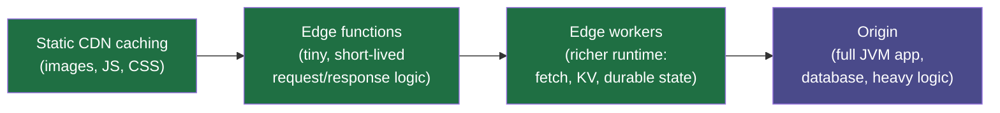
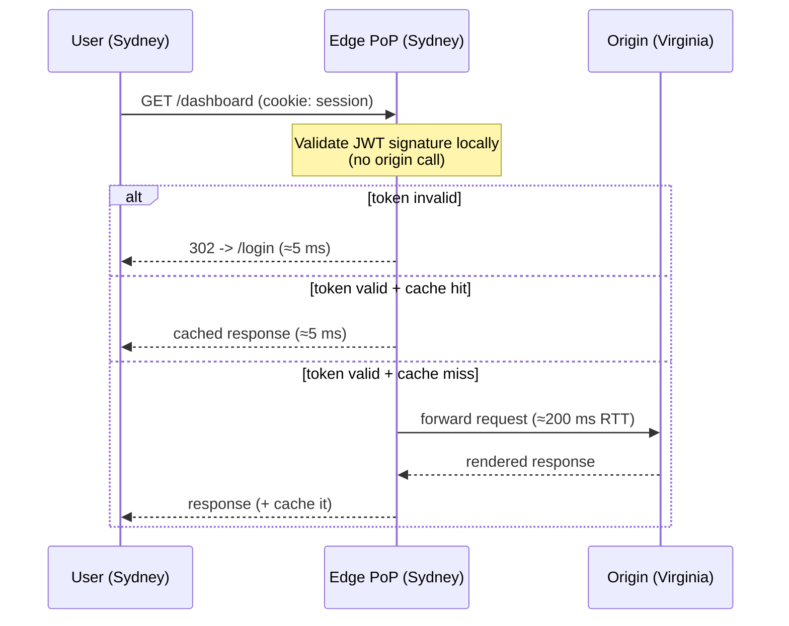
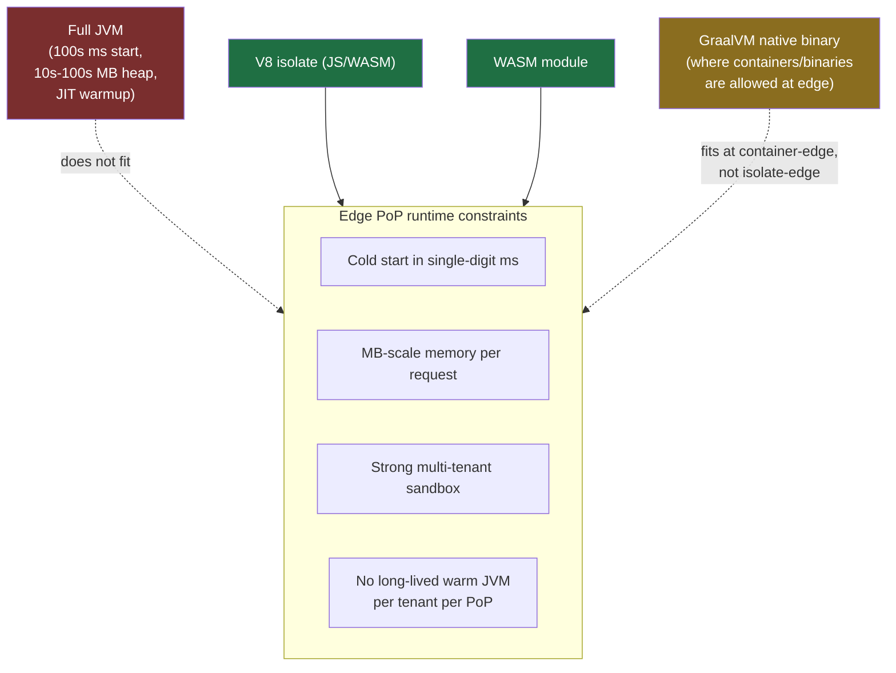

# Edge Computing with Java: Workers, Lambda@Edge & the Network Edge

For most of this book, "where does my code run?" had a simple answer: on a server, in a data center, in some cloud region — `us-east-1`, `europe-west1`, wherever you deployed your Spring Boot jar. Edge computing changes the answer. It pushes a slice of your logic out of the central region and into the **CDN's points of presence (PoPs)** — hundreds of small facilities physically close to your users, in dozens of cities — so the work happens metres from the browser instead of an ocean away from it.

This topic is honest about a fact that surprises a lot of Java engineers: **you usually do not run a JVM at the edge.** Edge runtimes are deliberately tiny, fast-starting, and sandboxed in ways the JVM was never designed for. So the interesting question for us is not "how do I deploy Spring to Cloudflare" (you mostly can't) but "what belongs at the edge, what stays at the origin, and what are my *actual* paths to get Java-flavoured logic out there?" That last part is real but limited and still emerging in 2026, and I'll flag the uncertainty as we go.

> [!NOTE]
> Prerequisites: [Cloud basics for Java devs (L4/C10/T07)](./T07-cloud-basics-for-java-devs-aws-gcp-azure.md), [WebAssembly and Java (L3/C02/T16)](../../L3-advanced-jvm/C02-jvm-internals-and-performance/T16-webassembly-and-java.md), and [AOT & GraalVM native image (L3/C02/T05)](../../L3-advanced-jvm/C02-jvm-internals-and-performance/T05-aot-and-graalvm-native-image.md).

## What "The Edge" Actually Is

Think of a single origin server as **one enormous warehouse on the edge of town**. It has everything, but every customer — no matter where they live — has to drive all the way out there for every item. Edge computing is the chain of **neighbourhood convenience stores**: small, everywhere, stocked with the things people grab constantly. You still keep the warehouse (the origin) for the bulky, rare, or sensitive stuff. But for "a bottle of milk and a JWT check," the corner store down the street is dramatically faster.

The physics is the part you cannot argue with. A round trip from Sydney to `us-east-1` (Virginia) is on the order of ~200 ms of pure network latency before your code does *anything*. A PoP in Sydney answers in single-digit milliseconds. No amount of clever Java tuning beats the speed of light; **the only way to win that latency is to move the compute closer.**

There's a spectrum here, not a single thing called "the edge":



- **Static CDN caching** — the original "edge." The PoP serves cached bytes; no code of yours runs. You've used this for years (CloudFront, Cloudflare, Fastly, Akamai).
- **Edge functions** — small bits of code that run *on the request/response path* at the PoP. Rewrite a header, check a cookie, redirect by country.
- **Edge workers** — a richer programming model: make outbound `fetch` calls, read a key-value store, hold small amounts of state, stream responses.
- **Origin** — your real backend, where the JVM lives.

> [!TIP]
> The mental model that keeps teams out of trouble: **the edge is for decisions, the origin is for work.** "Should this request even reach the backend, and in what shape?" is an edge question. "Run this 2-second report query" is an origin question.

### Why It Matters

Two payoffs, and they reinforce each other:

1. **Latency.** Auth checks, redirects, A/B assignment, and personalization that used to cost a full origin round trip now cost a PoP round trip. For a globally distributed audience this is the difference between a snappy app and a sluggish one.
2. **Origin offload.** Every request the edge can answer or reject is a request your expensive JVM fleet never sees. Block the bots, serve the cache hits, and short-circuit the unauthenticated traffic at the edge — your origin scales further on the same hardware, and your cloud bill drops.



Notice that two of the three branches never touch Virginia. That's the whole game.

## The Platforms And Their Runtimes

This is where Java engineers need to recalibrate. Edge runtimes are not "smaller JVMs." They are fundamentally different execution environments, chosen specifically because they start in **single-digit milliseconds**, use **tiny memory footprints**, and are **strongly sandboxed** so one tenant's code can't see another's. Those three constraints are exactly the ones a general-purpose JVM struggles with at PoP scale.

| Platform | Runtime / engine | Languages | Model |
|---|---|---|---|
| **Cloudflare Workers** | V8 **isolates** | JS/TS, WASM (Rust, etc.) | Many isolates per process; ~0 ms cold start |
| **CloudFront Functions** (AWS) | Tiny JS-only sandbox | JS (restricted) | Viewer request/response only; sub-ms; very limited |
| **Lambda@Edge** (AWS) | Lambda runtimes | Node, Python (no edge-native Java tier today) | Heavier; runs in regional edge caches, not every PoP |
| **Fastly Compute** | **WASM** (Wasmtime) | Rust, JS, Go, and anything→WASM | Instantiate-per-request; very fast cold start |
| **Vercel / Deno / others** | V8 isolates / WASM | JS/TS, WASM | "Edge runtime" subset of Web APIs |

A few things worth burning into memory:

- **V8 isolates (Cloudflare).** Instead of one process per tenant (containers, lambdas), Cloudflare runs *thousands of lightweight isolates inside a single process*, swapping between them. That's how cold start effectively disappears — but it also means the runtime is V8's JavaScript engine, optionally running **WebAssembly**. There is **no JVM** in that picture.
- **CloudFront Functions vs Lambda@Edge.** Easy to confuse. CloudFront Functions are a tiny, JS-only, sub-millisecond sandbox for header/URL manipulation. Lambda@Edge is the heavier sibling — real Lambda, more capabilities, higher latency, and it runs at *regional* edge caches rather than at literally every PoP. Neither offers a first-class "edge Java" tier in the way Node gets one.
- **Fastly Compute is WASM-first.** Its whole bet is WebAssembly via Wasmtime: compile your language to WASM, ship the module, Fastly instantiates it per request. This is the platform where "compile Java to WASM" is most directly relevant.



The picture above is the crux of the whole topic. The JVM's strengths — a long-running process, a JIT that gets faster the longer it runs, a big managed heap — are precisely the *wrong* shape for a runtime that wants to spin up, do one tiny thing, and vanish, thousands of times a second, sharing a process with strangers.

> [!WARNING]
> Do not architect around "I'll just run my Spring Boot service on Cloudflare Workers." As of 2026 that is not a supported path on isolate-based edge platforms. Believing otherwise late in a project is an expensive surprise. Verify the *current* runtime docs of whichever platform you target — this space moves fast and details change.

## The Java Story, Told Honestly

So can Java play at the edge at all? Yes — but indirectly, with caveats, and the honest summary is: **Java-at-the-edge is limited and emerging, not a mainstream production pattern.** Here are the real paths.

### Path A — Compile Java To WebAssembly

For WASM-based edge platforms (Fastly Compute, and the WASM slot in Cloudflare Workers), the theoretical route is **Java → WASM**. This ties directly to [WebAssembly and Java (L3/C02/T16)](../../L3-advanced-jvm/C02-jvm-internals-and-performance/T16-webassembly-and-java.md). Projects like TeaVM and the GraalVM/CheerpJ family have shown Java (or a subset) compiling to WASM.

The candid caveats:

- **Toolchain maturity.** Java→WASM is far less polished than Rust→WASM. Reflection, dynamic class loading, threads, and the full standard library do not all survive the trip cleanly. Expect to target a *subset* of the language and to fight tooling.
- **GC and module size.** The WASM GC proposal has matured, but bundle size and startup characteristics of a Java-derived WASM module are typically worse than a hand-written Rust one. At the edge, every kilobyte and millisecond is scrutinised.
- **Verdict.** Viable for small, self-contained logic if your team is *already* invested in Java for that logic and willing to absorb the rough edges. Not the path of least resistance — that's still JS or Rust.

```java
// Conceptual: the KIND of logic that is small enough to be an edge-WASM candidate.
// Pure, allocation-light, no JDBC, no Spring context, no reflection-heavy frameworks.
public final class EdgeAuth {
    // A stateless signature check is the archetypal "edge-sized" Java method:
    // small input, deterministic output, no I/O beyond an already-fetched key.
    public static boolean isTokenStructurallyValid(String jwt) {
        if (jwt == null) return false;
        int firstDot = jwt.indexOf('.');
        int lastDot = jwt.lastIndexOf('.');
        // header.payload.signature => exactly two dots, none empty
        return firstDot > 0 && lastDot > firstDot + 1 && lastDot < jwt.length() - 1;
    }
}
```

> [!NOTE]
> The point of the snippet is the *shape*, not the cleverness: pure, tiny, no framework, no I/O. If your Java logic looks like this, WASM is at least conceivable. If it needs a Spring `ApplicationContext` or a JDBC connection pool, it is an origin job — full stop.

### Path B — GraalVM Native Binaries At Container-Capable Edge

Some "edge" tiers are not isolate-based at all — they let you run **containers or small binaries** at edge locations (AWS Lambda@Edge in its heavier form, edge-capable container platforms, regional edge zones, telco/MEC environments). On those, a **GraalVM native image** of your Java app is a genuinely good fit — see [AOT & GraalVM native image (L3/C02/T05)](../../L3-advanced-jvm/C02-jvm-internals-and-performance/T05-aot-and-graalvm-native-image.md).

A GraalVM native binary starts in **tens of milliseconds**, uses a fraction of the memory of a JVM, and ships as a single ahead-of-time-compiled executable — exactly the properties an edge-ish container platform rewards.

```dockerfile
# A GraalVM native-image container is the realistic "Java near the edge" artifact
# for container-capable edge/regional tiers (NOT for V8-isolate platforms).
FROM ghcr.io/graalvm/native-image-community:21 AS build
WORKDIR /app
COPY . .
RUN native-image -O2 --no-fallback -jar target/edge-fn.jar -o /edge-fn

# Tiny final image: just the static-ish binary.
FROM gcr.io/distroless/base
COPY --from=build /edge-fn /edge-fn
ENTRYPOINT ["/edge-fn"]
```

> [!IMPORTANT]
> "Edge" is overloaded. **Isolate-edge** (Cloudflare Workers, CloudFront Functions) will *not* run this binary. **Container-edge / regional-edge** tiers can. Knowing which kind of edge your platform is determines whether GraalVM is even on the table.

### Path C (The Realistic One) — Keep Java At The Origin, Use Edge Functions For The Thin Layer

This is what the overwhelming majority of Java backends actually do, and it's not a consolation prize — it's the sound architecture:

- Your Spring Boot / Quarkus / Micronaut services stay at the **origin**, where the JVM is happiest.
- A **thin edge function in JS or WASM** sits in front: it validates tokens, normalizes requests, assigns A/B buckets, sets personalization headers, and decides what reaches origin.
- The edge and origin share *contracts*, not code: a signed JWT format, a header schema, a cache-key convention.

```javascript
// Cloudflare-Worker-style edge function (JS) fronting a Java origin.
// This is Path C: tiny JS at the edge, real logic in the JVM behind it.
export default {
  async fetch(request, env) {
    const url = new URL(request.url);

    // 1. Cheap bot / method gate before anything reaches the JVM origin.
    if (request.method !== "GET" && request.method !== "POST") {
      return new Response("Method Not Allowed", { status: 405 });
    }

    // 2. Validate the JWT signature at the edge (verify() = WebCrypto, no origin call).
    const token = (request.headers.get("Authorization") || "").replace("Bearer ", "");
    if (!token || !(await verify(token, env.JWT_PUBLIC_KEY))) {
      return Response.redirect(url.origin + "/login", 302);
    }

    // 3. Assign an A/B bucket deterministically and pass it to origin as a header.
    const bucket = hashToBucket(token) % 2 === 0 ? "control" : "variant";
    const fwd = new Request(request);
    fwd.headers.set("X-AB-Bucket", bucket);

    // 4. Forward the survivors to the Java origin; the JVM does the heavy lifting.
    return fetch(fwd);
  },
};
```

> [!INTERVIEW]
> **"We have a Spring Boot API and global users complaining about latency. The team wants to 'move the backend to the edge.' What's your read?"**
>
> A strong answer pushes back on the framing and then re-scopes the problem:
> 1. **Correct the premise.** You almost certainly cannot run a full JVM / Spring context on isolate-based edge platforms (Cloudflare Workers, CloudFront Functions) — those are V8/WASM sandboxes with no JVM. So "move the backend to the edge" is the wrong goal.
> 2. **Split the workload.** Identify the *thin, latency-sensitive, stateless* decisions — auth/JWT checks, redirects, A/B assignment, request normalization, cache lookups, bot filtering — and push *those* to an edge function in JS or WASM. Keep stateful, data-heavy, framework-dependent logic at the origin.
> 3. **Name the real Java options if pressed.** Java→WASM (emerging, rough) for WASM edge platforms; GraalVM native binaries for *container*-capable edge/regional tiers; otherwise Java stays at origin behind a thin edge layer.
> 4. **Quantify.** The latency win comes from the requests the edge answers or rejects without an origin round trip — so measure cache-hit ratio and the fraction of requests short-circuited at the edge, not just raw RTT.
>
> The trap is the candidate who confidently says "yeah we'll containerize Spring and deploy it to Cloudflare Workers." That reveals they don't know the runtime model.

## Real Use-Cases (And What Stays At Origin)

The edge earns its keep on **stateless, latency-sensitive decisions on the request path**. Strong fits:

- **Auth / JWT validation.** Verify a token's *signature* against a public key at the edge — pure crypto, no database. Reject the unauthenticated before they ever cost you an origin call. (Validating *signature* is edge-friendly; checking a *revocation list* needs shared state and often belongs at origin or an edge KV store.)
- **A/B routing & feature gating.** Hash the user to a bucket and route or tag the request. The decision is deterministic and instant.
- **Request normalization.** Canonicalize URLs, strip tracking params, rewrite legacy paths, set/clean headers — so the origin sees one clean shape.
- **Personalization (light).** Set a "country = AU, currency = AUD, theme = dark" header from a cookie or geo signal, letting the origin (or a cached variant) render appropriately.
- **Bot mitigation & rate gating.** Cheaply fingerprint and drop abusive traffic at the PoP, far from your JVM fleet.
- **Edge caching of API responses.** Cache idempotent GET responses at the PoP with a sensible cache key and TTL, so repeat reads never hit origin.

What deliberately **stays at the origin** (the JVM's home turf):

- **Anything touching the primary database / transactions.** Edge KV stores are eventually consistent and small; your `orders` table is not at the edge.
- **Heavy or long-running compute.** Reports, batch jobs, ML inference beyond trivial models — edge runtimes have tight CPU/time budgets per request.
- **Rich framework logic.** Spring Security filter chains, JPA/Hibernate, complex domain services — these *are* your JVM application.
- **Secrets-heavy or compliance-sensitive logic** where you need the controlled, audited origin environment.

> [!TIP]
> A clean dividing question for any piece of logic: **"Does it need shared, strongly-consistent state or a heavy framework?"** If yes → origin. If it's a fast, stateless decision on the request path → edge candidate.

### In Practice: A Global Read-Heavy API

A team serving a product catalog to users on five continents put a Cloudflare Worker in front of their Spring Boot origin. The worker (Path C): validated the session JWT, set a `X-Region` header from PoP geo, and cached `GET /catalog/*` responses at the edge with a 60-second TTL keyed on region + currency. Result: the bulk of catalog reads were answered at the PoP in single-digit milliseconds, the origin fleet saw a large drop in read traffic, and the *only* Java change was emitting an explicit `Cache-Control` header the worker could honour. **No Java ran at the edge. The architecture still got most of the edge's benefit.** That asymmetry — big latency win, near-zero Java-side change — is the typical, healthy outcome.

## State At The Edge: KV, Durable Objects, And The Consistency Tax

The single biggest trap after "can I run a JVM there?" is **state**. Your origin enjoys a strongly-consistent relational database one network hop away. The edge does not. Data at a PoP in Sydney and a PoP in São Paulo are *different physical copies in different cities*, and reconciling them takes time and crosses the very oceans you were trying to avoid. You cannot have low global latency *and* strong global consistency for free — that tension (the heart of the CAP/PACELC trade-offs) doesn't disappear at the edge; it gets sharper.

Most edge platforms give you a few state primitives, each with a deliberate consistency posture:

- **Edge KV stores** (e.g. Workers KV) — a small, **eventually-consistent**, read-optimized key-value store replicated to PoPs. Writes propagate over seconds to a minute. Perfect for config, feature flags, public keys, and rarely-changing lookup data. **Wrong** for anything where a stale read causes a correctness bug (balances, inventory counts, "is this token revoked *right now*").
- **Single-owner coordination objects** (e.g. Cloudflare Durable Objects) — a way to get a *single, consistent* coordinator for a key (a chat room, a rate-limit counter, a game lobby) that lives at one location and serializes access. This buys you consistency at the cost of routing those requests to wherever that object lives — so it's consistent but not necessarily *local*.
- **Edge caches** — covered above: idempotent responses keyed and TTL'd at the PoP.

> [!WARNING]
> Treat edge KV as a **read-mostly, stale-tolerant cache**, never as a system of record. A classic outage pattern: a team stores session-revocation state in edge KV, a write doesn't propagate in time, and a logged-out user keeps a valid session for a minute across half the planet. If a stale read is a security or money bug, that data belongs at the origin (or behind a consistent coordination primitive), not in eventually-consistent edge KV.

For a Java backend (Path C), the clean pattern is: **the origin owns the truth; the edge holds a derived, stale-tolerant projection.** Your JVM publishes the JWT public keys, feature-flag snapshot, and geo/redirect rules into edge KV; the edge reads them locally and fast. Nothing the edge stores is authoritative.

```java
// Origin side (Java): publish a stale-tolerant projection the edge can read locally.
// The JVM owns the source of truth; the edge gets a derived snapshot + a version stamp.
public record EdgeConfigSnapshot(
        String jwtPublicKeyPem,      // for edge-side signature verification
        Map<String, Boolean> flags,  // feature-flag projection
        long version,                // monotonic; lets the edge detect staleness
        Instant publishedAt) {

    // Pushed to the edge KV out-of-band (e.g. on flag change), NOT on the request path.
    // The edge reads this with single-digit-ms latency and tolerates being a few
    // seconds behind. Correctness must NOT depend on it being perfectly fresh.
}
```

## Observability And Operating At The Edge

This is L4/C10, so operating the thing matters as much as building it. The edge inverts several habits you've built around a JVM origin, and pretending otherwise leads to blind spots.

- **No JVM tooling.** There is no JFR, no async-profiler, no heap dump, no thread dump, no JMX at the edge. The introspection toolbox you rely on for the origin simply isn't there. You get the platform's logs, traces, and metrics, and not much more.
- **Logs are sampled and ephemeral.** At hundreds of PoPs doing millions of requests, platforms typically **sample** edge logs and ship them centrally with a delay. Don't assume every edge invocation is logged. Push structured events (with a trace ID) to your central pipeline rather than relying on tailing PoP logs.
- **Tracing must cross the boundary.** The edge function is the *first* hop. Have it generate or propagate a `traceparent` header (W3C Trace Context) so the trace stitches edge → origin into one timeline. This connects directly to [distributed tracing (L4/C10/T13)](./T13-distributed-tracing-opentelemetry-jaeger-zipkin.md): the edge becomes the new root span.
- **"It works in one region" is a lie waiting to happen.** Geo-routing, locale logic, and KV propagation behave differently across PoPs. A bug may only manifest in São Paulo because that PoP got a stale KV write or a different geo signal. Test with traffic shaped like your *real, global* audience.
- **Limits are hard, not soft.** Edge runtimes enforce strict CPU-time, memory, and subrequest budgets per invocation. Exceed them and the request is killed — there's no "the GC will catch up" grace. Profile against the platform's documented limits, and verify those limits in the *current* docs because they change.

> [!TIP]
> Make the edge layer **observable by contract**: every edge function emits a structured event with `{trace_id, pop, decision, origin_hit: bool, latency_ms}`. Then "is the edge actually helping?" becomes a query — `origin_hit:false / total` is your offload ratio — instead of a guess.

### In Practice: Debugging A "Phantom" Stale Response

A team saw intermittent stale prices for a sliver of users. The origin (Java) was correct every time it was asked — but the edge was serving a cached `GET /price/*` past its intended freshness for users routed to a specific PoP after a deploy changed the cache key. There was no JVM artifact to inspect; the fix came from the edge platform's request logs plus the `traceparent`-stitched trace showing requests that *never reached origin*. The lesson the team wrote down: **when the edge answers, your origin observability sees nothing — so the edge must carry its own telemetry, or those requests are invisible.**

## Deploying And Rolling Out Edge Code

Edge code has a deployment model unlike your origin's, and the differences bite if you carry origin assumptions over wholesale.

- **The split-deploy problem.** Your edge function and your origin are now **two deployables on two pipelines**, and they share contracts (JWT format, header schema, cache-key shape). A breaking change to either can desync them. The rule of thumb mirrors API versioning: **deploy the tolerant side first.** If the origin will start emitting a new header, teach the edge to ignore-when-absent *before* the origin starts sending it; if the edge will start requiring something, have the origin produce it first. Never flip both in lockstep and hope.
- **Global rollout is genuinely global.** When you publish an edge function, it propagates to *every* PoP — there's no `us-east-1`-only blast radius to contain a bad deploy. Lean hard on the deployment strategies from earlier in this chapter ([blue-green / canary / rolling, L4/C10/T06](./T06-deployment-strategies-blue-green-canary-rolling.md)): route a small percentage of traffic to a new edge version, watch the offload ratio and error rate, then ramp. A bad edge deploy can take down your *entire* front door at once.
- **Fast propagation, fast rollback.** The flip side of global propagation is that rollbacks are also near-instant — there's no fleet of long-lived JVMs to drain and restart. Keep the previous version pinned and a one-command rollback ready; with edge, "revert" is often your fastest mitigation.
- **Config vs code.** Prefer pushing *behavior changes* (flip a flag, change a redirect rule) through the **edge KV projection** rather than redeploying the function. A KV update is data, reversible in seconds, and doesn't require a code rollout — which keeps risky changes out of the deploy path entirely.

```yaml
# Sketch: an edge deploy stage in a CI pipeline (see L4/C10/T05 CI-CD tools).
# The point is the GUARDED, GLOBAL rollout — not the specific tool.
deploy-edge:
  steps:
    - run: edge-cli build --check-contract ./contracts/edge-origin.json  # fail if edge/origin contracts drift
    - run: edge-cli deploy --version "$GIT_SHA" --canary 5%               # 5% of PoP traffic first
    - run: edge-cli watch --metric origin_hit_ratio --metric error_rate --for 10m
    - run: edge-cli promote --version "$GIT_SHA"                          # ramp to 100% only if healthy
  # Rollback is `edge-cli rollback` — near-instant, because there is no JVM fleet to drain.
```

> [!IMPORTANT]
> The edge is your application's **front door for the whole planet at once**. That makes a careless edge deploy higher-blast-radius than a careless origin deploy, even though the code is tiny. Treat edge rollouts with *more* discipline than origin rollouts, not less — canary, watch, and keep rollback one command away.

## Edge vs Serverless vs Origin: A Decision Table

| Dimension | **Edge function/worker** | **Serverless (e.g. Lambda, Cloud Run)** | **Origin (JVM service)** |
|---|---|---|---|
| Location | Hundreds of PoPs near users | A few cloud regions | Your region(s) |
| Cold start | ~0 ms (isolates) to low ms (WASM) | 100s ms (esp. JVM); less with native | N/A (long-running) |
| Runtime | JS / WASM sandbox | Full runtimes incl. JVM | Full JVM |
| Java support | Indirect: WASM (emerging) / native at container-edge | First-class (JVM or GraalVM native) | First-class |
| State | Tiny, eventually-consistent KV | External (DB, cache) | Full DB / transactions |
| CPU / time budget | Very tight (ms) | Moderate (seconds–minutes) | Effectively unbounded |
| Best for | Thin, stateless, latency-critical request-path decisions | Bursty, event-driven, region-local compute | Stateful, heavy, framework-rich business logic |
| Memory footprint | MB-scale | 128 MB–GBs | GBs |

Read it as a gradient, not three islands: as you move left, you trade *capability* for *proximity and startup speed*; as you move right, you trade *proximity* for *power and rich runtime support*. The art is putting each piece of logic in the right column.

## Practice

1. **Classify the workload.** For each of these, decide edge / serverless / origin and justify in one sentence: (a) verifying a JWT signature, (b) running a nightly billing reconciliation, (c) redirecting EU users to a `/eu` path, (d) executing a multi-table SQL transaction, (e) assigning an A/B bucket, (f) generating a 40-page PDF report.
2. **Explain the runtime mismatch.** In your own words, give three concrete reasons a full JVM is a poor fit for a V8-isolate edge platform. Tie each reason to a property of the JVM (startup, JIT warmup, heap/footprint, threading model).
3. **Pick a Java path.** A teammate insists on "Java logic at the edge." Lay out Paths A (Java→WASM), B (GraalVM native at container-edge), and C (Java at origin + thin edge layer), and recommend one for a stateless geo-redirect feature — with reasoning.
4. **Write the edge layer.** Sketch (pseudocode is fine) an edge function that: rejects non-GET/POST, validates a JWT signature, sets an `X-AB-Bucket` header, and forwards everything else to origin. Mark which steps avoid an origin round trip.
5. **Measure the win.** Your edge layer is live. Which two metrics best prove it's helping, and why are they better evidence than raw network RTT alone?
6. **State, safely.** You want feature flags readable at the edge with single-digit-ms latency. Explain why edge KV is the right home for the flag *snapshot* but the wrong home for a *session-revocation list*, and describe how the origin should publish the snapshot so the edge never becomes the system of record.
7. **Don't break the contract.** Your origin is about to start sending a new `X-Tenant` header that the edge must forward. In what order do you deploy the edge and origin changes, and why? What would go wrong if you flipped both at once?
8. **Roll it out.** Your edge function propagates to every PoP globally on deploy. Outline a canary rollout (referencing the strategies from L4/C10/T06) and name the one metric you'd watch most closely to decide whether to promote or roll back.

## Recap

- **The edge** is compute running on CDN PoPs close to users, on a spectrum from static caching → edge functions → edge workers, with the origin still behind it. The payoff is **lower latency** (beat the speed of light by moving closer) and **origin offload** (every request answered/rejected at the PoP never hits your JVM).
- **Edge runtimes are not small JVMs.** Cloudflare Workers use V8 **isolates** (JS/WASM); CloudFront Functions are a tiny JS sandbox; Lambda@Edge is heavier and regional; Fastly Compute is **WASM**-first. All favour tiny, fast-starting, sandboxed code — **a full JVM generally does not run there.**
- **The Java story is honest and limited.** Path A: compile **Java→WASM** (emerging, rough toolchain) for WASM edge platforms. Path B: **GraalVM native binaries** where the edge tier allows containers/binaries. Path C (the realistic default): **keep Java at the origin** and use a thin JS/WASM edge function for routing/auth/personalization.
- **Edge is for fast, stateless decisions on the request path** — auth/JWT signature checks, A/B routing, request normalization, light personalization, bot mitigation, API-response caching. **Stateful, heavy, framework-rich logic stays at the origin.**
- Treat **edge / serverless / origin as a gradient**: proximity-and-startup on the left, capability-and-rich-runtime on the right. Put each piece of logic in the right column — and verify your platform's *current* runtime docs, because this area is moving fast in 2026.

## Next

[Multi-Runtime Microservices with Dapr](./T19-multi-runtime-dapr.md) — having pushed a thin layer out to the edge, we look at the opposite frontier: a sidecar-based runtime that abstracts state, pub/sub, and service invocation away from your application code, so polyglot and Java services share one operational model.
