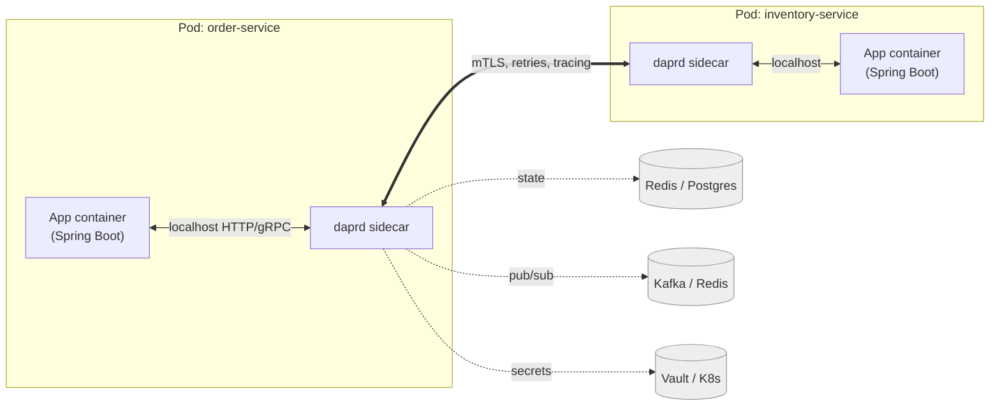
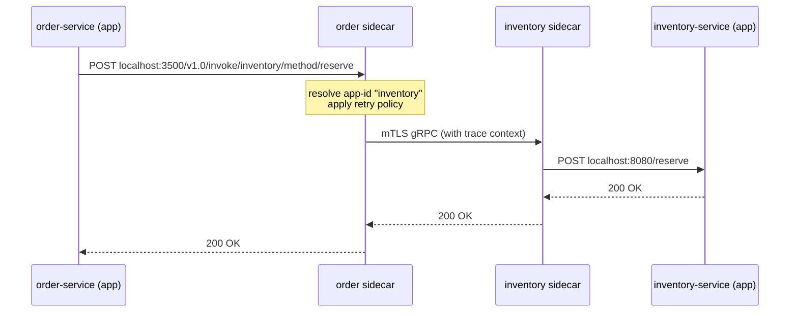
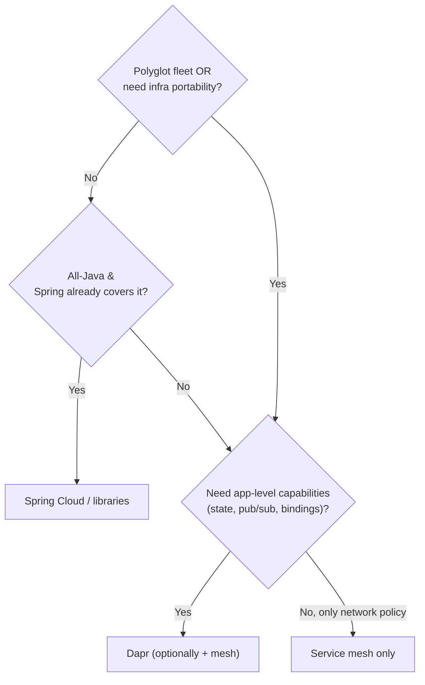

# Multi-Runtime Microservices with Dapr

Build five microservices and you will write the same distributed-systems plumbing five times: retry-with-backoff around a flaky HTTP call, publish/subscribe wiring to a broker, a state store with optimistic concurrency, secret fetching, mTLS, service discovery. Worse, that plumbing is usually *coupled to specific infrastructure* — your code imports the Kafka client, the Redis client, the Vault SDK. Migrate from Redis to a managed cloud store, or from RabbitMQ to Kafka, and you are editing application code and redeploying business logic to change infrastructure.

This topic introduces **Dapr** (Distributed Application Runtime) and the **multi-runtime microservices** idea it embodies: pull the distributed-systems plumbing *out* of the application and into a runtime that runs *beside* it. It is the operational sibling of the SRE and observability material in this chapter — where those topics covered how to *operate* services, this covers how to *stop re-implementing the same service-to-service mechanics in every service*.

> [!NOTE]
> Prerequisites: [Kubernetes basics (L4/C10/T03)](./T03-kubernetes-basics.md) and [Configuration and secrets management (L4/C10/T09)](./T09-configuration-and-secrets-management.md). Familiarity with [messaging concepts (L4/C07/T01)](../C07-messaging-and-streaming/T01-messaging-concepts-queues-topics-pub-sub.md) helps for the pub/sub section.

## The Problem: Plumbing Re-Implemented Per Service

A microservice has two kinds of code:

1. **Business logic** — the reason the service exists (pricing, checkout, inventory).
2. **Distributed-systems plumbing** — retries, circuit breaking, pub/sub, state persistence, secrets, service discovery, observability hooks.

The plumbing is *non-differentiating*: every team writes a slightly different, slightly buggy version of the same thing. And because it is written *inside the application* using infrastructure-specific SDKs, your business logic ends up structurally welded to a particular broker, a particular database, a particular secret manager.

> [!TIP]
> A useful gut-check: open any service and estimate what fraction of the imports are infrastructure clients (Kafka, Redis, S3, Vault) versus domain code. In a typical microservice that fraction is uncomfortably high — and *all of it* is plumbing you did not want to own.

The classic responses each have a cost:

- **Fat frameworks** (e.g. Spring Cloud) move the plumbing into libraries. Better than hand-rolling, but it is *in-process*, *language-specific* (a JVM-only solution), and version-coupled to your app.
- **Service meshes** (e.g. Istio) move *network* concerns (mTLS, traffic shifting, L7 retries) into a sidecar proxy. Powerful, but a mesh deliberately stops at the network layer — it does *not* give you a state store, a pub/sub API, or a secrets API your code can call.

## Bilgin Ibryam's "Multi-Runtime" / Mecha Idea

In a widely-cited 2020 article, Bilgin Ibryam argued that microservice needs fall into four groups — **lifecycle** (packaging, deployment, scaling), **networking** (discovery, resilience, pub/sub), **state** (workflow, caching, persistence), and **binding** (connectors to external systems). His observation: only *lifecycle* has been fully externalized (by Kubernetes). The other three are still mostly trapped inside application code or language-specific libraries.

His proposal — **multi-runtime microservices**, sometimes called the **mecha** architecture — is to split each service into two collaborating runtimes:

- the **micrologic** (your business code, the "pilot"), and
- a **mecha** sidecar (a configurable, off-the-shelf runtime — the "robot suit") that provides networking, state, and binding capabilities through a standard local API.

The analogy he uses is a *mecha robot*: a capable but generic machine driven by a small pilot. You bring the brains (business logic); the mecha brings the muscle (distributed plumbing). Dapr is the most prominent concrete implementation of this idea.

> [!IMPORTANT]
> "Multi-runtime" does **not** mean "multiple language runtimes". It means *two cooperating runtimes per service*: your app process and a capability-providing sidecar process, communicating over local IPC.

## What Dapr Is

**Dapr** is a portable, event-driven runtime that exposes distributed-systems capabilities as **building blocks** over a stable local **HTTP and gRPC API**. It is a CNCF project (it reached CNCF *graduated* status in late 2024). Your application makes ordinary HTTP/gRPC calls to a Dapr sidecar — by default at `http://localhost:3500` (HTTP) or `localhost:50001` (gRPC) — and Dapr does the infrastructure work.

The key building blocks (the exact set evolves; check the current docs):

| Building block | What it gives you | Plumbing it removes |
| --- | --- | --- |
| **Service invocation** | Call another service by app-id, with built-in mTLS, retries, tracing | Service discovery, TLS, resilience |
| **State management** | Key/value get/set with optional concurrency and consistency | DB client, optimistic-locking code |
| **Publish & subscribe** | Publish events; subscribe by topic | Broker client, ack/redelivery wiring |
| **Bindings** | Input/output connectors to external systems (queues, blob, cron, SMTP) | Per-system integration SDKs |
| **Secrets** | Read secrets from a configured store | Vault/cloud-secrets SDK |
| **Configuration** | Read/subscribe to app configuration | Config-store client |
| **Actors** | Virtual-actor model with turn-based concurrency | Actor framework |
| **Workflow** | Durable, code-defined orchestration of steps | Saga/orchestration engine |

The capability is the *API*; the concrete infrastructure behind it is a swappable **component**. The same `POST /v1.0/publish/...` call can be backed by Redis Streams in dev and Kafka in production — **without changing application code**. You only change a YAML file.

> [!TIP]
> Think of building blocks as **standard wall sockets**. Your appliance (the app) plugs into a socket with a fixed shape (the Dapr API). Behind the wall, the wiring (Redis, Kafka, AWS SNS) can be rerouted by an electrician (the platform team editing a component YAML) without you ever changing your appliance's plug.

### The Sidecar Analogy

The Dapr sidecar is **a personal assistant who handles all your logistics so you can focus on your actual job.** You (the app) say "deliver this message to the *orders* topic" or "save this cart under key `cart-42`". You do not care whether the assistant uses FedEx or DHL, or whether the filing cabinet is Redis or Postgres. You state *intent*; the assistant owns *mechanism*. When the company switches couriers, your workflow does not change.

## The Mechanism: Sidecar Pattern and Components

In Kubernetes, Dapr injects a sidecar container (`daprd`) into each annotated pod, so every app instance has its own co-located runtime sharing the pod's network namespace (hence `localhost`). Self-hosted mode runs `daprd` as a sibling process.



Two control-plane facts worth knowing: the **placement** service coordinates actor/workflow partitioning, and the **sentry** service is a CA that issues the workload certificates enabling sidecar-to-sidecar mTLS. The application never sees any of this.

A **component** is a Kubernetes-style YAML resource that binds a building-block API to a concrete backend. Here is a pub/sub component backed by Redis:

```yaml
apiVersion: dapr.io/v1alpha1
kind: Component
metadata:
  name: orderpubsub          # the name your app references
spec:
  type: pubsub.redis         # the swappable backend
  version: v1
  metadata:
    - name: redisHost
      value: redis:6379
    - name: redisPassword
      secretKeyRef:           # secret pulled via the secrets building block
        name: redis-secret
        key: password
```

Migrating that exact pub/sub topic to Kafka is purely an infrastructure edit — **the application code does not change**:

```yaml
apiVersion: dapr.io/v1alpha1
kind: Component
metadata:
  name: orderpubsub          # SAME name — app code is untouched
spec:
  type: pubsub.kafka         # only the backend type and its metadata change
  version: v1
  metadata:
    - name: brokers
      value: "kafka-0:9092,kafka-1:9092"
    - name: consumerGroup
      value: "order-service"
```

This is the payoff of the multi-runtime model: **the seam between business logic and infrastructure is a stable local API plus declarative config**, not a code dependency.

### Service-Invocation Flow



The caller addresses the *logical app-id* (`inventory`), not a host or IP. Discovery, TLS, retries, and trace propagation happen between the sidecars — invisibly to both apps.

### Resilience as Declarative Policy

One of the strongest demonstrations of the multi-runtime idea is **resilience**. In a fat-framework world you scatter `@Retryable`, circuit-breaker annotations, and timeout config across dozens of call sites. Dapr lets you declare these once, in a **Resiliency** policy that the sidecar applies to outbound traffic — your Java code contains *no resilience logic at all*:

```yaml
apiVersion: dapr.io/v1alpha1
kind: Resiliency
metadata:
  name: orderpolicy
spec:
  policies:
    retries:
      backoffRetry:
        policy: exponential
        maxInterval: 5s
        maxRetries: 4
    circuitBreakers:
      inventoryCB:
        maxRequests: 1
        interval: 30s
        timeout: 60s            # how long the breaker stays open
        trip: consecutiveFailures > 5
  targets:
    apps:
      inventory:                # apply to all calls to app-id "inventory"
        retry: backoffRetry
        circuitBreaker: inventoryCB
```

Because the policy targets an app-id (or a component), *every* service that calls `inventory` through Dapr inherits the same, consistent behaviour — and the policy can be tuned in production without redeploying a single service. This is the resilience analogue of the broker-swap above: behaviour that used to be code becomes config.

> [!WARNING]
> If you *also* run a service mesh that retries, you can get **retry amplification** — the app's sidecar retries, the mesh retries, and a single user request fans out into many backend calls during an incident, making it worse. Pick one layer to own retries (commonly Dapr, since it knows the app-id) and disable it in the other.

## A Concrete Java/Spring Example

You can use Dapr two ways from Java: plain HTTP to the sidecar (zero extra dependencies), or the **Dapr Java SDK** (typed, ergonomic). Both hit the same local runtime.

**Option A — plain HTTP, no SDK.** Service invocation and pub/sub via the sidecar:

```java
// Call another service by app-id through the local sidecar.
// No service-discovery, TLS, or retry code lives here.
var http = HttpClient.newHttpClient();
var invoke = HttpRequest.newBuilder()
    .uri(URI.create("http://localhost:3500/v1.0/invoke/inventory/method/reserve"))
    .header("Content-Type", "application/json")
    .POST(HttpRequest.BodyPublishers.ofString("{\"sku\":\"A-1\",\"qty\":2}"))
    .build();
HttpResponse<String> resp = http.send(invoke, HttpResponse.BodyHandlers.ofString());

// Publish an event to topic "orders" on the "orderpubsub" component.
// We do NOT know or care whether that is Redis or Kafka — see the YAML above.
var publish = HttpRequest.newBuilder()
    .uri(URI.create("http://localhost:3500/v1.0/publish/orderpubsub/orders"))
    .header("Content-Type", "application/json")
    .POST(HttpRequest.BodyPublishers.ofString("{\"orderId\":\"42\",\"total\":19.99}"))
    .build();
http.send(publish, HttpResponse.BodyHandlers.ofString());
```

**Option B — Dapr Java SDK** (Maven coordinates roughly `io.dapr:dapr-sdk`; confirm the current version):

```java
import io.dapr.client.DaprClient;
import io.dapr.client.DaprClientBuilder;

try (DaprClient client = new DaprClientBuilder().build()) {
    // State management — backed by whatever statestore component you configured.
    client.saveState("statestore", "cart-42", new Cart("A-1", 2)).block();
    Cart cart = client.getState("statestore", "cart-42", Cart.class).block().getValue();

    // Pub/sub — same topic/component as the HTTP example.
    client.publishEvent("orderpubsub", "orders",
        new OrderPlaced("42", 19.99)).block();
}
```

**Subscribing** is declarative. With the Spring Boot Dapr integration you expose an HTTP endpoint and annotate it; Dapr's sidecar calls it whenever an event lands on the topic:

```java
@RestController
public class OrderSubscriber {

    // Dapr delivers messages from topic "orders" on component "orderpubsub"
    // to this endpoint. Broker client code, offset/ack handling: gone.
    @Topic(name = "orders", pubsubName = "orderpubsub")
    @PostMapping(path = "/on-order", consumes = MediaType.ALL_VALUE)
    public Mono<Void> handle(@RequestBody CloudEvent<OrderPlaced> event) {
        process(event.getData());
        return Mono.empty();          // 200 = ack; non-2xx triggers redelivery
    }
}
```

You run it locally with the Dapr CLI, which starts the sidecar next to your app:

```bash
# Wire the app to its sidecar and the local component definitions.
dapr run \
  --app-id order-service \
  --app-port 8080 \
  --dapr-http-port 3500 \
  --resources-path ./components \
  -- java -jar target/order-service.jar
```

> [!NOTE]
> **In Practice:** notice what is *absent* from the Java above — no Kafka producer config, no Redis connection pool, no Vault token handling, no `@Retryable` around the cross-service call, no TLS setup. Those moved into component YAML and sidecar configuration owned by the platform team. The service got smaller and the dependency tree got shorter.

## Stateful Building Blocks: Actors and Workflow

Beyond the stateless plumbing, Dapr offers two higher-level building blocks for *stateful* coordination — and both are places where re-implementing the machinery yourself is especially painful.

- **Actors** implement the *virtual actor* model (popularized by Microsoft Orleans). An actor is a small, addressable object (e.g. one per shopping cart or per device) with **turn-based single-threaded execution** — Dapr guarantees one invocation at a time per actor, so you get serialized access to per-entity state *without writing locks*. Actors are activated on demand and their state is persisted through a state-store component. Think *one diligent clerk per customer file*: only that clerk touches that file, and only one request at a time, so the file never corrupts.
- **Workflow** lets you author **durable orchestrations** as ordinary code — a sequence of activities, fan-out/fan-in, timers, and human-approval waits — where Dapr persists progress so a crash mid-flow resumes from the last completed step. This is the managed alternative to hand-building a saga engine for, say, an order → payment → shipment pipeline.

> [!TIP]
> Reach for actors when you have *many small entities each needing serialized state access*; reach for workflow when you have a *long-running, multi-step process that must survive restarts*. If you only need fire-and-forget events, plain pub/sub is simpler — do not over-reach for actors.

### Observability Comes Built In

Because all traffic flows through the sidecar, Dapr emits **distributed traces, metrics, and logs** for service invocation, pub/sub, and bindings *without app instrumentation*. It propagates W3C Trace Context across hops and can export OTLP to your collector. In effect the runtime gives you a baseline of the observability you studied in [distributed tracing (L4/C10/T13)](./T13-distributed-tracing-opentelemetry-jaeger-zipkin.md) and [metrics (L4/C10/T12)](./T12-metrics-micrometer-prometheus-grafana.md) for free — though you still instrument *business-meaningful* spans inside your own code.

### A Real-World Scenario

Imagine a retailer running a 30-service estate: mostly Java/Spring, with a Go pricing service and a Python recommendations service. They are mid-migration from a self-hosted RabbitMQ to a managed cloud event bus, and from on-prem Redis to a managed key/value store. Pre-Dapr, that migration means editing broker and store clients in *every* service, in *three* languages, and coordinating a fleet-wide redeploy.

With Dapr in place, the migration becomes: update the `orderpubsub` and `statestore` **components**, roll them out, and let the running services pick up the new backend through their unchanged local API. The Go and Python services participate identically — they call the same `/v1.0/publish` and `/v1.0/state` endpoints. The retailer trades that flexibility for 30 extra sidecars to operate and a small per-hop latency budget — a trade they accept precisely because *infrastructure churn* is their dominant cost.

## Trade-offs and When to Use It

Dapr is not free; it is a *different* distribution of cost.

**Benefits**

- **Portability** — swap brokers/stores/secret managers by editing YAML, not code; far easier multi-cloud and local-vs-prod parity.
- **Less boilerplate** — resilience, mTLS, discovery, and tracing come from the runtime, consistently across services.
- **Polyglot** — because the contract is HTTP/gRPC, a Java service, a Go service, and a Python service all use the *same* APIs and components. The plumbing is uniform regardless of language.

**Costs**

- **A sidecar per pod** — extra CPU/memory and another container to monitor, secure, and upgrade across the fleet.
- **An extra network hop** — app → sidecar → sidecar → app adds latency (typically sub-millisecond intra-pod, but non-zero, and it compounds in deep call chains).
- **Another moving part** — a runtime to version, a control plane (placement, sentry) to run, and a new failure mode ("is the bug in my code or the sidecar?") to reason about.
- **Abstraction leak risk** — the lowest-common-denominator API may not expose a backend's most advanced features, so deeply broker-specific code may still need a native client.

> [!INTERVIEW]
> A common senior-level prompt: *"How is Dapr different from a service mesh like Istio, and would one replace the other?"* Strong answer: a **service mesh operates at the network/L7 layer** — it transparently handles mTLS, traffic shifting, and connection-level retries between *any* services, with **zero application awareness**. **Dapr operates at the application layer** — the app *explicitly calls* Dapr APIs to get *capabilities* a mesh never provides: a state store, a pub/sub API, bindings, secrets, actors, workflow. They are **complementary, not competing**: you can run Dapr for application capabilities *and* a mesh for network policy, though you must avoid double-handling concerns like mTLS and retries (configure one to own each). Contrast both with **Spring Cloud**, which solves overlapping problems *in-process and JVM-only* — great for an all-Java estate, but it does not help a polyglot fleet and couples the plumbing's lifecycle to your app's.

**When Dapr fits well**

- A **polyglot** microservice estate that needs *consistent* resilience, pub/sub, and state semantics across languages.
- Teams that want **infrastructure portability** (multi-cloud, or "Redis in dev, managed store in prod") without code edits.
- Greenfield event-driven systems where you would otherwise hand-roll the same broker/state plumbing repeatedly.

**When it is overkill**

- A **single service**, or a small all-Java system where Spring already provides what you need — the sidecar tax buys little.
- **Ultra-low-latency** paths where even a sub-millisecond extra hop in a deep chain is unacceptable.
- Teams **without the platform capacity** to operate another runtime and its control plane.



## Practice

1. **Local spin-up.** Install the Dapr CLI, run `dapr init`, and start the [Java SDK example](https://github.com/dapr/java-sdk) with `dapr run`. Confirm the sidecar starts on port 3500 and that `dapr dashboard` shows your app-id.
2. **Swap a backend.** Take the Redis pub/sub component above, point a second instance at a local Kafka (e.g. via Docker), and verify the *same* publishing code reaches both — proving the code/infra seam.
3. **Trace the hop.** Enable tracing in the Dapr config and observe the app→sidecar→sidecar→app span chain for a service-invocation call. Relate it to [distributed tracing (L4/C10/T13)](./T13-distributed-tracing-opentelemetry-jaeger-zipkin.md).
4. **Cost it.** Measure the added p99 latency of a Dapr service-invocation call versus a direct HTTP call, and the sidecar's memory footprint. Decide for a hypothetical 30-service fleet whether the tax is justified.
5. **Argue the boundary.** Write a one-page note for your team: which concerns Dapr owns, which a mesh owns, and which stay in Spring — with the mTLS/retry double-handling pitfall called out.

## Recap

You should now be able to:

- Explain the *plumbing-per-service* problem and why infrastructure coupling in application code is costly.
- Describe Bilgin Ibryam's **multi-runtime / mecha** architecture and how Dapr implements it.
- Name Dapr's core **building blocks** and explain that the API is fixed while the **component** backend is swappable.
- Trace a **service-invocation** call through the sidecars (discovery, mTLS, retries, tracing).
- Call Dapr from Java via plain HTTP and via the SDK, and configure a pub/sub component (Redis → Kafka) without touching code.
- Weigh the **trade-offs** (portability and less boilerplate vs sidecar cost, extra hop, operational surface) and contrast Dapr with a **service mesh** and with **Spring Cloud**.

## Next

This is the final forward-looking topic in **C10 — DevOps, Cloud & Observability**. You now have the full operational substrate: containers, Kubernetes, CI/CD, IaC, observability, SRE, and — with Dapr — a model for externalizing distributed-systems plumbing. The natural continuation is to step up from *operating individual services* to *designing the system of services* itself: continue to [L5 — Architecture & Leadership](../../L5-architecture-leadership/), where the multi-runtime, mesh, and messaging trade-offs introduced here are revisited at the architecture level. For the messaging foundations that pub/sub builds on, revisit [Event-driven architecture (L4/C07/T07)](../C07-messaging-and-streaming/T07-event-driven-architecture.md).
