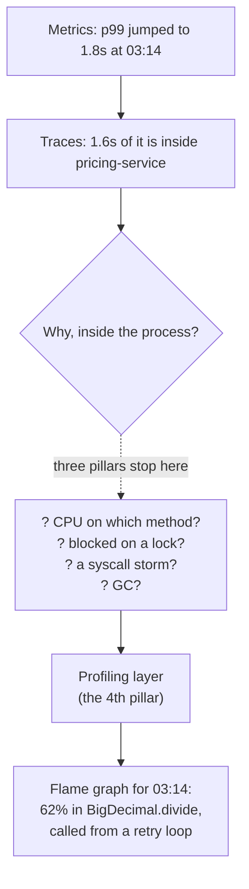
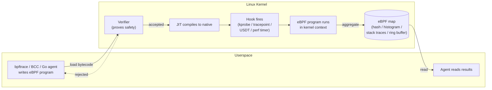
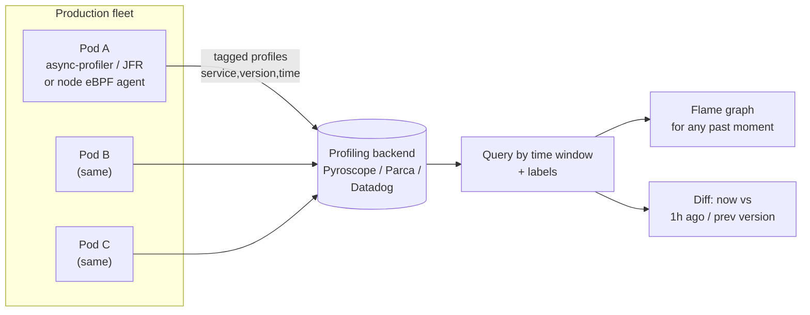

# eBPF & Continuous Production Profiling

You have logs, metrics, and traces. A trace shows you that `GET /checkout` takes 1.8 seconds, and that 1.6 of those seconds are spent inside the `pricing-service`. So you open the pricing-service span... and it's a single span. The trace tells you *where* the time goes at the service boundary, but not *why* inside the process. Is it CPU? Garbage collection? A lock? A blocking DNS lookup? A syscall storm? At this point most teams do the worst thing in operations: they guess, redeploy with extra logging, and wait for the problem to happen again.

This topic is about the layer that answers *why*, in production, continuously, with overhead low enough to leave on forever. Two technologies anchor it: **eBPF** (a safe programmable VM inside the Linux kernel that lets you observe the kernel and userspace without changing either) and **continuous profiling** (always-on sampling profilers that let you pull up a flame graph for any moment in the past — including the 3am incident you slept through). Together they form what many practitioners now call the **fourth pillar of observability**: the profiling/continuous-profiling layer that sits beneath logs, metrics, and traces.

> [!NOTE]
> Prerequisites: [Distributed tracing (L4/C10/T13)](./T13-distributed-tracing-opentelemetry-jaeger-zipkin.md) for the three-pillars framing, and [Profiling: JFR, async-profiler, VisualVM (L3/C02/T11)](../../L3-advanced-jvm/C02-jvm-internals-and-performance/T11-profiling-jfr-async-profiler-visualvm.md) for what a profiler and a flame graph actually are. This topic takes those single-machine, on-demand profiling tools and asks: how do we run them *all the time, in production, across a fleet*?

## The Gap The Three Pillars Leave

The classic observability model has three pillars:

- **Logs** — discrete events. "Order 8841 failed validation." Great for *what happened*.
- **Metrics** — aggregated time-series. "p99 latency is 1.8s, up from 400ms." Great for *that something is wrong, and roughly when*.
- **Traces** — per-request causal chains across services. "The 1.6s is in pricing-service." Great for *where in the topology*.

All three are excellent at narrowing the problem to a service and a time window. None of them, by design, tells you what the CPU was actually executing or what a thread was blocked on. Traces stop at instrumentation boundaries — they see the spans you (or your auto-instrumentation) created, not the function that consumed the cycles. Metrics are pre-aggregated, so the detail is already gone. Logs only know what you thought to log.



The profiling layer fills that last hop. Historically you reached for it *reactively*: SSH into the box, attach a profiler, hope the problem reproduces. The shift in modern practice is to make it *proactive and continuous* — and eBPF is a big part of why that's now cheap enough to do.

> [!INTERVIEW]
> A common lead/staff question: *"You get paged — p99 latency doubled, no code deploy, no obvious metric spike. Walk me through how you find root cause."* A strong answer names the pillars and their limits, then reaches for the profiling layer: "I'd pull the **continuous-profiling flame graph for that exact time window** and diff it against an hour earlier. If CPU looks flat but latency doubled, I'd look at an **off-CPU profile** — threads are probably blocked on a lock, I/O, or a syscall, which CPU profilers don't show." Bonus points for explaining *why* a trace alone can't answer it (instrumentation boundaries) and for mentioning overhead/sampling so you don't sound like you'd take the service down to debug it.

## What eBPF Actually Is

eBPF (extended Berkeley Packet Filter — the name is now mostly historical baggage) is a **safe, sandboxed virtual machine inside the Linux kernel**. You write a small program, it gets compiled to eBPF bytecode, the kernel **verifies** it is safe, and then the kernel attaches it to a **hook** and runs it — in kernel context, at near-native speed — every time that hook fires.

The revolutionary part is *safe* and *no kernel module*. Before eBPF, observing the kernel meant either parsing `/proc` (coarse, sampled, lossy) or writing a kernel module (which can panic the box and which ops teams rightly refuse to load in production). eBPF gives you the power of in-kernel instrumentation with a hard safety guarantee.

The key pieces:

- **Hooks** — the places you can attach a program:
  - **kprobes / kretprobes** — entry/return of (almost) any kernel function. Dynamic, no recompile.
  - **tracepoints** — stable, kernel-maintained instrumentation points (e.g. `sched:sched_switch`, `syscalls:sys_enter_openat`). Preferred over kprobes because they don't break when kernel internals change.
  - **uprobes / USDT** — userspace function entry and **User Statically-Defined Tracepoints** (probes a *program* deliberately exposes). The JVM ships USDT probes — more on that below.
  - **Network hooks** — XDP (eXpress Data Path, at the NIC driver), `tc`, socket filters. This is what powers Cilium.
  - **perf events** — sample on a timer or hardware counter (e.g. "every 10ms of on-CPU time, capture the stack"). This is the basis of CPU profiling.
- **The verifier** — before your program runs, the kernel statically proves it terminates (originally: no unbounded loops; bounded loops are now allowed on modern kernels), accesses only memory it's allowed to, and can't crash or hang the kernel. If it can't prove safety, it rejects the program. This is *the* reason ops will run eBPF in prod and won't run a kernel module.
- **Maps** — typed key/value data structures (hash maps, arrays, ring buffers, stack-trace maps, per-CPU variants) that live in the kernel and are shared between the eBPF program and userspace. The eBPF program writes counts/histograms/stacks into a map; a userspace agent reads them out. This is how data escapes the kernel.



> [!TIP]
> **The analogy that makes eBPF click:** imagine a running car engine. Traditionally, to understand a problem you either stare at the dashboard gauges (metrics — coarse, pre-built) or you stop the engine and take it apart (a profiler that pauses the app, a debugger). eBPF is like being able to attach a *tiny, programmable sensor anywhere inside the engine while it's running at full speed* — on a specific valve, on the fuel line, on the crankshaft — and have a guarantee that the sensor itself physically cannot seize the engine. You decide what to measure, the engine never stops, and the manufacturer (the verifier) certifies your sensor can't break anything.

### The Tooling Ecosystem

You almost never hand-write eBPF bytecode. The ecosystem (as of 2026):

- **bpftrace** — a high-level, awk-like one-liner language for ad-hoc tracing. The `dtrace` of Linux. Perfect for interactive "what is this box doing right now" questions.
- **BCC (BPF Compiler Collection)** — a toolkit (mostly Python front-ends over C eBPF programs) with dozens of ready-made tools: `opensnoop`, `execsnoop`, `biolatency`, `tcpconnect`, `profile`, `offcputime`. Heavier than bpftrace; great as building blocks.
- **libbpf + CO-RE (Compile Once, Run Everywhere)** — the modern way to ship production eBPF: compile a single portable binary that adapts to different kernels at load time via BTF (BPF Type Format) relocations. This is what real profiling agents are built on, not the older "compile on the target box" BCC model.
- **Cilium** — eBPF-based Kubernetes networking, load balancing, and network policy (it largely replaces kube-proxy). The flagship eBPF networking project.
- **Pixie** — eBPF-based auto-instrumentation for Kubernetes (no code changes to get protocol-level traces).
- **Parca / Pyroscope (Grafana) / Datadog / Elastic Universal Profiling** — eBPF-based *whole-system* continuous profilers. These are the ones most relevant to this topic.

> [!IMPORTANT]
> eBPF is a **Linux** technology. It needs a reasonably modern kernel (the interesting features land kernel-version by kernel-version; the broad "you can do real work" baseline is roughly 5.x, with CO-RE/BTF making fleet deployment sane). It is **not available on macOS or Windows natively** — on those platforms it runs in a Linux VM (so your local Docker Desktop "Linux" actually has it; your host doesn't). There is an early **eBPF-for-Windows** project, but for our purposes — backend Java in containers on Linux — assume Linux.

### How A Sample Is Captured And Stored (The Byte-Level View)

It's worth being concrete about what happens, mechanically, when an eBPF CPU profiler takes one sample — because the performance and accuracy properties all fall out of these details.

A perf event is configured to fire on a **per-CPU timer** (say `PERF_COUNT_SW_CPU_CLOCK` every ~10ms of on-CPU time). When it fires, the CPU is interrupted and the kernel runs your attached eBPF program *in interrupt context on that same core*. The program does the minimum: it calls a helper (`bpf_get_stackid` / `bpf_get_stack`) that walks the current stack and writes the frame addresses into a **stack-trace map**, then bumps a counter in a **hash map** keyed by `(pid, kernel_stack_id, user_stack_id)`. That's it — a few hundred nanoseconds, no allocation, no syscall, no copy to userspace on the hot path.

The data structures are deliberately cheap and cache-friendly:

- A captured stack is just an **array of instruction-pointer values** — 8-byte addresses on x86-64/aarch64 (64-bit), packed contiguously, bounded by a fixed max depth (commonly 127 frames). No symbols, no strings: symbolization happens *later*, in userspace, by mapping those addresses back to functions. Keeping the kernel-side payload to raw addresses is what makes it fast.
- **Aggregation happens in the kernel.** Rather than streaming every sample to userspace (expensive, lossy under load), the eBPF program increments an in-kernel count. Identical stacks collapse to `stack_id -> count`. The userspace agent reads the whole map periodically (e.g. once a second) — turning thousands of samples into a few map reads.
- **Per-CPU maps** sidestep locking entirely: each core writes to its own copy, and userspace sums them at read time. This is the standard trick for avoiding cross-core cache-line bouncing on a hot counter — the same false-sharing concern you'd reason about for a Java `LongAdder` versus a contended `AtomicLong`.
- For event streams that can't be aggregated in place (e.g. per-event syscall latencies), the program writes into a **ring buffer** (`BPF_MAP_TYPE_RINGBUF`) — a lock-free, memory-mapped circular buffer shared with userspace, so the agent drains records without a syscall per event.

The reason this matters for *you*: the overhead of continuous profiling is dominated by **sample frequency × symbolization cost**, not by "running code in the kernel." The kernel-side capture is nearly free; the work is later, off the hot path, in userspace. That's the structural reason you can leave it on in production — and the reason that cranking the sample rate way up (or enabling per-event probes on a high-frequency hook) is what actually hurts.

### Endianness, Word Size, And Why Symbolization Is The Hard Part

The addresses captured are raw pointers in the *target process's* address space, and they only mean something relative to where that process (and its shared libraries, and its JIT'd code) were loaded — which is randomized per-process by **ASLR**. Symbolization therefore has to:

1. Read the process's memory map (`/proc/<pid>/maps`) to know which address ranges belong to which ELF objects, and at what load offset.
2. Subtract the load base to get a file-relative address, then look it up in that object's symbol/DWARF tables.
3. For JIT'd Java frames, there is no ELF object — hence the perf-map / `AsyncGetCallTrace` machinery discussed below.

Two architecture details bite here. **Word size:** a 64-bit target has 8-byte addresses; profiling a 32-bit process (rare for modern server Java, but possible for native deps) means 4-byte addresses and a different unwinding path — the agent must know the target's bitness. **Endianness:** x86-64 and the common aarch64 server configs are little-endian, so the agent and target agree; it only surfaces if you ever profile a big-endian target (e.g. some s390x mainframe JVMs), where the agent must byte-swap when interpreting captured words. In practice almost all backend Java runs little-endian 64-bit, but a lead should know *why* a profiler asks about target architecture rather than assuming it's incidental.

## eBPF For The JVM Specifically

Here's where it gets nuanced, and where a lot of writing on the internet is too optimistic. eBPF is fantastic at the boundary *between your JVM and the kernel*, and there are some real rough edges *inside* the JVM. Be honest about both.

### What eBPF Does Brilliantly For Java

**Syscall and I/O latency attribution.** Your JVM ultimately does everything through syscalls — `read`, `write`, `futex` (locks), `openat`, `connect`, `epoll_wait`. eBPF can hook those tracepoints and tell you, with no JVM cooperation at all: "this process spent 600ms in `futex` (lock contention), made 40,000 `openat` calls in 10 seconds (you're re-reading a config file in a hot loop), and 300ms in `connect` blocked on DNS." None of that requires touching your code or even restarting the JVM.

**Off-CPU analysis** — the single most underrated thing here. A normal CPU profiler (including async-profiler in its default `cpu` mode) samples threads that are *running on a CPU*. But a slow request is very often slow because a thread is **not** running — it's blocked on a lock, a database socket, disk I/O, or `Thread.sleep`. CPU profilers are blind to that time by construction. **Off-CPU profiling** does the opposite: it samples when a thread is *descheduled* (via the `sched:sched_switch` tracepoint) and attributes the *blocked* time to the stack that blocked. eBPF is the natural tool for this because the scheduler is in the kernel. BCC's `offcputime` is the canonical example.

```bash
# Where is PID 4242 spending OFF-CPU (blocked) time? Capture for 30s.
# Aggregates by stack; great for finding lock/IO waits a CPU profiler misses.
sudo /usr/share/bcc/tools/offcputime -p 4242 30

# bpftrace one-liner: histogram of how long openat() syscalls take, system-wide
sudo bpftrace -e 'tracepoint:syscalls:sys_enter_openat { @start[tid] = nsecs; }
                  tracepoint:syscalls:sys_exit_openat /@start[tid]/ {
                      @us = hist((nsecs - @start[tid]) / 1000); delete(@start[tid]); }'

# Which processes are opening which files (a "syscall storm" hunt)?
sudo /usr/share/bcc/tools/opensnoop -p 4242
```

To make off-CPU concrete: consider this innocuous-looking cache refresher. Under load, every request thread that calls `get` while `refresh` holds the lock is *descheduled* and parked on a `futex` — pure off-CPU time. A CPU flame graph shows almost nothing (the threads aren't running); the trace shows a slow span with no explanation; only an off-CPU or `lock` profile points the finger.

```java
public final class PriceCache {
    private Map<String, BigDecimal> prices = Map.of();

    // synchronized makes every reader wait while one thread reloads —
    // off-CPU (futex) time that a CPU profiler is structurally blind to.
    public synchronized BigDecimal get(String sku) {
        if (prices.isEmpty()) refresh();        // thundering herd on cold cache
        return prices.get(sku);
    }

    private void refresh() {
        prices = loadFromDatabase();             // 200ms blocking I/O under the lock
    }
}
```

`offcputime -p <pid>` would attribute the bulk of blocked time to a stack ending in `PriceCache.get` parked in `futex` — and the fix (a `volatile` snapshot read with refresh off the request path, or a `ConcurrentHashMap` + single-loader guard) becomes obvious once the blocked time is *visible*.

**USDT probes the JVM exposes.** The HotSpot JVM (when built with `--enable-dtrace`, which most mainstream distributions are) exposes **USDT probes** — statically-defined tracepoints for high-level JVM events: GC begin/end, object allocation, monitor contended enter/exit (lock contention!), method compilation, class loading, thread start/stop, and more. eBPF (via bpftrace's `usdt:` provider or BCC) can attach to these and observe JVM-internal events without a Java agent.

```bash
# List the USDT probes a running JVM exposes (requires the JVM built with dtrace probes)
sudo /usr/share/bcc/tools/tplist -p 4242 | grep hotspot

# Count monitor-contended-enter events (lock contention) by class, live, for 10s
sudo bpftrace -e 'usdt:/path/to/libjvm.so:hotspot:monitor__contended__enter
                  { @contended = count(); }' -p 4242
```

> [!CAUTION]
> The JVM USDT probes are **disabled at runtime by default** for the high-frequency ones. The allocation and method probes especially are gated behind `-XX:+ExtendedDTraceProbes`, and turning that on can carry **serious overhead** because it forces the JIT to deoptimize hot paths so every event fires. The GC, monitor, and lifecycle probes are far cheaper. Treat "enable all JVM USDT probes in prod" as a foot-gun; reach for async-profiler's allocation profiling (below) instead of the allocation USDT probe.

### The Rough Edge: Unwinding JIT'd Java Stacks

This is the honest caveat. When eBPF samples the CPU and wants a stack trace, it walks the native stack. For C/C++/Go/Rust that produces meaningful symbols. For Java, the running code is **JIT-compiled machine code generated at runtime** — it isn't in any ELF symbol table, and the frames may not even use the standard frame-pointer convention, so a naive kernel stack walk gives you either garbage or `[unknown]` for the Java frames.

There are three practical answers, and a serious continuous-profiler uses some combination:

1. **`-XX:+PreserveFramePointer`** — a JVM flag that forces JIT'd code to keep the frame-pointer register set up, so a frame-pointer-based unwinder (perf, eBPF) can walk Java frames. There's a small (typically low single-digit %) throughput cost because it ties up a register, but it's the classic enabler for `perf`-style Java profiling.
2. **perf map files** (`/tmp/perf-<pid>.map`) — a side-file the JVM (or an agent like `perf-map-agent`) writes, mapping JIT'd code address ranges to method names so an external tool can symbolize them.
3. **The profiler does its own unwinding** — async-profiler (below) sidesteps the whole problem by using the JVM's `AsyncGetCallTrace` internal API to walk *Java* frames correctly, and pairs that with perf/eBPF for the kernel frames, producing a single mixed-mode stack (Java + JNI + kernel) without `PreserveFramePointer`.

> [!WARNING]
> This is the part of the landscape that is genuinely **fast-moving and rough**. Pure-eBPF whole-system profilers (Parca, Elastic Universal Profiling, Datadog's eBPF profiler) have been steadily improving JVM stack unwinding — using DWARF unwinding, per-runtime "interpreters" that understand JIT layouts, and JVMTI-assisted symbolization — so the "eBPF can't see Java frames" claim is *less* true every year. As of 2026 the most reliable, accurate Java flame graphs still come from **async-profiler** (JVM-aware, mixed-mode), while pure-eBPF profilers win on *zero-instrumentation, whole-fleet, all-languages-at-once* coverage and are closing the accuracy gap. If you need certainty for a specific JVM, use async-profiler; if you want a single agent profiling every container regardless of language, use an eBPF profiler and verify its Java unwinding quality on your kernel/JDK combo. Don't take any single vendor's "we profile Java perfectly via eBPF" at face value — test it.

## Continuous Profiling In Production

Traditional profiling is a *verb you do once*: attach, capture 60 seconds, detach, analyze. Continuous profiling is a *thing that is always on*: a low-overhead sampling profiler runs on every instance, all the time, and ships compressed profiles to a backend. You can then open a flame graph **for any process, for any time window in the past** — including the incident that already ended.

The trick that makes "always on" acceptable is **sampling at low frequency**. A CPU profiler sampling stacks ~100 times per second (every 10ms) sees enough to build a statistically accurate flame graph while costing a small, bounded overhead (commonly cited in the low single-digit percent and often under it for the eBPF whole-system profilers). You are trading per-event precision for the ability to leave it on forever — which is exactly the right trade for production.

### Budgeting The Overhead (And Its Memory Footprint)

"Low overhead" is a claim a lead should be able to reason about rather than repeat. Two costs to budget:

- **CPU cost** scales with `sample_rate × cores × cost_per_sample`. At 100Hz across, say, 16 cores that's 1,600 stack captures per second; each capture is a few hundred nanoseconds in-kernel plus deferred symbolization. The deferred symbolization is the part that can sneak up: resolving a JIT'd Java stack repeatedly is expensive, which is why profilers **cache** `stack_id -> symbolized stack` and lean on in-kernel aggregation so the *same* hot stack is symbolized once, not once per sample. Crank the rate to 1,000Hz "for more detail" and you've 10×'d the cost for diminishing statistical gain — resist it.
- **Memory cost** is bounded and usually modest, but it is real and worth sizing. An eBPF stack-trace map holds up to N distinct stacks (configurable, e.g. 10,000) × max depth (e.g. 127 frames) × 8 bytes per address — on the order of low single-digit megabytes of locked kernel memory per map, plus the count hash map. async-profiler and JFR add an in-process buffer (JFR's circular buffer is sized by you, e.g. tens of MB on heap/disk). None of this competes with your JVM heap, but on a tightly-packed node running dozens of containers, multiply by container count before declaring it free.

> [!IMPORTANT]
> Sampling gives you **statistical** accuracy, not a complete census. A frame that's truly hot will show up; a method that ran for 2ms total, once, may never be sampled at all. That's a feature for production triage (you care about aggregate hot paths, not one-off blips) but a trap if you reason about it like a tracing profiler. If you need exact counts of a rare event, that's a different tool (a counter, a span, or a targeted trace) — not a sampler.

### The Two JVM-Native Engines

- **async-profiler** — the de facto standard low-overhead sampling profiler for the JVM. Attaches as a JVMTI agent (`-agentpath:` at launch, or attach to a live PID). Modes: `cpu` (samples on-CPU via perf events + `AsyncGetCallTrace`), `alloc` (allocation profiling via the JVM's allocation sampling — *which method allocates the most bytes*, the usual driver of GC pressure), `lock` (contended lock time), and `wall` (wall-clock — samples *all* threads regardless of running/blocked, which is how you catch off-CPU/blocked time inside Java). It can emit flame graphs directly or JFR.
- **JFR (Java Flight Recorder)** — built into the JDK, effectively free to leave on. A continuous recording captures a rolling buffer of events (execution samples, allocations, GC, monitor blocked, I/O, exceptions). It's designed for always-on use: you keep a circular buffer and *dump the last N minutes* when something interesting happens (this is the "flight recorder" model the name comes from). Lower-resolution method sampling than async-profiler, but zero extra dependency and superb for the broad picture plus GC/allocation/lock events.

```bash
# async-profiler as a launch-time agent: CPU profile, write a flame graph on JVM exit
java -agentpath:/opt/async-profiler/lib/libasyncProfiler.so=start,event=cpu,file=profile.html \
     -jar app.jar

# Attach to a LIVE production PID for 30s, alloc profile -> flamegraph
asprof -d 30 -e alloc -f alloc-flamegraph.html 4242

# JFR continuous recording: keep last 10 min in a circular buffer, low overhead
java -XX:StartFlightRecording=disk=true,maxage=10m,settings=profile.jfc -jar app.jar
# ...then dump the last 10 minutes on demand when something looks wrong:
jcmd 4242 JFR.dump filename=incident.jfr
```

> [!TIP]
> **The flight-recorder analogy:** an aircraft doesn't start recording when the trouble begins — by then it's too late. It records *continuously* into a fixed buffer, so after an incident investigators replay exactly what happened in the moments before. Continuous profiling is that black box for your service: you don't predict which 03:14 will be the bad one, you just always have the recording, and after the page you "replay" precisely where the CPU and allocations went.

### The Pipeline And The Backend

The instances run a profiler (async-profiler/JFR for JVM-aware accuracy, or a node-level eBPF agent for whole-fleet coverage). Each ships profiles tagged with metadata (service, version, pod, region, time) to a backend that stores them as queryable time-series of flame graphs. Backends in 2026: **Grafana Pyroscope** (open source, merged Pyroscope into Grafana's stack — pairs with Loki/Tempo/Mimir for logs/traces/metrics), **Parca** (CNCF, eBPF-first, whole-system), **Datadog Continuous Profiler**, **Elastic Universal Profiling**, and others. The killer feature across all of them is the *time-windowed query* and the **diff/comparison view** — flame graph at 03:14 minus flame graph at 02:14, so a regression's new hot frames light up instantly.



Wiring it into Kubernetes (Pyroscope's Grafana Alloy / a DaemonSet eBPF agent + a Java sidecar config) looks roughly like:

```yaml
# Pyroscope: profile a Java Deployment with the bundled async-profiler engine.
# Annotations tell the Pyroscope agent how to scrape/attach.
apiVersion: apps/v1
kind: Deployment
metadata:
  name: pricing-service
spec:
  template:
    metadata:
      annotations:
        profiles.grafana.com/cpu.scrape: "true"
        profiles.grafana.com/memory.scrape: "true"
        profiles.grafana.com/service_name: "pricing-service"
    spec:
      containers:
        - name: app
          image: registry.example.com/pricing-service:1.42.0
          # PreserveFramePointer helps eBPF/perf-style unwinders read Java frames;
          # async-profiler's own AsyncGetCallTrace path doesn't strictly need it,
          # but it's cheap insurance for mixed-mode (Java + native) stacks.
          env:
            - name: JAVA_TOOL_OPTIONS
              value: "-XX:+PreserveFramePointer"
```

### Choosing An Engine: async-profiler vs JFR vs Whole-System eBPF

These three are complementary, not competing — but a lead should know the trade-offs cold:

| Dimension | async-profiler | JFR | Whole-system eBPF (Parca/Pyroscope/DD) |
|---|---|---|---|
| Where it runs | In-JVM (JVMTI agent) | In-JVM (built into JDK) | Node-level agent, outside the JVM |
| Java stack accuracy | Excellent (`AsyncGetCallTrace`, mixed-mode Java+native+kernel) | Good (JVM-native, JVMTI sampling) | Improving but verify per kernel/JDK; needs frame pointers / DWARF / runtime unwinder |
| Coverage beyond JVM | Native + kernel frames in the same stack | JVM events + limited native | Every process on the node, all languages, kernel included |
| Off-CPU / syscall | `wall`/`lock` modes (in-Java) | monitor-blocked, I/O events | Native off-CPU/syscall via scheduler tracepoints |
| Setup | Add agent / attach to PID | Zero (it's in the JDK) | Deploy one DaemonSet; no app change |
| Privilege | Process-level | Process-level | Node-level (`CAP_BPF`/`CAP_PERFMON`/root) |
| Best for | Accurate, deep Java flame graphs | Always-on baseline, GC/alloc/lock events, free | Fleet-wide, language-agnostic, no instrumentation |

The pragmatic stack: **JFR always on** for a free baseline, **async-profiler** for accurate on-demand or continuous Java flame graphs, **whole-system eBPF** layered on top when you want zero-instrumentation coverage across every container and off-CPU/syscall visibility the in-JVM agents can't reach.

### How To Read A Flame Graph (And Which Flame Graph)

A flame graph is a stacked layout of sampled call stacks:

- **The x-axis is NOT time.** Width = the fraction of samples a frame appeared in. A wide frame is *expensive in aggregate*; ordering left-to-right is just alphabetical/merge order, not chronological.
- **The y-axis is stack depth.** A frame sits on top of its caller. The bottom is the thread entry; the top frames are the leaves actually executing.
- **You hunt for wide plateaus**, especially wide *top* frames (a leaf burning CPU) and wide *towers* that appear in the slow version but not the fast one.

Crucially, *which* profile you read changes the question you're answering:

- **CPU (on-CPU)** — "what is burning cycles?" Catches hot loops, JSON parsing, crypto, bad algorithms.
- **Allocation** — "what is allocating the most bytes?" The real driver of GC pressure; often the fix for high GC CPU is here, not in GC tuning.
- **Wall-clock** — "where does *real elapsed time* go, running or blocked?" Catches a request slow because of a blocking call inside Java.
- **Lock** — "what is contending on monitors/locks?" Pairs with eBPF `futex`/off-CPU analysis.
- **Off-CPU (eBPF)** — "where are threads blocked, system-wide, including outside the JVM?"

> [!IMPORTANT]
> A CPU flame graph that's "flat" while latency is high is a *signal*, not a dead end: it means the time is **off-CPU**. Switch to a wall-clock (async-profiler `wall`) or off-CPU (eBPF `offcputime`) profile. The number-one mistake is staring at a CPU flame graph for a latency problem that's actually a lock or an I/O wait.

## Real-World Scenarios

**A regression that only appears under prod load.** A new release passes every test and looks fine in staging, but prod p99 creeps up. Local profiling can't reproduce it because the trigger is real traffic shape. With continuous profiling you open the **diff view: v1.42 vs v1.41**, and a new wide tower lights up — a `Pattern.compile` moved *inside* a per-request method instead of being a static field. Twenty minutes, no redeploy-to-debug.

**Off-CPU lock contention.** Throughput plateaus and adding pods doesn't help. CPU flame graph is unremarkable. You run `offcputime` (eBPF) and async-profiler `lock`: a single `synchronized` cache-refresh method serializes every request thread. The fix (a `ConcurrentHashMap` / read-write split) is obvious *once you can see the blocked time* — which the CPU profiler and the trace both hid.

**A syscall storm.** Latency is spiky and correlates with nothing in the app metrics. `bpftrace` on `sys_enter_openat` shows the process opening the same properties file 30,000 times a second — a config library re-reading from disk on every lookup instead of caching. No Java profiler would have framed it as "you're hammering the filesystem"; the syscall view does.

**Attributing CPU to a library.** Cloud bill is climbing; you need to know *what* burns the cores. The fleet-wide CPU flame graph aggregated by package shows 18% of all CPU across the service is in a logging/serialization library doing redundant work (e.g. building debug strings that get discarded at the configured level). Killing that hot path is a direct, measurable cost reduction — continuous profiling is increasingly pitched as a **FinOps / cost** tool for exactly this.

> [!NOTE]
> **In Practice:** the highest-ROI starting move for a JVM shop in 2026 is not "deploy eBPF everywhere." It's: turn on **JFR continuous recording** (it's free and built in) and add **async-profiler** behind a feature flag or a sidecar for accurate flame graphs. Layer a node-level **eBPF profiler** (Parca/Pyroscope/Datadog) on top when you want whole-fleet, all-languages, off-CPU/syscall coverage that no in-JVM agent can give you. Start cheap, add eBPF where the in-JVM view runs out.

## When NOT To Reach For eBPF

eBPF and continuous profiling are powerful, and that makes them tempting to over-apply. Don't.

- **If a metric answers it, use the metric.** "Is the connection pool exhausted?" is a gauge. You don't need a kernel trace for a question a counter already answers.
- **If a trace answers it, use the trace.** "Which downstream service is slow?" is a span waterfall. eBPF won't beat a good distributed trace at cross-service attribution.
- **For business logic / correctness bugs**, eBPF is the wrong layer entirely — that's logs, tests, and a debugger.
- **eBPF requires Linux and (usually) elevated privileges** (`CAP_BPF`/`CAP_PERFMON` or root, and a host kernel you control). On locked-down managed platforms or serverless you may simply not have the access — and that's fine.
- **The high-frequency JVM USDT probes** (allocation, method) can be genuinely expensive (`-XX:+ExtendedDTraceProbes` forces deopt). Prefer async-profiler's sampling for allocation profiling.

The mental model: reach *down* the stack only as far as the question forces you. Metrics → traces → profiling/eBPF. The fourth pillar is for the *why-inside-the-process* questions the first three structurally cannot answer.

## Practice

1. **Off-CPU vs CPU intuition.** Write (or describe) a Java method that sleeps 200ms and one that spins a tight CPU loop for 200ms. Predict what each looks like in (a) a CPU flame graph, (b) a wall-clock flame graph, (c) an eBPF off-CPU profile. Explain why the sleeping method is invisible in (a).
2. **bpftrace recon.** On a Linux box (a VM or container is fine), run `sudo bpftrace -l 'tracepoint:syscalls:*'` to list syscall tracepoints, then write a one-liner that histograms the latency of `read` syscalls for a single PID. Identify whether your app's reads are fast (page cache) or slow (real disk/network).
3. **Continuous JFR.** Launch any Spring Boot app with `-XX:StartFlightRecording=disk=true,maxage=10m`. Generate some load, then `jcmd <pid> JFR.dump filename=x.jfr` and open it in JDK Mission Control. Find the top allocating method and the longest monitor-blocked event.
4. **Read a diff.** Given two flame graphs (good vs regressed), describe the procedure for finding the regression frame. Why is the *diff* view faster than reading either graph alone?
5. **Decide the pillar.** For each: (a) "p99 latency up, no deploy", (b) "5xx rate spiking on `/pay`", (c) "cloud CPU bill up 20%", (d) "one downstream call is slow" — say which pillar (metric/trace/log/profiling+eBPF) you reach for *first* and why.

## Recap

- The three pillars (logs/metrics/traces) tell you **what, when, and where** but stop at instrumentation boundaries — they don't tell you **why inside a process**. Profiling, made always-on, is the **fourth pillar**.
- **eBPF** is a safe, verified VM in the Linux kernel that runs your bytecode on hooks (kprobes, tracepoints, USDT, network, perf timers) with **no kernel module** and a hard safety guarantee from the **verifier**; data leaves the kernel via **maps**. Tooling: bpftrace, BCC, libbpf/CO-RE, Cilium, Pixie, Parca/Pyroscope.
- For the JVM, eBPF shines at **syscall/I/O/lock attribution** and **off-CPU analysis** (blocked time CPU profilers miss), and can read **JVM USDT probes** (GC, monitor contention, lifecycle). The honest rough edge is **unwinding JIT'd Java frames**, helped by `-XX:+PreserveFramePointer`, perf maps, and JVM-aware profilers; pure-eBPF JVM unwinding is improving fast but still worth verifying per kernel/JDK.
- **Continuous profiling** runs low-overhead sampling profilers (**async-profiler**, **JFR**) always-on, shipping flame graphs to a backend (**Pyroscope/Parca/Datadog**) so you can query any past moment and **diff** versions/times.
- Read flame graphs by **width = samples (not time)** and depth = stack; pick the *right* profile (CPU / allocation / wall-clock / lock / off-CPU) for the question. A flat CPU graph under high latency means **go off-CPU**.
- Reach down the stack only as far as the question forces you: **metrics → traces → profiling/eBPF**. Don't use a kernel trace for what a counter answers.

## Next

Continue to [SRE concepts: error budgets, toil (L4/C10/T16)](./T16-sre-concepts-error-budgets-toil.md), which turns the observability you've now built — including this profiling layer — into the operating model (SLOs, error budgets, blameless postmortems) that decides *what to do* with what you observe. For the single-machine foundations underneath this topic, revisit [Profiling: JFR, async-profiler, VisualVM (L3/C02/T11)](../../L3-advanced-jvm/C02-jvm-internals-and-performance/T11-profiling-jfr-async-profiler-visualvm.md).
