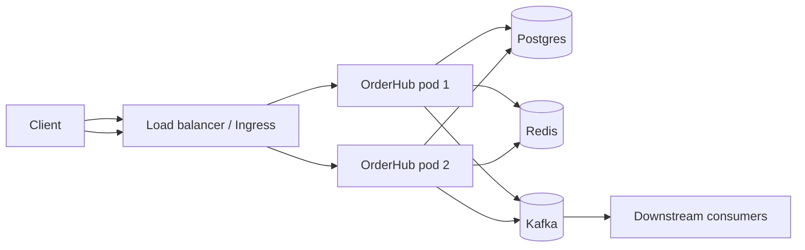

# L4 Level Project: Production-Grade REST Service

The capstone project of L4. You will design, build, deploy, and operate a *production-grade* backend service that exercises every major topic in this module — Spring, JPA, transactions, Postgres with migrations, Redis caching, Kafka eventing, OAuth2 authentication, OpenAPI contracts, full observability (logs/metrics/traces), Testcontainers integration tests, a CI/CD pipeline, and Kubernetes deployment. The result is a portfolio-quality service that demonstrates senior backend mastery and a system you can iterate on as you work through L5.

> [!NOTE]
> Prerequisites: All of L4 C01–C10. This project does not introduce new concepts; it integrates them.

## The Brief

Build **OrderHub** — a multi-tenant order management service.

Functional requirements:
- REST API to create, list, and cancel orders.
- Inventory check before order acceptance.
- Async order-placed event published to Kafka for downstream consumers.
- Idempotent order creation (clients send `Idempotency-Key`).
- Per-tenant rate limiting.
- Multi-tenant data isolation (tenant ID in JWT; row-level filter).
- Audit log (who did what when).

Non-functional requirements:
- p99 latency < 300ms for the create-order endpoint.
- 99.9% availability SLO over 30 days.
- Zero-downtime deploys.
- Full observability — every request traceable across pods.
- Secure by default — OAuth2 JWT, no secrets in code.
- Integration tests run < 3 minutes; mutation score > 70%.

This brief is intentionally ambitious. Most companies' real services don't hit all these bars day one; you'll experience the trade-offs firsthand.

## Suggested Stack

| Concern | Choice | Rationale |
|---------|--------|-----------|
| Language / version | Java 21 | LTS, virtual threads, modern |
| Framework | Spring Boot 3.3 | Industry default |
| Build | Gradle 8 Kotlin DSL | Modern, fast |
| Database | Postgres 16 | Versatile SQL workhorse |
| Migrations | Flyway | Simple, popular |
| Cache | Redis 7 | Universal |
| Messaging | Kafka 3.7 (KRaft) | De facto eventing |
| Auth | Spring Security + OAuth2 Resource Server | JWT validation |
| Validation | Spring Validation (Jakarta) | Built-in |
| API docs | springdoc-openapi | Auto OpenAPI from code |
| Integration tests | JUnit 5 + Testcontainers | Real services |
| Observability | Micrometer + OpenTelemetry | Vendor-neutral |
| Container | Docker (multi-stage, distroless) | Standard |
| Orchestration | Kubernetes (kind locally; EKS/GKE/AKS prod) | Standard |
| CI/CD | GitHub Actions | Universal |

Substitute as appropriate for your environment.

## Architecture Sketch

Multi-instance, stateless, externalized state. Redis caches inventory lookups. Kafka emits `OrderPlacedEvent` for downstream services.

## Milestones

The project is structured in 8 milestones. Each is a useful stopping point and demonstrates a layer of the platform.

### Milestone 1 — Skeleton + Spring Boot

- Generate via `start.spring.io`: Web, Actuator, Validation, DevTools.
- Health check at `/actuator/health`.
- One trivial endpoint: `GET /api/orders` returns `[]`.
- Dockerfile (multi-stage; layered jar).
- `docker compose up` runs the app.

Outcome: it boots, responds, containers.

### Milestone 2 — Domain + Persistence

- Domain models: `Order`, `OrderItem`, `Inventory`, `AuditEvent`.
- JPA entities, repositories.
- Flyway migrations: `V1__create_orders.sql`, `V2__create_audit.sql`.
- `@DataJpaTest` against Testcontainers Postgres.
- Service layer with `@Transactional`.

Outcome: orders persist; queries return them.

### Milestone 3 — REST API + Validation

- `POST /api/orders` accepts orders.
- DTOs separate from entities (input + output).
- Bean validation (`@NotNull`, `@Size`, custom validators).
- `@ControllerAdvice` for consistent error envelopes (RFC 7807 Problem Details).
- `@WebMvcTest` for controller paths.
- springdoc-openapi spec at `/v3/api-docs`.

Outcome: a documented, validated REST API.

### Milestone 4 — Auth + Multi-Tenancy

- OAuth2 Resource Server + JWT validation (use Keycloak or Auth0 dev tenant).
- `tenantId` claim from JWT used to filter all queries.
- Hibernate filter or repository-level enforcement.
- `@WithMockJwtUser` test helper.
- Endpoints require `ROLE_USER`; admin endpoints require `ROLE_ADMIN`.

Outcome: secured, multi-tenant.

### Milestone 5 — Idempotency + Rate Limiting + Caching

- `Idempotency-Key` header: store key → response in Redis 24h.
- Resilience4j rate limiter per tenant.
- Redis caches inventory lookups (`@Cacheable`).
- Cache invalidation on inventory updates.
- Integration tests exercise idempotency edge cases.

Outcome: production-quality request handling.

### Milestone 6 — Events + Kafka

- Publish `OrderPlacedEvent` to Kafka after commit (`TransactionalEventListener` with `AFTER_COMMIT`).
- Outbox pattern OR transactional producer for exactly-once semantics.
- A separate consumer service (could be a separate Spring Boot app or this same app's `@KafkaListener`) marks orders fulfilled.
- Testcontainers Kafka integration test.

Outcome: event-driven backbone.

### Milestone 7 — Observability

- Logback JSON encoder, trace IDs in logs.
- Micrometer + Prometheus endpoint (`/actuator/prometheus`).
- OpenTelemetry auto-instrumentation (Java agent).
- Custom metrics: `orders.placed`, `orders.rejected`.
- Health probes: `/actuator/health/liveness`, `/readiness`.
- Local Grafana + Prometheus + Tempo via docker-compose.
- Dashboards: golden-signals, RED, JVM.

Outcome: visible system.

### Milestone 8 — CI/CD + Kubernetes

- GitHub Actions: build → test → image push → deploy.
- Multi-stage Dockerfile, distroless runtime image, non-root user.
- Helm chart (deployment, service, ingress, configmap, secret).
- Rolling update strategy with probes.
- `kind` cluster locally; pretend EKS for the chart.
- Production-grade probes + preStop hook for graceful shutdown.

Outcome: shippable.

## Acceptance Checklist

A reviewer should be able to verify, in order:

- [ ] `./gradlew clean build` is green.
- [ ] `./gradlew test` runs full suite < 3 minutes.
- [ ] `./gradlew jacocoTestReport` shows > 80% line coverage.
- [ ] `./gradlew pitest` shows > 70% mutation score on `service.*` packages.
- [ ] `docker compose up` brings the app + Postgres + Redis + Kafka + Prometheus + Grafana + Jaeger up.
- [ ] A documented `make seed` command populates test data.
- [ ] `POST /api/orders` with a valid JWT creates an order; response includes `Location` header.
- [ ] Same request with same `Idempotency-Key` returns the original response.
- [ ] Exceeding rate limit returns 429.
- [ ] `kafka-console-consumer` shows `OrderPlacedEvent`.
- [ ] Grafana dashboard shows the request as a metric.
- [ ] Jaeger UI shows the trace including the Kafka publish.
- [ ] Logback output is JSON with trace_id.
- [ ] `kind` deploy via Helm rolls out without downtime (zero-downtime test).
- [ ] OpenAPI spec downloadable; loaded by Postman/Insomnia.
- [ ] README documents the architecture and design decisions.

## Design Decisions To Document

Maintain an `ARCHITECTURE.md` or ADR series. Record:

1. **Why Spring Boot 3 / Java 21?** Performance, virtual threads.
2. **Why Postgres over MySQL?** JSONB, dialect, OSS maturity.
3. **Why Kafka over RabbitMQ?** Event log, downstream replay.
4. **Why Redis over local Caffeine?** Shared state across pods.
5. **Why Helm over plain manifests?** Templating + lifecycle.
6. **Why JWT validation vs full OAuth2 flow?** Resource server only — stateless.
7. **Why Testcontainers over H2?** Dialect fidelity.
8. **Why Gradle Kotlin DSL?** Type safety in build.
9. **Why distroless?** Smaller surface, smaller image.
10. **Why outbox / transactional events?** Atomicity.

These ADRs are excellent interview material.

## Failure Scenarios To Exercise

Senior backend engineers handle failures gracefully. Test:

1. **DB down**: Postgres stops mid-request. Verify circuit breaker, error response.
2. **Kafka down**: Outbox preserves events; replays when Kafka returns.
3. **Slow downstream**: Add an artificial 5s delay; verify timeouts, fallback.
4. **OOM**: Set `-Xmx128m`; load test. Watch how it dies.
5. **Pod kill mid-request**: Use `kubectl delete pod`; verify rolling deploy uses preStop.
6. **Concurrent updates**: 100 clients hammer same inventory; verify optimistic locking.
7. **Cache stampede**: Cache miss + concurrent fills. Use single-flight pattern.

Document the behavior; add tests for each.

## Stretch Goals (For L5 Prep)

When the project meets acceptance, push further:

- **Cassandra read replica** for audit log scale.
- **OpenSearch** for full-text search.
- **GraphQL endpoint** alongside REST.
- **gRPC** alternative interface for internal services.
- **Saga pattern** for multi-step transactions.
- **CQRS / event sourcing**.
- **Multi-region active-active** with conflict resolution.
- **Chaos Mesh** experiment in staging.
- **A/B test** via feature flags.
- **Capacity plan**: project growth, provision.

These are L5 concerns; the L4 project sets the stage.

## Common Pitfalls (Avoid)

> [!WARNING]
> **Skipping migrations.** Hibernate `ddl-auto=update` in prod = disaster.

> [!WARNING]
> **No transactional event publishing.** Order saved but event never fires (or vice versa).

> [!WARNING]
> **Cache as source of truth.** Cache lies; DB is truth.

> [!WARNING]
> **JWT not validated.** Resource server must verify signature, issuer, audience.

> [!WARNING]
> **Hardcoded "dev" secrets.** Even in this project, use proper secret management.

> [!WARNING]
> **No graceful shutdown.** Mid-request kills cost customers.

> [!WARNING]
> **One giant `@Service` class.** Split per use case.

> [!WARNING]
> **Repository in controller.** Maintain layering.

> [!WARNING]
> **No idempotency.** Network retries duplicate orders.

> [!WARNING]
> **Synchronous Kafka publish.** Block the request thread. Use async.

## Submission / Portfolio

Push to GitHub. README must include:

- One-paragraph elevator pitch.
- Architecture diagram (Mermaid).
- How to run locally.
- Tech stack table.
- Acceptance checklist (with checkboxes).
- Trade-offs you made and why.
- What you'd do next given more time.
- Demo: GIF or short video of `docker compose up` + a few requests + Grafana dashboard.

This README *is* your portfolio piece. A staff engineer can skim it in 60 seconds and assess your senior-ness.

## Recap

By completing this project, you'll have:

- Built a multi-tier Java backend that hits a production bar.
- Practiced every L4 chapter's tools concretely.
- Created a portfolio piece for senior backend interviews.
- Set up a personal sandbox for ongoing L5 experiments.
- Earned the operational vocabulary (probes, SLOs, traces, idempotency) that defines a senior backend engineer.

The next chapter is [C13 Best Practices](../C13-best-practices/README.md) — the senior backend idioms and pitfalls that emerge from doing this work in production.
