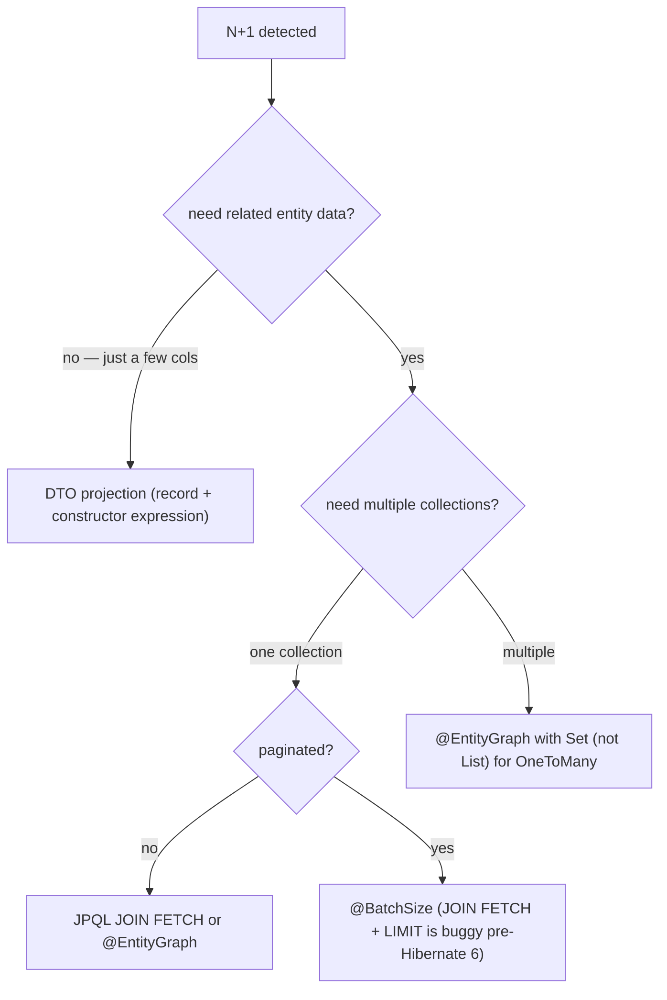

# L4 Best Practices & Pitfalls

The L4 senior backend engineer has internalized a body of *learned-the-hard-way* knowledge: which patterns hold up under production load, which abstractions leak, which "best practices" are dogma vs reality, and which pitfalls take down services at 3 AM. This topic is a curated catalogue of those idioms and traps — organized by area (architecture, persistence, async, security, observability, operations) — distilled from the L4 chapters and from real-world failure patterns that recur across teams.

This is not a list of opinions. Every idiom here has been validated in production by many teams; every pitfall has felled real systems. Senior engineers know these without needing to look them up.

> [!NOTE]
> Prerequisites: comfortable with L4 C01–C10. This is a cross-cutting synthesis.

## Architectural Idioms

### Layer Cleanly, But Don't Worship Layers

Controllers handle HTTP. Services hold business logic. Repositories abstract persistence. Domain models are the language of the business.

But:
- Don't pass DTOs through every layer unchanged — that's "anemic" architecture.
- Don't avoid all logic in entities just because "domain anemia is bad" — there's a middle ground.
- Don't create `Mapper`, `MapperFactory`, `MapperRegistry` abstractions for two-line mappings.

The senior rule: layering serves clarity. When it hurts clarity, simplify.

### Composition Over Inheritance — Almost Always

Spring services that extend `AbstractBaseService<T>` to share five lines accumulate technical debt. Prefer:
- Composition: inject a collaborator.
- Interfaces for polymorphism, not inheritance for reuse.

### Keep Modules Coherent

Package by feature (`order/`, `inventory/`) beats package by layer (`controller/`, `service/`, `repository/`) at scale. Features change together; layers don't.

### Twelve-Factor Discipline

Backend services that hit production must follow the 12-Factor App rules:
1. Codebase: one app, one repo.
2. Dependencies: explicit, isolated.
3. Config: in environment, not code.
4. Backing services: as attached resources.
5. Build / release / run: separated.
6. Processes: stateless.
7. Port binding: app is a service.
8. Concurrency: scale via processes.
9. Disposability: fast startup, graceful shutdown.
10. Dev/prod parity.
11. Logs: as event streams.
12. Admin processes: as one-off processes.

Violations show up later as deployment pain or scaling failures.

## Spring Idioms

### Constructor Injection — Always

```java
// GOOD
@RequiredArgsConstructor   // Lombok
public class OrderService {
    private final OrderRepository repo;
    private final PaymentClient payments;
}
```

```java
// BAD
@Autowired private OrderRepository repo;   // field injection
```

Constructor injection:
- Final fields = thread-safe.
- Tests don't need Spring (`new OrderService(mockRepo, mockPay)`).
- Circular dependencies caught at startup.
- No reflection magic in tests.

### `@Configuration` Beans Over Component Scanning Magic

Explicit beans in `@Configuration` are easier to find and refactor than `@Component`-scanned classes with `@Conditional...` annotations stacking up.

### Profiles For Environment Differences, Not Code Differences

`@Profile("dev")` for dev-only beans is fine. Don't use it to fork business logic — that path bit-rots.

### Use `@Transactional` Sparingly And Deliberately

- Place on service methods, not on controllers, not on repositories.
- Read-only `@Transactional(readOnly = true)` for queries.
- Self-invocation doesn't go through the proxy (`this.foo()` inside class won't honor `@Transactional`).
- Exceptions: only unchecked exceptions roll back by default. Use `rollbackFor = Exception.class` if needed.

### Validation At Boundaries

Validate at controller (`@Valid`). Don't repeat at service unless service is called from non-controller (Kafka listener, scheduled job).

### Custom `@RestControllerAdvice` for Error Envelopes

Standardize error JSON across all endpoints. Use RFC 7807 Problem Details:
```json
{
  "type": "https://api.example.com/errors/order-not-found",
  "title": "Order not found",
  "status": 404,
  "detail": "Order 'abc-123' does not exist",
  "instance": "/api/orders/abc-123"
}
```

## Persistence Idioms

### Repository Methods Beat JPQL Strings

```java
// GOOD
Optional<Order> findByIdAndTenantId(String id, String tenantId);
```

```java
// LESS GOOD
@Query("SELECT o FROM Order o WHERE o.id = ?1 AND o.tenantId = ?2")
Optional<Order> findOne(String id, String tenantId);
```

Spring Data derives the query. Type-safe. Refactor-safe.

### Use Projections For Heavy Reads

```java
public interface OrderSummary {
    String getId();
    BigDecimal getTotal();
}

List<OrderSummary> findByTenantId(String tenantId);
```

Hibernate selects only those columns. Massive reduction in data transferred for list endpoints.

### Avoid N+1 — The Four Fixes, Ranked

**The bug.** A query that fetches N parent rows and then triggers N extra queries to fetch each parent's child collection — total N+1 queries instead of 1 or 2. Catastrophic at scale: 1000 orders = 1001 queries = ~3-5 seconds of round-trips instead of ~10 ms.

```java
// BAD — N+1 (~1001 queries for 1000 orders)
for (Order o : repo.findAll()) {
    o.getItems().size();           // triggers SELECT per order (lazy collection)
}
```

**Why it happens.** Hibernate maps `@OneToMany` collections as `FetchType.LAZY` by default. Touching the collection (`getItems()`, `.size()`, iteration) triggers a `SELECT * FROM items WHERE order_id = ?` *per parent row*.

**How to spot it.** Three good signals:
1. **`hibernate.generate_statistics=true`** + log Statistics.getQueryCount() before/after — see N+1 ratio explicitly.
2. **`spring.jpa.show-sql=true`** in test profile — see the actual queries.
3. **p99 latency that scales with collection size** — a list endpoint that's 100 ms for 10 items, 3 s for 1000 items.

**Fix 1 — JPQL `JOIN FETCH` (preferred for single-query needs).**

```java
@Query("SELECT DISTINCT o FROM Order o LEFT JOIN FETCH o.items WHERE o.tenantId = :tenant")
List<Order> findWithItems(@Param("tenant") String tenant);
```

`DISTINCT` is **required** in JPQL when fetch-joining `OneToMany` — otherwise Hibernate returns the cartesian product (each Order appears N times, once per item). The DISTINCT is *removed* from the generated SQL by `hibernate.query.passDistinctThrough=false` (default), so it doesn't slow the DB; it just deduplicates in memory.

**Trade-off:** Single query, but you can only fetch **one** collection this way (Hibernate throws `MultipleBagFetchException` if you try to JOIN FETCH two `List` collections). For two collections, use Set (no MultipleBagFetchException) or split into two queries.

**Fix 2 — `@EntityGraph` (recommended for reuse).**

```java
@EntityGraph(attributePaths = {"items", "items.product", "customer"})
@Query("SELECT o FROM Order o WHERE o.tenantId = :tenant")
List<Order> findWithGraph(@Param("tenant") String tenant);
```

`@EntityGraph` declares what to eagerly fetch *at the query level*, leaving the entity defaults `LAZY`. Same effect as `JOIN FETCH`, but:
- Can be reused via `@NamedEntityGraph` on the entity
- Cleaner: no JPQL string mangling
- Multiple paths supported (item AND customer in one shot)
- Works with derived queries too: `findByTenantId(...)` + `@EntityGraph(...)`

**Fix 3 — Batch fetching with `@BatchSize` (when JOIN FETCH is too wide).**

```java
@OneToMany(mappedBy = "order", fetch = FetchType.LAZY)
@BatchSize(size = 50)
private List<OrderItem> items;
```

When you access `order.getItems()` on the first parent, Hibernate sees there are 50 other parents needing their items too, and emits ONE query: `SELECT * FROM items WHERE order_id IN (?, ?, ..., 50 placeholders)`. So 1000 parents = 1 parent query + 20 collection queries = 21 queries total. Still better than 1001.

**When to prefer this:** Wide entities where JOIN FETCH would pull too many columns; or when the parent query is paginated (JOIN FETCH + LIMIT is buggy in Hibernate pre-6.0).

**Fix 4 — DTO projection (best for read-only endpoints).**

```java
public record OrderSummary(Long id, String customerName, int itemCount, BigDecimal total) {}

@Query("""
    SELECT new com.example.OrderSummary(o.id, o.customer.name, SIZE(o.items), o.total)
    FROM Order o
    WHERE o.tenantId = :tenant
    """)
List<OrderSummary> findSummaries(@Param("tenant") String tenant);
```

For list endpoints that just need a few fields, projecting straight into a DTO sidesteps entity loading entirely — no lazy collections, no relations, just the columns you need. Often 10× less data transferred. Use Spring Data interface projections for the same effect with even less code.

**Decision flowchart:**



**Common follow-up: serialization N+1.** Even with entities properly fetched, Jackson serialization of a `LAZY` relation triggers a query *per record* (Jackson calls every getter). Fix: use DTOs (`@JsonView`, `@JsonIgnore`, or — best — separate DTO classes). Never expose JPA entities directly in API responses.

### Always Page

`findAll()` on a million-row table OOMs. Always:
```java
Page<Order> findAll(Pageable pageable);
```

### Migrations With Flyway

- One file per migration.
- Naming: `V{version}__{description}.sql`.
- Never edit a committed migration; always add a new one.
- Don't put schema changes in code (`ddl-auto=none` in prod).

### Optimistic Locking By Default

```java
@Entity
public class Inventory {
    @Version private long version;
}
```

Concurrent updates → `OptimisticLockException`. Retry or return 409 Conflict.

Pessimistic locking only when you have a *real* contention scenario.

### Read Replicas For Reads

Separate primary (writes) from replicas (reads). Use `@Transactional(readOnly = true)` + datasource routing.

### Don't `EAGER` Anything

`FetchType.LAZY` everywhere. EAGER cascades into surprise queries.

## Async & Concurrency Idioms

### Use Virtual Threads For IO-Bound Code (Java 21+)

```yaml
spring:
  threads:
    virtual:
      enabled: true
```

Now Tomcat dispatches each request on a virtual thread. Massive concurrency win for IO-bound endpoints. No more thread pool tuning.

### CompletableFuture For Composition

```java
CompletableFuture<User> user = userService.findAsync(id);
CompletableFuture<Inventory> inv = inventoryService.findAsync(sku);
return user.thenCombine(inv, (u, i) -> new OrderContext(u, i));
```

Parallel IO without blocking a real thread per call.

### Avoid `Thread.sleep` In Backend Code

Use schedulers (`@Scheduled`), retry libraries (Resilience4j), or virtual-thread-friendly waits.

### `synchronized` Is Often Wrong At Scale

For per-key locks, use `ConcurrentHashMap.compute` or Caffeine's `LoadingCache`. For distributed locks, Redis (Redlock pattern) or Zookeeper.

### Don't Block In Reactive Code

`Mono.fromCallable(() -> jdbc.query(...))` blocks an event-loop thread. Use `Schedulers.boundedElastic()` or switch to virtual threads + traditional MVC.

## Security Idioms

### Validate JWT Properly

```yaml
spring:
  security:
    oauth2:
      resourceserver:
        jwt:
          issuer-uri: https://auth.example.com
          audiences: my-api
```

Spring validates signature, expiry, issuer, audience. Don't write JWT parsing yourself.

### Roles + Method Security

```java
@PreAuthorize("hasRole('ADMIN') and #orderId == authentication.principal.subject")
public Order delete(String orderId) { ... }
```

Method security composes with URL security.

### Never Log Tokens

Strip `Authorization` headers from request logs.

### CORS Carefully

```java
@Bean
public CorsConfigurationSource cors() {
    var cfg = new CorsConfiguration();
    cfg.setAllowedOrigins(List.of("https://app.example.com"));
    cfg.setAllowedMethods(List.of("GET", "POST", "DELETE"));
    cfg.setAllowCredentials(true);
    ...
}
```

Never `*` with `allowCredentials=true`. Browser will refuse.

### Rate Limit Per Tenant + Per Endpoint

Resilience4j rate limiter per `(tenant, endpoint)` key. Prevents one tenant degrading others.

### Input Validation + Output Encoding

- Input: Bean Validation, custom validators.
- Output: Jackson handles JSON escaping; HTML rendering needs Thymeleaf/JTE escaping.

### No Secrets In Code Or Logs

- Externalize via env / Vault / Secrets Manager.
- Strip secrets from logs (Logback `PatternLayout` with masking).

### TLS Everywhere

Service-to-service via mTLS (service mesh) or TLS (configured client). HTTPS to public.

## Resilience Idioms

### Timeouts Everywhere

Every outbound call: connect timeout + read timeout. Defaults are too long (sometimes infinite).

```java
WebClient.builder()
    .clientConnector(new ReactorClientHttpConnector(
        HttpClient.create()
            .responseTimeout(Duration.ofSeconds(2))
            .option(ChannelOption.CONNECT_TIMEOUT_MILLIS, 1000)
    ))
    .build();
```

### Circuit Breakers For Unreliable Dependencies

Resilience4j:
```java
@CircuitBreaker(name = "paymentService", fallbackMethod = "paymentFallback")
public Charge charge(...) { ... }

public Charge paymentFallback(ChargeRequest req, Exception e) {
    return Charge.queued(req);  // graceful degradation
}
```

### Bulkhead Isolation

Separate thread pools for separate dependencies. Slow payment service doesn't exhaust threads needed for inventory.

### Retry With Jitter

Exponential backoff alone causes synchronized retries. Add jitter:
```java
@Retryable(backoff = @Backoff(delay = 100, multiplier = 2, random = true))
```

### Idempotency Keys

`Idempotency-Key` header. Store key → response in Redis 24h. Same key returns stored response. Critical for POST.

### Dead Letter Queues

Failed Kafka messages → DLQ after N retries. Don't reprocess forever; don't drop.

## Observability Idioms

### Structured JSON Logs

Logback `LogstashEncoder`. Includes MDC (trace_id, request_id, tenant_id). Queryable in ELK/Loki.

### Trace IDs In Logs

```
%d %level [%X{traceId}] [%X{tenantId}] %msg%n
```

Now every log line carries the trace context — cross-correlate logs and traces.

### One Metric Per Behavior

```java
counter("orders.placed").tag("tenant", tenantId).increment();
timer("orders.placement.duration").record(() -> ...);
```

Don't tag with user IDs or order IDs (high cardinality → Prometheus OOM).

### Health Checks: Liveness ≠ Readiness

- Liveness: am I alive? (just app)
- Readiness: can I serve? (DB, downstream)
- Don't check downstream in liveness — cascade restarts.

### Custom Health Indicators

```java
@Component
public class WarmingHealthIndicator implements HealthIndicator {
    public Health health() {
        return cachesWarm() ? Health.up() : Health.down().withDetail("reason", "warming").build();
    }
}
```

### Golden Signals As Dashboard Default

Latency, traffic, errors, saturation. Every service should have this dashboard.

## Operational Idioms

### Graceful Shutdown

```yaml
server:
  shutdown: graceful
spring:
  lifecycle:
    timeout-per-shutdown-phase: 30s
```

PreStop hook sleeps 10s to let LB notice readiness=false.

### Configurable Pool Sizes

DB connection pool, HTTP client pool, Kafka consumer concurrency — all environment-tunable.

### Externalized Config

`application.yml` defaults; env-var overrides. Use Spring profiles for environment-specific files (NOT for behavior forks).

### Logs At Right Volume

- INFO: lifecycle, major business events.
- DEBUG: enabled per package during incident.
- ERROR: exceptions.
- WARN: degradation.

Don't log INFO per request — flood.

### Heap And GC Tuning

For containers (Java 11+):
```
-XX:MaxRAMPercentage=75
```

JVM respects cgroup memory limits.

Pick GC:
- G1 (default) for most.
- ZGC for very large heaps + latency-sensitive.
- Parallel for batch throughput.

## Common Pitfalls

### Database

> [!WARNING]
> **N+1 from `LAZY` collections in serialization.** Jackson loads all relations. Use DTOs.

> [!WARNING]
> **`ddl-auto=update` in prod.** Schema chaos.

> [!WARNING]
> **`findAll()` returning a million rows.** OOM.

> [!WARNING]
> **`@Transactional` on private methods.** Doesn't work (proxy can't intercept).

> [!WARNING]
> **Self-invocation of `@Transactional`.** Same — proxy bypass.

> [!WARNING]
> **`@OneToMany(cascade=ALL)` without thought.** Deletes cascade unexpectedly.

> [!WARNING]
> **No connection pool tuning.** HikariCP defaults (10) too low for high-RPS.

> [!WARNING]
> **No statement timeout.** Slow query starves pool.

### Async / Messaging

> [!WARNING]
> **Publishing Kafka inside the transaction synchronously.** Slow. Use AFTER_COMMIT.

> [!WARNING]
> **No outbox pattern.** Order saves; event publish fails. Inconsistent state.

> [!WARNING]
> **Consumer commits offset before processing.** Crash = lost message.

> [!WARNING]
> **Re-processing without idempotency.** Duplicate side effects.

> [!WARNING]
> **No DLQ.** Bad message blocks partition forever.

### Caching

> [!WARNING]
> **Cache stampede.** Many requests fill same key. Use single-flight.

> [!WARNING]
> **No TTL.** Stale data forever.

> [!WARNING]
> **Cache as source of truth.** Don't.

> [!WARNING]
> **Caching sensitive data.** PII in shared Redis = compliance issue.

### Security

> [!WARNING]
> **Trusting client tenant ID.** Always derive from JWT.

> [!WARNING]
> **No CSRF for browser-served endpoints.** Disabled too aggressively for API-only.

> [!WARNING]
> **Hardcoded JWT secret.** Externalize.

> [!WARNING]
> **No rate limiting.** DoS via single IP.

> [!WARNING]
> **Logging full request bodies.** PII leak.

### Operational

> [!WARNING]
> **No graceful shutdown.** In-flight requests fail during deploys.

> [!WARNING]
> **Liveness checks DB.** DB outage → restart loop.

> [!WARNING]
> **Logs to disk in container.** Pod dies, logs gone.

> [!WARNING]
> **No structured logs.** Manual log searching at 3 AM.

> [!WARNING]
> **No alerting on SLO burn.** Outage detected late.

### Architecture

> [!WARNING]
> **Distributed monolith.** Many services that must deploy together.

> [!WARNING]
> **Shared database.** Service coupling through schema.

> [!WARNING]
> **No API versioning strategy.** Breaking change cascades.

> [!WARNING]
> **Premature microservices.** Split before understanding the domain.

### Code

> [!WARNING]
> **`Optional` field in entities.** JPA doesn't like it.

> [!WARNING]
> **Mutable DTOs.** Race conditions when shared.

> [!WARNING]
> **Static `ObjectMapper` configured wrong.** Subtle serialization bugs.

> [!WARNING]
> **Auto-wiring `RestTemplate` without builder.** No timeouts.

> [!WARNING]
> **Catching `Exception` generically.** Hides bugs.

> [!WARNING]
> **`String` for IDs everywhere.** Use typed wrappers (`OrderId`) for type safety.

## Senior-Backend Operational Anti-Patterns (added pass)

These are the patterns that cause real production incidents at scale. Each is asked at senior+ backend interviews because every senior engineer has either lived through them or seen them.

### AP1 🔴 — Deploying without health checks / readiness probes

**Symptom.** New pods receive traffic before they're ready → 30-60 seconds of 503s during every deploy. Tail latency spikes; customer complaints.

**Cause.** `livenessProbe` and `readinessProbe` not configured in K8s manifest (or just point at `/`).

**Fix.** Spring Boot 2.3+ exposes proper probes via Actuator:
```yaml
spring:
  application:
    name: payments
management:
  endpoints.web.exposure.include: health
  endpoint.health.probes.enabled: true
```
```yaml
# K8s
readinessProbe:
  httpGet: { path: /actuator/health/readiness, port: 8080 }
  initialDelaySeconds: 10
livenessProbe:
  httpGet: { path: /actuator/health/liveness, port: 8080 }
  initialDelaySeconds: 30
```

**Difference between liveness and readiness**: liveness = "is the JVM alive?" (failing → restart pod). Readiness = "is this instance ready for traffic?" (failing → remove from load balancer, but don't restart). Most outages from this confusion: marking unhealthy DB as liveness fail → pod restart loop → cascading failure.

### AP2 🔴 — No graceful shutdown

**Symptom.** During deploys, in-flight requests get killed → 502s in user logs, half-completed DB writes, lost messages.

**Cause.** App receives SIGTERM but doesn't wait for in-flight requests to finish.

**Fix.** Spring Boot:
```yaml
server.shutdown: graceful
spring.lifecycle.timeout-per-shutdown-phase: 30s
```

K8s adds `terminationGracePeriodSeconds: 60` to give the pod time. The sequence: SIGTERM → readiness probe goes red → LB stops sending traffic → existing requests drain → app exits.

For Kafka consumers: explicitly `consumer.close(Duration.ofSeconds(30))` in shutdown hook so the consumer offsets get committed.

### AP3 🟠 — Logging configured in code, not externally

**Symptom.** Need to change log level for one debugging session → requires a deploy → 30 min outage window for diagnosis.

**Cause.** Log level baked into `logback.xml` shipped with the jar.

**Fix.** Externalize log config via env vars / properties:
```properties
logging.level.com.example.payments=INFO
```

In dev/prod, change via `LOGGING_LEVEL_COM_EXAMPLE_PAYMENTS=DEBUG` env var. Spring Boot Admin lets you change log levels at runtime via Actuator.

### AP4 🔴 — Single point of failure for "stateless" services

**Symptom.** "Stateless" service goes down → users logged out, in-flight orders lost.

**Cause.** Service holds session state in-memory (Spring Session without external store, or just `HttpSession`).

**Fix.** Use Spring Session with Redis backing:
```xml
<dependency>
  <groupId>org.springframework.session</groupId>
  <artifactId>spring-session-data-redis</artifactId>
</dependency>
```
Or move to JWT stateless auth entirely. Either way, never assume "stateless" without verifying — `HttpSession.setAttribute()` makes you stateful silently.

### AP5 🔴 — No connection-pool monitoring → silent pool exhaustion

**Symptom.** Endpoint times out under load with `HikariPool-1 - Connection is not available, request timed out after 30000ms`. Operations don't know until users complain.

**Cause.** HikariCP metrics not exposed; no alert on pool utilization.

**Fix.** Expose HikariCP metrics via Micrometer:
```java
@Bean
public DataSource dataSource(@Autowired MeterRegistry registry) {
    HikariDataSource ds = new HikariDataSource(config);
    ds.setMetricRegistry(registry);
    return ds;
}
```

Then alert on:
- `hikaricp_connections_active > 90%` for 2 min (approaching saturation)
- `hikaricp_connections_pending > 0` for 1 min (queries actively waiting)
- `hikaricp_connections_timeout > 0` (already failed)

### AP6 🔴 — Reading config at startup, never re-reading

**Symptom.** Feature flag flipped in config → no effect until redeploy. Config-change-induced outages because "the flag should have rolled back the bad behavior."

**Cause.** `@Value` injects at startup only.

**Fix.** Use **Spring Cloud Config + `@RefreshScope`** for dynamic config:
```java
@RefreshScope
@Service
public class PaymentService {
    @Value("${feature.new-flow.enabled:false}")
    private boolean newFlowEnabled;
}
```

Trigger refresh with `POST /actuator/refresh`. Or, simpler: use a **feature-flag service** (Unleash, LaunchDarkly, GrowthBook) — built-in real-time updates, audit trail, gradual rollouts.

### AP7 🟠 — Synchronous Kafka producer in critical request path

**Symptom.** Kafka broker has a 2-second slowdown → user requests hang for 2 seconds → cascading failure.

**Cause.** Synchronous `producer.send(record).get()` in the request thread.

**Fix.** Use async with callback:
```java
producer.send(record, (metadata, exception) -> {
    if (exception != null) log.error("Kafka send failed", exception);
});
```

Or use the **outbox pattern**: write to DB outbox table atomically with business state; a CDC connector (Debezium) drains it to Kafka asynchronously. Then a Kafka broker outage only delays downstream notification, not the user request.

### AP8 🟠 — Schema migrations that lock tables

**Symptom.** Migration includes `ALTER TABLE orders ADD COLUMN status VARCHAR(20) DEFAULT 'NEW' NOT NULL` — takes 45 minutes; service is down the whole time.

**Cause.** `ALTER TABLE ... ADD COLUMN ... NOT NULL DEFAULT ...` rewrites every row in older Postgres (<11). Locks the table the whole time.

**Fix.** Two-phase migration:
1. Add column nullable: `ALTER TABLE orders ADD COLUMN status VARCHAR(20)`  (fast — metadata only on Postgres 11+).
2. Backfill in batches: `UPDATE orders SET status='NEW' WHERE status IS NULL LIMIT 10000` (loop until done).
3. Add `NOT NULL` constraint after backfill: `ALTER TABLE orders ALTER COLUMN status SET NOT NULL`.

For destructive changes (drop column, rename), use **expand-contract**: deploy code that writes both old + new → backfill → deploy code that reads new → drop old. 3 deploys, zero downtime.

### AP9 🟠 — Distributed transaction (2PC) across microservices

**Symptom.** Trying to "atomically" do an action across 3 services using XA transactions → coordinator becomes SPOF → outages cascade → developers fall back to local-transaction-and-pray pattern.

**Cause.** XA/2PC doesn't scale across microservices — coordinator overhead + lock duration kills throughput; failures during commit phase leave state inconsistent.

**Fix.** **Saga pattern** with compensating actions:
- Choreographed: each step publishes an event; next step subscribes; failures publish compensation events.
- Orchestrated: a saga orchestrator (state machine) tracks progress and triggers compensations.

Pair with **outbox** for atomic write+event. Pair with **idempotency keys** so compensations are safe to retry.

### AP10 🔴 — JWT without rotation / revocation

**Symptom.** Stolen JWT remains valid until natural expiry (often 24h) — security incident becomes a 24-hour-active threat.

**Cause.** Stateless JWTs by definition aren't revocable; long expiry chosen for UX.

**Fix.** Multiple layers:
- **Short access-token TTL** (15 min) + **refresh token** (revocable).
- **Refresh token rotation** (each use issues a new pair; reuse of old one revokes session).
- **JWKS rotation**: rotate signing key periodically (~weekly); old tokens become invalid.
- **Denylist** for known-compromised JTI claims (kept in Redis, checked on each request — small overhead for huge security win).

### AP11 🟠 — Caching the negative result without TTL

**Symptom.** A 500 from downstream service is cached "forever" → service comes back up but cache still returns 500 → false outage that persists.

**Cause.** Cache stores `Optional.empty()` or null without distinguishing "verified absent" from "transient error."

**Fix.** Distinguish:
- **Empty result** (verified absent): cache with long TTL (5-30 min).
- **Error result** (downstream failure): cache with very short TTL (15-60 sec) — gives a circuit-breaker effect without persistent damage.

```java
@Cacheable(value = "user", unless = "#result.isFailure()")
public Result<User> getUser(String id) { ... }
```

### AP12 🟠 — Aggressive retries amplifying outages

**Symptom.** Downstream service has a 2-second slowdown → 1000 RPS service retries 3× each → 3000 RPS hits downstream → downstream collapses entirely.

**Cause.** Retry without backoff or budget; treating slowness as failure.

**Fix.** Three guards:
1. **Exponential backoff + jitter**: `100ms × 2^attempt × (1 + random(-0.25, 0.25))`.
2. **Retry budget**: at most 10% of requests can be retries.
3. **Circuit breaker**: open after N consecutive failures; half-open after cool-down; closed only after probe success.

Resilience4j handles all three:
```java
@CircuitBreaker(name = "payments", fallbackMethod = "fallback")
@Retry(name = "payments")
@TimeLimiter(name = "payments")
public CompletableFuture<Result> call() { ... }
```

### AP13 🔴 — Secrets in environment variables of long-running containers

**Symptom.** A container compromise leaks all env vars to attacker — including DB passwords, API keys, JWT secrets — all exposed in one go.

**Cause.** Putting secrets in env vars (visible to any process on the container) makes them easy to leak via crash dumps, container introspection (`docker inspect`), or process listing.

**Fix.** Use a **secret manager** (Vault, AWS Secrets Manager, Azure Key Vault) and **mount at runtime**:
- Spring Cloud AWS Secrets Manager: `aws.secretsmanager.region=us-east-1`.
- Bound through `application.yml` reference: `spring.datasource.password=${aws.secret:db-password}`.
- Rotate frequently via the manager; app picks up new values via refresh.

### AP14 🟠 — Database backup never tested for restore

**Symptom.** Disaster strikes → tries to restore from backup → backup corrupt / incomplete / missing schema → days of data loss.

**Cause.** Backup configured, never restore-tested.

**Fix.** Quarterly **disaster recovery drill**: restore latest backup into a staging DB; run smoke tests; verify counts match prod. Catalog the recovery time objective (RTO) and recovery point objective (RPO) — and prove them.

### AP15 🟠 — Synchronous health check for downstream availability

**Symptom.** Postgres slow → health check times out → app marked unhealthy → traffic stops → load on Postgres drops → Postgres recovers → app marked healthy again — but the cycle repeats every minute.

**Cause.** Liveness probe calls downstream synchronously; the app's "alive" is conflated with downstream "alive."

**Fix.** Health checks should be **fast** (don't touch downstream) and **bounded** (timeout < probe timeout). Use Spring Boot's separate liveness/readiness groups:
- **Liveness**: JVM-level only (always returns OK unless JVM dying).
- **Readiness**: includes downstream dependencies (DB, cache, etc.).

This way, slow downstream removes from LB (readiness fail) but doesn't restart the pod (liveness still OK).

## The Senior Mindset

What separates L4 from L3:

1. **Operates over codes.** Worries about deploy, rollback, observability — not just shipping features.
2. **Reads logs and traces, not stack traces.** Operates at the system level.
3. **Says no to complexity.** Knows when caching, microservices, eventing add risk > value.
4. **Thinks in trade-offs, not best-practices.** Recognizes context-dependence.
5. **Documents the why.** ADRs, READMEs.
6. **Treats security as design, not afterthought.**
7. **Reduces toil with automation.**

The L4 → L5 jump is from operating one service well to architecting a system.

## Recap

This catalogue is dense. The intent is not to memorize but to recognize. When a senior interview asks "what would you watch for?", recall these patterns. When you're designing a new service, run through this list as a checklist.

The next chapter is [C14 Interview Prep](../C14-interview-prep/README.md) — translating L4 knowledge into senior backend interview answers.
