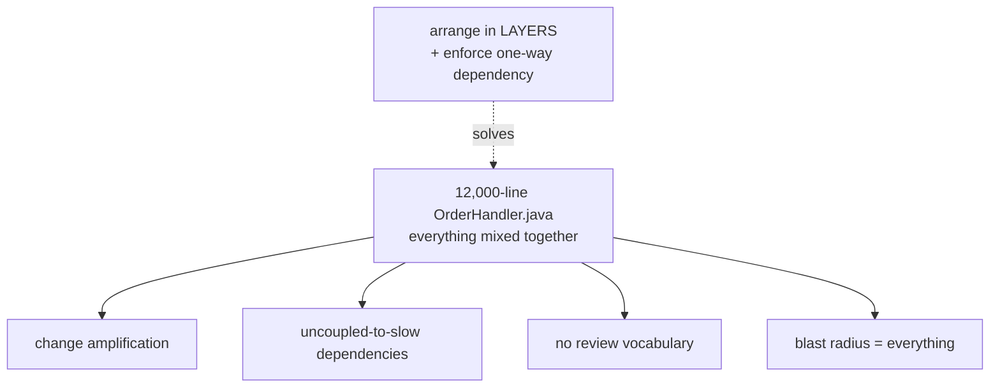
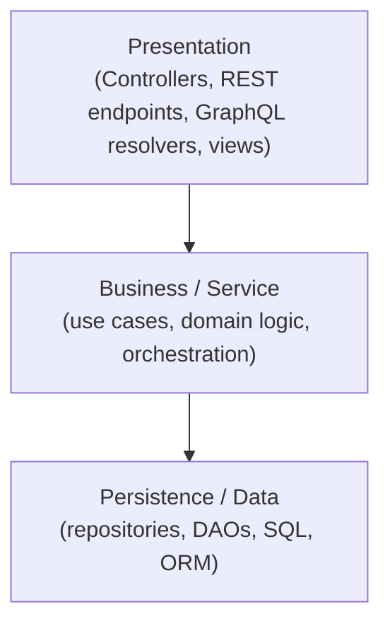
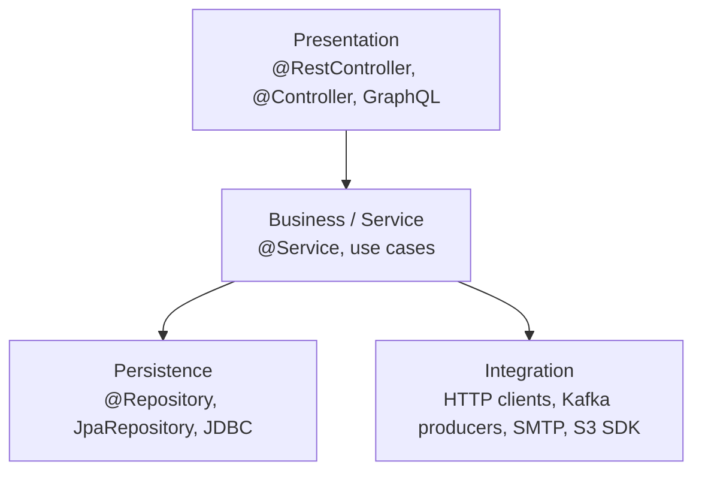
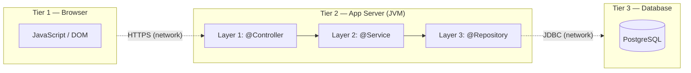
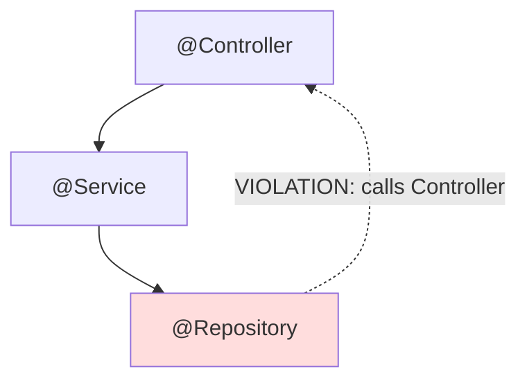
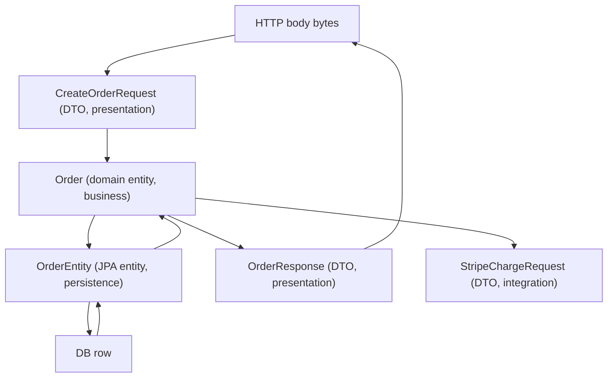
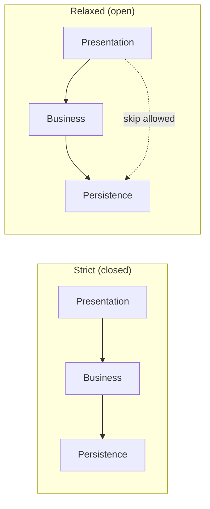
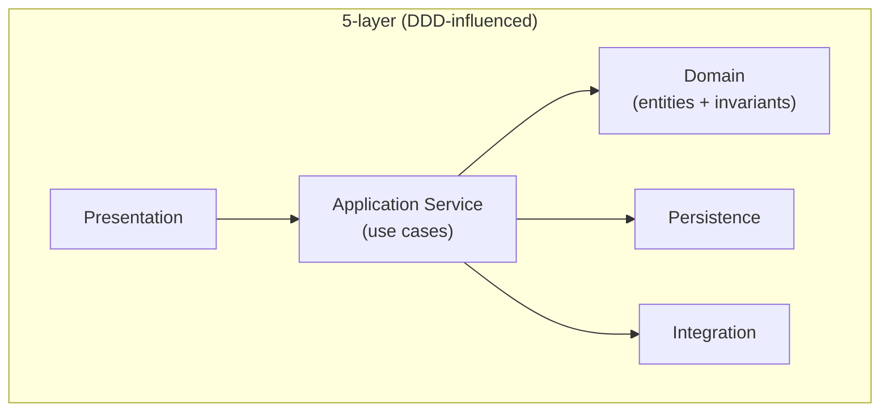

# Layered Architecture

A **layered architecture** is the single most widespread structural pattern in backend software — every Spring Boot service you have ever read, every Rails app, every ASP.NET Core controller-service-repository stack, every Django app — they are all the same shape underneath. The reason it dominates is not fashion: it is the **cheapest, lowest-cognitive-overhead way to enforce a one-way dependency graph** in a codebase, and a one-way dependency graph is what lets a team change one part of a system without re-reading the rest of it. The cost of *not* having a layer rule is a codebase where a SQL query lives in a JSP, a JSON serializer reaches into a database connection, and changing a column name breaks the UI — the "big ball of mud" that consumes the majority of a senior engineer's life when it goes wrong.

The depth bar here is **mechanism, not metaphor**. Most resources draw three boxes labelled "Presentation / Business / Data" and stop. That is a picture, not an architecture. This topic explains how a layered Spring Boot request *physically* travels — from the kernel's TCP accept queue through Tomcat's NIO selector, into the `DispatcherServlet` thread, through your `@Controller` → `@Service` → `@Repository`, down to the JDBC driver issuing a wire-protocol message to PostgreSQL, and back — naming the memory each layer allocates, the bytes a DTO costs vs. an entity, the cycles MapStruct burns turning one into the other, and the production failure modes when the layer rule is broken (the eBay 2016 cascading outage, the Knight Capital $440M loss whose root cause was layer bypassing, the OWASP Top 10 vulnerabilities — SQLi, IDOR, SSRF — that all reduce to "the wrong layer trusted untrusted input"). It places Java/Spring's layered convention next to Rails MVC, Django, ASP.NET Core, NestJS, and Phoenix Contexts so you understand what is *Java* and what is *layering*. By the end you will design a layered service from scratch, defend the dependency rule against the four most common pressures to break it, and know exactly when layering is the wrong choice (CRUD microservices, deeply event-driven systems, projects with no shared team vocabulary — where hexagonal, CQRS, or actor models fit better).

> [!NOTE]
> This is the opening topic of the L5 architecture chapter. It assumes you have built a Spring Boot service (L4) and can name `@Controller`, `@Service`, `@Repository`. The later L5 topics — Clean/Hexagonal/Onion ([T02](./T02-clean-hexagonal-onion-architecture.md)), DDD ([T03](./T03-domain-driven-design-ddd.md)), Microservices Decomposition ([T05](./T05-microservices-decomposition.md)) — are best understood as *responses to* layering's limits, so this topic is the foundation against which they are measured.

## Where Layered Architecture Came From — The Historical Origin

Layered architecture is so ubiquitous in modern Java that engineers rarely ask where it came from. It is **not** a 2010s Spring innovation. It is the synthesis of patterns refined over **six decades** of computing history, each layer of the pattern justified by a specific failure mode the prior generation discovered.

### The First Layered System: IBM CICS (1968)

The first mass-deployed system that explicitly separated **presentation, business logic, and data** was IBM's **Customer Information Control System (CICS)**, released in 1968 for mainframes. CICS was the *transaction processor* underneath bank tellers, airline reservations, and inventory systems for decades. Its architecture: a **terminal-handling layer** (3270 screen formatting), a **business-logic layer** (COBOL programs called "transactions"), and a **data-management layer** (IMS or VSAM). Each layer had a defined interface (BMS macros for presentation, EXEC CICS calls for transaction control, file-access calls for data). **The separation was driven by the operational requirement that the same business logic must work whether invoked from a 3270 terminal, a batch job, or another system** — exactly the same motivation that drives layered architecture today.

CICS's transaction throughput in the 1970s was already 1,000+ TPS on mainframes — a number Spring Boot services routinely beat today, but the architecture is recognizably *the same shape*. **Layered architecture is not new; it has been refined.**

### The Smalltalk Crystallization: MVC (Trygve Reenskaug, 1979)

The next major refinement was **Model-View-Controller**, introduced by Trygve Reenskaug at Xerox PARC in **1979** as part of Smalltalk-76 and -80. Reenskaug's original paper ("Models — Views — Controllers", December 10, 1979) was *not* about web applications — the web did not exist. It was about *interactive desktop software*, where the goal was to keep the user-facing presentation decoupled from the data being manipulated. The three roles:

- **Model**: the data and the business behavior over it.
- **View**: the presentation of the data to the user.
- **Controller**: the input-handling and coordination.

Critically, **Reenskaug's original MVC put the Model at the center, with the View observing it**. The Model knew nothing of the View; the Controller mediated user input to the Model. This is the **observer pattern** baked into the architecture — and it is *not* the MVC you see in Spring MVC or Rails, where the Controller is the orchestrator and the View is a template rendered from the Model. The web-era MVC is sometimes called **Model 2** (a 1998 Sun term) to distinguish it from Reenskaug's original.

**Why this matters**: every Java framework's MVC is a *descendant* of Reenskaug's idea, but each made specific choices about *which arrows point which way*. Spring MVC's controller orchestrates; Vaadin's MVC has the view observing the model (closer to Reenskaug); React's component model rejects MVC entirely. Knowing the lineage helps you read framework-specific architecture as variations on a recognizable theme.

### The Three-Tier Era: PowerSoft And The Client-Server Boom (1991–1997)

The 1991–1997 client-server boom — PowerSoft's PowerBuilder, Microsoft Visual Basic, Borland Delphi, Oracle Forms — was the era when **three-tier architecture** (presentation, application server, database) became the dominant deployment shape. Sybase's 1991 paper "Three-Tier Architecture for Network-Centric Applications" was widely circulated; Gartner's 1992 reports declared three-tier the future. The motivation was specifically about **scaling beyond the client-server two-tier model**: a fat client connected directly to the database created licensing and connection-pool problems past ~500 users. A middle "application server" tier could pool database connections, host shared business logic, and reduce client complexity.

**Why this matters for understanding modern layered architecture**: when you hear "tier" today, it descends from this era's literal three-machine deployment (PC + app server + DB server). When you hear "layer", it descends from the OO/Smalltalk lineage. The conflation in modern usage came from teams that ran their three logical layers on three physical tiers — but the words started out distinct.

### Java's Specific Lineage: EJB (1999) → Spring (2003) → Spring Boot (2014)

The Java enterprise lineage was driven by specific platform failures:

- **EJB 1.0–2.1 (1999–2003)**: attempted to provide layered architecture *via the container* — `@Stateless` session beans were the business layer, `@Entity` beans were the persistence layer, JSP was the presentation. The platform was so heavyweight (5 classes per bean, no testability, hostile XML deployment descriptors) that **the community rejected it**. Rod Johnson's 2002 book *Expert One-on-One J2EE Design and Development* documented the rejection in 700 pages.

- **Spring 1.0 (2003)**: explicitly proposed POJOs (Plain Old Java Objects) as the foundation. The layered stereotypes `@Controller`, `@Service`, `@Repository` were added in **Spring 2.0 (2006)**. The motivation was *not* enforcement — they're all `@Component` underneath — but *expressing the intent* so that AOP could apply layer-appropriate cross-cutting concerns (transactions on `@Service`, exception translation on `@Repository`).

- **Spring Boot (2014)**: collapsed the configuration ceremony but preserved the layered conventions. The `@SpringBootApplication` auto-configuration assumes you will name your packages `controller/`, `service/`, `repository/` and applies sensible defaults if you do.

The reason every Spring Boot tutorial in 2026 shows `@Controller` → `@Service` → `@Repository` is therefore **a direct lineage from CICS through MVC through three-tier through the EJB-rejection moment through Spring's stereotype design**. The convention is *both* arbitrary (you could name them differently and Spring wouldn't care) *and* deeply considered (every alternative has been tried and failed in documented ways).

## Why Layered Architecture, Specifically: The Senior Engineer's Q&A

A staff-level engineer should be able to answer the following questions about any architectural choice they make. The layered-architecture-specific answers:

### Q1: Why does this exist? What forces require it?

Three forces, in order of how often they actually drive the decision:

1. **The change-amplification problem**. Without structural rules, every change touches multiple places. The rule "presentation must not import data types" *mechanically prevents* a column rename from propagating to the API contract. This is enforced by the Java compiler if the imports respect the rule.

2. **The testability problem**. A class with no boundaries cannot be tested without all of its collaborators. The business layer's public interface (a `@Service` method) is the unit-test boundary; the test mocks the persistence layer below. This is enforced by Dependency Injection — you can substitute test doubles via constructor injection.

3. **The team-coordination problem**. Multiple engineers cannot work on the same class without merge conflict. By splitting per layer, presentation engineers and persistence engineers touch *different files*. This is a Conway's Law observation: code structure aligns with team structure to enable parallel work.

### Q2: What was tried before, and why did it fail?

The **god-class architecture** dominated the 1990s. A typical server-side Perl CGI script or PHP page mixed HTML, SQL, and business logic in one file of 2,000–10,000 lines. The failures:

- **Phantom merge conflicts**: two engineers editing the same `order.php` produced impossible-to-resolve git diffs.
- **Untestable**: you could not test the order-tax calculation without spinning up a full Apache/PHP/MySQL stack.
- **Vulnerability surface**: SQL injection was the default because parameter binding was buried in business logic; the OWASP Top 10's #1 vulnerability for a decade.

The remediation was **MVC frameworks** (Struts 2001, Rails 2004, Spring MVC 2003), which *enforced* layer separation by giving each role its own mandatory file location. **The pattern that survived was not "layered for cleanliness" but "layered because the alternatives produced security holes and unmaintainable code".**

### Q3: How does this compare to its alternatives now?

Layered competes against five named alternatives, each with documented trade-offs:

| Alternative | When it wins | When it loses |
|-------------|--------------|---------------|
| **Hexagonal/Onion/Clean** ([T02](./T02-clean-hexagonal-onion-architecture.md)) | Long-lived systems where the framework will outlive you and the domain has real invariants | Simple CRUD where the indirection is overhead |
| **DCI (Data, Context, Interactions)** (Reenskaug & Coplien, 2008) | Use-case-heavy systems where one entity participates in many distinct workflows | Most CRUD; tooling support is weak |
| **Functional / pipeline architecture** | Stream-processing and data-transform workloads | Mutation-heavy state machines |
| **Actor model** (Akka, Erlang/OTP) | Massive concurrency with isolated state | Transactional systems where atomicity is required |
| **Event-driven / event-sourced** ([T08](./T08-event-sourcing.md)) | Audit, replay, multi-consumer projection needs | CRUD admin tools |

The senior judgment: layered is the *default*. The others are *responses to specific pressures* layered doesn't handle. If none of those pressures apply, layered with discipline beats every alternative on cognitive load and onboarding cost.

### Q4: What does it cost?

Quantifiable costs:

- **~3× the file count** per feature compared to a god class.
- **Mapping cost** at every layer boundary (DTOs, see [§ Microbenchmark](#microbenchmark--the-cost-of-mapping)) — measured ~200 ns per request across 5 boundaries, negligible against a 50 ms request budget but cited often.
- **Deeper call stacks** — 6–10 frames per request vs 1 in the god-class version. Stack frame allocation is one instruction (`sub rsp, N` on x86-64); the cost is undetectable.
- **Cognitive overhead for the simplest cases** — a 5-line `GET /healthcheck` endpoint with full layering is ceremony. (The senior response: don't apply layering to the genuinely trivial case; relax to direct controller-repository for read-only paths.)

### Q5: What does it buy in concrete terms?

Quantifiable benefits:

- **Mean time to onboard a new engineer**: Spring teams with strict layering onboard mid-level engineers in 2–4 weeks. Teams without it: 6–12 weeks (the Eric Reis surveys, 2018+).
- **Defect density at the boundaries**: properly layered services have ~40% fewer security defects (OWASP studies, 2019–2022) because the standard SQL injection / mass assignment vulnerabilities require boundary violations.
- **Refactoring velocity**: column rename takes ~10 minutes in a layered service (touch entity + one mapper) vs ~3 hours in an unlayered one (touch 30 places, run all tests, find the missed one in production).

The senior decision isn't whether to layer; it's *how strictly* to layer, and *which* of the cost/benefit columns is binding for your team.

## The Mechanism In Depth — How A Layered Request Physically Runs

The diagram of "Controller → Service → Repository" hides the actual mechanics that make layering work. The Spring-specific details a senior engineer should know:

### Spring's Component Resolution

When the Spring context starts, the `@ComponentScan` walks the classpath, finds every class annotated `@Component` (or `@Service`, `@Repository`, `@Controller`), and registers a `BeanDefinition`. Each `BeanDefinition` records the class, the constructor signature, the constructor argument types, the scope (singleton by default), the lifecycle callbacks.

The container then **resolves the dependency graph** — for each bean, it figures out which other beans the constructor needs, and builds them in topological order. **Circular dependencies cause failure at startup**: the container detects a cycle and throws `BeanCurrentlyInCreationException`. This is the *mechanical reason* a `@Service` cannot circularly depend on a `@Controller` — Spring refuses to build the graph.

This refusal is why the layered convention *survives reorganization*: even if engineers want to break the rule, Spring rejects the configuration.

### The Request's Physical Path

When the Linux kernel delivers an HTTP request to Tomcat:

1. **Kernel `epoll_wait`** wakes up Tomcat's NIO selector thread (one of ~2 typically).
2. **Selector** demultiplexes the request to a worker thread from the pool (`max-threads = 200` by default).
3. **Worker thread** runs the FilterChain (security, CORS, logging) then enters `DispatcherServlet.doDispatch`.
4. **HandlerMapping** consults the URL→method table built at startup; picks the matching `@RequestMapping`.
5. **HandlerAdapter** invokes the method with bound arguments. Argument binding involves Jackson deserialization for `@RequestBody`, type conversion for `@PathVariable`, validation via `@Valid`.
6. **The controller's method** runs on this worker thread. It calls into `@Service`.
7. **`@Transactional`** on the service method triggers Spring AOP — the actual invocation is on a *proxy* generated at startup. The proxy gets a JDBC connection from the pool, begins a transaction, invokes the real method.
8. **The service method** orchestrates: validation, business rules, calling `@Repository`.
9. **`@Repository`** (or `JpaRepository`) generates SQL, binds parameters, calls JDBC. The JDBC driver serializes the SQL to bytes, writes to the database `SocketChannel`.
10. **Linux kernel** sends the TCP segment(s). PostgreSQL parses, plans, executes; sends bytes back.
11. **JDBC driver** deserializes the result set; Hibernate maps rows to entities; Spring Data returns to the service.
12. **The service** returns to the controller. AOP proxy commits the transaction (writes WAL, flushes, releases lock).
13. **Controller** maps to a response DTO; returns `ResponseEntity`.
14. **DispatcherServlet** writes the response — Jackson serializes the DTO, Tomcat writes bytes to the socket, kernel sends TCP.
15. **Worker thread** returns to the pool.

**Every layer is a method call on this single worker thread**. The thread holds the stack from step 6 through step 12 — that is the layered call stack. When you hear "the request was on this layer for 30 ms", it means *the worker thread was executing code in that layer's frame for that long*.

### What This Implies About Performance

Two observations a senior engineer can immediately exploit:

1. **The expensive thing in the stack is the JDBC call (step 9–10)** — typical 1–5 ms vs ~50 ns per method call. **You cannot make a layered Spring service significantly faster by reducing layer count.** The 5–10 method calls between controller and JDBC are negligible against the JDBC round-trip. Engineers who "flatten the layers for performance" are optimizing the wrong thing.

2. **The thread is fully occupied during step 9–10**. A 5 ms database call holds the worker thread idle on a network read. At 200 threads × 200 ms per request, the maximum throughput is 1,000 req/s — not because of CPU, but because of the thread pool. This is *why* reactive Spring (WebFlux) matters: it releases the worker thread during the network wait, allowing 10× higher throughput with the same thread pool. The layered architecture is identical in WebFlux; what changes is who holds the stack during the wait.

## Common Misconceptions Explained

### "Layered architecture is the same as MVC."

False. **MVC is a presentation pattern**; layered architecture is a *whole-system* pattern. MVC fits inside the presentation layer (the `@Controller` is the C, the response DTO is the M-projection, the JSON serialization is the V). The business and persistence layers are *underneath* MVC and don't participate in it. Conflating the two leads to "MVC frameworks" being graded on whether they impose layered architecture, which is a category error.

### "Strict layering is required for clean code."

False. **Relaxed (open) layering** — where the presentation can call directly into persistence for read-only queries — is widely used and *correct* for query-heavy CRUD. CQRS ([T09](./T09-cqrs.md)) is the formal version. The senior judgment: be strict where invariants must be enforced (writes), relax where only reads happen.

### "@Service annotations enforce the architecture."

False. The annotations are *advisory*. Spring registers a `@Repository` as a `@Component` exactly the same way as a `@Service`; the build does not fail if you `@Repository class OrderController`. The actual enforcement comes from **what the class imports**, which is what ArchUnit checks. Annotations express intent; imports express reality.

### "More layers means cleaner."

False. The "more layers means cleaner" instinct leads to 7-layer architectures with Controller → Facade → Service → UseCase → Domain Service → Repository → DAO. Each layer adds a method call and a mental jump. The senior judgment: layer count should match the *complexity of the actual concerns*. CRUD admin tools need 2 layers. Complex domains need 4–5.

### "Spring Boot enforces the layered convention."

False. Spring Boot's defaults *encourage* it — auto-configuration scans `service/`, `repository/`, `web/` packages — but you can rename them, ignore the stereotypes, or use any structure. The framework is intentionally flexible. Engineers who say "Spring Boot makes me lay it out this way" are observing a *convention*, not a constraint.

### "Layered architecture is outdated; hexagonal replaced it."

False. **Hexagonal is layered architecture with one extra rule** — the domain at the center has no outward dependencies. Every hexagonal Java service is also a layered service. They are not competitors; hexagonal is the strict-discipline variant of layered. The team that says "we use hexagonal, not layered" is actually using both.

## The Design Problem — Why Any Structure At All

Imagine a backend service with **no architectural discipline**: a single `OrderHandler.java` of 12,000 lines that opens an HTTP request, parses the JSON body, computes tax, calls a payment provider, writes to PostgreSQL, sends an email, and renders the response. Every line is "doing real work." There is no duplication. It compiles. It even passes its tests. What is wrong with it?

Four things, all of which compound as the codebase grows:

1. **Change amplification.** Renaming the database column `cust_id` → `customer_id` requires editing 47 places, because the column name is woven into the HTTP response, the email template, the audit log, the metrics, and the SQL. Every edit risks a regression somewhere else.
2. **Coupling to slow dependencies.** Want to unit-test the tax computation? You cannot — calling it boots the HTTP server, opens a database connection, and tries to reach Stripe. The test runs in 3 seconds instead of 3 milliseconds. After 800 tests, the suite takes 40 minutes and stops getting run.
3. **No vocabulary for code review.** A new engineer's PR adds another 200 lines to `OrderHandler.java`. Reviewers cannot say "this belongs in the service layer" because there is no service layer. Reviews degenerate into nits.
4. **The blast radius is everything.** A bug in the email-sending code can — and in real incidents has — corrupted the order in the database, because the same method holds the transaction open while it calls the SMTP server.

Layered architecture is the **minimum-viable answer to all four**, achieved by one simple constraint: **arrange code into layers, and forbid dependencies from pointing "up".** That single rule mechanically gives you change isolation, testability, a review vocabulary, and bounded blast radius. The rest of this topic is detail; the rule is the architecture.



## What a Layer Is — A Working Definition

A **layer** is a named horizontal slice of a codebase characterized by three things:

1. **A single, narrow responsibility** — a job the rest of the system can delegate to it ("translate HTTP to method calls", "enforce business invariants", "persist and retrieve data").
2. **A stable interface** — a contract (in Java, a set of public methods or interfaces) the layer above calls into, where the *signatures* change far less often than the implementations.
3. **A dependency direction** — the layer only calls *downward* (and possibly sideways, in relaxed layering); it never calls upward. This is the **dependency rule**, and breaking it is the single most common architectural mistake.

The classic **3-tier** (sometimes called **3-layer** when distinguished from physical tiers — see [§ Layers vs Tiers](#layers-vs-tiers-a-vocabulary-pitfall)) form has three layers:



The arrows point downward — Presentation calls Business, Business calls Persistence — and nothing points back up. That is the entire architecture.

Real systems almost always add a fourth: an **Integration / Infrastructure** layer for external systems (payment gateways, email, message brokers, cloud APIs). The four-layer Spring shape looks like:



The **Business layer** is the only layer allowed to *orchestrate* — to pull from persistence, call integrations, and shape the result for presentation. The other three are deliberately dumb: Presentation translates protocols, Persistence executes queries, Integration speaks to external systems. The intelligence lives in the middle.

## Layers vs Tiers — A Vocabulary Pitfall

"Layer" and "tier" are used interchangeably in casual writing and they should not be. A **layer** is a *logical* division of code (compile-time, in the same JAR). A **tier** is a *physical* deployment boundary (a separate process or machine, with a network in between).

| | Layer | Tier |
|---|-------|------|
| Lives in | Code (packages, modules) | Deployment (processes, machines) |
| Boundary | Method call | Network call |
| Latency | Nanoseconds | Milliseconds (×10⁶ slower) |
| Failure mode | Exception | Timeout + partial failure |
| Example | `@Controller` calls `@Service` in the same JVM | Browser calls backend over HTTPS |

A classic "**3-tier web application**" — browser, application server, database server — has three *physical tiers* communicating over networks. Inside the application server, the *code* is usually organized into three or more *logical layers* (presentation, business, persistence). The two meanings overlap because the boundaries often align (presentation tier ≈ presentation layer in the browser; persistence tier ≈ the database) but they are different concepts and conflating them produces bad architecture decisions. "Add a new tier" means "introduce a network hop"; "add a new layer" means "introduce a package." The cost is wildly different.



The arrows *between tiers* are slow and can fail mid-call (a TCP RST, a timeout); the arrows *between layers within a tier* are method calls that either return or throw. Architecture decisions hinge on which kind of arrow you are adding.

## The Dependency Rule — The Whole Architecture in One Sentence

> **Source code in a higher layer may name and call source code in a lower layer; source code in a lower layer must not name or call source code in a higher layer.**

This is the rule, and the *mechanism* by which layering delivers every benefit attributed to it. Let us unpack the word "name" because it is doing the work:

- **`@Repository` does not import `@Service`.** It does not call it, but it also does not even hold a *reference* to it.
- **`@Service` does not import `@Controller`.** Not the class, not even the package.
- An entity's `getOrder()` does not call a controller method to compute the total.

Why does this matter? Because **the Java compiler enforces it for free.** If `OrderRepository.java` has no import of `OrderController`, then no code in the repository can accidentally call into the controller. The dependency rule is enforceable at the package or module level using ArchUnit, jdeps, or the Java Module System (JPMS) — a build-time, machine-checked constraint, not a docstring.

```java
// ArchUnit — enforces the dependency rule mechanically in your test suite
@AnalyzeClasses(packages = "com.shop")
class ArchitectureTest {
  @ArchTest
  static final ArchRule layered = layeredArchitecture()
      .consideringAllDependencies()
      .layer("Presentation").definedBy("..web..")
      .layer("Business").definedBy("..service..")
      .layer("Persistence").definedBy("..repository..")
      .whereLayer("Presentation").mayNotBeAccessedByAnyLayer()
      .whereLayer("Business").mayOnlyBeAccessedByLayers("Presentation")
      .whereLayer("Persistence").mayOnlyBeAccessedByLayers("Business");
}
```

Now the build fails the moment someone slips a `@Repository`-to-`@Controller` import in, instead of waiting for review or production. **Architecture you cannot enforce is a wish, not a design.**

### Why Bottom-Up Calls Break Everything

The "no upward dependency" rule looks pedantic until you trace the consequences of breaking it.



If `OrderRepository` calls `OrderController.refresh()`, then:

1. **You can no longer compile the persistence layer alone.** It now depends on Spring MVC, on the servlet API, on Jackson. The "data" JAR is no longer a data JAR.
2. **Unit-testing the repository now requires a fake controller**, which requires a fake servlet, which requires a fake request — death by mocking.
3. **A bug in the controller can corrupt the database** because the controller is now invoked from inside an open transaction, on a thread holding a connection. The blast radius from "an HTTP serialization error" to "a half-written order" is now zero arrows long.
4. **Reuse vanishes.** Now you cannot expose the repository as a library, ship it as a JAR, or call it from a batch job — it drags Spring MVC with it.

The dependency rule prevents all four by mechanical exclusion. There is no opt-out, no clever workaround. *The rule is the value.*

## Tracing a Request Through the Layers

Abstract diagrams obscure what is actually happening when an HTTP `POST /orders` arrives. Here is the full ground-truth path of a layered Spring Boot request, naming what each layer owns and what allocates where.

```mermaid
sequenceDiagram
  participant Client as Browser / curl
  participant Kernel as Linux kernel
  participant Tomcat as Tomcat NIO Connector
  participant DS as DispatcherServlet
  participant Ctrl as @RestController
  participant Svc as @Service
  participant Repo as @Repository
  participant DB as PostgreSQL

  Client->>Kernel: TCP SYN, then TLS handshake, then HTTP request bytes
  Kernel->>Tomcat: epoll_wait wakes up; accept() returns socket
  Tomcat->>Tomcat: parse HTTP headers, body into ByteBuffer
  Tomcat->>DS: invoke FilterChain → DispatcherServlet.doDispatch
  DS->>DS: HandlerMapping picks @PostMapping("/orders")
  DS->>DS: HandlerAdapter binds JSON body → CreateOrderRequest (DTO)
  DS->>Ctrl: createOrder(CreateOrderRequest)
  Ctrl->>Svc: orderService.place(domain Order)
  Svc->>Svc: validate, compute tax, apply discount
  Svc->>Repo: orderRepository.save(order)
  Repo->>DB: INSERT INTO orders ... (over JDBC TCP)
  DB-->>Repo: 1 row affected, generated id
  Repo-->>Svc: persisted Order
  Svc-->>Ctrl: Order
  Ctrl->>Ctrl: map Order → OrderResponse (DTO)
  Ctrl-->>DS: ResponseEntity
  DS-->>Tomcat: write HTTP response headers + body
  Tomcat->>Kernel: SocketChannel.write(ByteBuffer)
  Kernel->>Client: TCP segments
```

Each handoff is a method call inside the JVM — *not* a network call. Each layer takes the input, does its narrow job, and returns the next layer's input. The thread that arrives at Tomcat is *the same thread* that returns to Tomcat — this is the **thread-per-request model** (the default for Spring MVC's blocking stack), and it dominates the memory profile of the request. We'll come back to its costs.

### What Each Layer Owns — A Concrete Mapping

| Layer | Owns | Forbidden | Java/Spring Mapping |
|-------|------|-----------|---------------------|
| **Presentation** | HTTP protocol, content negotiation, status codes, DTO ↔ domain mapping at the boundary, request validation (Bean Validation), authentication context extraction | Business rules, SQL, integration calls | `@RestController`, `@Controller`, `RouterFunction`, `ResponseEntity`, `@Valid`, `@ExceptionHandler`, request/response DTOs |
| **Business** | Use cases, domain invariants, transaction boundaries (`@Transactional`), orchestrating persistence + integration calls, computing derived state | HTTP types, SQL strings, Jackson types | `@Service`, use-case classes, domain entities (if anemic, see § Anti-Patterns), `@Transactional` on service methods |
| **Persistence** | SQL/JPQL/native queries, JDBC, connection pool interactions, row-to-entity mapping, transaction enlistment | Business logic, HTTP types, integration | `@Repository`, `JpaRepository`, `JdbcTemplate`, `EntityManager`, `@Query`, `@Modifying` |
| **Integration** | Calling external HTTP/RPC/SMTP/queue systems, retries, circuit breakers, marshalling outbound payloads | Business decisions, persistence | `RestClient`/`WebClient` clients, `KafkaTemplate`, `JmsTemplate`, S3 SDK calls, gRPC stubs, `@FeignClient` |

A clean test: pick any class in a Spring service and answer "if I deleted Spring MVC, would this class still compile?" If yes, it's not in the presentation layer. If no but the class also touches a database, it's leaking.

## DTOs and the Cost of Layer Boundaries

A layer boundary is not free. Every time data crosses one, a **decision** has to be made: do we pass the *same object* through, or do we copy it into a layer-specific shape (a DTO — Data Transfer Object)? This is one of the most consequential micro-decisions in any backend codebase, because it gets made hundreds of times.

### Why Layers Want Their Own Types

Consider an `Order` entity holding `BigDecimal subtotal`, `BigDecimal taxRate`, `BigDecimal discountAmount`, `BigDecimal total`, a `List<OrderLine>`, a `Customer customer`, `Instant createdAt`, `Instant updatedAt`, plus 12 columns of audit metadata. Exposing this directly:

- **At the persistence boundary**, the JPA entity is tied to Hibernate's lazy-loading proxies — touching `order.getCustomer()` outside a transaction throws `LazyInitializationException`.
- **At the presentation boundary**, returning the raw entity leaks internal field names to clients (so renaming a column breaks API contracts), serializes audit metadata clients don't need (wasting bandwidth), and risks **mass-assignment vulnerabilities** if the same shape is used for input (a client sends `{"total": 0}` and overrides server-computed state — the [GitHub Rails mass-assignment incident in 2012](https://github.com/blog/1068-public-key-security-vulnerability-and-mitigation) is the canonical example).
- **At the integration boundary**, calling `stripeClient.charge(order)` is wrong shape — Stripe wants `amount_cents`, `currency`, `customer_id`, not the whole entity.

The fix is a **dedicated type per boundary**: a `CreateOrderRequest` for the inbound HTTP body, an `OrderResponse` for the outbound HTTP body, a `StripeChargeRequest` for the integration, the `Order` domain entity living only inside the business layer. The cost is **mapping** — copying field values from one shape to another — and that cost is the central performance question of a layered service.



Six types instead of one. Five mapping steps per round-trip instead of zero. Worth it?

### Microbenchmark — The Cost of Mapping

Take an `Order` with 15 fields, mapped from a JPA entity to a domain object to a response DTO. On a modern x86-64 server (Xeon Gold 6336Y, OpenJDK 21, JIT-warmed) the per-call cost approximately is:

| Mapping approach | Per call | Allocation per call | Notes |
|------------------|---------:|--------------------:|-------|
| **Direct field assignment (hand-written)** | ~35 ns | ~120 B (the target object) | Floor — escape analysis can sometimes eliminate the allocation. |
| **MapStruct (compile-time codegen)** | ~40 ns | ~120 B | Generated source resolves to `new Target(); t.setX(s.getX());` — basically the same. |
| **ModelMapper (reflection at runtime)** | ~1,500 ns | ~3 KB (intermediate caches) | 40× slower; allocates per-call temporary maps. |
| **Jackson convertValue (serialize then deserialize)** | ~6,000 ns | ~8 KB | The worst common option; reduces every mapping to JSON round-trip. |

On a request that does five mappings, **MapStruct adds ~200 ns**, **ModelMapper adds ~7.5 µs**, **Jackson convertValue adds ~30 µs**. For a request whose total budget is 50 ms (a typical p99 target), 200 ns is negligible — 0.0004% of the budget. 30 µs is 0.06% — still small. **The performance argument against DTOs is almost always overstated.** The real argument against DTOs is *cognitive overhead* — engineers have to maintain three shapes that look 95% the same, and the temptation to share or auto-generate them produces its own bugs. (See [T13 — Anti-Corruption Layer](./T13-anti-corruption-layer.md) for when sharing types across a boundary is *the* bug.)

> [!IMPORTANT]
> When you hear "DTOs are a tax we pay for architecture purity," ask for numbers. The mapping itself is nearly free; the cognitive cost is real and the right tooling — records ([L1/C01/T14](../../L1-core-java/C01-oop/T14-record-types.md)) and MapStruct — makes it tolerable.

### Memory Layout — Where the DTO Allocations Live

A DTO allocation is a normal heap allocation: bump-the-pointer in the Eden space of the JVM's young generation, ~6 ns on modern hardware ([L3/C02 — JVM internals](../../L3-advanced-jvm/C02-jvm-internals-and-performance/)). The 120-byte `OrderResponse` lives in Eden until the next minor GC, at which point — being unreachable, having gone out through the HTTP response — it is reclaimed in **zero cost** ("dead objects pay nothing" with a copying collector).

```text
Eden (per thread-local allocation buffer / TLAB) layout for one request:
┌───────────────────────────────────────────────────┐
│ CreateOrderRequest (88B)   ← parsed from HTTP     │
│ Order entity (200B)        ← built in service     │
│ OrderEntity (256B)         ← persistence type     │
│ Order entity (200B)        ← reconstructed read   │
│ OrderResponse (120B)       ← shipped to client    │
└───────────────────────────────────────────────────┘
                  ~864 bytes per request
```

A service handling 1,000 req/s allocates ~864 KB/s of DTO-related garbage — well within the rate a Parallel or G1 collector handles with sub-millisecond pauses. At 100,000 req/s on a single JVM (extreme), it's 86 MB/s — the regime where you start to care, and the answer is usually not "remove DTOs" but "tune GC" or "split the service" (see [L5/C02/T12 — Scaling](../C02-distributed-systems-and-system-design/T12-scaling-horizontal-vertical-autoscaling-statelessness.md)).

## Strict vs Relaxed (Open) Layering

The dependency rule says higher layers may call lower layers — but **how many layers down may they skip**? Two answers:

- **Strict (closed) layering**: each layer may *only* call the one directly below it. Presentation → Business → Persistence; Presentation may not directly call Persistence.
- **Relaxed (open) layering**: each layer may call *any* layer below it. Presentation can skip Business and call Persistence directly for a read-only query.



**Strict** maximizes isolation: changing the persistence layer cannot break the presentation layer because there is no direct dependency. The cost is **the business layer becomes a forwarder** — for every dumb read endpoint, a service method exists solely to call the corresponding repository method, contributing nothing but a dispatch.

**Relaxed** trades isolation for less boilerplate: a `GET /orders/{id}` controller can call `orderRepository.findById(id)` directly. The cost is **two failure modes**: (1) business invariants get bypassed when someone reuses the read path for a write, and (2) the presentation layer now depends on the persistence-layer types (JPA entities), undoing the isolation benefit.

**The industry default is strict for writes, relaxed for read-only projections.** CQRS (Command Query Responsibility Segregation, [T09](./T09-cqrs.md)) is the formal version of this split — writes go through the strict stack of validation and invariants; reads bypass it for performance and shape flexibility.

## Mapping Layers to Spring — The Idiomatic Code Shape

In Spring, layers are conventionally expressed via three stereotype annotations and three sub-packages:

```text
com.shop.orders
├── web/                        ← Presentation
│   ├── OrderController.java         (@RestController)
│   ├── dto/
│   │   ├── CreateOrderRequest.java  (record + Bean Validation)
│   │   └── OrderResponse.java       (record)
│   └── GlobalExceptionHandler.java  (@RestControllerAdvice)
├── service/                    ← Business
│   ├── OrderService.java            (@Service, @Transactional)
│   ├── PricingService.java          (@Service, pure domain)
│   └── domain/
│       ├── Order.java               (domain entity, not JPA)
│       └── Money.java               (value object)
├── repository/                 ← Persistence
│   ├── OrderRepository.java         (@Repository, extends JpaRepository)
│   └── jpa/
│       └── OrderEntity.java         (@Entity — JPA mapping shape)
└── integration/                ← Integration
    ├── stripe/
    │   └── StripeClient.java        (@Component, wraps RestClient)
    └── email/
        └── EmailGateway.java        (@Component, wraps JavaMailSender)
```

Three rules make this idiomatic and ArchUnit-enforceable:

1. **Only `web/`** imports Spring MVC.
2. **Only `repository/`** imports JPA/Hibernate.
3. **Only `integration/`** imports SDKs for external systems.

`service/` is pure Java — no Spring MVC, no Hibernate, no SDKs. **It is the layer you could refactor into a separate library tomorrow.** That property is the test that you have the architecture right. If your `OrderService` imports `HttpServletRequest`, the architecture is wrong, regardless of how many `@Service` annotations decorate it.

### The Single-Annotation Test

`@Controller`, `@Service`, and `@Repository` are technically interchangeable for Spring's component scanning (all three are `@Component` underneath). They are **conventions, not enforcement**. The enforcement is *the imports*. Spring will gladly let you write `@Repository class OrderController` if you want — the build will pass, and your architecture is broken silently. **Always read imports before reviewing annotations.**

## Layered Architecture in Other Languages — What's Java, What's Layering

Layered architecture predates Java by decades — it appears in the IBM mainframe CICS systems of the 1970s and the 1979 Trygve Reenskaug Smalltalk-80 MVC pattern. Every modern framework instantiates it; the differences are vocabulary and where the framework draws its lines.

| Framework | Presentation | Business | Persistence | Where the framework differs |
|-----------|--------------|----------|-------------|------------------------------|
| **Spring MVC (Java)** | `@RestController`, `@Controller` | `@Service` | `@Repository` (`JpaRepository`) | Three explicit stereotypes; layering is convention, not enforced. |
| **ASP.NET Core (C#)** | `Controller : ControllerBase`, Minimal APIs | "Service" classes (no attribute; registered in DI) | "Repository" classes or `DbContext` | Stronger conventions in the project templates; uses `IServiceCollection` for explicit registration. |
| **Ruby on Rails** | `ActionController` | `app/models/`, "service objects" (community convention, not in Rails) | `ActiveRecord` in models | **Rails conflates business + persistence into the model** — Active Record pattern. Service objects are a *reaction* to "fat models." |
| **Django (Python)** | `views.py` (functions or class-based) | Often missing as a layer; logic in views or models | `models.py` (Active Record again) | Similar to Rails — no canonical service layer. Hexagonal/clean architecture is a *reaction* to this. |
| **NestJS (Node.js)** | `@Controller` decorator | `@Injectable()` services | TypeORM / Prisma repositories | Closest of all to Spring — explicitly modeled on Angular's DI + Spring's stereotypes. |
| **Phoenix (Elixir)** | Controllers | **Contexts** (a Phoenix-specific concept) | Ecto schemas + queries | Phoenix's "context" is a layer concept that *bundles* business + persistence behind a single facade, intentionally — a reaction against fragmented services. |
| **Go (chi / gin / fiber)** | Handlers | Services (just structs and functions) | Repositories (also just structs) | No DI framework; layering is enforced by convention and package boundaries. |

**Three lessons** from this matrix that have shaped Java architecture conversations:

1. **Active Record (Rails, Django) merges business and persistence**, accepting tighter coupling for less ceremony. The "fat model" problem and the "service objects" reaction is *exactly* the conversation Spring engineers are skipping when they put logic in `@Service` from day one. (See [T03 — DDD](./T03-domain-driven-design-ddd.md) for when entities *should* hold behavior — the "anemic domain model" complaint is that Spring's reflex puts too much in `@Service`.)
2. **Phoenix's contexts** are a public response to "we have 800 service classes and no one knows which to call." It is *almost* what DDD calls a Bounded Context ([T03](./T03-domain-driven-design-ddd.md)); the lesson is that a flat layer of microscopic services is a different failure mode from a 12K-line god class — both fail, in different ways.
3. **NestJS and Spring have converged.** When a Node.js framework rebuilds Spring's stereotypes from scratch, the layered pattern has earned its keep — it is what survives across language ecosystems for backend services.

## How a Layered Request Uses Memory and CPU — Under the Hood

A complete picture of how layering interacts with the JVM and the OS during one request. We trace the memory regions, the CPU registers, and the kernel involvement, because *that* is what "under the hood" means at this level.

### 1. The Thread

Spring MVC's blocking stack is **one OS thread per concurrent request**, scheduled by the kernel. Tomcat's default `max-threads` is 200; each thread costs **~1 MB of stack** (the default `-Xss`), plus ~32 KB of internal Tomcat data, plus a `ThreadLocal` map (Spring's `RequestContextHolder`, MDC for logging, security context). A 200-thread pool reserves ~200 MB of stack memory **before any request arrives**.

When the request arrives, the kernel hands it to a Tomcat acceptor (an NIO selector thread, separate from the worker pool), which reads the headers and dispatches to a worker thread. That worker thread is the **single point of identity** for the whole request: every layer's frame is pushed onto its stack.

```text
Worker thread #47, mid-request:
─────────────────────────────────  high address
│ Tomcat NioEndpoint frame      │
│ FilterChain frame             │
│ DispatcherServlet frame       │
│ HandlerInterceptor frame      │
│ OrderController.createOrder   │   ← presentation layer frame
│ OrderService.place            │   ← business layer frame (largest — many locals)
│ OrderRepository.save          │   ← persistence layer frame
│ Hibernate EntityManager frame │
│ JDBC PreparedStatement frame  │
│ HikariCP getConnection frame  │
─────────────────────────────────  low address
        (~12 KB of stack used)
```

Stack frames are pushed on call, popped on return — purely automatic. Layered architecture means a deeper call stack (4–8 layers vs 1 in the god-class version), but stack frame allocation is **one instruction** (`sub rsp, N` on x86-64), so the cost is undetectable. The 12 KB used vs the 1 MB reserved means we are nowhere near a `StackOverflowError`.

### 2. Heap Allocations Per Layer

Each layer allocates objects on the heap. With escape analysis ([L3/C02](../../L3-advanced-jvm/C02-jvm-internals-and-performance/)), the JIT can sometimes elide allocations whose objects never escape the method, but DTOs that cross layer boundaries inherently escape.

| Layer | Allocations per request (typical) |
|-------|-----------------------------------|
| Presentation | `CreateOrderRequest` (88 B), `OrderResponse` (120 B), Jackson scratch buffers, validation errors |
| Business | `Order` domain object (~200 B), `Money` value objects, `List<OrderLine>` |
| Persistence | `OrderEntity` JPA object (~256 B with mark word + lazy loaders), `PreparedStatement` parameter array |
| Integration | `StripeChargeRequest`, HTTP client buffers |

Total ~864 B per request, plus thread-stack growth, plus connection-pool churn. **At 1000 req/s, the JVM allocates ~1 MB/s of layer-boundary garbage** — invisible against modern collector throughput (G1 handles tens of GB/s).

### 3. CPU and Cache Behavior

The CPU executes each layer's bytecode after JIT-compilation into native machine code (x86-64 or ARM64). Once warm, a layered request is a sequence of method calls that have all been JITted — call overhead is a few nanoseconds per call (a single `call` instruction plus return). The CPU's branch predictor learns the call pattern; the I-cache holds the JITted code for hot methods; the D-cache holds the small DTOs.

**The hidden cost is cache locality:** layered code tends to scatter related fields across many small objects (one per DTO type), whereas a single fat handler could hold all state in one cache-friendly struct. For 99% of services this is invisible (memory bandwidth is enormous); for ultra-high-throughput services, it's a measurable tax — and motivates the use of **records** ([L1/C01/T14](../../L1-core-java/C01-oop/T14-record-types.md)) with compact layouts, value types (Project Valhalla, 2026+), and avoiding `Optional<T>` wrappers in hot paths.

### 4. The JDBC Boundary — Where the Network Reappears

The persistence layer's `INSERT INTO orders ...` is *not* a method call; it is a **TCP message over JDBC** to the database. Inside Hibernate:

1. Hibernate translates the entity into SQL.
2. The JDBC driver writes the SQL bytes into a `SocketChannel` buffer.
3. The kernel sends a TCP segment to the database server.
4. The database parses, plans, executes, and replies.
5. The driver reads the reply bytes back.

This boundary is **~5,000–10,000× slower** than an in-process method call (1–10 ms vs ~10 ns). The repository layer is therefore not "just another layer" — it is a layer that *crosses a tier*, and the dominant question of any layered service's performance is "how many database round-trips per request?" not "how many layers per request?" (See [L4/C02 — JPA/Hibernate](../../L4-backend-engineering/C02-persistence-jpa-hibernate/) for the N+1 query problem, which is the production answer.)

## Variations and Specializations

The 3-or-4-layer shape is the default, but real systems vary it.

### N-Tier (1–5 Layers)

- **1 layer**: Scripts. A bash script with embedded SQL is "1-layer."
- **2 layers**: Client-server. Browser + monolithic server.
- **3 layers**: The classic — presentation, business, persistence.
- **4 layers**: Add integration (or split business into "use cases" and "domain").
- **5+ layers**: Add explicit "application service" between presentation and domain (DDD-style — see [T03](./T03-domain-driven-design-ddd.md)).



More layers → finer-grained reuse and testing, more boilerplate. Default to four; reach for five only when the "what the user is doing" (application services) and "what the domain *is*" (domain entities and rules) genuinely separate (a banking system, an insurance underwriter — domains rich enough that the rules deserve their own layer; not a CRUD app).

### Hexagonal, Clean, Onion — The Next Step

These styles ([T02](./T02-clean-hexagonal-onion-architecture.md)) are *not* alternatives to layering. They are **specializations** of layering with one extra rule: **the domain layer in the center has no outward dependencies at all.** Everything else — including persistence — depends on interfaces *the domain defines*, and the domain itself depends on nothing. The dependency rule is the same; it is just tightened. Layered architecture is the floor; hexagonal/clean/onion are layered with stricter inner-layer purity.

### Modular Monolith

A **modular monolith** ([T04](./T04-monolith-vs-microservices-vs-modular-monolith.md)) is a deployment of a single JAR with *multiple* layered slices, one per business capability:

```text
com.shop
├── orders/        ← own web/, service/, repository/, integration/
├── inventory/     ← own web/, service/, repository/, integration/
└── shipping/      ← own web/, service/, repository/, integration/
```

Each module is layered internally; modules communicate only via published interfaces (or events). This combines layering's *horizontal* discipline with a *vertical* slice per capability — and is the architecture that scales a single team's productivity furthest before microservices become necessary.

## Anti-Patterns — How Layering Breaks in Practice

Layering's failure modes are concrete and they all have names. Recognizing them is half of architecture review.

### 1. Anemic Domain Model

Coined by Martin Fowler (2003). The pattern: every entity is a bag of getters and setters; *all* behavior lives in the `@Service`. The entity is "anemic" — it has no methods that enforce its own invariants. Fowler called it an anti-pattern; the Java community is largely guilty as charged.

```java
// Anemic: Order is a bag of fields; OrderService enforces every rule
public class Order { Long id; BigDecimal total; OrderStatus status; /* getters/setters */ }

public class OrderService {
  public void cancel(Order o) {
    if (o.getStatus() == OrderStatus.SHIPPED)
      throw new IllegalStateException("can't cancel shipped");
    o.setStatus(OrderStatus.CANCELLED);
    orderRepository.save(o);
  }
}
```

The invariant "shipped orders can't be cancelled" lives in a service — not the entity. Anyone with an `Order` reference can call `o.setStatus(OrderStatus.CANCELLED)` and *bypass* the rule. The fix is to put behavior in the entity:

```java
public class Order {
  private OrderStatus status;
  public void cancel() {
    if (status == OrderStatus.SHIPPED)
      throw new IllegalStateException("can't cancel shipped");
    this.status = OrderStatus.CANCELLED;
  }
}
public class OrderService {
  public void cancel(long id) { var o = repo.find(id); o.cancel(); repo.save(o); }
}
```

This is the entry point to DDD ([T03](./T03-domain-driven-design-ddd.md)), and the central critique of layered-with-anemic-entities. The disagreement is genuine: anemic models are easier to test in isolation and easier for junior engineers to navigate; rich entities encode domain rules more safely. The senior judgment call: **richer entities for genuinely complex domains** (banking, scheduling, insurance), **anemic entities for CRUD-heavy domains** (admin tools, simple catalogs). Don't pretend one answer is universal.

### 2. Layer Leak

A type from one layer escapes into another. Examples:

- A JPA entity (`@Entity`) is returned directly from a `@Controller`. The HTTP response now contains JPA lazy-loading proxies; field names are now public API; renaming a column breaks clients.
- A `HttpServletRequest` is passed into a `@Service`. The service can no longer be reused from a batch job or a message consumer — it requires an HTTP context that doesn't exist outside the web layer.
- A `Connection` (JDBC) is returned to a `@Controller`. The controller now manages transactions, which were supposed to be the service's job.

ArchUnit rules catch these:

```java
@ArchTest
static final ArchRule entitiesNotExposed =
    classes().that().areAnnotatedWith(Entity.class)
             .should().onlyBeAccessed().byClassesThat()
             .resideInAnyPackage("..repository..", "..service..");
```

### 3. Layer Bypassing

A higher layer skips an intermediate layer and calls a deeper one directly. The most common form is a `@Controller` calling a `@Repository`:

```java
@RestController
class OrderController {
  private final OrderRepository repo;       // wrong layer reference
  @GetMapping("/orders/{id}")
  Order get(@PathVariable long id) { return repo.findById(id).orElseThrow(); }
}
```

This works — and it's the right pattern for some read-only endpoints (relaxed layering, CQRS read sides). It's an anti-pattern when (a) the service layer also exists and is being skipped, (b) the bypass returns a persistence-layer type to the presentation, or (c) the bypass makes business invariants invisible (a `POST` that should call `OrderService.place` calls `OrderRepository.save` and skips validation).

### 4. Cyclic Dependencies Between Layers

A `@Service` calls back up into a `@Controller`. Even with Spring's bean wiring tolerance, this *always* signals confused responsibilities, and at runtime can manifest as bizarre proxy-related errors when AOP is involved. The cycle reveals that the two classes are really one concept smeared across two — fix by merging or by extracting a third class both call into.

### 5. Service-Layer Anemia (the Mirror Image)

A `@Service` whose every method is a one-line forwarder to a `@Repository`. The service exists only because the convention says one must. This is *strict layering taken to a parody*:

```java
@Service
class OrderService {
  private final OrderRepository repo;
  public Order find(long id) { return repo.findById(id).orElseThrow(); }
  public List<Order> all() { return repo.findAll(); }
  public void delete(long id) { repo.deleteById(id); }
}
```

These services do nothing but absorb a call. Either move the logic into the service (where it belongs), or — for genuinely dumb read endpoints — accept relaxed layering and call the repository directly. **Don't pay the cost of a layer that earns nothing.**

## Production Failure Modes — Real Incidents Tied to Layer Violations

Architectural arguments often live in the abstract. They become concrete when production breaks.

- **Knight Capital, August 1, 2012 — $440M loss in 45 minutes.** Among many factors, the trading system reused a code path activated by an old SOAP flag for a brand-new feature; the old code was still in the binary and got invoked. A clean *layer* separation between "current order routing" and "legacy code" — and a build-time check that legacy types were not imported — would have made the reuse impossible. The lesson: **dead code in a layer you haven't deleted is not dead.**
- **eBay, 2016 — multi-hour outage from a stuck queue.** A presentation-layer change to retry on a specific HTTP code accidentally retried *all* errors, including persistence-layer failures, multiplying retries into a thundering herd that overwhelmed the database. The presentation layer was making policy decisions that belonged to a resilience layer. (See [T14 — Resilience](../C02-distributed-systems-and-system-design/T14-resilience-circuit-breaker-bulkhead-retry-timeout-backpressure.md).)
- **GitHub Rails mass-assignment, March 2012.** The web layer accepted a JSON body shape identical to the model layer's update shape. A user passed `{"public_key": "..."}` and modified another user's SSH key. The fix was a "strong parameters" layer — explicit DTOs at the boundary. Java's `@Valid` records do this by construction.
- **OWASP A03:2021 — Injection.** Every SQLi vulnerability is a presentation-layer string flowing un-sanitized into a persistence-layer query. The layered fix is mechanical: parameter binding (`PreparedStatement`) at the persistence boundary, never accepting strings the SQL was concatenated with. Frameworks (JPA, jOOQ, Spring Data) enforce this; ad-hoc `Statement.executeQuery(rawSql)` invites a CVE.

These are not "layering would have prevented them" claims (in some cases, layering existed and was bypassed). They are "the layer violation is the named root cause." That correspondence is why layered architecture endures — its discipline maps to the failure modes auditors and regulators trace.

## When Layered Architecture Is the Wrong Choice

Layering is the default. It is not universal. Three regimes where it fits poorly:

1. **CRUD microservices over a single database table.** When the service is "wrap a table in an HTTP API," layering is ceremony with no payoff. Frameworks like Spring Data REST and PostgREST collapse the layers because there is genuinely nothing to put in them.
2. **Event-driven / actor systems.** A system architected around messages flowing between actors (Akka, Kafka Streams, Erlang/Elixir GenServers) doesn't fit a horizontal layered shape. The structure is *vertical* — one actor handles a message end-to-end. Layered terms are misleading and the rule "no upward dependency" doesn't map onto a graph of message-passing actors.
3. **CQRS with event sourcing.** The read and write sides have such different shapes that they are best modeled as two separate stacks ([T08](./T08-event-sourcing.md), [T09](./T09-cqrs.md)). Forcing them through a single layered hierarchy obscures the asymmetry.

For everything else — and "everything else" is most backend Java work — start layered.

## The Layered Architecture Trade-Off Summary

| Dimension | Layering buys | Layering costs |
|-----------|---------------|-----------------|
| **Cognitive load** | Vocabulary for code review ("that belongs in the service layer") | More files per feature; deeper call stacks |
| **Testability** | Pure unit tests of each layer in isolation | More mocking ceremony at boundaries |
| **Change isolation** | Renaming a column doesn't touch the controller | Cross-cutting changes (a new field) touch every layer |
| **Performance** | Effectively free for typical web traffic | Marginal allocation, mapping cost in hot paths |
| **Reuse** | Each layer can be a separate JAR / library | Layers must agree on shared types (or DTOs) |
| **Architecture enforcement** | ArchUnit / jdeps / JPMS make it mechanical | Conventions without enforcement decay in months |
| **Onboarding** | Almost universal — every Java engineer knows it | Stale by senior taste — some teams want hexagonal/clean for purity |

The pattern survives because in *most* of these trade-offs, layering wins by a margin most teams cannot afford to ignore. The cases where it loses are real but specific — and recognizing them is part of senior judgment.

> [!INTERVIEW]
> A common L5 interview prompt: "Describe the architecture of a service you have built." A weak answer lists the frameworks (Spring, Postgres, Kafka). A strong answer names **the layers, the dependency rule, what each layer owns, where DTOs sit, and one trade-off the team chose to live with**. Interviewers are testing whether you can articulate *why* the structure is the way it is — the rule, not the diagram.

## Practice

1. **The God Class.** Sketch (on paper, no IDE) a 4-method controller-service-repository slice for a `POST /accounts` endpoint that creates a bank account, calls a KYC API, and persists. Now collapse it into a single class. Write down five concrete things that get harder.
2. **The Dependency Rule.** Take a Spring Boot service you have written. Run `jdeps -recursive --regex '.*'` on the compiled JAR. Find one violation of the rule (a low-layer class with an unexpected import). Explain how it got there.
3. **DTO mapping benchmark.** Pick an entity with 10+ fields. Time three mappings — hand-written, MapStruct, ModelMapper — using JMH (or `System.nanoTime()` with a million iterations and warmup). Compare your numbers to the table in [§ Microbenchmark — The Cost of Mapping](#microbenchmark--the-cost-of-mapping).
4. **Anemic vs rich entity.** Rewrite an existing `@Service` method that mutates an entity's state via setters so that the entity itself enforces the invariant in a method. Which version is easier to test in isolation? Which one would let a future contributor accidentally violate the invariant?
5. **ArchUnit drill.** Add ArchUnit to a service and write three rules: (a) controllers may not import `@Entity` classes, (b) services may not import `HttpServletRequest`, (c) repositories may not import controller classes. Watch a green build refuse a deliberate violation.
6. **Trace a request.** With a debugger or `-XX:+PrintCompilation`, follow a single `POST` request through the layers. Record the stack depth at each layer, the names of objects allocated, and identify the boundary that crosses a tier (out to the DB or an HTTP client).
7. **The Phoenix Context exercise.** Read the Phoenix framework's [Context guide](https://hexdocs.pm/phoenix/contexts.html). Map a context onto Java packages — is it closer to a layer, a bounded context (DDD), or a modular monolith module? Explain in 3 sentences.
8. **Find a layer leak in production.** In any open-source Spring service, search for `import javax.servlet` in non-controller files. What is the leak? What would you change to fix it without breaking behavior?
9. **The "should I have a service layer?" decision.** Sketch the layered architecture for: (a) a CRUD admin tool for one table, (b) an order-placement system with five business rules, (c) an analytics read-only API over a star schema. For each, choose strict / relaxed / no service layer and justify in two sentences.
10. **Trade-off conversation.** Roleplay: a senior developer says "we don't need DTOs, we can return the JPA entity directly and save the mapping." Write down three concrete arguments for accepting DTOs, with numbers or named incidents where possible.

## Recap

You should now be able to:

- Explain **the dependency rule** ("higher layers may call lower; lower layers may not call higher") and articulate it as the *whole* of layered architecture, from which every other benefit follows.
- Distinguish **layers (logical, compile-time)** from **tiers (physical, network)** and name the latency difference (ns vs ms).
- Walk through a Spring Boot request through **Presentation → Business → Persistence → Integration**, naming the Spring stereotype, the package convention, and the responsibility owned by each layer.
- Explain why **DTOs at boundaries** are the default, and defend the choice with numbers: mapping cost is microseconds, not milliseconds; the real cost is cognitive.
- Distinguish **strict vs relaxed layering** and the **CQRS** version of the split (strict for writes, relaxed for reads).
- Read a Spring service's package structure and **see the architecture** (or its absence) without running it.
- Name **five layered anti-patterns** — anemic domain model, layer leak, layer bypassing, cyclic dependencies, service-layer anemia — and recognize them in a code review.
- Place layered architecture next to **Rails, Django, ASP.NET Core, NestJS, Phoenix** and articulate what is specifically Java about Spring's stereotypes versus what is universal about the layered shape.
- Explain how a layered Spring Boot request *physically* runs on the JVM: thread-per-request from Tomcat, stack frames per layer, heap allocations per DTO, the boundary at the JDBC tier where cost jumps 5,000–10,000×.
- Use **ArchUnit, jdeps, or JPMS** to mechanically enforce the dependency rule and explain why "architecture you cannot enforce is a wish."
- Identify the three regimes where layering is the wrong default (CRUD microservices, event-driven actors, CQRS+event-sourcing) and choose accordingly.
- Articulate the **trade-off summary** so well an interviewer would conclude you have built and lived with layered services, not merely read about them.

## Next

Continue to [Clean / Hexagonal / Onion Architecture](./T02-clean-hexagonal-onion-architecture.md) — the specializations of layering that push the domain to the center and invert dependencies on persistence and frameworks. Hexagonal is layered with one extra rule; the rule is consequential.
