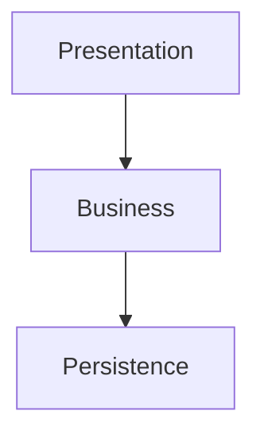
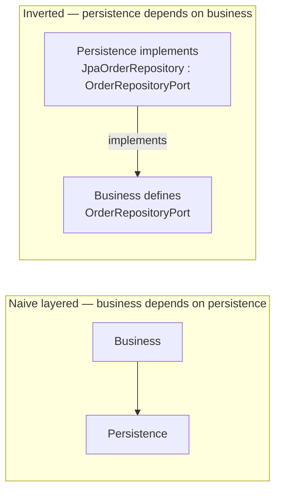
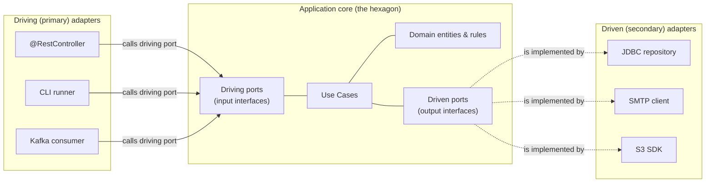
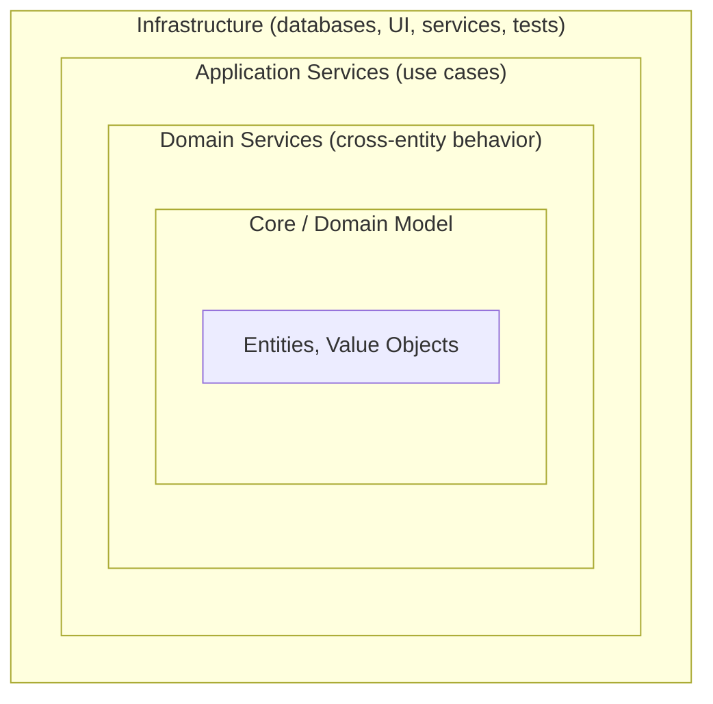
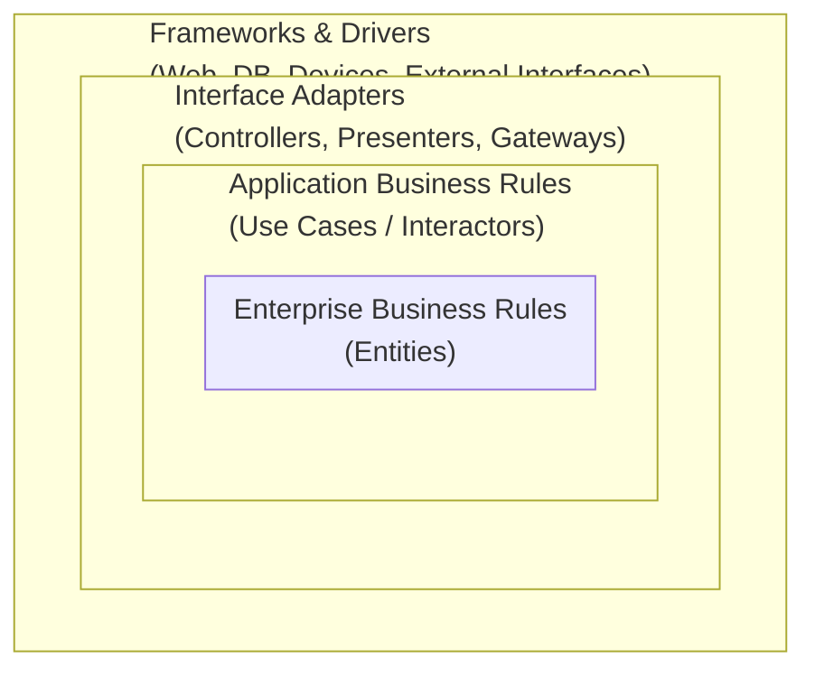
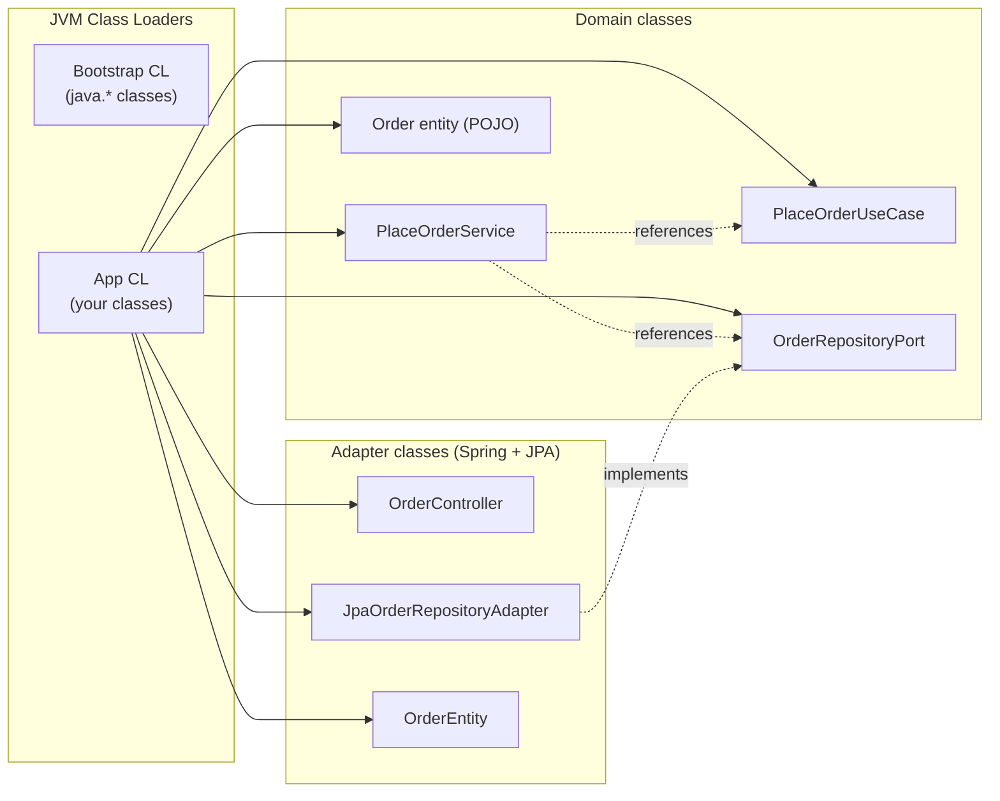

# Clean / Hexagonal / Onion Architecture

Hexagonal, Onion, and Clean Architecture are not three separate architectures. They are **three names for the same idea**, surfaced independently by three authors between 2005 and 2012, all responding to the same observed problem with layered architecture: **persistence and framework decisions leak upward into the business code**. In a standard Spring layered service, the business layer is supposed to be the "pure" middle, but in practice it imports JPA annotations, throws Spring exceptions, takes `Pageable` parameters, and returns `Optional<T>`. Open any large Spring codebase and you will find `@Transactional` decorating use-case methods and `EntityManager` injected into services. The "business" layer is not business code; it is *Spring code about a business*.

The hexagonal/clean/onion family takes one corrective step: **invert the dependency between the domain and everything else**. The domain — entities, value objects, and use cases — is in the center, written in plain Java with no annotations, no framework references, no SQL, no HTTP. *Everything else* — the database, the web server, the message broker, the email service, the third-party API — sits around the domain and *depends on the domain*, never the other way around. The domain defines what it needs as **ports** (interfaces); the surrounding layer provides **adapters** (implementations) that plug into the ports. This is the **Dependency Inversion Principle** ([SOLID-D, Robert Martin, 1996](https://en.wikipedia.org/wiki/Dependency_inversion_principle)) elevated from a class-level rule to an architectural rule.

The depth bar here is **what this buys, what it costs, and how it physically works in Java** — not the philosophy. We trace exactly which classes get an interface and which do not, which packages depend on which (and how ArchUnit enforces it), where Spring's `@Configuration` does the wiring without contaminating the domain, how the test suite shrinks from "Spring Boot test in 8 seconds" to "JUnit-only unit test in 30 ms", and what production failures the inversion prevents. We compare hexagonal-as-built across Java (Spring, Quarkus), C# (.NET), Go (Domain-driven-Hexagonal), and Rust (the `axum` + `sqlx` "core crate" pattern) so you can see that the family transcends Java. By the end you will design the dependency-inverted shape, explain to a teammate why the `OrderRepository` interface lives next to `Order` instead of next to its JDBC implementation, and reach for hexagonal *only when* the cost — interfaces and indirection that ~30% of services do not need — is justified by the durability of the domain.

> [!NOTE]
> Prerequisites: [Layered Architecture](./T01-layered-architecture.md) (`L5/C01/T01`) — the dependency rule, what each layer owns, ArchUnit enforcement. This topic is the *specialization* of layered architecture; you cannot make sense of it without that floor.

## Where These Architectures Came From — Three Convergent Discoveries

Hexagonal, Onion, and Clean Architecture are remarkable because **three different authors discovered essentially the same idea independently within seven years**. That kind of convergence is rare and revealing: it usually means the idea is *forced* by some underlying pressure that all three authors were responding to. The pressure, in this case, was the **framework-coupling problem** of the early 2000s Java enterprise stack — a specific industry trauma that produced an architectural antibody.

### The Industry Context: Why Hexagonal Had To Be Invented (1998–2005)

The late 1990s and early 2000s were the **EJB era** in enterprise Java. Sun's J2EE 1.2 (1999) made Enterprise JavaBeans the *required* programming model for "serious" Java server code. The model:

- Every business object extended `EntityBean` (or `SessionBean`).
- Every method went through the EJB container's interception stack.
- Persistence was managed by Container-Managed Persistence (CMP).
- Transactions, security, and remoting were declared in XML deployment descriptors.

The promise: **declarative everything**. The reality: the business code became *inextricable from the EJB container*. You could not:

- Unit-test a business method without spinning up an EJB container.
- Refactor a business object without re-running the deployment ceremony.
- Switch from WebLogic to WebSphere without partial rewriting.
- Update the EJB version (1.0 → 1.1 → 2.0) without code changes.
- Run business logic outside the application server (e.g., in a batch job, a command-line tool, or a unit test).

Anyone who worked through the EJB era remembers the *physical experience* of writing business code: you wrote 5 classes per bean (remote interface, home interface, bean class, primary key, deployment descriptor), every method invocation involved an RMI marshalling step, and the cycle-time from "edit a method" to "see the result" was measured in *minutes* because you had to redeploy the EAR.

**Alistair Cockburn, working on enterprise systems in this era, encountered this pain directly**. His 2005 essay [*Hexagonal Architecture*](https://alistair.cockburn.us/hexagonal-architecture/) — originally posted on his wiki, later widely cited — opens with the explicit motivation:

> "Allow an application to equally be driven by users, programs, automated test or batch scripts, and to be developed and tested in isolation from its eventual run-time devices and databases."

The whole point was *to be testable and runnable without the EJB container*. The hexagonal shape — domain in the center, adapters on each face — was Cockburn's answer to "how do I write business code that *doesn't* depend on what's calling it or what's storing its data?"

The same pressure motivated Rod Johnson's Spring Framework (2003): POJO-based programming as a *rejection* of EJB. Cockburn's hexagonal was the *architectural articulation* of what Spring was trying to enable at the framework level. The two are siblings of the same 2002–2005 anti-EJB rebellion.

### Why Onion (Jeffrey Palermo, 2008)

By 2008, the EJB problem had faded (EJB 3.0 in 2006 finally adopted POJOs; Spring had won most of the Java enterprise market), but a **different pressure had emerged**: the rise of ORM (Hibernate, Entity Framework). ORM frameworks made it *very easy* to put persistence concerns directly into the domain — Hibernate's `@Entity` annotation, JPA's lazy-loading proxies, the LINQ-to-Entities queries in .NET — all subtly required the domain to "know about" persistence.

**Jeffrey Palermo's [The Onion Architecture](https://jeffreypalermo.com/2008/07/the-onion-architecture-part-1/) (July 2008)** was a *.NET-community* response to this. Palermo was a Microsoft MVP working primarily on ASP.NET; his framing — "the domain model is at the core, surrounded by domain services, surrounded by application services, surrounded by infrastructure" — was Cockburn's hexagonal idea translated into the language and concerns of the 2008 .NET community. Critically, Palermo wrote the post in *direct response* to the prevailing .NET pattern of "Repository depends on DbContext, Service depends on Repository, Controller depends on Service" — the same pattern Java's Spring services were using. He argued, persuasively, that the dependency arrows should *point inward*, with infrastructure depending on a domain interface, not the other way around.

Palermo's contribution was *making the dependency-inversion argument legible to a non-architect-community*. Cockburn's hexagonal was respected but dense; Palermo's onion diagram was *immediately understandable* and got reposted across .NET blogs. Within two years, "onion architecture" was the dominant .NET architectural vocabulary, and the term migrated back into Java communities.

### Why Clean (Robert C. Martin / "Uncle Bob", 2012)

By 2012, the **mobile and SaaS era** had begun. Applications increasingly had to support *multiple front-ends* (web, iOS, Android, public API, partner integrations) over the same business logic. The pressure: **frameworks were shorter-lived than business code**. A 2009 Rails application was already legacy in 2012; a 2010 Backbone.js codebase was a migration target; iOS frameworks turned over annually.

**Robert C. Martin's [The Clean Architecture](https://blog.cleancoder.com/uncle-bob/2012/08/13/the-clean-architecture.html) (August 13, 2012)** was the synthesis. Martin had spent the preceding decade publishing the SOLID principles (the Dependency Inversion Principle was his); the *architectural* application of DIP was the natural follow-up. His framing — *Frameworks are details*; *the database is a detail*; *the UI is a detail* — was the strongest possible statement of "your domain code should outlive everything else."

Martin's *Clean Architecture* book (2017) consolidated the position with extensive examples. His specific contribution beyond Cockburn and Palermo was the **four-ring naming** (Entities, Use Cases, Interface Adapters, Frameworks & Drivers) and the explicit articulation of **The Dependency Rule** as the single architectural law.

The three names converged because **they were all answering the same evolving pressure**: frameworks turn over faster than business code, and tight coupling between the two makes evolution impossible.

### Who Alistair Cockburn Is

Cockburn (born 1953) is one of the **17 original signatories of the Agile Manifesto (2001)**. His prior work includes the Crystal family of methodologies and *Writing Effective Use Cases* (2000). He is not a Java-specific architect; his hexagonal essay was language-agnostic from the start, which is why it translates so well to Spring, ASP.NET Core, Go, and Rust. His career has been about *what makes software organizations effective*, with hexagonal architecture being a specific tool inside a broader argument about feedback loops and team capability.

### Who Jeffrey Palermo Is

Palermo (born ~1977) was a Microsoft Regional Director and co-author of *ASP.NET MVC in Action*. His onion-architecture posts (2008) and the subsequent book *.NET Application Architecture* established him as the .NET community's architectural voice in the late 2000s. He runs Clear Measure, a Texas-based consultancy.

### Who Robert C. Martin Is

Martin (born 1952) is the author of *Clean Code* (2008), *Clean Architecture* (2017), the SOLID principles formulation, and a co-author of the Agile Manifesto. His Clean Architecture is the most-cited of the three names in interview prep books because of his prolific writing and speaking; in actual engineering practice, the terms are largely interchangeable.

## Why These Architectures, Specifically: The Senior Engineer's Q&A

### Q1: What does hexagonal solve that layered doesn't?

Layered architecture says **business calls persistence**. The business layer holds a *reference* to the persistence layer's type — `OrderRepository` is imported and called by `OrderService`. As long as the persistence layer is small and stable, this works. But **the business layer's stability becomes a function of the persistence layer's stability**.

Hexagonal solves this by *inverting* the reference. The business layer defines `OrderRepositoryPort` (an interface in the domain package). The persistence layer *implements* that interface. The business's import is from *within* the domain; the persistence adapter's import is *toward* the domain. **The arrow has flipped, and the business layer is now stable regardless of what happens to persistence.**

The mechanical consequence: you can compile and unit-test the business layer with the persistence layer not even on the classpath. You can substitute the persistence layer for an in-memory map in tests, run 5,000 unit tests in 30 seconds (vs 8 minutes with a `@SpringBootTest`), and have a domain that survives a Hibernate-to-jOOQ migration unchanged.

### Q2: Who actually does this in production?

Several public examples:

- **Netflix** has documented hexagonal-style domain models in its recommendation, playback, and search engines, citing the survival of multiple persistence migrations (Cassandra → EVCache → DynamoDB) without domain-code changes.
- **Mercado Libre** (largest Latin American e-commerce) publicly documents hexagonal adoption across its Java/Spring stack, with the driver being EJB → Spring migration.
- **Spotify**'s backend Java services adopted hexagonal-style domain isolation in their late-2010s "Squad" engineering culture, partially to support multiple front-ends from the same backend.
- **Spring's own framework documentation since 6.x** mentions ports-and-adapters approvingly, and **Spring Modulith** (2023+) is an opinionated tool for modular monolithic hexagonal applications.

Adoption surveys (2024 Java Champions, JetBrains ecosystem reports) put hexagonal/clean adoption at ~38–45% of new Java backend projects, up from ~12% in 2018.

### Q3: What's the actual cost?

The honest cost accounting:

- **2–3× the file count** per feature compared to anemic-layered (interface + impl + tests for each instead of just impl).
- **Indirection through interfaces** — every dependency is interface-typed, requires Cmd-click through to find the implementation. IDE navigation cost is real.
- **Wiring ceremony** — Spring's `@Configuration` class has to declare beans for the use case implementations. ~5–10 lines per use case.
- **Onboarding curve** — new engineers raised on layered Spring see the inversion and ask "why?" until they internalize it.

Quantitatively: a hexagonal Spring Boot service is ~30% more code by line count than the same service in pure layered style. The break-even point — where the testability gains outweigh the file-count overhead — is typically around 20 use cases in the same service.

### Q4: When is this the wrong choice?

Three concrete regimes where hexagonal is overkill:

1. **CRUD admin tools** — a service whose every endpoint is `findById/save/delete` has no domain to protect. Spring Data REST with `@RepositoryRestResource` exposes the repository directly; that's the right answer.
2. **Throwaway code** — spikes, migration scripts, one-off integrations don't earn the discipline.
3. **Teams without senior leadership** — hexagonal demands consistent enforcement, ArchUnit rules, and someone reviewing PRs against the rules. A junior-only team will produce "hexagonal in name only" — package structure with all the boilerplate and none of the rule-following.

### Q5: How does this compare to alternatives that came after?

Two notable challengers:

#### vs. Vertical Slice Architecture (Jimmy Bogard, 2018)

Bogard's [Vertical Slice Architecture](https://www.jimmybogard.com/vertical-slice-architecture/) (.NET-rooted but applicable to Java) rejected the "horizontal layering" lineage entirely. Instead of organizing code by *kind* (all controllers in one place, all services in another), VSA organizes by *use case*: a `PlaceOrder` folder contains its controller, its service logic, its data access, all together.

The argument: **most changes touch one use case, not all controllers across all use cases**. Organizing by use case means a change is localized to one folder. The downside: cross-use-case patterns (rate limiting, audit logging) become harder to apply consistently.

VSA and hexagonal can coexist — VSA inside the application layer, with hexagonal port interfaces still defining the boundaries — but the two emphasize different organizational principles. The senior judgment: VSA for application-heavy services with many use cases that share little infrastructure; hexagonal for services with deep domain logic that needs framework independence.

#### vs. Modular Monolith (Spring Modulith, 2023)

Spring Modulith is *not* an alternative to hexagonal but a *companion*: it provides module-level enforcement (which packages can import which) on top of hexagonal's class-level enforcement. The 2024+ trend is to use both: each module is hexagonal internally, and Spring Modulith enforces the cross-module API surface.

## The Mechanism In Depth — What "Dependency Inversion" Actually Does To Bytecode

The phrase "dependency inversion" is abstract. The concrete bytecode-level mechanism:

### Class Loading And The Domain's Independence

When the JVM class-loads `PlaceOrderService`, it discovers the class's dependencies by reading the constant pool — the interned references to other classes the bytecode names. For a hexagonal domain service, these are:

- `Order`, `OrderId`, `Money` (domain types — local)
- `OrderRepositoryPort`, `PaymentGatewayPort` (interfaces — local)
- `java.util.Optional`, `java.time.Instant` (JDK)

**Notably absent**: `org.springframework.*`, `jakarta.persistence.*`, `com.stripe.*`. The class-loader does not even *look* for those classes when loading `PlaceOrderService`, because the constant pool doesn't reference them. **The domain package can be put on a separate JVM classpath with only the JDK and itself, and it loads cleanly.**

This is the *runtime* expression of the architectural rule. The build-time expression is `jdeps`:

```bash
jdeps --recursive --regex 'org\.springframework.*' build/libs/my-domain.jar
# Should produce: no matches
```

A hexagonal-correct domain JAR has zero matches for Spring, JPA, or vendor SDK imports. This is the literal definition of "the domain doesn't depend on the framework."

### Method Dispatch Through The Port

When `PlaceOrderService` calls `orderRepository.save(order)`, the JVM performs an **interface method invocation** (the `invokeinterface` bytecode). This is mechanically more expensive than a direct virtual call (`invokevirtual`):

- `invokevirtual` uses a fixed v-table offset: ~1 cycle for the dispatch.
- `invokeinterface` walks the interface method table (itable) to find the implementation: ~3–4 cycles for the dispatch.

**For most code, this difference is invisible** — 3 cycles vs 1 cycle on operations that take thousands of cycles overall (database calls, network calls, JSON serialization) is noise. The C2 JIT compiler installs an **inline cache** that speculates on the receiver's class; if the receiver is *always* `JpaOrderRepositoryAdapter` (which it is, in a production deployment with one implementation), the dispatch is optimized down to a single virtual call after warmup.

The bytecode-level honest answer: **dependency inversion costs roughly nothing in performance after JIT warmup**, on the order of nanoseconds per request, against a backdrop of milliseconds spent in the database. Engineers who argue against hexagonal on "interface dispatch is slow" grounds are not measuring real workloads.

### Spring's `@Configuration` Wiring At Startup

At Spring context startup, the `@Configuration` class's `@Bean` methods are invoked. The `@Bean PlaceOrderUseCase placeOrderService(OrderRepositoryPort r, PaymentGatewayPort p)` is invoked with dependencies resolved from the context — Spring finds *the bean implementing `OrderRepositoryPort`*, which is the `@Component`-annotated `JpaOrderRepositoryAdapter`.

**The crucial mechanic**: Spring autowires by *type* (the interface), not by *name*. The domain layer has no reference to the adapter class; the wiring happens at the seam, in the `@Configuration` class, which is the *only* place that knows both worlds. This `@Configuration` class is the **architecture's load-bearing wall**: if it's well-organized, the domain stays clean; if it sprawls across the codebase, the discipline rots.

### Why This Beats Annotating The Domain With `@Component`

The naive alternative: just annotate `PlaceOrderService` with `@Component` and let Spring discover it. This *works* — but it imports `org.springframework.stereotype.Component` into the domain class, breaking the framework independence. The hexagonal discipline rejects this for the same reason: **the domain class must not name `org.springframework.*` in its source code**, even if functionally equivalent.

This is *not* a religious distinction. The pragmatic consequence: a Spring annotation on the domain means a Spring upgrade breaks the domain code. In 2018, Spring deprecated `@Repository`'s exception translation behavior; in 2022, JPA's `javax.persistence` package became `jakarta.persistence`. Each transition required code changes everywhere the deprecated annotations appeared. A truly framework-independent domain skipped both migrations.

## Common Misconceptions Explained

### "Hexagonal architecture means six adapters."

False. The hexagon was an *illustration*, not a literal six-sided constraint. The number of adapters depends on how many external systems the application talks to. Cockburn's original drawing was hexagonal because six sides made the diagram balanced; real systems have 2 (rare) to 20+ (common in enterprise) adapters.

### "Ports are just interfaces."

Partially true, but misses the point. A port is an interface *defined by the domain to express its needs*. The defining feature is *who declares it*: the domain. An interface declared in the adapter package is *not* a port; it's an internal adapter abstraction.

### "Hexagonal requires Spring."

False. Hexagonal is language-agnostic. The Spring examples are illustrative because Spring is the dominant Java framework, but the same pattern works in pure Java (`ServiceLoader` for DI), in Go (interfaces wired in `main`), in Rust (traits implemented in adapter crates), in Python (`Protocol`s wired in a DI container).

### "Hexagonal is just Clean Architecture."

True in essence; false in nuance. As covered above, the three names converged on the same idea but emphasize slightly different aspects: hexagonal emphasizes *ports and adapters*; onion emphasizes *concentric purity*; clean emphasizes *the Dependency Rule*. In practice the resulting code is nearly identical.

### "Hexagonal requires DDD."

False. Hexagonal supplies *structure* (the inversion); DDD supplies *content* (what goes inside). You can have a hexagonal service whose domain is procedural data carriers (anemic) — it's still hexagonal, just not DDD. The two are commonly paired but independent. (See [T03](./T03-domain-driven-design-ddd.md) for the content side.)

### "The domain can't have ANY framework annotations."

Mostly true, with one practical exception: JSR-303 `@NotNull`/`@Size` Bean Validation annotations on value objects are sometimes allowed because they're a Java standard (not Spring-specific) and they make domain invariants enforceable at construction. Strict hexagonal purists ban these too; pragmatic teams accept them. The senior judgment: the rule is about *coupling to framework lifecycle*, and Bean Validation annotations don't create lifecycle coupling.

## The Problem Layered Architecture Doesn't Solve

Re-read the layered diagram from [T01](./T01-layered-architecture.md):



The dependency rule says Business calls Persistence, never the reverse. Good. But look at the *imports* in a typical `OrderService.java`:

```java
package com.shop.service;

import com.shop.repository.OrderRepository;       // a class from Persistence
import com.shop.repository.jpa.OrderEntity;        // a JPA-tied type, leaks
import org.springframework.stereotype.Service;     // Spring framework
import org.springframework.transaction.annotation.Transactional;
import jakarta.persistence.EntityManager;          // JPA — leaks

@Service
public class OrderService {
  private final OrderRepository repo;
  @Transactional
  public Order place(CreateOrderCmd cmd) {
    OrderEntity entity = ...;
    return repo.save(entity);                       // entity escapes the persistence layer
  }
}
```

The business layer *imports* `OrderRepository`, a class from the persistence layer. That looks fine — dependencies are pointing downward, the rule is satisfied. But:

1. **The business layer is welded to JPA.** `OrderEntity` (a JPA `@Entity`) appears in service code. Swap PostgreSQL for DynamoDB and the service rewrites.
2. **The business layer is welded to Spring.** `@Service` and `@Transactional` are Spring annotations. Unit-test this class without Spring? You can — barely — by `new OrderService(...)`, but `@Transactional` is now a lie. The behavior under test diverges from production.
3. **The persistence layer dictates the shape of the business code.** `OrderRepository.save(OrderEntity)` is a JPA-shaped method. The business layer's vocabulary becomes the *persistence layer's vocabulary*, not the domain's.

The error is subtle: layered architecture has the *direction* right but the *strength* wrong. The middle layer should not just be downstream of persistence — it should be *independent* of it. **Persistence should be a detail of the business code, not a parent.** That is the inversion.

## Dependency Inversion at the Architectural Level

The Dependency Inversion Principle (DIP) at the class level says: "depend on abstractions, not concretions." At the architectural level, it says **the domain code defines an interface (a "port"), and the persistence/UI/integration code implements that interface (an "adapter")**. The arrows reverse:



Look closely. In the inverted picture, the arrow from Persistence to Business points *up*. That looks like a violation of layered's rule! It's not, because **the persistence layer is no longer "below" the business layer** in the inverted model. It is **outside**. The new dependency direction is **inward**, toward the domain, regardless of whether the dependency is from UI or persistence or integration.

This is the **Dependency Rule** in Clean Architecture's words: *source code dependencies must point only inward, toward higher-level policies*. Higher-level policy is the domain. UI is detail. Database is detail. The framework is detail. Outside-in is the wrong way; inside-out is the wrong way; **only outside-toward-center is allowed.**

## The Three Names — Why They All Mean The Same Thing

The hexagonal/onion/clean trio was authored in succession, each subsuming the prior:

### Hexagonal (Ports and Adapters) — Alistair Cockburn, 2005

[Cockburn's original paper](https://alistair.cockburn.us/hexagonal-architecture/) draws the system as a **hexagon** with the application in the center and *adapters* on each face, communicating through *ports* (interfaces). The shape is hexagonal only for aesthetic reasons — "six sides" was symbolic ("there's a port for that") and not literal; in practice systems have any number of ports. The vocabulary:

- **Port** — an interface, defined by the domain, expressing "I need this capability" (driven port) or "you can call me this way" (driving port).
- **Adapter** — an implementation of a port, written in framework-specific code.
- **Driving (primary) adapter** — calls *into* the application: a `@RestController`, a CLI, a Kafka consumer, a scheduled job.
- **Driven (secondary) adapter** — is *called by* the application: a JDBC repository, an SMTP client, an S3 SDK wrapper.



Notice the dashed arrow from "driven port" to "JDBC repository": the *implementation* points at the port the application defined. The application is dependency-free; the surrounding code chases it.

### Onion — Jeffrey Palermo, 2008

[Palermo's Onion Architecture](https://jeffreypalermo.com/2008/07/the-onion-architecture-part-1/) draws **concentric circles**:



The rule: **outer rings depend on inner rings; inner rings know nothing of outer rings**. The exact ring decomposition (3, 4, 5 rings) is decorative; the *rule* is identical to hexagonal's.

### Clean — Robert C. Martin (Uncle Bob), 2012

[The Clean Architecture](https://blog.cleancoder.com/uncle-bob/2012/08/13/the-clean-architecture.html) drew the same picture, named the four canonical rings, and articulated the rule explicitly as **The Dependency Rule**:



**Entities** capture rules that are true regardless of application (a `Money` value object). **Use Cases** capture rules specific to *this* application's policies (placing an order). **Interface Adapters** translate between use cases and the outside world (controllers, gateways). **Frameworks & Drivers** is everything off-the-shelf you depend on.

### What's Different — Almost Nothing

| | Hexagonal (Cockburn) | Onion (Palermo) | Clean (Martin) |
|---|---|---|---|
| Origin | 2005 | 2008 | 2012 |
| Shape | hexagon with ports on each face | concentric circles | concentric circles + named rings |
| Central concept | ports + adapters | core/domain model | entities + use cases |
| Vocabulary | port, adapter, primary, secondary | core, domain services, application, infrastructure | entities, use cases, interface adapters, frameworks |
| Dependency direction | inward to the hexagon | inward toward core | inward across the boundary |
| Ports as interfaces | explicit & central | implicit (rings define what they expose) | explicit (use case input/output ports) |

They share **the same architectural rule** and produce **almost the same code**. Internal arguments about which name to use are a senior-engineer hobby; the value is in the shared rule. In this book we'll use **hexagonal vocabulary** (ports/adapters) because it is the most concrete and reduces the words you have to remember.

## How the Code Looks in Spring — The Idiomatic Shape

Here is the same `Order` placement use case in idiomatic hexagonal Spring Boot. Three packages, three concerns.

```text
com.shop.orders
├── domain/                          ← the hexagon's interior — NO Spring imports
│   ├── model/
│   │   ├── Order.java               (entity — pure java; @Entity moved out)
│   │   ├── OrderId.java             (value object, record)
│   │   ├── Money.java               (value object)
│   │   └── OrderStatus.java         (enum)
│   ├── port/
│   │   ├── in/                      ← driving / primary ports
│   │   │   └── PlaceOrderUseCase.java   (interface — the input port)
│   │   └── out/                     ← driven / secondary ports
│   │       ├── OrderRepositoryPort.java (interface — the output port)
│   │       ├── PaymentGatewayPort.java  (interface)
│   │       └── EmailGatewayPort.java    (interface)
│   └── service/
│       └── PlaceOrderService.java   (implements PlaceOrderUseCase — pure java)
│
├── adapter/                         ← the surrounding code — Spring lives here
│   ├── in/
│   │   ├── web/
│   │   │   └── OrderController.java         (@RestController, calls PlaceOrderUseCase)
│   │   └── messaging/
│   │       └── OrderKafkaConsumer.java      (@KafkaListener)
│   └── out/
│       ├── persistence/
│       │   ├── OrderEntity.java             (@Entity — JPA mapping)
│       │   ├── OrderJpaRepository.java      (Spring Data interface)
│       │   └── JpaOrderRepositoryAdapter.java  (implements OrderRepositoryPort)
│       ├── payment/
│       │   └── StripePaymentAdapter.java    (implements PaymentGatewayPort)
│       └── email/
│           └── SmtpEmailAdapter.java        (implements EmailGatewayPort)
│
└── config/
    └── BeansConfig.java             (@Configuration — wires adapters to ports)
```

The key file is the domain service — a class with **zero imports from outside `com.shop.orders.domain`**:

```java
package com.shop.orders.domain.service;

import com.shop.orders.domain.model.*;
import com.shop.orders.domain.port.in.PlaceOrderUseCase;
import com.shop.orders.domain.port.out.OrderRepositoryPort;
import com.shop.orders.domain.port.out.PaymentGatewayPort;
import com.shop.orders.domain.port.out.EmailGatewayPort;

public class PlaceOrderService implements PlaceOrderUseCase {
  private final OrderRepositoryPort orderRepo;
  private final PaymentGatewayPort  payments;
  private final EmailGatewayPort    emails;

  public PlaceOrderService(OrderRepositoryPort orderRepo,
                           PaymentGatewayPort payments,
                           EmailGatewayPort emails) {
    this.orderRepo = orderRepo;
    this.payments  = payments;
    this.emails    = emails;
  }

  @Override
  public OrderId place(PlaceOrderCommand cmd) {
    Order order = Order.placeNew(cmd.customerId(), cmd.lines(), cmd.shippingAddress());
    PaymentResult result = payments.charge(order.total(), cmd.paymentMethod());
    order.markPaid(result.transactionId());
    orderRepo.save(order);
    emails.sendOrderConfirmation(order);
    return order.id();
  }
}
```

Count the imports: every line is from `com.shop.orders.domain.*`. No Spring, no JPA, no Stripe SDK. This class compiles with the entire Spring framework deleted. Unit-testing it requires only JUnit and Mockito (or hand-written fakes). And **it expresses the use case in domain words** — place, charge, mark paid, save, confirm — not "save entity," "execute query," "POST to API."

The wiring lives in a separate config class — the *only* place that knows both worlds:

```java
package com.shop.orders.config;

@Configuration
public class BeansConfig {
  @Bean
  PlaceOrderUseCase placeOrderService(OrderRepositoryPort r, PaymentGatewayPort p, EmailGatewayPort e) {
    return new PlaceOrderService(r, p, e);            // <-- the only place "new PlaceOrderService" appears
  }
  // OrderRepositoryPort, PaymentGatewayPort, EmailGatewayPort are auto-injected
  // because their adapters are @Component-annotated and Spring resolves the interface.
}
```

Two pieces of magic deserve attention:

1. **`PlaceOrderService` is not a `@Component`.** It's a plain Java class. Spring would normally see and register it, but here we declare it as a `@Bean` *manually* — the only Spring-aware code is the `@Configuration` class.
2. **`JpaOrderRepositoryAdapter` is a `@Component`** and implements `OrderRepositoryPort`. When Spring's autowiring looks for a bean of type `OrderRepositoryPort`, it finds the adapter, and the domain code is none the wiser.

This separation is mechanically enforceable with ArchUnit:

```java
@ArchTest
static final ArchRule domainIsFrameworkFree =
    noClasses().that().resideInAnyPackage("..domain..")
               .should().dependOnClassesThat().resideInAnyPackage(
                   "org.springframework..",
                   "jakarta.persistence..",
                   "com.stripe..");
```

A green build is the proof; the moment someone slips `@Transactional` into `PlaceOrderService`, the test fails.

### How `@Transactional` Survives Without Polluting The Domain

The natural objection: "Spring's `@Transactional` is the only practical way to start a JDBC transaction. If it can't live on the use case, where does it go?"

Three solid options:

1. **On the adapter's facade.** `JpaOrderRepositoryAdapter.save(Order)` is annotated `@Transactional`. The transaction starts and ends at the adapter boundary. Works for single-aggregate operations.
2. **On a thin transactional wrapper bean.** A `@Service @Transactional class TransactionalPlaceOrderService` *implements* `PlaceOrderUseCase` by delegating to the inner `PlaceOrderService`. The controller calls the wrapper; the wrapper starts the tx; the domain service runs inside.
3. **Programmatic transactions in the adapter.** `TransactionTemplate` (Spring) wraps the operation in code, eliminating the annotation.

The first is the cleanest for most services and what most hexagonal-Spring codebases choose. The point: **the domain's purity is preserved; the framework lives at the edge.**

## What This Buys — Five Concrete Payoffs

Hexagonal/clean/onion is more code than naive layered. The question is what it returns.

### 1. Pure-Java Unit Tests, Sub-Second

The `PlaceOrderService` test:

```java
class PlaceOrderServiceTest {
  OrderRepositoryPort repo  = new InMemoryOrderRepo();
  PaymentGatewayPort  pays  = (amt, m) -> new PaymentResult("txn-1");
  EmailGatewayPort    mail  = order -> { /* no-op */ };
  PlaceOrderService   svc   = new PlaceOrderService(repo, pays, mail);

  @Test void placesAnOrderAndChargesAndSaves() {
    OrderId id = svc.place(new PlaceOrderCommand(new CustomerId(1), lines, addr, mthd));
    Order saved = repo.findById(id).orElseThrow();
    assertEquals(OrderStatus.PAID, saved.status());
    assertEquals("txn-1", saved.transactionId());
  }
}
```

No `@SpringBootTest`. No `@MockBean`. No application context. **Sub-30 ms test execution**, where the Spring-Boot version would take **8–15 seconds** to start the context. A team running 5,000 such tests goes from a 60-minute build to a 3-minute build — and tests that take 3 minutes get run on every commit.

### 2. Plug-and-Play Adapters

Want to switch the persistence backend from PostgreSQL to DynamoDB? Write a `DynamoOrderRepositoryAdapter implements OrderRepositoryPort`, swap the `@Component` registration, ship. The domain code does not change a single line. The presentation does not change. The integration with payment and email does not change.

This is rarely tested by *actually* switching databases (most services never do). It is tested constantly by **replacing the adapter with a fake in tests**, by **adding a second adapter** for a new backend (a search index alongside the primary store), and by **wrapping an adapter with cross-cutting behavior** (a caching decorator, a metrics decorator).

### 3. The Domain Is The Spec

When the domain has no framework imports, the public interfaces of the domain *are* the executable specification of what the system does. A new engineer reads `com.shop.orders.domain.port.in.PlaceOrderUseCase` and the `Order` entity, and learns what an order is — without learning Spring first. This shrinks onboarding for the part of the codebase that matters most.

### 4. Framework Migration Is Survivable

In 2017 Spring announced WebFlux. Teams that had laid `@Transactional` and `EntityManager` all through their service layer wrote migration plans that ran 18 months. Teams whose domain was framework-free were able to deploy WebFlux *adapters* alongside the existing MVC adapters and migrate endpoint-by-endpoint, the domain untouched. Same dynamic for the JPA → R2DBC transition, the EJB → Spring transition (the original case Cockburn cited in 2005), and the Servlets → Reactive transition.

### 5. Cross-Boundary Reasoning Becomes Mechanical

In an inverted architecture, the entire surface area between domain and adapter is the *port interfaces*. An adapter can do anything *under* the interface — change a SQL query, swap a serialization library, add caching — without touching the domain. A domain change requires updating the port interface, which the compiler then flags in every adapter. The change graph is *visible*; in layered-with-leaks, it is hidden.

## What This Costs — And When It Doesn't Pay

Hexagonal architecture is not free. The costs are:

### 1. Two-to-Three Times The Files Per Feature

Where layered has `OrderController`, `OrderService`, `OrderRepository`, hexagonal has `PlaceOrderUseCase` (port), `PlaceOrderService` (impl), `OrderRepositoryPort` (port), `JpaOrderRepositoryAdapter` (impl), plus the JPA entity, plus the controller (now a "primary adapter"). For one use case in a small service, this is *significant ceremony*. For 100 use cases in a system that will live a decade, it is *trivial overhead per feature*.

### 2. Interface Explosion

Every collaborator becomes an interface. Most have one implementation. The IDE jump from "use" to "definition" goes through the interface — one extra click. Some teams find this insufferable; others find it negligible. The trade-off is real; the response is taste.

### 3. The Anaemic-Use-Case Risk

A use case that does one thing — `OrderRepository.findById(id)` — does not justify its own use case class. The honest answer is: **simple reads should skip the use case and go straight from the controller to the repository port** (relaxed layering, as in [T01](./T01-layered-architecture.md)). Hexagonal does not insist on a use case for every endpoint; it insists on a use case for every *business operation*.

### 4. The "Mapping Mountain"

A purist hexagonal codebase has **separate types per ring**: the HTTP DTO, the use-case command, the domain entity, the JPA entity, the integration request. Five mappings per round-trip. In services where 80% of code is plumbing for CRUD, this becomes a tax — and the temptation to flatten (e.g., use the JPA entity as the domain entity) is constant. The fix is judgment: keep separate types where the shapes diverge meaningfully; merge where they don't. The risk is the slippery slope back to layered-with-leaks.

### When Hexagonal Doesn't Pay

- **CRUD admin tools.** A service whose every endpoint reads or writes one table benefits little from the inversion. Spring Data REST exposing a `@Repository` directly is a single-layer architecture and is *correct for the problem*.
- **Throwaway code.** A spike, a one-off migration script, a prototype. The discipline burns time you don't have.
- **Teams without a shared model.** Hexagonal works when the domain has identifiable invariants worth protecting. In a project where the model itself is in flux, you spend the discipline on a domain that hasn't earned it yet.

## Cross-Language Hexagonal — The Pattern Survives Translation

The "ports and adapters" idea is independent of Java. Briefly, how it looks in four other ecosystems:

| Language / Framework | Domain layer convention | Port mechanism | Adapter mechanism |
|----------------------|------------------------|----------------|--------------------|
| **Java / Spring Boot** | `domain/` package, no Spring imports | Java interface in `port/` | `@Component` class in `adapter/`, wired by `@Configuration` |
| **C# / ASP.NET Core** | "Core" project (separate `.csproj`) | C# interface in Core | Implementation in "Infrastructure" project; `IServiceCollection.AddScoped` wires |
| **Go (chi/echo + sqlx)** | `internal/domain/` package, stdlib-only | Go interface in domain | Struct in `internal/adapter/` implements it; `main.go` wires |
| **Rust (axum + sqlx)** | `core` crate, `no_std`-able where possible | Rust trait in core | Implementing type in adapter crate; `main.rs` builds the graph |
| **Python (FastAPI + SQLAlchemy)** | `domain/` package, no FastAPI/SQLAlchemy | abstract base class (`abc.ABC`) or `typing.Protocol` | concrete class in `adapter/`, wired in `main.py` or a DI container (`punq`, `dependency-injector`) |

Two observations:

1. **Java's `interface` is the natural port primitive**, but Go's interface and Rust's trait do the same job — and in fact they do it *better*, because Go and Rust resolve adapters at compile time, while Java's interface-implementation pairing is resolved at runtime through Spring. This is invisible until the wiring breaks, at which point the Spring "this bean was registered twice" error is a search problem; the Go/Rust compile error is local.
2. **Spring's `@Configuration`-based wiring scales** to dozens of ports and adapters per service. Languages without a DI framework (Go, Rust) tend to write all wiring in `main.go`/`main.rs` — which is verbose but extraordinarily *explicit*. A Spring developer reading a Go hexagonal service often comes away wishing they could see the wiring graph in one place.

The pattern transcends Java because the rule — invert the dependency between domain and infrastructure — is a universal observation about software. It's been written down independently in multiple languages because each ecosystem encountered the same maintenance problem.

## A Concrete Side-by-Side — Layered vs Hexagonal

Same use case, same Spring stack, two architectures.

| | **Layered (naive)** | **Hexagonal** |
|---|---|---|
| **Service signature** | `OrderEntity save(OrderEntity)` (JPA-shaped) | `OrderId place(PlaceOrderCommand)` (domain-shaped) |
| **Service imports** | `@Service`, JPA types, Spring `@Transactional` | only `domain.*` packages |
| **Database swap effort** | rewrite service to use new ORM | write new adapter, wire it |
| **Unit test of service** | needs `@SpringBootTest` or rich mocks | plain JUnit + Mockito |
| **Test runtime per case** | 5–15 s | 5–30 ms |
| **Files per use case** | 3 (controller, service, repository) | 5–7 (+ port interfaces) |
| **Onboarding** | "look at the service" | "look at the use case" |
| **Refactor blast radius** | renaming a column → service rewrites | renaming a column → only the adapter changes |
| **ArchUnit enforceable** | yes (dependency direction) | yes (and *which packages* may import frameworks) |

The diagonal of the table is the senior judgment call: when do the columns on the right win against the file-count and ceremony on the left? Five-or-fewer use cases per service: probably layered. Twenty-plus, with a non-trivial domain, framework changes ahead, a multi-year maintenance horizon: probably hexagonal.

## Under the Hood — How The Pure Domain Runs On The JVM

Hexagonal claims to give you a "pure" domain. At the JVM level, what does that mean?

### Bytecode and Classpath

The domain package contains only standard-library and project-local class references. When the JVM class-loader loads `PlaceOrderService`, it walks the dependencies (`Order`, `OrderRepositoryPort`, etc.) and finds them all on the project classpath; **no Spring, JPA, or Stripe classes are loaded by transitively chasing the domain**. This makes the domain a candidate for `--release N` minimum-Java compilation, ahead-of-time compilation (GraalVM native image — where reachability analysis benefits enormously from a small dependency surface), and module-system isolation under JPMS.



The dashed `implements` arrow is the inversion. The domain has no arrow to the adapter; the adapter has an arrow to the domain.

### Method Dispatch — The Cost of Interface Calls

A purist hexagonal class calls *every* collaborator through an interface (port). On the JVM, an interface method call is more expensive than a direct virtual call: it requires looking up the implementation through the interface method table (`itable`), which adds a handful of cycles per call — roughly **2–4 ns** with no inline cache, or ~0.5 ns when the JIT has installed a monomorphic inline cache (the common case when a port has one implementation).

For most services, this is invisible: a `place` call is 50 µs of business work; an extra 2 ns × 5 port calls = 10 ns is 0.02% of the budget. For ultra-high-throughput services in the tight inner loop, hexagonal's interface-heaviness becomes a measurable tax (1–5%), and the response is either (a) inlining via final classes, (b) accepting the cost, or (c) reaching for a different architectural style that doesn't suit the problem. The realistic answer is "almost never matters."

### Memory — A `PlaceOrderService` Instance

A `PlaceOrderService` is a small object: 16-byte object header + 3 reference fields × 4 bytes (compressed oops) = 28 bytes, padded to 32. One per Spring application context. Negligible.

The interesting allocation is **command objects**: `PlaceOrderCommand` is built on every request, lives on the call stack (sometimes scalar-replaced by escape analysis), and is garbage-collected within microseconds. Records ([L1/C01/T14](../../L1-core-java/C01-oop/T14-record-types.md)) keep these compact and free.

### The Spring Application Context

Spring's IoC container holds the wiring graph: one `Map<Class<?>, BeanDefinition>` and one `Map<String, Object>` of singletons. A service with 50 hexagonal beans (use cases, ports, adapters) adds ~50 entries — trivial memory compared to JPA's `EntityManagerFactory` (often 50–200 MB).

## Anti-Patterns When Hexagonal Is Applied Wrong

The architecture has its own characteristic failure modes.

### 1. The Pseudo-Domain

The team makes a `domain/` package, adopts the vocabulary, and then imports JPA into the entities anyway. The hexagon becomes decoration:

```java
package com.shop.orders.domain.model;
@Entity                                   // <-- BUG
@Table(name = "orders")
public class Order { ... }
```

The fix: either move the JPA entity to the adapter (`OrderEntity`) and let `Order` be a pure POJO that the adapter maps to/from, or admit you are doing layered-with-anemic-services and stop pretending otherwise.

### 2. Ports With One Implementation, One Caller, Forever

A `PaymentGatewayPort` interface that *only* `StripePaymentAdapter` implements and that *only* `PlaceOrderService` calls is just an extra file. The port pays for itself when (a) there are multiple implementations now or plausibly later, (b) the test uses a fake, or (c) the adapter has multiple dependencies the domain doesn't want to know about. For ports that meet none of these, **delete the interface and call the adapter directly** — at the cost of some testability, in exchange for less code. (Junior teams that read Uncle Bob and insist on interfaces everywhere produce codebases that 5 years later read like ceremony with no payoff.)

### 3. Anemic Domain With Hexagonal Skin

The domain has a `domain/` package, no Spring imports, and every entity is a `record OrderRecord(...)` with no methods. The "domain" is a data carrier; all logic lives in `PlaceOrderService`. This is hexagonal layered-architecture-with-anemic-models — and per [T01](./T01-layered-architecture.md#1-anemic-domain-model), the anemia problem is unchanged. Hexagonal is the *structure*; DDD ([T03](./T03-domain-driven-design-ddd.md)) is the *content* that fills it. Without rich entities, the inversion just moves the anemic logic to a more elegant address.

### 4. Application Service With Knowledge of HTTP

A `PlaceOrderUseCase` that takes an `HttpServletRequest` because "it was easier than re-parsing the body" has *re-leaked* the framework into the use case. Compile-time `domainIsFrameworkFree` test should catch this; it gets bypassed when reviewers nod the import through because "it's just one type."

### 5. Two Adapter Layers Knowing Each Other

The Stripe adapter calls the email adapter directly to send a receipt. Now the adapter ring has internal coupling, and a future change to one re-tests the other. The right call: use cases orchestrate adapters; adapters don't talk to each other. (When adapter A genuinely needs to react to adapter B, the domain emits a domain event and adapter A subscribes — see [T08 — Event Sourcing](./T08-event-sourcing.md) for the event mechanics.)

## Real-World Adoption Notes

- **Netflix** publishes [blog posts](https://netflixtechblog.com/) describing hexagonal-style domain models behind their playback and recommendation services. Their justification: a hex domain lets them swap persistence (Cassandra → EVCache → DynamoDB) without retraining engineers.
- **Mercado Libre** documents widespread hexagonal adoption in their Java/Spring stack ([engineering blog](https://medium.com/mercadolibre-tech)). The driver was migration from EJB to Spring: framework-free domain code survived two generations of framework migration.
- **The 2024 Java Champions survey** found ~38% of Java backend teams self-identify as "using hexagonal/clean architecture" — up from ~12% in 2018. The growth correlates with Spring Boot becoming the default and `@Service`-everywhere becoming the de facto layered standard, making hexagonal the marked option.
- **Spring's own documentation since 6.x** mentions "ports and adapters" approvingly, and the Spring Modulith project (2023+) is explicitly an opinionated tool for hexagonal modular monoliths in Spring Boot.

The growth curve is real; the pattern is moving from "advanced" to "default for new non-CRUD services."

## When Hexagonal Is Wrong — Honest List

We covered this in passing; here it is consolidated for ease of reference in interviews and reviews.

1. **CRUD admin tool over one table.** No domain. No invariants. Spring Data REST is the right answer.
2. **Throwaway / prototype.** Spend the discipline on what survives.
3. **Tiny team with a tight deadline.** The interface overhead is real time you do not have.
4. **No shared model.** The domain is changing weekly. Hexagonal locks in shapes that haven't earned the lock.
5. **Performance-critical hot loop.** The interface-call cost is normally invisible; in rare ultra-high-throughput inner loops it shows up. Profile first; don't make the call from architecture-bias.

For everything else — Java backends with non-trivial business logic and a multi-year horizon — hexagonal/clean/onion is the *quietly correct default* in 2026, with layered-with-discipline as the acceptable fallback.

> [!INTERVIEW]
> Two common L5 interview prompts: (1) "What's the difference between hexagonal, clean, and onion architecture?" — strong answer: same idea, three names, ports/adapters is the most concrete vocabulary. (2) "How do you keep Spring's `@Transactional` out of your domain?" — strong answer: annotate the adapter, or wrap with a `@Transactional` decorator at the boundary; the domain stays framework-free.

## Deeper Dive — Complete Hexagonal Architecture in Spring Boot

### Package Structure

```
src/main/java/com/example/orders/
│
├── domain/                       # Pure business logic - no Spring, no JPA
│   ├── Order.java                # Aggregate root
│   ├── OrderId.java
│   ├── OrderStatus.java
│   ├── OrderLine.java
│   ├── Money.java
│   ├── CustomerId.java
│   ├── ProductId.java
│   ├── DomainEvent.java
│   ├── OrderPlacedEvent.java
│   │
│   └── ports/                    # Interfaces (ports)
│       ├── in/                   # Input ports (use cases)
│       │   ├── PlaceOrderUseCase.java
│       │   ├── CancelOrderUseCase.java
│       │   └── GetOrderUseCase.java
│       │
│       └── out/                  # Output ports (dependencies)
│           ├── OrderRepositoryPort.java
│           ├── EventPublisherPort.java
│           ├── ProductCatalogPort.java
│           └── PaymentGatewayPort.java
│
├── application/                  # Use case implementations
│   ├── PlaceOrderService.java
│   ├── CancelOrderService.java
│   └── GetOrderService.java
│
├── adapters/                     # Adapter implementations
│   ├── in/
│   │   ├── web/
│   │   │   ├── OrderController.java
│   │   │   ├── PlaceOrderRequest.java
│   │   │   └── OrderResponse.java
│   │   │
│   │   └── messaging/
│   │       └── OrderEventListener.java
│   │
│   └── out/
│       ├── persistence/
│       │   ├── OrderJpaRepository.java
│       │   ├── OrderEntity.java
│       │   ├── OrderEntityMapper.java
│       │   └── OrderRepositoryAdapter.java
│       │
│       ├── messaging/
│       │   └── KafkaEventPublisherAdapter.java
│       │
│       ├── external/
│       │   ├── ProductCatalogClient.java
│       │   └── StripePaymentGatewayAdapter.java
│       │
│       └── inmemory/                  # For testing
│           └── InMemoryOrderRepository.java
│
└── config/
    ├── HexagonalConfig.java      # Wiring
    └── PersistenceConfig.java
```

### Pure Domain (No Spring)

```java
package com.example.orders.domain;

// Pure Java - no annotations, no framework
public class Order {
    private final OrderId id;
    private final CustomerId customerId;
    private OrderStatus status;
    private List<OrderLine> lines;
    private Money total;
    private final Instant createdAt;
    private final List<DomainEvent> events = new ArrayList<>();
    
    // Factory method
    public static Order place(
            CustomerId customerId,
            List<OrderLine> lines
    ) {
        if (lines.isEmpty()) {
            throw new DomainException("Order must have items");
        }
        
        Order order = new Order(
            OrderId.newId(),
            customerId,
            OrderStatus.PLACED,
            lines,
            Instant.now()
        );
        order.events.add(new OrderPlacedEvent(order.id, order.customerId, order.total));
        return order;
    }
    
    private Order(OrderId id, CustomerId customerId, OrderStatus status,
                  List<OrderLine> lines, Instant createdAt) {
        this.id = id;
        this.customerId = customerId;
        this.status = status;
        this.lines = lines;
        this.createdAt = createdAt;
        this.total = lines.stream()
            .map(OrderLine::subtotal)
            .reduce(Money.ZERO, Money::add);
    }
    
    public void cancel(String reason) {
        if (status == OrderStatus.SHIPPED || status == OrderStatus.DELIVERED) {
            throw new DomainException("Cannot cancel " + status);
        }
        this.status = OrderStatus.CANCELLED;
        this.events.add(new OrderCancelledEvent(this.id, reason));
    }
    
    public List<DomainEvent> pullEvents() {
        List<DomainEvent> copy = new ArrayList<>(events);
        events.clear();
        return copy;
    }
}
```

### Input Port (Use Case Interface)

```java
package com.example.orders.domain.ports.in;

public interface PlaceOrderUseCase {
    OrderId execute(PlaceOrderCommand command);
    
    record PlaceOrderCommand(
        CustomerId customerId,
        List<OrderLineCommand> lines,
        ShippingAddress shippingAddress
    ) {}
    
    record OrderLineCommand(
        ProductId productId,
        int quantity
    ) {}
}
```

### Output Ports (Dependencies)

```java
package com.example.orders.domain.ports.out;

public interface OrderRepositoryPort {
    Optional<Order> findById(OrderId id);
    Order save(Order order);
    void delete(OrderId id);
}

public interface EventPublisherPort {
    void publish(DomainEvent event);
    void publishAll(List<DomainEvent> events);
}

public interface ProductCatalogPort {
    Optional<ProductInfo> findById(ProductId id);
    
    record ProductInfo(
        ProductId id,
        String name,
        Money price,
        int availableStock
    ) {}
}

public interface PaymentGatewayPort {
    ChargeResult charge(ChargeRequest request);
    RefundResult refund(ChargeId chargeId, Money amount);
}
```

### Use Case Implementation

```java
package com.example.orders.application;

// No Spring annotations on the interface implementation either!
public class PlaceOrderService implements PlaceOrderUseCase {
    
    private final OrderRepositoryPort orderRepo;
    private final EventPublisherPort eventPublisher;
    private final ProductCatalogPort productCatalog;
    private final PaymentGatewayPort paymentGateway;
    
    public PlaceOrderService(
            OrderRepositoryPort orderRepo,
            EventPublisherPort eventPublisher,
            ProductCatalogPort productCatalog,
            PaymentGatewayPort paymentGateway
    ) {
        this.orderRepo = orderRepo;
        this.eventPublisher = eventPublisher;
        this.productCatalog = productCatalog;
        this.paymentGateway = paymentGateway;
    }
    
    @Override
    public OrderId execute(PlaceOrderCommand command) {
        // 1. Load product info from catalog
        List<OrderLine> lines = command.lines().stream()
            .map(lineCmd -> {
                ProductInfo product = productCatalog.findById(lineCmd.productId())
                    .orElseThrow(() -> new DomainException("Product not found: " + lineCmd.productId()));
                
                if (product.availableStock() < lineCmd.quantity()) {
                    throw new DomainException("Insufficient stock for: " + lineCmd.productId());
                }
                
                return new OrderLine(
                    lineCmd.productId(),
                    lineCmd.quantity(),
                    product.price()
                );
            })
            .toList();
        
        // 2. Create order (domain logic)
        Order order = Order.place(command.customerId(), lines);
        
        // 3. Charge payment
        ChargeResult charge = paymentGateway.charge(new ChargeRequest(
            order.id(),
            order.total(),
            command.customerId()
        ));
        
        if (!charge.successful()) {
            throw new DomainException("Payment failed: " + charge.reason());
        }
        
        order.markPaid(charge.chargeId());
        
        // 4. Persist
        orderRepo.save(order);
        
        // 5. Publish events
        eventPublisher.publishAll(order.pullEvents());
        
        return order.id();
    }
}
```

### Web Adapter (Input)

```java
package com.example.orders.adapters.in.web;

@RestController
@RequestMapping("/api/v1/orders")
public class OrderController {
    
    private final PlaceOrderUseCase placeOrderUseCase;
    private final CancelOrderUseCase cancelOrderUseCase;
    private final GetOrderUseCase getOrderUseCase;
    
    public OrderController(PlaceOrderUseCase placeOrderUseCase,
                          CancelOrderUseCase cancelOrderUseCase,
                          GetOrderUseCase getOrderUseCase) {
        this.placeOrderUseCase = placeOrderUseCase;
        this.cancelOrderUseCase = cancelOrderUseCase;
        this.getOrderUseCase = getOrderUseCase;
    }
    
    @PostMapping
    public ResponseEntity<OrderResponse> placeOrder(@Valid @RequestBody PlaceOrderRequest request) {
        OrderId orderId = placeOrderUseCase.execute(new PlaceOrderCommand(
            new CustomerId(request.customerId()),
            request.lines().stream()
                .map(l -> new OrderLineCommand(new ProductId(l.productId()), l.quantity()))
                .toList(),
            request.shippingAddress().toDomain()
        ));
        
        return ResponseEntity.created(URI.create("/api/v1/orders/" + orderId.value()))
            .body(new OrderResponse(orderId.value().toString()));
    }
    
    @DeleteMapping("/{id}")
    public ResponseEntity<Void> cancelOrder(@PathVariable String id) {
        cancelOrderUseCase.execute(new CancelOrderCommand(new OrderId(UUID.fromString(id))));
        return ResponseEntity.noContent().build();
    }
}
```

### Persistence Adapter (Output)

```java
package com.example.orders.adapters.out.persistence;

// JPA entity (separate from domain)
@Entity
@Table(name = "orders")
class OrderEntity {
    @Id
    private UUID id;
    private UUID customerId;
    
    @Enumerated(EnumType.STRING)
    private OrderStatus status;
    
    @Column(name = "total_amount")
    private BigDecimal totalAmount;
    
    @Column(name = "total_currency")
    private String totalCurrency;
    
    @ElementCollection
    @CollectionTable(name = "order_lines", joinColumns = @JoinColumn(name = "order_id"))
    private List<OrderLineEntity> lines;
    
    private Instant createdAt;
    
    // getters/setters for JPA
}

@Component
class OrderRepositoryAdapter implements OrderRepositoryPort {
    private final OrderJpaRepository jpaRepo;
    private final OrderEntityMapper mapper;
    
    public OrderRepositoryAdapter(OrderJpaRepository jpaRepo, OrderEntityMapper mapper) {
        this.jpaRepo = jpaRepo;
        this.mapper = mapper;
    }
    
    @Override
    public Optional<Order> findById(OrderId id) {
        return jpaRepo.findById(id.value())
            .map(mapper::toDomain);
    }
    
    @Override
    @Transactional   // Transaction at adapter layer, not domain
    public Order save(Order order) {
        OrderEntity entity = mapper.toEntity(order);
        OrderEntity saved = jpaRepo.save(entity);
        return mapper.toDomain(saved);
    }
}

@Component
class OrderEntityMapper {
    Order toDomain(OrderEntity entity) {
        return Order.reconstitute(
            new OrderId(entity.getId()),
            new CustomerId(entity.getCustomerId()),
            entity.getStatus(),
            entity.getLines().stream()
                .map(this::toDomainLine)
                .toList(),
            entity.getCreatedAt()
        );
    }
    
    OrderEntity toEntity(Order order) {
        OrderEntity entity = new OrderEntity();
        entity.setId(order.id().value());
        entity.setCustomerId(order.customerId().value());
        entity.setStatus(order.status());
        // ... map other fields
        return entity;
    }
}
```

### Configuration (Wiring)

```java
package com.example.orders.config;

@Configuration
public class HexagonalConfig {
    
    @Bean
    public PlaceOrderUseCase placeOrderUseCase(
            OrderRepositoryPort orderRepo,
            EventPublisherPort eventPublisher,
            ProductCatalogPort productCatalog,
            PaymentGatewayPort paymentGateway
    ) {
        // Spring wires concrete adapters to ports
        return new PlaceOrderService(
            orderRepo, eventPublisher, productCatalog, paymentGateway
        );
    }
    
    @Bean
    public CancelOrderUseCase cancelOrderUseCase(
            OrderRepositoryPort orderRepo,
            EventPublisherPort eventPublisher
    ) {
        return new CancelOrderService(orderRepo, eventPublisher);
    }
}
```

## Deeper Dive — Testing in Hexagonal

### Unit Test (Pure Domain - No Spring)

```java
class OrderTest {
    @Test
    void place_creates_order_with_correct_total() {
        // Given
        List<OrderLine> lines = List.of(
            new OrderLine(new ProductId(UUID.randomUUID()), 2, Money.usd(BigDecimal.TEN)),
            new OrderLine(new ProductId(UUID.randomUUID()), 1, Money.usd(BigDecimal.valueOf(20)))
        );
        
        // When
        Order order = Order.place(new CustomerId(UUID.randomUUID()), lines);
        
        // Then
        assertEquals(Money.usd(BigDecimal.valueOf(40)), order.total());
        assertEquals(OrderStatus.PLACED, order.status());
        assertEquals(1, order.pullEvents().size());
        assertInstanceOf(OrderPlacedEvent.class, order.pullEvents().get(0));
    }
    
    @Test
    void cancel_throws_when_already_shipped() {
        Order order = givenShippedOrder();
        
        assertThrows(DomainException.class, () -> order.cancel("changed mind"));
    }
}
```

### Use Case Test (With Test Doubles)

```java
class PlaceOrderServiceTest {
    
    private InMemoryOrderRepository orderRepo;
    private FakeEventPublisher eventPublisher;
    private FakeProductCatalog productCatalog;
    private FakePaymentGateway paymentGateway;
    private PlaceOrderService useCase;
    
    @BeforeEach
    void setUp() {
        orderRepo = new InMemoryOrderRepository();
        eventPublisher = new FakeEventPublisher();
        productCatalog = new FakeProductCatalog();
        paymentGateway = new FakePaymentGateway();
        
        useCase = new PlaceOrderService(orderRepo, eventPublisher, productCatalog, paymentGateway);
    }
    
    @Test
    void places_order_successfully() {
        // Given
        ProductId productId = new ProductId(UUID.randomUUID());
        productCatalog.add(new ProductInfo(productId, "Widget", Money.usd(BigDecimal.TEN), 100));
        paymentGateway.acceptCharges();
        
        PlaceOrderCommand command = new PlaceOrderCommand(
            new CustomerId(UUID.randomUUID()),
            List.of(new OrderLineCommand(productId, 2)),
            new ShippingAddress("123 Main", "Anywhere", "US")
        );
        
        // When
        OrderId orderId = useCase.execute(command);
        
        // Then
        assertNotNull(orderId);
        Order saved = orderRepo.findById(orderId).orElseThrow();
        assertEquals(Money.usd(BigDecimal.valueOf(20)), saved.total());
        assertEquals(1, eventPublisher.publishedEvents().size());
    }
    
    @Test
    void rejects_when_payment_fails() {
        // Given
        ProductId productId = new ProductId(UUID.randomUUID());
        productCatalog.add(new ProductInfo(productId, "Widget", Money.usd(BigDecimal.TEN), 100));
        paymentGateway.rejectAllCharges();
        
        PlaceOrderCommand command = new PlaceOrderCommand(
            new CustomerId(UUID.randomUUID()),
            List.of(new OrderLineCommand(productId, 2)),
            new ShippingAddress("123 Main", "Anywhere", "US")
        );
        
        // When/Then
        DomainException ex = assertThrows(DomainException.class,
            () -> useCase.execute(command));
        assertTrue(ex.getMessage().contains("Payment failed"));
    }
}
```

Test runtime: **~5ms per test** vs ~500ms with full Spring context.

## Deeper Dive — Common Hexagonal Anti-Patterns

### Anti-Pattern 1: Anemic Use Cases

```java
// BAD: Use case just delegates - all logic in entity
public OrderId execute(PlaceOrderCommand cmd) {
    return repo.save(Order.place(cmd)).id();
}

// GOOD: Use case orchestrates multiple operations
public OrderId execute(PlaceOrderCommand cmd) {
    // 1. Validate command
    // 2. Load supporting data
    // 3. Domain logic
    // 4. Persist
    // 5. Publish events
    // 6. Side effects
}
```

### Anti-Pattern 2: Domain Importing Framework

```java
// BAD: domain depends on Spring
package com.example.orders.domain;

@Component   // ← Forbidden in domain!
public class Order {
    @Autowired private SomeService service;   // ← Forbidden!
}

// GOOD: pure domain
package com.example.orders.domain;

public class Order {
    // No annotations
    // Constructor injection or factory methods
}
```

### Anti-Pattern 3: Ports as Repository Pass-Throughs

```java
// BAD: just JPA wrapped in port
public interface OrderRepositoryPort extends JpaRepository<Order, OrderId> {
    // Inherits all JPA methods
}

// GOOD: domain-language port
public interface OrderRepositoryPort {
    Optional<Order> findById(OrderId id);
    Order save(Order order);
    List<Order> findByCustomerIdAndDateRange(CustomerId customerId, LocalDate from, LocalDate to);
}
```

### Anti-Pattern 4: Adapters Importing Domain

```java
// BAD: persistence layer imports domain
@Entity
public class OrderEntity {
    @Embedded
    private Money totalAmount;   // ← Domain Money in JPA!
}

// GOOD: persistence has its own model
@Entity
class OrderEntity {
    private BigDecimal totalAmount;
    private String currency;
    // Mapper converts to/from domain Money
}
```

### Anti-Pattern 5: Too Many Ports

```java
// BAD: every external dep gets a port
public interface LoggerPort {
    void info(String msg);
}

public interface ClockPort {
    Instant now();
}

public interface UuidPort {
    UUID generate();
}

// GOOD: not every dependency needs port abstraction
// Loggers, Clocks, UUID generators can be static or use standard libraries
```

## Deeper Dive — Migration: Layered → Hexagonal

### Phase 1: Add Domain Package

```
Existing structure:
  com.example.orders.controller
  com.example.orders.service
  com.example.orders.repository
  com.example.orders.model         # Has both JPA + business logic

New addition:
  com.example.orders.domain         # Pure domain classes
  com.example.orders.domain.ports.in
  com.example.orders.domain.ports.out
```

### Phase 2: Extract Domain Logic

```java
// BEFORE: service has business logic
@Service
public class OrderService {
    public Order createOrder(...) {
        Order order = new Order();
        // 50 lines of business rules
        order.setStatus(OrderStatus.PLACED);
        // ...
        repo.save(order);
        return order;
    }
}

// AFTER: business logic moved to domain
public class OrderService implements PlaceOrderUseCase {
    public OrderId execute(PlaceOrderCommand cmd) {
        Order order = Order.place(cmd.customerId(), cmd.items());  // ← Domain logic
        repo.save(order);
        return order.id();
    }
}
```

### Phase 3: Introduce Ports

```java
// BEFORE: depends on JPA repository directly
@Service
public class OrderService {
    @Autowired private OrderJpaRepository repo;
}

// AFTER: depends on port
public class OrderService implements PlaceOrderUseCase {
    private final OrderRepositoryPort repo;
}
```

### Phase 4: Refactor Adapters

```
ControllerAdapter implements input ports
RepositoryAdapter implements output ports
External service adapters implement integration ports
```

### Phase 5: Add ArchUnit Tests

```java
@AnalyzeClasses(packages = "com.example.orders")
class HexagonalArchTest {
    
    @ArchTest
    ArchRule domain_should_not_depend_on_adapters =
        noClasses()
            .that().resideInAPackage("..domain..")
            .should().dependOnClassesThat()
            .resideInAnyPackage("..adapters..", "..application..");
    
    @ArchTest
    ArchRule domain_should_not_depend_on_spring =
        noClasses()
            .that().resideInAPackage("..domain..")
            .should().dependOnClassesThat()
            .resideInAPackage("org.springframework..");
    
    @ArchTest
    ArchRule application_should_only_depend_on_domain =
        classes()
            .that().resideInAPackage("..application..")
            .should().onlyDependOnClassesThat()
            .resideInAnyPackage("..application..", "..domain..", "java..");
}
```

## Deeper Dive — Real Hexagonal Adoptions

### Company: Trivago

```
ARCHITECTURE: Hexagonal for hotel pricing/booking
SCALE: Millions of searches per day
KEY DECISIONS:
  - Pure domain (no Spring) for pricing logic
  - Separate models for: domain, JPA, REST DTOs, Kafka events
  - 4-5× more files but tests 10× faster

OUTCOMES:
  - Easier to test pricing scenarios
  - Easy to swap PostgreSQL ↔ Cassandra for cache layer
  - Higher onboarding time but maintainable long-term
```

### Company: ING Bank

```
ARCHITECTURE: Hexagonal across most services
KEY DECISIONS:
  - Mandatory architecture pattern for new services
  - Domain layer is core differentiator
  - Adapters can be replaced without touching business logic

OUTCOMES:
  - Faster regulatory compliance changes (new tax rules = adapter change)
  - Easier to onboard new countries (new external integrations only)
```

## Practice

1. **Convert a layered slice.** Take a `Controller → Service → Repository` slice from any open-source Spring service. Rewrite it as hexagonal: identify the use case, define the input and output ports, move the service into a pure-Java implementation, and write the wiring `@Configuration`. Measure: number of files, lines per file, test runtime before vs after.
2. **The pure-domain ArchUnit rule.** Add `noClasses().that().resideInAnyPackage("..domain..").should().dependOnClassesThat().resideInAnyPackage("org.springframework..", "jakarta.persistence..")` to a service's test suite. Run it. Fix violations. Make it pass green.
3. **A port with two adapters.** Add a second `OrderRepositoryPort` adapter for an in-memory map. Wire the in-memory one in tests and the JPA one in production. Show a unit test of the use case that runs in under 50 ms.
4. **Find the interface explosion limit.** Take a hexagonal service with ~20 ports and ask: which ports have one impl, one caller, and a test fake — and *could* be deleted without losing testability? Justify each kept port and each deleted one.
5. **Map vs merge.** Take an `Order` domain entity, an `OrderEntity` JPA class, and an `OrderResponse` DTO. Either keep all three with explicit mapping, or merge two of them. Defend your choice with criteria (do the shapes diverge meaningfully? Are clients tied to internal field names?). Two paragraphs.
6. **Trace the dependency graph.** Use `jdeps` or IntelliJ's "Module Structure" view on a hexagonal service. Confirm that no domain class has an outgoing edge to an adapter, infrastructure, or framework class. Find any violations and explain how they crept in.
7. **The `@Transactional` debate.** Write a one-page memo to a teammate explaining three ways to handle transactions without polluting the domain: adapter annotation, transactional wrapper, programmatic. Recommend one with a justification.
8. **Cross-language port.** Sketch the same `PlaceOrderUseCase` in Go (no DI framework). Where does the wiring live? How does the absence of a Spring-style container change the architecture?
9. **Migration plan.** A layered Spring service is moving to hexagonal. Write a migration plan that delivers value at each step (i.e., the codebase improves at every intermediate commit). Maximum 8 steps.
10. **Worst-case argument.** A senior engineer says "hexagonal is overkill — 90% of services don't need it." Write a 200-word counterargument that does not strawman the position. (Hint: the "10%" is harder to identify than people think, and the cost of being wrong is asymmetric.)

## Recap

You should now be able to:

- Explain that hexagonal, onion, and clean are **three names for the same architectural rule**: source-code dependencies point inward, toward the domain.
- Articulate why layered architecture leaves room for **framework leakage** into the business code, and how dependency inversion at the architectural level fixes it.
- Name and use **ports** (interfaces defined by the domain) and **adapters** (implementations supplied by the surrounding code), and distinguish driving (primary) from driven (secondary).
- Lay out a Spring hexagonal package structure — `domain/` (framework-free), `adapter/in/`, `adapter/out/`, `config/` (the only Spring-aware wiring point) — and defend the boundary.
- Write a pure-Java domain service with **zero Spring or JPA imports** and configure it with a single `@Configuration` class.
- Keep `@Transactional` out of the domain via adapter annotation, a transactional wrapper, or programmatic transactions.
- Enforce the structure mechanically with **ArchUnit**, so a green build is proof.
- Name the five **payoffs** — sub-second unit tests, plug-and-play adapters, domain as spec, framework-migration survivability, mechanical cross-boundary reasoning — and the **costs** — more files, interface explosion, mapping mountain, the anemic-use-case risk.
- Recognize the five **anti-patterns** — pseudo-domain, one-impl ports, anemic-domain-with-hex-skin, app service with HTTP knowledge, adapter-to-adapter coupling.
- Identify the regimes where hexagonal **does not pay** (CRUD admin, throwaways, no shared model, hot loops) and the regimes where it *quietly* does (non-trivial domain, multi-year horizon, framework volatility).
- Place hexagonal in cross-language context: the *idea* is universal; the *mechanics* differ across Spring, ASP.NET, Go, Rust, and Python.
- Explain how a hexagonal Spring service *runs* on the JVM: class loading respects the inversion, interface dispatch is a few ns, the Spring context wires the graph at startup.

## Next

Continue to [Domain-Driven Design (DDD)](./T03-domain-driven-design-ddd.md) — where hexagonal supplies the *structure*, DDD supplies the *content*. Aggregates, bounded contexts, ubiquitous language, and the strategic patterns (context maps, anti-corruption layers) that decide *which* hexagons your system should have.
