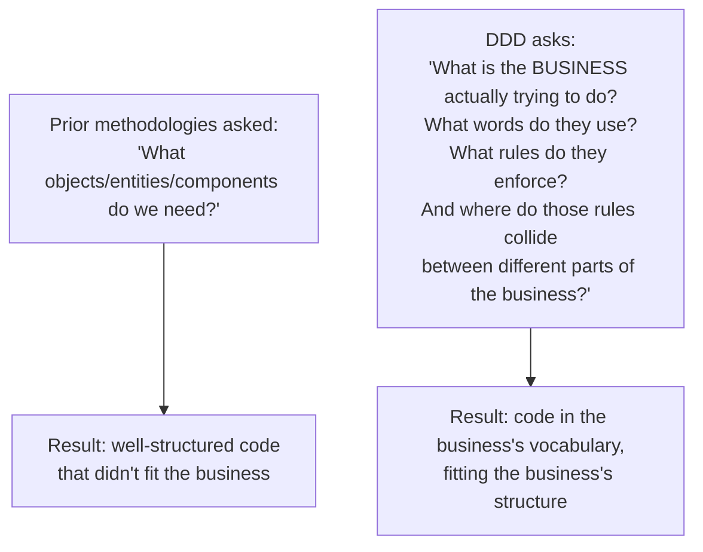
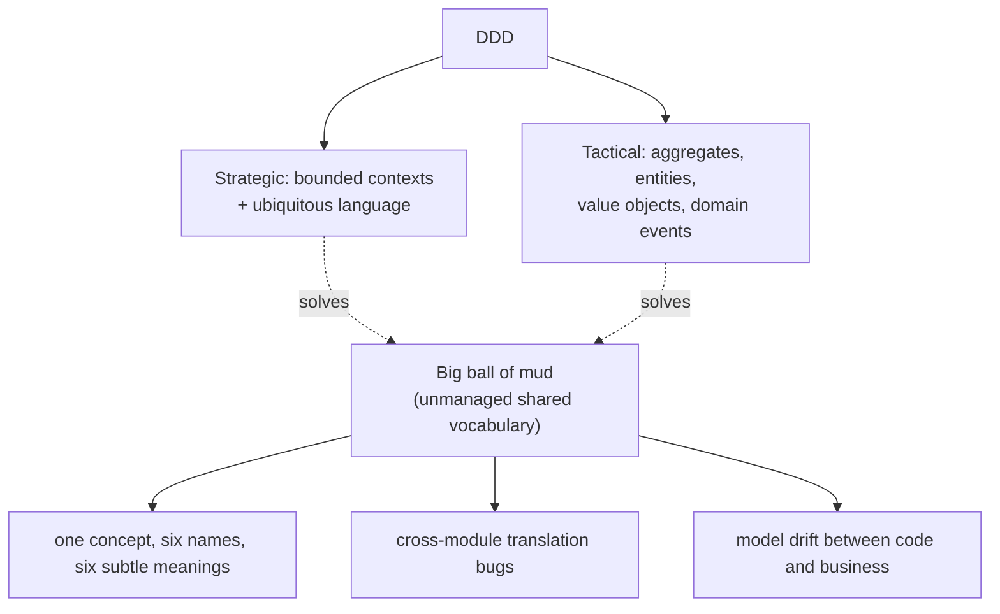
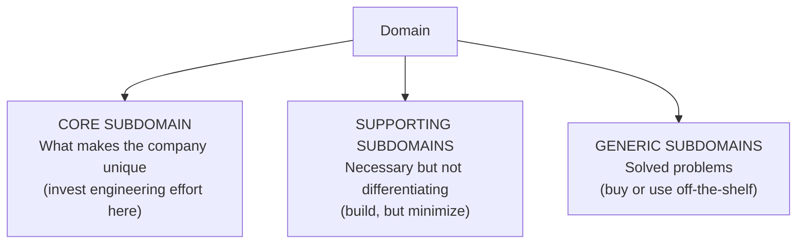
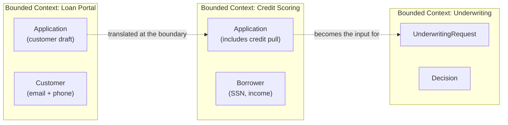
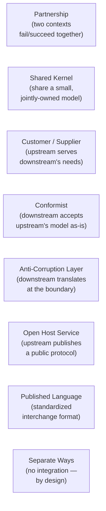
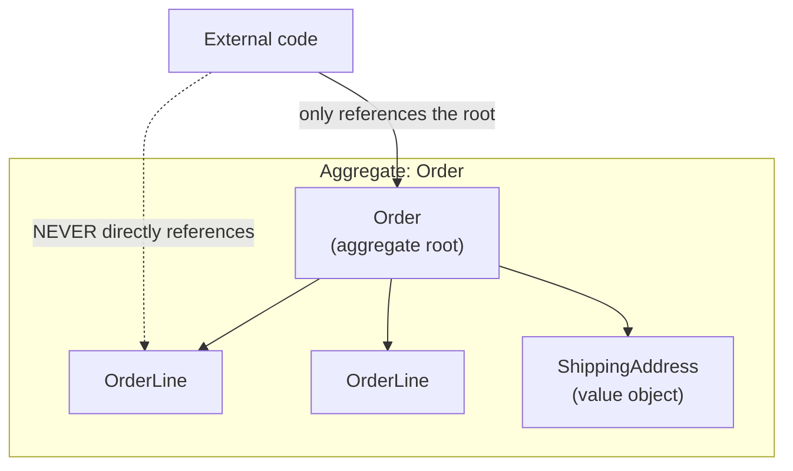
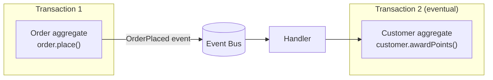
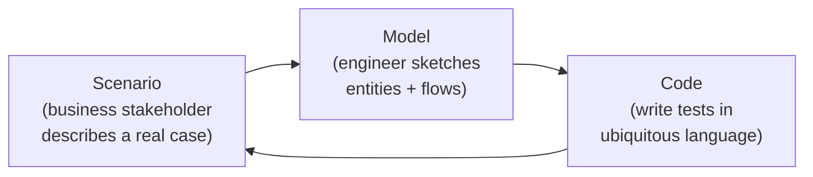

# Domain-Driven Design (DDD)

Hexagonal/clean/onion ([T02](./T02-clean-hexagonal-onion-architecture.md)) supplies the *structure* — a framework-independent core surrounded by adapters. **Domain-Driven Design (DDD)** supplies the *content* — what actually goes *into* that core, and how to know whether you have the right boundaries between cores. Without DDD, hexagonal architecture is a beautifully arranged set of empty rooms. With DDD, the rooms contain a working model of the business, in a language the business itself speaks.

DDD is the work of Eric Evans, captured in his 2003 book *Domain-Driven Design: Tackling Complexity in the Heart of Software* — a book that has influenced more Java backend code than any architectural text since the Gang of Four. Evans's central observation: **software complexity tracks domain complexity, not technical complexity**. A bank's lending system is hard not because Java is hard but because *lending* is hard — the rules, the regulators, the exceptions, the language of the loan officer, the actuary, and the auditor. Most of the cost of long-lived software is spent on the gap between what engineers built and what the business actually meant. DDD's premise is that closing that gap — by making the *model in the code* be the *model in the business's head* — is the single highest-leverage thing a senior engineer can do.

The depth bar here is **using DDD on a real Java codebase, not philosophizing about it**. We cover the strategic patterns (subdomains, bounded contexts, the context map's eight relationship types — Shared Kernel, Customer-Supplier, Conformist, Anti-Corruption Layer, Open Host Service, Published Language, Separate Ways, Partnership) and the tactical patterns (entities, value objects, aggregates and the four aggregate design rules, domain services, domain events, repositories, factories) with the *exact* mapping to Java, JPA, and Spring. We trace how an aggregate update physically runs through a transaction — JPA flush, optimistic locking version columns, event publication, the post-commit listener — and what happens when an engineer accidentally breaks the aggregate boundary (the "single-aggregate-per-transaction" rule violated, and the production incident that follows). We compare DDD adoption across Java, C# (where it is mainstream), Go and Rust (where it is rarer), and explicitly call out the common failure mode — **DDD-as-vocabulary, anemic domain in practice** — that produces codebases with hexagonal/DDD claims and Spring-service-everywhere reality. By the end you will identify the core subdomain of a system in the first 30 minutes of a kickoff meeting, draw the context map in 60, design an aggregate that obeys all four rules, and explain to a skeptical engineer why "we shouldn't bother with DDD" is sometimes right and frequently expensive when it is wrong.

> [!NOTE]
> Prerequisites: [Layered Architecture](./T01-layered-architecture.md) (`L5/C01/T01`) — the dependency rule, the anemic domain problem; [Clean / Hexagonal / Onion](./T02-clean-hexagonal-onion-architecture.md) (`L5/C01/T02`) — ports and adapters as the structure DDD fills. DDD is the *content layer* of hexagonal; this topic assumes that frame.

## The Pre-History: Why DDD Had To Be Invented

To understand why DDD exists, you have to understand the failure landscape that produced it. **DDD did not arrive in a vacuum** — it was the answer to a specific class of failure that the software industry had been trying and failing to solve for thirty years before Evans's book in 2003. Without that history, DDD reads as one more methodology among many; with it, DDD reads as the synthesis of lessons painfully accumulated from the failure of every prior attempt.

### The 1990s "Software Crisis" — Real, Documented, And Underestimated

The 1990s industry context is critical. The "software crisis" was not marketing — it was the **Standish Group's CHAOS Report (1994)** showing that **31% of enterprise software projects were cancelled outright**, **53% overran by an average of 189%**, and only **16% were considered successful**. Of the "successful" ones, the average delivered just **42% of originally specified features**. Capers Jones's 1996 data corroborated: across thousands of projects he tracked, large enterprise software (>10K function points) had a **failure rate above 60%**. The industry was burning billions of dollars on projects that delivered nothing usable, and the cause was *consistently* identified in post-mortems as **misunderstanding of the business domain**, not technical incompetence.

The technical community's response throughout the 1990s was *process improvement* — heavier methodologies that would somehow force the analysts to capture requirements correctly. The **Rational Unified Process (RUP, 1996)**, the **Capability Maturity Model (CMM, 1991)**, **PRINCE2**, **structured analysis (Yourdon/DeMarco, 1979)** — all assumed the problem was insufficient process discipline. The result: more documentation, more sign-off gates, more requirements specs running to 800 pages. **Project failure rates did not improve.** The 2000 CHAOS report showed 23% cancellation, essentially statistically unchanged from 1994.

### The Failed Attempts That Preceded DDD

By the time Evans began writing in 1999, the field had already tried several specific responses to the modeling problem, each of which failed in instructive ways:

#### Attempt 1: Entity-Relationship Modeling (Peter Chen, 1976)

ER modeling reduced reality to **entities** (things) and **relationships** (associations) plus attributes. It was the dominant database-design technique from the 1980s through today; it still produces the schemas every Java engineer reads.

**Why it was insufficient for complex business code**: ER models *data structure* but says nothing about *behavior, invariants, or process*. An ER diagram for a loan system shows that `Loan` has-a `Borrower` and has-many `Payments`; it does not tell you that a loan in `DEFAULTED` state cannot accept a new payment, that the principal balance is *derived* from the payment history, or that a payment received after maturity triggers a different accounting flow. Engineers built ER-perfect schemas with *zero* domain logic and pushed all behavior into stored procedures or service classes — exactly the **anemic domain model** ([T01](./T01-layered-architecture.md#1-anemic-domain-model)) Fowler would name in 2003.

#### Attempt 2: Object-Oriented Analysis (Coad/Yourdon 1990, Booch 1991, OMT 1991)

The OO methodologies — Coad/Yourdon's *Object-Oriented Analysis*, Grady Booch's *Object-Oriented Design With Applications*, Rumbaugh's *Object Modeling Technique* — promised that classes mapping to real-world concepts would naturally produce maintainable systems. Booch coined the **method war** phrase to describe the resulting fragmentation; by 1995 there were ~50 competing OO methodologies, each with its own notation and process.

**Why they failed**: they produced **class diagrams that looked like ER diagrams with methods bolted on**. A class diagram of a banking system in 1995 would show a `Customer` class with `name`, `address`, methods like `getName()`, `setAddress()`, and perhaps `openAccount()`. The *deeper* invariants ("a customer with negative net worth cannot open a margin account"; "a customer flagged for fraud cannot be removed without compliance approval") were either missing entirely or buried in 80-page method-comments that nobody read. The methods became "what the GUI needs" rather than "what the domain demands."

The UML standardization (1997, OMG) consolidated the notation but did not solve the *content* problem. By 2000, "we used UML" was a project disclaimer, not a competitive advantage.

#### Attempt 3: Distributed Component Architectures (CORBA, J2EE/EJB, COM+)

The late 1990s industry believed that **the right component model** would deliver the answer. CORBA (1991), Java EE / EJB 1.0 (1999), Microsoft DCOM (1996) all attempted to model business behavior as **distributed components with remote interfaces**. EJB 1.0 in particular promised "entity beans" that *were* domain objects with persistence built in, behavior, transaction semantics, and security.

**Why this failed catastrophically**: EJB 1.0 entity beans were **infamously over-engineered for the domain problem**. Every entity required 5 classes (home interface, remote interface, primary key, bean class, deployment descriptor); every method invocation went through the container's remote-proxy stack even for in-process calls (~100× slower than a method call); and the resulting "domain objects" were tied so tightly to the EJB container that they could not be unit-tested, refactored, or run outside the application server. The community's reaction — Rod Johnson's 2002 *Expert One-on-One J2EE Design and Development*, then Spring Framework 1.0 in 2003 — explicitly rejected EJB entity beans and proposed POJOs (Plain Old Java Objects) as the foundation for business code.

**This rejection of EJB created the technical context Evans's book needed.** Spring's "POJO-first" stance meant that *the domain object could be a plain class with real behavior* — exactly the substrate DDD required. Without Spring, DDD's tactical patterns would have been hostile to the dominant J2EE platform. With Spring, they fit naturally.

#### Attempt 4: Analysis Patterns (Martin Fowler, 1997)

Fowler's *Analysis Patterns: Reusable Object Models* (1997) was the most direct precursor to DDD. Fowler catalogued reusable domain models — Accountability, Observation/Measurement, Trading, Inventory and Accounting, Planning — derived from his consulting work in healthcare and finance. The book was widely respected but **had limited adoption** because:

- It read as a *catalogue* of finished patterns, not a *process* for discovering them.
- The patterns were domain-specific (healthcare, finance); engineers in other domains struggled to apply them.
- It did not address the **organizational and linguistic** dimensions (bounded contexts, ubiquitous language) that DDD would later identify as essential.

But it established the *premise* DDD would build on: that domain modeling was *the* engineering activity, not a precursor to it.

### The Intellectual Heritage — Where DDD's Ideas Came From

DDD synthesized ideas from several traditions:

1. **The Gang of Four pattern movement (Gamma, Helm, Johnson, Vlissides, 1994)** — *Design Patterns* established that engineering knowledge could be codified as named patterns with consistent structure (Name, Intent, Motivation, Applicability, Structure, Consequences). DDD's tactical patterns (Entity, Value Object, Aggregate, Repository, Factory) directly inherit this format.

2. **Christopher Alexander's pattern language (1977's *A Pattern Language*, his entire body of architecture work)** — Alexander's premise that *patterns interconnect into a language*, and that the language itself is the design tool, underlies DDD's ubiquitous language. Evans cites Alexander explicitly; Cunningham and Beck before him had drawn the same connection for software.

3. **Eric Evans's own consulting career (1989–2003)** — across about 14 years of consulting work primarily in *complex enterprise domains* (lending, scheduling, logistics, healthcare), Evans observed the same failure mode repeatedly: smart engineers building systems that *did not match the business's actual concepts*, then trying to patch over the mismatch with translation code, integration logic, and ever-thickening adapter layers. The patterns in his book are what he had seen *work* when applied deliberately versus what he had seen *fail* when missing.

4. **Smalltalk and CRC cards (Cunningham/Beck, 1989)** — the Class-Responsibility-Collaboration card practice from the late 1980s/early 1990s Smalltalk community taught designers to discover objects by *role-playing the scenarios*. DDD's modeling-whirlpool and event-storming directly descend from this practice.

5. **XP and the agile movement (Beck, *Extreme Programming Explained*, 1999)** — XP's insistence that *the code is the design* and that the domain experts should *be in the room with the developers* set the cultural conditions DDD needed. Pre-XP methodologies kept analysts and developers separate; DDD demanded ongoing collaboration with domain experts, which only XP-influenced shops were prepared to do.

### Who Eric Evans Is, And Why He Wrote DDD

**Eric Evans** is a software consultant, not an academic. He started programming in the late 1970s, worked through the OO-methodology era of the 1990s, and by the late 1990s was running his own consultancy (Domain Language, Inc.) specializing in complex enterprise systems. His prior credits include work on scheduling for shipping, lending decisions, and complex insurance products — domains where the *business rules* are the entire system.

He began the book in **1999** and published in **August 2003** — a four-year writing process during which he tested the patterns by applying them in client engagements. The book's distinctive structure (Part 1: putting the domain model to work; Part 2: building blocks; Part 3: refactoring toward deeper insight; Part 4: strategic design) reflects a **chronological order of discovery** for a working architect: first you must accept that the model matters, then you need building blocks, then you need to keep refining the model, then you need to handle the cross-team strategic concerns.

The book was *not* an instant hit. Sales for the first two years were modest. Adoption accelerated after **2007** as the EJB 3 / Spring 2.x platforms made the tactical patterns more practical to implement, and after the rise of microservices around **2014–2016** because *bounded context* turned out to be the canonical answer to the "where should we draw the service boundaries?" question. By 2020 it was standard graduate-course material; by 2024 it appeared in promotion-track competency rubrics at every major tech employer.

### What DDD Asks That Prior Methodologies Did Not

The conceptual leap DDD made — and the reason it succeeded where its predecessors did not:



The shift is from **"how do we engineer this?"** to **"what does the business mean, and how do we engineer to that?"** Every prior methodology asked the first question; DDD insisted on the second. That insistence — and the patterns Evans gave for *implementing* it — is what made DDD durable.

## Why DDD, Specifically: The Questions A Senior Engineer Should Be Able To Answer

A staff-level engineer should be able to answer, for any pattern they adopt, the following questions. The DDD-specific answers:

### Q1: What specific problem does this solve that nothing else solved?

DDD solves the **vocabulary fragmentation problem at organizational scale**. No prior methodology had a *named, codifiable* mechanism for handling the fact that "Customer" means different things to Sales, Underwriting, Servicing, and Collections — and that *the right answer is not to unify, but to bound*. Pre-DDD, projects either tried to build a single canonical model (which became unworkable as soon as the third bounded context was added) or accepted vocabulary chaos. DDD named the boundary, named the relationships across the boundary, and gave a vocabulary (Shared Kernel, Customer-Supplier, Conformist, ACL, OHS, Published Language, Separate Ways, Partnership) for the explicit choice. **This is the bounded-context revolution**, and it remains DDD's most important contribution.

### Q2: What did people do before this existed, and why did that fail?

Three failure modes, all documented:

1. **The Canonical Data Model (CDM)**: enterprise architecture groups in the 1990s built giant unified data models — IBM's *Banking Industry Architecture*, the *ARTS Retail Data Model*, ACORD for insurance. Every department was supposed to use the same `Customer` definition. The result: *committee paralysis* (changes required cross-departmental approval), *least-common-denominator semantics* (the canonical `Customer` had to mean what *all* departments could agree on, which was almost nothing), and *implementation drift* (each department's actual system used a custom mapping that differed from the canonical model). Many large insurers spent the early 2000s funding CDM projects that delivered nothing usable.

2. **The Star Schema / Data Warehouse**: Bill Inmon's "data warehouse" (1992) and Ralph Kimball's "star schema" (1996) attempted to handle multi-context data through aggregation in a separate read-only system. This *worked* for analytics but did not solve the operational problem — the source systems still had vocabulary collisions; the data warehouse just *aggregated* over them.

3. **The Service-Oriented Architecture (SOA, ~2003)**: SOA's promise was that *services* would have well-defined interfaces, hiding their internal vocabulary. In practice, SOA without DDD produced *service-shaped CRUD* — service interfaces that exposed the source system's vocabulary directly, with the same collisions. The integration layer became a Translation Industrial Complex.

DDD's bounded contexts succeeded where these failed because they explicitly **embraced fragmentation as legitimate** rather than treating it as a problem to be eliminated.

### Q3: How does this compare to alternative approaches that came later?

Three notable comparisons:

#### vs. Active Record (Rails, 2004)

David Heinemeier Hansson's Rails (2004) took a *different* answer to the same complexity problem. Active Record collapses the entity + repository + persistence into one class — `Customer.find(42).pay(100).save`. The *advantages* over DDD: dramatic reduction in code per feature; rapid prototyping; less ceremony.

The *disadvantages* — and why DDD remains dominant in complex domains: Active Record cannot model behaviors that span multiple aggregates (e.g., "transfer from one account to another atomically"); it conflates the domain shape with the persistence shape (the database column names become public API); and the "fat model" problem (single classes growing to thousands of lines as more behavior accumulates) emerged within ~3 years of Rails's dominance.

**The deeper insight**: Active Record is *right for CRUD-heavy domains*; DDD is *right for invariant-heavy domains*. A Twitter clone fits Active Record; a derivatives-trading system does not.

#### vs. Functional Domain Modeling (Wlaschin, 2018)

Scott Wlaschin's *Domain Modeling Made Functional* (2018) re-cast DDD in F#'s type system. The core insight: **algebraic data types make illegal states unrepresentable**. Where Evans's `Order` class enforces "shipped orders cannot be cancelled" with a runtime check, Wlaschin's `Order` is a sum type — `PaidOrder | ShippedOrder | DeliveredOrder` — and the type system *guarantees* you cannot construct a "cancellation" function from a `ShippedOrder` because the function doesn't accept that type.

This is a strict improvement over OO-DDD in expressiveness, but it requires a language with proper sum types (F#, Haskell, Rust, Scala, Kotlin sealed classes, Java 17+ sealed interfaces with pattern matching). For pre-Java-17 codebases, the OO-DDD approach with runtime invariants remains the practical answer.

#### vs. Event Modeling (Adam Dymitruk, 2018)

Event Modeling is a workshop technique — closer to Event Storming than to full DDD — that focuses on the *workflow* of events through a system rather than the static model. It is widely used as the *first hour* of DDD work; the discovered events feed into aggregate identification.

#### vs. Data-Oriented Design (Mike Acton, 2014)

Data-Oriented Design — popular in game engines — rejects OO entirely in favor of **data layout optimized for cache coherence and SIMD**. The premise: object identity matters less than batch-transform efficiency.

This is *not* an alternative to DDD for business systems; it is the right answer for *different problems*. A game's particle system or a market-data tick processor warrants DOD; a lending workflow warrants DDD. **Knowing which kind of system you're building is the senior judgment**.

### Q4: When is DDD the WRONG answer?

DDD costs time. It demands business-engineer collaboration. It produces more files than CRUD. When does it not pay?

(See the existing [When DDD Is The Wrong Choice](#when-ddd-is-the-wrong-choice) section below — these failure regimes remain valid and form part of the senior judgment.)

The senior question to ask: **"Is there something in this domain that, if I get the model wrong, will hurt for years?"** If yes, DDD. If no, CRUD with a service layer.

## The Mechanism: What An Aggregate Actually Enforces (At The JVM And Database Level)

The aggregate pattern is DDD's most-cited contribution but also its most-misunderstood. A senior engineer should be able to answer: *what exactly does an aggregate enforce that a service class cannot?* The answer requires going down to the JVM and database level.

### What An Aggregate Is Mechanically

An aggregate is not just "a class with methods." It is a **consistency boundary** with three concrete mechanisms:

1. **Single-point mutation**: all state changes to any object inside the aggregate flow through methods on the aggregate root. The non-root entities (`OrderLine` inside `Order`) cannot be mutated from outside.
2. **Single-transaction commit**: every aggregate update commits as a single database transaction. The aggregate's invariants are checked *before* commit; if any invariant fails, the transaction aborts.
3. **Single-locking unit**: optimistic concurrency control via the `version` column means *the aggregate root carries the version*, and any modification to *any object inside the aggregate* increments that single version. Two concurrent transactions modifying different parts of the same aggregate will conflict, and one will retry.

The combination of these three is what *no service class can replicate*: a service class can have invariant checks, but it cannot enforce that *all state changes flow through it*. Anyone with a reference to the entity can call `entity.setX(...)` and bypass the service.

### Why This Matters: The Concrete Failure Mode Without Aggregates

Consider a banking system without DDD aggregates. The `Account` is a JPA `@Entity` with getters and setters. Two threads concurrently process transfers:

```java
// Thread A: transfer $100 from Account 42 to Account 99
Account from = repo.findById(42);
Account to = repo.findById(99);
from.setBalance(from.getBalance() - 100);
to.setBalance(to.getBalance() + 100);
repo.save(from);
repo.save(to);

// Thread B: simultaneously, transfer $50 from Account 42 to Account 77
Account from = repo.findById(42);
Account to = repo.findById(77);
from.setBalance(from.getBalance() - 50);
// At this point, Thread A has committed. Thread B's `from` still has the OLD balance.
to.setBalance(to.getBalance() + 50);
repo.save(from);  // <-- writes OLD balance minus 50, losing Thread A's deduction
repo.save(to);
```

This is the classic **lost-update anomaly**. Without optimistic concurrency (`@Version`), the second write *silently* overwrites the first. With `@Version` on `Account`, the second write fails and retries. **But here's the subtlety**: even WITH `@Version`, if `Account` has child entities `Transaction` and `Hold`, modifying a `Transaction` without modifying the `Account` itself does NOT increment the `Account`'s version. So a concurrent modification to a different `Hold` would not conflict, and the consistency boundary is broken in subtle ways.

The DDD aggregate fix: **every operation goes through the aggregate root, which always increments its own version**. The repository saves only the root; the root's save cascades. The version-bump is universal.

### The JVM Memory Model Angle

A second deep mechanism: inside a single JVM transaction, the aggregate's state must be *consistent at every observable point*. Java's happens-before rules ([L3/C01](../../L3-advanced-jvm/C01-concurrency/)) mean that a partially-modified aggregate visible to another thread mid-transaction is a memory-visibility hazard. DDD's "one aggregate per transaction" rule is partially what enables JPA's *transactional write-behind* model — Hibernate accumulates dirty state in the persistence context, flushes at transaction commit, and the rest of the JVM never sees the half-modified aggregate because the transaction is single-threaded.

If you violate "one aggregate per transaction" and modify two aggregates in one `@Transactional` method, you've increased the *lock-hold window* across two row-locks in the database. Under load, this multiplies contention: every other transaction that needs *either* of the two locked rows queues. Throughput collapses.

### Why The Four Aggregate Rules Are Not Arbitrary

Each of Vernon's four rules has a specific mechanical justification:

1. **Model true invariants in consistency boundaries.** *Because* the transaction is the unit of atomicity, and only invariants that must be atomic deserve a transaction-scoped aggregate. Invariants that can be eventually consistent (loyalty points after an order) belong outside.

2. **Design small aggregates.** *Because* the entire aggregate must be loaded to enforce invariants, and large aggregates produce slow queries, GC pressure, and lock contention. An aggregate with 10,000 children means 10,000 row reads to update one field.

3. **Reference other aggregates by identity.** *Because* JPA's `@ManyToOne` creates lazy-loading proxies that *appear* in the persistence context, expanding the transactional scope. By holding `CustomerId` instead of `Customer`, you keep the transaction scoped to just the current aggregate.

4. **Update other aggregates with eventual consistency.** *Because* the saga pattern ([T10](./T10-saga-pattern-distributed-transactions.md)) is the only correct way to handle cross-aggregate atomicity in a distributed system, and even in a monolith, cross-aggregate transactions degrade write throughput.

The rules are *mechanistic consequences of database and JVM behavior*, not arbitrary preferences.

## Common Misconceptions Explained

### "DDD requires microservices."

False. The original 2003 book describes DDD as a *monolith* practice. Bounded contexts can be packages in a single Maven module; aggregates can be `@Entity` classes in a single `@SpringBootApplication`. The microservices alignment ([T05](./T05-microservices-decomposition.md)) is a *later* observation that bounded-context boundaries are useful service-cut lines — but DDD predates microservices by a decade.

### "Aggregates are just classes with methods."

False. As shown above, an aggregate is a **consistency boundary with transactional, locking, and mutation-routing semantics**. A class with methods can be a Value Object, an Entity, a Domain Service, an Application Service — only some of these are aggregates.

### "DDD is just OOP done right."

Partially true. The tactical patterns (Entity, Value Object, rich domain methods) are good OOP. But the strategic patterns (Bounded Context, Context Map, Ubiquitous Language) are *organizational and linguistic*, not object-oriented at all. They are equally applicable to functional codebases ([Wlaschin's F# DDD](https://fsharpforfunandprofit.com/ddd/)) and to procedural enterprise integration.

### "Anemic domain models are always wrong."

False. Anemic models are correct for *truly* CRUD domains where there is no domain logic to encapsulate. A reference-data service for ZIP codes has no behavior; making it "rich" is ceremony. The error is conflating *complex* domains (where anemic is wrong) with *all* domains.

### "DDD means doing event storming workshops."

False. Event storming (Brandolini, 2013) is *one* technique for discovering aggregates, contemporaneous with the modeling whirlpool. The book *Domain-Driven Design* contains no event storming. The discovery technique is replaceable; the patterns are not.

### "Repository = DAO."

False. A DAO (Data Access Object, J2EE Core Patterns 2001) typically exposes per-entity CRUD: `OrderDAO.findById`, `OrderDAO.update`. A Repository exposes per-aggregate-root operations only, with behavior-rich return types (the aggregate root with all its invariants loaded). The repository's interface lives in the *domain*; the DAO's traditionally lives in the persistence layer. The distinction matters because a "Repository" that exposes CRUD on non-root entities has reverted to DAO and broken the aggregate boundary.

## The Problem DDD Exists To Solve

A senior architect joins a company. The product manager describes a "loan application." The legal team calls it an "underwriting request." The credit scoring team calls it an "application." The data warehouse models it as a "case." The customer-facing UI says "your application." The mobile app calls it a "loan request." The fraud team calls it a "submission." Six teams, one concept, seven names — and each name has subtly different semantics. The credit team's "application" includes a credit pull; the legal team's "underwriting request" does not (the pull has happened by then). The data warehouse's "case" includes ten years of historical state; the UI's "application" is the current draft.

The codebase mirrors the confusion. There is `Application.java` in the credit module, `Application.java` in the customer-portal module (different fields), `LoanRequest.java` in the mobile API gateway, `UnderwritingCase.java` in the warehouse ingest pipeline. Engineers spend their afternoons writing translation code from one shape to another and getting subtly wrong what each name means. Bugs that take three weeks to reproduce turn out to be cross-module field mismatches. The system is a *big ball of mud* — Brian Foot and Joseph Yoder's 1997 term for the architecture that emerges when the model is unmanaged.

DDD's diagnosis is that **the problem is not in the code; it is in the language**. The teams already had the right concepts; they just never reconciled their vocabulary. The DDD response is two-fold:

1. **Strategic DDD** — partition the domain into **bounded contexts**, each with its own internally consistent **ubiquitous language**. Crucially, accept that the *credit team's* "application" and the *legal team's* "underwriting request" are different concepts even if they describe the same loan, and model them as two distinct classes in two distinct contexts. Don't try to force them into one.
2. **Tactical DDD** — inside each bounded context, build a model with **entities, value objects, aggregates, domain services, and domain events** that the business stakeholders can recognize. The model in the code becomes the model in the conversation.



## Strategic DDD — Where The Boundaries Go

Strategic DDD is the bigger lever. Most teams skip it (DDD = "use aggregates," they think) and never realize most of the value. The strategic patterns answer the architectural question: **what services should we have, and where do their boundaries live?**

### Subdomains — Where The Business Spends Its Energy

Every business has a domain — the totality of what it does. Inside, the domain decomposes into **subdomains** of three kinds:



- **Core subdomain** — the part of the business that justifies the company's existence. For Stripe: payment processing. For Netflix: recommendations and streaming. For Spotify: discovery. **The core deserves the deepest model, the most senior engineers, and the most DDD discipline.**
- **Supporting subdomain** — necessary but not differentiating. Stripe needs invoicing; Netflix needs billing; Spotify needs catalog metadata. **Worth building well, but not worth a heroic modeling effort.**
- **Generic subdomain** — the same for everyone. Identity (use Okta, Auth0). Email delivery (use SES, SendGrid). Logging (use Datadog). **Buy, do not build.**

The strategic conversation is *which subdomain you are looking at right now*, and tailoring the architectural ambition accordingly. A team applying DDD to its core subdomain spends a year and produces a system that survives a decade; the same team applying DDD to an email-sending generic subdomain wastes the year. Senior judgment is the calibration.

### Bounded Contexts — A Boundary Around A Shared Language

A **bounded context** is a section of the system — usually a service or a module — *within which the model and its vocabulary are internally consistent*. Inside the *Credit Scoring* bounded context, "Application" means one thing, with one schema, one set of rules. Inside the *Loan Portal* bounded context, "Application" means a different thing. **The same word may have different meanings in different bounded contexts, and that is fine** — the boundary is the disambiguator.



The boundary is where translation happens. Inside a context, no translation is needed because everyone uses the same word for the same thing. *Across* contexts, an explicit mapping (an **anti-corruption layer**, see [T13](./T13-anti-corruption-layer.md)) prevents foreign concepts from leaking in.

This is the single most important strategic decision in DDD: **a bounded context is the unit of autonomous evolution.** Teams that own a bounded context can change its model without coordinating with other teams. Teams that share a model across a context boundary are coupled in their release cadence, their schema migrations, and their conceptual debates. **Bounded contexts and microservices boundaries are usually — but not always — the same.** Microservices that ignore bounded-context lines produce the distributed monolith (see [T05 — Microservices Decomposition](./T05-microservices-decomposition.md)).

### Ubiquitous Language — The Glue

A **ubiquitous language** is the agreed vocabulary used *inside a single bounded context*, by engineers AND domain experts AND product AND QA AND docs. It is written down (often in a `UBIQUITOUS-LANGUAGE.md` next to the code) and used *everywhere*: in code (class and method names), in tests (`given_an_application_with_credit_pulled_when_underwritten_then_decision_is_recorded`), in meetings, in user-facing copy when possible.

The discipline: **if engineers and the business use different words for the same thing, the code is wrong, the conversation is wrong, or both.** Reconcile by adopting the business's word in the code, not by leaving the gap. (Sometimes the business word is *wrong* — ambiguous, overloaded — and the right move is to coin a new word that everyone adopts; that's also legitimate. What is *not* legitimate is "engineering says `LoanRequest`, sales says `Application`, and that's just how it is.")

The payoff is that meetings become faster. Bugs surface earlier. New engineers ramp on the *domain* by reading the code. Onboarding shrinks from quarters to weeks.

### Context Map — The Eight Relationships Between Bounded Contexts

A context map is a diagram showing every bounded context in the system and *how they relate*. DDD names eight relationship patterns, each with a sharply different organizational implication:



| Pattern | When to use | Risk |
|---------|-------------|------|
| **Partnership** | Two contexts whose teams genuinely succeed or fail together (e.g., a payments team and a fraud team). | Becomes Shared Kernel by accident; coordination cost. |
| **Shared Kernel** | A small, deeply shared domain core (e.g., a `Money` type). Joint ownership, joint review. | Easy to grow; if it grows, ownership becomes unclear. |
| **Customer / Supplier** | Upstream context actively serves downstream's needs; downstream has explicit influence on the upstream backlog. | Downstream becomes a 2nd-class citizen of upstream's roadmap. |
| **Conformist** | Downstream accepts upstream's model unchanged because upstream's model is fine (e.g., consuming a vendor SDK's types). | Downstream becomes welded to upstream's vocabulary and evolution. |
| **Anti-Corruption Layer (ACL)** | Downstream must protect itself from upstream's model (legacy systems, third-party SaaS, regulator schemas). | More code; the ACL itself becomes a translation maintenance burden. |
| **Open Host Service (OHS)** | Upstream publishes a stable, public protocol for *all* its consumers (REST API, gRPC contract). | Upstream loses flexibility — the public protocol is hard to evolve. |
| **Published Language** | Multiple contexts agree on a shared interchange format (FHIR for healthcare, OpenTelemetry for tracing, ISO-20022 for finance). | Designed by committee, slow to evolve, but maximally portable. |
| **Separate Ways** | The integration cost is not worth it — duplicate the data instead. | Genuinely fine when the contexts have nothing meaningful to share. |

A context map is *not* a microservice topology diagram. It is a **sociotechnical** diagram — each arrow describes both a code relationship *and* a team relationship. "We have an Anti-Corruption Layer between us and the legacy mainframe" is simultaneously a class structure and a statement about team responsibility. The DDD insight: **the context map is the architectural picture senior engineers should hold in their heads**. The microservice topology, the database list, the queue list — those are all readable off the context map. The reverse isn't true.

## Tactical DDD — The Code-Level Patterns

Once you know which bounded context you're inside, the tactical patterns shape the code.

### Entities — Identity Matters

An **entity** is a domain object with a stable identity that persists through state changes. A `Customer(id=42)` is the same customer whether their address changes or they get married — the `id` is what defines them, not their fields. Equality is by id, not by value.

```java
public class Customer {
  private final CustomerId id;                 // identity — never changes
  private Name name;
  private EmailAddress email;

  public Customer(CustomerId id, Name name, EmailAddress email) {
    this.id = Objects.requireNonNull(id);
    this.name = Objects.requireNonNull(name);
    this.email = Objects.requireNonNull(email);
  }

  public void changeEmail(EmailAddress newEmail) {     // invariant enforcement
    if (newEmail.equals(this.email)) return;
    if (this.email.isVerified()) throw new VerifiedEmailLocked();
    this.email = newEmail;
  }

  @Override public boolean equals(Object o) {          // equality by id
    return o instanceof Customer c && id.equals(c.id);
  }
  @Override public int hashCode() { return id.hashCode(); }
}
```

The entity *owns its invariants*. `changeEmail` is the only way the email changes; the rule "verified emails are locked" cannot be bypassed by reaching around. This is the answer to the **anemic domain model** anti-pattern ([T01](./T01-layered-architecture.md#1-anemic-domain-model)): behavior lives where it can enforce its invariants — on the entity — not in a `CustomerService` somewhere.

### Value Objects — Identity Doesn't Matter

A **value object** has no identity; it is *defined by its value*. `Money(100, USD)` is interchangeable with any other `Money(100, USD)`. Two `EmailAddress("a@b.com")` instances are equal. Value objects are **immutable** ([L1/C01/T19](../../L1-core-java/C01-oop/T19-immutability-and-immutable-class-design.md)), comparable by value, and freely shared. They are the units of the ubiquitous language.

Java 17+ records ([L1/C01/T14](../../L1-core-java/C01-oop/T14-record-types.md)) made value objects almost free:

```java
public record Money(BigDecimal amount, Currency currency) {
  public Money {                                       // compact constructor — validation
    Objects.requireNonNull(amount);
    Objects.requireNonNull(currency);
    if (amount.scale() > currency.getDefaultFractionDigits())
      throw new IllegalArgumentException("scale too large for " + currency);
  }
  public Money add(Money other) {                      // operations return new instances
    if (!currency.equals(other.currency)) throw new CurrencyMismatch();
    return new Money(amount.add(other.amount), currency);
  }
}
```

Records give you the constructor, equality, hashCode, and toString. Use them liberally — every primitive that means something in the domain (`int score` becomes `record CreditScore(int value)`, `String email` becomes `record EmailAddress(String value)`) gets safer, more readable, and easier to evolve.

**Primitive obsession** — using `int`, `String`, `BigDecimal` directly throughout the code — is the most common anti-pattern in Java domain modeling. A `transfer(BigDecimal amount, BigDecimal sourceAccountBalance, BigDecimal limit)` invites argument swaps. `transfer(Money amount, AccountBalance source, Limit limit)` doesn't even *compile* if the arguments swap.

### Aggregates — The Transactional Boundary

An **aggregate** is a cluster of entities and value objects treated as a single unit for the purpose of data changes. One entity inside is designated the **aggregate root** — and the outside world may only hold references to the root, never to entities inside. The root is responsible for enforcing the aggregate's invariants.



The aggregate root mediates *all* access. `order.addLine(...)`, `order.removeLine(...)`, `order.changeShippingAddress(...)` — never `order.getLines().add(...)` because that would let the outside world mutate the aggregate's interior and bypass the root's invariants.

#### The Four Aggregate Design Rules

Vaughn Vernon (the *Implementing DDD* author, 2013) reduced Evans's guidance to **four rules** that have become the operational standard:

1. **Model true invariants in consistency boundaries.** An aggregate exists because some invariant must hold across multiple objects atomically. If no such invariant exists, don't make an aggregate — use a flatter model.
2. **Design small aggregates.** A two-level cluster (root + value objects + ID references to other aggregates) is the default. Aggregates that grow to hold hundreds of children become contention hot-spots and load slowly.
3. **Reference other aggregates by identity.** An `Order` does not hold a `Customer` reference; it holds a `CustomerId`. To resolve the customer, the use case asks the customer repository. **This is the rule most violated by Java teams**, because JPA `@ManyToOne` makes it easy to draw graph edges between aggregates — and tempting.
4. **Update other aggregates with eventual consistency.** If placing an order changes the customer's loyalty points, do *not* mutate both aggregates in one transaction. Mutate the order; emit an event; a downstream handler updates the customer in a separate transaction. This is the principle that scales DDD to distributed systems.



Violating rule 4 — updating two aggregates in one transaction — is the single most common DDD mistake in Spring code. The fix is to publish a domain event from the first aggregate's transaction and consume it in a second.

### Domain Services — Operations That Don't Belong On An Entity

A **domain service** is a piece of domain logic that doesn't naturally live on a single entity. Classic example: a transfer between two accounts. The transfer is a domain operation but it's neither `Account.from.transfer(...)` (why does *from* own the operation?) nor `Account.to.receive(...)`. It is a service that orchestrates both:

```java
public class TransferService {                          // a DOMAIN service, not an @Service
  public void transfer(Account source, Account target, Money amount) {
    if (!source.canTransfer(amount)) throw new InsufficientFunds();
    source.debit(amount);
    target.credit(amount);
  }
}
```

A domain service is **pure java** — no Spring imports, lives in the domain package. It is *different from* an application service (the `@Service` that orchestrates a use case across infrastructure). Many Java teams collapse the two by accident; the result is application services bloated with domain logic and a thin or absent domain.

### Domain Events — The Past Tense

A **domain event** is a record of *something that happened* in the domain — past tense — that other parts of the system may care about. `OrderPlaced`, `PaymentReceived`, `EmailVerified`, `CustomerSuspended`.

```java
public record OrderPlaced(OrderId orderId,
                          CustomerId customerId,
                          Money total,
                          Instant placedAt) { }
```

Events are immutable, named in past tense (it has *happened*, not "place order"), and contain enough information for handlers to do their work without loading additional data (or, alternatively, contain only IDs and force handlers to look up — both styles are valid; choose by load patterns).

Spring 4.2+ supports domain events natively. An aggregate root can call `AbstractAggregateRoot.registerEvent(...)`; the events are published *after* the aggregate is saved by Spring Data:

```java
@Entity
public class Order extends AbstractAggregateRoot<Order> {
  public void place() {
    this.status = OrderStatus.PLACED;
    registerEvent(new OrderPlaced(id, customerId, total, Instant.now()));
  }
}
@Component
class LoyaltyPointsHandler {
  @TransactionalEventListener(phase = AFTER_COMMIT)    // <-- only after the order tx commits
  public void on(OrderPlaced event) {
    customerService.awardPoints(event.customerId(), event.total());
  }
}
```

The `@TransactionalEventListener(phase = AFTER_COMMIT)` is the magic: the handler runs *only after* the order's transaction commits. If the order fails, no points are awarded. If the points-awarding fails, the order is still placed (eventual consistency — the points-awarding gets retried). This is **the operational glue** of aggregate boundaries in Spring DDD.

### Repositories — Aggregate Persistence

A **repository** is a collection-like abstraction over the persistence of an aggregate. There is **one repository per aggregate type** (not per entity, not per table — per *aggregate root*). The repository's interface lives in the domain (it's an output port — [T02](./T02-clean-hexagonal-onion-architecture.md)); the implementation lives in the adapter:

```java
public interface OrderRepository {                      // domain port — pure java
  Optional<Order> findById(OrderId id);
  void save(Order order);
  List<Order> findByCustomer(CustomerId id);
}
```

The repository returns aggregate roots (or `Optional` of one). It does **not** return individual entities inside aggregates, because the outside world has no business holding references to them.

### Factories — Complex Construction

A **factory** is a function (often a `static` method on the aggregate root or a separate class) that constructs a valid aggregate from raw inputs, enforcing initial invariants:

```java
public static Order placeNew(CustomerId customer, List<OrderLine> lines, ShippingAddress addr) {
  if (lines.isEmpty()) throw new IllegalArgumentException("can't place an empty order");
  Money total = lines.stream().map(OrderLine::subtotal).reduce(Money.ZERO_USD, Money::add);
  Order o = new Order(OrderId.generate(), customer, lines, addr, OrderStatus.DRAFT, total);
  o.registerEvent(new OrderPlaced(o.id, customer, total, Instant.now()));
  return o;
}
```

Factories are the only place an aggregate is constructed from "outside" data. Once placed, the aggregate is mutated only through its own methods — never assembled field-by-field again.

## Putting It Together — A Bounded Context In Spring

A full bounded context for the Loan Portal:

```text
com.bank.loanportal                                  ← bounded context root
├── domain/
│   ├── model/
│   │   ├── Application.java              (aggregate root)
│   │   ├── ApplicationId.java            (value object)
│   │   ├── Applicant.java                (value object inside the aggregate)
│   │   ├── Income.java                   (value object)
│   │   ├── ApplicationStatus.java        (enum, ubiquitous language)
│   │   └── events/
│   │       └── ApplicationSubmitted.java (domain event)
│   ├── port/
│   │   ├── in/
│   │   │   └── SubmitApplicationUseCase.java  (interface)
│   │   └── out/
│   │       ├── ApplicationRepository.java     (interface)
│   │       └── CreditPullPort.java            (interface)
│   └── service/
│       ├── ApplicationFactory.java       (domain service)
│       └── SubmitApplicationService.java (use case impl)
├── adapter/
│   ├── in/
│   │   └── web/
│   │       └── ApplicationController.java
│   └── out/
│       ├── persistence/
│       │   ├── ApplicationEntity.java         (@Entity — JPA)
│       │   └── JpaApplicationRepository.java  (implements ApplicationRepository)
│       └── credit/
│           └── ExperianCreditPullAdapter.java (implements CreditPullPort,
│                                              with internal ACL translation)
└── config/
    └── BeansConfig.java
```

Three observations:

1. **The bounded context is a Java package tree.** Spring components in the same context share an `@ComponentScan` base package; other contexts live under sibling packages and are imported only through their published ports.
2. **The published ports of this context** — `SubmitApplicationUseCase`, the `ApplicationSubmitted` event — are the *only* surfaces other contexts may touch. Internal classes (`ApplicationFactory`, `Applicant`, `Income`) are package-private or hidden behind clear naming.
3. **Mapping happens at the adapter boundary.** `ApplicationEntity` (JPA shape) maps to `Application` (domain shape) inside `JpaApplicationRepository`. `Experian` API types are converted to domain `CreditReport` inside the Experian adapter (the Anti-Corruption Layer, [T13](./T13-anti-corruption-layer.md)).

## How An Aggregate Transaction Physically Runs

The DDD claim is that an aggregate is the transactional boundary. Let's see exactly what happens when `submitApplicationService.submit(cmd)` runs on Spring Boot + JPA + PostgreSQL.

```mermaid
sequenceDiagram
  participant Ctrl as ApplicationController
  participant Svc as SubmitApplicationService
  participant Agg as Application (aggregate)
  participant Repo as JpaApplicationRepository
  participant EM as EntityManager
  participant DB as PostgreSQL
  participant Bus as Spring EventBus
  participant LH as LoyaltyHandler

  Ctrl->>Svc: submit(SubmitApplicationCommand)
  Note over Svc: @Transactional begins
  Svc->>Agg: Application.placeNew(...)
  Note over Agg: aggregate constructed,<br/>registerEvent(ApplicationSubmitted)
  Svc->>Repo: save(application)
  Repo->>EM: persist(applicationEntity)
  Note over Svc: business logic continues...
  Note over Svc: @Transactional commit phase
  EM->>DB: BEGIN; INSERT INTO applications ...; COMMIT
  DB-->>EM: ok
  EM-->>Repo: persisted
  Bus->>LH: ApplicationSubmitted (post-commit)
  LH->>LH: separate transaction for handler
```

Three steps deserve emphasis:

1. **The aggregate's `registerEvent` does *not* immediately publish.** The event lives in a list inside `Application` until Spring Data's `SimpleJpaRepository.save` calls `entity.releaseAllEvents()` and the events are stored for publication.
2. **`@TransactionalEventListener(phase = AFTER_COMMIT)` is the published-after-commit hook.** Until the database `COMMIT` returns successfully, handlers do not run. This means a handler can *assume* the aggregate's state is durably written.
3. **The handler runs in its own transaction.** If the handler fails, the aggregate's change is not rolled back. This is eventual consistency; if the handler must succeed eventually, it must be idempotent and retried (Spring `@Retryable`, an outbox pattern with Debezium, or a transactional outbox table).

This dance is **the operational expression of aggregate design rule 4** (update other aggregates with eventual consistency). Understanding it down to the `phase = AFTER_COMMIT` line is the difference between using DDD as vocabulary and using it as architecture.

### What Happens When You Violate Rule 4

A junior engineer writes:

```java
@Transactional
public void submit(SubmitApplicationCommand cmd) {
  Application app = Application.placeNew(...);
  appRepo.save(app);
  customerRepo.awardLoyaltyPoints(cmd.customerId(), app.total());   // <-- DIFFERENT aggregate!
}
```

The application's transaction now spans two aggregates. Consequences:

1. **Lock contention escalates.** Both aggregates are locked for the duration of the transaction. Two customers placing orders on the same day grab the customer row's write lock; throughput craters.
2. **The transaction takes longer.** Two saves, two flushes, two index updates. The 95th-percentile latency moves from 30 ms to 80 ms.
3. **Partial failures cascade.** If the customer save fails (deadlock retry, constraint), the application save rolls back — even though it succeeded. The user gets an error for an order that should have been accepted.
4. **The boundary erodes.** Six months later, a third aggregate joins the transaction. Then a fourth. The bounded context becomes a single giant transaction; you've recreated the big ball of mud inside hexagonal-DDD packaging.

The rule exists to prevent exactly this drift. **One transaction touches one aggregate.** Cross-aggregate effects flow through events.

## Anti-Patterns — How Java Teams Get DDD Wrong

DDD has its own family of failures, all named, all common.

### 1. DDD-Lite — Vocabulary Without Discipline

The team uses "aggregate," "value object," "bounded context" in conversation. The code is layered-with-anemic-services. There are no actual aggregates; every entity is a JPA bag of fields; behavior lives in `@Service` classes; events are nowhere. This is **DDD-lite** — the vocabulary as cargo cult. The fix is to commit to *one* tactical pattern and use it correctly: pick one entity, make it an aggregate root with real invariants and methods, publish one event. Then expand.

### 2. The God Aggregate

An `Order` aggregate that holds every `Customer`, every `Product`, every `Shipment` in its graph. Load one order, load 10,000 rows. Updates take seconds. The aggregate root is no longer a transactional boundary; it's a synonym for "the whole database." The fix is rule 3: reference other aggregates by *ID*. An `Order` holds a `CustomerId`, not a `Customer`.

### 3. The Anemic Aggregate

An aggregate root with no behavior, only getters and setters. The "aggregate" is just a Java class. The fix is the same as for entities (T01): put behavior on the aggregate; remove setters; enforce invariants in methods.

### 4. Shared Database, Different Bounded Contexts

Two bounded contexts share a single Postgres database, joined by foreign keys. The schema is the shared kernel by accident. A migration in one context breaks the other. The fix is one database per bounded context (which is also the microservices rule — see [T05](./T05-microservices-decomposition.md)). If you can't split databases (legacy, regulator, cost), at minimum split schemas and *never* cross with FKs.

### 5. Bounded Contexts That Match Org Charts, Not Domain Lines

The "Payments" team builds the "Payments" bounded context — but the team owns billing, invoicing, refunds, fraud, and customer accounting. The bounded context is "things the payments team works on," not "a region of internally consistent vocabulary." The model is a mess because three real bounded contexts (Payments, Billing, Fraud) have been collapsed into one. The fix is Conway's Law applied in reverse: structure the team around the bounded context, not the bounded context around the team.

### 6. Bounded Contexts That Are Too Small

A bounded context per microservice, even when the microservice is a 200-line wrapper around three lines of SQL. Each context has its own `Customer` model with three fields; there are forty `Customer` models in the company. The "ubiquitous" language is a fiction because there are forty languages. The fix is to *merge* contexts whose models genuinely agree, or accept the duplication and the translation cost.

## DDD In Other Languages — Where It's Mainstream, Where It's Rare

| Ecosystem | DDD adoption | Notes |
|-----------|:------------:|-------|
| **Java / Spring** | High and rising | Eric Evans is Java-adjacent; Vaughn Vernon's IDDD examples are Java/Spring; growing share since 2018. |
| **C# / .NET** | Very high | .NET community embraced DDD in the late 2000s; Jimmy Bogard's MediatR + AutoMapper became near-default; well-documented patterns. |
| **Ruby on Rails** | Low-to-medium | "Service objects" are a partial response; Sandi Metz's books overlap heavily; full DDD vocabulary rarer. |
| **Python / Django** | Low | Active Record dominance; some FastAPI projects adopt hexagonal-DDD ([Cosmic Python](https://www.cosmicpython.com/) is the canonical resource). |
| **Go** | Low | Strong "data + functions" culture; DDD vocabulary used sparingly. The pragma is "package boundaries are bounded contexts," with less ceremony. |
| **Rust** | Very low explicitly, very high implicitly | Rust's type system *enforces* value-object discipline (newtypes, no primitives), and `cargo` crates *enforce* bounded contexts. DDD vocabulary rare; DDD outcomes common. |
| **TypeScript / NestJS** | Medium | NestJS templates often ship with DDD examples; corporate adoption rising. |
| **PHP / Laravel** | Medium | Matthias Noback's *Object Design Style Guide* and the Laravel community have a real DDD strand. |

Two lessons:

1. **DDD is a Java + C# phenomenon by ecosystem share.** Other ecosystems have their own answers (Ruby's service objects, Rust's type system, Go's pragmatic packaging), but the explicit DDD vocabulary is most heavily used where enterprise complexity meets a mature OO ecosystem.
2. **Rust achieves DDD outcomes without DDD vocabulary.** A Rust newtype `struct Money(Decimal, Currency)` is a value object by language fiat. The `cargo` crate boundary is a bounded context by build tooling. Rust shows that some of DDD is *language design problems waiting to be solved*; until that day, Java/Spring needs the discipline.

## When DDD Is The Wrong Choice

DDD costs time. It demands business-engineer collaboration. It produces more files than CRUD. When does it not pay?

1. **Simple CRUD over one table.** No invariants. No domain logic. No need.
2. **Prototypes and spikes.** The vocabulary work outlasts the code.
3. **No business-side partner.** DDD without domain experts is engineers inventing a vocabulary they will misuse.
4. **Generic subdomains.** Don't model "email delivery" in your domain — use the SDK.
5. **Reporting / analytics services.** DDD's strength is *transactional* behavior; read-only analytics fit better with star schemas and SQL.
6. **Throwaway services.** A six-week marketing-feature service won't earn the modeling investment.

For non-trivial transactional cores with a multi-year horizon and a domain rich enough to confuse newcomers, DDD pays. The litmus test from Evans: **"Is there something in this domain that, if I get the model wrong, will hurt for years?"** If yes, DDD. If no, layered with discipline.

> [!INTERVIEW]
> A common L5 prompt: "What's the difference between an entity and a value object?" A weak answer cites the textbook (entities have id, value objects don't). A strong answer adds: "Value objects are immutable; entities have a lifecycle. Comparison: entities by id, value objects by value. The deeper rule: value objects let you replace 'primitive obsession' with domain types — `Money`, `EmailAddress`, `CustomerId` — so that the *compiler* enforces what would otherwise be argument-order bugs."

## The Modeling Whirlpool — How To Actually Do DDD With Stakeholders

Evans's later work (the 2013 *Domain Language* book) describes the **modeling whirlpool**: an iterative loop of scenario → model → code → scenario, tightening with each pass. A practical version:



Each pass surfaces vocabulary mismatches: stakeholder uses a word the model doesn't have; the model has a class the stakeholder doesn't recognize. Each mismatch is a finding — either the model needs a new concept, or the stakeholder needs a new word, or (often) the team has discovered an implicit business rule no one had named. The model converges on a shared vocabulary. **The whirlpool is the work of DDD.** The patterns are tools; the whirlpool is the practice.

Event Storming (Alberto Brandolini, 2013) is the popular workshop format that implements the whirlpool — stakeholders + engineers + sticky notes on a long wall, surfacing every domain event and bunch them into aggregates and bounded contexts in 4–8 hours. Worth one full day with the team before starting a non-trivial new system.

## DDD Trade-Off Summary

| Dimension | DDD buys | DDD costs |
|-----------|---------|-----------|
| **Domain modeling** | Code that matches the business's mental model | Many more domain types per feature |
| **Communication** | Single shared vocabulary across engineering + business | Vocabulary-discipline meetings; cost when teams won't participate |
| **Long-term maintenance** | Bounded contexts evolve independently | Up-front investment in cuts that pay off in years 2–5 |
| **Aggregate invariants** | Race-condition-free domain rules | Aggregate-boundary discipline must be enforced (rule 4) |
| **Event-driven decoupling** | Cross-aggregate flows become explicit, testable | Eventual consistency must be reasoned about everywhere |
| **Code volume** | High-leverage abstractions | More files; more interfaces; more ceremony |
| **Onboarding** | New engineers ramp on the domain via tests | Vocabulary learning curve before code makes sense |

The pattern's value is highest where the domain itself is complex and durable. For everything else, hexagonal-with-anemic-services is the honest middle ground.

## Deeper Dive — Complete DDD Bounded Context in Spring Boot

### Order Bounded Context: Aggregate Root

```java
@Entity
@Table(name = "orders")
public class Order extends AggregateRoot {
    
    @EmbeddedId
    private OrderId id;
    
    @Embedded
    @AttributeOverride(name = "value", column = @Column(name = "customer_id"))
    private CustomerId customerId;
    
    @Enumerated(EnumType.STRING)
    private OrderStatus status;
    
    @Embedded
    private Money totalAmount;
    
    @ElementCollection
    @CollectionTable(name = "order_lines", joinColumns = @JoinColumn(name = "order_id"))
    private List<OrderLine> lines = new ArrayList<>();
    
    @Embedded
    private ShippingAddress shippingAddress;
    
    @Version
    private Long version;  // Optimistic locking
    
    // Private constructor — only created via factory
    protected Order() {}
    
    public static Order place(
            CustomerId customerId,
            List<OrderLineRequest> items,
            ShippingAddress address
    ) {
        // Domain rules at construction
        if (items.isEmpty()) {
            throw new DomainException("Order must have at least one item");
        }
        if (items.size() > 100) {
            throw new DomainException("Order cannot exceed 100 items");
        }
        
        Order order = new Order();
        order.id = OrderId.newId();
        order.customerId = customerId;
        order.status = OrderStatus.DRAFT;
        order.shippingAddress = address;
        order.lines = items.stream()
            .map(req -> new OrderLine(req.productId(), req.quantity(), req.unitPrice()))
            .toList();
        order.totalAmount = order.calculateTotal();
        
        order.registerEvent(new OrderPlacedEvent(order.id, order.customerId, order.totalAmount));
        return order;
    }
    
    public void addLine(OrderLine line) {
        // Invariant: can't modify confirmed order
        if (status != OrderStatus.DRAFT) {
            throw new DomainException("Cannot modify order in status " + status);
        }
        
        // Invariant: max 100 lines
        if (lines.size() >= 100) {
            throw new DomainException("Order cannot exceed 100 items");
        }
        
        // Invariant: no duplicate products
        if (lines.stream().anyMatch(l -> l.productId().equals(line.productId()))) {
            throw new DomainException("Product already in order: " + line.productId());
        }
        
        lines.add(line);
        totalAmount = calculateTotal();
        
        registerEvent(new OrderLineAddedEvent(id, line));
    }
    
    public void confirm() {
        if (status != OrderStatus.DRAFT) {
            throw new DomainException("Order already confirmed");
        }
        if (lines.isEmpty()) {
            throw new DomainException("Cannot confirm empty order");
        }
        if (totalAmount.isZeroOrNegative()) {
            throw new DomainException("Cannot confirm order with zero total");
        }
        
        status = OrderStatus.CONFIRMED;
        registerEvent(new OrderConfirmedEvent(id, totalAmount));
    }
    
    public void cancel(String reason) {
        if (status == OrderStatus.SHIPPED || status == OrderStatus.DELIVERED) {
            throw new DomainException("Cannot cancel " + status + " order");
        }
        if (status == OrderStatus.CANCELLED) {
            throw new DomainException("Order already cancelled");
        }
        
        status = OrderStatus.CANCELLED;
        registerEvent(new OrderCancelledEvent(id, reason));
    }
    
    public void markPaid(PaymentId paymentId) {
        if (status != OrderStatus.CONFIRMED) {
            throw new DomainException("Cannot mark unconfirmed order as paid");
        }
        
        status = OrderStatus.PAID;
        registerEvent(new OrderPaidEvent(id, paymentId, totalAmount));
    }
    
    private Money calculateTotal() {
        return lines.stream()
            .map(OrderLine::subtotal)
            .reduce(Money.ZERO, Money::add);
    }
}

// Value object embedded in Order
@Embeddable
public class OrderLine {
    @Embedded
    @AttributeOverride(name = "value", column = @Column(name = "product_id"))
    private ProductId productId;
    
    private int quantity;
    
    @Embedded
    @AttributeOverride(name = "amount", column = @Column(name = "unit_price"))
    @AttributeOverride(name = "currency", column = @Column(name = "currency"))
    private Money unitPrice;
    
    public OrderLine(ProductId productId, int quantity, Money unitPrice) {
        if (quantity <= 0) throw new DomainException("Quantity must be positive");
        if (unitPrice.isZeroOrNegative()) throw new DomainException("Price must be positive");
        
        this.productId = productId;
        this.quantity = quantity;
        this.unitPrice = unitPrice;
    }
    
    public Money subtotal() {
        return unitPrice.multiply(quantity);
    }
}
```

### Value Objects

```java
@Embeddable
public record OrderId(UUID value) {
    public static OrderId newId() {
        return new OrderId(UUID.randomUUID());
    }
    
    public static OrderId of(String value) {
        return new OrderId(UUID.fromString(value));
    }
}

@Embeddable
public record CustomerId(UUID value) {
    public static CustomerId of(String value) {
        return new CustomerId(UUID.fromString(value));
    }
}

@Embeddable
public class Money {
    private BigDecimal amount;
    
    @Enumerated(EnumType.STRING)
    private Currency currency;
    
    public static final Money ZERO = new Money(BigDecimal.ZERO, Currency.USD);
    
    public Money(BigDecimal amount, Currency currency) {
        if (amount.scale() > currency.getDefaultFractionDigits()) {
            throw new DomainException("Amount has too many decimal places");
        }
        this.amount = amount.setScale(currency.getDefaultFractionDigits(), RoundingMode.HALF_UP);
        this.currency = currency;
    }
    
    public Money add(Money other) {
        if (!currency.equals(other.currency)) {
            throw new DomainException("Cannot add different currencies");
        }
        return new Money(amount.add(other.amount), currency);
    }
    
    public Money subtract(Money other) {
        if (!currency.equals(other.currency)) {
            throw new DomainException("Cannot subtract different currencies");
        }
        return new Money(amount.subtract(other.amount), currency);
    }
    
    public Money multiply(int factor) {
        return new Money(amount.multiply(BigDecimal.valueOf(factor)), currency);
    }
    
    public boolean isZeroOrNegative() {
        return amount.compareTo(BigDecimal.ZERO) <= 0;
    }
    
    public boolean isGreaterThan(Money other) {
        if (!currency.equals(other.currency)) {
            throw new DomainException("Cannot compare different currencies");
        }
        return amount.compareTo(other.amount) > 0;
    }
}

@Embeddable
public class ShippingAddress {
    private String street;
    private String city;
    private String state;
    private String zipCode;
    private String country;
    
    public ShippingAddress(String street, String city, String state, String zipCode, String country) {
        if (street == null || street.isBlank()) throw new DomainException("Street required");
        if (city == null || city.isBlank()) throw new DomainException("City required");
        if (zipCode == null || !isValidZipCode(zipCode, country)) {
            throw new DomainException("Invalid zip code for country");
        }
        // ... assignments
    }
}
```

### Domain Events

```java
public sealed interface DomainEvent 
    permits OrderPlacedEvent, OrderConfirmedEvent, OrderPaidEvent, OrderCancelledEvent {
    Instant occurredAt();
    UUID eventId();
}

public record OrderPlacedEvent(
    OrderId orderId,
    CustomerId customerId,
    Money totalAmount,
    Instant occurredAt,
    UUID eventId
) implements DomainEvent {
    public OrderPlacedEvent(OrderId orderId, CustomerId customerId, Money totalAmount) {
        this(orderId, customerId, totalAmount, Instant.now(), UUID.randomUUID());
    }
}
```

### Aggregate Root Base Class

```java
public abstract class AggregateRoot {
    @Transient
    private List<DomainEvent> events = new ArrayList<>();
    
    protected void registerEvent(DomainEvent event) {
        events.add(event);
    }
    
    public List<DomainEvent> domainEvents() {
        return Collections.unmodifiableList(events);
    }
    
    public void clearEvents() {
        events.clear();
    }
}
```

### Repository (Just for Aggregate Root)

```java
public interface OrderRepository {
    Optional<Order> findById(OrderId id);
    Order save(Order order);
    void delete(Order order);
    List<Order> findByCustomer(CustomerId customerId);
}

@Repository
public class JpaOrderRepository implements OrderRepository {
    private final JpaOrderEntityRepository jpaRepo;
    private final ApplicationEventPublisher eventPublisher;
    
    @Override
    @Transactional
    public Order save(Order order) {
        Order saved = jpaRepo.save(order);
        
        // Publish domain events AFTER transaction commits
        order.domainEvents().forEach(eventPublisher::publishEvent);
        order.clearEvents();
        
        return saved;
    }
}
```

### Application Service (Thin Layer)

```java
@Service
public class OrderApplicationService {
    private final OrderRepository orderRepo;
    private final CustomerRepository customerRepo;
    private final ProductRepository productRepo;
    
    @Transactional
    public OrderId placeOrder(PlaceOrderCommand cmd) {
        // 1. Validate command
        // 2. Load referenced aggregates by ID (don't traverse)
        Customer customer = customerRepo.findById(cmd.customerId())
            .orElseThrow(() -> new ApplicationException("Customer not found"));
        
        // 3. Load product info for pricing (could be cached)
        List<OrderLineRequest> lines = cmd.items().stream()
            .map(item -> {
                Product product = productRepo.findById(item.productId())
                    .orElseThrow(() -> new ApplicationException("Product not found"));
                return new OrderLineRequest(
                    item.productId(),
                    item.quantity(),
                    product.currentPrice()
                );
            })
            .toList();
        
        // 4. Delegate to aggregate
        Order order = Order.place(cmd.customerId(), lines, cmd.shippingAddress());
        
        // 5. Persist
        orderRepo.save(order);
        
        return order.id();
    }
    
    @Transactional
    public void confirmOrder(OrderId orderId) {
        Order order = orderRepo.findById(orderId)
            .orElseThrow(() -> new ApplicationException("Order not found"));
        
        order.confirm();   // Domain rule in aggregate
        
        orderRepo.save(order);
    }
}
```

### Event Handlers (Cross-Aggregate Coordination)

```java
@Component
public class OrderEventHandlers {
    private final InventoryService inventoryService;
    private final NotificationService notificationService;
    
    @TransactionalEventListener(phase = TransactionPhase.AFTER_COMMIT)
    public void on(OrderPlacedEvent event) {
        // Cross-aggregate: reserve inventory
        inventoryService.reserveForOrder(event.orderId(), event.lines());
    }
    
    @TransactionalEventListener(phase = TransactionPhase.AFTER_COMMIT)
    public void on(OrderConfirmedEvent event) {
        // Cross-aggregate: send confirmation
        notificationService.sendConfirmation(event.customerId(), event.orderId());
    }
    
    @TransactionalEventListener(phase = TransactionPhase.AFTER_COMMIT)
    public void on(OrderCancelledEvent event) {
        // Cross-aggregate: release inventory + refund
        inventoryService.release(event.orderId());
        paymentService.refundForOrder(event.orderId());
    }
}
```

## Deeper Dive — Aggregate Design Decisions

### Decision Tree: What Goes Inside an Aggregate?

```
QUESTION 1: Does this entity have its own identity that matters outside the parent?
  YES → Reference by ID, separate aggregate
  NO → Could be value object inside aggregate

QUESTION 2: Can the parent enforce a critical invariant only if it contains this entity?
  YES → Inside aggregate (transactionally)
  NO → Reference by ID

QUESTION 3: Is this entity modified frequently independently of the parent?
  YES → Separate aggregate (avoid lock contention)
  NO → Inside aggregate

QUESTION 4: Does the parent always need this entity to function?
  YES → Inside aggregate
  NO → Reference by ID
```

### Aggregate Size: How Big is Too Big?

```
SIGNS YOUR AGGREGATE IS TOO BIG:
  - Loading takes >100ms
  - 10+ entities related
  - Frequent concurrent modification conflicts
  - Methods >50 lines
  - Lots of "optional" fields

GUIDELINE: < 7 child entity types, < 1000 child instances typical

ALTERNATIVE: split into multiple aggregates with eventual consistency
  - User aggregate (profile, settings)
  - UserSubscription aggregate (separate lifecycle)
  - UserActivity aggregate (high-volume)
```

## Deeper Dive — Bounded Context Integration Patterns

```
CUSTOMER/SUPPLIER:
  Two contexts, one upstream and one downstream
  Upstream changes need to consider downstream impact
  Example: Order Service (downstream) consumes from Catalog (upstream)

CONFORMIST:
  Downstream conforms to upstream's model entirely
  Used when upstream is a vendor or you have no influence
  Example: Salesforce API as upstream

SHARED KERNEL:
  Two contexts share a small subset of models
  Both teams must agree to changes
  Example: Address value object shared across Order, Customer, Shipping

ANTI-CORRUPTION LAYER (ACL):
  Translation layer between contexts
  Prevents upstream model from polluting downstream
  Example: Stripe API → our Payment domain
  (See T13 for full details)

OPEN HOST SERVICE:
  Upstream defines a stable API for many consumers
  Example: AWS S3 API

PUBLISHED LANGUAGE:
  Shared schema for asynchronous communication
  Example: AVRO schema for Kafka events

PARTNERSHIP:
  Two contexts have to coordinate strategically
  Example: Customer Service ↔ Order Service for "VIP customer rules"

SEPARATE WAYS:
  No integration; teams diverge intentionally
  Example: marketing tools ↔ engineering systems
```

## Deeper Dive — DDD Anti-Patterns Java Teams Hit

### Anti-Pattern 1: Anemic Domain Model

```java
// BAD: just getters/setters
@Entity
public class Order {
    private OrderStatus status;
    private List<OrderLine> lines;
    
    // Just getters and setters
    public void setStatus(OrderStatus status) { this.status = status; }
    public void setLines(List<OrderLine> lines) { this.lines = lines; }
}

@Service
public class OrderService {
    public void confirm(OrderId id) {
        Order order = repo.findById(id);
        
        // Business logic in service, not entity!
        if (order.getLines().isEmpty()) {
            throw new RuntimeException("Empty order");
        }
        if (order.getStatus() != OrderStatus.DRAFT) {
            throw new RuntimeException("Not draft");
        }
        
        order.setStatus(OrderStatus.CONFIRMED);
        repo.save(order);
    }
}

// GOOD: business logic in entity
@Entity
public class Order {
    public void confirm() {
        if (lines.isEmpty()) throw new DomainException("Empty order");
        if (status != OrderStatus.DRAFT) throw new DomainException("Not draft");
        
        this.status = OrderStatus.CONFIRMED;
        registerEvent(new OrderConfirmedEvent(this.id));
    }
}
```

### Anti-Pattern 2: Repository Per Entity

```java
// BAD: 12 repositories for 12 tables
public interface OrderRepository extends JpaRepository<Order, Long> {}
public interface OrderLineRepository extends JpaRepository<OrderLine, Long> {}
public interface ShippingAddressRepository extends JpaRepository<ShippingAddress, Long> {}

// GOOD: One repository per AGGREGATE ROOT
public interface OrderRepository {  // Just Order, not its parts
    Optional<Order> findById(OrderId id);  // Returns full aggregate
    Order save(Order order);  // Saves full aggregate
}
```

### Anti-Pattern 3: Transactions Spanning Aggregates

```java
// BAD: Modifying two aggregates in one transaction
@Service
public class OrderService {
    @Transactional
    public void placeOrder(...) {
        // Modify Order aggregate
        Order order = Order.place(...);
        orderRepo.save(order);
        
        // ALSO modify Customer aggregate
        customer.addOrder(order.id());  // ← Different aggregate!
        customerRepo.save(customer);
    }
}

// GOOD: One aggregate per transaction
@Service
public class OrderService {
    @Transactional
    public OrderId placeOrder(...) {
        Order order = Order.place(...);
        orderRepo.save(order);
        return order.id();
    }
}

// Separate handler updates Customer eventually
@TransactionalEventListener(phase = AFTER_COMMIT)
public void on(OrderPlacedEvent event) {
    Customer customer = customerRepo.findById(event.customerId());
    customer.recordOrder(event.orderId());
    customerRepo.save(customer);
}
```

## Deeper Dive — When NOT to Use DDD

```
DDD IS WRONG WHEN:

1. Pure CRUD application
   - Forms in, forms out
   - No business logic to model
   - Use anemic + Spring Data

2. Throwaway/MVP
   - Need to ship fast
   - May discard the design later
   - Use anemic + iterate

3. Very small team (<5 engineers)
   - Coordination overhead unnecessary
   - Direct communication trumps ceremony
   - Modeling can be informal

4. No domain expertise available
   - Without experts, modeling becomes guessing
   - Better to build minimum viable + learn

5. Static, well-known domain
   - E.g., simple accounting with strict rules
   - Existing patterns sufficient

6. Performance-critical hot paths
   - Aggregate-loading overhead is real
   - Consider CQRS read sides or denormalization
```

## Deeper Dive — DDD Modeling Workshop

### Event Storming Session (3 hours)

```
PARTICIPANTS:
  - 1 domain expert (essential)
  - 1-2 engineers
  - 1 facilitator

TOOLS:
  - Large wall (physical or virtual whiteboard)
  - Many colored stickies:
    Orange: Events (past tense: "Order placed", "Payment received")
    Blue: Commands (present tense: "Place order")
    Yellow: Actors/users
    Purple: Policies/business rules
    Pink: Hot spots/uncertainties

PHASE 1 (45 min): Chaotic exploration
  - All participants add events freely
  - No ordering yet
  - Capture as much as possible

PHASE 2 (45 min): Timeline
  - Arrange events chronologically
  - Identify causality (one event triggers another)

PHASE 3 (60 min): Aggregates
  - Group related events
  - Identify boundaries
  - Name aggregates and bounded contexts

PHASE 4 (30 min): Reflection
  - Hot spots: what needs more discussion?
  - Uncertainties: assumptions to validate?
  - Next steps: which contexts to model deeper?
```

## Practice

1. **Find a core subdomain.** Take a company you know (your employer, an open-source project, a public business). Identify what you believe is its *core* subdomain (the differentiator). Justify by writing what changes if a competitor gets to that subdomain first.
2. **Draw a context map.** For the same company, sketch a context map with 4–6 bounded contexts. Mark each cross-context relationship with one of the eight patterns. Defend two of your choices in writing.
3. **Find primitive obsession.** Take any Spring service and grep for `BigDecimal` in method signatures. Pick three call sites; rewrite as `Money`, `Quantity`, or `Price` value objects. Show how this changes the type signatures of the methods.
4. **Aggregate design.** Take an `Order` with order lines, a customer, products, a shipment, and payments. Decide: which is the aggregate root, what is inside, what is referenced by ID? Justify each choice by reference to the four rules.
5. **Anemic-to-rich refactor.** Find an `@Service` method that mutates an entity via setters. Move the operation onto the entity as a method. Identify the invariant the method now protects.
6. **Domain event flow.** In a Spring Boot service, replace one cross-aggregate update with a `@TransactionalEventListener(phase = AFTER_COMMIT)` handler. Trace the database flush, commit, and handler execution. Confirm the handler runs in its own transaction.
7. **Rule 4 violation hunt.** In any Spring DDD codebase, find a `@Transactional` method that touches two repositories of different aggregates. Diagnose: is this a real violation, or is the second "aggregate" really part of the first? Decide; justify; refactor.
8. **The Anti-Corruption Layer.** Pick a third-party SDK your team uses (Stripe, Twilio, Algolia). Write a one-page proposal for an ACL — what types translate to what domain types, what error mappings, what edge cases.
9. **Event Storm a feature.** Run a 90-minute event-storming session with a colleague on a feature you haven't yet built. Write down every event in past tense. Group them into aggregates. Identify the bounded contexts.
10. **The skeptic conversation.** A senior engineer says "DDD is overengineering for our team." Write a 250-word response that does not dismiss the position. (Hint: identify which of the six "DDD is wrong" conditions apply, and which don't.)

## Recap

You should now be able to:

- Articulate the **gap DDD closes** — the gap between the business's mental model and the engineer's code — and recognize the big ball of mud as its untreated form.
- Identify a **core subdomain** vs supporting vs generic, and tailor architectural ambition to each.
- Define a **bounded context** as the unit of internally consistent vocabulary, and use it as the unit of autonomous evolution.
- Build a **ubiquitous language** for a bounded context: agreed terms used by engineers, business, QA, and docs.
- Draw a **context map** with the eight relationship patterns (Partnership, Shared Kernel, Customer/Supplier, Conformist, ACL, Open Host Service, Published Language, Separate Ways) and choose a pattern with justification.
- Implement **entities** with identity-based equality, behavior that enforces invariants, and no setters that bypass them.
- Implement **value objects** as immutable records, eliminating primitive obsession.
- Design **aggregates** that obey all four rules (true invariants, small size, reference-by-ID, eventual consistency across aggregates).
- Use **domain services**, **domain events**, **repositories**, and **factories** correctly, and distinguish a domain service from an application service.
- Wire a **Spring DDD bounded context** with aggregate root → domain event → `@TransactionalEventListener(phase = AFTER_COMMIT)` → separate-transaction handler.
- Recognize **six common DDD anti-patterns**: DDD-lite, god aggregate, anemic aggregate, shared database, contexts matching org charts, contexts too small.
- Place DDD in **cross-language context**: mainstream in Java/C#, partial in TS/Ruby/PHP, philosophically baked in Rust's type system, pragmatically thin in Go.
- Identify the **six regimes** where DDD does not pay (CRUD, prototypes, no domain partner, generic subdomains, reporting, throwaways) and recommend against in those cases.
- Run a **modeling whirlpool / event-storming** session, and recognize it as the actual practice that the patterns merely support.

## Next

Continue to [Monolith vs Microservices vs Modular Monolith](./T04-monolith-vs-microservices-vs-modular-monolith.md) — where the bounded contexts you've identified meet the deployment question. The same context map can be deployed three radically different ways; the choice shapes everything that follows.
