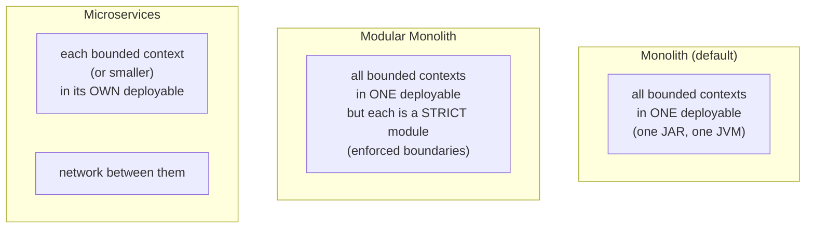
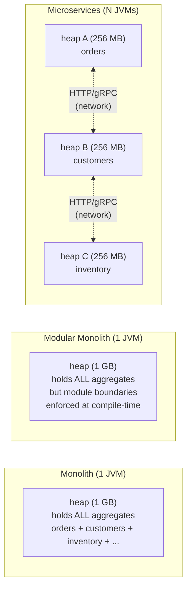
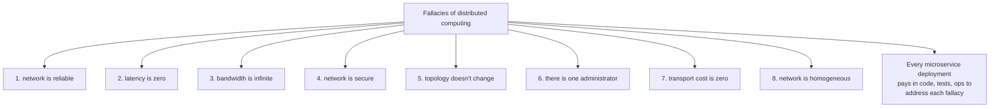
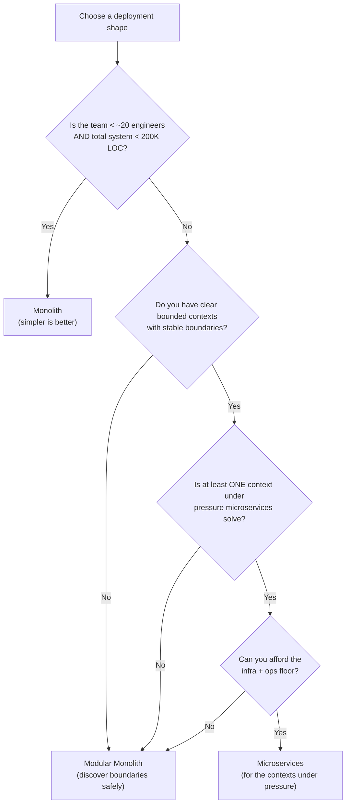
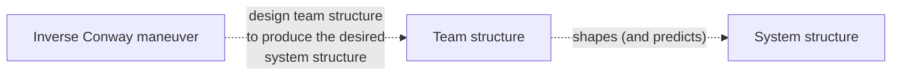

# Monolith vs Microservices vs Modular Monolith

A bounded context ([T03](./T03-domain-driven-design-ddd.md)) is a *logical* unit of internally-consistent vocabulary. **How** that bounded context is *deployed* — as one of N modules inside a single JVM, as a separately-deployable JVM (microservice), or as a strict module inside a deliberately-monolithic build — is one of the most consequential decisions a senior engineer makes about a system. The decision shapes the team structure, the CI/CD pipeline, the observability bill, the on-call rotation, the failure modes, and the speed at which features ship. It is also the decision teams most often get wrong, because the industry's dominant narrative shifted twice in fifteen years — from "monolith" (default until ~2012) to "microservices" (Netflix-era, 2014–2020) and now to "modular monolith / microservices for a reason" (2022 onward, post-Prime-Video and post-Segment). A senior engineer in 2026 needs to understand all three and the *evidence* for choosing among them — not the marketing.

The depth bar here is **operational, not philosophical**. We cover the JVM-level differences (one JVM with shared heap and in-process method calls vs N JVMs with separate heaps and network calls), the cost arithmetic (a microservice's true marginal cost is ~$300–$3,000/year of infra plus 0.3–0.5 of an SRE-day per year of toil, not the AWS bill), the well-named failure modes (the **distributed monolith**, the **fallacies of distributed computing**, the **two-phase deploy** problem), the production incidents that shaped the industry's view (the 2017 Segment migration from microservices back to monolith, the 2023 Amazon Prime Video migration in the same direction, the 2018 Istio team's own collapse, the 2015 Netflix incidents that made circuit breakers famous), the explicit Spring tooling for each path (`spring-boot` for either, Spring Modulith for modular monoliths, Spring Cloud for microservices) — and the team-and-deployment-flow consequences of each choice. We use the **Conway's Law** lens to read team structures as *predictions* of system structure, because they nearly always are, and we name the failure mode of choosing the wrong deployment shape for the team you actually have. By the end you will choose between the three deployment shapes with reasons, defend a modular monolith against pressure to "split into services for scaling" when scaling is not the bottleneck, and split a modular monolith into services *correctly* when it is.

> [!NOTE]
> Prerequisites: [Layered Architecture](./T01-layered-architecture.md) (`L5/C01/T01`); [Clean / Hexagonal / Onion](./T02-clean-hexagonal-onion-architecture.md) (`L5/C01/T02`); [Domain-Driven Design](./T03-domain-driven-design-ddd.md) (`L5/C01/T03`). The bounded contexts you identify with DDD are the *units* deployed by the architecture chosen here.

## Where Microservices Came From — The Real Origin Story

The microservices vocabulary that dominates 2014–2026 discussions did not arise from academic computer science. It arose from a **specific organizational crisis at a specific company** — Amazon, 2001–2002 — and was *retroactively* named and theorized by the industry. Understanding the actual lineage prevents the common error of treating microservices as an "advanced" pattern that all teams should aspire to; in reality, it was a *response to a particular kind of organizational pain* that most teams do not have.

### The Amazon Origin (2001–2006)

By 2001, Amazon was running a single monolithic C++ codebase called **Obidos**, which was the entire amazon.com website. Releases took weeks. A bug in the recommendation engine could take down checkout. Every team's changes had to be coordinated with every other team's changes. **The engineering organization was at ~3,000 engineers and growing; the monolith could not support that team size.**

Werner Vogels (who became Amazon CTO in 2005) and Jeff Bezos issued what later became known as the **"API Mandate"** around 2002. The (probably apocryphal but widely cited) memo reportedly read:

1. All teams will henceforth expose their data and functionality through service interfaces.
2. Teams must communicate with each other through these interfaces.
3. There will be no other form of inter-process communication allowed: no direct linking, no direct reads of another team's data store, no shared-memory model, no back-doors whatsoever. The only communication allowed is via service interface calls over the network.
4. It doesn't matter what technology they use.
5. All service interfaces, without exception, must be designed from the ground up to be externalizable. That is to say, the team must plan and design to be able to expose the interface to developers in the outside world. No exceptions.
6. Anyone who doesn't do this will be fired.

(Steve Yegge's 2011 [Google+ rant](https://gist.github.com/chitchcock/1281611) memorialized this and added context.)

The mandate was *not* about technical architecture — it was about **forcing service-team independence**. Vogels later said: "You build it, you run it." The architecture that emerged — many small services owned by small teams, communicating via HTTP — was the *consequence* of the organizational pressure, not the goal.

By 2006, Amazon was running thousands of services internally. Vogels gave a famous talk titled "[A Conversation with Werner Vogels](https://queue.acm.org/detail.cfm?id=1142065)" (ACM Queue, May 2006) describing the architecture. **This was the first widely-distributed description of what would later be called microservices.** Vogels did not use the term; he called it "Service-Oriented Architecture done right."

### The Netflix Lineage (2008–2014)

The second formative case was **Netflix's migration to AWS** from 2008–2012. The 2008 cause: a major data-center outage took Netflix's DVD-shipping monolith down for several days. Netflix made the strategic decision to migrate to AWS, with the architecture being **many small services with no single point of failure**.

Netflix open-sourced its supporting infrastructure between 2012 and 2014:

- **Hystrix** (Nov 2012) — the circuit breaker pattern, named.
- **Eureka** (Sep 2012) — service registry / discovery.
- **Zuul** (Jun 2013) — API gateway.
- **Ribbon** (Apr 2013) — client-side load balancing.
- **Archaius** (Jul 2013) — distributed configuration.

These tools were widely adopted (Spring Cloud Netflix was Spring's wrapping of them). The Netflix ecosystem became the *de facto* reference architecture for microservices in the JVM world.

### The Term "Microservices" — Coined In 2011

The actual term **"microservices"** was coined at a software architecture workshop in **Venice, Italy, in May 2011**, attended by a group including Adrian Cockcroft (then Netflix), James Lewis (ThoughtWorks), Martin Fowler (ThoughtWorks), and others. Lewis and Fowler wrote the canonical March 25, 2014 essay [*Microservices*](https://martinfowler.com/articles/microservices.html), which is the most-cited single source for the pattern.

Their definition crystallized the characteristics:
- Componentization via services (not libraries).
- Organization around business capabilities (Conway's Law applied deliberately).
- Products not projects (you build it, you run it).
- Smart endpoints, dumb pipes (logic in services, not in the bus).
- Decentralized governance (each team chooses its tech stack).
- Decentralized data management (each service owns its data).
- Infrastructure automation (CI/CD per service).
- Design for failure.
- Evolutionary design.

**Critically, the Lewis–Fowler essay did not advocate microservices universally.** It explicitly listed the *premium* — the additional cost of operating distributed systems — and warned that teams should not adopt microservices without genuinely paying that premium.

### The 2014–2018 Honeymoon, And The 2019+ Correction

Between 2014 and 2018, microservices were marketed (correctly identified, incorrectly applied) as the "modern" architecture. Conferences, vendor pitches, and tutorials presented microservices as the obvious upgrade from monoliths. **This produced a generation of services that were too small, too tightly coupled, and produced more operational pain than they solved.**

The correction began publicly in 2017 with [Segment's post-mortem of their migration from microservices back to a monolith](https://segment.com/blog/goodbye-microservices/), and accelerated through 2020–2023:

- **Segment** (2017): 140+ microservices → modular monolith. Cited operational overhead.
- **Amazon Prime Video** (March 2023): [Step Functions + Lambda microservices → monolith on EC2; 90% cost reduction](https://www.primevideotech.com/video-streaming/scaling-up-the-prime-video-audio-video-monitoring-service-and-reducing-costs-by-90).
- **Istio** (2020): consolidated its three control-plane microservices into a single `istiod` binary.
- **Sam Newman** (2024 *Monolith to Microservices* second edition): explicit reversal toward "modular monolith first."

The 2024+ industry consensus, captured in Newman's revised position: **modular monolith is the default; microservices for the contexts that genuinely justify them**.

### Why Modular Monolith Is The Current Default

The modular monolith vocabulary emerged independently from **Simon Brown's [Modular Monolith](https://www.codingthearchitecture.com/2015/03/08/package_by_component_and_architecturally_aligned_testing.html)** writings (2015+) and from the DDD community's bounded-context discipline. The 2023 release of **Spring Modulith** (Oliver Drotbohm, VMware/Spring team) was the framework-level endorsement: the Spring team explicitly built tooling for the modular-monolith pattern, signaling that it was the recommended default.

## Why This Decomposition Question Matters: The Senior Engineer's Q&A

### Q1: Why does this decomposition decision matter so much?

Because **it shapes every downstream cost for the next 5–10 years**. The decision determines:

- The CI/CD pipeline architecture (one or many).
- The deployment topology (one process or N processes).
- The team structure (one team or many small teams).
- The observability stack (in-process logs or distributed tracing required).
- The data architecture (one database or many).
- The release coordination overhead (one schedule or per-service).
- The on-call rotation count and complexity.
- The new-engineer onboarding cost.

Switching this decision later is one of the most expensive refactorings in software. **The Segment migration back to monolith took ~18 months of engineering time**; the Amazon Prime Video migration took ~6 months. Getting the decision right the first time, or being willing to reverse early before too much code is written, is the senior judgment.

### Q2: What forces drove Amazon to microservices that don't apply to most teams?

Amazon's specific pressures in 2001–2002:

- **~3,000 engineers** working on one codebase. Most teams have under 50.
- **Independent business units** with different release schedules. Most teams release together.
- **A single point of failure that affected revenue at internet scale**. Most teams' outages don't make Bloomberg.
- **A founder willing to mandate** the change at the executive level. Most teams cannot get executive-level mandates.
- **A revenue base that could fund** thousands of services' infrastructure costs. Most teams cannot afford the per-service floor cost.

When a startup with 10 engineers adopts microservices because "Amazon does it", they are *importing the cost* without having the underlying conditions that justify the cost. This is the most common architectural mistake of the 2014–2020 era.

### Q3: How does this map to Conway's Law?

Mel Conway's 1968 paper [*How Do Committees Invent?*](https://www.melconway.com/Home/Committees_Paper.html) observed:

> "Organizations which design systems ... are constrained to produce designs which are copies of the communication structures of these organizations."

The **forward direction**: a 20-team organization will produce a 20-component system, regardless of whether 20 components is technically optimal.

The **inverse direction** (the *Inverse Conway Maneuver*, attributed to Sam Newman and James Lewis): if you want a particular system architecture, structure your teams to produce it.

The microservices/modular-monolith decision is fundamentally a **team-structure question**. If the team is 8 engineers, no architecture supports them being "many teams" — they will produce a monolith no matter what the diagrams say. If the team is 200 engineers across 10 squads, no architecture forces them into a "single team" — they will produce a distributed system, and the question is only whether it's a coherent one or a distributed monolith.

### Q4: When does the cost of microservices stop being prohibitive?

Empirically, from public reports and the author's experience: **microservices begin to be cost-justified at ~30+ engineers organized into ≥3 teams with bounded contexts that genuinely diverge in release cadence, scaling profile, or compliance scope**. Below that threshold, modular monolith is cheaper.

The numerical reasoning:
- Per-service infrastructure floor cost: ~$1–3K/year per service (in AWS).
- Per-service operational overhead: ~10–20 engineer-hours/year for routine maintenance.
- Per-service onboarding cost: ~1–2 days per new engineer per service they touch.

At 5 services × 5 engineers × 200 engineers in onboarding rotation × $200K/engineer fully loaded, the operational tax is around $50K/year just in *engineer time consumed by service operation*. That's ~10% of a junior engineer. Trivial at 50 engineers; significant at 5.

### Q5: How does this compare to SOA?

Service-Oriented Architecture (SOA, ~1996, popularized 2003–2008 in J2EE/.NET environments) was the *previous* "many services" architecture. The differences:

| Dimension | SOA | Microservices |
|-----------|-----|---------------|
| Communication | Heavy: SOAP/WS-*, XML, ESB | Light: HTTP/JSON, gRPC, Kafka |
| Coordination | Enterprise Service Bus (centralized) | Smart endpoints, dumb pipes |
| Data | Shared canonical models | Per-service databases |
| Team ownership | Often shared services | Strict service ownership |
| Deployment | Coordinated, infrequent | Independent, frequent |
| Tools | WebSphere, BizTalk, TIBCO | Spring Boot, Docker, Kubernetes |

The cynical (and partly correct) summary: **microservices is SOA without the ESB**. The deeper truth: microservices internalized the lessons of SOA's failures — centralized integration buses don't scale, shared canonical models become committee paralysis, coordinated deployments lose the benefits of service decomposition.

### Q6: What is a "distributed monolith" and why is it so common?

A distributed monolith is a microservices deployment that pays *all* the costs of distribution (network calls, separate deployments, observability complexity) and gets *none* of the independence benefits because the services are still tightly coupled. Symptoms:

- A release to service A requires coordinated releases to services B and C.
- A schema change in service A breaks consumers in service B without backward compatibility planning.
- A test of any one service requires running 5–10 others.
- An incident in any one service takes down the others through cascading sync calls.
- Developers cannot run the full system locally; only in a shared dev environment.

**This is the most expensive architecture in software.** It is more expensive than a monolith (because of the distribution costs) and more expensive than properly-decoupled microservices (because the coupling defeats the decoupling investment).

The cause is almost always: the team adopted microservices without doing the bounded-context work first. Without genuine bounded contexts ([T03](./T03-domain-driven-design-ddd.md)), splitting by file or by "module" produces network calls between code that should have been a method call.

The cure: **collapse back to a modular monolith, do the bounded-context work, then split only the contexts that actually justify splitting**.

## The Mechanism In Depth — What Changes At The JVM And Operating-System Level

The diagram of "one JVM vs N JVMs" hides specific mechanical consequences.

### One JVM, N Services (Monolith / Modular Monolith)

A Spring Boot monolith with 8 modules runs as **one OS process, one JVM heap, one classloader hierarchy**. The Linux process table has one entry. The kernel scheduler treats it as one cgroup. Method calls between modules are **direct virtual dispatches**: ~1 ns. Memory references between modules share the same heap, so passing an object reference is free.

Specific consequences:

- **Cross-module transactions are real** — a single `@Transactional` annotation spans all modules called within it. JPA flushes all changes at commit; if any fail, all roll back.
- **Memory pressure is shared** — a leak in one module degrades the whole JVM. The GC pauses affect everyone.
- **Deployment is atomic** — all 8 modules are in the same JAR; redeploying any redeploys all.
- **CI is shared** — one test suite runs for any change.

### N JVMs, N Services (Microservices)

A microservices deployment runs as **N OS processes, N JVM heaps, N classloader hierarchies**, typically in N containers. Each has its own `java` binary in its container, its own ~500 MB resident memory floor (JVM heap + metaspace + Spring context overhead), its own GC pauses, its own log streams.

Cross-service calls require:
1. The caller's JDBC/HTTP/gRPC client serializes the request (typical 5–50 µs for JSON, less for Protobuf).
2. The kernel's TCP/IP stack sends bytes (typical 0.5–1 ms within a data center, 30–100 ms cross-region).
3. The receiver's server framework deserializes (5–50 µs).
4. The receiver's business code runs.
5. The reverse path for the response (5–50 µs serialize, 0.5–1 ms network, 5–50 µs deserialize).

**Total per cross-service call**: ~1–2 ms data-center-local, ~10–20 ms cross-region, vs ~1 ns for the equivalent in-monolith method call.

This is the **6 orders of magnitude** difference. A request that touches 5 services within a data center pays ~5–10 ms in network overhead alone. The same request inside a monolith pays *nanoseconds*. For a request budget of 50 ms p99, the microservices overhead consumes 10–20% of the budget on coordination, not application logic.

### Memory Footprint Multiplied

A Spring Boot service with no traffic has a memory floor of roughly:
- **JVM** (HotSpot): ~150 MB (metaspace + code cache + JVM internals).
- **Spring context** (typical service): ~200 MB (bean definitions, proxies, autoconfiguration).
- **Heap allocation** (idle workload): ~100 MB working set.

Total: **~450 MB per idle service**. For a 30-service microservices deployment, the cluster memory floor is **~13.5 GB before any traffic arrives**, vs a monolith's single ~500 MB process. Container density on a 32 GB Kubernetes node drops from ~60 monolith instances to ~70 microservice instances (sharing nodes), and each service requires multiple instances for HA.

The real-world cost: **3–5× the cloud-compute spend for the same workload as microservices vs as a modular monolith**, before counting the observability infrastructure, the per-service load balancers, the cross-service network tax. This is the cost data that drove Prime Video's 90% reduction on migration back.

## Common Misconceptions Explained

### "Microservices scale better than monoliths."

False. **Monoliths scale horizontally just fine** — add more instances behind a load balancer. The Stack Overflow Q&A site ran on a 9-server .NET monolith for over a decade serving billions of requests/year. Shopify's Rails monolith handles Black Friday at scale. What microservices give you is **independent scaling per service**, which is a *cost optimization* (don't scale the whole monolith when only one component is hot), not a *throughput ceiling* lift.

### "Microservices isolate failures."

Half true. **Fault isolation only works if the inter-service calls are async or have proper resilience patterns** (circuit breakers, timeouts, bulkheads). A sync call chain of services A→B→C without resilience has *worse* fault isolation than a monolith, because each link can fail independently. Most teams ship sync microservices without circuit breakers and discover this the hard way.

### "Microservices enable continuous deployment."

Half true. **A modular monolith with feature flags and CI/CD can deploy as often as microservices** — Shopify deploys their Rails monolith ~100 times per day. What microservices add is *independent* deployment per service, which matters when teams release on different cadences. If all teams release together, microservices add complexity without enabling anything new.

### "Microservices reduce team coupling."

Half true. **Team coupling is determined by the API contracts and the data flows, not by the deployment topology**. Two microservices teams that share a Kafka topic schema, or call each other's HTTP APIs frequently, are tightly coupled. The deployment-time independence is a *consequence* of clean API design, not a substitute for it.

### "Modular monoliths are just monoliths."

False. The distinguishing feature is **enforced module boundaries**. Spring Modulith uses package-info annotations to declare what each module exposes and verifies (at build time) that other modules only import the exposed types. This is enforced; in a "regular" monolith, there is no enforcement, just convention. The modular monolith is closer to "many microservices in one JVM" than to "everything imports everything."

### "You can't have polyglot languages in a monolith."

True with caveats. A JVM monolith is mostly limited to JVM languages (Java, Kotlin, Scala, Clojure all coexist in one JAR), but graalvm native images can mix in Python and JavaScript. Microservices' polyglot advantage is *significant* when one component needs Rust performance or Python ML, *insignificant* when the team would never actually use anything but Java.

## The Three Shapes — Definitions



**Monolith.** A single deployable artifact — one JAR, one process, one JVM heap — containing every bounded context. Internal communication is method calls. The database is usually a single instance with all schemas, all foreign keys, all rows. Deployment is one release at a time; if any part of the codebase changes, the whole thing redeploys.

**Modular Monolith.** Same single-deployable shape, but the bounded contexts are *strictly* modularized — separate Maven/Gradle subprojects, separate JPMS modules, separate packages with build-time-enforced visibility rules, separate database schemas — *as if* they were microservices, except they share a JVM and a deployment. The internal calls remain in-process; the modularity is *future-optional* (any module can be lifted out into a microservice later) and *immediately-valuable* (the build refuses cross-module shortcuts).

**Microservices.** Each bounded context (or smaller — there is no rule that a service equals a context) deploys as its own process: its own JVM, its own JAR, its own database, its own scaling profile, its own deployment pipeline, its own on-call. Communication between services crosses the network — HTTP/REST, gRPC, Kafka, RabbitMQ.

These are **deployment shapes**, not architectural styles. A monolith can be layered, hexagonal, or anemic; a microservice constellation can be any combination. The shape is about *the unit of deployment and its operational consequences*. Picking the wrong shape doesn't just inconvenience engineers — it changes the production cost structure by an order of magnitude.

## The JVM Picture — Where Are The Heaps

The clearest way to see the difference is to draw the JVMs.



In a monolith, an `OrderService` calls `customerService.findById(id)` and the JVM dispatches to a method on a heap-resident object in **~10 ns**. In a microservices deployment, the same call becomes an HTTPS request to a different process — TCP, TLS handshake (once per connection), JSON serialization, network hop, deserialization, JSON serialization, network hop back, deserialization — **~1,000,000 ns (1 ms)** on a healthy local network, **10–50 ms** across availability zones.

**Five orders of magnitude.** Every microservice boundary is a 100,000× slowdown of a method call. This is not a "performance concern" that diligent engineering tunes away; it is a *fundamental property* of network communication that shapes how the system must be designed (batching, caching, denormalization, asynchronous flows). Teams that build microservices without internalizing this build distributed monoliths.

## The Three Shapes In Spring Boot — The Idiomatic Code

A four-context system (Orders, Customers, Inventory, Shipping) in each shape.

### Shape 1: Monolith

```text
com.shop                              ← one Spring Boot app
├── ShopApplication.java              (@SpringBootApplication)
├── orders/                           (no module boundary — just a package)
│   ├── OrderController, OrderService, OrderRepository
├── customers/
├── inventory/
└── shipping/

build.gradle: one project, one JAR, one CI/CD pipeline.
Database: one PostgreSQL with all schemas.
Deployment: one image, one process.
```

Cross-context calls are in-process Spring beans:

```java
@Service
class OrderService {
  @Autowired CustomerService customerService;     // <-- different context, same JVM, just a method call
  void place(Order o) {
    Customer c = customerService.findById(o.customerId());
    // ...
  }
}
```

Nothing prevents anyone from making this call. The package boundary is a convention.

### Shape 2: Modular Monolith

```text
shop (parent gradle project)
├── shop-app/                         ← Spring Boot launcher, depends on ALL modules
├── shop-orders/                      ← Maven module / Gradle subproject
│   ├── api/                          (public types — what other modules may use)
│   ├── domain/, adapter/, config/    (internal — hidden behind module barrier)
├── shop-customers/
├── shop-inventory/
└── shop-shipping/

build.gradle: multi-project build. shop-orders depends on shop-customers-api,
NOT on shop-customers-domain. Compile fails if a domain class crosses.
```

Spring Modulith makes this an explicit framework feature (Spring team, 2023+):

```java
@SpringBootApplication
@Modulith                              // <-- declares this is a modular monolith
public class ShopApplication { }
```

Each module is annotated:

```java
@ApplicationModule(allowedDependencies = {"customers::api"})
package com.shop.orders;               // package-info.java
```

The orders module is *only* allowed to depend on the `customers::api` package — any other import from `customers::*` fails the Spring Modulith verifier:

```java
@Test
void modulesShouldBeWellFormed() {
  ApplicationModules.of(ShopApplication.class).verify();
}
```

Cross-module communication often switches to **events** (the same Spring `ApplicationEventPublisher` you'd use within a single module, see [T03](./T03-domain-driven-design-ddd.md)), keeping calls in-process but decoupled at the type level:

```java
@Service
class OrderService {
  private final ApplicationEventPublisher events;
  void place(Order o) {
    // ... persist order ...
    events.publishEvent(new OrderPlaced(o.id(), o.customerId()));
  }
}
// In the customers module:
@TransactionalEventListener(phase = AFTER_COMMIT)
void on(OrderPlaced event) {
  customerService.awardLoyaltyPoints(event.customerId());
}
```

The shipping module subscribes to the same event. **No module has a compile-time dependency on another module's internals.** Future microservice extraction is a refactor away — you move one module to its own deployment, replace the in-process publisher with a Kafka publisher, and the rest doesn't change.

### Shape 3: Microservices

```text
shop-orders/        (Spring Boot app)
shop-customers/     (Spring Boot app)
shop-inventory/     (Spring Boot app)
shop-shipping/      (Spring Boot app)

4 git repos (or 4 paths in a monorepo), 4 Dockerfiles, 4 CI/CD pipelines,
4 PostgreSQL databases (or 4 schemas + strict access controls).
```

Cross-context calls become network calls:

```java
@Service
class OrderService {
  private final CustomerClient customerClient;          // wraps RestClient/gRPC
  void place(Order o) {
    Customer c = customerClient.findById(o.customerId());     // <-- HTTP over the network
    // ...
  }
}
```

Every cross-context call now lives on a network, with all that implies: timeouts, retries, circuit breakers ([T14](../C02-distributed-systems-and-system-design/T14-resilience-circuit-breaker-bulkhead-retry-timeout-backpressure.md)), distributed tracing ([L4/C10](../../L4-backend-engineering/C10-devops-and-observability/)), and the **fallacies of distributed computing** (see below).

## The Eight Fallacies of Distributed Computing — Why Microservices Are Hard

L. Peter Deutsch (1994, plus James Gosling's later addition) catalogued the **eight false assumptions** every engineer new to distributed systems makes:

1. **The network is reliable.** It isn't. Cables get cut, switches reboot, packets get lost.
2. **Latency is zero.** It isn't — see the 100,000× slowdown above.
3. **Bandwidth is infinite.** It isn't, and busy services share it.
4. **The network is secure.** It isn't — every cross-service link is an attack surface.
5. **Topology doesn't change.** It does — instances scale, IPs change, DNS lies.
6. **There is one administrator.** There isn't — each service is owned by a team.
7. **Transport cost is zero.** It isn't — TLS, serialization, and TCP overhead are real.
8. **The network is homogeneous.** It isn't — versions diverge across services.



A monolith is a **single trusted address space**. Method calls don't fail mid-execution. Bytes don't reorder. All eight fallacies are absent. Microservices' largest hidden cost is the engineering investment in mitigating each fallacy — retry libraries, idempotency keys ([T07](../C02-distributed-systems-and-system-design/T07-idempotency-and-deduplication.md)), distributed tracing, mutual TLS, schema registries, contract testing. None of this code adds business value; all of it is plumbing that a monolith does not need.

## The Cost Arithmetic — What Each Shape Actually Costs

Engineers often compare shapes by "how easy is local dev" or "is the AWS bill bigger." Neither is the actual cost. The real costs:

### Monolith Costs

| Cost | Magnitude | Notes |
|------|----------:|-------|
| **Single point of deployment failure** | High | One bad release breaks every feature. |
| **Coordination tax** | Grows quadratically with team size | 200 engineers on one repo = constant merge pain, slow CI, sequential releases. |
| **Long CI/CD pipelines** | Hours | Full test suite re-runs on every change. |
| **Technology lock-in** | High | Can't switch to Kotlin for one feature, can't try GraalVM in one corner. |
| **Resource over-provisioning** | Medium | Whole JVM scales because one part is hot. |
| **Database becomes the bottleneck** | High | One database, one connection pool, one place schema migrations contend. |
| **Onboarding cost** | High past ~100K LOC | Reading 1M lines is harder than reading 50K × 20. |

### Microservices Costs

| Cost | Magnitude | Notes |
|------|----------:|-------|
| **Network tax on every call** | ~1 ms / call | 100,000× slower than method call. Designs must batch and cache. |
| **Distributed-tracing infrastructure** | $50K–$500K/year | Datadog, Honeycomb, Jaeger — and the engineers to use them. |
| **Per-service infra floor** | $1K–$10K/year/service | EKS slot, ALB, RDS, CloudWatch, secrets, IAM, even at low traffic. |
| **Operational complexity** | Linear in service count | On-call, runbooks, incident playbooks, dependency dashboards. |
| **Cross-service refactor cost** | Up to 10× | Renaming a field requires coordinated releases across services. |
| **Distributed transaction complexity** | High | No 2PC at internet scale; sagas + idempotency required ([T10](./T10-saga-pattern-distributed-transactions.md)). |
| **Local dev complexity** | High | Need every service running locally, or stubs, or staging — none ideal. |
| **Schema-evolution coordination** | Linear in consumers | Every consumer's deployment must accept old and new producer versions. |

The infra floor is the most-underestimated number. At a previous role, a team had 47 microservices each averaging ~$1,800/year in fixed infra (cluster slot, load balancer, RDS instance, secrets, ingress, log volume, CloudWatch dashboards). $84,600/year for *the floor*, before traffic — equivalent to a junior engineer's annual cost. They had four engineers. The arithmetic was wrong.

### Modular Monolith Costs

| Cost | Magnitude | Notes |
|------|----------:|-------|
| **Module-boundary discipline** | Medium | The build refuses shortcuts; engineers must use the API surface. |
| **Single deployment** | Same as monolith | One bad release breaks everything. |
| **Single tech stack** | Same as monolith | All modules are JVM (or whatever the host runtime is). |
| **Cross-team coordination on shared infra** | Lower than monolith | Module owners are clear; conflicts are local. |
| **Future microservice extraction** | Low | The module boundary is already the service boundary. |

Modular monolith's value proposition: **keep most of the monolith's operational simplicity, gain most of microservices' modularity benefits, defer the decision to split until proven necessary.** Sam Newman, who wrote the standard microservices book, made this the explicit advice of his 2024 *Monolith to Microservices* second edition: "the modular monolith is where most teams should be."

## When To Choose Which — A Decision Framework

The decision is not "monolith vs microservices." It is "what is the bottleneck pushing me away from the simpler shape?"



**Pressures microservices solve** (and a monolith does not):

1. **Independent deployment cadence**: one context releases 10x/day, another quarterly. Forcing both into one pipeline taxes both.
2. **Independent scaling**: one context handles 10× the traffic of others. A monolith scales all-or-nothing.
3. **Independent failure isolation**: one context has 99% SLO requirements; others 99.99%. Monoliths share fate.
4. **Polyglot need**: one context legitimately needs Rust or Go (rarely true — usually a preference, not a need).
5. **Team scaling beyond Dunbar**: a monolith with 200+ engineers stops being one team's product.

**Pressures microservices *do not* solve** (despite the marketing):

- "We want clean architecture." (Modular monolith does this.)
- "We want fault isolation." (Modular monolith with module-level circuit breakers does most of this in-process.)
- "Performance." (Microservices usually make performance *worse* due to network tax.)
- "Modern tech stack." (Use newer Spring versions in the monolith.)
- "Teams want to work independently." (Conway's Law fix is module ownership, not separate processes.)

## Real Migrations — Lessons From Production

### Segment (2017) — Microservices → Monolith

[Segment published](https://segment.com/blog/goodbye-microservices/) their 2017 migration from 140+ microservices back to a monolith. The driver: every event-routing change touched 5–10 services with separate releases. Their conclusion: "Microservices [had] enabled a small team to deliver complex software… [but] we crossed the point where the operational overhead exceeded the architectural benefit." The monolith they returned to was modular — strict internal module boundaries, single deployment.

**Lesson**: microservice count is a cost. Every service added is an annual ops bill. Below the inflection point, monoliths win.

### Amazon Prime Video (2023) — Microservices → Monolith

[Prime Video's audio/video monitoring team published](https://www.primevideotech.com/video-streaming/scaling-up-the-prime-video-audio-video-monitoring-service-and-reducing-costs-by-90) their migration of a Step Functions + Lambda microservice constellation back to a monolith on EC2. **90% cost reduction**, more capacity, simpler operations. The driver: per-frame inter-service serialization and S3 round-trips dominated cost; collapsing to a single process eliminated them.

**Lesson**: microservices' network and serialization taxes are not subtle at high throughput. Specific workloads (image/video processing, anything compute-heavy with frequent inter-service data shuttling) often fit a monolith better. The lesson is *not* "microservices are bad" — Amazon overall remains heavily microservice — but "the choice must follow the workload, not the org's default."

### Istio (2018) — Microservices → Modular Monolith Plane

Istio's control plane was initially three microservices (Pilot, Citadel, Galley). Operators struggled with the three-deployment surface. In 2020 (Istio 1.5), the project [merged them into a single `istiod` binary](https://istio.io/latest/blog/2020/istiod/), explicitly citing "the operational complexity of running three services was not worth the modularity." This is **a project that builds microservices infrastructure** deciding its own infrastructure should be a monolith.

**Lesson**: the people closest to microservices' operational reality choose monoliths for their own internal tooling.

### Netflix (2009–2014) — Monolith → Microservices

The canonical microservices success story. Netflix's 2008 outage on a single Oracle database drove a multi-year migration to a microservices architecture on AWS, eventually open-sourcing the **Hystrix circuit breaker** (2012), the **Eureka service registry** (2012), and the **Zuul gateway** (2013). The migration succeeded because (a) Netflix had genuine independent-scaling pressures (recommendations served 100× the volume of catalog edits), (b) had the engineering investment to build the infrastructure, and (c) accepted the operational cost.

**Lesson**: microservices succeed when the team has the *real* pressures and the *real* engineering capacity to absorb the cost. Netflix did. Most teams that adopt microservices on Netflix's example do not have either.

### Uber (2014–2019) — From Monolith To Microservices To "Service Domains"

Uber went to 2,200+ microservices and then in 2020 [restructured to "Service Domains"](https://www.uber.com/blog/microservice-architecture/) — clusters of services owned by a single team, with strict cross-domain interfaces. The new boundary is *between domains* (essentially bounded contexts), not between every individual service. The internal organization re-recognized bounded contexts after fragmenting too far.

**Lesson**: the natural unit of independent deployment is the **bounded context**, not the individual class or use case. When teams over-split into nanoservices, they re-discover this the hard way.

## The Distributed Monolith — The Worst Of Both

A **distributed monolith** is a microservices deployment where the services are so coupled that they must be released together. Symptoms:

- A release to service A requires a coordinated release to services B and C.
- A test of any service requires running ten others.
- A schema change in one service breaks consumers.
- Tracing a single user request requires correlating logs across 15 services.
- The on-call playbook says "restart all services in this order."

The distributed monolith pays *every* microservice cost (network tax, infra floor, ops complexity) and gets *zero* microservice benefit (no independent deployment, no independent scaling, no fault isolation). It is the most expensive deployment shape in software.

The path that produces it: a team adopts microservices for the *modularity* benefit without enforcing actual bounded-context boundaries. Services emerge that are not autonomous — they share schemas, share types, share assumptions about each other's behavior. Each "microservice" is really a *layer* of one application, deployed in its own process.

**The cure is the modular monolith.** If your microservices can't be released independently, collapse them. If a modular monolith doesn't relieve the coordination, the problem isn't the deployment shape; it's the bounded contexts (or absence thereof). Fix DDD before microservices.

## Conway's Law — The Hidden Variable

Mel Conway's 1968 observation: *organizations design systems whose structure is a copy of the organization's communication structure*. A monolith deployed by a 200-engineer org will be organized internally into 8–10 fiefs; a microservice deployment will have a service per fief regardless of whether the contexts justify it.



The **inverse Conway maneuver**: if you want a clean modular monolith, structure the team so each module has *one* owning subteam with a clear lead and minimal dependencies on others. If you want microservices, structure the team so each service is the work product of one owning subteam — *not* a team that "owns five services." A team that owns five services will produce a distributed monolith because their internal communication is one team.

The Conway lens for the decision:

- **Small, single team**: monolith.
- **Multiple teams, single product, < 5 contexts**: modular monolith.
- **Multiple teams, multiple products, clear context-team alignment**: microservices for the boundaries that align.
- **Many small teams, no context-team alignment**: fix the team structure before the architecture.

## How Each Shape Looks Under Load — Operational Differences

A 1000 req/s service, broken down.

### Monolith Under Load

- **Memory**: 4–16 GB per JVM, all aggregates in one heap. G1 GC pauses scale with heap; tuning matters.
- **CPU**: One process per host; horizontal scaling adds replicas.
- **Database**: One PostgreSQL primary, perhaps read replicas. Schema migrations are atomic.
- **Deployment**: One rolling restart updates everything. Bad release → all-or-nothing rollback.
- **Failure mode**: Process crash takes everything down. Mitigated by horizontal replicas.

### Modular Monolith Under Load

- Same as monolith. The internal modularity is invisible at runtime.
- **Difference at upgrade time**: a team can change their module without touching others' code, but the deployment still co-releases.

### Microservices Under Load

- **Memory**: 256 MB – 1 GB per JVM × N services. Total memory often *higher* than the monolith due to per-JVM overhead.
- **CPU**: N independent processes; each scales independently.
- **Database**: N databases (or N schemas), N connection pools. Cross-context queries become RPCs.
- **Deployment**: N pipelines. Service A can release 10/day; service B once a week. Each release is small and reversible.
- **Failure mode**: Service B crashes → service A sees timeouts and (with a circuit breaker) degrades gracefully. Independent failure if architected for it; cascading failure if not (see [T14](../C02-distributed-systems-and-system-design/T14-resilience-circuit-breaker-bulkhead-retry-timeout-backpressure.md)).

### Network Footprint

For a request that touches 5 contexts:

- Monolith: 5 in-process method calls (~50 ns total).
- Modular monolith: 5 in-process method calls or events (~50 ns – 1 µs).
- Microservices: 5 HTTPS calls (~5 ms typical, 30 ms p99, ~50 ms p99 with retries).

**Microservices' tail latency is dramatically worse** because each network call has its own tail. p99 latency of a request crossing five services is not 5 × p99(call) — it's worse (the request's p99 is the max of 5 call latencies, which sits well above any individual p99). This is why high-quality microservice systems aggressively limit cross-service hops per request.

## Spring Modulith — The Spring-Native Path

Spring Modulith (Spring team, GA 2023) is the framework's explicit recognition that modular monoliths are the right default.

```java
// One Spring Boot app, multiple modules
@SpringBootApplication
public class ShopApplication { }

// Module declared via package-info.java
@ApplicationModule(displayName = "Orders")
package com.shop.orders;

// API package — what other modules may use
package com.shop.orders.api;
public interface OrderQuery { Order find(OrderId id); }

// Internal package — hidden from other modules
package com.shop.orders.internal;
class OrderRepository { /* ... */ }

// Verification test
@Test
void modulesShouldBeWellFormed() {
  var modules = ApplicationModules.of(ShopApplication.class);
  modules.verify();           // <-- compiles? then this passes; misuse? this fails the build
}
```

Out of the box, Spring Modulith provides:

- **Module-boundary verification** at build time.
- **Cross-module event publishing** via Spring's `ApplicationEventPublisher`, with optional persistent event log (for replay and recovery).
- **Module-level integration tests** (`@ApplicationModuleTest` boots just one module).
- **Documentation generation** (PlantUML / AsciiDoc diagrams of modules).
- **Outbox pattern** support for events that need at-most-once delivery to a future Kafka adapter.

If you are starting a new Java backend in 2026 with multiple bounded contexts and uncertain microservice need, Spring Modulith is the default starting point. Newman, Vernon, and most senior Java engineers converge on this advice.

## When Microservices Are The Right Answer — A Short List

To balance the skeptical tone:

1. **Independent scaling, with measured 10×+ traffic asymmetry.** A read-heavy recommendation service alongside a low-volume admin service genuinely benefits from separate deployment.
2. **Hard team ownership boundaries that cannot align in a monolith.** Twenty teams, ten years, half a million LOC.
3. **Genuine polyglot needs.** ML inference in Python, transactional core in Java, edge layer in Go — when each language is *required*, not preferred.
4. **Different compliance scopes.** A PCI-DSS context can be a microservice with strict network isolation; the rest of the system stays out of the audit scope.
5. **Different deployment cadences.** A safety-critical context on a quarterly release cycle, a feature-rich context shipping daily.

If two or more of these hold, microservices for those boundaries are likely correct. If none hold, the burden of proof against the monolith is on the proposer.

## Cross-Language Notes — Monolith / Microservices In Other Ecosystems

| Ecosystem | Default | Notes |
|-----------|---------|-------|
| **Java / Spring Boot** | Modular monolith (rising), microservices for scale | Spring Modulith makes modular default; Spring Cloud for MS. |
| **C# / .NET** | Same trajectory as Java | Aspnet Boilerplate, ABP Framework target modular monoliths. |
| **Ruby on Rails** | Monolith | Shopify, GitHub, Basecamp run famously large Rails monoliths (Shopify is hundreds of GB of code). |
| **Python / Django** | Monolith | Django apps as modules; microservices for compute-heavy paths. |
| **Node.js** | Microservices over-represented | The Node ecosystem heavily defaulted to small services; same trends pulling back. |
| **Go** | Microservices over-represented | Same — Go's deployment-friendliness made services cheap; the team-cost arithmetic is now reversing the trend. |
| **Rust** | Monolith for transactional cores | Compile times push toward fewer, larger services; rust-axum monoliths are common. |
| **Elixir / Phoenix** | Monolith with internal supervision | The actor model gives in-process fault isolation that mimics microservice failure boundaries. |

Elixir/Erlang deserve a callout: their **OTP supervisor trees** provide *in-process fault isolation* that other languages need separate processes for. A Phoenix monolith with a thousand supervised actors achieves much of microservices' fault-tolerance with one deployment. This is what every other ecosystem is partially reaching for with module-level circuit breakers and bulkheads.

## Trade-Off Summary

| Dimension | Monolith | Modular Monolith | Microservices |
|-----------|:--------:|:----------------:|:-------------:|
| **Deploy unit** | 1 | 1 | N |
| **Cross-context call cost** | ~10 ns | ~10 ns | ~1 ms |
| **Database** | 1 | 1 (often 1 schema per module) | N |
| **Team independence** | Low | Medium | High |
| **Independent scaling** | No | No | Yes |
| **Independent deployment cadence** | No | No | Yes |
| **Operational complexity** | Low | Low | High |
| **Infra floor cost** | 1× | 1× | N× |
| **Distributed-system concerns** | None | None | All eight fallacies |
| **Refactor speed** | Fast | Fast | Slow (cross-service) |
| **Onboarding** | Hard at scale | Medium | Hard (which service?) |
| **Future migrate-out cost** | High | Low | N/A |
| **Best for** | Single team, single product, < 200K LOC | Multiple teams, single product | Independent scaling / org / compliance pressure |

The diagonal is the only honest summary: **start in the column on the left; move right only when the team's pain is in the row that the column to the right addresses.**

> [!INTERVIEW]
> A common L5 prompt: "When would you choose microservices over a monolith?" A weak answer recites benefits (scaling, polyglot). A strong answer recites *pressures* — independent deployment cadence, independent scaling at 10×+ asymmetry, hard team boundaries — and explicitly says "if none of these apply, a modular monolith is the better choice in 2026." Strong answers also name a real migration story (Segment, Prime Video, Istio) to ground the position.

## Deeper Dive — Spring Modulith Modular Monolith

### Setup

```xml
<!-- pom.xml -->
<dependency>
    <groupId>org.springframework.modulith</groupId>
    <artifactId>spring-modulith-starter-core</artifactId>
    <version>1.2.0</version>
</dependency>
<dependency>
    <groupId>org.springframework.modulith</groupId>
    <artifactId>spring-modulith-starter-test</artifactId>
    <version>1.2.0</version>
    <scope>test</scope>
</dependency>
<dependency>
    <groupId>org.springframework.modulith</groupId>
    <artifactId>spring-modulith-events-kafka</artifactId>
    <version>1.2.0</version>
</dependency>
```

### Module Definition via Package Structure

```
src/main/java/com/example/shop/
├── ShopApplication.java
│
├── catalog/                      # Module: Product Catalog
│   ├── Product.java              # Internal — not exposed
│   ├── ProductRepository.java    # Internal
│   ├── ProductService.java       # Internal
│   │
│   └── api/                      # Public API
│       ├── ProductApi.java       # Interface other modules use
│       └── ProductView.java      # DTO other modules see
│
├── orders/                       # Module: Orders
│   ├── Order.java
│   ├── OrderRepository.java
│   ├── OrderService.java
│   │
│   └── api/
│       ├── OrderApi.java
│       └── OrderEvents.java      # Events published
│
├── inventory/                    # Module: Inventory
│   ├── ...
│   └── api/
│       └── InventoryApi.java
│
└── payments/                     # Module: Payments
    └── ...
```

### Module Verification Test

```java
@SpringBootTest
class ApplicationModulesTests {
    
    @Test
    void verifyModuleStructure() {
        ApplicationModules.of(ShopApplication.class).verify();
    }
    
    @Test
    void documentModules() {
        Documenter documenter = new Documenter(ApplicationModules.of(ShopApplication.class));
        documenter.writeDocumentation();   // Generates module diagrams
    }
}
```

### Module Boundaries Enforced

```java
// Inside catalog module
package com.example.shop.catalog;

@Service
public class ProductService {
    private final ProductRepository repo;   // Same module: OK
    private final InventoryService inv;     // ← FORBIDDEN!
                                            // Cross-module direct reference
                                            // verify() will FAIL
}

// Correct: use API
@Service
public class ProductService {
    private final ProductRepository repo;
    private final InventoryApi inventoryApi;  // ← Use API interface
}
```

### Cross-Module Communication via Events

```java
// In catalog module - publishes event
package com.example.shop.catalog;

@Service
public class ProductService {
    private final ApplicationEventPublisher events;
    
    @Transactional
    public void publishProduct(Product product) {
        repo.save(product);
        events.publishEvent(new ProductPublishedEvent(product.getId(), product.getName()));
    }
}

// In inventory module - listens
package com.example.shop.inventory;

@Component
class InventoryListener {
    
    @ApplicationModuleListener   // Spring Modulith handles transactional boundary
    void on(ProductPublishedEvent event) {
        // Runs in own transaction after catalog's commit
        inventoryService.createInventoryEntry(event.productId(), 0);
    }
}
```

## Deeper Dive — Distributed Monolith Anti-Pattern in Detail

### Signs You Have a Distributed Monolith

```
TEST 1: Can you deploy service A without coordinating with anyone?
  ❌ "We need to deploy A and B together" → distributed monolith

TEST 2: Does service A's database schema change require service B to update?
  ❌ Yes → distributed monolith (shared coupling)

TEST 3: When service A is down, does service B's user request fail?
  ❌ Yes for non-critical features → over-coupling

TEST 4: Does a request to your system synchronously call 5+ services?
  ❌ Yes → high coupling

TEST 5: Do you have shared utility libraries that all services depend on?
  ❌ Updates require all services to redeploy → coupling

TEST 6: Do tests require multiple services to be running together?
  ❌ Yes for unit tests → bad isolation
```

### Real Example: Segment's Mistake

```
SEGMENT (2018):
  Had monolith handling event ingestion
  Migrated to 140+ microservices
  
PROBLEMS:
  - Operational complexity exploded
  - Deploy times got slower (had to deploy in coordination)
  - Cost ballooned (140 services × infrastructure)
  - Customer complaints about reliability
  
SOLUTION (2019):
  Reverted to single "centrifuge" service
  Consolidated 140 services back into 1
  Result: better reliability, lower cost, faster deploys
  
LESSON: microservices have a real operational tax. If you don't 
need them, you're paying without benefit.
```

## Deeper Dive — Migration Decision Framework

### Diagnostic Questions

```
1. TEAM SIZE
   < 10 engineers:         MONOLITH
   10-30:                  MODULAR MONOLITH
   30-100:                 CONSIDER MICROSERVICES
   100+:                   MICROSERVICES LIKELY

2. DEPLOYMENT VELOCITY
   1 deploy/week or less:  MONOLITH FINE
   Multiple/day per team:  MICROSERVICES MIGHT HELP
   
3. INDEPENDENT SCALING
   All components scale together: MONOLITH
   10× asymmetry between components: MICROSERVICES

4. POLYGLOT NEEDS
   Single language fine:    MONOLITH or MODULAR
   Need Python ML + Java API + Go networking: MICROSERVICES

5. REGULATORY/COMPLIANCE
   Same compliance for all: MONOLITH OK
   Different (PCI for payment, GDPR for user): SEPARATE SERVICES

6. FAILURE ISOLATION
   Failure of any feature OK if all fail: MONOLITH
   Critical to isolate: payment failure shouldn't break catalog: MICROSERVICES

7. DEPLOYMENT INDEPENDENCE
   Single ship cycle: MONOLITH
   Teams need to ship independently: MICROSERVICES

8. ORGANIZATIONAL READINESS
   No platform team yet: STAY MONOLITH
   Platform team + SRE established: MICROSERVICES READY
```

### Cost-Benefit Calculation

```
MONOLITH (50 services equivalent):
  Infrastructure: $20K/month
  Engineers needed: 30
  Operational overhead: low
  
MODULAR MONOLITH (50 modules equivalent):
  Infrastructure: $25K/month (slight overhead)
  Engineers needed: 35
  Operational overhead: low-medium
  
MICROSERVICES (50 services):
  Infrastructure: $100K/month (5×)
  Engineers needed: 60 (extra ops)
  Operational overhead: high
  Tooling investment: $500K initial
  
ROI MICROSERVICES:
  Velocity gain: ~30% per service per month
  But requires: independent teams, mature ops
  Break-even point: usually 50+ engineers, 5+ teams
```

## Deeper Dive — Migrating Between Shapes

### Monolith → Modular Monolith (4-6 months)

```
PHASE 1: Establish module boundaries
  - Add Spring Modulith
  - Declare modules via packages
  - Add ArchUnit/Modulith tests
  - CI enforces boundaries

PHASE 2: Extract internal modules
  - For each domain: refactor into module
  - Move tests with module
  - Document module APIs

PHASE 3: Internal events
  - Convert sync calls between modules → events where appropriate
  - Use @TransactionalEventListener

RESULT: Clear internal architecture; deploy as monolith
```

### Modular Monolith → Microservices (selective, ongoing)

```
TRIGGER: Specific module has different scaling/team needs

PROCESS (per module):
  Month 1: Build deployment infrastructure
  Month 2: Create separate service skeleton, share DB initially
  Month 3: Migrate data to own DB
  Month 4: Strangler fig traffic (1% → 100%)
  Month 5: Decommission code in monolith
  Month 6: Lessons learned, prepare next extraction

DON'T: Extract everything at once
DO: Extract one module per quarter
```

### Microservices → Modular Monolith (Consolidation)

```
WHY: Team realized microservices was overkill

PROCESS:
  Month 1: Identify services to merge (often 5-10 related)
  Month 2: Create new "combined" service
  Month 3: Migrate data to single schema
  Month 4: Migrate traffic from old services
  Month 5: Decommission old services
  Month 6: Repeat for next group

EXAMPLE: Prime Video's audio-video monitoring service (T04 sidebar)
  Started as microservices
  Realized: AWS Lambda + Step Functions costs were enormous
  Consolidated into monolith on EC2
  Result: 90% cost reduction, similar performance
```

## Deeper Dive — Real Production Stories

### Shopify (Majestic Monolith)

```
COMPANY: Shopify
SIZE: 1M+ merchants, 10K+ engineers
ARCHITECTURE: Massive Ruby monolith (2.8M LOC by 2020)
KEY DECISION: Stayed monolithic deliberately

WHY IT WORKS:
  - Strong testing culture (millions of tests)
  - Excellent CI/CD (deploys every 10 minutes)
  - Modular code organization (components)
  - Decoupled UI from monolith
  - Selectively extracted ONLY when needed

LESSON: Monolith can scale to enormous size with discipline
```

### Amazon (Forced Microservices)

```
COMPANY: Amazon
SIZE: 1M+ employees
ARCHITECTURE: Thousands of microservices
KEY DECISION: 2002 Bezos memo mandating service-oriented architecture

WHY IT WORKS:
  - Two-pizza teams + strict accountability
  - API-only communication between teams
  - Strong DevOps culture (each team owns deploy)
  - Built tools to manage complexity (AWS as side effect)

LESSON: Microservices need organizational change to work
```

### Twitter (Failed Rewrite + Success)

```
2012: Tried big-bang rewrite (Ruby → Scala) — FAILED
2013-2018: Strangler fig migration — SUCCEEDED
2023+: Reorganization caused some consolidation again

LESSON: Big-bang rewrites usually fail; strangler fig works
        Architecture must serve current organization, not theoretical
```

### Stripe (Mostly Monolith)

```
COMPANY: Stripe
SIZE: 5K+ engineers
ARCHITECTURE: Large Ruby monolith for core payments + select services
KEY DECISION: Stay monolithic for payments (ACID + simplicity)

WHY IT WORKS:
  - Payments need strong consistency
  - Core team can iterate quickly
  - Selective extraction (e.g., specific PCI workloads)

LESSON: Right tool for right job — monolith for financial transactions
```

## Deeper Dive — Spring Modulith Production Patterns

### Module-Level Configuration

```java
// orders module
package com.example.shop.orders;

@Configuration
@ConfigurationProperties("shop.orders")
public class OrdersConfiguration {
    private int maxOrderItems = 100;
    private Duration paymentTimeout = Duration.ofMinutes(15);
    // getters/setters
}
```

### Module Event Externalization

```java
// Internal event becomes external Kafka event
@ApplicationModuleListener
@Externalized("order-events::#{#this.orderId}")
public void on(OrderPlacedEvent event) {
    // Spring Modulith publishes to Kafka topic "order-events"
    // with key = event.orderId()
}
```

### Module Testing in Isolation

```java
@SpringBootTest
@ApplicationModuleTest(BootstrapMode.STANDALONE)
class OrderModuleTest {
    
    @Autowired private OrderService orderService;
    
    @Test
    void placeOrderTriggersEvents(Scenario scenario) {
        scenario.publish(new OrderPlacedEvent(OrderId.of("123")))
            .andWaitForEventOfType(InventoryReservedEvent.class)
            .toArriveAndVerify(event -> {
                assertEquals(OrderId.of("123"), event.orderId());
            });
    }
}
```

## Deeper Dive — The Conway's Law Practical Application

### Designing Teams to Produce Architecture

```
DESIRED ARCHITECTURE: 
  - 5 bounded contexts
  - Independent deployment
  - Polyglot allowed but discouraged

REQUIRED TEAM STRUCTURE:
  Team A: Owns "Catalog" context, deploys independently
  Team B: Owns "Orders" context, deploys independently
  Team C: Owns "Payments" context, deploys independently  
  Team D: Owns "Notifications" context, deploys independently
  Team E: Owns "Search" context, deploys independently
  
  + Platform Team: Provides CI/CD, observability, IDP

  + Architecture Council: Cross-team coordination quarterly
```

### Anti-Pattern: Mismatched Conway's Law

```
SYMPTOM: 
  Team structure has 1 large platform team + 1 product team
  Architecture is 50 microservices
  Result: chaos
  
EITHER: 
  Reorganize teams to match architecture (10 small teams)
  OR: Consolidate architecture (3-5 services matching team boundaries)
```

## Practice

1. **Read your team.** Sketch your team's communication structure (who pairs with whom, who reviews whom). Predict the system structure that Conway's Law implies. Compare to the actual system. Where do they diverge?
2. **Cost a microservice.** Pick a microservice in any system you know. Estimate its fixed annual infra cost (compute, storage, ingress, observability) and the ops time it consumes. Multiply by service count. Compare to engineering team headcount.
3. **Spot a distributed monolith.** Find a microservices system where releases must be coordinated. List three concrete signals (e.g., "schema changes in service A require service B redeploy"). Propose the simplest collapse.
4. **Spring Modulith experiment.** Add Spring Modulith to an existing monolith. Pick three packages, declare them as modules. Run `ApplicationModules.verify()`. Fix the violations. Confirm cross-module calls now go through API packages or events.
5. **The 5-context decision.** A startup has five bounded contexts (Users, Catalog, Cart, Orders, Payments). Eight engineers. Justify a deployment choice in one paragraph; defend against the most obvious counter-argument.
6. **Migration plan.** A 1.2M-line Spring monolith with eight teams must extract one bounded context as a microservice. Write an 8-step plan that delivers working state at every step (no big-bang switch).
7. **Find the network tax.** In any microservice system you can profile, identify the request that crosses the most services. Measure p50, p95, p99 of that request. Then measure the same request's database time. The gap is the network tax.
8. **Inverse Conway.** A team will hire 20 engineers next year. They want a clean architecture for a new product. Propose the team structure that *produces* the architecture you want (not the other way around). Justify.
9. **Re-read the Prime Video post.** Read [the Prime Video monolith blog post](https://www.primevideotech.com/video-streaming/scaling-up-the-prime-video-audio-video-monitoring-service-and-reducing-costs-by-90) carefully. Identify the specific properties of *that* workload that made a monolith dominant. Apply the same lens to your team's current architecture.
10. **The skeptical conversation.** A junior engineer argues "everyone uses microservices — they're the modern way." Write a 200-word response that (a) doesn't dismiss the point, (b) names the real pressures microservices solve, (c) names the real costs, and (d) explains when *not* to use them.

## Recap

You should now be able to:

- Distinguish **monolith**, **modular monolith**, and **microservices** as **deployment shapes** (not architectural styles) and explain the JVM-level differences.
- Quantify the **network tax** of microservice boundaries (100,000× a method call) and the **infra floor cost** ($1K–$10K/year per service).
- Recite the **eight fallacies of distributed computing** and explain each as a cost a monolith doesn't pay.
- Use the **decision framework** — start with monolith; choose modular monolith for multiple teams with discoverable boundaries; reach for microservices only when specific pressures (independent scaling, deploy cadence, compliance, team boundaries) hold.
- Recognize the **distributed monolith** as the worst-of-both shape and name the path that produces it.
- Apply **Conway's Law** — team structure predicts system structure — and use the **inverse Conway maneuver** to design teams that produce the desired architecture.
- Set up a **Spring Modulith** project with `@ApplicationModule`, API/internal package separation, cross-module events, and build-time module verification.
- Cite real migration evidence — **Segment, Prime Video, Istio, Netflix, Uber** — and explain *why* each migrated in the direction it did.
- Place Java/Spring's trajectory in **cross-language context** — Rails/Django defaulting to monoliths, Node/Go reversing from microservices, Elixir's actor model providing in-process fault isolation.
- Name the **five conditions** that justify microservices and refuse the marketing pressure when none apply.

## Next

Continue to [Microservices Decomposition](./T05-microservices-decomposition.md) — assuming the decision to go microservices has been made, *how* do you cut the system, and where do the lines actually go? The bounded context is the unit; the line is where the contexts genuinely meet.
