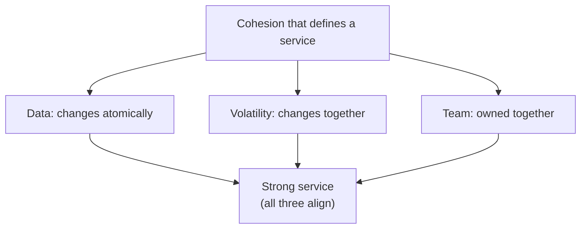
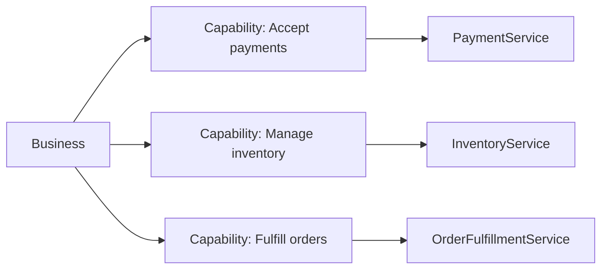
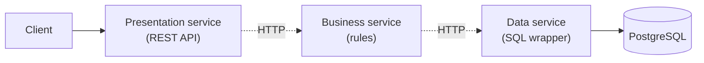
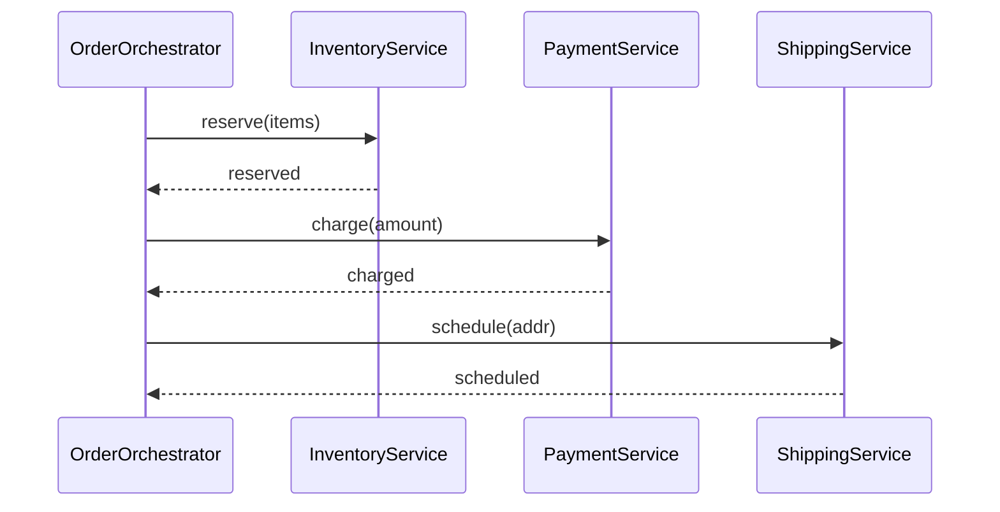
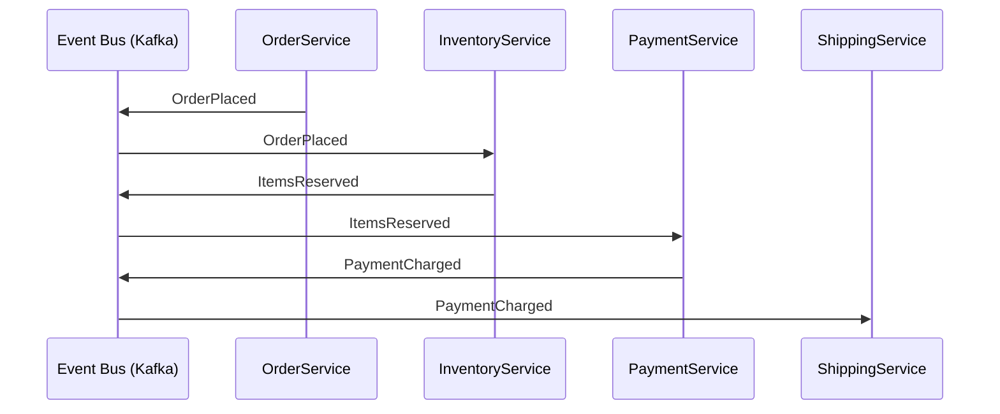
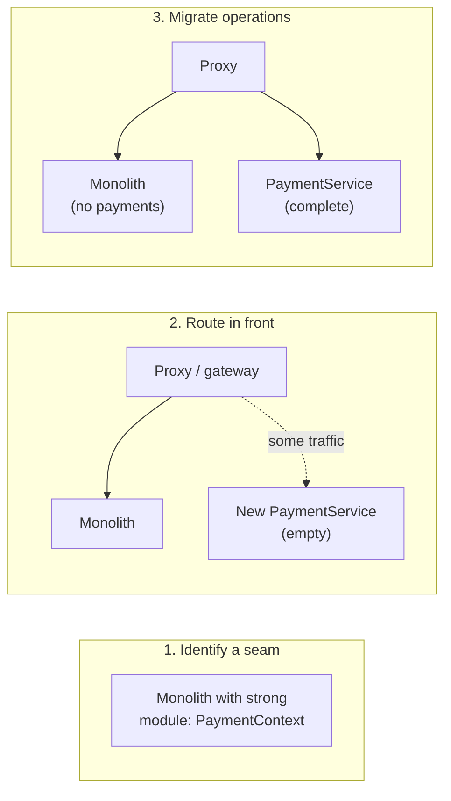

# Microservices Decomposition

You have decided ([T04](./T04-monolith-vs-microservices-vs-modular-monolith.md)) that microservices are the right shape for the team and the pressures you face. **Now where do the cuts go?** A bounded-context-aligned microservice deployment can ship features four times a week with two-pizza teams; the same nominal architecture with badly-placed cuts produces a distributed monolith that ships once a month with crisis-mode releases. The lines on the architecture diagram are not cosmetic — they are the *contract* that determines every later cost: the on-call rotation, the schema migration plan, the deploy choreography, the observability bill. **Drawing them well is the single most important act in a microservices initiative.**

The depth bar here is **decomposition as engineering, not philosophy**. We cover the four legitimate decomposition strategies — by bounded context (DDD), by business capability, by transactional consistency boundary, by volatility — and the four anti-strategies that produce distributed monoliths: by layer (a "presentation service", "business service", "data service"), by entity (one service per database table), by verb (a "validate service" called from everywhere), by hype (one service per team meeting). We name the right *size* — Newman's two-pizza team, Vernon's bounded context, AWS's "what one team can fully own and operate" — and the wrong sizes (nanoservices, mini-monoliths). We work through data ownership rules ([database-per-service, polyglot persistence](#data-ownership--the-rule-that-cannot-be-broken)), the orchestration-vs-choreography trade-off, the strangler-fig transition pattern from monolith to microservices, and the **specific signals** that a service is in the wrong place and needs to be moved, merged, or split. By the end you will read a system diagram and identify three potential cuts, justify each by its data ownership and consistency boundary, sketch the strangler-fig migration that gets there safely, and refuse the four wrong cuts even under organizational pressure.

> [!NOTE]
> Prerequisites: [Layered](./T01-layered-architecture.md), [Hexagonal](./T02-clean-hexagonal-onion-architecture.md), [DDD](./T03-domain-driven-design-ddd.md), [Monolith vs Microservices](./T04-monolith-vs-microservices-vs-modular-monolith.md). This topic assumes the decomposition decision has been made *or* is being justified; if you're not yet sure microservices are the right answer, return to T04 first.

## Where Decomposition Thinking Came From — Three Decades Of Modular Design

The question "how do you split a system into pieces?" is one of computer science's oldest. The microservices era (2014+) is the latest answer, but the underlying *modularity question* has been studied since the 1970s. Each decade produced specific insights that shape today's decomposition practice.

### Parnas's Modularization Criteria (1972)

The foundational paper is **David Parnas's [*On the Criteria To Be Used in Decomposing Systems into Modules*](https://www.win.tue.nl/~wstomv/edu/2ip30/references/criteria_for_modularization.pdf)** (Communications of the ACM, December 1972). Parnas (1941–2024) was a Canadian computer scientist whose contributions to software engineering are foundational; he received the ACM SIGSOFT Outstanding Research Award in 1998.

Parnas's central insight: **modules should be decomposed around the *information they hide*, not around the *processing steps* they perform**. The contrast at the time:

- **Conventional decomposition (1972)**: split by processing steps — "input module," "computation module," "output module." Each step is one phase.
- **Parnas's decomposition**: split by *design decisions* that could change. Each module *hides* a decision (data structure, algorithm, hardware detail). When the decision changes, only one module changes.

This is the **information hiding principle**, and it underlies every later modularity discussion. *Bounded contexts* in DDD, *microservice decomposition by capability*, *encapsulation* in OOP — all are operationalizations of Parnas's 1972 insight.

The reason this matters for microservices: a decomposition that splits by *processing step* (presentation service, business-logic service, data service — see [§ Anti-Strategy 1](#anti-strategy-1-decompose-by-layer-distributed-n-tier)) violates Parnas's principle and produces brittle systems. A decomposition that splits by *bounded context* or *capability* respects the principle and produces evolvable systems.

### Conway's Law (1968)

Predating even Parnas, **Melvin Conway's** [*How Do Committees Invent?*](https://www.melconway.com/Home/Committees_Paper.html) (Datamation, April 1968) introduced what became known as Conway's Law:

> "Organizations which design systems ... are constrained to produce designs which are copies of the communication structures of these organizations."

Conway (born 1937) was an obscure programmer at the time; the paper was rejected by Harvard Business Review before being published in Datamation. The "law" was empirical, drawn from Conway's experience with committee-designed systems.

For decomposition, Conway's Law is *the* key insight: **the system's component boundaries will mirror the team's communication boundaries, regardless of what you intend**. If you have 20 teams, you will get a 20-service system. If you have 5 teams, you will get a 5-service system. The "right" decomposition is one that aligns the components with the teams that own them.

**Sam Newman's [*The Inverse Conway Maneuver*](https://www.thoughtworks.com/insights/articles/demystifying-conways-law)** (later articulated by ThoughtWorks) operationalized this: if you want a particular system architecture, *structure the teams* to produce it. This is the *prescriptive* version of Conway's observation.

### Brooks's "Mythical Man-Month" And Communication Overhead (1975)

**Fred Brooks's** [*The Mythical Man-Month*](https://en.wikipedia.org/wiki/The_Mythical_Man-Month) (1975, anniversary edition 1995) added the *quantitative* dimension. Brooks observed that adding people to a project produces **communication overhead proportional to N²**. For a project with N people, the communication channels are N(N−1)/2.

For decomposition, this means: a *single* team larger than ~8–10 people produces enormous coordination cost. Splitting into smaller teams reduces internal coordination but adds *cross-team* coordination. The decomposition's job is to *minimize* cross-team coordination while keeping teams individually effective.

This is the *quantitative* basis for the "two-pizza team" rule (Jeff Bezos, 2000s): teams of 6–10 people. Smaller and you can't get the work done; larger and the communication overhead dominates.

### The 2010s Microservices Decomposition Vocabulary

The Lewis-Fowler 2014 essay and Newman's 2015 *Building Microservices* book established the **decomposition by business capability** approach as the canonical microservices answer. But the underlying ideas trace back to:

- **Parnas's information hiding** (1972).
- **Conway's organizational alignment** (1968).
- **Brooks's communication-cost analysis** (1975).
- **DDD's bounded contexts** (Evans 2003).
- **Capability modeling from enterprise architecture** (Zachman 1987, TOGAF 1995).

The microservices contribution: *applying* these older ideas at the *deployment* level — turning bounded contexts into separately-deployed services with explicit network boundaries.

### Why Bounded Contexts Won As The Default Decomposition Criterion

By 2018, the *consensus* (Newman, Richardson, Vernon, Larson, multiple ThoughtWorks essays) was that bounded contexts from DDD are the right decomposition unit. The reasoning:

1. **Bounded contexts have natural data ownership**: each context owns its vocabulary and data.
2. **Bounded contexts have natural team ownership**: one team can own one context.
3. **Bounded contexts have natural change-rate cohesion**: changes within a context happen together.

Splitting *smaller* than a bounded context (e.g., one service per entity) produces nanoservices that don't earn their operational cost. Splitting *larger* than a bounded context (e.g., one service for "everything in the company") produces distributed monoliths.

The senior judgment: **bounded contexts are the unit; anything smaller is wrong; anything larger is also wrong**.

## Why Decomposition, Specifically: The Senior Engineer's Q&A

### Q1: Why does the decomposition decision matter so much?

Because it determines the system's *coordination cost* for the next 5–10 years. Specifically:

- **Schema changes**: cross-service schema changes require coordinated releases. Within a service, they're trivial.
- **Cross-service queries**: become network calls instead of joins. Latency and complexity both increase.
- **Cross-service transactions**: require sagas instead of ACID transactions.
- **Cross-service authentication**: requires explicit handoff (tokens, mTLS) instead of in-process.

Every cross-service relationship is a *coordination tax*. The decomposition minimizes coordination by putting things that change together *in the same service*. Getting this wrong adds tax that compounds over years.

### Q2: What did people do before bounded contexts?

Three approaches, each with characteristic failure modes:

1. **Entity Services (the JBoss/EJB era, ~2003–2008)**: one service per database entity. `CustomerService`, `OrderService`, `ProductService`. **Failure mode**: business operations (place order) span multiple entity services, requiring orchestration in the caller. Distributed CRUD.

2. **Layered Services (the early SOA era, ~2003–2010)**: services structured by layer — presentation service, business service, data service. **Failure mode**: every request traverses all layers, paying the network tax at each. Distributed n-tier with no benefit.

3. **Service Per Use Case (early 2010s overcorrection)**: one service per business operation. `PlaceOrderService`, `CancelOrderService`, `ListOrdersService`. **Failure mode**: nanoservices with no cohesion; shared data scattered across services.

Each failed because it optimized for one criterion (entities, layers, use cases) without considering data ownership and change cohesion. Bounded contexts succeed because they optimize for *all three*.

### Q3: How do I decide if two operations belong in the same service?

Five heuristics, in priority order:

1. **Do they share data that must be transactionally consistent?** If yes, they must be in the same service (a single transaction cannot span services without distributed transactions, which you should avoid). If no, they can be separate.

2. **Do they change together?** If a feature change always touches both, they have *change cohesion* — keep them together.

3. **Are they owned by the same team?** Team ownership is correlated with deployment cadence; same team → same service.

4. **Do they share a bounded context's vocabulary?** If they speak the same ubiquitous language, they likely belong to the same bounded context, hence the same service.

5. **Do they have the same scaling needs?** A read-heavy operation and a write-heavy operation in different services scale independently; in one service they don't.

The senior judgment: if all five say "same service," they're the same service. If most say "same" and one says "different," reflect carefully on which criterion is binding for your team.

### Q4: When should I extract a new service from an existing one?

Five conditions; you need at least 2–3 to justify extraction:

1. **The current service has measurably bad properties**: deploys take >30 minutes; cycle time >1 week; on-call is overwhelming.
2. **A specific bounded context has emerged that's distinct from the rest**: you have a clear conceptual boundary.
3. **One team should own the extracted piece**: not "we want one team" but "we have a team that's ready."
4. **The extraction will move features**: not just internal restructuring, but features the team can ship.
5. **The infrastructure cost is justified**: $1–3K/year + operational overhead per service.

Extracting prematurely (before bounded context is clear) produces the distributed monolith. Extracting too late (after the monolith has grown to 2M+ lines) makes extraction enormously expensive.

### Q5: How does this decision interact with team structure?

Conway's Law makes the decomposition and team structure *the same decision*. You cannot have:
- A 3-service architecture owned by 8 teams (you'll get 8 services regardless).
- A 30-service architecture owned by 2 teams (you'll get 2 services regardless).

The Inverse Conway Maneuver: *first* design the team structure you want; *then* the architecture will follow. This is why staff engineers spend so much time on organizational design — it's *upstream* of the technical decisions.

## Common Misconceptions Explained

### "Smaller services are better than larger."

False. **Services should be *bounded-context-sized***, not arbitrarily small. A nanoservice (single-operation service) usually doesn't earn its operational cost. A bounded-context-sized service is the sweet spot.

### "Microservices means no shared code."

False. *Shared code* (libraries) and *shared data* (databases) are different. Sharing libraries is fine — every service can depend on a common utility library. Sharing databases is the problem — that creates coupling at the schema level.

### "Decomposition is a one-time decision."

False. As the system grows and the team learns the domain, decomposition evolves. Services merge, split, or are eliminated. The decomposition is *continuous*, not fixed.

### "Every team should have one service."

False. Some teams own multiple services (a primary service plus tools/scripts). Some services are owned by multiple teams (rare but happens). The team-to-service mapping is many-to-many in practice.

### "Decomposition by entity is wrong."

Half true. Entity-based decomposition usually fails (see Q2), but *aggregate-based* decomposition (DDD) often succeeds. The distinction: an aggregate has behavior and invariants; an entity is just a row.

### "Sharing a database means it's a distributed monolith."

True. **Database sharing is the canonical distributed-monolith indicator**. If two services share tables or rely on each other's schema, they're tightly coupled regardless of separate deployment.

## The Decomposition Question — Why It's Hard

The naive answer to "how do we split this monolith?" is **"one service per noun"** — one service for orders, one for customers, one for payments, one for shipments. It looks clean on a slide. In practice it produces a *distributed CRUD* — every business operation involves orchestrating 6–8 services, each with one method call, each contributing minimal value. Latency mounts, failure surface explodes, and the team longs for the monolith.

The naive corrective is **"one service per business operation"** — one service for "place order" that internally manages everything. This collapses back toward a monolith (which is sometimes the right answer — see T04) but loses the modularity that motivated the split.

The right answer lies between these poles and depends on three properties of the bounded contexts ([T03](./T03-domain-driven-design-ddd.md)) involved:

1. **Data cohesion** — what data must change atomically together (in one transaction)?
2. **Volatility cohesion** — what changes at the same rate, for the same reasons?
3. **Team cohesion** — who is going to operate and evolve this for the next five years?

When these three properties align — a set of business operations share data, change together, and are owned by one team — that's a service. When they don't align, the cut you make will cause pain along whichever dimension you ignored.



## The Four Legitimate Decomposition Strategies

Each strategy starts from a different alignment property and tends to produce a different shape. Mature teams use a *combination*, weighted by which property is most stable in their context.

### Strategy 1: Decompose By Bounded Context

The DDD-aligned strategy. Each bounded context (a region of consistent ubiquitous language — see [T03](./T03-domain-driven-design-ddd.md)) becomes a service. Loan Origination is one service; Underwriting is another; Servicing is a third. The contexts were already identified during DDD work; the deployment shape now follows.

**When this works**: the domain has been modeled (event storming, modeling whirlpool, real DDD), the contexts are *stable* (they survive a year of feature work), and team boundaries align with context boundaries.

**When this fails**: contexts are speculative — the team has guessed at boundaries without lived experience. Bounded contexts identified before the codebase exists are usually wrong. The fix is the **modular monolith first** (T04), discover the real contexts, then split.

### Strategy 2: Decompose By Business Capability

A **business capability** is *what* the business does, independent of how it does it. "Accept payments." "Authorize a loan." "Recommend a product." These are stable across years; the implementations beneath them rotate every 2–3.

Susanne Kaiser's *Adaptive Systems with Domain-Driven Design* (2022) develops this as the primary strategy. Map the business's capabilities (often via a capability model from enterprise architecture), check that each maps to one team's mandate, and let each capability become a service.



**When this works**: the business has a clear capability model (most enterprises do, formally or informally) and capabilities map cleanly to team mandates.

**When this fails**: capabilities cut across team lines (one team owns "Accept payments" for in-app, another for invoicing, another for refunds) — now the "capability" is three services *or* one service with three teams contributing, neither of which is great.

### Strategy 3: Decompose By Transactional Consistency Boundary

Wherever a transaction must atomically span entities (`@Transactional` in monolith terms), those entities must live in **one service** (because [T04](./T04-monolith-vs-microservices-vs-modular-monolith.md) showed that distributed transactions across services are deeply costly — saga, 2PC, both have major caveats — see [T10](./T10-saga-pattern-distributed-transactions.md) and [C02/T06](../C02-distributed-systems-and-system-design/T06-distributed-transactions-2pc-saga.md)).

This is the *negative* form of the strategy: identify operations that *must* be atomic, draw circles around them, refuse cuts inside those circles.

**Example**. A trade order in a brokerage system must atomically (a) decrement available cash, (b) increment a pending-position, (c) write an audit log entry. If these three live in three services, you've signed up for sagas, idempotency keys, and reconciliation jobs. If they live in one service, you have a single ACID transaction. **The transactional boundary draws itself; the architect's job is to refuse cuts that violate it.**

### Strategy 4: Decompose By Volatility

Things that change at the same rate, for the same reasons, are good co-located. Things that change at different rates are good candidates to split. A stable reference catalog (rarely changes) next to a dynamic recommendation engine (changes weekly) is two services; a fast-iterating feature alongside a 99.99%-SLO billing path is two services *even if* they share a bounded context, because they have radically different release-risk profiles.

**When this works**: there's a measurable gap in release frequency, risk tolerance, or scaling profile.

**When this fails**: the team forces a split because "this *will* iterate faster" without evidence. Volatility is a *measured* property, not a hopeful one.

## The Four Anti-Strategies — How Decomposition Goes Wrong

Each of these produces a recognizable failure mode. They look reasonable in the planning meeting and reveal themselves only later.

### Anti-Strategy 1: Decompose By Layer (Distributed N-Tier)

A "presentation service," a "business service," and a "data service" — exactly the layered architecture from [T01](./T01-layered-architecture.md), with networks between layers instead of method calls.



**Why it fails**: every request crosses every layer regardless of complexity. A trivial GET that the monolith handled in 5 ms now takes 50 ms after two network hops. The boundaries don't match any meaningful business or team line; nothing can be deployed independently in any useful way; the cost is 3× and the benefit is 0×.

**Diagnostic**: if your service names are "X service", "Y service", "Z service" where X/Y/Z are layer names rather than business capabilities, you have this.

### Anti-Strategy 2: Decompose By Entity (CRUD-per-Table)

One service per database table or aggregate root: an "Order service" with `findById/save/delete`, a "Customer service" with `findById/save/delete`, a "Product service" with `findById/save/delete`. Each is a thin CRUD wrapper.

**Why it fails**: every business operation now orchestrates several services, calling each in turn. "Place an order" requires Order Service, Customer Service, Product Service, Inventory Service, Payment Service — five network hops, five failure modes, five tracing points. The services themselves have no behavior; they are anemic CRUD wrappers. The *logic* of placing an order leaks into a "front-end-for-backend" or an "orchestrator" service that then becomes the actual monolith.

**Diagnostic**: every service's API consists almost entirely of `getById`, `create`, `update`, `delete`. There is one "business service" or BFF that orchestrates them. The orchestrator is where the actual application lives.

### Anti-Strategy 3: Decompose By Verb (Nanoservices)

A "validate service," a "calculate service," a "send-email service," each called from many other services. Each does one tiny operation.

**Why it fails**: validation, calculation, and email-sending are *libraries*, not services. The network tax of crossing a service boundary for what could be a function call is irreversible: ~1 ms per call × 5 verbs × 100 callers = a system with no inner logic and enormous communication overhead. Independent deployment of a "validation service" delivers nothing — validation rules are tied to the business, and the business isn't changing the validation rules in isolation.

**Diagnostic**: service names are verbs, not nouns or capabilities. Many services have one consumer or are called from "everywhere." The team's joke is "we should make a microservice for every function."

### Anti-Strategy 4: Decompose By Hype Or Org Chart

Splitting because "microservices are modern" or because the org chart got reorganized and now every team needs "their own service." No principled cohesion analysis is performed.

**Why it fails**: services emerge with no shared identity, no clear data boundary, no transactional cohesion. The split lives wherever the political wind blew that quarter. Six months later the boundaries don't fit, but moving them costs a quarter of engineering time.

**Diagnostic**: nobody on the team can articulate *why* this service exists separately from the next. "Because Steve's team owns it" is not a reason.

## The Right Size — Two-Pizza Teams And One-Page READMEs

How big should a microservice be? Three legitimate metrics:

- **Newman**: small enough that one team can rewrite it in two weeks.
- **AWS / Bezos**: one team can fully own and operate it ("two-pizza team" — 6–10 people).
- **Vernon (DDD)**: one bounded context's worth of code, regardless of LOC.
- **A practical test**: a new engineer reads the service's README and runs it locally in under one hour.

When you cannot characterize the service in a one-page README, it's probably too large or too unclear. When the README is "this service does one thing: validate phone numbers", it's a function masquerading as a service — too small.

A reasonable Java/Spring microservice in 2026 is:

- **Code**: 5,000 – 80,000 lines of Java.
- **Team**: 4–10 engineers (often shared with another service).
- **Database**: 10–80 tables.
- **Endpoints**: 5–50 (REST or gRPC).
- **Release cadence**: own pipeline; deploys 1–20×/week.
- **On-call**: clear owner; runbook covers the top 5 alerts.

Services outside this envelope (50-line "services," or 200K-line "monolithic services" cohabiting in microservice clothing) deserve scrutiny.

## Data Ownership — The Rule That Cannot Be Broken

**Each microservice owns its data exclusively.** No other service may read or write its database directly. Cross-service data access goes through the service's API (REST, gRPC) or through events.

```mermaid
flowchart LR
  subgraph S1[OrderService]
    Code1[code]
    DB1[(orders DB)]
    Code1 --- DB1
  end
  subgraph S2[CustomerService]
    Code2[code]
    DB2[(customers DB)]
    Code2 --- DB2
  end
  Code1 -.->|"HTTP / event"| Code2
  Code1 -.x|"NEVER direct DB read/write"| DB2
```

The rule sounds pedantic and is the single largest determinant of whether microservices succeed. Shared databases between services produce **shared-database microservices** — the absolute worst form of distributed monolith, where every schema migration requires coordinated releases across all consuming services, and any team's bad SQL can lock another team's reads. **One service per database (or schema), enforced at the network layer (IAM, security groups), is the rule.**

### Polyglot Persistence

One consequence: each service may choose its own database technology. Orders may use PostgreSQL (relational, transactional); Recommendations may use Redis (fast lookups) plus Elasticsearch (full-text). The shapes that work for one context may be wrong for another. This is **polyglot persistence**, and it's a real microservices benefit — but it has a cost (operational complexity grows with database-type count), so most mature teams limit themselves to 2–4 database technologies across the organization.

### When You Need Cross-Service Data — Three Patterns

1. **API composition** (the calling service queries the owning service over HTTP/gRPC). Simple; suffers from latency and cascading failure. Best for low-volume reads.
2. **Materialized view** (the consuming service subscribes to events from the producer and maintains its own read-optimized projection). High throughput; data is eventually consistent. Best for high-volume reads.
3. **CQRS read-side projection** ([T09](./T09-cqrs.md)) — a dedicated read-side that joins data across services into a denormalized read store (often Elasticsearch). Best for complex queries.

What you do **not** do: directly query another service's database. Not "just for a quick join." Not "we have read-only credentials." Not "it's the same Postgres instance, different schema." Cross-service direct DB access destroys the architecture.

## Orchestration Vs Choreography — How Services Cooperate

A business operation that spans multiple services (placing an order touches Orders, Inventory, Payments, Shipping) has to coordinate the work. Two patterns:

### Orchestration

A central coordinator (an "orchestrator service") issues commands to each downstream service in sequence:



**Pros**: explicit flow; easy to reason about; one place owns the saga ([T10](./T10-saga-pattern-distributed-transactions.md)) for compensating failure.

**Cons**: the orchestrator knows about every downstream service; coupling concentrates in the coordinator; introducing a new step requires the orchestrator team's involvement.

### Choreography

No central coordinator. Each service reacts to events emitted by others:



**Pros**: services are decoupled; adding a new participant requires no central change; emergent flow.

**Cons**: the overall workflow is no longer explicit anywhere — you have to read every subscriber to understand "what happens when an order is placed." Debugging is harder; observability and distributed tracing are essential.

### Choosing

Choreography for flows that change shape often and have many participants who care about events. Orchestration for flows where the sequence is fixed, failures must be handled with explicit compensations, and a single team owns the workflow end-to-end. Most mature systems use both — choreography for the broad fan-out (downstream subscribers reacting to events), orchestration for the critical path (the payment + inventory dance, which must be transactional-ish).

## The Strangler Fig — Decomposing An Existing Monolith

You rarely get to design microservices from scratch. Usually there is a monolith, and the question is how to safely extract bounded contexts into services without a big-bang rewrite. Martin Fowler named this the **strangler fig** ([T11](./T11-strangler-fig-and-migration-patterns.md) covers in depth) after the fig that grows around a host tree until the host disappears.

The pattern:



1. **Identify a seam** in the monolith — a bounded context with clear data and operation boundaries. Use ArchUnit, jdeps, or Spring Modulith to confirm the context is genuinely separable.
2. **Stand up a new service** with the same external interface. Initially it has no implementation — just a stub.
3. **Route a small fraction of traffic** to the new service via a proxy / feature flag / canary. Compare results.
4. **Migrate operation by operation**, gradually shifting both code and data from monolith to service.
5. **Decommission the monolith's copy** once 100% of traffic has migrated and data has been moved.

The pattern's promise: **every commit leaves the system in a working state.** No big-bang switch, no flag days, no Saturday-night migrations. The cost is that the migration takes longer than a rewrite would on paper — but on paper, every rewrite ships on time, which it never does.

## Anti-Patterns Specific To Decomposition

### The Entity Service

A microservice whose API is `getCustomer / createCustomer / updateCustomer / deleteCustomer`. Anemic by construction. The actual customer-related business logic lives in five other services calling these CRUD methods. The "Customer Service" is a SQL wrapper.

**Fix**: collapse with the service that owns the customer's behavior, or replace with a shared customer library that other services use directly (and remove the service entirely). A service that has no behavior is not a service.

### The Orchestrator Monolith

After splitting into many small services, the team builds a central "OrchestratorService" that knows about every downstream service and is the *only* place business logic lives. The downstream services are dumb; the orchestrator is a monolith. Cost: monolith + microservice tax.

**Fix**: re-distribute logic into the downstream services. Each service should own enough of the operation that it isn't just a CRUD wrapper. Use choreography for cross-service flows where possible.

### Distributed God Object

A central "User Profile" object that every service needs and every service mutates. Schema changes require eight-service coordinated releases. The data shape is the integration contract, and the integration contract spans everyone.

**Fix**: each service owns its slice of the user. Profile fields live with the service that uses them. A shared User ID is the only common thing.

### Synchronous Chains Of Death

ServiceA calls ServiceB, which calls ServiceC, which calls ServiceD, all synchronously. Latency = sum. Failure rate = 1 − (1−p)⁴ for per-service success rate (1−p). Even at 99.9% per call, four hops produce 99.6% — meaningful outage. Tail latencies compound especially badly.

**Fix**: replace as many hops as possible with asynchronous events. Cache aggressively. Use bulkheads, timeouts, and circuit breakers ([T14](../C02-distributed-systems-and-system-design/T14-resilience-circuit-breaker-bulkhead-retry-timeout-backpressure.md)).

### Premature Decomposition

Splitting before you know the bounded contexts. The cuts will be wrong. Moving a cut after the fact is enormously expensive — schemas migrated, APIs published, traffic routed. **Modular monolith first** ([T04](./T04-monolith-vs-microservices-vs-modular-monolith.md)) is the answer almost every time the team is unsure.

## A Working Example — A Bookstore, Decomposed

A monolithic bookstore has Books, Customers, Orders, Reviews, Inventory, Shipping, Payments, Recommendations. Eight bounded contexts (you've done DDD). The team is 25 engineers in five squads. Apply each strategy:

**By bounded context**: 8 services (Books, Customers, Orders, Reviews, Inventory, Shipping, Payments, Recommendations).

**By business capability**: ~6 services (Catalog combines Books + Reviews + Inventory; Customer; Order Fulfillment combines Orders + Shipping; Payments; Recommendations; possibly an additional Analytics).

**By transactional boundary**: Orders + Inventory + Payments are deeply transactional (a placed order must atomically reserve stock and charge); collapsing them into one Order Fulfillment service simplifies the consistency story.

**By volatility**: Recommendations changes weekly (ML models retrain); Catalog rarely; these split cleanly. Customer information changes daily; profile vs preferences may split.

**By team**: 5 squads → 5 services. If team boundaries don't match capability boundaries, this is the cut that forces reorganization.

The synthesized cut might be: Catalog, Customer, Order Fulfillment (with Inventory + Payments inside), Reviews, Recommendations — five services. Each owned by one team. Each with its own database. Cross-service flows via Kafka events and a small number of gRPC calls. **This is the architecture that works for this team's pressures; another team would land elsewhere.**

## How Java/Spring Teams Operationalize Decomposition

A short field guide.

- **Spring Boot per service.** One Spring Boot app per service, common parent POM / Gradle convention. Each service is independently buildable.
- **gRPC or REST for synchronous communication.** Most teams choose REST initially for tooling and observability; gRPC when high-volume or polyglot. WebFlux for reactive paths where backpressure matters.
- **Kafka for events.** Event-driven communication via Kafka topics. Schema Registry (Confluent or Apicurio) for evolving Avro/Protobuf schemas. Outbox pattern for at-least-once event delivery from a service.
- **Database per service.** Postgres for most; specialty stores (DynamoDB, Redis, ES) per service's needs.
- **Spring Cloud Gateway / Kong / Envoy for the edge.** Routes traffic; handles auth; rate-limits.
- **Service mesh (Istio, Linkerd) for inter-service.** mTLS, traffic shaping, circuit breaking, observability. Optional but increasingly default.
- **Distributed tracing (OpenTelemetry → Tempo/Jaeger/Datadog).** Every cross-service hop is traced; required for debugging.
- **Centralized config (Spring Cloud Config, Vault).** Service config externalized.

This stack is **expensive** — operationally and in headcount — which is precisely why [T04](./T04-monolith-vs-microservices-vs-modular-monolith.md)'s monolith-first advice is real.

## Cross-Language Notes

| Ecosystem | Decomposition norms |
|-----------|--------------------|
| **Java / Spring** | One Spring Boot app per service; Spring Cloud or service mesh for ops |
| **C# / .NET** | One ASP.NET Core app per service; Steeltoe (Spring Cloud-equivalent), Dapr |
| **Go** | Light services (small JARs become small binaries); often each team's monorepo subfolder |
| **Rust** | Heavier per-service overhead (compile time); teams tend to keep larger services |
| **Node.js** | Historically smallest service granularity (nanoservices); the reaction is now back toward fewer, larger services |
| **Elixir / Phoenix** | OTP's actor model provides in-process isolation; fewer external services needed |

The trend across all ecosystems in 2024–2026: **fewer, larger services** than the 2018 norm. The industry is correcting downward from the over-split it produced in the microservices honeymoon.

## Trade-Off Summary

| Cohesion lens | Strategy | Best when | Risk |
|---------------|----------|-----------|------|
| **Data** | By transactional boundary | Strong consistency requirements drive cuts | Boundaries may be larger than teams want |
| **Behavior** | By bounded context | DDD has been done; contexts are stable | Contexts identified pre-codebase are usually wrong |
| **Business** | By business capability | Capability model exists and is stable | Capabilities cut across team lines |
| **Change** | By volatility | Measurable release-rate gaps | Volatility is hopeful, not measured |
| **People** | By team | Strong team identity, long horizon | Becomes service-per-org-chart anti-pattern |

The senior judgment: **use the lens that best matches your most stable property.** If the domain is stable (mature business), bounded contexts. If teams are stable (long-tenured org), team-aligned. If both are unstable, modular monolith first.

> [!INTERVIEW]
> A common L5 prompt: "How do you decide where to split a monolith?" Strong answers (a) name DDD bounded contexts as the primary unit, (b) explicitly call out data-ownership and transactional-consistency as constraints that cannot be broken, (c) describe a strangler-fig migration approach, (d) state — unprompted — at least one anti-pattern (entity services, distributed n-tier) and why it fails.

## Practice

1. **Spot the anti-strategy.** Find a microservices architecture diagram from any source (your team, an open-source project, a conference talk). Identify which of the four anti-strategies it tends toward and the symptoms.
2. **Bounded contexts from a real description.** Read the public description of any company's domain (an annual report, a careers page). Identify three plausible bounded contexts. For each, draft what its API and data would be.
3. **Transactional boundary tour.** In any code you know, find a `@Transactional` method that touches three or more aggregates. Argue whether they belong in one service or three; defend your answer with the four-aggregate-rules ([T03](./T03-domain-driven-design-ddd.md)).
4. **Polyglot persistence design.** A new service must store 10M time-series events per day with 1-second write latency and arbitrary-range queries. Choose a database (with reasoning). Now defend why it's *also* the right choice for the team to operate alongside their existing PostgreSQL and Redis.
5. **Choreography vs orchestration drill.** A "place order" flow spans 6 services. Sketch both an orchestrator-led version and an event-choreographed version. Identify the failure mode each version handles best.
6. **The strangler-fig plan.** A 1.5M LOC monolith must extract its Notification context (sends emails, SMS, push) into a separate service. Write an 8-step plan; each step must leave the system in a working state.
7. **Find an entity service.** Find a microservice in any system whose API is essentially CRUD. Propose whether to (a) merge it with its primary consumer, (b) replace it with a library, or (c) reshape it to own a real capability.
8. **Service size audit.** For any microservice you know, measure its LOC, table count, endpoint count, deploy frequency, team size. Compare to the "right size" envelope in this topic. Decide: too small, too big, right.
9. **Data-ownership violation hunt.** In any microservice system, find an instance of cross-service direct database access (joined queries, shared user IDs that double as foreign keys, "shared read-only role"). Diagnose how it crept in and what would replace it.
10. **The skeptic conversation.** A senior engineer says "we should split this monolith into 20 services so each team can move independently." Write a 200-word response that (a) takes the goal seriously, (b) identifies the conditions that justify the split, (c) proposes the cheaper path (modular monolith) when applicable.

## Recap

You should now be able to:

- Articulate **why decomposition is hard** — the right cut depends on data cohesion, volatility, and team cohesion simultaneously.
- Use **four legitimate strategies** — bounded context, business capability, transactional boundary, volatility — and combine them by which property is most stable.
- Recognize and refuse **four anti-strategies** — by layer (distributed n-tier), by entity (CRUD wrappers), by verb (nanoservices), by hype/org chart.
- Choose the **right size**: two-pizza team, one bounded context, a one-page README, the Newman two-week-rewrite test.
- Enforce **data ownership** — each service owns its database exclusively; cross-service data goes through APIs or events; no exceptions.
- Use **polyglot persistence** judiciously (limit to 2–4 database technologies across the organization).
- Compare **API composition, materialized views, CQRS read-side projections** for cross-service queries.
- Choose between **orchestration and choreography** for cross-service flows by stability, ownership, and observability needs.
- Plan a **strangler-fig migration** that decomposes a monolith without big-bang risk, leaving the system working at every commit.
- Name and refuse **decomposition anti-patterns** — entity services, orchestrator monoliths, distributed god objects, synchronous chains of death, premature decomposition.
- Operationalize the decomposition in a **Spring Boot + Kafka + service-mesh** stack and recognize that the operational cost is the largest hidden bill.
- Place Java's decomposition norms in **cross-language context** and recognize the 2024–2026 industry-wide retreat from over-splitting.

## Next

Continue to [Service Communication (Sync vs Async)](./T06-service-communication-sync-vs-async.md) — having drawn the cuts, the next question is how the services on either side actually talk. REST vs gRPC vs events; request-response vs fire-and-forget; the latency, consistency, and coupling consequences of each choice.
