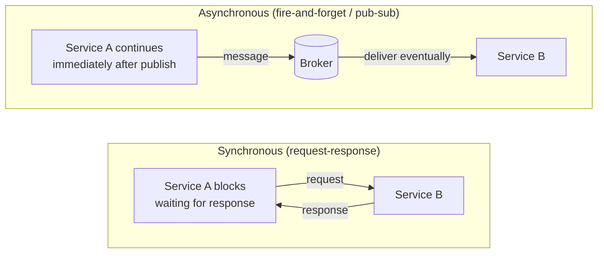
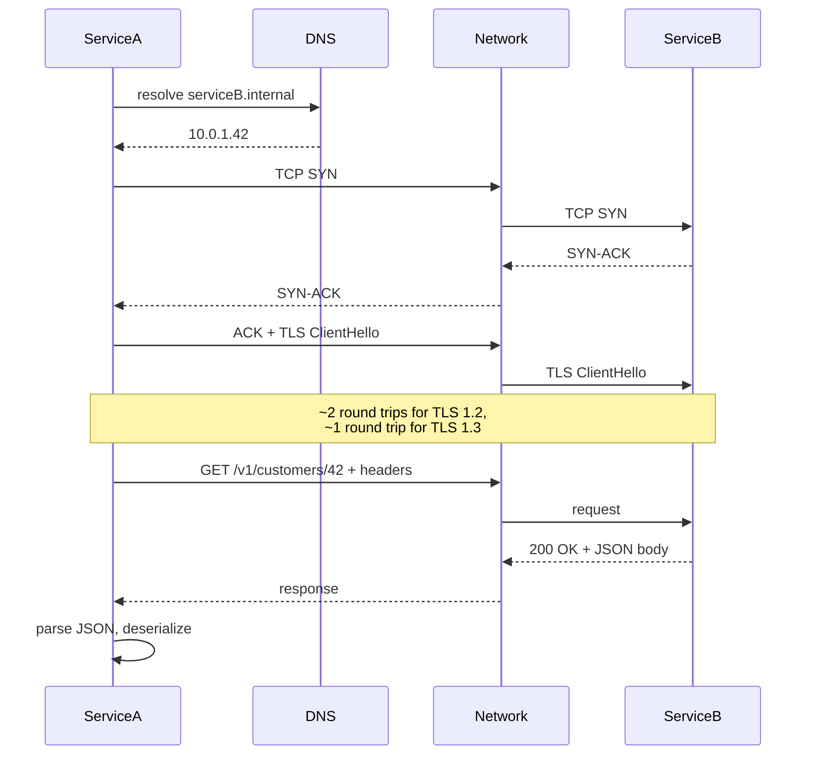
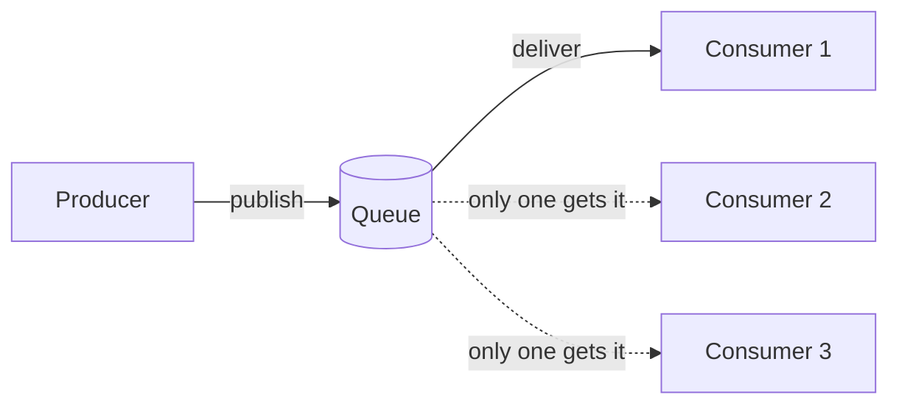
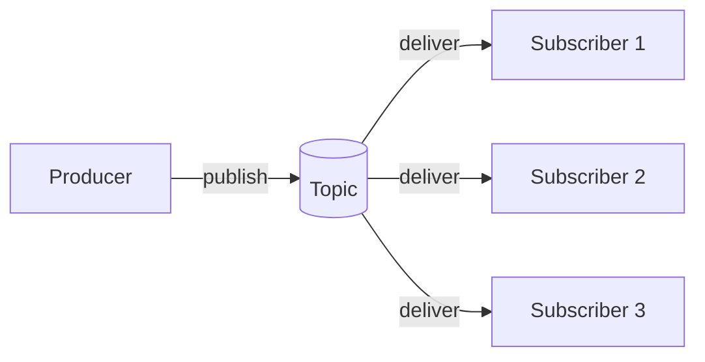
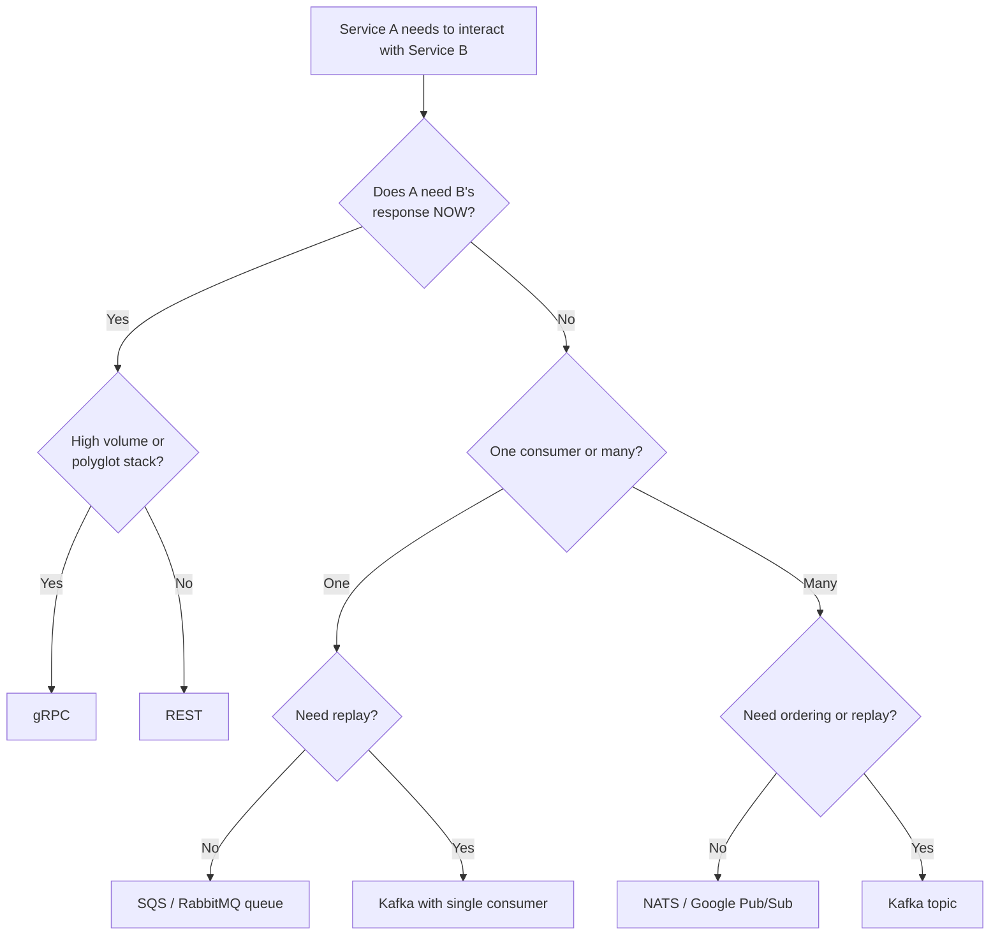

# Service Communication (Sync vs Async)

You have decomposed the system into services along sensible bounded-context lines ([T05](./T05-microservices-decomposition.md)). **How do those services talk to each other?** The choice between synchronous and asynchronous communication is, after the decomposition itself, the single most consequential decision in a microservices system. It determines latency budgets, failure modes, throughput ceilings, the shape of the observability stack, the schema-evolution workflow, and whether a 10-service request looks like a method call (good — fast paths) or like a cascading failure (bad — every service hop's tail propagates). Most distributed-monolith production incidents are downstream of a wrong sync/async choice that nobody revisited.

The depth bar here is the **mechanism and wire-level cost of each pattern**, not the marketing comparison. We trace what a single REST call actually does — DNS resolve, TCP handshake (or HTTP/2 stream multiplexed onto an existing connection, or HTTP/3's QUIC stream), TLS handshake, request line + headers + body serialization (JSON parse on the receiver), application processing, response serialization, response parse — and compare that to gRPC over HTTP/2 with Protobuf binary (typically 5–10× faster on the wire, 10–30× smaller payload, but with weaker tooling/observability), to a Kafka publish (entirely different shape — fire-and-forget log append, ~1 ms publish, decoupled consumer reads with their own latency budgets). We name the **eight semantic dimensions** along which a communication pattern can differ — temporal coupling, location, message ordering, delivery guarantees, schema evolution, backpressure, observability, and operational complexity — and give the canonical trade-offs for each. We trace the production incidents that shaped industry intuition: the 2017 AWS S3 outage that taught the world about synchronous-chain blast radius, the 2018 Slack outage caused by Kafka's at-least-once semantics meeting non-idempotent consumers, the 2023 CrowdStrike-related cascade where retries hid an underlying problem. By the end you will choose between REST, gRPC, GraphQL, Kafka, RabbitMQ, and SQS for a given inter-service relationship based on its real properties, design for the failure modes each pattern admits, and refuse the wrong choice even when the team is comfortable with it.

> [!NOTE]
> Prerequisites: [Microservices Decomposition](./T05-microservices-decomposition.md) (`L5/C01/T05`) and [L2/C03 networking fundamentals](../../L2-intermediate-backend/C03-networking-fundamentals/) (TCP, HTTP, TLS at the basic level). The fallacies of distributed computing from [T04](./T04-monolith-vs-microservices-vs-modular-monolith.md) are now operational: every choice here is about which fallacy bites first.

## Where Service Communication Patterns Came From — RPC's 40-Year Story

The choice between synchronous and asynchronous service communication is one of the oldest in distributed systems. Each approach has a specific lineage, motivated by specific failures of its predecessor.

### The 1980s — Sun RPC And The Birth Of Remote Procedure Calls

The conceptual foundation is **Bruce Nelson's 1981 PhD thesis at Carnegie Mellon**, [*Remote Procedure Call*](https://www.cs.cmu.edu/~coral/projs/coda/rpc.html). Nelson (working with Andrew Birrell at Xerox PARC) introduced the *idea* that a remote service call could be made to look like a local procedure call — same syntax, same return-value semantics, same exception model.

The Birrell-Nelson paper [*Implementing Remote Procedure Calls*](https://www.cs.cmu.edu/afs/cs/academic/class/15740-f97/public/doc/birrell-rpc.pdf) (ACM TOCS, February 1984) was *the* foundational paper. It documented Xerox PARC's Cedar RPC implementation, the first widely-cited industrial RPC system. The paper formalized:

- **Stubs and skeletons**: client-side and server-side proxies that hide network details.
- **Marshalling and unmarshalling**: converting in-memory data to wire format and back.
- **Binding**: how the client finds the server.
- **Failure semantics**: exactly-once, at-least-once, at-most-once.

**Sun RPC** (1984+) and **DCE RPC** (Distributed Computing Environment, 1992+) productized the pattern for UNIX systems. By the early 1990s, every UNIX system had RPC infrastructure available; NFS (Network File System, 1984) was built on Sun RPC.

### The 1990s — CORBA's Promise And Failure

The most ambitious distributed-object framework of the 1990s was **CORBA** (Common Object Request Broker Architecture, OMG 1991+). CORBA promised *language-independent, vendor-independent* RPC — a C++ client could call a Smalltalk server through a Java intermediary.

**CORBA failed for reasons that resonate today**:

- **Excessive complexity**: the IDL (Interface Definition Language) was elaborate; the wire protocol (IIOP) was opaque; configuration was XML-heavy.
- **Vendor incompatibility**: each CORBA vendor (Iona, Borland, IBM) had slightly different implementations. Cross-vendor calls often failed.
- **Sync-only thinking**: CORBA was deeply synchronous, with no good answer for high-latency or failed calls.
- **Object-level granularity**: CORBA's "everything is a distributed object" turned local method calls into network calls for trivial getters — death by a thousand round-trips.

By 2000, CORBA was a cautionary tale. Most teams that had adopted it were trying to escape it.

### The 2000s — SOAP And The XML Era

The **Simple Object Access Protocol** (SOAP, W3C 2000+) was the W3C's answer to CORBA's failures. SOAP standardized on:
- **XML over HTTP** as transport.
- **WSDL** (Web Services Description Language) for service contracts.
- **WS-*** standards for security, transactions, addressing.

The promise: simpler than CORBA, vendor-neutral, firewall-friendly (HTTP traverses corporate proxies).

**SOAP failed for similar reasons to CORBA**:
- The WS-* stack grew to ~80 specifications; vendors implemented different subsets.
- XML parsing was CPU-expensive; payloads were verbose.
- The mental model was still "distributed objects" — same trap as CORBA.

By 2010, SOAP was being replaced by REST in most new systems, though SOAP remains in legacy enterprise integrations.

### Roy Fielding And REST (2000)

The **REST architectural style** was introduced in **Roy Fielding's 2000 PhD dissertation** at UC Irvine, [*Architectural Styles and the Design of Network-based Software Architectures*](https://www.ics.uci.edu/~fielding/pubs/dissertation/top.htm). Fielding (born 1965) was one of the co-authors of the HTTP 1.1 spec; his dissertation was an after-the-fact theoretical justification of HTTP's design.

REST's constraints:
- **Client-server**: separation of concerns.
- **Stateless**: each request carries all needed context.
- **Cacheable**: responses are explicitly cacheable or not.
- **Layered**: intermediaries (caches, proxies) work transparently.
- **Uniform interface**: identification of resources, manipulation through representations, self-descriptive messages, HATEOAS.

In practice, the industry adopted only the first four constraints (cf. "HATEOAS-less REST" — what's actually deployed is often called "REST" but lacks the hypermedia controls Fielding insisted on). This is sometimes called "REST-ish" or "REST without the H."

REST's significance: **it dropped the "distributed object" model entirely**. Resources are addressed by URI, manipulated through HTTP verbs. There's no notion of "calling a method on a remote object." The cognitive shift is large.

### gRPC (2015) — The Pendulum Swings Back

**gRPC** (Google, 2015) was the modern answer to "we need efficient, schema-driven RPC at internet scale." gRPC uses:
- **HTTP/2** as transport (multiplexed streams over a single TCP connection).
- **Protocol Buffers** for serialization (binary, schema-driven).
- **IDL-based service definitions** (.proto files).
- **Streaming support** (server-side, client-side, bidirectional).

gRPC is *RPC done right* in many ways — it solves CORBA's complexity (single coherent design) and SOAP's bloat (binary protocol) while restoring the strong typing that REST sacrificed. By 2024, gRPC is the canonical internal-service communication protocol at Google, Netflix, Square, Uber, and many others; REST remains the public/edge API standard.

### The Message Broker Lineage (1986+)

In parallel with RPC development, **message brokers** emerged as the async alternative. The foundational systems:

- **IBM MQ** (originally MQSeries, 1992): the granddaddy of enterprise messaging.
- **Tibco Rendezvous** (1985): pub-sub for financial trading floors.
- **JMS** (Java Message Service, 2001): standardized Java messaging API.
- **AMQP** (Advanced Message Queuing Protocol, 2006): open protocol that birthed RabbitMQ.
- **Apache Kafka** (LinkedIn, 2011): persistent log-based messaging at internet scale.

The message-broker tradition is **older than REST and arguably older than RPC**. The IBM MQ lineage predates Birrell-Nelson by a few years (MQ Series in commercial form was 1992 but the predecessor work was 1980s).

The key insight from message brokers: **decoupling sender from receiver in time**. The sender doesn't wait for the receiver; the receiver doesn't need to be running when the message is sent. This is the *defining feature* of async patterns.

### Kafka's Influence (2011+)

**LinkedIn's Kafka paper** ([*Kafka: a Distributed Messaging System for Log Processing*](https://notes.stephenholiday.com/Kafka.pdf), Kreps, Narkhede, Rao, 2011) shifted the messaging conversation. Kafka was designed for *high-throughput, persistent, replayable* event streams — orders of magnitude more capable than traditional message queues.

Kafka's significance: **it made event sourcing practical** at scale. Pre-Kafka, persisting all events was either prohibitively expensive or operationally complex. Kafka's append-only log made it trivial. The event-driven architectures of 2014–2024 owe their existence to Kafka.

By 2020, Kafka had become the *default* internal event bus for new enterprise systems; competitors (Pulsar, NATS, Redpanda) implement Kafka's protocol for compatibility.

## Why Sync vs Async, Specifically: The Senior Engineer's Q&A

### Q1: What's the actual difference between sync and async?

**Synchronous** means the caller *waits* for the callee's response before continuing. The two are *temporally coupled* — both must be alive at the same moment.

**Asynchronous** means the caller *sends and continues* immediately, regardless of whether the callee is ready. The two are *temporally decoupled* — the receiver processes whenever it can.

This isn't about *technology* (HTTP vs Kafka) but about *temporal coupling*. You can do async HTTP (fire-and-forget HTTP calls with no waiting); you can do sync Kafka (publish + wait for processing confirmation). The decisive question is "does the caller wait?"

### Q2: When is each appropriate?

**Sync** is appropriate when:
- The caller *needs* the response to continue (user-facing reads, identity checks).
- The operation is fast (< 100 ms target).
- The downstream is reliable enough to not become a coupling-induced outage.

**Async** is appropriate when:
- The caller doesn't need to wait (logging, analytics, notifications).
- The operation involves multiple downstream consumers (fan-out).
- The downstream may be offline or slow.
- The work needs to survive a sender crash (durable delivery).

The senior judgment: **default to async when the work doesn't need to be synchronous**. Synchronous is more expensive in failure modes (every sync call is a failure point); async amortizes failure into the broker.

### Q3: Why did REST become the public-API standard?

Three reasons:

1. **HTTP infrastructure was ubiquitous**: every firewall, proxy, load balancer, browser handles HTTP. RPC protocols (CORBA's IIOP, gRPC over HTTP/2 before 2017) often had infrastructure problems.
2. **HTTP caching is built-in**: Cache-Control, ETag, conditional GETs work transparently. RPC has no equivalent.
3. **Discoverability**: a curl command is a complete tool for REST debugging. RPC requires specialized clients.

For *public* APIs, REST's operational simplicity outweighs gRPC's efficiency. For *internal* APIs at scale, gRPC's efficiency outweighs REST's debuggability.

### Q4: Why is Kafka winning over traditional message queues?

Three structural advantages:

1. **Persistence**: Kafka stores messages durably; consumers can replay history. Traditional queues (RabbitMQ default) delete after consumption.
2. **High throughput**: Kafka's log-based design handles millions of messages per second per partition. Traditional queues are typically limited to 10s of thousands.
3. **Multiple consumers**: Kafka's consumer groups allow many independent consumers to process the same stream at their own pace. Traditional queues couple producer to single consumer.

The trade-off: Kafka is heavier to operate (Zookeeper or KRaft, partition management, retention tuning). For low-volume use cases, RabbitMQ or SQS may be more appropriate.

### Q5: What happened to CORBA's "everything is a remote object" idea?

It died, deliberately, for good reasons:

1. **The cost of network calls is 4–6 orders of magnitude higher than method calls**. Treating remote calls as local hides the cost and produces N+1 query problems at scale.
2. **Remote failures are different from local failures**: a network call can succeed remotely but fail locally; a network call can hang indefinitely; partial failures are visible. Local method calls have none of these.
3. **Latency is asymmetric**: synchronous remote calls add their latency to the caller's response time. Sync chains compound latency.

Modern designs *explicitly distinguish* local from remote, often via different APIs (`UserService.findById()` locally; `userClient.findById()` over the network). The distinction is a feature, not friction.

### Q6: How does this connect to the resilience patterns?

Synchronous calls *require* resilience patterns because every sync call is a failure point. Specifically:
- **Timeouts**: prevent stuck calls from consuming threads indefinitely.
- **Circuit breakers**: stop calling failed dependencies before the cascade.
- **Retries with backoff**: handle transient failures.
- **Bulkheads**: isolate failure domains.

Asynchronous calls *reduce* the need for resilience patterns because the broker absorbs failure. The producer publishes and doesn't care if the consumer is up; the consumer processes when it can. The broker is the resilience boundary.

The senior judgment: **the more sync calls you have, the more resilience code you need**. Async shifts that complexity into the broker, where it's centralized.

## Common Misconceptions Explained

### "Async is always better than sync."

False. Sync is *simpler* and *appropriate* for user-facing reads where the response is needed immediately. Async adds operational complexity (broker, monitoring, dead-letter queues) that's not justified for trivial cases.

### "REST is RESTful."

Often false. Most "REST APIs" lack HATEOAS (Hypermedia as the Engine of Application State), which Fielding considered essential. They're "RPC over HTTP with REST-shaped URLs" — pragmatic but not what Fielding described.

### "gRPC replaces REST."

Half true. gRPC excels for *internal* service-to-service communication; REST excels for *public* APIs and browser-facing endpoints. Most modern systems use both: gRPC internally, REST/GraphQL at the edge.

### "Async means events; sync means HTTP."

False. You can have async HTTP (fire-and-forget HTTP webhooks) and sync events (request-response over Kafka). The technology and the pattern are independent.

### "Kafka is the only event broker."

False. RabbitMQ is widely used for non-Kafka use cases (RPC-style messaging, complex routing). NATS for low-latency. Pulsar for multi-tenancy. Each has its place.

### "Exactly-once delivery is achievable."

Mostly false. **Exactly-once delivery in distributed systems is theoretically impossible** (Two Generals Problem). What's achievable is *effectively-once processing* via idempotency + at-least-once delivery + dedup. Kafka's "exactly-once semantics" (KIP-98, 2017) is specifically for *Kafka-to-Kafka* flows; it doesn't extend to external systems.

## The Two Modes — Synchronous and Asynchronous



**Synchronous** communication is request-response: A calls B, A's thread waits for B to return, A's response depends on B's success. This is HTTP/REST, HTTP/JSON-RPC, gRPC unary, GraphQL queries. The caller and callee are **temporally coupled** — they must both be alive at the same moment.

**Asynchronous** communication is fire-and-forget or publish-subscribe: A sends a message (to a broker, a queue, a topic) and continues immediately. B reads and processes the message on its own time. This is Kafka, RabbitMQ, SQS, NATS, Pulsar. The caller and callee are **temporally decoupled** — B may be down when A publishes; B catches up later.

The choice is not "REST vs Kafka"; it's "is this interaction temporally coupled?" — that is, **does A's correctness depend on B's response right now?** Every other question downstream of that.

## The Eight Dimensions

Communication patterns vary along eight axes. A pattern's profile across all eight determines where it fits.

| Dimension | Synchronous (REST/gRPC) | Asynchronous (broker-based) |
|-----------|-------------------------|------------------------------|
| **Temporal coupling** | Tight (both alive at once) | Loose (sender doesn't wait) |
| **Location coupling** | Service A holds B's address (or via service discovery) | Both know broker; not each other |
| **Message ordering** | One request at a time per call | Per partition (Kafka), per queue (RabbitMQ), or unordered (SQS standard) |
| **Delivery guarantee** | At-most-once (request fails) | At-least-once (default), exactly-once with effort |
| **Schema evolution** | Compatible URL/field changes; versioning via URL or headers | Schema Registry, Avro/Protobuf compatibility rules |
| **Backpressure** | TCP-level; producer paced by consumer ack | Broker buffers; consumer lag observable |
| **Observability** | Trivial (one trace per request) | Harder (correlation IDs through events) |
| **Operational complexity** | Lower (no broker to run) | Higher (broker is critical infra) |

The most consequential row is **delivery guarantee**. In a synchronous call, A *knows* whether B succeeded — the response says so (or the timeout does). In an asynchronous call, A knows only that the message was *queued*; whether B eventually processes it is on B. That difference reshapes everything downstream.

## Synchronous Patterns — REST, gRPC, GraphQL

### REST Over HTTP/1.1 — The Default

REST is the lingua franca of inter-service communication. A single REST call:



The cost breakdown on a healthy LAN (~0.1 ms round-trip):

| Step | First call | Subsequent (connection reused) |
|------|------------|--------------------------------|
| DNS | 1–50 ms (cached after first) | 0 (cached) |
| TCP handshake | ~0.3 ms (1 RTT) | 0 |
| TLS 1.3 handshake | ~0.3 ms (1 RTT) | 0 |
| Request transmission | ~0.5 ms | ~0.5 ms |
| Receiver parse JSON | ~0.05 ms (small payload) | ~0.05 ms |
| Application processing | varies | varies |
| Response transmission | ~0.5 ms | ~0.5 ms |
| Sender parse JSON | ~0.05 ms | ~0.05 ms |
| **Total network overhead** | ~3 ms first | ~1.5 ms after |

**Connection pooling is essential.** Without it, every call pays the handshake cost (cold ~3 ms × N calls). With it, the cost drops to ~1.5 ms steady-state. Spring's `RestClient`, `WebClient`, OkHttp's `OkHttpClient`, and gRPC channels all maintain connection pools by default. *Not* using one (creating a fresh client per call) is a common production performance bug.

#### HTTP/2 and Multiplexing

HTTP/1.1 allows one outstanding request per connection. To send 100 requests in parallel, an HTTP/1.1 client opens 100 connections (or pipelines them, which most servers don't support). HTTP/2 multiplexes many requests over a single connection via **streams**, eliminating the connection explosion. Spring's `WebClient` (Netty-based) and the JDK 11+ `HttpClient` speak HTTP/2 natively; older `RestTemplate` defaults to HTTP/1.1.

HTTP/2's downside is *head-of-line blocking* at the TCP level: a packet loss stalls *all* multiplexed streams. HTTP/3 (over QUIC) eliminates this by moving multiplexing into the QUIC layer, which has per-stream loss recovery. As of 2026, HTTP/3 is supported by most cloud load balancers and is genuinely faster on lossy networks; on healthy datacenter LANs, the difference is small.

#### What REST Costs

A REST API has two costs that often go unmeasured:

1. **JSON serialization is expensive at scale.** Jackson's reflective binding (~50,000–100,000 ns per medium object) is the default; switching to Jackson with Afterburner (~30,000 ns), or to compile-time serializers (Avaje JSON, ~15,000 ns), measurably reduces per-call CPU.
2. **Large JSON payloads cross MTU boundaries.** A 1 KB JSON payload fits in one TCP segment; a 50 KB payload doesn't. Tail latency suffers as payload size grows. Pagination, projection (don't return fields you don't need), and gzip are mitigations.

### gRPC — Smaller, Faster, Harder

gRPC is Google's RPC framework, dominant in inter-service communication where the team has the operational discipline. It uses HTTP/2 as transport, Protobuf for serialization, and provides four call types:

- **Unary** — one request, one response (the REST analog).
- **Server streaming** — one request, stream of responses.
- **Client streaming** — stream of requests, one response.
- **Bidirectional streaming** — both stream.

The key trade-offs vs REST:

| | REST (JSON over HTTP/1.1 or 2) | gRPC (Protobuf over HTTP/2) |
|---|---|---|
| Wire size (typical 1 KB JSON) | 1 KB | ~200 B (Protobuf) |
| Serialization CPU | ~50 µs | ~5 µs |
| Per-call latency (LAN, warm) | ~1.5 ms | ~0.5 ms |
| Browser support | First-class | Requires gRPC-Web or REST gateway |
| Debuggability | `curl`, browser, easy | Requires `grpcurl` or Bloom RPC |
| Schema definition | OpenAPI (optional) | .proto file (mandatory) |
| Schema evolution | Add fields, version URLs | Tag-based; field numbers immutable |
| Streaming | Server-sent events (clunky) | Native, bidirectional |

In a Spring Boot service:

```java
// REST
@RestController
class CustomerController {
  @GetMapping("/v1/customers/{id}")
  CustomerResponse find(@PathVariable long id) { ... }
}

// gRPC — via grpc-java + Spring Boot starter
@GrpcService
class CustomerGrpcService extends CustomerServiceGrpc.CustomerServiceImplBase {
  @Override
  public void find(FindCustomerRequest req, StreamObserver<CustomerResponse> out) { ... }
}
```

**When to choose gRPC over REST**: high-volume internal communication, polyglot stacks where binary efficiency matters, streaming use cases (server-pushed feeds, large file transfer), strict schema enforcement.

**When REST stays**: edge APIs (browsers, mobile, third parties), discoverability matters, simple is enough, gRPC tooling cost isn't justified.

### GraphQL — Flexible Queries, Different Trade-offs

GraphQL (Facebook 2015, open in 2018) is a query language plus a runtime for executing the queries. Clients send a query specifying the fields they want; the server returns exactly those fields. It's "flexible REST" from the client's view; from the server's view, it's a single endpoint with a complex resolver tree.

```graphql
query {
  customer(id: 42) {
    name
    email
    recentOrders(limit: 3) { id total }
  }
}
```

**Strengths**:

- **No over-fetching**: clients ask for exactly what they need.
- **No under-fetching**: one round-trip retrieves data that REST would require 3.
- **Strong typing**: schema is in the response.

**Weaknesses**:

- **N+1 query risk**: naive resolvers fetch from the DB once per nested field; mitigated with DataLoader (batching).
- **Caching is harder**: every query is unique; the HTTP-layer cache that REST gets for free is gone (mitigated by persisted queries).
- **Complexity attacks**: a malicious client can request a deeply nested query that fans out into millions of resolver calls. Query-complexity limits required.
- **Mutation semantics are awkward**: REST's POST/PUT/PATCH/DELETE map well to HTTP cache and idempotency; GraphQL mutations sit on top.

GraphQL has its place — primarily as a **client-facing aggregation layer** (a backend-for-frontend, BFF) over many internal REST/gRPC services. Inter-service communication where one Java service calls another in the same datacenter? Almost never GraphQL.

## Asynchronous Patterns — Brokers And Queues

The asynchronous family splits by **delivery model**.

### Point-to-Point Queues (RabbitMQ, SQS)

Each message is consumed by exactly one consumer. Multiple consumers compete; the broker delivers each message to whichever consumer takes it first.



**Use case**: work distribution. A task arrives, one worker handles it. Examples: image processing, email sending, batch jobs.

**Spring**: `spring-cloud-aws-messaging` for SQS, `spring-rabbit` for RabbitMQ, `spring-jms` generally. `JmsTemplate` or `@JmsListener` for handlers.

### Publish-Subscribe (Kafka, NATS, Pulsar, Google Pub/Sub)

Each message is delivered to **all subscribers** that have subscribed to the topic. Subscribers each see every message.



**Use case**: event broadcast. A bounded context emits a domain event; multiple other contexts react. Examples: `OrderPlaced` consumed by inventory, billing, recommendations, analytics.

**Kafka's distinguishing properties**:

- **Persistent log**: messages are stored on disk; consumers read at their own pace; replays are trivial.
- **Partitioned**: a topic is divided into partitions; each partition is strictly ordered; consumers in a group split the partitions.
- **High throughput**: millions of msg/sec per broker.
- **Consumer offset tracking**: each consumer remembers where it left off.

**Spring**: `spring-kafka` provides `KafkaTemplate` to send and `@KafkaListener` to consume.

```java
@Component
class OrderEventPublisher {
  private final KafkaTemplate<String, OrderEvent> kafka;
  public void publish(OrderEvent event) {
    kafka.send("orders", event.orderId().toString(), event);
  }
}
@Component
class InventoryConsumer {
  @KafkaListener(topics = "orders", groupId = "inventory")
  void on(ConsumerRecord<String, OrderEvent> record) { ... }
}
```

### Delivery Semantics — At-Most-Once, At-Least-Once, Exactly-Once

The single most consequential property of an async system.

- **At-most-once**: message is delivered zero or one times. Possible message loss; no duplicates. Cheap; rarely acceptable for business events.
- **At-least-once**: message is delivered one or more times. No loss; possible duplicates. **The most common default** (Kafka with consumer commits, RabbitMQ with acks). Requires **idempotent consumers** ([C02/T07](../C02-distributed-systems-and-system-design/T07-idempotency-and-deduplication.md)) — processing the same event twice produces the same result.
- **Exactly-once**: message is delivered exactly one time. Genuinely possible in Kafka via **transactional producers and idempotent consumers**, but at significant complexity and throughput cost. Most teams target "effectively once" — at-least-once delivery with idempotent processing.

**Slack's 2018 multi-hour outage** was caused by a non-idempotent consumer processing duplicated Kafka messages, multiplying load to a downstream service. The fix wasn't Kafka tuning; it was making the consumer idempotent. **Idempotency is non-negotiable for at-least-once consumers.** Treat it as a code review requirement.

### Backpressure And Flow Control

In sync, a slow callee back-pressures the caller through blocked threads or a closed connection — heavy-handed but visible. In async, a slow consumer **lags** behind the producer; messages pile up in the broker. Kafka's `consumer_lag` metric is the canonical signal. Without bounded retention, an indefinitely-lagging consumer eventually loses messages.

Patterns to handle backpressure:

- **Bounded queues** with explicit overflow (reject new messages, drop oldest, throttle producer).
- **Reactive Streams / Project Reactor backpressure**: consumer signals demand to producer ([L4/C06](../../L4-backend-engineering/C06-reactive-programming/)).
- **Dead-letter topics**: messages that fail processing N times are quarantined for inspection.
- **Auto-scaling consumers** based on lag (KEDA, Kubernetes HPA on Kafka lag metric).

## Choosing — A Decision Framework



The decision is shaped by *one* property — whether A's correctness depends on B's response — and refined by volume, consumer count, replay needs, and existing infrastructure.

## The Patterns Reach Into Failure Modes

Each pattern admits different failures; you must design for them.

### Sync Failure Mode — The Cascading Timeout

A REST call to a slow B blocks A's thread for the timeout duration (commonly 30 s). If 100 requests/s arrive for A and B is slow, A's thread pool fills, queue grows, and A becomes unavailable. This is the **cascading failure** — slow B causes A to fail, A causes its callers to fail, etc.

**Defenses** ([T14](../C02-distributed-systems-and-system-design/T14-resilience-circuit-breaker-bulkhead-retry-timeout-backpressure.md)):

- **Timeouts** lower than 30 s (often 1–3 s; the budget you can spare).
- **Circuit breaker** that opens after N failures, short-circuiting calls to a fail-fast response.
- **Bulkheads** — per-dependency thread pools so a slow B can't drain A's general pool.
- **Retries with backoff** — but limited; runaway retries amplify the cascade.

### Async Failure Mode — The Silent Pile-Up

A Kafka producer publishes 1000 msg/s. Consumer processes 800 msg/s. Lag grows at 200/s. With no monitoring, this continues until the consumer is hours behind, then the broker's retention policy starts dropping old messages. The producer thinks everything is fine; downstream effects (notifications not sent, orders not fulfilled) accumulate silently.

**Defenses**:

- **Lag monitoring** with alerts.
- **Auto-scaling** consumers (KEDA, HPA on consumer-group lag).
- **Dead-letter topics** for poison-pill messages that block a partition.
- **Visible queue depth** in dashboards.

## Schema Evolution — The Quiet Killer

Every cross-service communication has a schema. As schemas evolve, **producer and consumer versions diverge in time** — service A deploys a new field today; service B will see it tomorrow. Without compatibility rules, deployments fail or messages become unparseable.

The three schema-evolution disciplines:

1. **Add-only**: never remove or rename a field; only add new ones. Old consumers ignore new fields.
2. **Default-tolerant**: new required fields have defaults; old producers omit them; consumers fill in.
3. **Version-tolerant**: services tolerate seeing N − 1 and N + 1 schema versions.

**Tooling**:

- **REST**: OpenAPI specs versioned in source; URL versioning (`/v1/customers`); semantic content-type (`application/vnd.shop.customer.v2+json`).
- **gRPC**: Protobuf's field-number-based compatibility — never reuse a field number; only add new ones.
- **Kafka events**: **Schema Registry** (Confluent, Apicurio) with Avro/Protobuf schemas and explicit compatibility rules (BACKWARD, FORWARD, FULL).

The team that doesn't enforce schema-compatibility checks in CI ships a breaking change to production within months. **Schema discipline is operational infrastructure**, not a "nice to have."

## What Happens On The JVM — Wire-Level Mechanics

A peek at the JVM's role in each pattern.

### REST Call (Spring's `RestClient` / `WebClient`)

1. App code calls `restClient.get().uri(...).retrieve().body(Customer.class)`.
2. Underlying client (JDK 11+ `HttpClient`, OkHttp, Netty) checks connection pool; obtains a connection or opens one.
3. Request is built: status line, headers (including `Content-Length` or chunked-transfer), body if any.
4. Bytes are written to `SocketChannel`; kernel sends TCP segments.
5. The calling thread either blocks (sync `RestClient`) or hands off to a reactive scheduler (`WebClient`).
6. Response arrives; bytes are read from the socket; the body is parsed by Jackson into the target type.
7. Allocations: request and response strings/byte arrays (~1–10 KB depending on payload), the deserialized object graph, intermediate `HttpResponse` and `URI` objects. Young-generation churn; mostly free with G1.

### gRPC Call (`grpc-java`)

1. App code calls a generated stub method (`customerStub.findCustomer(req)`).
2. Stub serializes the request `Message` to bytes (Protobuf encoding — varint-encoded field tags + values).
3. Bytes flow through Netty over HTTP/2 stream (multiplexed on a long-lived connection).
4. Server receives, deserializes, dispatches to the service method.
5. Response flows back.
6. Allocations: Protobuf builder objects (often pooled), the parsed `Message` object. Smaller and faster than REST equivalents.

### Kafka Publish (`spring-kafka`)

1. App code calls `kafkaTemplate.send(topic, key, value)`.
2. Serializer (Jackson, Avro, Protobuf) converts `value` to bytes.
3. The send is queued in an in-memory `RecordAccumulator` keyed by `(topic, partition)`.
4. A background "sender" thread batches accumulator records into a `ProduceRequest` and writes to the broker connection.
5. The caller's thread returns *immediately* (with a `Future<RecordMetadata>` or `CompletableFuture`).
6. The broker writes to its on-disk log, replicates to followers, and acks.
7. **Sync wait for ack vs fire-and-forget** is a configuration choice: `acks=0` doesn't wait, `acks=1` waits for leader, `acks=all` waits for ISR — each trades latency for durability.

## Real Incidents — Patterns And Mistakes

### AWS S3 Outage, 28 February 2017

A typo in a debug-tool command took down a larger fraction of S3's index subsystem than intended. **Many services that synchronously called S3** for their primary path could not serve anything — Slack, Trello, GitHub status pages, Quora, even AWS's own status page. The cascade was a *synchronous coupling* lesson: services that *could* have used cached or async-loaded data and degraded gracefully instead failed outright. The post-incident industry response: cache S3 reads on hot paths; make S3 dependencies degraded-mode-friendly; never put a synchronous call on the critical path that you can't degrade.

### Slack Outage, 2018 — Kafka Duplicate Delivery

A Kafka consumer was not idempotent. Under a brief retry storm, duplicate messages multiplied a downstream service's load by 3–4×. The downstream service tipped over, and the system spent hours unwinding. The fix: enforce idempotency on every at-least-once consumer (Slack engineering blog covered this publicly).

### Knight Capital, 2012 — Synchronous Reuse Of Legacy Path

(Covered in [T01](./T01-layered-architecture.md)). A synchronous RPC reused an old, never-decommissioned code path. The synchronous nature meant the bug took effect on the next call — no buffer, no observability gap, just $440M of unwanted trades in 45 minutes.

### Various Outbox-Pattern Failures, 2020+

Teams adopting Kafka events from Spring services often skip the **transactional outbox** ([C02/T07](../C02-distributed-systems-and-system-design/T07-idempotency-and-deduplication.md)) — they publish to Kafka inside the same transaction as the DB write, then the DB commits but the Kafka publish fails (or vice versa). The result is inconsistent state across services. The pattern's lesson: writes to the database and writes to the broker cannot be atomic; use an outbox table + Debezium / a poller to bridge them reliably.

## Cross-Language Notes

| Ecosystem | REST | gRPC | Kafka | Other notable |
|-----------|------|------|-------|----------------|
| **Java / Spring** | `RestClient`, `WebClient`, `RestTemplate` (legacy) | `grpc-java` + Spring Boot starter | `spring-kafka` | RSocket (Spring-native reactive RPC) |
| **C# / .NET** | `HttpClient` (with `IHttpClientFactory`) | `grpc-dotnet` (first-class) | `Confluent.Kafka` | SignalR (real-time) |
| **Go** | `net/http` (stdlib) | `grpc-go` (canonical) | `confluent-kafka-go`, `segmentio/kafka-go` | `nats.go` |
| **Rust** | `reqwest`, `axum` | `tonic` | `rdkafka` | `lapin` (AMQP) |
| **Node.js** | `fetch` / `axios` | `@grpc/grpc-js` | `kafkajs` | `socket.io` |
| **Python** | `httpx`, `requests` | `grpcio` | `confluent-kafka-python` | Celery (over Redis/RabbitMQ) |

Two observations:

1. **gRPC is Google-uniform across languages.** A Java client and a Go server share the same `.proto`; type-safety crosses language boundaries automatically. REST achieves the same with OpenAPI but with much weaker enforcement.
2. **Kafka clients differ in quality.** The Java client is the reference; clients in other languages catch up with delays. Java teams sometimes deploy a Kafka-Streams or Kafka-Connect bridge in Java for the harder tasks, even when the rest of the service is in another language.

## When You Need Both — Hybrid Patterns

Many production systems combine sync and async deliberately:

- **Frontend → Backend: sync (REST/GraphQL).** The browser waits for a response.
- **Inter-service business event: async (Kafka).** Multiple consumers, decoupled.
- **Inter-service "I need this answer now": sync (REST/gRPC).** A query, a lookup.
- **External integration with rate limits: async (queue with backoff).** Smooths bursts.
- **Audit / analytics: async (event).** Never block the critical path.

The "sync at the edges, async between" pattern is the canonical shape.

## Trade-Off Summary

| Need | Pattern |
|------|---------|
| Response now, low volume, simple | REST |
| Response now, high volume, polyglot | gRPC |
| Response now, client picks fields | GraphQL (often as BFF) |
| Single consumer, work distribution | RabbitMQ / SQS queue |
| Many consumers, broadcast, replay | Kafka |
| Many consumers, simple pub-sub, no replay | NATS / Pub/Sub |
| Reactive backpressure | RSocket or Project Reactor + WebClient |
| Stream large data | gRPC streaming |
| Edge real-time push | SSE or WebSocket |

> [!INTERVIEW]
> A common L5 prompt: "When would you use Kafka vs REST?" Strong answers (a) identify temporal coupling as the deciding question, (b) name at-least-once + idempotency as Kafka's discipline, (c) name circuit breakers + timeouts as REST's discipline, (d) describe a hybrid system that uses both deliberately.

## Practice

1. **Trace a REST call.** Use Wireshark or `tcpdump` to capture one REST call between two of your services. Identify the TCP handshake, TLS handshake, request headers, body, response. Measure each step's contribution to total latency.
2. **gRPC drill.** Convert one Spring `@RestController` to a gRPC service definition. Compare wire payload sizes (use the `grpcurl` or `bloomrpc` tooling). Decide whether the gain justifies the loss of `curl` debuggability.
3. **Idempotency audit.** Find a Kafka consumer in any system. Force-replay 100 messages (rewind the offset). Does processing produce duplicate side effects? Make it idempotent if not.
4. **Backpressure experiment.** Slow a downstream service deliberately (sleep 500 ms in a handler). Watch what happens to upstream throughput in a sync setup vs an async one. Confirm the cascading effect in sync; confirm the queue growth in async.
5. **Schema-compat CI.** Add Schema Registry compatibility checks (or Buf for Protobuf, or openapi-diff for REST) to a CI pipeline. Verify it blocks a deliberately incompatible change.
6. **Outbox pattern.** Implement the transactional outbox in any Spring + Kafka service. Trace: write to DB, write to outbox table in same transaction, separate process (Debezium or a poller) publishes to Kafka. Confirm there is no scenario where DB and Kafka diverge.
7. **Decision diagram.** Take five inter-service interactions in any system you know. Apply the decision diagram from this topic. Where do they land? Are any in the wrong column?
8. **Cascading-failure simulation.** Take a sync chain of 3 services. Simulate the deepest one being slow. Show how the failure propagates. Add a circuit breaker; repeat. Compare the blast radius.
9. **Cost analysis.** For a high-volume internal call (say 10K req/s), calculate the JSON serialization CPU cost. Then estimate the same call as Protobuf. Decide whether to migrate, with a payback time.
10. **The hybrid case.** Design a system where placing an order uses both sync (sync charge of payment) and async (async invoice generation, async fulfillment). Explain *why each step is which*; defend your choice.

## Recap

You should now be able to:

- Articulate **synchronous** vs **asynchronous** as a single question: does A's correctness depend on B's response right now?
- Profile a communication pattern across **eight dimensions** — temporal coupling, location, ordering, delivery guarantees, schema evolution, backpressure, observability, operational complexity.
- Choose between **REST, gRPC, GraphQL** for synchronous needs by volume, polyglot needs, browser requirements, and tooling cost.
- Choose between **point-to-point queues (RabbitMQ, SQS)** and **pub/sub (Kafka, NATS)** by consumer count, replay needs, and ordering requirements.
- Distinguish **at-most-once, at-least-once, exactly-once** delivery, and treat **idempotency** as the operational rule for at-least-once consumers.
- Recognize and design defenses for **sync cascading failure** (timeouts, circuit breakers, bulkheads) and **async silent pile-up** (lag monitoring, autoscaling, dead-letter topics).
- Manage **schema evolution** in REST (OpenAPI + versioning), gRPC (Protobuf field numbers), and Kafka events (Schema Registry compatibility rules).
- Trace **wire-level mechanics** of each pattern — DNS, TCP, TLS, HTTP/2 multiplexing, Kafka log appends — and identify where latency and CPU actually go.
- Cite **real incidents** (S3 2017, Slack 2018, Knight 2012, outbox-pattern failures) and the patterns they motivate.
- Place each communication choice in **cross-language context** and recognize gRPC's polyglot-uniformity as its strongest case.
- Design **hybrid systems** with sync at edges, async between contexts.

## Next

Continue to [API Gateway & Service Mesh](./T07-api-gateway-and-service-mesh.md) — the infrastructure that sits between clients and services (gateways) and between services (meshes), handling cross-cutting concerns once instead of in every service.
