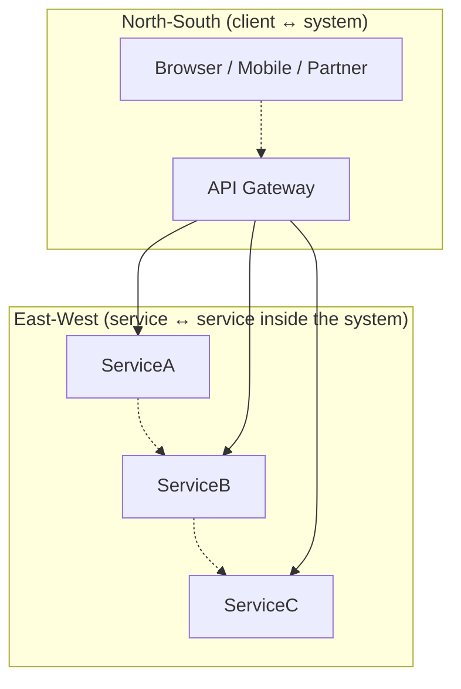
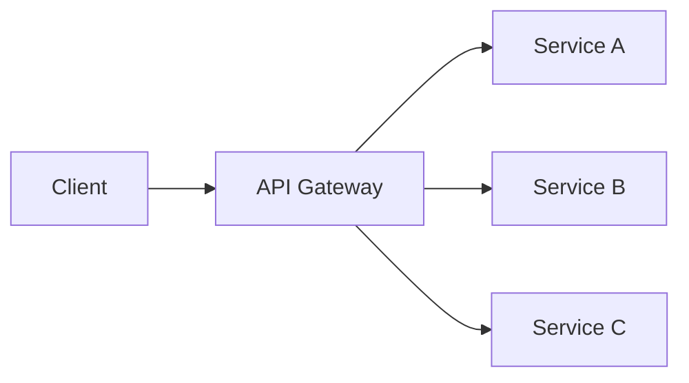
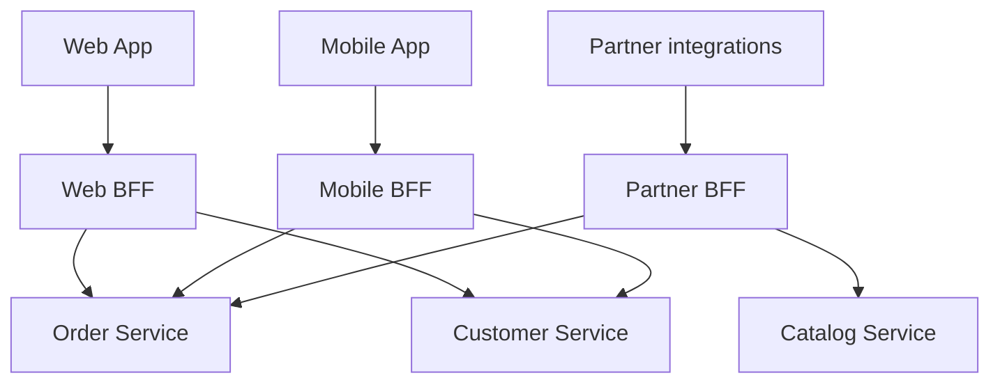
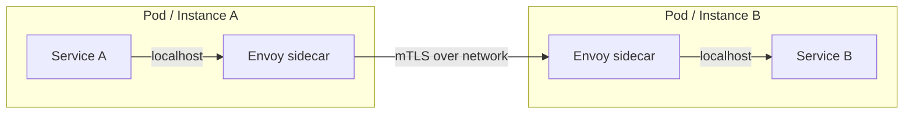
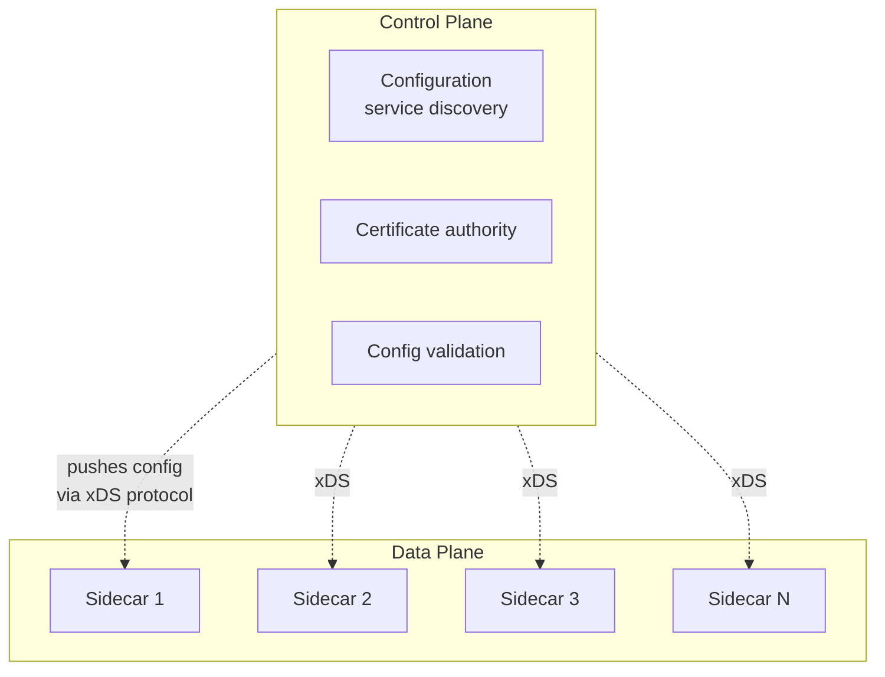
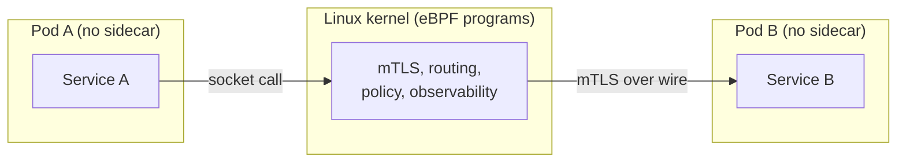
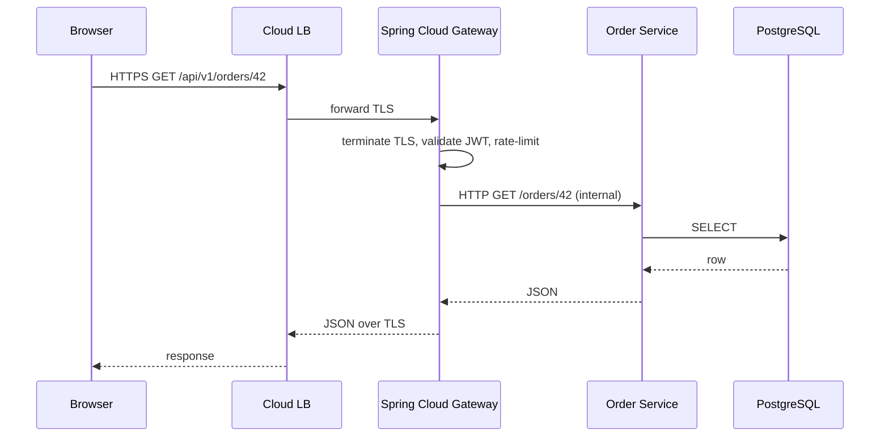
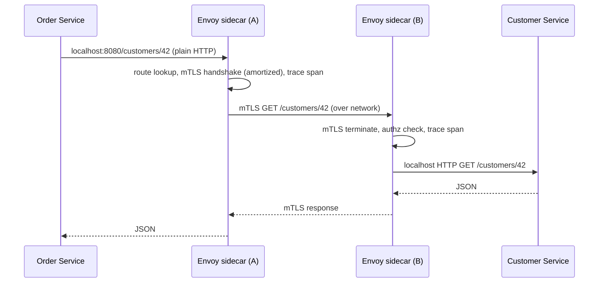

# API Gateway & Service Mesh

As a microservices system grows, the same cross-cutting concerns — authentication, rate limiting, TLS, retries, circuit breakers, observability, traffic shaping — appear in *every* service. Implementing them service-by-service produces 47 inconsistent implementations, three security incidents per quarter when one service forgets to apply the latest auth rule, and an operations team that cannot reason about the system as a whole. **API gateways** (the layer between clients and services — north-south traffic) and **service meshes** (the layer between services — east-west traffic) exist to handle these concerns *once*, in infrastructure rather than application code, so that each service can focus on its business logic.

The depth bar here is **what each component actually does, where it lives in the request path, how it costs you, and when it's wrong**. Not every team needs a service mesh; many teams that adopted one regret it (the operational burden of Istio in particular is legendary). We trace the request path through both a gateway and a mesh — what TLS termination means at the edge, what the **sidecar proxy** does to every inter-service call (and what its CPU/latency tax is), how the **control plane** distributes config to thousands of **data plane** proxies, how **eBPF-based** meshes (Cilium, 2023+) eliminated the sidecar tax for many workloads. We name the operational catastrophes that shaped the industry's view — the 2020 GitHub outage where a misconfigured rate-limit cascaded, the 2022 Istio control plane incident where a CRD change took down service discovery for hours, the 2018 Linkerd vs Istio adoption fork — and place the Java/Spring stack (Spring Cloud Gateway, Resilience4j, Micrometer) against the Kubernetes-native stack (Envoy, Istio, Linkerd, Cilium). By the end you will choose between rolling cross-cutting concerns into a gateway, a mesh, both, or neither, and articulate the operational cost of each choice in concrete terms.

> [!NOTE]
> Prerequisites: [Microservices Decomposition](./T05-microservices-decomposition.md), [Service Communication](./T06-service-communication-sync-vs-async.md). The gateway and mesh sit on top of the patterns from T06; their job is to handle once what each service would otherwise handle itself.

## Where API Gateways And Service Meshes Came From — Two Different 30-Year Lineages

API gateways and service meshes are often discussed together, but they have *distinct* historical origins. API gateways descend from **edge reverse proxies** of the 1990s (NGINX, Apache, F5 hardware load balancers); service meshes descend from **Netflix's mid-2010s internal infrastructure** plus **Envoy** at Lyft. Understanding the separate lineages prevents the common error of treating them as interchangeable.

### The API Gateway Lineage — From Reverse Proxies To Modern Gateways

#### The 1990s — Reverse Proxies And Load Balancers

The conceptual ancestor of the API gateway is the **reverse proxy** — a server that sits in front of other servers and forwards requests to them. The first widely-deployed reverse proxies were:

- **Apache HTTP Server's mod_proxy** (early 1990s): basic reverse proxy capability.
- **Squid Cache** (1996+): originally a forward proxy, used as a reverse proxy for HTTP acceleration.
- **F5 BIG-IP** (1997): hardware load balancers from F5 Networks — dedicated appliances costing $50K+.
- **NGINX** (Igor Sysoev, 2002): event-driven web server and reverse proxy, designed for high concurrency.

These tools provided basic gateway functions: routing requests to backend servers, load balancing, SSL termination, caching. They were not "API gateways" by name — that vocabulary came later — but they performed the core gateway functions.

#### Who Igor Sysoev Is

**Igor Sysoev** (born 1970) was a Russian software engineer who created NGINX in 2002 to solve a specific problem at Rambler (a Russian web portal) — handling 10,000 concurrent connections, which Apache couldn't do at the time. NGINX's event-driven architecture became the foundation for modern high-performance web infrastructure.

Sysoev open-sourced NGINX in 2004; by 2010 it was running a significant fraction of the web's top sites. Sysoev founded NGINX Inc. (commercial entity) in 2011; F5 Networks acquired NGINX Inc. in 2019 for $670M.

NGINX remains foundational — most modern API gateways (Kong, Tyk, AWS API Gateway) build on NGINX or borrow heavily from its design.

#### The 2010s — Modern API Gateways

The "API gateway" *vocabulary* emerged with the microservices movement around 2014. As teams split monoliths into many services, they needed a single entry point that could:

- Route requests to the right service.
- Apply cross-cutting concerns (authentication, rate limiting, logging).
- Hide internal service structure from clients.

The first dedicated API gateways:

- **Mashery** (2006): API management platform (acquired by Intel 2013, then TIBCO).
- **Apigee** (2010): API platform (acquired by Google 2016).
- **Kong** (2015): open-source API gateway built on NGINX.
- **AWS API Gateway** (2015): managed gateway service.
- **Spring Cloud Gateway** (2017): replacement for Netflix Zuul.

These products formalized the gateway pattern. By 2020, "API gateway" was standard vocabulary; most microservices systems had one.

### The Service Mesh Lineage — Netflix, Lyft, And The 2017 Synthesis

#### The 2013–2015 Netflix Era

The conceptual ancestor of the service mesh is **Netflix's open-source libraries** for resilient inter-service communication. Between 2012 and 2014, Netflix open-sourced:

- **Hystrix** (2012): circuit breaker library.
- **Eureka** (2012): service registry.
- **Ribbon** (2013): client-side load balancer.
- **Zuul** (2013): edge gateway.

The pattern: each Java service included these libraries; the libraries handled cross-cutting concerns. **The libraries were the implementation; each service ran them locally.**

This *library-based approach* had limitations:

- **Language-specific**: Hystrix worked for Java; non-Java services needed their own implementations.
- **Version drift**: services on different library versions had inconsistent behavior.
- **Upgrade pain**: rolling out a library upgrade required redeploying every service.

By 2015, Netflix engineers were looking for an alternative: a *language-independent* approach that worked across the polyglot service mesh Netflix was building.

#### The Envoy Proxy (Lyft, 2016)

The answer came not from Netflix but from **Lyft**. **Matt Klein** at Lyft was building infrastructure to handle Lyft's polyglot microservices (Python, Go, Java, Scala). He needed a *sidecar proxy* that could handle cross-cutting concerns *outside* the service code.

**Envoy** was released by Lyft in September 2016. Envoy's design choices:

- **Language-independent**: Envoy is a C++ proxy that runs alongside any application.
- **HTTP/2 native**: built-in support for modern protocols.
- **Hot reloads**: configuration changes without restart.
- **Rich observability**: built-in metrics, traces, logs.
- **xDS API**: configurable via remote APIs, enabling external control planes.

Envoy was a hit. Within months, multiple companies (Stripe, Square, Pinterest, Yelp) adopted it. By mid-2017, Envoy was the *de facto* standard sidecar proxy.

#### Who Matt Klein Is

**Matt Klein** is a software engineer who joined Lyft in 2015 specifically to build their service mesh infrastructure. Before Lyft, he was at Twitter, Amazon, and Microsoft. His specific expertise: distributed-systems infrastructure at scale.

Klein led Envoy from inception through its 2017 donation to CNCF. He's been the principal voice of the project — his conference talks (KubeCon, EnvoyCon) and writing have shaped how the industry thinks about service mesh.

#### The 2017 Service Mesh Synthesis

In May 2017, Google's **Istio** project announced itself — a *control plane* for Envoy sidecars. Istio (Greek for "sail") combined:

- **Envoy as the data plane** (the sidecars that move traffic).
- **A control plane** (Pilot, Citadel, Galley) that configured the Envoys.

This control plane / data plane separation became the canonical service mesh architecture. By 2018, multiple alternative meshes had emerged:

- **Linkerd 2** (Buoyant, 2018): Rust-based proxy, simpler control plane.
- **Consul Connect** (HashiCorp, 2018): mesh built on Consul.
- **AWS App Mesh** (2019): AWS managed mesh.
- **Open Service Mesh** (Microsoft, 2020): SMI-compliant mesh.

The 2017–2020 period was the *service mesh wars* — competing implementations of the same architectural pattern.

### The 2020+ Convergence And Critique

By 2020, two things were clear:

1. **Service meshes solved real problems** for large polyglot microservices deployments.
2. **Service meshes were operationally expensive** — Istio in particular became famous for complexity.

A 2020 reaction emerged: **Istio is too heavy for most teams**. Linkerd's lighter approach gained advocates; some teams adopted simpler alternatives. By 2024, the conversation has matured — service meshes are valuable for specific scales but not universal.

The current state: API gateways are *standard* for microservices systems (almost every team has one); service meshes are *common for large polyglot systems* but not universal.

## Why Gateways And Meshes, Specifically: The Senior Engineer's Q&A

### Q1: What's the actual difference between a gateway and a mesh?

**Gateway** handles **north-south traffic** (external clients to internal services). Sits at the edge of the system.

**Mesh** handles **east-west traffic** (internal service to internal service). Sits *between* services.

They overlap (both can do auth, both can do rate limiting), but their *primary purpose* and *placement* differ.

### Q2: When do I need a service mesh?

When you have **multiple polyglot services** with **cross-cutting concerns** that you don't want to implement N times. Specifically:

- **Mutual TLS** between services.
- **Distributed tracing** across services.
- **Circuit breaking** at the network layer.
- **Traffic shaping** for canary deployments.
- **Authorization policies** at the network layer.

If you have 3 services all in Java, you can use libraries (Spring Cloud, Resilience4j). If you have 30 services in 5 languages, libraries become painful and a mesh starts to pay back.

### Q3: Why is Istio famous for complexity?

Because **it does a lot** and its abstractions are *non-trivial*. Istio includes:

- Traffic management (VirtualService, DestinationRule, Gateway).
- Security (PeerAuthentication, AuthorizationPolicy).
- Observability (Telemetry, EnvoyFilter).
- Multicluster support.

Each abstraction is necessary for some use case but combines into a deep learning curve. Teams adopting Istio often spend 6–12 months becoming proficient.

Lighter alternatives (Linkerd 2) trade features for operational simplicity. The choice depends on team capability and feature needs.

### Q4: How does this relate to ingress controllers in Kubernetes?

**Kubernetes Ingress** is essentially a *built-in API gateway* for Kubernetes clusters. The Ingress resource defines routing rules; an Ingress controller (NGINX Ingress, AWS ALB Ingress, Traefik) implements them.

Most API gateways can deploy as Kubernetes Ingress controllers. The vocabulary is confusing — "Ingress" is the Kubernetes resource; "gateway" is the broader pattern; they overlap heavily.

### Q5: What's the relationship between gateways/meshes and the resilience patterns (T14 of C02)?

The resilience patterns (circuit breakers, retries, timeouts, bulkheads) were originally *implemented in code* (Hystrix, Resilience4j). Service meshes can implement many of them *in the proxy*, removing them from application code.

Trade-off: in-code patterns are *explicit* (engineers see them in the code) but require library upgrades. In-mesh patterns are *implicit* (engineers don't see them in code) but easier to upgrade centrally.

Most modern systems use both — application-level patterns for fine control, mesh-level patterns for cross-cutting policy.

## Common Misconceptions Explained

### "Gateways and meshes are the same thing."

False. They serve different purposes (north-south vs east-west) and have different design assumptions. Many systems use both.

### "Service meshes eliminate the need for circuit breakers in code."

Partially false. Meshes can apply circuit breakers at the network layer, but **fine-grained policy still needs application-level patterns**. Most systems use both.

### "Istio is the only real service mesh."

False. Linkerd 2, Consul Connect, AWS App Mesh, and others are real meshes. Istio has the largest mindshare but isn't always the best choice — Linkerd 2 is significantly simpler operationally.

### "API gateways are unnecessary if you have a load balancer."

False. Load balancers do basic routing; gateways add authentication, rate limiting, request transformation, API versioning, etc. The gateway is a *load balancer plus*.

### "Service meshes are required for microservices."

False. Many microservices systems use library-based resilience (Spring Cloud, Resilience4j) and don't have a mesh. Meshes are appropriate for *polyglot* systems where library-based patterns become unmaintainable.

### "Adding a mesh fixes microservice complexity."

False. Meshes *transform* complexity (from in-code to in-infrastructure) but don't eliminate it. Operating Istio is non-trivial; the complexity moves to the platform team.

## North-South vs East-West Traffic — The Two Regions

A microservices system has two distinct traffic regions, with different concerns.



- **North-south (client ↔ system)** — outside callers reaching the services. The **API gateway** sits at this boundary. Concerns: authentication of external identities, rate-limiting external callers, TLS termination, API versioning, request transformation, public documentation.
- **East-west (service ↔ service)** — services calling each other inside the perimeter. The **service mesh** sits at this boundary. Concerns: mutual TLS between services, retries, circuit breakers, traffic shaping (canary deployments), observability of inter-service calls.

The distinction matters because the policies differ. An external request needs OAuth/OIDC validation; an internal request needs mTLS plus a service identity. An external IP needs aggressive rate limits; an internal service needs sane retry budgets. A gateway designed for east-west traffic (or a mesh used for north-south) produces operational headaches.

Some systems collapse the two — Spring Cloud Gateway can do both, Istio's `Gateway` resource handles both, AWS API Gateway + AppMesh handle both. Mature systems usually split — a north-south gateway with one tool, an east-west mesh with another, each optimized for its purpose.

## API Gateway — The Front Door

An **API gateway** is a reverse proxy that sits in front of a microservices system, handling cross-cutting concerns for external traffic.



### What An API Gateway Does

1. **Routing**. Maps `/v1/orders/*` → Order Service, `/v1/customers/*` → Customer Service. The single client-facing URL → many backend services.
2. **Authentication & authorization**. Validates JWTs / API keys at the edge; rejects unauthenticated traffic before it reaches services. Often integrates with an identity provider (Okta, Auth0, Cognito, Keycloak).
3. **Rate limiting**. Caps requests-per-second per IP, per API key, per route. Protects downstream services from abuse.
4. **TLS termination**. Decrypts HTTPS once at the edge; speaks HTTP (often mTLS inside the perimeter) to downstream services.
5. **Request/response transformation**. Strips internal headers; rewrites paths; converts between protocols (REST → gRPC, GraphQL → REST).
6. **Versioning**. `/v1/*` to old services, `/v2/*` to new services; routes by URL or header.
7. **Aggregation (BFF — Backend for Frontend)**. Combines responses from multiple services into one client-friendly payload. Reduces the client's network round-trips. Distinct mobile/web/partner gateways may exist.
8. **Caching**. CDN-style edge caching of GETable responses.
9. **Observability**. Logs every external request; emits metrics; participates in distributed tracing.

### Popular Implementations

| Gateway | Sweet spot | Notes |
|---------|-----------|-------|
| **Spring Cloud Gateway** | Spring Boot shops; rich routing + filter chain in Java | Reactor-based; easy to extend with custom Java filters |
| **Kong** | Polyglot orgs; large plugin ecosystem | Built on Nginx; declarative config; commercial features |
| **AWS API Gateway** | AWS-native, serverless backends | Tight Lambda integration; cost can surprise at scale |
| **Envoy + xDS (custom)** | Highest-performance / large-scale | Used by Lyft, Pinterest, Square at their scale |
| **NGINX / NGINX Plus** | Mature, simple, fast | Veteran tool; less microservice-aware |
| **Tyk, Apigee, Mulesoft** | API management with monetization | Enterprise tier; business-side features (catalogs, billing) |

For a Spring Boot shop in 2026, the typical default is **Spring Cloud Gateway** at the edge unless the team has reasons to invest in Kong or AWS API Gateway. For Kubernetes-native deployments, the **Gateway API** standard (replacing Ingress) is increasingly the answer, with implementations from Istio, Envoy, NGINX, and others.

### A Spring Cloud Gateway Route

```yaml
spring:
  cloud:
    gateway:
      routes:
      - id: orders
        uri: lb://order-service
        predicates:
        - Path=/api/v1/orders/**
        - Method=GET,POST,PUT,DELETE
        filters:
        - StripPrefix=2
        - name: RequestRateLimiter
          args:
            redis-rate-limiter.replenishRate: 100
            redis-rate-limiter.burstCapacity: 200
            key-resolver: "#{@userKeyResolver}"
        - name: CircuitBreaker
          args:
            name: orderCircuitBreaker
            fallbackUri: forward:/orders/fallback
      - id: customers
        uri: lb://customer-service
        predicates:
        - Path=/api/v1/customers/**
        filters:
        - StripPrefix=2
```

Three concerns — routing, rate limiting, circuit breaking — declared in YAML, applied at the edge, *removed* from each downstream service.

### The BFF Pattern — One Gateway Per Client Type

A common refinement: **one gateway per client type** — a web BFF, a mobile BFF, a partner BFF. Each shapes responses for its consumer (web wants 100 fields; mobile wants 12 for battery; partners want a stable contract). The BFF lives close to the client team, owned by them, and orchestrates calls to backend services.



The BFF is *not* a microservice; it's a presentation tier owned by the client team. It is "the gateway" *for that client*. The pattern is widely used (Netflix BFFs, Soundcloud BFFs, ThoughtWorks publications).

## Service Mesh — The Sidecar Approach To East-West

A **service mesh** handles cross-cutting concerns for inter-service traffic by **injecting a sidecar proxy** next to each service instance. The application calls localhost; the sidecar handles the network.



The application makes a normal HTTP call to `serviceB.default.svc.cluster.local` (or even `localhost:8080`). The sidecar intercepts (via iptables / eBPF), upgrades to mTLS, applies circuit breaking / retries / load balancing / metrics, and forwards. The receiving sidecar does the reverse on the other side.

### What A Service Mesh Provides

1. **mTLS everywhere** — every service-to-service call is authenticated and encrypted with certificates rotated by the mesh's CA. No application code change.
2. **Retries and timeouts** — declarative per-route policy ("retry up to 3× with exponential backoff").
3. **Circuit breaking** — opens when downstream errors exceed a threshold.
4. **Traffic shaping** — route 5% of traffic to the new version (canary), 50% to A and 50% to B (blue-green), gradual rollout based on metrics.
5. **Observability** — uniform metrics (request rate, error rate, latency p50/p95/p99) per service-pair, distributed tracing headers propagated automatically.
6. **Service discovery** — sidecar knows where instances of service B live (often via Kubernetes service DNS).
7. **Authorization policies** — service A may call service B's `/orders/*`; service C may not. Enforced at the proxy.
8. **Rate limiting per service-pair** — independent of north-south rate limits.

### Control Plane vs Data Plane

Every mesh has two parts:



- **Data plane** — the sidecar proxies (typically Envoy) that actually move traffic.
- **Control plane** — the orchestrator that configures the data plane: where services live, what certificates to use, what routes/retries/timeouts apply.

Istio's control plane is `istiod` (consolidated since 1.5 from earlier Pilot + Citadel + Galley — see [T04](./T04-monolith-vs-microservices-vs-modular-monolith.md#istio-2018---microservices---modular-monolith-plane) for the "even Istio gave up on microservices for their own infra" story). Linkerd's is `linkerd-controller`. Cilium's combines mesh + CNI control planes.

The control plane is **critical infrastructure**. When it goes down, existing connections often keep working (sidecars cache config) but new pods cannot join the mesh, new routes cannot be configured, and certificate rotation eventually breaks every connection.

### Popular Service Meshes

| Mesh | Approach | Sweet spot | Notes |
|------|----------|-----------|-------|
| **Istio** | Envoy sidecar, complex control plane | Large k8s deployments; teams with platform engineers | Most feature-rich, highest operational cost |
| **Linkerd** | Rust-based "linkerd2-proxy" sidecar | Simpler than Istio; same shape | Famously easy to operate; CNCF graduated |
| **Cilium Service Mesh** | eBPF-based, sidecarless | Performance-sensitive workloads | New (2022+); no sidecar tax; tighter to kernel |
| **AWS App Mesh** | Envoy on ECS/EKS, AWS-managed | AWS-native shops | Less feature-rich; AWS lock-in |
| **Consul Connect** | HashiCorp; multi-platform | Hybrid cloud, VM + container | Less k8s-tied |
| **NGINX Service Mesh** | NGINX sidecar | Existing NGINX shops | Smaller market share |

### The Sidecar Tax — What It Actually Costs

A sidecar proxy is a separate Envoy process (typical: 50–200 MB RAM, 0.1–0.5 CPU cores) per pod. For 1,000 pods, that's 50–200 GB of RAM and 100–500 cores just for sidecars. Real numbers from medium-sized teams:

- **Lyft (Envoy's birthplace)**: ~3,000 services × Envoy sidecars; sidecar overhead measured at ~10% of total cluster compute.
- **A typical 50-service Spring Boot shop**: sidecar adds ~1–3 ms p99 latency per hop, ~50 MB per pod, ~5% extra CPU.

Per-call latency overhead of Envoy: **~0.5 ms p50, ~1–2 ms p99** for a passthrough. mTLS handshake (amortized over keepalive) adds ~50 µs steady-state. Retries can hide their cost in success cases but multiply load on failures.

### eBPF-Based Meshes — Removing The Sidecar

eBPF (extended Berkeley Packet Filter, Linux kernel feature stabilized in 4.x, 2018+) lets userspace programs run inside the kernel network path. **Cilium Service Mesh** (Isovalent, GA 2022) uses eBPF to implement mesh features directly in the kernel — no sidecar process, no extra IP hop, lower latency, lower memory.



The trade-off: kernel-level programming is harder to debug, requires modern kernels, and doesn't yet have the policy richness of mature Envoy-based meshes. By 2026 it is a viable choice for performance-critical workloads; Istio has begun moving toward sidecarless via its **Ambient Mesh** mode (Envoy node-proxy instead of per-pod).

The industry trend: **toward fewer sidecars per pod**. Either consolidated node-level proxies, eBPF, or both. The era of "Envoy per pod" peaks around 2022 and softens after.

## When You Need A Gateway, A Mesh, Both, Or Neither

The matrix:

| Situation | Gateway? | Mesh? |
|-----------|---------|-------|
| Monolith | Optional (load balancer often suffices) | No |
| Modular monolith | Same as monolith | No |
| 3–5 microservices | Yes (sane routing + auth + rate limit) | Probably no (handle in code with Resilience4j) |
| 10–30 microservices | Yes | Maybe (start with library-based resilience; add mesh if pain) |
| 30+ microservices, dedicated platform team | Yes | Yes (Istio or Linkerd) |
| Lambda/serverless | Provider-native gateway (API Gateway, App Gateway) | No (no long-lived process) |
| Strict regulatory mTLS everywhere | Yes | Yes (mesh enforces uniformly) |
| Small Spring Boot shop, no k8s platform team | Yes (Spring Cloud Gateway) | **NO — DO NOT INSTALL ISTIO** |

The last row deserves emphasis. Istio is *enterprise infrastructure*. It requires people who run Istio as their job — to debug control-plane CRD reconciliations, to tune Envoy, to troubleshoot mTLS certificate rotation. A team without that capability adopting Istio is taking on a ~1-engineer-year operational debt for benefits that Resilience4j + Spring Boot Actuator + a single edge gateway would deliver for almost free. **The number of mid-sized teams that regret adopting Istio is high.**

Linkerd is the simpler alternative — same shape, half the operational cost — and the right choice for teams that genuinely need a mesh but don't have an Istio specialist. Cilium is the path forward for teams already on advanced Kubernetes (Cilium CNI) where the mesh integrates naturally.

## The Operational Reality — Real Incidents

### GitHub, 2020 — Cascading Rate Limit

A misconfigured rate limit at the edge gateway dropped a small percentage of search requests. The clients retried, generating more requests, hitting the rate limit harder, generating more retries — until the gateway was processing twice the original load and timing out the rest. The fix wasn't application code; it was lowering the retry rate at the client and adding rate-limit budgets at the gateway.

**Lesson**: rate limits and retries interact viciously. Always model the retry behavior of all clients when setting limits.

### Istio Control Plane Failures, 2022+

Several large teams reported control-plane failures where a misapplied CRD (e.g., a `DestinationRule` with an unbounded selector) cascaded through `istiod` and caused config-distribution failures across thousands of pods. The data plane kept old config, but new deployments could not join; mTLS rotation eventually broke connections. Hours-long outages.

**Lesson**: the control plane is critical infrastructure. Treat its config as production code — CI validation, canary rollouts, the works.

### Lyft Envoy Memory Leak, 2019

A specific Envoy version had a memory leak in its xDS subscription. With ~3,000 sidecars per cluster, the leak per sidecar became a cluster-wide outage. Lyft engineering tracked it down to a specific config-watch path.

**Lesson**: the data plane is *also* critical infrastructure. Pin versions; canary upgrades; have rollback plans.

### Spring Cloud Netflix Deprecation, 2019–2021

The original Spring Cloud Netflix stack (Hystrix, Ribbon, Zuul 1) was deprecated in favor of Spring Cloud Gateway, Resilience4j, and Spring Cloud LoadBalancer. Teams that had built on the old stack faced multi-quarter migrations. The fix wasn't Spring's fault — Netflix open-sourced and then de-prioritized maintenance — but the lesson is clear.

**Lesson**: pick widely-adopted, well-maintained gateway/mesh tech. Be willing to migrate when the ecosystem moves.

## How Calls Physically Travel — Two Traced Examples

### Example 1: External Request Through Gateway Only

A browser makes `GET /api/v1/orders/42`.



The gateway adds ~3–5 ms (TLS termination, JWT validation, rate-limit check, routing decision). Without it, every service would have to do these — and would do them inconsistently.

### Example 2: Internal Service Call Through Mesh

The Order Service calls Customer Service to enrich an order.



The sidecars add ~1 ms each side and provide mTLS, observability, circuit-breaking, and retries for *free* — no code in the services. The cost is the sidecar's memory (~50 MB per pod), the operational complexity (Envoy upgrades, control-plane management), and ~1–2 ms p99 latency per hop.

## Without A Mesh — How Spring Does It In Code

For teams not running a mesh, Spring + Resilience4j provides most of the resilience patterns *in the service*:

```java
@RestController
class OrderController {
  private final RestClient client;

  @CircuitBreaker(name = "customer", fallbackMethod = "fallback")
  @Retry(name = "customer")
  @TimeLimiter(name = "customer")
  Customer fetchCustomer(long id) {
    return client.get().uri("/customers/{id}", id).retrieve().body(Customer.class);
  }

  Customer fallback(long id, Throwable t) {
    return Customer.unknown(id);
  }
}
```

```yaml
resilience4j.circuitbreaker.instances.customer:
  failureRateThreshold: 50
  slidingWindowSize: 20
  waitDurationInOpenState: 30s
```

For 10 services with shared resilience policy, this is fine. For 100, the policy drifts across teams; a mesh's central policy enforcement starts to pay. **The crossover point is roughly 20–30 services with multiple teams.**

## Trade-Off Summary

| Concern | Solve in code | Solve in gateway | Solve in mesh |
|---------|---------------|-------------------|----------------|
| External auth (OAuth) | ✓ (heavy) | ✓✓ (sane) | ✗ |
| Internal mTLS | ✗ (don't) | ✓ (TLS termination only) | ✓✓ (everywhere) |
| Rate limit external | ✗ | ✓✓ | ✗ |
| Rate limit per-service-pair | ✗ | ✗ | ✓✓ |
| Circuit breaker | ✓ (Resilience4j) | ✓ | ✓✓ |
| Retry | ✓ | ✓ | ✓✓ |
| Canary deployment | ✗ | partial | ✓✓ |
| Distributed tracing | ✓ (Sleuth) | ✓ | ✓✓ |
| Routing / versioning | ✗ | ✓✓ | partial |
| BFF aggregation | ✓ | ✓✓ | ✗ |
| Service discovery | ✓ (Eureka) | partial | ✓✓ |

`✓✓` = natural home. `✓` = possible but not ideal. `✗` = wrong place.

> [!INTERVIEW]
> A common L5 prompt: "Why would you use Istio?" Strong answers (a) specify the team size and service count where it pays, (b) explicitly call out the operational cost, (c) name the simpler alternative (Linkerd, Cilium, or in-code Resilience4j), (d) describe a real incident or trade-off they've observed.

## Deeper Dive — Spring Cloud Gateway Complete Configuration

### Production Gateway YAML

```yaml
spring:
  cloud:
    gateway:
      # Global defaults
      default-filters:
        - AddRequestHeader=X-Gateway-Source, spring-cloud-gateway
        - PreserveHostHeader
      
      # Route definitions
      routes:
        - id: order-service
          uri: lb://order-service
          predicates:
            - Path=/api/v1/orders/**
          filters:
            - StripPrefix=2
            - name: CircuitBreaker
              args:
                name: order-cb
                fallbackUri: forward:/fallback/orders
            - name: RequestRateLimiter
              args:
                redis-rate-limiter.replenishRate: 100
                redis-rate-limiter.burstCapacity: 200
                redis-rate-limiter.requestedTokens: 1
            - name: Retry
              args:
                retries: 3
                statuses: BAD_GATEWAY,GATEWAY_TIMEOUT
                methods: GET,POST
                backoff:
                  firstBackoff: 100ms
                  maxBackoff: 1s
                  factor: 2
            - SetResponseHeader=X-Response-From, order-service
            
        - id: payment-service
          uri: lb://payment-service
          predicates:
            - Path=/api/v1/payments/**
            - Header=Authorization, Bearer .*
          filters:
            - StripPrefix=2
            - name: TokenRelay   # forwards OAuth2 token
            
        - id: search-service
          uri: lb://search-service
          predicates:
            - Path=/api/v1/search/**
          filters:
            - StripPrefix=2
            # Aggressive caching for search results
            - SetResponseHeader=Cache-Control, "public, max-age=60"

  redis:
    host: redis-master.svc.cluster.local
    port: 6379

  security:
    oauth2:
      resourceserver:
        jwt:
          jwk-set-uri: ${JWT_ISSUER_URI}/protocol/openid-connect/certs
```

### Custom Filter: Request Logging + Trace Propagation

```java
@Component
public class TraceLoggingGatewayFilter implements GlobalFilter, Ordered {

    @Override
    public Mono<Void> filter(ServerWebExchange exchange, GatewayFilterChain chain) {
        ServerHttpRequest req = exchange.getRequest();
        String traceId = req.getHeaders().getFirst("X-Request-ID");
        if (traceId == null) {
            traceId = UUID.randomUUID().toString();
            req = req.mutate().header("X-Request-ID", traceId).build();
            exchange = exchange.mutate().request(req).build();
        }

        long startMs = System.currentTimeMillis();
        String finalTraceId = traceId;

        return chain.filter(exchange).doFinally(signal -> {
            ServerHttpResponse resp = exchange.getResponse();
            long elapsedMs = System.currentTimeMillis() - startMs;
            log.info("gateway request method={} path={} status={} elapsed={}ms trace_id={}",
                req.getMethod(), req.getPath(), resp.getStatusCode(), elapsedMs, finalTraceId);
        });
    }

    @Override
    public int getOrder() { return Ordered.HIGHEST_PRECEDENCE; }
}
```

### Custom Filter: BFF Response Aggregation

```java
@Component
public class OrderDetailsBffFilter implements GatewayFilter {
    private final WebClient orderClient;
    private final WebClient customerClient;
    private final WebClient inventoryClient;

    @Override
    public Mono<Void> filter(ServerWebExchange exchange, GatewayFilterChain chain) {
        String orderId = exchange.getRequest().getQueryParams().getFirst("orderId");

        Mono<Order> orderMono = orderClient.get()
            .uri("/orders/{id}", orderId)
            .retrieve()
            .bodyToMono(Order.class);

        Mono<Customer> customerMono = orderMono.flatMap(o ->
            customerClient.get()
                .uri("/customers/{id}", o.customerId())
                .retrieve()
                .bodyToMono(Customer.class)
        );

        Mono<List<InventoryStatus>> inventoryMono = orderMono.flatMap(o ->
            Flux.fromIterable(o.items())
                .flatMap(item -> inventoryClient.get()
                    .uri("/inventory/{sku}", item.sku())
                    .retrieve()
                    .bodyToMono(InventoryStatus.class))
                .collectList()
        );

        return Mono.zip(orderMono, customerMono, inventoryMono)
            .map(tuple -> new OrderDetailsBffResponse(
                tuple.getT1(), tuple.getT2(), tuple.getT3()
            ))
            .flatMap(response -> writeResponse(exchange.getResponse(), response));
    }
}
```

## Deeper Dive — Istio Service Mesh Configuration

### Installation and Setup

```bash
# Install Istio
istioctl install --set profile=production

# Enable sidecar injection for namespace
kubectl label namespace production istio-injection=enabled

# Restart pods to receive sidecars
kubectl rollout restart deployment -n production
```

### VirtualService — Routing Rules

```yaml
apiVersion: networking.istio.io/v1beta1
kind: VirtualService
metadata:
  name: order-service
  namespace: production
spec:
  hosts:
    - order-service
  http:
    # Canary deployment: 5% to v2, 95% to v1
    - match:
        - headers:
            x-canary:
              exact: "true"
      route:
        - destination:
            host: order-service
            subset: v2
            
    - route:
        - destination:
            host: order-service
            subset: v1
          weight: 95
        - destination:
            host: order-service
            subset: v2
          weight: 5
      timeout: 5s
      retries:
        attempts: 3
        perTryTimeout: 2s
        retryOn: 5xx,reset,connect-failure
```

### DestinationRule — Traffic Policies

```yaml
apiVersion: networking.istio.io/v1beta1
kind: DestinationRule
metadata:
  name: order-service
spec:
  host: order-service
  trafficPolicy:
    connectionPool:
      tcp:
        maxConnections: 100
      http:
        http2MaxRequests: 1000
        maxRequestsPerConnection: 10
        h2UpgradePolicy: UPGRADE
    outlierDetection:
      consecutive5xxErrors: 5
      interval: 30s
      baseEjectionTime: 30s
      maxEjectionPercent: 50
    loadBalancer:
      simple: LEAST_REQUEST
  subsets:
    - name: v1
      labels:
        version: v1
    - name: v2
      labels:
        version: v2
```

### PeerAuthentication — mTLS Everywhere

```yaml
apiVersion: security.istio.io/v1beta1
kind: PeerAuthentication
metadata:
  name: default
  namespace: production
spec:
  mtls:
    mode: STRICT   # require mTLS for all in-namespace traffic
```

### AuthorizationPolicy — Service-to-Service Authorization

```yaml
apiVersion: security.istio.io/v1beta1
kind: AuthorizationPolicy
metadata:
  name: payment-service-access
  namespace: production
spec:
  selector:
    matchLabels:
      app: payment-service
  action: ALLOW
  rules:
    - from:
        - source:
            principals:
              - "cluster.local/ns/production/sa/order-service"
              - "cluster.local/ns/production/sa/refund-service"
      to:
        - operation:
            methods: ["POST"]
            paths: ["/api/v1/charges/*"]
```

### Telemetry Configuration

```yaml
apiVersion: telemetry.istio.io/v1alpha1
kind: Telemetry
metadata:
  name: default
spec:
  metrics:
    - providers:
        - name: prometheus
    - overrides:
        - match:
            metric: REQUEST_COUNT
          tagOverrides:
            request_method:
              value: "request.method"
            response_code:
              value: "response.code"
  tracing:
    - providers:
        - name: jaeger
      randomSamplingPercentage: 1.0   # 1% sampling
```

## Deeper Dive — Mesh vs Code Trade-off

### Resilience4j (In-Code)

```java
@Service
public class PaymentClient {
    
    @CircuitBreaker(name = "payment-cb", fallbackMethod = "queuePayment")
    @Retry(name = "payment-retry")
    @TimeLimiter(name = "payment-timeout")
    public CompletableFuture<PaymentResult> charge(Money amount) {
        return CompletableFuture.supplyAsync(() ->
            webClient.post()
                .uri("/payments")
                .bodyValue(new ChargeRequest(amount))
                .retrieve()
                .bodyToMono(PaymentResult.class)
                .block()
        );
    }
}
```

### Same Behavior via Istio (No Code)

```yaml
apiVersion: networking.istio.io/v1beta1
kind: DestinationRule
spec:
  host: payment-service
  trafficPolicy:
    connectionPool:
      http:
        maxRequestsPerConnection: 1
    outlierDetection:
      consecutive5xxErrors: 5
      baseEjectionTime: 30s
    
---
apiVersion: networking.istio.io/v1beta1
kind: VirtualService
spec:
  http:
    - timeout: 3s
      retries:
        attempts: 3
        perTryTimeout: 1s
        retryOn: 5xx
```

### Trade-off

```
RESILIENCE4J (In-Code):
  + Application-level: knows business context (idempotency, retry logic)
  + Granular: per-method config
  + Fallback methods: return cached, default, queued
  + No mesh required
  
  - Code complexity in every client
  - Library/version coordination across services
  - Per-language implementations needed

ISTIO (Mesh):
  + Polyglot: works for any language
  + Centralized: ops team can adjust without redeploy
  + Standardized: same patterns across services
  - Less context-aware (just HTTP status)
  - Operational complexity (control plane)
  - Sidecar latency tax (~1-3ms per hop)
  - Hard to express fallback logic (just retry/circuit-break)

HYBRID (BEST FOR MOST):
  Istio handles: mTLS, basic retry, basic circuit breaker, observability
  Code handles: business-specific fallback (queue, cache, default), idempotency
```

## Deeper Dive — Production Operational Concerns

### Sidecar Resource Overhead

```
PER POD:
  Envoy sidecar: ~30 MB memory, ~0.05 CPU
  
100 PODS:
  Mesh overhead: 3 GB memory + 5 CPU
  
SCALING:
  At 10K pods: 300 GB + 500 CPU just for sidecars
  
COMPARISON:
  In-code Resilience4j: ~5 MB extra per pod (library)
  10K pods: 50 GB
  
TIPPING POINT:
  At <50 services: in-code wins
  At 50-200 services: depends on team / polyglot
  At 200+ services: mesh usually wins
```

### Control Plane Failure Modes

```
WHAT BREAKS IF ISTIOD GOES DOWN:
  ✓ Existing pods continue working (sidecars cached config)
  ✓ Established mTLS connections continue
  ✗ New pods can't get sidecar config
  ✗ New routes can't be added
  ✗ Certificate rotation breaks after cert expires (~24 hours)

DISASTER RECOVERY:
  - Run multiple istiod instances (3+)
  - Etcd backup for config
  - Monitor istiod CPU/memory aggressively
  - Test istiod-down scenarios in chaos drills
```

### Cost Analysis at Scale

```
SCENARIO: 100-service cluster, 5 pods each = 500 pods

ISTIO COSTS:
  Sidecar overhead: 500 × 30MB = 15 GB extra memory ($150/month)
  Sidecar CPU: 500 × 0.05 = 25 CPU ($500/month)
  Latency tax: 1-3ms per hop × avg 5 hops = 5-15ms p99 added
  Control plane: 3 istiod instances ($300/month)
  
TOTAL: ~$1K/month + observability infrastructure

WITHOUT ISTIO (using Resilience4j):
  Library overhead: minimal ($0)
  Team build/maintain in-code: ~1 engineer-week per quarter ($20K/year)
  
ROI BREAK-EVEN:
  At 30+ services where ops team can handle mesh
  At 5+ teams (cross-team consistency value)
  At polyglot (Java + Go + Python): mesh wins
```

## Deeper Dive — Linkerd vs Istio vs Cilium

| Aspect | Istio | Linkerd | Cilium Service Mesh |
|---|---|---|---|
| **Data plane** | Envoy sidecars | Lightweight Rust proxy | eBPF in kernel + Envoy where needed |
| **Latency overhead** | 1-3ms | <0.5ms | Near-zero (kernel-level) |
| **Memory per pod** | 30-100 MB | 10-20 MB | 0 (no sidecar) |
| **Feature richness** | Most | Less | Growing |
| **Configuration** | Complex | Simple | Simple to moderate |
| **mTLS** | Yes (manual cert setup) | Yes (zero-config) | Yes |
| **L7 routing** | Yes | Yes | Limited |
| **Operational complexity** | High | Low-medium | Medium |
| **Multi-cluster** | Excellent | Good | Good |
| **Adoption** | Largest | Active | Growing fast |

**Decision shortcut**:
- Need many features, polyglot, large platform team → Istio
- Simple needs, fewer services, JVM/Go primarily → Linkerd
- Performance-critical, latency-sensitive → Cilium
- Just need cross-service mTLS + observability → Linkerd

## Deeper Dive — Real Production Incidents

### Incident 1: Istio Cert Rotation Failure (2020)

```
SCENARIO:
  Production cluster running Istio 1.6
  Certificate rotation cron job failed silently for 7 days
  Sidecar certs expired
  All mTLS connections failed simultaneously
  Cascading failure across cluster

IMPACT: 90-minute outage during East Coast business hours

LESSONS:
  - Alert on certificate expiry well in advance
  - Monitor istio-citadel pod health
  - Test cert rotation in dev/staging
  - Have rollback plan
```

### Incident 2: Gateway as Single Point of Failure

```
SCENARIO:
  Single API gateway pod (no HA)
  Memory leak in custom filter
  Gateway crashed
  ALL traffic stopped (no other ingress path)

IMPACT: 45-minute total outage

LESSONS:
  - Always run 3+ gateway replicas
  - Health checks on gateway itself
  - Monitor gateway memory/CPU
  - Have backup ingress path (e.g., direct service ingresses)
```

### Incident 3: Sidecar Resource Exhaustion

```
SCENARIO:
  Spike in traffic at 5pm
  Sidecars hit CPU limit (0.05 → 0.1 needed)
  Sidecar throttling caused timeouts
  Cascading retry storms

LESSONS:
  - Don't undersized sidecars
  - Monitor sidecar CPU/memory utilization
  - Set VPA (vertical pod autoscaler) on sidecars
```

## Practice

1. **Trace your own gateway.** Find your team's API gateway. Read its config (Spring Cloud Gateway YAML, Kong's declarative file, AWS API Gateway routes). Map every cross-cutting concern it handles. List which would otherwise live in services.
2. **The BFF design.** Sketch a BFF for a mobile app over an order-management system. Specify which fields the mobile client needs (vs the web equivalent), and how the BFF aggregates 3 service calls into one response.
3. **mTLS audit.** In any Kubernetes microservice system, find one inter-service call. Confirm whether it uses mTLS today. If not, design how a mesh would add it without changing the service code.
4. **Sidecar latency measurement.** In an Istio or Linkerd deployment, measure inter-service p50/p99 with and without mesh injection (toggle namespace label). Compare. Compute the per-hop sidecar tax.
5. **Control-plane failure drill.** Take an Istio control plane down deliberately in a test cluster. Observe what continues working (existing connections), what stops (new routes), and how long until certificate rotation breaks things.
6. **Rate-limit interaction.** Two services, both call a third. The third has an edge rate limit of 1000 req/s. Each upstream retries 3× on failure. Show the cascade: at what point does the rate limit cause more harm than good?
7. **Resilience4j vs mesh.** For one inter-service call, implement the resilience pattern (circuit breaker, retry, timeout) both in code (Resilience4j) and via Istio's `DestinationRule`. Compare the developer experience and ops surface.
8. **Cost analysis.** For a 100-service cluster, estimate the sidecar overhead in compute and memory. Compare to the per-service cost of building the resilience in-code. Above what service count does the mesh pay back?
9. **Linkerd vs Istio choice.** Write a 1-page memo recommending one for a 30-service Spring Boot shop with no dedicated platform engineer. Justify.
10. **Cilium evaluation.** Read the [Cilium Service Mesh architecture docs](https://cilium.io/use-cases/service-mesh/). Identify three workloads where the sidecarless model is significantly better than Envoy-per-pod, and one where it isn't.

## Recap

You should now be able to:

- Distinguish **north-south** (client ↔ system) from **east-west** (service ↔ service) traffic and their distinct concerns.
- Name what an **API gateway** does — routing, auth, rate limiting, TLS termination, request transformation, aggregation, versioning, observability — and choose between Spring Cloud Gateway, Kong, AWS API Gateway, Envoy by team size and stack.
- Use the **BFF (Backend for Frontend)** pattern to shape responses for distinct client types (web, mobile, partner).
- Explain a **service mesh's** value: mTLS, retries, circuit breaking, traffic shaping, observability, all without application code changes.
- Distinguish **control plane** (orchestrator) and **data plane** (sidecars) and recognize each as critical infrastructure.
- Compare **Istio, Linkerd, Cilium, AWS App Mesh** by operational cost, feature richness, and ecosystem fit.
- Name the **sidecar tax** in concrete numbers (~50–200 MB per pod, ~1–2 ms p99 latency per hop, ~5% extra CPU) and identify when it's acceptable.
- Explain **eBPF-based meshes** (Cilium, Istio Ambient) and the industry trend away from per-pod sidecars.
- Choose between **gateway**, **mesh**, **both**, **neither** by team size, service count, regulatory needs, and operational capability.
- Refuse **Istio adoption** for a team without a dedicated platform engineer; reach for Linkerd, Cilium, or Resilience4j + Spring Cloud Gateway as the simpler alternatives.
- Cite **real incidents** (GitHub 2020 rate-limit cascade, Istio control-plane failures, Lyft Envoy memory leak, Spring Cloud Netflix deprecation) and the lessons each carries.
- Implement equivalent resilience in **Spring + Resilience4j** when a mesh is overkill.

## Next

Continue to [Event Sourcing](./T08-event-sourcing.md) — an architectural style where the database stores not state but the *events that produced* state, with consequences for audit, replay, and integration that reshape the application's design.
