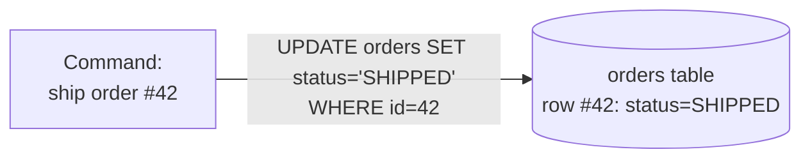
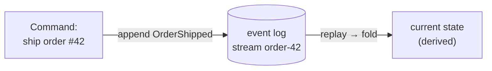
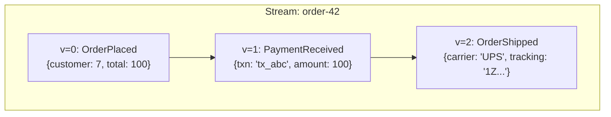
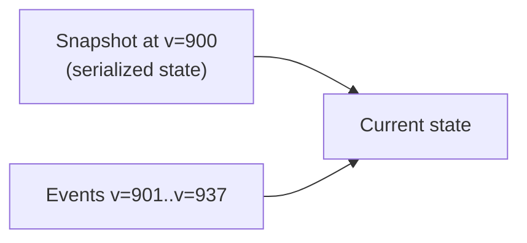
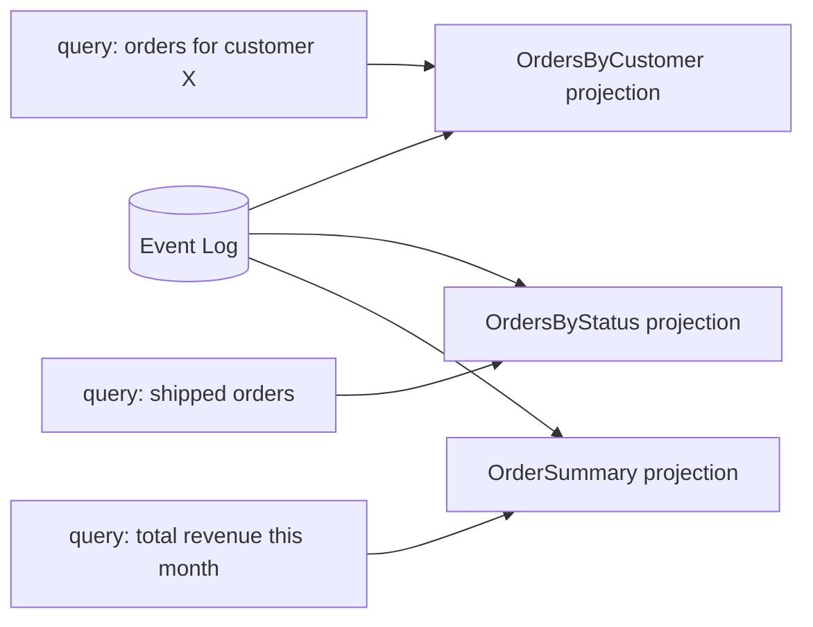
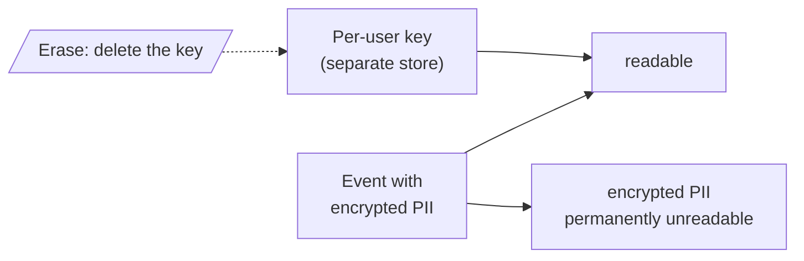

# Event Sourcing

In traditional persistence, a database row holds the *current state* of an entity: `orders.status = 'SHIPPED'`. The history of how the order reached that state — who placed it, who paid, who picked it, who labeled it, who handed it to the carrier — is gone, recoverable only from logs (if they were kept) or audit tables (if they were maintained). **Event sourcing** inverts the model: the database stores the *events that happened* (`OrderPlaced`, `PaymentReceived`, `OrderShipped`), and current state is *derived* by replaying the events. The row in `orders` is no longer the source of truth; the event log is.

The implications cascade. **Every state change is now an explicit, named event with a timestamp, an author, and a payload**, making perfect audit possible by construction (not as a side effort). **History becomes a first-class queryable thing** — "what was this order's state on March 14 at 3 PM?" is a normal query, not a forensic exercise. **New consumers of the data** — a fraud detector, a new analytics warehouse, a recommendation engine — can subscribe to the event log and rebuild their own views from scratch, including for events that happened years ago. But the cost is real: schema evolution becomes harder (old events have to remain readable forever), reads become more expensive (replay the events, or maintain projections), GDPR's right-to-be-forgotten collides with append-only logs, and the operational and conceptual complexity of event sourcing has produced more failed adoptions than successful ones. **Event sourcing is a powerful tool that should not be the default**; it solves specific problems and creates others.

The depth bar here is **mechanism, schema discipline, and operational reality**, not the philosophical argument. We trace what happens in code and on disk when an event-sourced `Order.place()` runs — the append to the event log, the optimistic concurrency check, the snapshot bookkeeping, the projector that maintains a read model, the consumer subscriptions. We cover schema evolution (additive-only fields, upcasters, versioned events) and the techniques for the GDPR-conflict (crypto-shredding being the canonical answer). We compare event sourcing implementations across the JVM ecosystem — EventStoreDB, Axon Framework, Kafka-as-event-store, simple Postgres-append-only — and call out which fits which use case. We name the real-world adopters (Walmart, ING Bank, financial-trade matching engines, blockchain-by-construction) and the well-documented failed adoptions (where teams tried to event-source their CRUD admin tool and never recovered). By the end you will design a small event-sourced aggregate, defend the choice against simpler alternatives, evolve event schemas without breaking the log, and refuse event sourcing for the 80% of services where it's overkill.

> [!NOTE]
> Prerequisites: [DDD](./T03-domain-driven-design-ddd.md) (aggregates, domain events), [Service Communication](./T06-service-communication-sync-vs-async.md) (Kafka, schema registry). Event sourcing builds on aggregates from DDD — without them, the granularity for what "an event happens to" is unclear.

## Where Event Sourcing Came From — The 600-Year Lineage

Event sourcing's modern software-architecture form was named and popularized by **Greg Young** in the late 2000s, but the underlying idea is *literally six centuries old*: it is the **double-entry bookkeeping** that Luca Pacioli codified in 1494, ported into software. Understanding the connection is the difference between treating event sourcing as a programming pattern and understanding it as the digital expression of how all serious financial and audit systems have worked since the Renaissance.

### The Bookkeeping Origin (Pacioli, 1494)

**Luca Pacioli**, a Franciscan friar and mathematician, published *Summa de arithmetica, geometria, proportioni et proportionalita* in Venice in **1494**. The book's thirty-six chapters on bookkeeping codified the practices of Venetian merchants going back to at least the 13th century — though Pacioli's exposition was so clear that the system is named after him: **the Pacioli system of double-entry bookkeeping**.

The core principle: **every economic transaction is recorded twice — once as a debit and once as a credit — and the books must always balance**. Critically, **transactions are never modified after the fact**. If a transaction was recorded incorrectly, the correction is *another transaction* (a reversing entry) added to the log. The journal is append-only; the ledger is derived from the journal.

This is *exactly* event sourcing. The journal is the event log. The ledger is the projection. The append-only constraint is the immutability rule. The reversing entries are the compensating events.

**The historical lesson**: every serious accounting system since 1494 has used this pattern *because the auditability requirements demand it*. When regulators or shareholders ask "how did we arrive at this balance?", the answer is the journal of transactions. A system that overwrote prior balances would be unverifiable and would fail any audit. Event sourcing is the same property in software.

### The Computer-Science Lineage: Journaling Filesystems And Write-Ahead Logs

The principle showed up in computer science through three lines of development:

#### Write-Ahead Logs (Jim Gray, 1981)

Jim Gray's 1981 paper [*The Transaction Concept: Virtues and Limitations*](https://jimgray.azurewebsites.net/papers/theTransactionConcept.pdf) formalized the **write-ahead log (WAL)** as the durability mechanism for database transactions. Every change is first written to a log; the in-memory data structures are then updated; on crash, the log is replayed to reconstruct state. Every relational database since (Oracle's redo log, PostgreSQL's WAL, MySQL's redo log) uses this pattern internally.

**The realization**: relational databases *already* are event-sourced internally. The transaction log is the event stream; the database file is the projection. What ES does at the application level, the database does at the storage level.

#### Journaling Filesystems (Stephen Tweedie, 1998)

Linux's ext3 (1998) and ReiserFS (2001) introduced **journaling**: filesystem operations are first written to a journal, then applied to the filesystem. On crash, the journal is replayed. This is the same pattern as WAL applied at the filesystem level.

#### Event-Driven Architecture (Gregor Hohpe, 2003)

Hohpe and Bobby Woolf's *Enterprise Integration Patterns* (2003) catalogued the messaging patterns that became foundational for event-driven systems: Message Channel, Message Endpoint, Pipes and Filters, Publish-Subscribe Channel. While not explicitly about event sourcing, the book established the *event* as a first-class architectural concept and laid the cultural groundwork for ES adoption.

### The Modern Event Sourcing Synthesis — Greg Young (2006–2010)

#### Who Greg Young Is

**Greg Young** is a Canadian software architect who became one of the most influential figures in the DDD and event sourcing community in the late 2000s. He was an early adopter and teacher of Eric Evans's DDD; his blog and talks from 2006–2012 introduced event sourcing to a generation of .NET and Java engineers. He founded EventStoreDB (the database company) in 2011.

Young did not invent event sourcing — the bookkeeping origin predates everything — but he **named it**, **defined the modern pattern's structure**, and **made the case for it** in a way that turned it from "a trick some experienced architects use" into "a documented pattern with a community."

#### The 2006–2008 Articulation

Young's early talks (Munich 2006, Las Vegas 2007, various .NET user groups) developed the modern event sourcing pattern by combining:

1. **DDD's domain events** (Evans 2003): the idea that important things in the business have happened.
2. **Bookkeeping's append-only log**: the idea that the log is the truth.
3. **CQRS**: the idea that the read side and the write side can be different (covered in [T09](./T09-cqrs.md)).

The combination — domain events as the truth, projections for reads, CQRS as the structural split — was Young's specific contribution. His [2010 "CQRS Documents"](https://cqrs.files.wordpress.com/2010/11/cqrs_documents.pdf) (a 53-page PDF that circulated widely) is the canonical early articulation.

#### EventStoreDB (2011)

Young founded **EventStoreDB** (originally Event Store) in 2011 as a database purpose-built for event sourcing. EventStoreDB stores events in streams (one stream per aggregate), supports projections, subscriptions, and replay, and uses an LSM-tree-based storage engine optimized for append-heavy workloads.

By 2018, EventStoreDB was used in production at ING Bank, BNP Paribas, the UK Government Digital Service, and numerous financial-services firms. The product remains the *purpose-built* event sourcing database; most teams use Postgres or Kafka instead, with corresponding trade-offs.

### The Financial-Sector Adopters (2010–2018)

Event sourcing's first major industrial adoption was in financial services, for reasons that should now be obvious — financial systems have *always* been event-sourced at the accounting level, and software event sourcing simply made the pattern explicit at the application level.

Notable adopters (publicly documented):

- **ING Bank** (Netherlands, 2010+): event-sourced its payment systems on EventStoreDB.
- **BNP Paribas**: similar adoption for trade processing.
- **Trader Joe's** (the retailer): inventory management.
- **Walmart** (US): inventory and supply chain.
- **Various trading platforms**: market-matching engines are naturally event-sourced (each order is an event).

The pattern's spread to non-financial domains (e-commerce, gaming, IoT, healthcare) followed as the tooling matured (Axon Framework for Java, Eventuate for distributed systems, AWS EventBridge for serverless event-driven systems).

### Why It Took Until 2015+ For Java Adoption

Java's adoption of event sourcing lagged .NET's by ~5 years. The reasons:

1. **The .NET community had stronger CQRS culture**, driven by Greg Young's talks and Jimmy Bogard's MediatR library (2014+). The Java community was simultaneously absorbed in microservices vocabulary, not CQRS.

2. **Spring's `@Transactional` mental model was JPA-rooted**, making the event-sourced approach feel alien to Spring developers. Spring Modulith (2023) explicitly bridged this.

3. **JPA's `@Entity` was the dominant Java mental model**, with rich tooling. Event sourcing required *un*learning JPA, which was a higher cost than .NET's "Entity Framework was always optional" community.

4. **Axon Framework** (Allard Buijze, started 2009) was the canonical Java ES library but remained relatively obscure until ~2018 when it received commercial backing.

The Java ES adoption inflection point was approximately **2018–2020**, when:
- Axon Framework 4 (2018) significantly improved the API.
- Spring Boot starters for ES became available.
- The Apache Kafka ecosystem matured enough to be a viable event store (with the caveat that Kafka isn't a true event store, see [§ Storing The Events — Implementation Choices](#storing-the-events--implementation-choices) below).

## Why Event Sourcing, Specifically: The Senior Engineer's Q&A

### Q1: What problem does ES solve that nothing else solves?

Three problems uniquely:

1. **The audit problem at zero marginal cost**. With traditional persistence, audit is a side-effort — separate audit tables, log shipping, change-data-capture. With ES, the event log *is* the audit log. Every state change is recorded by construction. This matters most for regulated industries (banking, healthcare, insurance) where audit is a regulatory requirement.

2. **Multiple consumer views of the same data**. A traditional database has *one* schema; consumers project from it. With ES, *each consumer* projects from the same event stream into its own optimized representation. A new query pattern doesn't require a database migration; it requires a new projection.

3. **Time-travel queries as a primitive**. "What did this customer's account look like at 3 PM on Tuesday?" is a routine query in ES (replay events up to that timestamp). In traditional persistence, this requires either temporal tables (Postgres) or expensive forensic reconstruction.

Other patterns can approximate each of these (CDC for audit, materialized views for consumers, temporal tables for time-travel), but only ES delivers all three from a single substrate.

### Q2: What did people do before ES?

Three approaches, each with characteristic failures:

1. **Audit columns**: every table has `created_at`, `updated_at`, `updated_by`. Captures *when* and *who* but not *what changed* or *why*. Inadequate for regulatory audit.

2. **Audit tables**: every change inserts a row in a parallel audit table. Captures the *what* but is *not transactional with the change* (separate connection, separate write) and is often missing context. Engineers forget to update the audit logic when adding new operations.

3. **Trigger-based audit**: database triggers fire on every change, writing to audit tables. Transactionally consistent but *invisible from the application code* — auditors find behavior they didn't expect because triggers ran. Performance overhead is significant for write-heavy tables.

ES makes audit the *primary* mechanism rather than a side concern, eliminating the consistency and completeness problems of audit-as-afterthought.

### Q3: How does ES compare to CDC (Change Data Capture)?

A close comparison. **CDC** (Debezium, AWS DMS, GoldenGate) captures *database row changes* as a stream. CDC produces a stream that looks similar to an event stream, with one critical difference:

- **CDC captures *state transitions in the database*** — "row X went from value A to value B." The semantic *intent* (who, why, what business operation) is missing.
- **ES captures *business events*** — "Customer placed an order." The semantic intent is the primary content.

You can layer CDC on top of a traditional database to get *technical* events. You cannot get *business* events from CDC alone, because the business semantic was lost when the row was updated.

The senior judgment: CDC is appropriate for *technical integration* (replicating data to a warehouse, materializing read models). ES is appropriate for *business audit and replay*.

### Q4: Why hasn't ES become universal if it's so powerful?

Three structural costs:

1. **Schema evolution is genuinely harder**. Events live forever. A 2018 `OrderPlaced` event must remain readable in 2028. The upcaster discipline ([§ Schema Evolution](#schema-evolution--the-hardest-operational-problem) below) is mandatory and adds ongoing engineering tax.

2. **The GDPR right-to-be-forgotten conflicts** with append-only logs. The crypto-shredding workaround is sophisticated and most teams handle it badly.

3. **The cognitive model is unfamiliar**. Most engineers were trained on CRUD and find ES inverted. Teams without senior engineers experienced in ES will produce "ES-in-name-only" — event tables that are never replayed, projections that aren't rebuildable.

The honest assessment: ES is a *power tool* for specific problems. The 80% of services that are CRUD over a few tables should not adopt it. The 20% with audit, time-travel, or multi-consumer needs should.

### Q5: How does it compare to CRDTs?

Interesting question because both are eventually-consistent. The key distinction:

- **ES is about *what happened*** — the events are the truth, state is derived.
- **CRDTs are about *what the value is*** — the value is the truth, operations are designed to converge regardless of order.

A G-Counter (CRDT) records counter increments per node and merges by taking the per-node max. The result is a final value that is correct regardless of message order. There is no event log; there is a *replicated value*.

ES records each increment as an event. The result is reconstructed by summing the events. There is an event log; the value is derived.

CRDTs are appropriate for replicated state without coordination (collaborative editing, distributed counters). ES is appropriate for auditable business state where the event sequence has semantic value.

### Q6: How does this compare to blockchain?

Blockchain is *event-sourced by construction* — a chain of blocks containing transactions, with each block referring to the previous. The differences from typical ES:

- **Blockchain adds Byzantine fault tolerance**: the consensus mechanism (PoW, PoS) ensures agreement even with malicious nodes. ES typically assumes trusted nodes.
- **Blockchain is immutable across organizations**: no single party can rewrite history. ES is immutable within an organization but the operator could rewrite.
- **Blockchain trades enormous cost for trustlessness**: PoW chains burn megawatts of electricity per transaction. ES is cheap by comparison.

Blockchain is *one specific implementation* of event sourcing with extreme guarantees. Most ES use cases don't need the BFT properties and shouldn't pay the cost.

## The Mechanism In Depth — Why Append-Only Is Different At The Storage Level

The "append-only log" sounds like a programming choice. It is actually a **storage-engine choice** with profound performance consequences.

### Why Append-Only Is Faster Than Update-In-Place

Traditional relational databases use **B-tree** indexes. An update to a row may require:
1. Locating the row in the B-tree (random I/O).
2. Reading the page into memory (potentially evicting another page).
3. Modifying the row in-place.
4. Writing the page back to disk (random I/O on flush).
5. Updating any secondary indexes (more random I/O).

Append-only stores (LSM-trees, journaling stores) skip steps 1–3. The new event is *appended* at the end of the log:
1. Append the event to the current segment file (sequential I/O).
2. Update an in-memory index of stream → file offset.
3. Eventually compact older segments (background, batched I/O).

**Sequential I/O is 10–100× faster than random I/O on SSDs and 100–1000× faster on HDDs**. The append-only log is therefore a fundamentally faster write path than B-tree updates for high-write workloads.

This is why Kafka, EventStoreDB, BookKeeper, and Cassandra (which uses LSM-trees) all use append-only storage at their core. ES *inherits* this performance characteristic.

### Why Replay Is Tractable

Reading the event log of an aggregate is *sequential I/O over the stream's events*. With proper indexing (stream → start offset, stream → length), the read is a single seek plus a sequential scan. For a typical aggregate with 100 events of 500 bytes each, this is 50 KB of sequential read — completes in microseconds on a modern SSD.

The mental model of "ES is slow because of replay" is wrong for short streams. Replay only becomes slow when streams reach thousands of events without snapshots, at which point the snapshot mechanism amortizes the cost.

### Why Snapshots Are An Optimization, Not A Source Of Truth

A snapshot is a periodic checkpoint of the aggregate's state at a specific event version. The point: when replaying, start from the latest snapshot and apply only events after it.

The key discipline: **snapshots are derived, not authoritative**. If a snapshot is wrong (a bug, a corruption), discard it and rebuild from events. The event log remains the source of truth. This separation is critical because it means snapshots can be optimized aggressively (compressed, sharded, cached) without compromising correctness.

## Common Misconceptions Explained

### "Event sourcing means using Kafka."

False. Kafka is *one* possible event store but is *not* a true event store. Specifically, Kafka has bounded retention (configurable, but defaults to 7 days), no random access to individual streams, and no built-in projection mechanism. EventStoreDB, Axon Server, and even Postgres (used as an event store with proper indexing) are more appropriate for ES.

### "Event sourcing requires CQRS."

False. They are independent patterns that *compose well* but are not coupled. You can do ES without CQRS (replay events for reads, accepting the latency) and CQRS without ES (different read and write databases).

### "Events are just messages."

False. **Events are facts** — they represent something that has happened, in the past tense, with semantic meaning to the domain. Messages are technical transport. The distinction matters: events have business interpretation; messages have technical structure.

### "Event sourcing prevents data loss."

Misleading. ES prevents *accidental overwrites* (the log is append-only) but does not prevent data loss from disk failures, corruption, or operational errors. The underlying storage still requires replication, backup, and integrity checks.

### "You can always replay events to fix any bug."

Half true. **You can replay events to rebuild projections**, but the original events themselves are immutable. If the bug was in the *event payload* (e.g., a wrong amount was recorded), you cannot fix it by replaying — you need a compensating event. The "replay fixes everything" intuition obscures this important limitation.

### "Event sourcing is just an audit log."

False. Event sourcing makes the log the *primary source of truth* for application state. An audit log is *secondary* — the application has its own primary state, with the audit log as a side record. The inversion (events are primary) is what enables the time-travel queries, the multi-consumer projections, and the replay capabilities.

## The Inversion — State As A Derivable Quantity

Traditional persistence is **state-oriented**:



Event sourcing is **event-oriented**:



The "fold" is critical: starting from the empty state, you apply each event in order, producing the next state, repeating until you have current state. It's the same operation as `Stream.reduce(identity, accumulator)` from Java's Streams API — accumulating a state from a sequence of events.

```java
Order replay(List<DomainEvent> events) {
  Order state = Order.EMPTY;
  for (DomainEvent e : events) {
    state = state.apply(e);     // pure function, returns a new Order
  }
  return state;
}
```

`Order.apply(OrderPlaced)` returns an `Order` in the `PLACED` state. `Order.apply(PaymentReceived)` updates it to `PAID`. `Order.apply(OrderShipped)` produces `SHIPPED`. Current state is the fold over the full event sequence.

### Why This Matters — Five Properties

The inversion buys five things that are genuinely hard with state-oriented persistence:

1. **Perfect audit.** Every state change is an event with timestamp, actor, and payload. The audit trail is *the same data* as the application state; you cannot ship anything without producing the audit record.
2. **Temporal queries.** "What was the order's state at 3 PM on Tuesday?" Replay events up to that timestamp. Free.
3. **Event-driven integration.** Any new consumer (a new analytics warehouse, a fraud system, a recommendation engine) subscribes to the event stream and *replays the entire history* — including events that happened years before the consumer existed. Add a consumer; backfill is automatic.
4. **Debugging via replay.** A bug produces wrong state? Replay the events with a fixed handler and see what *should* have happened. Forensic and corrective replays are first-class.
5. **Business insight.** The event stream *is* a description of what the business did. Analytics over the event stream is analytics over reality, not over an after-the-fact summary table.

The properties have made event sourcing the architecture of choice for systems where audit, history, or business reconstruction is central: trading platforms, bank ledgers, regulated insurance/healthcare, blockchain-by-construction, version-controlled artifacts.

## The Event Store — What It Looks Like

An **event store** is an append-only log of events, organized by **stream** (typically one stream per aggregate instance). The minimum schema:

```sql
CREATE TABLE event_log (
  stream_id      TEXT     NOT NULL,        -- e.g., 'order-42'
  version        INT      NOT NULL,        -- 0, 1, 2, ... per stream
  event_type     TEXT     NOT NULL,        -- 'OrderPlaced'
  event_data     JSONB    NOT NULL,        -- the payload
  metadata       JSONB    NOT NULL,        -- causation/correlation/actor
  occurred_at    TIMESTAMPTZ NOT NULL,
  PRIMARY KEY (stream_id, version)
);
```

The `(stream_id, version)` primary key is the **optimistic concurrency control**: an `INSERT` with `version = N` fails if another writer already wrote `version = N`, signaling the application to reload, reapply its command on the fresh state, and retry. This is the only correctness mechanism event sourcing strictly requires.



### Storing The Events — Implementation Choices

| Store | Strengths | Weaknesses |
|-------|-----------|------------|
| **EventStoreDB** (Greg Young's, 2012+) | Purpose-built; subscriptions, projections, snapshots out of box | Operational tool not familiar to most ops teams |
| **PostgreSQL** (table per stream OR shared `events` table) | Familiar; transactional; battle-tested | DIY tooling for subscriptions and projections |
| **Kafka as event store** | High throughput; built-in subscriptions; horizontal scale | Not a true store (retention!), no random access to a stream |
| **Axon Server** (for Axon Framework) | Java-native, integrates with Spring | Vendor lock-in |
| **AWS DynamoDB Streams** | Managed; serverless | Different mental model; DynamoDB cost at scale |
| **SQLite** (small scale) | Trivial to operate | Not multi-writer |

**Important caveat on Kafka**: Kafka is a *message broker with persistence*, not a true event store. Its retention is configurable; without `log.retention.bytes = -1` (infinite retention) and `log.compaction = false`, events can disappear. For event-sourcing-on-Kafka to work, retention must be infinite AND the cluster's storage scales linearly with the event log — usually impractical past a few terabytes. Most production event-sourcing systems use a dedicated event store (EventStoreDB, Axon, or Postgres) and *also* publish to Kafka for downstream consumers — two stores, two purposes.

### Snapshots — Avoiding Replay-The-World

Replaying 100,000 events to compute current state for a hot aggregate takes too long. **Snapshots** are periodic checkpoints: every N events (or every M minutes), write the current state to a snapshot table. To compute current state, load the latest snapshot and replay only events after it.



Snapshots are an optimization, not a source of truth. If a snapshot is wrong (a bug, a corruption), discard it and rebuild from events. The event log remains the truth.

## A Complete Event-Sourced Aggregate In Java

A small `Order` aggregate, end-to-end:

```java
public final class Order {
  private OrderId id;
  private CustomerId customerId;
  private Money total;
  private OrderStatus status;
  private int version;                 // monotonic per stream

  private final List<DomainEvent> uncommitted = new ArrayList<>();

  public static Order EMPTY = new Order();
  private Order() {}                   // empty constructor — replay starts here

  public static Order placeNew(OrderId id, CustomerId cust, Money total) {
    Order o = new Order();
    o.raise(new OrderPlaced(id, cust, total, Instant.now()));
    return o;
  }

  public void receivePayment(String transactionId, Money amount) {
    if (status != OrderStatus.PLACED) throw new IllegalStateException();
    if (!amount.equals(total)) throw new IllegalArgumentException();
    raise(new PaymentReceived(id, transactionId, amount, Instant.now()));
  }

  public void ship(String carrier, String tracking) {
    if (status != OrderStatus.PAID) throw new IllegalStateException();
    raise(new OrderShipped(id, carrier, tracking, Instant.now()));
  }

  private void raise(DomainEvent e) {
    uncommitted.add(e);
    apply(e);                          // mutate state IMMEDIATELY
    version++;
  }

  private void apply(DomainEvent e) {
    switch (e) {
      case OrderPlaced p     -> { id = p.id(); customerId = p.customerId(); total = p.total(); status = OrderStatus.PLACED; }
      case PaymentReceived p -> { status = OrderStatus.PAID; }
      case OrderShipped s    -> { status = OrderStatus.SHIPPED; }
    }
  }

  // Repository hooks
  public List<DomainEvent> uncommittedEvents() { return List.copyOf(uncommitted); }
  public void markCommitted() { uncommitted.clear(); }
  public int version() { return version; }

  // Replay
  public static Order replay(List<DomainEvent> events) {
    Order o = new Order();
    for (DomainEvent e : events) { o.apply(e); o.version++; }
    return o;
  }
}
```

The repository:

```java
public class OrderRepository {
  private final EventStore store;

  public Order load(OrderId id) {
    var events = store.readStream("order-" + id);
    return events.isEmpty()
        ? Order.EMPTY
        : Order.replay(events);
  }

  public void save(Order order) {
    int expectedVersion = order.version() - order.uncommittedEvents().size();
    store.appendToStream("order-" + order.id(),
                         expectedVersion,           // optimistic concurrency
                         order.uncommittedEvents());
    order.markCommitted();
  }
}
```

A use case:

```java
public class PlaceOrderService {
  private final OrderRepository repo;
  private final ApplicationEventPublisher pub;

  public void place(PlaceOrderCommand cmd) {
    Order order = Order.placeNew(OrderId.generate(), cmd.customerId(), cmd.total());
    repo.save(order);
    order.uncommittedEvents().forEach(pub::publishEvent);    // notify downstream
  }
}
```

Three observations:

1. **State mutates immediately on `raise(event)`.** The event is added to `uncommitted` *and* applied to the in-memory state, so subsequent commands within the same use-case see consistent state.
2. **`save` uses optimistic concurrency.** `expectedVersion` is "the version when we loaded"; if another writer has appended since, `appendToStream` throws and the caller retries.
3. **Events are published only after save.** The downstream system sees events only after they're durable.

## Projections — Building Read Models

A pure event-sourced aggregate is great for writes but terrible for reads (every read replays events). The fix is **projections** — denormalized read models maintained by subscribing to the event stream.



Each projection is a small **event-processor** that maintains a read-optimized table:

```java
@Component
class OrdersByCustomerProjection {
  private final JdbcTemplate jdbc;

  @EventListener(OrderPlaced.class)
  void on(OrderPlaced e) {
    jdbc.update("INSERT INTO orders_by_customer(customer_id, order_id, placed_at) VALUES (?, ?, ?)",
        e.customerId().toString(), e.id().toString(), e.placedAt());
  }
  @EventListener(OrderShipped.class)
  void on(OrderShipped e) {
    jdbc.update("UPDATE orders_by_customer SET shipped_at = ? WHERE order_id = ?",
        e.shippedAt(), e.id().toString());
  }
}
```

The projection table is **not the source of truth**. If it's wrong, drop it and rebuild by replaying all events. If a new query shape is needed, add a new projection and replay. The event log is the contract; projections are commodities.

This is the **read-side of CQRS** ([T09](./T09-cqrs.md)) — and the natural pairing of event sourcing with CQRS is why the two are so often mentioned together. **They're independent**: you can do CQRS without event sourcing (separate read/write databases of any kind), and you can do event sourcing without CQRS (replay for reads). They just compose unusually well.

## Schema Evolution — The Hardest Operational Problem

Events live forever. A 2018 `OrderPlaced` event must still be readable in 2028 — by the same code, by code that has changed dozens of times. **Schema evolution is the hardest practical problem in event-sourced systems.**

### Rules That Always Apply

1. **Never delete or rename a field.** Old events have the old shape; readers must understand it.
2. **Never change a field's meaning.** A field name's semantics are immutable.
3. **Treat events as a published API.** Use schema registries (Avro, Protobuf with Schema Registry) to enforce compatibility.

### When You Need More — Upcasters

When the event's shape really must evolve — a new required field, a structural change — the technique is **upcasting**: before the handler sees the event, a chain of upcasters transforms `OrderPlaced.v1` → `OrderPlaced.v2`, filling defaults or restructuring.

```java
class OrderPlacedV1ToV2Upcaster implements Upcaster {
  public DomainEvent upcast(JsonNode rawV1) {
    var v2 = ((ObjectNode) rawV1).deepCopy();
    v2.put("currency", "USD");          // v2 added explicit currency; default for old events
    return objectMapper.treeToValue(v2, OrderPlaced.V2.class);
  }
}
```

The upcaster runs on read, transparently. Application code only ever sees the latest shape. The cost is the upcaster chain — it must be maintained forever, and a wrong upcaster silently corrupts historical state.

Axon Framework provides upcaster chains as a first-class feature; EventStoreDB has them via projections; Postgres-based stores roll their own.

### When Upcasters Aren't Enough — Compensating Events

Some changes can't be upcast — e.g., the meaning of an event shifts. The discipline is then to *emit a compensating event*, not edit history. If old `OrderPlaced` events implicitly meant "in USD" and the system now needs to distinguish currencies, emit a `OrderCurrencyClarified` event for the affected aggregates, attaching the implicit currency explicitly. The old events stay; the new event refines them.

The deeper rule: **the event log is immutable history**. You don't edit it; you add to it. The discipline is hard but exactly what makes event sourcing's audit and replay guarantees genuine.

## The GDPR Conflict — Right To Be Forgotten

The EU's GDPR (Article 17) grants users the right to have their personal data erased. An append-only event log conflicts directly: events containing personal data exist forever in the log, and history cannot be edited.

The canonical answer is **crypto-shredding**: encrypt personal-data fields with a per-user key; store the key separately; on erasure request, delete the key. The events still exist, but the personal-data fields become permanently undecryptable — effectively forgotten.



The mechanism works (data-protection regulators have accepted it in multiple jurisdictions), but the engineering is non-trivial: every event carrying PII must be encrypted from the outset (retrofitting is hard); the key store becomes critical infrastructure; backups of the key store must be respected by erasure.

A simpler answer that works in some regimes: **partition events** so PII-bearing events live in a separate, deletable stream. The audit value is reduced but compliance is preserved.

The point: **event sourcing's "events are forever" interacts with regulatory reality and requires deliberate design.**

## When To Reach For Event Sourcing — And When Not

A clear-eyed list.

### When It Fits

1. **Auditable domains** — finance, healthcare, insurance, legal. The audit trail is regulatory; the event log delivers it by construction.
2. **Time-travel queries** — "what was the state of this case file on March 14?" is a routine query, not a forensic one.
3. **Complex business workflow** with multiple integrations (CRM, ERP, fraud, analytics) each wanting their own view of the data — projections + subscriptions deliver each their custom view.
4. **Domains where the events are the natural vocabulary** — a trading system *naturally* speaks in trades, fills, cancellations. The events are the domain.
5. **Long-tailed history that informs current behavior** — recommendation engines that learn from years of behavior; fraud systems that need to see the full trajectory.

### When It Doesn't

1. **CRUD admin tools.** No audit need, no time travel, no complex domain. Event sourcing is pure overhead.
2. **High-throughput, low-history domains.** A 1M-event-per-second IoT stream where events older than 24 hours don't matter — event sourcing the storage is wasted; a time-series database fits.
3. **Domains where the team can't reason about "events" as the natural vocabulary.** If product and engineering keep talking in CRUD terms, event sourcing fights the team.
4. **Small teams without operational depth.** Event sourcing adds operational complexity (event store ops, schema evolution discipline, projection management). Small teams that adopt it often abandon it.
5. **When the answer is just "we want audit."** Postgres's logical decoding (`wal2json` + Debezium) + an audit table gives you 80% of the audit value at 10% of the architectural cost.

The honest rule: **most services don't need event sourcing.** It's a powerful tool for the right domain. It's the architecture equivalent of a forklift — exactly right for the job that needs lifting, exactly wrong for moving a book across the room.

## Real Adopters — Where It Has Worked

- **Walmart's inventory** — event-sourced for audit and reconciliation across thousands of stores.
- **ING Bank's payments** — event-sourced ledger with EventStoreDB-style storage, audit and reconstruction as first-class.
- **Trading platforms** (Bloomberg, market-maker systems) — event sourcing matches the domain (every trade is an event).
- **Greg Young's NEventStore / EventStoreDB** — the canonical Greg-Young-shop adopters in .NET; many Java analogs in Axon.
- **Most blockchain systems** — Ethereum, Bitcoin, etc., are event-sourced *by construction*. Smart-contract VMs are projections over the chain.

### Where It Has Failed

Less publicly documented (failures rarely get blog posts), but the pattern is consistent: teams that adopted event sourcing for *generic web apps* (e-commerce, CMS, internal tools) often abandoned it within 18 months. The schema-evolution discipline was unsustainable; the operational tooling was missing; the audit value didn't justify the cost. The recoveries usually involved consolidating to traditional persistence with an audit table, losing the more ambitious event-sourcing benefits but regaining productivity.

## Cross-Language Notes

| Ecosystem | Native event-sourcing tooling |
|-----------|-------------------------------|
| **Java / Spring** | Axon Framework (CQRS + ES), EventStoreDB Java client, Spring Modulith's event publication |
| **C# / .NET** | EventStoreDB + clients, Marten (PostgreSQL), MartenDB |
| **Python** | EventSourcing library (Python), Eventide |
| **Go** | jet-eventstore, go-eventsourcing |
| **Rust** | cqrs-es (third-party), eventually |
| **Node.js** | nodeeventstore, wolkenkit |
| **Elixir** | Commanded library; Elixir's actor model fits ES naturally |

Elixir/Commanded deserves attention: the actor model gives each aggregate a process that holds state in-memory, replays events on start, and is fundamentally a good fit for ES. The Elixir community has the highest density of working event-sourced systems among non-.NET ecosystems.

## Operational Considerations

### Snapshot Strategy

- Snapshot every N events (typically 100–500) or every M minutes for hot aggregates.
- Store snapshots in a separate table or store.
- Treat snapshots as cache; rebuild from events if corrupt.

### Projection Lag

- Projections subscribe to the event stream and update read models asynchronously.
- Lag is observable; alert on it.
- "Read your own writes" requires routing reads to the write side until the projection catches up (or accepting eventual consistency).

### Event Publishing To Downstream

- The pattern: write the event to the event store + publish to Kafka. This requires the **transactional outbox** ([C02/T07](../C02-distributed-systems-and-system-design/T07-idempotency-and-deduplication.md)) to ensure both happen consistently.
- Alternative: subscribe a connector (Debezium) to the event store and publish from there.

### Replay Time

- A new projection over years of events can take hours. Plan for it: rebuild in a parallel projector, swap when caught up.
- Resource budget: a projector handling 5K events/sec is good; replay-only projectors can go 100K/sec with batching.

## Trade-Off Summary

| Concern | Traditional persistence | Event sourcing |
|---------|------------------------|-----------------|
| Audit | Side-effort (audit tables, log shipping) | Free by construction |
| Time travel | Hard (need temporal tables) | Free (replay to timestamp) |
| Adding consumers | Backfill required | Subscribe and replay history |
| Reads | Fast (direct query) | Replay + projections required |
| Write throughput | Limited by row-level locks | Append-only is very fast |
| Schema evolution | Easy (`ALTER TABLE`) | Hard (immutable history + upcasters) |
| GDPR erasure | DELETE or anonymize row | Crypto-shredding or stream partitioning |
| Operational complexity | Low (DBA territory) | High (ES tooling, projections, replay) |
| Team learning curve | Standard | Significant (months) |
| Fit for CRUD | Native | Massive overkill |

> [!INTERVIEW]
> A common L5 prompt: "When would you choose event sourcing?" A weak answer recites benefits (audit, time travel). A strong answer (a) names the *specific domain properties* that justify it (regulated, multiple-consumer view shapes, history-informed behavior), (b) explicitly cites the costs (schema evolution, GDPR, projection management), and (c) refuses ES for the 80% of services where simpler patterns suffice.

## Deeper Dive — Production Event Store with Postgres

### Schema

```sql
-- Event store table
CREATE TABLE event_stream (
    sequence_number BIGSERIAL PRIMARY KEY,         -- global ordering
    stream_id UUID NOT NULL,                       -- aggregate ID
    stream_version BIGINT NOT NULL,                -- version within stream
    event_type TEXT NOT NULL,
    event_data JSONB NOT NULL,
    event_metadata JSONB,                          -- correlation_id, causation_id, user_id
    created_at TIMESTAMPTZ NOT NULL DEFAULT NOW(),
    
    UNIQUE (stream_id, stream_version)             -- optimistic concurrency
);

CREATE INDEX idx_stream ON event_stream(stream_id, stream_version);
CREATE INDEX idx_global ON event_stream(sequence_number);
CREATE INDEX idx_event_type ON event_stream(event_type);
CREATE INDEX idx_created ON event_stream(created_at);

-- Snapshots table for performance
CREATE TABLE snapshot_store (
    stream_id UUID NOT NULL,
    stream_version BIGINT NOT NULL,
    aggregate_state JSONB NOT NULL,
    created_at TIMESTAMPTZ NOT NULL DEFAULT NOW(),
    PRIMARY KEY (stream_id, stream_version)
);

-- Projection checkpoints
CREATE TABLE projection_checkpoints (
    projection_name TEXT PRIMARY KEY,
    last_processed_sequence BIGINT NOT NULL,
    updated_at TIMESTAMPTZ NOT NULL DEFAULT NOW()
);
```

### Event Store Repository

```java
@Repository
public class PostgresEventStore {
    private final JdbcTemplate jdbc;
    private final ObjectMapper objectMapper;

    @Transactional
    public void appendToStream(UUID streamId, long expectedVersion,
                                List<DomainEvent> events) {
        if (events.isEmpty()) return;

        // Validate expected version
        Long currentVersion = jdbc.queryForObject(
            "SELECT COALESCE(MAX(stream_version), -1) FROM event_stream WHERE stream_id = ?",
            Long.class,
            streamId
        );

        if (currentVersion != expectedVersion) {
            throw new OptimisticConcurrencyException(
                streamId, expectedVersion, currentVersion
            );
        }

        long version = expectedVersion;
        for (DomainEvent event : events) {
            version++;
            jdbc.update("""
                INSERT INTO event_stream (stream_id, stream_version, event_type,
                                         event_data, event_metadata)
                VALUES (?, ?, ?, ?::jsonb, ?::jsonb)
                """,
                streamId, version, event.getClass().getSimpleName(),
                objectMapper.writeValueAsString(event),
                objectMapper.writeValueAsString(event.metadata())
            );
        }
    }

    public List<DomainEvent> readStream(UUID streamId) {
        return jdbc.query(
            "SELECT event_type, event_data FROM event_stream WHERE stream_id = ? ORDER BY stream_version",
            new EventRowMapper(objectMapper),
            streamId
        );
    }

    public List<DomainEvent> readStreamFromVersion(UUID streamId, long fromVersion) {
        return jdbc.query("""
            SELECT event_type, event_data
            FROM event_stream
            WHERE stream_id = ? AND stream_version > ?
            ORDER BY stream_version
            """,
            new EventRowMapper(objectMapper),
            streamId, fromVersion
        );
    }

    public List<EventEnvelope> readGlobalFrom(long sequenceNumber, int limit) {
        return jdbc.query("""
            SELECT sequence_number, stream_id, stream_version, event_type, event_data
            FROM event_stream
            WHERE sequence_number > ?
            ORDER BY sequence_number
            LIMIT ?
            """,
            new GlobalEventRowMapper(objectMapper),
            sequenceNumber, limit
        );
    }
}
```

### Event-Sourced Aggregate: Order

```java
public abstract class AggregateRoot {
    private final List<DomainEvent> uncommittedEvents = new ArrayList<>();
    protected long version = -1;

    protected void raiseEvent(DomainEvent event) {
        applyEvent(event);
        uncommittedEvents.add(event);
    }

    public abstract void applyEvent(DomainEvent event);

    public List<DomainEvent> getUncommittedEvents() {
        return uncommittedEvents;
    }

    public void markEventsAsCommitted() {
        uncommittedEvents.clear();
    }

    public void loadFromHistory(List<DomainEvent> events) {
        for (DomainEvent event : events) {
            applyEvent(event);
            version++;
        }
    }
}

public class Order extends AggregateRoot {
    private OrderId id;
    private CustomerId customerId;
    private OrderStatus status;
    private List<OrderItem> items = new ArrayList<>();
    private Money total;

    // Constructors
    public Order() {}   // for reconstruction from events

    public static Order create(OrderId id, CustomerId customerId,
                                List<OrderItem> items) {
        Order order = new Order();
        order.raiseEvent(new OrderCreated(id, customerId, items, calculateTotal(items),
            Instant.now()));
        return order;
    }

    public void addItem(OrderItem item) {
        if (status != OrderStatus.DRAFT) {
            throw new IllegalStateException("Cannot add items to non-draft order");
        }
        raiseEvent(new ItemAddedToOrder(id, item, Instant.now()));
    }

    public void place() {
        if (status != OrderStatus.DRAFT) {
            throw new IllegalStateException("Order already placed");
        }
        if (items.isEmpty()) {
            throw new IllegalStateException("Cannot place empty order");
        }
        raiseEvent(new OrderPlaced(id, total, Instant.now()));
    }

    public void cancel(String reason) {
        if (status == OrderStatus.COMPLETED || status == OrderStatus.CANCELLED) {
            throw new IllegalStateException("Cannot cancel " + status);
        }
        raiseEvent(new OrderCancelled(id, reason, Instant.now()));
    }

    public void markPaymentReceived(PaymentId paymentId, Money amount) {
        if (status != OrderStatus.PLACED) {
            throw new IllegalStateException("Order not awaiting payment");
        }
        raiseEvent(new PaymentReceived(id, paymentId, amount, Instant.now()));
    }

    @Override
    public void applyEvent(DomainEvent event) {
        switch (event) {
            case OrderCreated e -> apply(e);
            case ItemAddedToOrder e -> apply(e);
            case OrderPlaced e -> apply(e);
            case OrderCancelled e -> apply(e);
            case PaymentReceived e -> apply(e);
            default -> throw new IllegalArgumentException("Unknown event: " + event);
        }
    }

    private void apply(OrderCreated e) {
        this.id = e.orderId();
        this.customerId = e.customerId();
        this.items.addAll(e.items());
        this.total = e.total();
        this.status = OrderStatus.DRAFT;
    }

    private void apply(ItemAddedToOrder e) {
        this.items.add(e.item());
        this.total = calculateTotal(this.items);
    }

    private void apply(OrderPlaced e) {
        this.status = OrderStatus.PLACED;
    }

    private void apply(OrderCancelled e) {
        this.status = OrderStatus.CANCELLED;
    }

    private void apply(PaymentReceived e) {
        this.status = OrderStatus.PAID;
    }

    private static Money calculateTotal(List<OrderItem> items) {
        return items.stream()
            .map(OrderItem::price)
            .reduce(Money.ZERO, Money::add);
    }
}

// Domain events
public sealed interface DomainEvent permits OrderCreated, ItemAddedToOrder,
                                            OrderPlaced, OrderCancelled, PaymentReceived {
    Instant occurredAt();
    default EventMetadata metadata() {
        return new EventMetadata(UUID.randomUUID(), null, "system");
    }
}

public record OrderCreated(
    OrderId orderId, CustomerId customerId, List<OrderItem> items,
    Money total, Instant occurredAt
) implements DomainEvent {}
```

### Repository (Persisting / Loading Aggregates)

```java
@Service
public class OrderRepository {
    private final PostgresEventStore eventStore;
    private final SnapshotStore snapshotStore;

    public Optional<Order> findById(OrderId id) {
        UUID streamId = id.toUUID();

        // Try snapshot first for performance
        Optional<Snapshot<Order>> snapshot = snapshotStore.loadLatest(streamId);

        Order order = new Order();
        long fromVersion = -1;

        if (snapshot.isPresent()) {
            order = snapshot.get().state();
            fromVersion = snapshot.get().version();
        }

        // Load events since snapshot
        List<DomainEvent> events = eventStore.readStreamFromVersion(streamId, fromVersion);
        if (events.isEmpty() && snapshot.isEmpty()) {
            return Optional.empty();
        }

        order.loadFromHistory(events);
        return Optional.of(order);
    }

    @Transactional
    public void save(Order order) {
        UUID streamId = order.id().toUUID();
        long expectedVersion = order.version();

        eventStore.appendToStream(
            streamId,
            expectedVersion,
            order.getUncommittedEvents()
        );

        order.markEventsAsCommitted();

        // Snapshot every N events
        if (shouldSnapshot(order)) {
            snapshotStore.save(streamId, order.version(), order);
        }
    }

    private boolean shouldSnapshot(Order order) {
        return order.version() > 0 && order.version() % 100 == 0;
    }
}
```

## Deeper Dive — Projection Management

### Projector Infrastructure

```java
@Component
public class ProjectionRunner {
    private final PostgresEventStore eventStore;
    private final JdbcTemplate jdbc;
    private final List<EventProjector> projectors;

    @Scheduled(fixedDelay = 100)   // poll every 100ms
    @Transactional
    public void runProjections() {
        for (EventProjector projector : projectors) {
            try {
                runProjector(projector);
            } catch (Exception e) {
                log.error("Projector {} failed", projector.name(), e);
                // Continue with other projectors
            }
        }
    }

    private void runProjector(EventProjector projector) {
        long checkpoint = getCheckpoint(projector.name());
        List<EventEnvelope> batch = eventStore.readGlobalFrom(checkpoint, 100);

        if (batch.isEmpty()) return;

        for (EventEnvelope envelope : batch) {
            projector.handle(envelope.event());
        }

        long newCheckpoint = batch.get(batch.size() - 1).sequenceNumber();
        updateCheckpoint(projector.name(), newCheckpoint);
    }

    private long getCheckpoint(String projectorName) {
        return jdbc.queryForObject(
            "SELECT COALESCE(MAX(last_processed_sequence), 0) FROM projection_checkpoints WHERE projection_name = ?",
            Long.class, projectorName
        );
    }

    private void updateCheckpoint(String projectorName, long sequence) {
        jdbc.update("""
            INSERT INTO projection_checkpoints (projection_name, last_processed_sequence)
            VALUES (?, ?)
            ON CONFLICT (projection_name) DO UPDATE SET
                last_processed_sequence = EXCLUDED.last_processed_sequence,
                updated_at = NOW()
            """, projectorName, sequence);
    }
}

public interface EventProjector {
    String name();
    void handle(DomainEvent event);
}
```

### Concrete Projector

```java
@Component
public class ActiveOrdersByCustomerProjector implements EventProjector {
    private final JdbcTemplate jdbc;

    @Override
    public String name() { return "active-orders-by-customer"; }

    @Override
    public void handle(DomainEvent event) {
        switch (event) {
            case OrderPlaced e -> {
                jdbc.update("""
                    INSERT INTO active_orders (order_id, customer_id, total, status, placed_at)
                    VALUES (?, ?, ?, 'PLACED', ?)
                    """, e.orderId(), getCustomerId(e.orderId()), e.total(), e.occurredAt());
            }
            case OrderCancelled e -> {
                jdbc.update("DELETE FROM active_orders WHERE order_id = ?", e.orderId());
            }
            case PaymentReceived e -> {
                jdbc.update("UPDATE active_orders SET status = 'PAID' WHERE order_id = ?",
                    e.orderId());
            }
            default -> { /* ignore */ }
        }
    }
}
```

## Deeper Dive — Schema Evolution / Event Upcasting

### Strategy 1: Default Values for New Fields

```java
// Original event V1 (2023)
public record OrderPlacedV1(
    OrderId orderId,
    Money total,
    Instant occurredAt
) implements DomainEvent {}

// V2 (2024) — added shippingMethod
public record OrderPlacedV2(
    OrderId orderId,
    Money total,
    String shippingMethod,    // new field
    Instant occurredAt
) implements DomainEvent {}
```

### Strategy 2: Upcaster Function

```java
@Component
public class EventUpcaster {

    public DomainEvent upcast(String eventType, int version, JsonNode data) {
        if (eventType.equals("OrderPlaced") && version == 1) {
            return upcastOrderPlacedV1ToV2(data);
        }
        // ... other versions
        return objectMapper.treeToValue(data, getClassForType(eventType, version));
    }

    private OrderPlacedV2 upcastOrderPlacedV1ToV2(JsonNode data) {
        return new OrderPlacedV2(
            new OrderId(UUID.fromString(data.get("orderId").asText())),
            Money.fromJson(data.get("total")),
            "STANDARD",   // default for old events
            Instant.parse(data.get("occurredAt").asText())
        );
    }
}
```

### Strategy 3: Snapshot After Upcasting

```sql
-- When upcaster is added, take new snapshots for active aggregates
-- to avoid recomputing upcasting on every load
INSERT INTO snapshot_store (stream_id, stream_version, aggregate_state)
SELECT 
  stream_id,
  MAX(stream_version),
  /* serialized aggregate computed via load_and_apply */
FROM event_stream
GROUP BY stream_id
HAVING MAX(created_at) > NOW() - INTERVAL '30 days';
```

## Deeper Dive — GDPR Compliance Patterns

### Pattern 1: Crypto-Shredding

```java
@Service
public class PersonalDataEventEncryption {
    private final EncryptionKeyStore keyStore;

    public DomainEvent encrypt(DomainEvent event, UserId userId) {
        if (event instanceof CustomerRegistered registered) {
            EncryptionKey key = keyStore.getOrCreate(userId);
            return new CustomerRegistered(
                registered.customerId(),
                encryptField(registered.email(), key),
                encryptField(registered.fullName(), key),
                registered.occurredAt()
            );
        }
        return event;
    }

    public DomainEvent decrypt(DomainEvent event, UserId userId) {
        if (event instanceof CustomerRegistered encrypted) {
            EncryptionKey key = keyStore.get(userId)
                .orElseThrow(() -> new KeyMissingException("PII deleted"));
            return new CustomerRegistered(
                encrypted.customerId(),
                decryptField(encrypted.email(), key),
                decryptField(encrypted.fullName(), key),
                encrypted.occurredAt()
            );
        }
        return event;
    }
}

// GDPR Delete Request:
// 1. Delete encryption key for user
// 2. All PII in event store becomes unreadable (cryptographic deletion)
// 3. Event aggregate IDs and structural data preserved
// 4. Compliance: PII effectively deleted; audit trail intact
public void handleGdprDeleteRequest(UserId userId) {
    keyStore.delete(userId);
    // Mark in tombstone table for audit
    tombstoneRepo.save(new GdprTombstone(userId, Instant.now()));
}
```

### Pattern 2: Separate PII Storage

```
ARCHITECTURE:
  - event_stream: contains ONLY anonymized data + PII references
  - pii_table: contains personal data, keyed by userId
  
GDPR DELETE:
  - DELETE FROM pii_table WHERE user_id = ?
  - Event stream still references user_id, but PII is gone
```

## Deeper Dive — When NOT to Use Event Sourcing

```
DON'T USE ES IF:

1. CRUD admin tool
   - No need for history
   - Just use Postgres + audit table

2. Simple cache layer
   - Just use Redis with invalidation

3. Read-heavy with stable schema
   - Use standard DB + materialized views

4. Team unfamiliar with the pattern
   - Steep learning curve (3-6 months for team)
   - Operational complexity

5. Reporting/BI
   - Use ETL/ELT to data warehouse
   - Not ES

6. Short-lived projects
   - Time-to-value matters
   - ES overhead unwarranted

USE ES WHEN ALL OF:
  ✓ Audit / regulatory requirement
  ✓ Need temporal queries ("state at point in time")
  ✓ Multiple read models from same data
  ✓ Team capable of ES operations
  ✓ Domain has clear event boundaries
```

## Practice

1. **Sketch an event-sourced aggregate.** Take any domain you know (orders, accounts, courses, posts). Define the lifecycle as a sequence of events. Name each event in past tense; specify its payload. Run a hand-replay over a hypothetical history to confirm you can reconstruct current state.
2. **The schema evolution drill.** Take one event you sketched. Imagine adding a required field a year later. Plan: how does the new field appear for old events? Write the upcaster.
3. **The GDPR conflict.** For the same aggregate, identify which events contain PII. Design crypto-shredding: which key, what scope, where stored, how rotated.
4. **Projection design.** Define three projections over the event stream: one for a typical query, one for an analytics need, one for a downstream integration. Specify the schema and the events each subscribes to.
5. **Choose an event store.** For a 100-event/sec system with 5-year retention and CQRS read-side: pick a store (EventStoreDB, Axon Server, Postgres, Kafka). Justify in one paragraph.
6. **Implement a Postgres event store.** Write the schema, the `appendToStream(streamId, expectedVersion, events)` function (with optimistic-concurrency error), and a `readStream(streamId)` function. Confirm two concurrent writers see one succeed and one retry.
7. **Build a projector.** Subscribe to the event stream you built. Maintain a denormalized "orders by status" projection. Stop the projector; restart it; confirm it resumes from where it left off.
8. **The skeptic conversation.** A senior engineer says "let's event-source our admin tool — it'll give us free audit." Write a 200-word response that takes the goal seriously but recommends the simpler alternative (audit table, Debezium, Postgres temporal tables).
9. **Replay design.** Plan a replay for a new projection over 50 million events. How long does it take? Where does the bottleneck sit (event store read, projector compute, projection writes)? What's the operational plan to keep the system live during the replay?
10. **Refusing ES.** Take a CRUD admin tool. List five reasons not to event-source it. List one condition under which the answer might change.

## Recap

You should now be able to:

- Explain event sourcing as the **inversion** of state-oriented persistence — the event log is truth, current state is a fold over events.
- Implement an **event-sourced aggregate** in Java with `raise`, `apply`, `replay`, optimistic concurrency on `version`, and uncommitted-event tracking.
- Choose an **event store** — EventStoreDB, Axon Server, Postgres, Kafka — by throughput, retention, integration needs, and team capability.
- Use **snapshots** to avoid replay-the-world for long-lived aggregates.
- Build **projections** (read models) over the event stream and treat them as commodities (rebuildable from events).
- Manage **schema evolution** with additive-only rules, upcasters for unavoidable changes, and compensating events as the last resort.
- Address the **GDPR right-to-be-forgotten** via crypto-shredding or stream partitioning.
- Pair event sourcing with **CQRS** when read shapes diverge from write shapes — and recognize the two as independent patterns.
- Identify the **five domains** where event sourcing fits (auditable, time-travel, multi-consumer, naturally event-rich, history-informed) and the **five where it doesn't** (CRUD, high-throughput-low-history, mismatched team vocabulary, small teams without operational depth, "just for audit").
- Cite real adopters (Walmart, ING, trading platforms, blockchain-by-construction) and recognize the typical failure mode of inappropriate adoption.
- Place ES in **cross-language context** and recognize Elixir/Commanded's natural fit via the actor model.
- Operationalize the system — snapshots, projection lag, replay budgets, outbox-pattern integration with Kafka.

## Next

Continue to [CQRS](./T09-cqrs.md) — Command Query Responsibility Segregation — the pattern that separates the write side from the read side of a system, often (but not always) paired with event sourcing. The justification: writes and reads have different shapes, scaling profiles, and consistency requirements.
